# Amazon Web Services in Action, Third Edition Knowledge

**Document Name:** Amazon Web Services in Action, Third Edition: An in-depth guide to AWS

**Author:** Andreas Wittig and Michael Wittig; Manning Publications Co.; 2023

**Domain:** AWS cloud/platform engineering, infrastructure automation, identity and network security, storage, databases, serverless operations, high availability, deployment, fault tolerance, scaling, and containers.

**How to Use:** Use this as a study, design, and review reference. Read the roadmap and mental models first, then use the concept notes, decision guide, playbooks, troubleshooting tables, and quick reference during real AWS implementation work.

## 1. Learning Roadmap

Study the book as a path from cloud fundamentals to production architecture, not as a flat service catalog. The durable learning thread is: rent compute, automate it, secure identity and networks, choose the right state service, add observability, decouple work, deploy safely, design for failure, scale on meaningful signals, and then move toward managed container/serverless platforms where appropriate.

| Stage | Chapters | Focus | You Should Be Able To |
|---|---|---|---|
| Orientation | 1-2 | AWS API model, managed services, cost, first CloudFormation stack | Explain why AWS changes capacity, automation, reliability, and cost tradeoffs. |
| Compute and automation | 3-4 | EC2, instance lifecycle, CLI, SDKs, CloudFormation | Build repeatable infrastructure instead of relying on console memory. |
| Security baseline | 5 | Shared responsibility, IAM, security groups, VPC, subnets, routing, NAT | Design least-privilege identity and segmented network paths. |
| Serverless operations | 6 | Lambda, schedules, EventBridge, CloudWatch, SAM | Automate small event-driven operational workflows. |
| Data services | 7-12 | S3, EBS, instance store, EFS, RDS, cache, DynamoDB | Match storage technology to access pattern, durability, sharing, and consistency. |
| Architecture and operations | 13-17 | AZs, RTO/RPO, ELB, SQS, deployment, idempotency, autoscaling | Convert single-instance systems into resilient systems. |
| Modern app platforms | 18 | Containers, ECS, Fargate, App Runner | Map VM-era ideas to container services. |

Fast path: read chapters 4, 5, 10, 12, 13, 14, 16, and 17 first. They carry the highest reusable engineering value: infrastructure as code, identity/network security, managed relational data, key-based NoSQL design, failure domains, decoupling, idempotent fault tolerance, and autoscaling. Then use chapters 3, 6-9, 11, 15, and 18 for service mechanics and implementation variants.

After studying, you should be able to design a small AWS workload with compute, network, identity, state, monitoring, cost controls, deployment strategy, and recovery behavior; debug IAM, network, load balancer, Lambda, queue, database, cache, and scaling failures; and explain when EC2, Lambda, ECS/Fargate, App Runner, RDS, DynamoDB, S3, EFS, EBS, ElastiCache, SQS, and ELB fit or do not fit.

## 2. Core Mental Models

| Mental Model | Explanation | Helps Solve | Example | Common Misuse |
|---|---|---|---|---|
| AWS is an API over infrastructure | Console, CLI, SDKs, CloudFormation, SAM, and deployment tools all call AWS APIs. | Repeatability, auditability, automation. | A stack creates EC2, IAM, security groups, RDS, and ALB from a template. | Treating console clicks as source of truth. |
| Managed services move work, not responsibility | AWS operates parts of the stack, but you still configure access, data model, monitoring, recovery, and cost. | Clear ownership. | RDS manages DB instances; you still own schema, backups, credentials, networking, and failover testing. | Assuming managed equals production-ready. |
| Scope is architecture | Resources can be global, regional, AZ-bound, subnet-bound, or resource-bound. | Availability and recovery design. | EBS and subnets are AZ-bound; S3 and DynamoDB are regional-style managed services. | Building multi-AZ compute on single-AZ state. |
| Least privilege is a graph | IAM, security groups, route tables, policies, and service roles combine. | Security and debugging. | A Lambda role allows EC2 tagging; EventBridge controls when it runs. | Granting broad IAM because the network is private. |
| State determines resilience | Stateless compute is replaceable; state needs replication, backup, consistency, and recovery choices. | Fault tolerance and scaling. | Auto Scaling replaces app servers; RDS/S3/DynamoDB preserve state. | Scaling stateful instances before externalizing state. |
| Decoupling changes failure shape | Load balancers decouple live requests; queues decouple work over time. | Resilience and elasticity. | SQS buffers image jobs while workers scale. | Adding queues without idempotency or DLQ design. |
| Retry requires idempotency | Distributed systems fail after partial success. Safe retry needs stable operation identity. | Correct recovery from timeouts and duplicate messages. | A process ID lets image upload and processing resume safely. | Retrying non-idempotent side effects blindly. |
| Observability is design material | Logs, metrics, events, alarms, and runbooks prove behavior. | Operations and incident response. | Lambda errors, SQS queue age, ALB target health, and RDS connections tell different stories. | Creating resources with no alarms or investigation path. |
| Cost is a constraint, not a report | Usage, storage, data transfer, snapshots, NAT, idle capacity, and commitments shape architecture. | Sustainable design. | Spot fits interruptible batch; Multi-AZ DB fits availability-sensitive workloads. | Optimizing instance price while ignoring data transfer and managed service cost. |

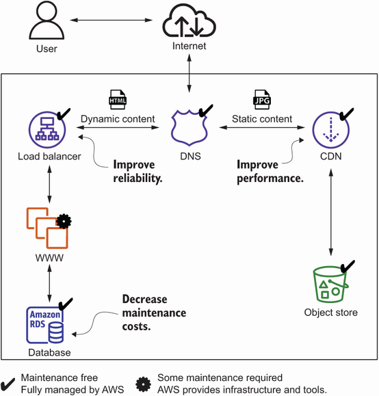


**Figure: A cloud application is a composition of managed responsibilities.**

**How to read it:** Trace the request from user-facing entry point through traffic distribution, compute, and durable data.

**Why it matters:** It shows AWS as service composition rather than only remote servers.

**How to apply it:** Use it to ask which responsibilities are custom code and which are delegated to AWS services.

**Limitations:** It omits IAM, deployment, backups, observability, and failure testing, so it is not a full production architecture.

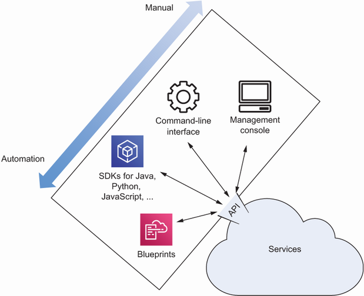


**Figure: AWS resources are managed through APIs.**

**How to read it:** Console, CLI, SDKs, and blueprints are different interfaces to service APIs.

**Why it matters:** Automation and auditability depend on using programmable interfaces.

**How to apply it:** Prefer templates and pipelines for long-lived environments; reserve console actions for exploration or emergency inspection.

**Limitations:** The diagram does not cover all tools such as CDK or Terraform, but the API principle still applies.

## 3. Deep Concept Notes

### AWS API-Driven Infrastructure

- **Explanation:** Manual infrastructure changes are hard to reproduce, peer review, audit, and roll back. API-driven infrastructure makes environments rebuildable and lets teams reason about dependencies before AWS mutates resources.

- **Problem solved:** Prevents unreproducible environments, undocumented dependencies, and unreviewed production mutations.

- **How it works:** A principal authenticates, calls a service API, AWS authorizes the action, and resources change state. CloudFormation adds dependency ordering, stack lifecycle, parameters, and outputs.

- **Why it matters:** The concept affects scalability, reliability, security, cost, maintainability, and operational recovery.

- **When to use:** Use templates for anything that must survive beyond an experiment: VPCs, security groups, IAM roles, databases, queues, alarms, Lambda functions, load balancers, and container services.

- **When not to use:** Do not automate blind experiments before understanding the resource lifecycle, and do not put fast-changing application data or secrets directly into templates.

- **Tradeoffs:** IaC improves repeatability and reviewability, but updates can replace resources, fail halfway, or leave retained resources. Teams need stack ownership, parameters, change review, and rollback procedures.

- **Common mistakes:** Automation creates new risks: wrong region, wrong parameters, missing permissions, resource replacement, and stack drift. Use change sets, stack events, drift detection, non-production deploys, and retention policies for data resources.

- **Production example:** A team defines VPC, security groups, ALB, ECS service, RDS subnet group, IAM roles, SQS queue, and CloudWatch alarms in reviewed templates so staging and production differ by parameters, not memory.

- **Questions to ask:** What owns this resource? What dependencies must exist first? Could an update replace data? What outputs do other systems consume? Who can change it outside the template?

### EC2 Virtual Machines

- **Explanation:** Some workloads need VM-level control, existing packages, background daemons, specialized instance families, or migration compatibility that higher-level services cannot provide immediately.

- **Problem solved:** Provides a compatibility path for workloads that need host/runtime control while making explicit the operations burden that comes with that control.

- **How it works:** An instance boots from an AMI, runs in a subnet, attaches storage/network interfaces/security groups, and receives workload identity through an instance profile. Stop, start, terminate, resize, and recover have different consequences.

- **Why it matters:** The concept affects scalability, reliability, security, cost, maintainability, and operational recovery.

- **When to use:** Use EC2 for legacy software, custom agents, special instance families, and workloads that cannot yet fit Lambda or containers. Build with AMIs/templates and Session Manager rather than manual SSH when possible.

- **When not to use:** Do not choose EC2 just because it is familiar when Lambda, App Runner, ECS/Fargate, RDS, DynamoDB, S3, or another managed service can remove host ownership without losing required control.

- **Tradeoffs:** EC2 gives control and compatibility, but increases patching, AMI management, bootstrap, scaling, monitoring, access, and recovery work.

- **Common mistakes:** Common failures include snowflake instances, public SSH, state on local disks, no patch process, no logs, orphan Elastic IPs, and Spot interruptions without checkpointing.

- **Production example:** A Jenkins or legacy app server starts on EC2, but its durable data moves to EBS/EFS/RDS/S3 and the instance is launched from a template with an IAM role and health monitoring.

- **Questions to ask:** Is the instance stateless? Can it be rebuilt? Where are logs and patches handled? What happens on host failure? Why is VM control required?

### IAM And Account Security

- **Explanation:** Cloud workloads need precise authorization for humans, automation, EC2, Lambda, ECS tasks, and managed services without spreading long-lived credentials.

- **Problem solved:** Prevents credential sprawl and overbroad access from turning one compromised principal into account-wide compromise.

- **How it works:** AWS evaluates the principal, requested action, target resource, conditions, and explicit denies. Roles are preferred for AWS resources because credentials are temporary and delivered by AWS.

- **Why it matters:** The concept affects scalability, reliability, security, cost, maintainability, and operational recovery.

- **When to use:** Use root only for account-level break-glass tasks, MFA/federation for humans, and roles for EC2, Lambda, and ECS tasks. Scope policies from actual workflows.

- **When not to use:** Do not use root for routine work, do not put IAM user keys into workloads where roles are available, and do not keep broad policies after exploration.

- **Tradeoffs:** Least privilege reduces blast radius but requires action/resource discovery, testing, conditions, and debugging when denied actions appear.

- **Common mistakes:** Overbroad policies speed early experiments but become blast radius. Validate with CloudTrail, IAM policy simulation, and tests for both allowed and denied actions.

- **Production example:** An ECS task role allows only `s3:GetObject` on a configuration bucket prefix and `dynamodb:PutItem` on one table, while the deployment role has separate CloudFormation permissions.

- **Questions to ask:** Which principal performs each API call? Are credentials temporary? Is there an explicit deny or condition? Can CloudTrail prove expected behavior?

### VPC, Subnets, Routes, Security Groups, And NAT

- **Explanation:** Applications need controlled reachability so public users can enter through intended edges while backend and data tiers remain private.

- **Problem solved:** Prevents unintended reachability between the internet, application tiers, data tiers, and AWS service endpoints.

- **How it works:** Resources launch into subnets. Public subnets route to an internet gateway; private subnets do not expose direct inbound internet paths. Security groups restrict source/destination by protocol and port.

- **Why it matters:** The concept affects scalability, reliability, security, cost, maintainability, and operational recovery.

- **When to use:** Design from a traffic matrix. Put ALBs in public subnets and app/data resources in private subnets. Allow backend traffic from source security groups, not the whole internet.

- **When not to use:** Do not put databases or backend instances in public subnets for convenience; do not use network isolation as a substitute for IAM, TLS, authentication, and application authorization.

- **Tradeoffs:** Segmentation improves blast-radius control but adds route, NAT, endpoint, subnet, and security-group debugging complexity and can add cross-AZ or NAT cost.

- **Common mistakes:** Misconfigurations include public databases, `0.0.0.0/0` admin ports, missing NAT/endpoints for patching, route table mix-ups, and assuming private subnet means no outbound risk.

- **Production example:** An internet-facing ALB sits in public subnets; app tasks sit in private subnets; RDS accepts only the app security group; S3/DynamoDB access goes through endpoints or controlled egress.

- **Questions to ask:** Which subnet is public? Which resources have public IPs? What exact source reaches each port? How does private compute reach AWS APIs?

### Lambda And Event-Driven Automation

- **Explanation:** Operational tasks such as checks, tagging, cleanup, and event reaction are often short, bursty, and not worth a managed server fleet.

- **Problem solved:** Removes always-on servers for short operational reactions while preserving a controlled event, permission, and observability path.

- **How it works:** A trigger sends an event payload. Lambda runs handler code with an execution role, emits logs/metrics, and may retry depending on event source. VPC attachment changes network reachability.

- **Why it matters:** The concept affects scalability, reliability, security, cost, maintainability, and operational recovery.

- **When to use:** Use it for schedules, lightweight APIs, event response, log processing, and operational glue. Deploy with SAM/CloudFormation and attach alarms and log retention.

- **When not to use:** Avoid Lambda for long-running jobs, heavy local state, runtimes outside limits, protocols needing persistent connections, or workflows where retries cannot be made safe.

- **Tradeoffs:** Lambda reduces host operations and scales quickly, but shifts complexity to timeouts, concurrency, retries, event payloads, IAM roles, VPC networking, and observability.

- **Common mistakes:** Failure modes include missing IAM actions, no alarm on errors, event loops, throttling, duplicate events, bad VPC routing, and handlers that are not idempotent.

- **Production example:** A CloudTrail/EventBridge rule invokes Lambda when EC2 instances launch; the function reads the event principal and tags the instance owner with a narrowly scoped role.

- **Questions to ask:** What invokes it? Can the event repeat? Is the handler idempotent? What role is assumed? Which metric or log proves success?

### Storage Service Selection

- **Explanation:** Application state is not one thing: blobs, block devices, shared files, relational records, cache entries, messages, and key-value items have different access and recovery needs.

- **Problem solved:** Prevents state from being placed in a service whose durability, sharing, query, or performance model does not match the workload.

- **How it works:** Each service has a different data abstraction, failure scope, consistency/performance model, and cost curve. The book teaches this through separate chapters rather than one universal storage pattern.

- **Why it matters:** The concept affects scalability, reliability, security, cost, maintainability, and operational recovery.

- **When to use:** Start from questions: blob or queryable record, single writer or shared, relational joins or key access, strict consistency or eventual tolerance, single-AZ or multi-AZ, backup/RPO needs.

- **When not to use:** Do not pick a storage service by popularity. Avoid using S3 as a low-latency mutable filesystem, cache as accidental source of truth, or DynamoDB for unknown ad hoc query workloads.

- **Tradeoffs:** Managed storage removes server operations but imposes service-specific semantics, limits, consistency, backup behavior, performance profiles, and cost models.

- **Common mistakes:** Wrong choices create deep problems: S3 used like POSIX, DynamoDB designed like SQL, EFS used as a database, cache treated as source of truth, critical data put on instance store.

- **Production example:** A media app stores uploaded files in S3, job state in DynamoDB, relational billing data in RDS, hot session data in Redis, and only temporary scratch data on local/container storage.

- **Questions to ask:** What are the read/write paths? Is data shared? What is acceptable data loss? Are queries relational or key-based? How is access audited?

### RDS Managed Relational Databases

- **Explanation:** Teams need relational transactions and SQL without self-managing database hosts, storage, patching, backups, and common availability mechanics.

- **Problem solved:** Provides relational database capability with managed infrastructure while keeping schema, access, performance, and recovery decisions visible.

- **How it works:** RDS runs a database engine with instance/storage choices, automated and manual snapshots, security groups, parameter choices, Multi-AZ failover, read replicas, and CloudWatch metrics.

- **Why it matters:** The concept affects scalability, reliability, security, cost, maintainability, and operational recovery.

- **When to use:** Use RDS when relational integrity, SQL, transactions, and mature database tooling matter. Enable backups and Multi-AZ according to RTO/RPO; add read replicas for read-heavy workloads.

- **When not to use:** Do not choose RDS for simple key-value workloads at massive scale, unbounded connection fan-out, or workloads whose availability/cost needs conflict with relational design.

- **Tradeoffs:** RDS reduces infrastructure work but does not remove schema design, migration discipline, query tuning, connection pooling, backup/restore, credential rotation, and failover testing.

- **Common mistakes:** Restore creates a new DB rather than overwriting existing data. Multi-AZ is not the same as read scaling. Test reconnect behavior during failover.

- **Production example:** A WordPress or business application uses RDS MySQL/PostgreSQL in private subnets, automated backups, Multi-AZ for availability, read replicas for read pressure, and alarms on CPU, storage, connections, and latency.

- **Questions to ask:** What RTO/RPO is required? How are migrations run? Can the app reconnect after failover? Are backups restored regularly?

### DynamoDB Access-Pattern Design

- **Explanation:** Key-based workloads need managed scale without running database clusters, but that scale depends on choosing keys and indexes from known queries.

- **Problem solved:** Prevents high-scale key-value workloads from collapsing into scans, hot partitions, and expensive indexes.

- **How it works:** Items have attributes and are addressed by partition key plus optional sort key. GSIs copy selected attributes into another key structure. Reads may be eventually consistent depending on mode and index.

- **Why it matters:** The concept affects scalability, reliability, security, cost, maintainability, and operational recovery.

- **When to use:** Use it for key-value/document workloads with predictable queries and scale needs. Write queries before designing the table. Monitor throttles and hot partitions.

- **When not to use:** Do not use DynamoDB when the product requires many ad hoc relational queries, joins, broad scans, or access patterns that are unknown and likely to change unpredictably.

- **Tradeoffs:** DynamoDB reduces operations and can scale strongly, but forces up-front access-pattern thinking, index cost, hot-partition avoidance, item-size awareness, and consistency decisions.

- **Common mistakes:** Common failures are low-cardinality partition keys, scans in request paths, unplanned GSIs, stale-read surprises, and relational thinking carried into NoSQL.

- **Production example:** A to-do service stores tasks with `user_id` as partition key and task/date/category access through sort keys or GSIs, then rejects request-path scans during review.

- **Questions to ask:** What are every read and write query? Which keys have high cardinality? Which reads need strong consistency? Which GSI projections are necessary?

### Caching With ElastiCache And MemoryDB

- **Explanation:** Databases or APIs can become too slow or expensive for repeated reads, sessions, counters, leaderboards, or derived views.

- **Problem solved:** Reduces repeated backend work and read latency without pretending cache consistency is free.

- **How it works:** Lazy loading fills cache on miss; write-through updates cache during writes. Redis and Memcached differ in data structures, replication, persistence, clustering, and operational behavior. MemoryDB adds Redis-compatible persistence.

- **Why it matters:** The concept affects scalability, reliability, security, cost, maintainability, and operational recovery.

- **When to use:** Use cache after measuring backend pressure or when a workload clearly has hot reads/session data/rate counters. Alarm on evictions, memory, CPU, latency, connections, and replication lag.

- **When not to use:** Do not add cache before understanding the bottleneck, and do not rely on a non-durable cache as source of truth unless the selected service and business semantics support it.

- **Tradeoffs:** Caching can cut latency and load, but introduces stale data, invalidation, cache stampede, memory sizing, replication lag, and fallback behavior.

- **Common mistakes:** Failures include stale data, cache stampede, hot keys, no TTL, no fallback path, and using non-durable cache as system of record unintentionally.

- **Production example:** A discussion platform keeps durable posts in RDS, hot/session data in Redis, and monitors hit rate, evictions, memory pressure, CPU, command latency, and replication lag.

- **Questions to ask:** Is stale data acceptable? What invalidates values? What happens on cache miss or outage? Which metric proves the cache helps?

### High Availability, RTO, RPO, And Service Scope

- **Explanation:** A system cannot be called highly available until its failure domains, state placement, recovery time, and acceptable data loss are explicit.

- **Problem solved:** Turns vague availability goals into concrete failure-domain, recovery-time, and data-loss decisions.

- **How it works:** Some resources are AZ-bound, some regional/multi-AZ, and some global. RTO is time to recover; RPO is acceptable data loss. These numbers choose architecture patterns.

- **Why it matters:** The concept affects scalability, reliability, security, cost, maintainability, and operational recovery.

- **When to use:** List every dependency and scope. Spread stateless compute across AZs, use managed multi-AZ/regional state where needed, and test failover.

- **When not to use:** Do not build multi-region or multi-AZ complexity before requirements justify it, but also do not claim HA when critical state is single-instance or single-AZ.

- **Tradeoffs:** Higher availability raises cost and complexity through duplicated capacity, managed data options, failover behavior, deployment constraints, and test burden.

- **Common mistakes:** Mistakes include assuming Auto Scaling protects AZ-bound state, relying on private IPs across AZ failover, and never measuring actual RTO/RPO.

- **Production example:** A web tier spans two AZs behind an ALB, stores files in S3/EFS as appropriate, uses RDS Multi-AZ or DynamoDB for state, and measures failover against RTO/RPO.

- **Questions to ask:** Which dependencies are AZ-bound? What is the weakest critical component? How much data loss is acceptable? Has failover been tested?

### Decoupling With ELB And SQS

- **Explanation:** Direct coupling makes callers depend on individual servers and makes slow or bursty work harm user-facing latency.

- **Problem solved:** Reduces direct dependency between callers and workers so capacity and failures can be absorbed at the right boundary.

- **How it works:** ALB routes to healthy targets and Auto Scaling registers replacements. SQS stores messages until workers receive, process, and delete them; duplicates and retries are normal design inputs.

- **Why it matters:** The concept affects scalability, reliability, security, cost, maintainability, and operational recovery.

- **When to use:** Use ALB for request distribution and health checks. Use SQS for slow, bursty, or background work where the user can wait or poll.

- **When not to use:** Do not introduce a queue when users require immediate completion and product semantics cannot tolerate eventual status; do not use a load balancer as a substitute for application correctness.

- **Tradeoffs:** Load balancers preserve synchronous UX but require healthy capacity; queues absorb spikes but add delayed completion, duplicate delivery, poison messages, and state tracking.

- **Common mistakes:** Bad health checks, no DLQ, non-idempotent workers, short visibility timeout, and scaling on the wrong metric are common operational failures.

- **Production example:** An image or screenshot service accepts a request, stores a job, sends an SQS message, lets workers process later, and exposes a status/result endpoint.

- **Questions to ask:** Does the caller need the result now? What is the retry and DLQ policy? Can consumers process duplicates? What metric drives scaling?

### Fault Tolerance And Idempotency

- **Explanation:** Distributed systems fail in ambiguous states: a caller times out after the server performed work, or a worker crashes after side effects but before acknowledgement.

- **Problem solved:** Makes retries and duplicate delivery safe enough that partial failures do not corrupt user-visible state.

- **How it works:** The Imagery example stores job state, puts raw and processed images in S3, queues work in SQS, and uses workers that update durable state after processing. Idempotent operation IDs make retries safe.

- **Why it matters:** The concept affects scalability, reliability, security, cost, maintainability, and operational recovery.

- **When to use:** Design state machines for long-running workflows. Delete queue messages only after durable completion. Use conditional writes, stable IDs, DLQs, and reconciliation.

- **When not to use:** Do not build complex state machines for simple read-only paths, but do not skip idempotency on APIs, workers, or provisioning operations that may retry.

- **Tradeoffs:** Idempotent workflows add state and design effort, but they make retries, duplicate messages, and partial failure survivable. External side effects may still need business compensation.

- **Common mistakes:** External side effects may require a business choice: duplicate action or missing action. Not every operation can be perfectly idempotent without external support.

- **Production example:** The Imagery workflow uses process IDs, DynamoDB state, S3 raw/processed objects, SQS jobs, and workers that update durable state before acknowledging messages.

- **Questions to ask:** What is the operation ID? Which states are legal? Which side effects can repeat safely? How are stuck jobs found and repaired?

### Autoscaling And Metrics

- **Explanation:** Fixed capacity wastes money during quiet periods and fails during peaks; capacity must change from evidence rather than guesswork.

- **Problem solved:** Aligns capacity with demand while avoiding guesswork, idle waste, and overload during peaks.

- **How it works:** Auto Scaling groups use launch templates and desired/min/max capacity. ECS services use desired task counts and scaling policies. CloudWatch alarms or schedules change capacity.

- **Why it matters:** The concept affects scalability, reliability, security, cost, maintainability, and operational recovery.

- **When to use:** Use scheduled scaling for predictable peaks and metric scaling for observed load. Web tiers may scale on request count/latency/CPU; workers often scale on SQS age/depth.

- **When not to use:** Do not autoscale stateful singleton components without externalizing state, and do not scale on a metric unrelated to the actual bottleneck.

- **Tradeoffs:** Autoscaling improves elasticity but introduces warm-up delay, cooldown tuning, quota/capacity dependencies, cost spikes, and downstream overload risk.

- **Common mistakes:** Autoscaling can overload downstream services, oscillate, lag spikes, or increase cost. Set max limits and load test behavior.

- **Production example:** A web tier scales on ALB request/latency or CPU while an SQS worker fleet scales on queue age/depth and respects database/cache limits.

- **Questions to ask:** What metric reflects user pain? How long until new capacity is useful? What max size can dependencies tolerate? How is scale-in made safe?

### Containers, ECS, Fargate, And App Runner

- **Explanation:** Teams need repeatable application packaging without managing every VM as a unique host, while still controlling runtime, IAM, network, logs, and scaling.

- **Problem solved:** Packages applications into replaceable runtime units while moving host management to the right abstraction level.

- **How it works:** A task definition describes image, CPU/memory, ports, roles, environment, logging, and network mode. A service maintains desired tasks, spreads them, integrates health checks, and rolls updates.

- **Why it matters:** The concept affects scalability, reliability, security, cost, maintainability, and operational recovery.

- **When to use:** Use App Runner for simple web containers, ECS/Fargate for controlled services in VPCs, and EC2-backed options when host-level control matters.

- **When not to use:** Do not containerize only to hide stateful or manual practices; avoid App Runner/ECS abstractions when the workload requires host-level control they cannot provide.

- **Tradeoffs:** Containers improve packaging and replacement, Fargate removes host capacity work, and App Runner simplifies web hosting; all still require image hygiene, task roles, secrets, health checks, and observability.

- **Common mistakes:** Container platforms still require IAM, secrets, logs, health checks, image scanning, rollback, network design, and data externalization.

- **Production example:** A note-taking app runs as an ECS/Fargate service with immutable image tags, task role access to S3, CloudWatch logs, ALB health checks, and service autoscaling.

- **Questions to ask:** What belongs in the image versus runtime config? Which role does the task assume? Where are logs and secrets? What is rollback?

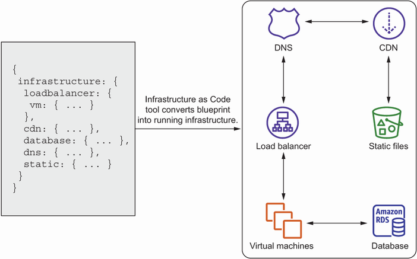


**Figure: Infrastructure automation turns desired state into ordered API calls.**

**How to read it:** Resources depend on other resources; a VM might need a subnet, role, security group, and AMI before launch.

**Why it matters:** Dependency ordering explains many CloudFormation create/update/delete failures.

**How to apply it:** Use references, outputs, and explicit dependencies instead of hidden script assumptions.

**Limitations:** Real stack updates can replace or retain resources, so always inspect change sets for stateful resources.

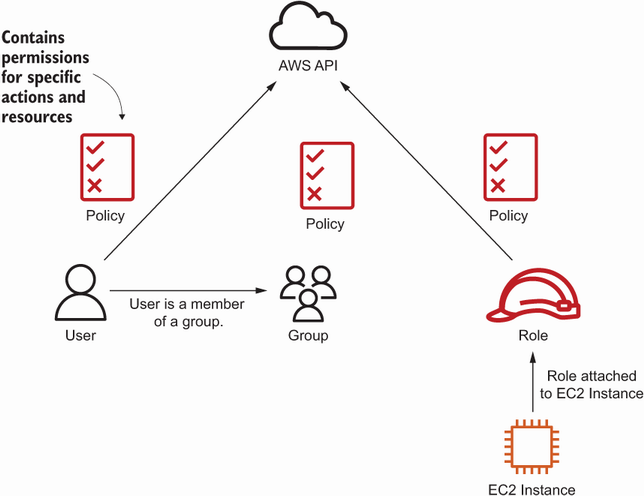


**Figure: IAM separates principals, roles, groups, and policies.**

**How to read it:** Users, groups, roles, and policies combine to grant API permissions.

**Why it matters:** Most workload credentials should be temporary role credentials rather than static keys.

**How to apply it:** Design each workload principal around required API calls and validate with CloudTrail.

**Limitations:** IAM evaluation also includes boundaries, SCPs, resource policies, and explicit denies beyond the simplified picture.

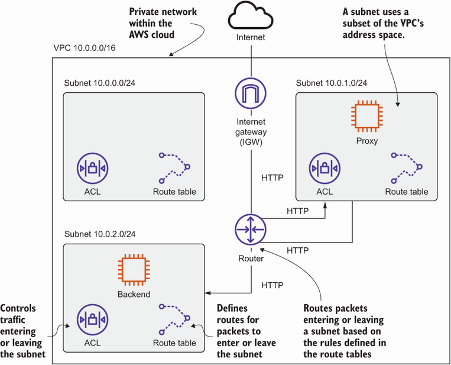


**Figure: Network segmentation protects backend tiers.**

**How to read it:** Public subnets expose entry points; private subnets hold backend resources without direct inbound internet routes.

**Why it matters:** Subnet and route design are security and availability decisions.

**How to apply it:** Start with a traffic matrix, then encode only those paths in route tables and security groups.

**Limitations:** A single-AZ version is not highly available; production usually duplicates subnets across AZs.

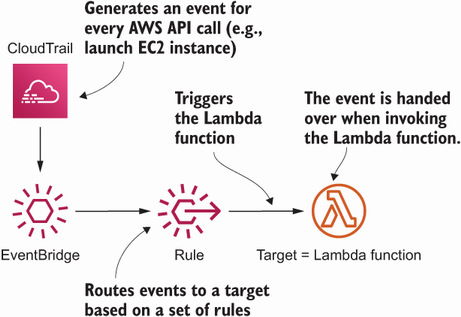


**Figure: AWS API activity can trigger governance automation.**

**How to read it:** An AWS API call emits an event; EventBridge filters it; Lambda reacts with an execution role.

**Why it matters:** This is a reusable pattern for tagging, cleanup, notifications, and lightweight guardrails.

**How to apply it:** Keep event patterns narrow, handlers idempotent, and IAM permissions minimal.

**Limitations:** Events are not synchronous prevention; use IAM/SCP/policy controls for actions that must be blocked upfront.

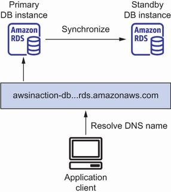


**Figure: RDS Multi-AZ improves database availability.**

**How to read it:** The primary serves traffic; changes replicate to standby; failover updates the endpoint.

**Why it matters:** It reduces database failover work but does not remove application reconnect, backup, and query tuning responsibilities.

**How to apply it:** Enable Multi-AZ where RTO matters and test client behavior during failover.

**Limitations:** Failover is not zero downtime, and DNS/client caching can prolong disruption.

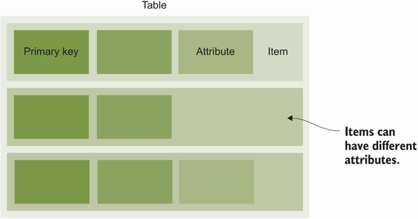


**Figure: DynamoDB design starts with keys and access paths.**

**How to read it:** Items have attributes and are retrieved efficiently through primary keys.

**Why it matters:** If keys do not match application queries, the system falls back to scans or extra indexes.

**How to apply it:** Write production query statements before creating tables and GSIs.

**Limitations:** The picture does not cover single-table design, global tables, streams, TTL, or transactions.

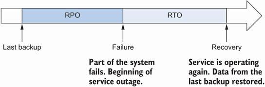


**Figure: Recovery time and data loss are separate objectives.**

**How to read it:** RTO is how long the service may be down; RPO is how much data may be lost.

**Why it matters:** Concrete targets prevent vague availability debates.

**How to apply it:** Set RTO/RPO per journey and data type before choosing HA/DR patterns.

**Limitations:** They do not cover degraded mode, corruption, security incidents, or business process recovery.

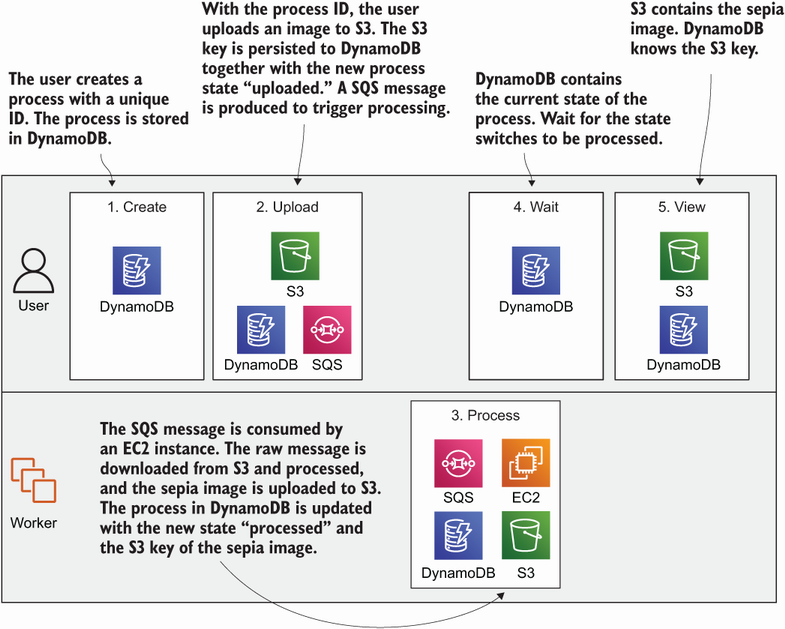


**Figure: Fault-tolerant workflows combine durable state, object storage, queues, and workers.**

**How to read it:** Web servers expose APIs, S3 stores files, DynamoDB stores state, SQS transfers work, and workers process jobs.

**Why it matters:** This is the book's strongest reusable distributed-system pattern.

**How to apply it:** Use it for media processing, document conversion, report generation, and other asynchronous jobs.

**Limitations:** Production needs DLQs, auth, rate limits, validation, encryption, retention, and reconciliation.

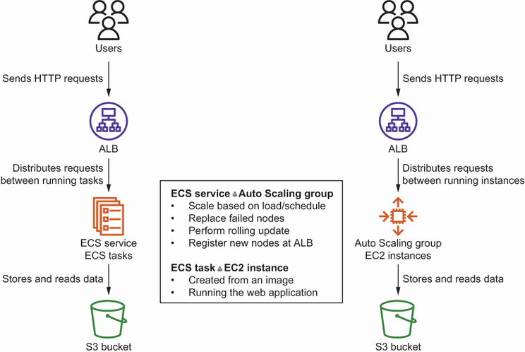


**Figure: ECS services transfer Auto Scaling concepts to tasks.**

**How to read it:** Desired count, health checks, rolling replacement, and AZ distribution remain; the unit changes from VM to task.

**Why it matters:** It lets engineers reuse VM-fleet mental models without managing hosts when using Fargate.

**How to apply it:** Configure desired count, deployment behavior, task roles, load balancer target groups, and autoscaling policies.

**Limitations:** It does not solve state, database scaling, or application compatibility by itself.

## 4. Implementation Patterns And Engineering Practices

### Pattern: Build Infrastructure From Templates

- **Problem it solves:** Manual infrastructure disappears from memory and creates drift.

- **Implementation shape or workflow:** Use CloudFormation/SAM with parameters, resources, outputs, IAM roles, security groups, alarms, and retention policies. Split stacks by lifecycle: network, shared data, app compute.

- **Minimal example or scenario:** A WordPress proof of concept can be one stack; production should separate VPC/data/app and protect RDS/EFS from accidental deletion.

- **Tradeoffs and failure modes:** Template errors, resource replacement, missing capabilities, and drift.

- **Testing or validation approach:** Use change sets, stack events, drift detection, non-production deploys, and deletion/restore tests.

- **Adaptation guidance:** Start narrow, encode the source of truth, add alarms and rollback, then harden after load and failure tests.

### Pattern: Give Workloads Roles, Not Static Keys

- **Problem it solves:** Static credentials leak, age badly, and are hard to rotate.

- **Implementation shape or workflow:** Attach instance profiles to EC2, execution roles to Lambda, and task roles to ECS. Scope actions and resources to the workload.

- **Minimal example or scenario:** A Lambda that tags EC2 instances needs EC2 tagging permissions, not administrator access.

- **Tradeoffs and failure modes:** Access denied during early tightening or overbroad policies left forever.

- **Testing or validation approach:** Exercise expected calls and forbidden calls; inspect CloudTrail.

- **Adaptation guidance:** Start narrow, encode the source of truth, add alarms and rollback, then harden after load and failure tests.

### Pattern: Design Network Access As Tier-to-Tier Flows

- **Problem it solves:** Ad hoc security groups create accidental exposure.

- **Implementation shape or workflow:** Define tiers, sources, destinations, ports, and route needs. Use source security groups for ALB-to-app and app-to-data rules.

- **Minimal example or scenario:** ALB accepts internet HTTPS; app accepts ALB SG; RDS accepts app SG; EFS accepts NFS from app/worker SG.

- **Tradeoffs and failure modes:** Public databases, open admin ports, missing NAT/endpoints, and egress blind spots.

- **Testing or validation approach:** Use target health, VPC Flow Logs, and explicit connectivity tests.

- **Adaptation guidance:** Start narrow, encode the source of truth, add alarms and rollback, then harden after load and failure tests.

### Pattern: Externalize Durable State Before Scaling Compute

- **Problem it solves:** Autoscaling cannot safely replace instances that hold unique local state.

- **Implementation shape or workflow:** Move blobs to S3, relational state to RDS, shared files to EFS, process state to DynamoDB/RDS, and work buffers to SQS.

- **Minimal example or scenario:** Scalable WordPress uses ALB/Auto Scaling for web servers, RDS for database, and EFS for shared files.

- **Tradeoffs and failure modes:** Shared storage or databases can become bottlenecks.

- **Testing or validation approach:** Terminate instances under test traffic and verify no data loss.

- **Adaptation guidance:** Start narrow, encode the source of truth, add alarms and rollback, then harden after load and failure tests.

### Pattern: Make Retries Idempotent

- **Problem it solves:** Distributed calls fail after partial success.

- **Implementation shape or workflow:** Use operation IDs, conditional writes, state transitions, deterministic outputs, and queue acknowledgement only after durable completion.

- **Minimal example or scenario:** Imagery jobs use process IDs, S3 objects, DynamoDB state, and SQS messages.

- **Tradeoffs and failure modes:** Duplicate external side effects and stuck partial states.

- **Testing or validation approach:** Inject duplicate messages and worker crashes; validate final state.

- **Adaptation guidance:** Start narrow, encode the source of truth, add alarms and rollback, then harden after load and failure tests.

### Pattern: Scale On Backpressure

- **Problem it solves:** CPU is not always the bottleneck.

- **Implementation shape or workflow:** Choose metrics that represent user pain: ALB latency/request count, SQS age/depth, DB connections, cache evictions, Lambda throttles.

- **Minimal example or scenario:** Workers processing screenshots scale on queue age, not only CPU.

- **Tradeoffs and failure modes:** Oscillation, slow warm-up, database overload, runaway cost.

- **Testing or validation approach:** Load test, review scaling activity, and protect downstream limits.

- **Adaptation guidance:** Start narrow, encode the source of truth, add alarms and rollback, then harden after load and failure tests.

### Pattern: Use Rebuildable Deployment Artifacts

- **Problem it solves:** Mutable servers drift and are hard to roll back.

- **Implementation shape or workflow:** Use CodeDeploy for legacy in-place updates, Packer for immutable AMIs, or containers plus ECS/Fargate for image-based delivery.

- **Minimal example or scenario:** Build an AMI, update launch template, roll Auto Scaling group behind ALB health checks.

- **Tradeoffs and failure modes:** Bad hooks, stale images, no rollback, secrets baked into images.

- **Testing or validation approach:** Deploy from scratch in staging and test rollback.

- **Adaptation guidance:** Start narrow, encode the source of truth, add alarms and rollback, then harden after load and failure tests.

## 5. Code, Configuration, And Workflow Notes

The source contains many commands and templates. The snippets below are compact teaching excerpts rather than reproduced listings.

### CloudFormation Security Group Shape
```yaml
Resources:
  BackendSecurityGroup:
    Type: AWS::EC2::SecurityGroup
    Properties:
      GroupDescription: Allow HTTP from load balancer only
      VpcId: !Ref VPC
      SecurityGroupIngress:
        - IpProtocol: tcp
          FromPort: 80
          ToPort: 80
          SourceSecurityGroupId: !Ref LoadBalancerSecurityGroup
```
This solves direct backend exposure by tying ingress to the load balancer tier. Validate by confirming ALB target health succeeds while direct internet access to backend instances fails.

### RDS Backup Workflow
```bash
aws rds modify-db-instance --db-instance-identifier app-db --backup-retention-period 7 --preferred-backup-window 03:00-04:00
aws rds create-db-snapshot --db-instance-identifier app-db --db-snapshot-identifier app-db-before-migration
```
This sets a backup window and creates a manual checkpoint before risky change. Restore creates a new database instance, so validation must include application cutover and measured restore time.

### DynamoDB Conditional Write Shape
```javascript
await dynamodb.putItem({
  TableName: "Tasks",
  Item: { uid: { S: "emma" }, tid: { S: "task-001" } },
  ConditionExpression: "attribute_not_exists(uid) AND attribute_not_exists(tid)"
});
```
This makes duplicate creation explicit and supports idempotent API behavior. Validate with duplicate requests and by checking consumed capacity and throttles under load.

### SQS Consumer Acknowledgement Shape
```javascript
for (const message of messages) {
  const job = JSON.parse(message.Body);
  await processJobIdempotently(job.id);
  await sqs.deleteMessage({ QueueUrl, ReceiptHandle: message.ReceiptHandle });
}
```
The delete happens after durable completion. Test duplicates, slow jobs, worker crashes, visibility timeout, DLQ routing, and queue age alarms.

### ECS Task Definition Shape
```yaml
TaskDefinition:
  Type: AWS::ECS::TaskDefinition
  Properties:
    RequiresCompatibilities: [FARGATE]
    NetworkMode: awsvpc
    Cpu: "512"
    Memory: "1024"
    TaskRoleArn: !GetAtt TaskRole.Arn
    ContainerDefinitions:
      - Name: app
        Image: example/app:1.2.3
        PortMappings:
          - ContainerPort: 3000
        LogConfiguration:
          LogDriver: awslogs
```
This captures the container runtime contract. Avoid mutable `latest` tags, secrets in images, missing logs, and overbroad task roles.

## 6. Testing, Validation, And Verification

| What To Validate | Why It Matters | Method | Good Signal | Warning Sign |
|---|---|---|---|---|
| CloudFormation lifecycle | Infrastructure must be repeatable and reversible. | Change sets, stack events, drift detection, non-prod rebuild. | Stack reaches complete state; outputs correct. | Rollback loops or stateful replacement surprises. |
| IAM least privilege | Limits blast radius. | Test allowed/denied calls, CloudTrail, policy simulator. | Workload can do only expected actions. | Administrator policies or static keys. |
| Network paths | Security depends on actual reachability. | Traffic matrix, target health, VPC Flow Logs, connectivity tests. | Required paths work and forbidden paths fail. | Public DB, open admin ports. |
| EC2 rebuildability | Instances fail. | Terminate test instance, let Auto Scaling replace. | Replacement joins service automatically. | Manual SSH setup required. |
| Lambda operations | Serverless still fails. | Test payloads, CloudWatch logs/metrics/alarms, DLQ. | Errors alarm and logs identify event. | Silent throttles/errors. |
| RDS recovery | Backups matter only if restorable. | Restore snapshot and test app cutover. | Restore meets RTO/RPO. | Backup exists but restore is untested. |
| DynamoDB model | Keys must match queries. | Run query set, load test key distribution. | No hot partitions or scans in hot paths. | Throttles and expensive scans. |
| Cache effectiveness | Cache can create stale-data bugs. | Hit rate, latency, evictions, memory, replication lag. | Backend load drops without evictions. | Stale results or memory pressure. |
| Queue workers | SQS is at-least-once. | Duplicate messages, crash tests, DLQ tests. | Final state remains correct. | Duplicate side effects. |
| Deployment rollback | Bad releases happen. | Staging deploy, health-gated rollout, rollback drill. | Bad version stops receiving traffic. | Health check passes while app is broken. |
| Autoscaling | Capacity must track demand safely. | Load test, scaling activity, downstream metrics. | Scale-out/in predictable. | Oscillation or downstream overload. |
| ECS/Fargate service | Container config is production runtime. | Task logs/events, ALB health, task role tests. | Desired count stable. | Crash loops, image pull failures, no logs. |

## 7. Chapter-by-Chapter Knowledge Extraction

### Chapter 1 What is Amazon Web Services?

- **Main engineering lesson:** AWS is API-accessible infrastructure plus managed services, not just remote servers.

- **Key concepts introduced:** Managed services, global infrastructure, automation, flexible capacity, reliability, cost, Free Tier, billing alerts, console/CLI/SDK/blueprints.

- **Mechanisms, workflows, or examples:** Web shop, Java EE app, HA system, and batch processing examples show capacity and managed-service tradeoffs.

- **Design decisions and tradeoffs:** Set budgets before experiments; use automation for reproducibility; treat cost as a design input.

- **Production risks:** Unmonitored spend, root user misuse, service sprawl, and console-only changes.

- **How to evaluate whether it works:** Budget alerts, tags, CloudTrail, MFA, and resource cleanup.

- **Connection to other chapters:** This chapter either builds foundational service mechanics or feeds later architecture patterns for security, state, deployment, availability, decoupling, and scaling.

- **Self-check question:** Can you explain the service behavior, failure mode, and validation path without reopening the book?

### Chapter 2 A simple example: WordPress in 15 minutes

- **Main engineering lesson:** A realistic app quickly becomes a multi-service system.

- **Key concepts introduced:** CloudFormation stack, EC2 web servers, load balancer, RDS MySQL, EFS, stack outputs, cleanup.

- **Mechanisms, workflows, or examples:** The WordPress proof of concept separates web compute, relational state, shared files, and traffic entry point.

- **Design decisions and tradeoffs:** Use quick stacks for learning, then add security, backups, HA, observability, and deployment process before production.

- **Production risks:** Tutorial resources left running, weak passwords, missing backups, public exposure.

- **How to evaluate whether it works:** Stack events, ALB health, RDS/EFS inspection, cost estimate, and stack deletion.

- **Connection to other chapters:** This chapter either builds foundational service mechanics or feeds later architecture patterns for security, state, deployment, availability, decoupling, and scaling.

- **Self-check question:** Can you explain the service behavior, failure mode, and validation path without reopening the book?

### Chapter 3 Using virtual machines: EC2

- **Main engineering lesson:** EC2 gives control but requires lifecycle and operations ownership.

- **Key concepts introduced:** AMI, instance type, Session Manager, logs, CloudWatch metrics, stop/terminate, resize, regions, Elastic IP, network interfaces, Savings Plans, Spot.

- **Mechanisms, workflows, or examples:** Launch a VM, connect with Session Manager, inspect logs, resize, move region, add IP/interface, optimize cost.

- **Design decisions and tradeoffs:** Use EC2 when VM control is required; make instances rebuildable and keep state external when possible.

- **Production risks:** Snowflake instances, unpatched OS, public SSH, local-only state, orphan IPs.

- **How to evaluate whether it works:** Rebuild from template/AMI, SSM works, metrics/logs exist, termination is safe.

- **Connection to other chapters:** This chapter either builds foundational service mechanics or feeds later architecture patterns for security, state, deployment, availability, decoupling, and scaling.

- **Self-check question:** Can you explain the service behavior, failure mode, and validation path without reopening the book?

### Chapter 4 Programming your infrastructure

- **Main engineering lesson:** Infrastructure should be described, reviewed, and changed through APIs and templates.

- **Key concepts introduced:** CLI, SDK, CloudFormation, parameters, resources, outputs, updates, dependency ordering.

- **Mechanisms, workflows, or examples:** The toy JIML example clarifies why CloudFormation must order dependent resources.

- **Design decisions and tradeoffs:** Use CloudFormation for durable resources and expose outputs for dependent stacks/tools.

- **Production risks:** Wrong region, missing IAM capability, stack drift, replacement of stateful resources.

- **How to evaluate whether it works:** Change sets, stack events, outputs, drift detection, non-prod recreation.

- **Connection to other chapters:** This chapter either builds foundational service mechanics or feeds later architecture patterns for security, state, deployment, availability, decoupling, and scaling.

- **Self-check question:** Can you explain the service behavior, failure mode, and validation path without reopening the book?

### Chapter 5 Securing your system

- **Main engineering lesson:** Security is layered across responsibility, patching, account access, IAM, network rules, and VPC design.

- **Key concepts introduced:** Shared responsibility, SSM Patch Manager, root MFA, IAM policies/roles, ARNs, security groups, VPC, public/private subnets, NAT.

- **Mechanisms, workflows, or examples:** Proxy/backend network design allows only proxy-to-backend HTTP and keeps backend private.

- **Design decisions and tradeoffs:** Use roles for workloads, root only for emergencies, and source-security-group rules for tiers.

- **Production risks:** Broad IAM, public databases, open admin ports, missing patching, NAT/route errors.

- **How to evaluate whether it works:** IAM tests, CloudTrail, MFA status, reachability tests, patch compliance.

- **Connection to other chapters:** This chapter either builds foundational service mechanics or feeds later architecture patterns for security, state, deployment, availability, decoupling, and scaling.

- **Self-check question:** Can you explain the service behavior, failure mode, and validation path without reopening the book?

### Chapter 6 Automating operational tasks with Lambda

- **Main engineering lesson:** Lambda is strong for small event-driven operations when monitored and permissioned correctly.

- **Key concepts introduced:** Serverless, schedules, CloudWatch logs/metrics/alarms, VPC access, EventBridge, SAM, execution roles, limits.

- **Mechanisms, workflows, or examples:** Scheduled website health check and CloudTrail-driven EC2 owner tagging.

- **Design decisions and tradeoffs:** Use Lambda for short automation; design event patterns, IAM, retry, and alarms explicitly.

- **Production risks:** No alarms, overbroad role, VPC timeouts, duplicate events, cost spikes.

- **How to evaluate whether it works:** Test events, logs, errors, throttles, alarm delivery, IAM denied cases.

- **Connection to other chapters:** This chapter either builds foundational service mechanics or feeds later architecture patterns for security, state, deployment, availability, decoupling, and scaling.

- **Self-check question:** Can you explain the service behavior, failure mode, and validation path without reopening the book?

### Chapter 7 Storing your objects: S3

- **Main engineering lesson:** S3 is object storage, not a filesystem.

- **Key concepts introduced:** Buckets, object keys, metadata, CLI backup, SDK access, static hosting, bucket policies, Block Public Access, prefixes.

- **Mechanisms, workflows, or examples:** Simple gallery app uploads and lists images; static hosting requires deliberate public read policy.

- **Design decisions and tradeoffs:** Use for blobs, backups, logs, and static assets; design keys, lifecycle, and access.

- **Production risks:** Public leaks, poor key design, no lifecycle/encryption, POSIX assumptions.

- **How to evaluate whether it works:** Policy review, access tests, encryption, lifecycle, CloudTrail/access logs.

- **Connection to other chapters:** This chapter either builds foundational service mechanics or feeds later architecture patterns for security, state, deployment, availability, decoupling, and scaling.

- **Self-check question:** Can you explain the service behavior, failure mode, and validation path without reopening the book?

### Chapter 8 Storing data on hard drives: EBS and instance store

- **Main engineering lesson:** Block storage choices depend on persistence, attachment, performance, and recovery.

- **Key concepts introduced:** EBS volumes, volume types, snapshots, instance store, performance testing.

- **Mechanisms, workflows, or examples:** EBS attaches persistent block volumes; instance store is temporary local disk.

- **Design decisions and tradeoffs:** Use EBS for persistent VM disk and instance store only for rebuildable scratch.

- **Production risks:** Critical data on instance store, no snapshots, wrong delete-on-termination.

- **How to evaluate whether it works:** Snapshot/restore drills, performance tests, termination behavior checks.

- **Connection to other chapters:** This chapter either builds foundational service mechanics or feeds later architecture patterns for security, state, deployment, availability, decoupling, and scaling.

- **Self-check question:** Can you explain the service behavior, failure mode, and validation path without reopening the book?

### Chapter 9 Sharing data volumes between machines: EFS

- **Main engineering lesson:** EFS provides shared NFS storage for multiple instances with security and performance choices.

- **Key concepts introduced:** Filesystem, mount targets, security groups, throughput/performance modes, storage classes, AWS Backup.

- **Mechanisms, workflows, or examples:** Mount targets in subnets expose EFS to EC2 clients through security-group-controlled NFS.

- **Design decisions and tradeoffs:** Use for legacy shared files or multi-instance filesystem needs, not as a database.

- **Production risks:** Open NFS, throughput bottlenecks, no backup, concurrency surprises.

- **How to evaluate whether it works:** Mount tests, PercentIOLimit alarms, backup restore, app concurrency tests.

- **Connection to other chapters:** This chapter either builds foundational service mechanics or feeds later architecture patterns for security, state, deployment, availability, decoupling, and scaling.

- **Self-check question:** Can you explain the service behavior, failure mode, and validation path without reopening the book?

### Chapter 10 Using RDS

- **Main engineering lesson:** RDS manages database infrastructure while teams still own database engineering.

- **Key concepts introduced:** DB class/storage, import, snapshots, restore, cross-region copy, IAM management access, security groups, credentials, Multi-AZ, read replicas, metrics.

- **Mechanisms, workflows, or examples:** WordPress uses RDS MySQL; Multi-AZ standby protects availability; read replicas improve read capacity.

- **Design decisions and tradeoffs:** Use RDS for SQL/transactions; test restore and failover; monitor connections/storage/CPU.

- **Production risks:** Public DB, weak credentials, untested backups, connection exhaustion, slow failover.

- **How to evaluate whether it works:** Restore drill, failover drill, CloudWatch metrics, SG/IAM review.

- **Connection to other chapters:** This chapter either builds foundational service mechanics or feeds later architecture patterns for security, state, deployment, availability, decoupling, and scaling.

- **Self-check question:** Can you explain the service behavior, failure mode, and validation path without reopening the book?

### Chapter 11 Caching data in memory

- **Main engineering lesson:** Caches are performance tools with correctness costs.

- **Key concepts introduced:** ElastiCache, MemoryDB, Redis, Memcached, lazy loading, write-through, cluster modes, monitoring, memory, replication.

- **Mechanisms, workflows, or examples:** Discourse stack combines app, RDS, and cache; decision tree diagnoses cache pressure.

- **Design decisions and tradeoffs:** Use cache for hot reads/sessions/rate counters after measuring or where workload clearly fits.

- **Production risks:** Stale data, evictions, hot keys, no fallback, replication lag.

- **How to evaluate whether it works:** Hit rate, memory, evictions, latency, backend load, failover behavior.

- **Connection to other chapters:** This chapter either builds foundational service mechanics or feeds later architecture patterns for security, state, deployment, availability, decoupling, and scaling.

- **Self-check question:** Can you explain the service behavior, failure mode, and validation path without reopening the book?

### Chapter 12 DynamoDB

- **Main engineering lesson:** DynamoDB table design starts with access patterns and keys.

- **Key concepts introduced:** Partition key, sort key, items, attributes, query/filter, GSI, scan, eventual consistency, Local, capacity.

- **Mechanisms, workflows, or examples:** A to-do CLI models users and tasks, adds GSIs for alternate queries, and contrasts with RDS.

- **Design decisions and tradeoffs:** Use for predictable key-based access; avoid scans; test key distribution.

- **Production risks:** Hot partitions, expensive scans, unplanned indexes, stale-read surprises.

- **How to evaluate whether it works:** Representative queries, load tests, consumed capacity, throttles, consistency tests.

- **Connection to other chapters:** This chapter either builds foundational service mechanics or feeds later architecture patterns for security, state, deployment, availability, decoupling, and scaling.

- **Self-check question:** Can you explain the service behavior, failure mode, and validation path without reopening the book?

### Chapter 13 Achieving high availability

- **Main engineering lesson:** Availability depends on failure domains, state placement, RTO/RPO, and service scope.

- **Key concepts introduced:** CloudWatch recovery, Auto Scaling, AZs, EBS AZ scope, EFS state, subnet/AZ mapping, EIP, RTO/RPO.

- **Mechanisms, workflows, or examples:** Jenkins recovery alarm handles host failure; Auto Scaling across AZs changes IP/subnet assumptions.

- **Design decisions and tradeoffs:** Choose recovery patterns by RTO/RPO and move state to services that match the failure domain.

- **Production risks:** State on AZ-bound EBS, fixed private IP assumptions, no failover test.

- **How to evaluate whether it works:** Terminate/failover drills, RTO/RPO measurement, state verification.

- **Connection to other chapters:** This chapter either builds foundational service mechanics or feeds later architecture patterns for security, state, deployment, availability, decoupling, and scaling.

- **Self-check question:** Can you explain the service behavior, failure mode, and validation path without reopening the book?

### Chapter 14 Decoupling with ELB and SQS

- **Main engineering lesson:** Decoupling lets components fail and scale independently.

- **Key concepts introduced:** ALB, listener, target group, health checks, SQS, producers/consumers, URL2PNG, message limitations.

- **Mechanisms, workflows, or examples:** URL screenshot flow becomes asynchronous with SQS producer and worker.

- **Design decisions and tradeoffs:** Use ALB for live request routing and SQS for buffered background work.

- **Production risks:** Bad health checks, no DLQ, duplicate message bugs, visibility timeout mismatch.

- **How to evaluate whether it works:** Target health, duplicate tests, queue age/depth alarms, DLQ redrive.

- **Connection to other chapters:** This chapter either builds foundational service mechanics or feeds later architecture patterns for security, state, deployment, availability, decoupling, and scaling.

- **Self-check question:** Can you explain the service behavior, failure mode, and validation path without reopening the book?

### Chapter 15 Automating deployment

- **Main engineering lesson:** Deployment strategy shapes reliability and rollback.

- **Key concepts introduced:** CodeDeploy, AppSpec hooks, CloudFormation rolling update, Packer AMIs, Auto Scaling rollout.

- **Mechanisms, workflows, or examples:** Etherpad can be deployed in-place, through rolling user-data replacement, or baked into AMIs.

- **Design decisions and tradeoffs:** Choose based on artifact reproducibility, drift tolerance, rollback, and app constraints.

- **Production risks:** Scripts not idempotent, no rollback, secrets in images, bad health checks.

- **How to evaluate whether it works:** Staging deploy, rollback drill, health-gated rollout, artifact version trace.

- **Connection to other chapters:** This chapter either builds foundational service mechanics or feeds later architecture patterns for security, state, deployment, availability, decoupling, and scaling.

- **Self-check question:** Can you explain the service behavior, failure mode, and validation path without reopening the book?

### Chapter 16 Designing for fault tolerance

- **Main engineering lesson:** Fault tolerance combines redundancy with application-level retry and idempotency.

- **Key concepts introduced:** Single points of failure, redundancy, SQS, retry, idempotent inserts, Imagery state machine, S3/DynamoDB/SQS workers.

- **Mechanisms, workflows, or examples:** Imagery creates job state, uploads raw files, queues processing, stores output, and updates status.

- **Design decisions and tradeoffs:** Use stable IDs and state transitions for long-running distributed work.

- **Production risks:** Duplicate side effects, stuck states, deleting queue messages too early, no reconciliation.

- **How to evaluate whether it works:** Crash/duplicate injection, DLQ, state reconciliation, final-state checks.

- **Connection to other chapters:** This chapter either builds foundational service mechanics or feeds later architecture patterns for security, state, deployment, availability, decoupling, and scaling.

- **Self-check question:** Can you explain the service behavior, failure mode, and validation path without reopening the book?

### Chapter 17 Scaling up and down

- **Main engineering lesson:** Autoscaling needs replaceable units and meaningful demand signals.

- **Key concepts introduced:** Launch templates, desired/min/max, scheduled scaling, metric scaling, ALB web scaling, SQS worker scaling.

- **Mechanisms, workflows, or examples:** WordPress scales web servers behind ALB; workers scale on queue pressure.

- **Design decisions and tradeoffs:** Scale on user pain/backpressure and protect downstream services with limits.

- **Production risks:** Oscillation, slow warm-up, database overload, high cost.

- **How to evaluate whether it works:** Load test, scaling activity history, queue drain time, dependency metrics.

- **Connection to other chapters:** This chapter either builds foundational service mechanics or feeds later architecture patterns for security, state, deployment, availability, decoupling, and scaling.

- **Self-check question:** Can you explain the service behavior, failure mode, and validation path without reopening the book?

### Chapter 18 ECS, Fargate, and App Runner

- **Main engineering lesson:** Containers move deployment from host configuration to image plus task/service definition.

- **Key concepts introduced:** Containers vs VMs, App Runner, ECS cluster/task/service, task definition, Fargate, task roles, service autoscaling.

- **Mechanisms, workflows, or examples:** Notea runs on ECS/Fargate and stores data in S3; ECS service behaves like Auto Scaling for tasks.

- **Design decisions and tradeoffs:** Use App Runner for simple web apps; ECS/Fargate for controlled container architecture.

- **Production risks:** No logs, secrets in images, weak health checks, no task role, unscanned images.

- **How to evaluate whether it works:** Task events/logs, ALB health, IAM tests, image rollback, service scaling.

- **Connection to other chapters:** This chapter either builds foundational service mechanics or feeds later architecture patterns for security, state, deployment, availability, decoupling, and scaling.

- **Self-check question:** Can you explain the service behavior, failure mode, and validation path without reopening the book?

## 8. Architecture Decision Guide

| Decision | Choose Option A When | Choose Option B When | Key Tradeoffs | Failure Risks | Questions To Ask |
|---|---|---|---|---|---|
| EC2 vs Lambda | Need OS control, long runtime, legacy software. | Need short event-driven execution. | Control vs serverless operations. | Patch drift vs retries/throttles. | How long does it run and what triggers it? |
| EC2 vs ECS/Fargate | Host-level control or VM compatibility matters. | App can run as stateless container image. | Host control vs orchestration abstraction. | Snowflake VMs vs misconfigured tasks. | Can state be externalized? |
| App Runner vs ECS/Fargate | Simple web container with minimal control needs. | Need VPC/IAM/LB/service control. | Simplicity vs flexibility. | Abstraction limits vs ECS complexity. | What controls are mandatory? |
| S3 vs EBS vs EFS | Need object storage. | Need block disk or shared filesystem. | Object API vs filesystem semantics. | POSIX assumptions, AZ lock-in, EFS bottlenecks. | How is data read, written, and shared? |
| RDS vs DynamoDB | Need SQL, joins, transactions. | Need known key-based access at scale. | Query flexibility vs access-pattern discipline. | Connection/storage bottlenecks vs hot keys/scans. | Can all queries be listed upfront? |
| Cache vs no cache | Measured hot reads or latency pressure. | Backend is adequate and correctness is simpler. | Performance vs consistency and operations. | Stale data, stampede, evictions. | What invalidates cached data? |
| ALB vs SQS | Caller needs immediate response. | Work can complete later. | Synchronous UX vs buffered resilience. | Bad health checks vs duplicate/poison messages. | What is retry behavior? |
| Single-AZ vs Multi-AZ | Experiment or low criticality. | Availability target requires AZ tolerance. | Cost/simplicity vs resilience. | AZ-bound state outage. | What are RTO and RPO? |
| CloudFormation vs console | Learning or emergency inspection. | Long-lived reviewed systems. | Speed vs reproducibility. | Drift and unreviewed change. | Can a fresh environment be rebuilt? |
| CodeDeploy vs Packer vs containers | Existing mutable EC2 fleet. | Need immutable/rebuildable artifact. | Direct update vs artifact repeatability. | Drift, stale images, bad rollback. | What artifact is promoted? |

## 9. System Design Playbooks

### Playbook: Production Web Application

- **Use case or problem type:** HTTP app with user traffic, relational data, static/uploads, and variable load.

- **Baseline architecture:** ALB in public subnets; app compute in private subnets; RDS Multi-AZ for relational state; S3 for objects; CloudWatch logs/metrics/alarms; IAM roles; CloudFormation.

- **Scaling path:** Start with two app instances/tasks across AZs; scale on request count/CPU/latency; add cache for measured hot reads; add read replicas when read pressure is real.

- **Data model considerations:** Identify durable records, blobs, shared files, cached data, and queued work separately; do not let local compute storage become system of record.

- **API or integration considerations:** Use load balancers for synchronous APIs and queues/events for asynchronous or slow work. Define idempotency at boundaries.

- **Reliability/security/observability/cost:** TLS, least privilege, private data stores, backups/restore, ALB health checks, deployment rollback, cost budgets, and runbooks.

- **Common failure modes:** IAM denied actions, blocked network paths, unhealthy targets, stale state, queue backlog, untested restore, and scaling into downstream limits.

- **Evolution path:** Start simple, externalize state, automate infrastructure, add observability, test failure, then increase abstraction or scale only where evidence supports it.

### Playbook: Event-Driven Governance Automation

- **Use case or problem type:** Tagging, health checks, cleanup, notifications, or lightweight policy response.

- **Baseline architecture:** EventBridge or schedule triggers Lambda; Lambda uses scoped role; CloudWatch logs/metrics/alarms capture outcome.

- **Scaling path:** Constrain concurrency and split functions when event sources or permissions diverge.

- **Data model considerations:** Identify durable records, blobs, shared files, cached data, and queued work separately; do not let local compute storage become system of record.

- **API or integration considerations:** Use load balancers for synchronous APIs and queues/events for asynchronous or slow work. Define idempotency at boundaries.

- **Reliability/security/observability/cost:** Narrow event patterns, idempotent handler, retry/DLQ, log event IDs, and alarm on errors.

- **Common failure modes:** IAM denied actions, blocked network paths, unhealthy targets, stale state, queue backlog, untested restore, and scaling into downstream limits.

- **Evolution path:** Start simple, externalize state, automate infrastructure, add observability, test failure, then increase abstraction or scale only where evidence supports it.

### Playbook: Asynchronous Media Processing

- **Use case or problem type:** User uploads a file, system processes it, user gets result later.

- **Baseline architecture:** API creates job ID/state; raw file in S3; SQS message; workers process; result in S3; DynamoDB/RDS state; status API.

- **Scaling path:** Scale workers on queue age/depth; split queues by priority; add DLQ and redrive.

- **Data model considerations:** Identify durable records, blobs, shared files, cached data, and queued work separately; do not let local compute storage become system of record.

- **API or integration considerations:** Use load balancers for synchronous APIs and queues/events for asynchronous or slow work. Define idempotency at boundaries.

- **Reliability/security/observability/cost:** Idempotency, conditional state transitions, object validation, encryption, retention, DLQ, and reconciliation jobs.

- **Common failure modes:** IAM denied actions, blocked network paths, unhealthy targets, stale state, queue backlog, untested restore, and scaling into downstream limits.

- **Evolution path:** Start simple, externalize state, automate infrastructure, add observability, test failure, then increase abstraction or scale only where evidence supports it.

### Playbook: Legacy App Modernization To Containers

- **Use case or problem type:** EC2 app should move toward image-based deployment.

- **Baseline architecture:** Container image, ECS task definition, Fargate service in private subnets, ALB, task role, logs, externalized state.

- **Scaling path:** Start with desired count 2; add CPU/request scaling; split background workers into separate services.

- **Data model considerations:** Identify durable records, blobs, shared files, cached data, and queued work separately; do not let local compute storage become system of record.

- **API or integration considerations:** Use load balancers for synchronous APIs and queues/events for asynchronous or slow work. Define idempotency at boundaries.

- **Reliability/security/observability/cost:** Secrets management, immutable tags, health checks, rollback to prior task definition, image scanning, and dependency limits.

- **Common failure modes:** IAM denied actions, blocked network paths, unhealthy targets, stale state, queue backlog, untested restore, and scaling into downstream limits.

- **Evolution path:** Start simple, externalize state, automate infrastructure, add observability, test failure, then increase abstraction or scale only where evidence supports it.

## 10. Operating, Troubleshooting, And Debugging

| Symptom | Likely Cause | How To Investigate | Fix | Prevention |
|---|---|---|---|---|
| CloudFormation rollback | Bad parameter, permission, dependency, quota | Stack events and CloudTrail | Correct template/permissions/quota | Change sets and non-prod tests |
| EC2 unreachable | SG/route/public IP/SSM/OS issue | Status checks, SGs, routes, SSM inventory | Fix access path; use Session Manager | Avoid public SSH and template networking |
| ALB target unhealthy | Bad health path, app down, SG blocks ALB | Target health reason, logs, curl, SGs | Fix readiness endpoint and SGs | App-level health checks |
| Lambda timeout or error | Bad code, downstream timeout, IAM denied | Logs, metrics, X-Ray/traces if used, CloudTrail | Fix handler, timeout, role, network | Alarms and test events |
| Private endpoint unreachable | Wrong VPC/subnet/route/SG/DNS | VPC config, route tables, DNS, logs | Attach correct subnets/SG, NAT/endpoints | Dependency traffic matrix |
| S3 access denied | IAM/bucket/KMS/block-public mismatch | Policy review, CloudTrail, KMS key policy | Align principal/resource policies | Automated bucket guardrails |
| RDS connection failures | SG, credentials, DNS, DB down, pool exhaustion | RDS events, metrics, app logs | Fix SG/creds/pool/instance size | Connection alarms and failover tests |
| DynamoDB throttling | Hot key, insufficient capacity, scans | Throttle metrics and request keys | Redesign key/index or capacity mode | Access-pattern load test |
| Cache evictions | Memory pressure or bad TTL | Evictions, memory, hit rate | Resize/shard/compress/change TTL | Cache alarms and key review |
| SQS backlog grows | Workers down/slow, poison messages, bad scaling | Queue age/depth, worker logs, DLQ | Scale/fix workers/redrive | DLQ and queue-age alarms |
| Duplicate side effects | Non-idempotent retry/consumer | Job IDs, state records, logs | Add conditional writes and idempotency | Duplicate-message tests |
| Autoscaling oscillates | Noisy metric or bad cooldown | Scaling activity and metrics | Tune policy/warmup/cooldown | Load test scaling |
| ECS task crash loop | Bad image/config/role/secrets/sizing | ECS stopped reason, task logs | Fix task definition/image | Staged deploy and rollback |
| Unexpected bill | Forgotten resources, NAT, snapshots, data transfer | Cost Explorer, tags, resource inventory | Delete/resize/lifecycle | Budgets, tags, cleanup process |

Debugging order: check recent changes, entry point health, compute health, IAM denies, network reachability, state dependency metrics, queue/cache pressure, scaling events, and cost/quota limits. Validate fixes with the user-facing signal that failed, not only resource status.

## 11. Applying This Knowledge To Existing Systems

| Review Area | What To Inspect | Why It Matters | Good Looks Like | Warning Signs | Improvement Options |
|---|---|---|---|---|---|
| Source of truth | Stacks, templates, tags, owners | Prevents drift | IaC owns resources; tags identify owner/env/cost | Console-only resources | Import/recreate in templates |
| Failure domains | Region/AZ/subnet/resource scope | Reveals hidden SPOFs | Critical paths match RTO/RPO | Single-AZ state under multi-AZ compute | Move state or document acceptance |
| State placement | Local disk, DB, object, queue, cache | Determines recovery | Durable state in managed stores with backups | Important files on instance disk | Externalize and test replacement |
| Human access | Root, IAM users, MFA, federation | Account compromise risk | Root locked, MFA/federation, break-glass | Root daily use, long-lived keys | Adopt federation and rotate keys |
| Workload access | Roles and policies | Limits blast radius | Scoped EC2/Lambda/ECS roles | Administrator workload role | Tighten policies from observed calls |
| Network exposure | SGs, routes, public IPs, NACLs | Controls reachability | Tier-to-tier SG refs; private data | Public DB/admin ports | Rebuild from traffic matrix |
| Backups | RDS/EFS/EBS/S3/DynamoDB strategy | Recovery confidence | Restore tested against RTO/RPO | Retention only, no restore | Schedule drills |
| Async workflows | SQS, workers, DLQ, state | Retries and duplicates are normal | Idempotent consumers and DLQ | Exactly-once assumptions | Add state machine and tests |
| Observability | Logs, metrics, alarms, runbooks | Incident evidence | Symptom-based alarms and clear logs | Dashboards only | Add alerts and runbooks |
| Cost | Budgets, tags, lifecycle, idle resources | Prevents waste | Owner tags and budgets | Unowned resources | Cleanup, lifecycle, right-size |

## 12. Applying This Knowledge To New Systems

Start with requirement discovery: user journeys, RTO/RPO, data types, access patterns, identities, traffic shape, compliance, cost ceiling, deployment frequency, and operational ownership. Then choose the simplest AWS abstractions that satisfy those constraints.

New-system baseline: account budget/MFA/CloudTrail/tags; VPC with public entry and private compute/data; least-privilege roles; compute chosen from App Runner, ECS/Fargate, Lambda, or EC2; state placed in S3/RDS/DynamoDB/EFS/cache based on access pattern; SQS for asynchronous work; CloudFormation/SAM as source of truth; logs/metrics/alarms/runbooks; backups/restore tests; rollback path; cost guardrails.

| Maturity Stage | Architecture Shape | Add Before Next Stage |
|---|---|---|
| Prototype | Single stack, managed services, budget alert | IAM hardening, cleanup, basic logs |
| MVP | ALB/app/data split, private subnets, backups | IaC review, alarms, restore tests, deployment pipeline |
| Production | Multi-AZ, least privilege, observability, rollback | Load testing, failure drills, runbooks, cost governance |
| Growth | Autoscaling, queues, cache, replicas/indexes | Dependency limits, DLQ/reconciliation, performance tuning |
| Platform maturity | Containers/serverless, shared templates, policy checks | Continuous compliance, multi-account design, standardized operations |

## 13. Technology Mapping

| Concept Or Need | Technology Option | When To Use | Watch Outs | Alternatives |
|---|---|---|---|---|
| VM compute | EC2 | OS control, legacy apps, special instances | Patching, AMIs, state | ECS/Fargate, App Runner, Lambda |
| IaC | CloudFormation/SAM | AWS-native lifecycle | Replacement, drift | CDK/Terraform/Pulumi (**Inference**) |
| Serverless code | Lambda | Short event-driven functions | Timeout, retry, concurrency | ECS task, EC2 worker |
| Event routing | EventBridge/CloudTrail | AWS API events/schedules | Delay/duplicates | SQS/SNS |
| Object storage | S3 | Blobs, static sites, backups, logs | Public access, lifecycle | EFS, EBS |
| Block storage | EBS | Persistent EC2 disk | AZ scope, snapshots | Instance store, EFS |
| Shared filesystem | EFS | Multi-instance NFS | Throughput, NFS security | S3, app redesign |
| Relational DB | RDS | SQL, transactions, managed engines | Connections, failover | DynamoDB, self-managed DB |
| Cache | ElastiCache | Hot data and backend offload | Evictions, stale data | App cache, DB tuning |
| Durable Redis API | MemoryDB | Redis-compatible persistence | Cost/model fit | DynamoDB, RDS, ElastiCache |
| NoSQL | DynamoDB | Known key access at scale | Hot keys, scans | RDS, other NoSQL (**Inference**) |
| Synchronous decoupling | ALB/NLB | Live request routing | Health checks | API Gateway (**Inference**) |
| Async decoupling | SQS | Buffered background work | Duplicates, DLQ | SNS/EventBridge/Kinesis (**Inference**) |
| VM deployment | CodeDeploy | Existing EC2 fleet | Agents/scripts/drift | Packer, containers |
| Immutable VM | Packer AMI | Reproducible EC2 images | Rebuild cadence | Containers |
| Containers | ECS | AWS-native orchestration | Task/service complexity | EKS, App Runner |
| Serverless containers | Fargate | Containers without host management | Sizing/cost/quotas | EC2-backed ECS |
| Simple web container | App Runner | Minimal control web apps | Abstraction limits | ECS/Fargate |
| Monitoring | CloudWatch | AWS logs/metrics/alarms | Alarm design | Third-party observability (**Inference**) |
| Scaling | Auto Scaling / ECS Service Auto Scaling | Variable compute demand | Wrong metric/cooldown | Scheduled/manual capacity |

## 14. Production Readiness And Delivery Checklist

- Infrastructure source of truth exists and stack boundaries match lifecycle boundaries.

- Root user is MFA-protected and unused for daily work; privileged access is federated or tightly controlled.

- Workloads use roles with scoped policies; static keys are removed or justified.

- Public ingress terminates at an edge/load balancer; backend and data tiers are private.

- EC2 can be rebuilt, containers use immutable images, and Lambda functions have timeouts, logs, and alarms.

- RDS/EFS/EBS backups and restore tests exist; S3 buckets have explicit access, encryption, and lifecycle decisions.

- RTO/RPO are documented and matched to AZ/service scope.

- Queue consumers and retried APIs are idempotent; DLQs and reconciliation are defined.

- Deployment rollback is tested and health checks prove application readiness.

- Logs, metrics, alarms, dashboards, and runbooks cover entry, compute, data, queue, cache, and deployment paths.

- Autoscaling metrics represent real pressure and max limits protect dependencies and cost.

- Patch/image rebuild cadence and vulnerability scanning exist for long-lived runtimes.

- Budgets, tags, idle cleanup, lifecycle rules, right-sizing, and data-transfer awareness are in place.

- Incident responders know how to inspect CloudFormation, ALB health, CloudWatch, CloudTrail, RDS events, SQS DLQs, and ECS events.


## 15. Knowledge Gaps And Further Study

- Current AWS prices, limits, runtimes, defaults, and service behavior may differ from the 2023 edition; verify current docs before production.

- Application security is not deeply covered; study OWASP ASVS, OWASP Top 10, secure SDLC, threat modeling, dependency scanning, and secret management.

- Multi-account governance with AWS Organizations, Control Tower, SCPs, account vending, and centralized security needs separate study.

- Advanced networking such as Transit Gateway, PrivateLink, hybrid connectivity, DNS architecture, IPv6, and endpoint policies is not covered deeply.

- Observability beyond CloudWatch basics needs SLOs, distributed tracing, OpenTelemetry, correlation, and incident-management practice.

- DynamoDB single-table design, RDS migration strategy, cache stampede protection, and consistency modeling need hands-on labs beyond the source.

- Production container platforms need image scanning, registry promotion, secrets, blue/green deployment, service discovery, and runtime security beyond the introductory ECS/Fargate chapter.

- Resilience engineering requires failure injection, restore drills, chaos/game-day practice, and dependency-degradation design.


## 16. Practice Exercises

1. **Exercise:** Turn the chapter 2 WordPress stack into a production plan. Strong answer: Multi-AZ, RDS/EFS backups, private subnets, TLS, IAM roles, patching, deployment, monitoring, and cost controls.

2. **Exercise:** Design least-privilege IAM for an app that reads S3, writes logs, and reads DynamoDB. Strong answer: principals, actions, resources, conditions, and CloudTrail validation.

3. **Exercise:** Build a VPC traffic matrix for ALB, app, worker, RDS, Redis, EFS, S3, and AWS APIs. Strong answer: inbound/outbound flows, routes, SG sources, and blocked paths.

4. **Exercise:** Design DynamoDB keys for a to-do app before creating tables. Strong answer: all access patterns, partition/sort keys, GSI rationale, consistency choices, and scan avoidance.

5. **Exercise:** Write an RDS restore drill. Strong answer: snapshot, restore target, credential/endpoint cutover, validation queries, DNS/client behavior, and measured RTO.

6. **Exercise:** Debug stale profile data in a cache. Strong answer: TTL, invalidation, lazy/write-through behavior, stale tolerance, and metrics.

7. **Exercise:** Test an SQS worker with duplicate messages and crash after partial completion. Strong answer: idempotency key, conditional state update, visibility timeout, DLQ, and final-state check.

8. **Exercise:** Choose autoscaling metrics for web and worker tiers. Strong answer: ALB request/latency, CPU, SQS depth/age, dependency limits, and cooldown behavior.

9. **Exercise:** Compare CodeDeploy, Packer AMI, and ECS/Fargate for a legacy app. Strong answer: artifact reproducibility, rollback, health checks, secrets, drift, and migration path.

10. **Exercise:** Design a Lambda that tags new EC2 instances from CloudTrail events. Strong answer: event pattern, IAM role, idempotency, retries, alarms, and audit evidence.

11. **Exercise:** Map service availability scope for ALB, EC2, EBS, RDS, S3, SQS, and DynamoDB. Strong answer: weakest critical dependency and recovery options.

12. **Exercise:** Move an EC2 app to ECS/Fargate. Strong answer: image, task definition, task role, secrets, logs, ALB, desired count, scaling, externalized state, and rollback.

13. **Exercise:** Run a cost cleanup review after tutorials. Strong answer: stacks, Elastic IPs, NAT, EBS/snapshots, RDS, EFS, S3, Lambda logs, and budgets.

14. **Exercise:** Investigate ALB 5xx spike. Strong answer: recent deploys, target health, logs, SGs, compute health, dependency metrics, and rollback criteria.

15. **Exercise:** Design an Imagery-like async workflow. Strong answer: job states, S3 raw/output, SQS schema, worker idempotency, state store, DLQ, alarms, and status API.


## 17. Quick Reference

| Term | Meaning |
|---|---|
| Region | Geographic AWS area containing multiple Availability Zones. |
| Availability Zone | Isolated data-center grouping inside a region; many subnets/resources are AZ-bound. |
| VPC | Regional private network boundary. |
| Subnet | IP range inside a VPC tied to one AZ. |
| Security group | Stateful resource-level firewall. |
| IAM role | Assumable identity for workloads, services, or federated principals. |
| ARN | Amazon Resource Name identifying AWS resources. |
| CloudFormation stack | Lifecycle unit for template-managed AWS resources. |
| AMI | Machine image used to launch EC2 instances. |
| EBS | Persistent block storage for EC2, scoped to an AZ. |
| Instance store | Temporary local EC2 host storage. |
| EFS | Managed shared NFS filesystem. |
| S3 object | Blob addressed by bucket and key with metadata. |
| RDS Multi-AZ | Managed database availability pattern with standby/failover. |
| DynamoDB partition key | Key used to distribute and retrieve items. |
| GSI | DynamoDB secondary index for another access pattern. |
| SQS visibility timeout | Period during which a received message is hidden before retry. |
| RTO | Maximum acceptable recovery time after failure. |
| RPO | Maximum acceptable data loss window after failure. |
| Task definition | ECS runtime configuration for one or more containers. |
| Fargate | Serverless compute for containers without managing EC2 hosts. |

Rules of thumb: keep infrastructure in templates; use roles not static keys; put public entry at load balancers/edge services; externalize durable state before scaling compute; choose storage by access pattern; design queues with idempotency and DLQs; define RTO/RPO before HA; scale on pressure metrics; test restore and rollback; treat cost, observability, and security as architecture requirements.

Common anti-patterns: root user daily use, administrator workload roles, public databases, accidental public S3, manual EC2 snowflakes, critical state on local disk, DynamoDB scans in request paths, cache without invalidation/alarms, non-idempotent queue workers, autoscaling into database overload, weak health checks, untested backups, and no budget alerts.

Critical questions: What is the source of truth? Which principal can do which action? Which subnets/security groups carry traffic? Where is durable state? What happens if an instance, AZ, function, queue worker, database, or cache fails? What metric proves users are healthy? What is rollback? What is monthly cost at idle/normal/peak? Which 2023-era assumptions need current verification?
