# AWS Cookbook Knowledge

**Document Name:** AWS Cookbook

**Author:** John Culkin and Mike Zazon, O'Reilly Media, 2021

**Domain:** AWS implementation recipes, networking, databases, containers, AWS CLI, CDK-based setup, validation, cleanup, troubleshooting, and operational safety.

**How to Use:** Use this file as a practical AWS implementation playbook. Start with the mental models, then study the recipe workflows by domain. Use the command patterns, validation checks, cleanup notes, troubleshooting tables, and production checklist when adapting the recipes to real environments.

## 1. Learning Roadmap

Study the AWS Cookbook as a set of implementation drills that teach how AWS resources behave when they are created, connected, validated, and cleaned up.

1. **Prepare the workstation and account context.** The recipes assume AWS CLI access, region/account awareness, helper scripts, environment variables, and CDK-generated baseline stacks. Before adapting any recipe, confirm identity with `aws sts get-caller-identity`, select the target region, and understand which resources the recipe creates.
2. **Learn networking first.** The networking recipes teach the substrate every other AWS workload depends on: VPCs, subnets, route tables, internet gateways, NAT gateways, security group references, Reachability Analyzer, load balancers, prefix lists, VPC endpoints, Transit Gateway, VPC peering, and CloudFront with S3.
3. **Learn database operational patterns next.** The database recipes focus on Aurora Serverless, IAM authentication, RDS Proxy for Lambda, RDS storage encryption, Secrets Manager password rotation, DynamoDB autoscaling, DMS migration, and the Aurora Data API.
4. **Learn container delivery after the platform pieces are clear.** The container recipes cover ECR image lifecycle, vulnerability scanning, Lightsail containers, AWS Copilot, blue/green deployments, ECS autoscaling, EventBridge-triggered Fargate tasks, and ECS log capture.
5. **Always include validation and cleanup.** This book is unusually useful because it includes validation steps and cleanup. Treat those as part of the recipe, not optional appendix work.

Foundational recipes to study first:

- `1.1` VPC creation and CIDR management.
- `1.2` subnet tiers and route tables.
- `1.3` internet gateway routing.
- `1.4` NAT gateway egress from private subnets.
- `1.5` security group references.
- `1.6` Reachability Analyzer.
- `2.1` Aurora Serverless database creation.
- `2.3` RDS Proxy with Lambda.
- `3.1` ECR build/tag/push.
- `3.4` AWS Copilot deployment.

Advanced recipes:

- `1.9` S3 gateway VPC endpoint with endpoint policy.
- `1.10` Transit Gateway transitive cross-VPC routing.
- `1.12` CloudFront distribution for S3 static content.
- `2.5` automated password rotation.
- `2.7` database migration with DMS.
- `3.5` blue/green container deployments.
- `3.6` ECS service autoscaling.
- `3.7` EventBridge-triggered Fargate task.

Fast path:

- For network troubleshooting, read `Deep Concept Notes` on VPC routing, security groups, endpoints, Transit Gateway, and Reachability Analyzer, then use `Operating, Troubleshooting, And Debugging`.
- For database operations, read the RDS/Aurora, RDS Proxy, secrets rotation, DynamoDB autoscaling, and DMS sections.
- For container delivery, read the ECR, Copilot, blue/green, autoscaling, EventBridge, and logs sections.
- For real implementation, use `Code, Configuration, And Workflow Notes`, `Testing, Validation, And Verification`, and `Production Readiness And Delivery Checklist`.

After studying, a reader should be able to:

- Build and validate basic AWS network topologies safely.
- Explain route-table, gateway, endpoint, and security group behavior.
- Use AWS CLI/CDK workflows without losing track of created resources.
- Apply database security and scaling patterns such as IAM auth, RDS Proxy, encryption, secret rotation, and autoscaling.
- Build, scan, deploy, update, scale, trigger, and observe containerized workloads on AWS.
- Translate cookbook recipes into production-safe runbooks with validation and cleanup.

## 2. Core Mental Models

| Mental Model | Explanation | Helps Solve | Example | Common Misuse |
|---|---|---|---|---|
| Recipes are executable architecture decisions | Each recipe does more than create resources; it chooses network boundaries, routing, identity, exposure, scaling, and cleanup behavior. | Prevents cargo-cult command execution. | Creating a NAT gateway is also choosing private-subnet egress, Elastic IP cost, route-table changes, and failure behavior. | Copying commands into a shared production account without understanding resource impact. |
| AWS networking is route tables plus policy controls | Connectivity requires routes, targets, and security controls to agree. A resource can exist and still be unreachable. | Explains most VPC failures. | A private instance with a NAT gateway still needs a route to the NAT, SG/NACL egress, DNS, and working NAT state. | Assuming subnet name "public" or "private" controls behavior without route-table inspection. |
| Security groups describe allowed relationships, not just ports | Referencing another security group creates dynamic trust between members of groups. | Reduces brittle IP-based rules. | Allow SSH from one instance SG to another instance SG so instances can change private IPs without rule edits. | Thinking two resources with the same SG can automatically talk without the right self-reference rule. |
| Validation proves the recipe, not successful resource creation | `create-*` commands returning IDs only prove resources exist. Validation commands prove behavior. | Prevents false-positive deployments. | After creating a VPC endpoint policy, test access to the allowed bucket and denied access to another bucket. | Stopping after CloudFormation/CDK deploy succeeds. |
| Cleanup is part of correctness | Cookbook resources can create ongoing cost and name/policy conflicts if not removed. | Keeps labs and experiments safe. | NAT gateways, load balancers, CloudFront distributions, RDS clusters, DMS replication instances, and ECS services can continue charging. | Deleting only the visible resource while leaving routes, policies, Elastic IPs, or generated certificates. |
| Managed service integration creates hidden dependency paths | Lambda to RDS, ALB to containers, EventBridge to Fargate, and CloudFront to S3 all depend on IAM, networking, service state, and target health. | Helps debug cross-service recipes. | RDS Proxy works only when Lambda networking, proxy target registration, database credentials, and IAM permissions are all correct. | Troubleshooting only application code when the failure is IAM or network path. |
| Least privilege appears in small details | Endpoint policies, IAM database auth, secret rotation, ECR scanning, prefix lists, and security group references all narrow access. | Turns lab recipes into production patterns. | Restricting an S3 gateway endpoint policy to one bucket prevents private subnet workloads from reaching arbitrary S3 buckets through that endpoint. | Using wildcard access because it makes validation pass faster. |
| Containers require supply-chain and runtime controls | Building and pushing an image is not enough. Images need tagging, scanning, deployment strategy, autoscaling, event triggers, and log capture. | Makes container delivery operable. | ECR scan-on-push finds vulnerabilities before the image reaches ECS. | Treating ECR as only a Docker registry and ignoring scan results, tags, and lifecycle. |
| CDK helper stacks are scaffolding, not magic | The recipes often use CDK to create baseline resources, then use AWS CLI to mutate and validate them. | Helps adapt recipes safely. | A recipe may deploy VPCs and instances through CDK, then create a security group or endpoint via CLI. | Destroying resources out of order or editing generated infrastructure without understanding dependencies. |
| Cookbook recipes need production hardening | The book optimizes for learning; production needs IaC, naming, tagging, encryption, budgets, rollback, monitoring, and change control. | Prevents lab patterns from becoming fragile production systems. | A self-signed certificate in a load-balancer recipe teaches HTTPS redirection but production should use ACM-managed certificates. | Copying lab certificate, CIDR, or cleanup assumptions into production. |

## 3. Deep Concept Notes

### Workstation, Identity, Region, And Environment Variables

- **Explanation:** The recipes repeatedly establish AWS account identity, region, generated resource IDs, and shell environment variables before creating resources.
- **Problem solved:** AWS CLI workflows are stateful at the shell level. A wrong account, region, variable, or profile can create resources in the wrong place or delete the wrong resource.
- **How it works:** Commands such as `aws sts get-caller-identity` verify account context. Helper scripts and CDK deployments export resource IDs such as `VPC_ID`, `SUBNET_ID`, `SECURITY_GROUP_ID`, or `NAT_GATEWAY_ID`. Later commands reference those IDs.
- **Why it matters:** The biggest operational risk in cookbook execution is not syntax; it is context confusion.
- **When to use:** Use explicit identity and region checks before every lab, migration, or production change.
- **When not to use:** Do not rely on implicit default profile or region for production workflows.
- **Tradeoffs:** Environment variables speed workflows but can become stale. Infrastructure-as-code outputs are safer when managed systematically.
- **Common mistakes:** Reusing variables from a previous recipe; running cleanup in a different region; using a personal default profile; leaving generated resources after failure.
- **Production example:** A production runbook should begin by printing target account, role, region, stack name, and change ticket, then require confirmation before mutation.
- **Questions to ask:** Which account and region am I in? Which resources were created by this recipe? What cleanup order is required?

A representative source pattern appears throughout the book:

```bash
aws sts get-caller-identity
AWS_ACCOUNT_ID=$(aws sts get-caller-identity --query Account --output text)
```

This snippet solves an operational context problem. It should be adapted into a safe preflight, not treated as sufficient authorization. A production preflight should also check profile, region, permissions boundary, intended stack/environment, and whether the operation is read-only or mutating.

### VPC, CIDR Blocks, Subnets, And Route Tables

- **Explanation:** A VPC creates an isolated network boundary. CIDR blocks define address space. Subnets carve that address space by Availability Zone or tier. Route tables define where traffic for a destination goes.
- **Problem solved:** AWS workloads need deterministic network placement and routing before internet, private, endpoint, or cross-VPC connectivity can work.
- **How it works:** Recipe `1.1` creates a VPC and optionally associates additional CIDR or IPv6 space. Recipe `1.2` creates subnet tiers and route tables, then associates subnets with route tables.
- **Why it matters:** Subnet names do not make subnets public or private. Routes do.
- **When to use:** Use explicit VPC design for any production workload that needs isolation, routing control, private workloads, endpoints, or multi-tier architecture.
- **When not to use:** Avoid ad hoc CIDR choices when future VPC peering, Transit Gateway, hybrid connectivity, or multi-account growth is likely.
- **Tradeoffs:** Smaller CIDRs conserve address space but may constrain growth. More subnet tiers improve isolation but add route-table and security complexity.
- **Common mistakes:** Overlapping CIDRs; route tables not associated with intended subnets; assuming default VPC behavior is production-ready; forgetting to delete route tables or subnets during cleanup.
- **Production example:** A three-tier app may use public subnets for load balancers, private subnets for application services, and isolated subnets for databases, each with different route tables.
- **Questions to ask:** What CIDR supports growth? Which subnets need internet ingress, internet egress, or no internet path? Which route table is associated with each subnet?

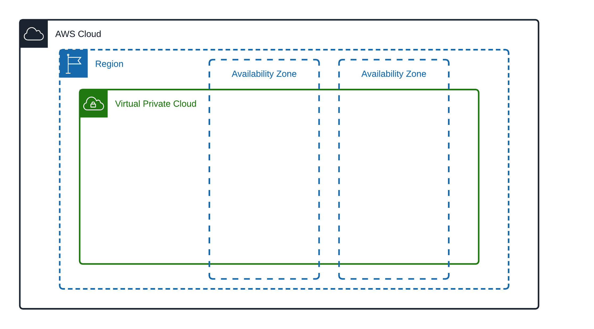

**Figure: VPC deployed in a region.** This diagram shows a VPC as a regional network boundary.

**How to read it:** The VPC spans a region and can contain subnets in multiple Availability Zones.

**Why it matters:** VPC placement and address planning are the foundation for every later recipe.

**How to apply it:** Design VPC CIDRs before creating subnets, peering, endpoints, or transit routing. Keep future account, region, and hybrid connectivity in mind.

**Limitations:** The visual does not show route tables, security groups, NACLs, DNS, endpoints, or account boundaries; those must be designed separately.

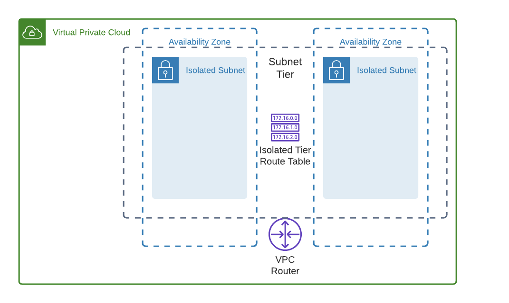

**Figure: Isolated subnet tier and route table.** This diagram shows that isolated subnets depend on route-table behavior.

**How to read it:** A subnet tier with no internet route remains isolated from internet ingress/egress.

**Why it matters:** Isolation is a routing property. Security groups alone do not create private architecture.

**How to apply it:** Put databases and internal-only services in isolated/private subnets, then add only the required endpoint or egress path.

**Limitations:** Real workloads also need DNS, security group rules, backup/patch access, and operational access paths.

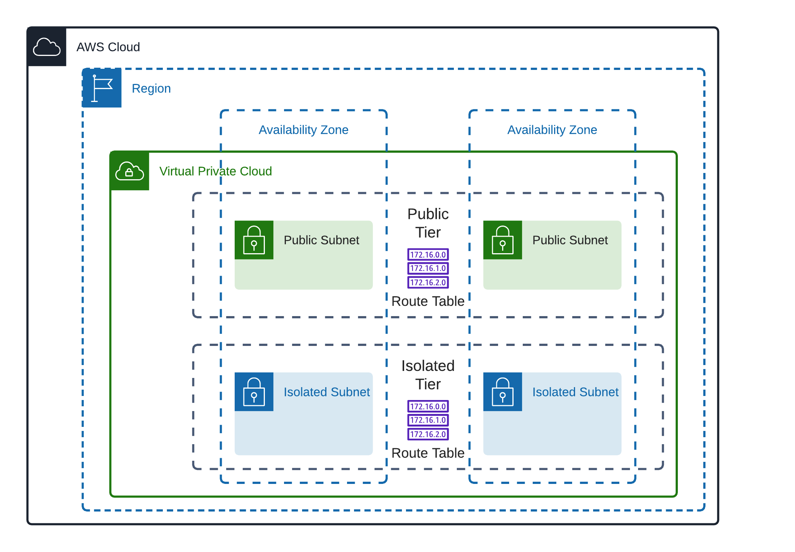

**Figure: Public and isolated subnet tiers across Availability Zones.** This diagram shows the cookbook's practical subnet-tier lesson: if you run two tiers across two Availability Zones, you need four subnets, with route tables defining the behavior of each tier.

**How to read it:** The subnet count grows by tier and Availability Zone. A public tier and an isolated tier in two AZs means two public subnets and two isolated subnets, each associated with the route table that matches the tier's intent.

**Why it matters:** This is the bridge between a toy VPC and a production-shaped network. Multi-AZ design is not only a reliability choice; it also multiplies route-table, CIDR, security group, NAT, endpoint, and cleanup concerns.

**How to apply it:** Decide subnet tiers before choosing CIDR sizes. Allocate enough address space for future workloads, endpoints, and load balancers, then validate every subnet-to-route-table association after deployment.

**Limitations:** The figure teaches subnet layout, not a complete production network. It does not show NAT per AZ, VPC endpoints, flow logs, DNS resolver behavior, or cross-account routing.

### Internet Gateways, NAT Gateways, And Private Egress

- **Explanation:** An internet gateway gives a VPC path to the public internet for resources with public addressing and matching routes. A NAT gateway lets private-subnet resources initiate outbound internet connections without accepting inbound internet connections.
- **Problem solved:** Public workloads need controlled inbound/outbound internet access; private workloads often need outbound access for package repositories, AWS APIs, or external services without direct public exposure.
- **How it works:** Recipe `1.3` attaches an internet gateway and adds default routes in public route tables. Recipe `1.4` allocates an Elastic IP, creates a NAT gateway in a public subnet, and points private route tables at it.
- **Why it matters:** Internet path design is one of the most common sources of accidental exposure and unexpected cost.
- **When to use:** Use internet gateways for public load balancers, bastion-like learning patterns, or explicitly public services. Use NAT gateways for private subnet outbound internet when VPC endpoints are not enough.
- **When not to use:** Do not place private application servers in public subnets just to get outbound access. Avoid NAT gateways for S3/DynamoDB traffic when gateway endpoints can meet the need more privately and often more economically.
- **Tradeoffs:** NAT gateways simplify private egress but cost money and can become AZ/failure-domain design considerations. VPC endpoints reduce public internet dependency but require service-specific policies.
- **Common mistakes:** Missing route to internet gateway or NAT gateway; NAT in one AZ serving private subnets in multiple AZs; forgetting Elastic IP release; no egress restrictions; using public IPs for private workloads.
- **Production example:** Private ECS tasks use NAT for external package downloads and VPC endpoints for S3/ECR/CloudWatch where possible.
- **Questions to ask:** Which subnets require inbound internet? Which only need outbound? Can VPC endpoints replace NAT for AWS service access?

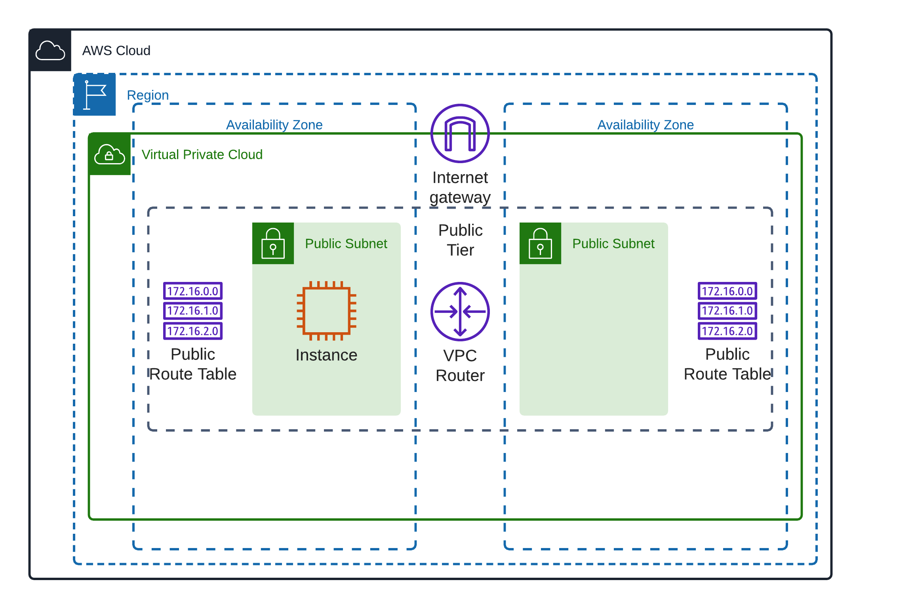

**Figure: Public subnet tier, internet gateway, and route table.** This diagram shows how internet gateway routing makes a subnet public.

**How to read it:** The route table has a default route to the internet gateway.

**Why it matters:** Public architecture is created by route targets and public addressing, not by a subnet label.

**How to apply it:** Keep internet-facing load balancers in public subnets and backend services in private subnets.

**Limitations:** The diagram does not enforce application security. You still need security groups, TLS, WAF where appropriate, logging, and least privilege.

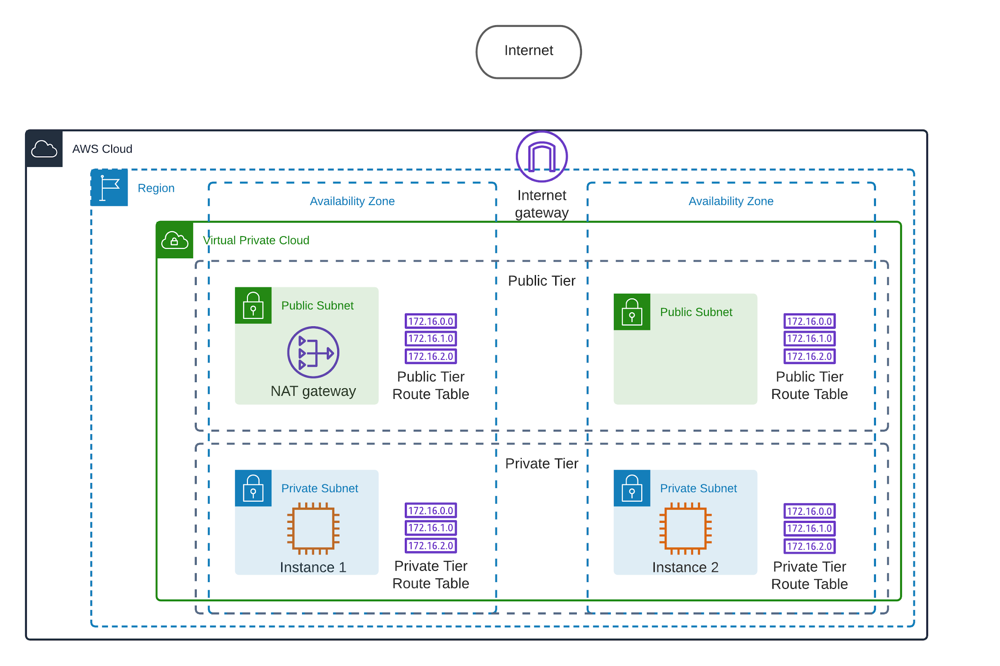

**Figure: Internet access for private subnets through NAT gateways.** This diagram shows private subnet outbound egress through NAT gateways.

**How to read it:** Private route tables point outbound internet traffic to NAT gateways in public subnets.

**Why it matters:** NAT gateways are a common bridge between private workloads and internet dependencies, but they are cost and availability design points.

**How to apply it:** Deploy NAT per AZ for resilient production egress where needed; prefer VPC endpoints for supported AWS services.

**Limitations:** NAT does not provide inbound access, endpoint policy, or fine-grained application egress control by itself.

### Security Group References And Prefix Lists

- **Explanation:** Security groups allow or deny traffic at the resource/elastic network interface level. A security group rule can reference another security group instead of a CIDR. Prefix lists centralize reusable CIDR sets.
- **Problem solved:** Dynamic cloud resources change IPs. Hardcoded IP rules become brittle and hard to audit.
- **How it works:** Recipe `1.5` creates a security group and references it in ingress rules so instances attached to the group can communicate. Recipe `1.8` creates a managed prefix list, adds entries, and references the prefix list in security group rules.
- **Why it matters:** Relationship-based controls scale better than IP-based controls.
- **When to use:** Use security group references for service-to-service access inside a VPC or peered VPC where supported. Use prefix lists for centrally managed ranges used by multiple rules or routes.
- **When not to use:** Avoid broad `0.0.0.0/0` inbound rules except for deliberate public endpoints. Avoid prefix lists when entries are one-off and not reused.
- **Tradeoffs:** Security group references are dynamic but can obscure reachability if not documented. Prefix lists centralize management but require version awareness and update discipline.
- **Common mistakes:** Assuming same-security-group attachment permits traffic automatically; forgetting egress rules; referencing stale prefix list versions; using wide CIDRs for convenience.
- **Production example:** ALB SG allows inbound 443 from the internet; application SG allows inbound only from the ALB SG.
- **Questions to ask:** Is access based on source identity/group or IP range? Who owns prefix list updates? How is rule intent documented?

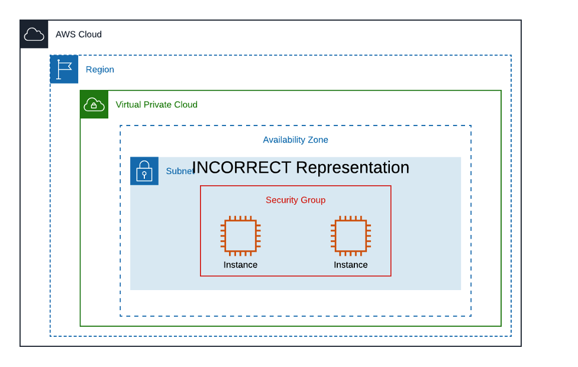

**Figure: Incorrect representation of two instances using the same security group.** This diagram warns against assuming shared security group membership automatically allows communication.

**How to read it:** The same SG on two instances does not itself imply all traffic is allowed; the SG must contain rules that permit the relationship.

**Why it matters:** This misunderstanding causes confusing connectivity failures.

**How to apply it:** Add explicit ingress rules, often source-group references, and validate with connection tests.

**Limitations:** Security groups are only one layer. NACLs, routes, host firewalls, service listeners, and DNS can still block traffic.

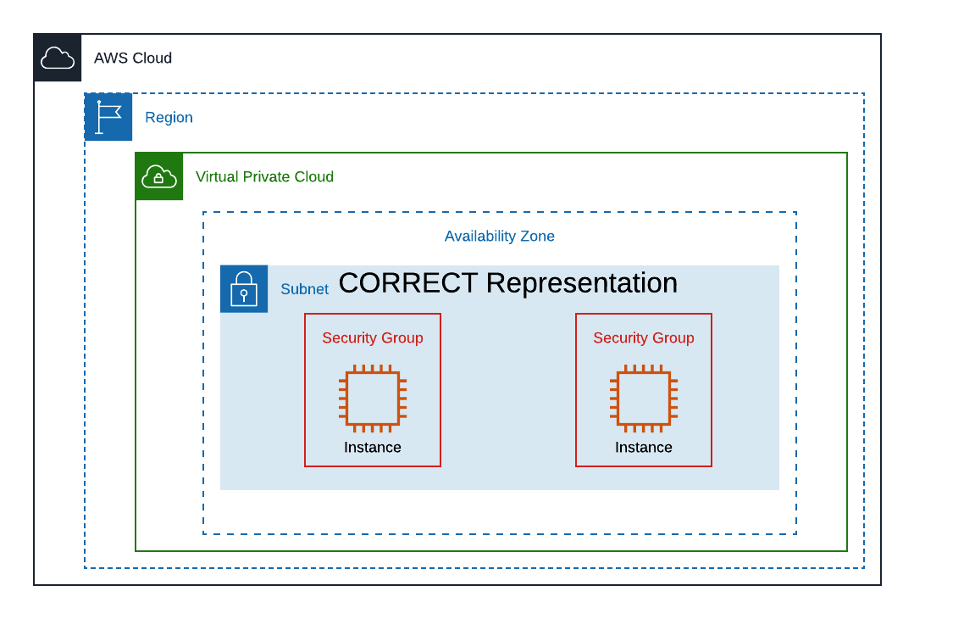

**Figure: Correct visualization of two instances using the same security group.** This diagram shows explicit security group rule behavior.

**How to read it:** Communication is allowed because the security group rule permits traffic from the group.

**Why it matters:** It teaches the difference between group membership and ingress authorization.

**How to apply it:** Prefer source SG references for dynamic private workloads instead of constantly updating IP allowlists.

**Limitations:** Cross-VPC and cross-account support depends on topology and AWS capabilities; verify for the actual design.

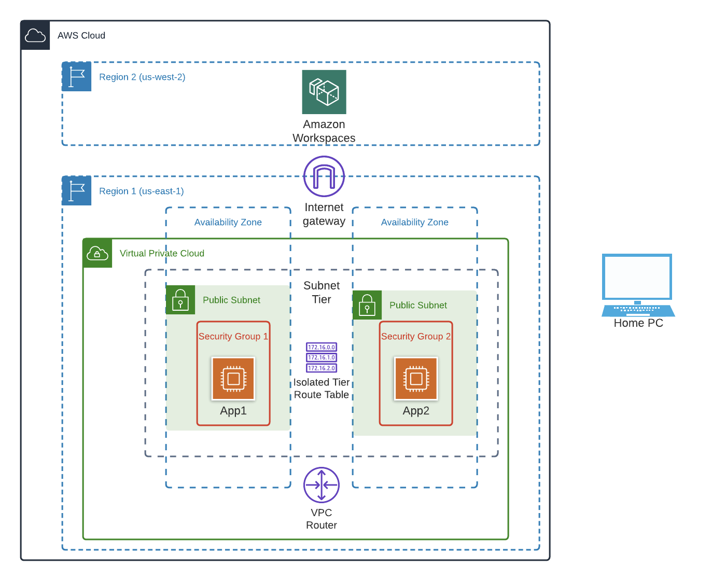

**Figure: Two applications in public subnets protected by security groups.** This diagram supports recipe `1.8`: two independently protected applications need the same managed set of allowed source CIDRs.

**How to read it:** Each application has its own security group, but both can reference the same managed prefix list for allowed HTTP sources.

**Why it matters:** Prefix lists move shared IP-range ownership out of individual security group rules. Updating the prefix list can update access for every rule that references it.

**How to apply it:** Use a customer-managed prefix list for shared corporate ranges, WorkSpaces gateway ranges, partner ranges, or temporary test ranges that must be reused across multiple security groups or route tables.

**Limitations:** A prefix list is still a list of network ranges. It does not identify a user, device posture, or application identity, and broad entries can still create broad exposure.

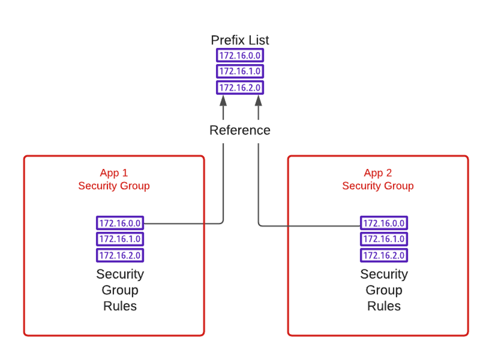

**Figure: Security group rules referencing a prefix list.** This screenshot shows the cookbook's rule shape: security groups allow traffic from the prefix list instead of embedding every CIDR directly.

**How to read it:** The security group rule depends on the prefix list ID and versioned entries. The allowed source set can change without editing every referencing rule.

**Why it matters:** Versioning is the operational feature. The source recipe adds a workstation `/32` for testing, validates access, then challenges the reader to restore the earlier prefix list version so access is removed.

**How to apply it:** Treat prefix-list changes like production access changes: review the diff, record the current version, update entries, validate allowed and denied paths, and keep rollback instructions using `restore-managed-prefix-list-version`.

**Limitations:** Prefix-list rollback restores ranges, not business intent. If a previous version already contained an unsafe CIDR, rollback only returns to that unsafe state.

### VPC Reachability Analyzer

- **Explanation:** Reachability Analyzer evaluates network paths between AWS resources and explains whether traffic can flow.
- **Problem solved:** VPC connectivity can fail due to route tables, security groups, NACLs, gateways, endpoints, or target state. Manual inspection is error-prone.
- **How it works:** Recipe `1.6` creates a network insights path, starts an analysis, inspects results, changes security group rules, and reruns analysis.
- **Why it matters:** It turns network debugging into a repeatable validation workflow.
- **When to use:** Use before and after network changes, during incident response, and as a validation step for critical paths.
- **When not to use:** Do not treat it as the only validation. Application listeners, TLS, authentication, DNS behavior, and runtime health still need testing.
- **Tradeoffs:** Reachability Analyzer is precise for supported network configuration but does not prove application-level success.
- **Common mistakes:** Creating a path with wrong source/destination/port; deleting analysis artifacts late; ignoring runtime service health after network path passes.
- **Production example:** Validate that an ECS task in a private subnet can reach an RDS endpoint on the intended port before application deployment.
- **Questions to ask:** What source, destination, protocol, and port define the critical path? What changed since the last passing analysis?

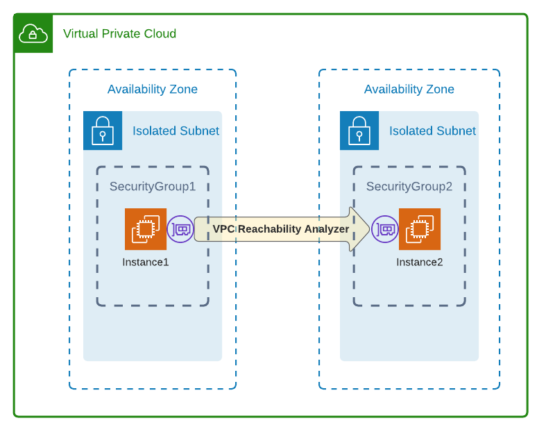

**Figure: VPC Reachability Analyzer.** This screenshot shows AWS network path analysis output.

**How to read it:** The analysis result explains whether a path is reachable and which components affect the path.

**Why it matters:** It gives network engineers a concrete way to debug AWS reachability rather than guessing through route tables and security groups.

**How to apply it:** Include path analysis in network change validation and incident runbooks.

**Limitations:** It does not replace application-layer tests such as `curl`, `nc`, TLS validation, authentication, or health endpoint checks.

### Application Load Balancer HTTPS Redirection

- **Explanation:** An Application Load Balancer can terminate HTTPS, route traffic to target groups, and redirect HTTP to HTTPS.
- **Problem solved:** Public web applications should avoid serving plaintext HTTP and should centralize TLS and routing behavior.
- **How it works:** Recipe `1.7` creates or uses a certificate, creates an ALB security group, creates a load balancer, target group, listener, HTTPS rule, and HTTP redirect listener, then validates with `curl`.
- **Why it matters:** TLS redirection is a production edge-control pattern, but it must be implemented with correct listeners, certificates, target health, and security groups.
- **When to use:** Use ALB for HTTP/HTTPS applications needing path/host routing, redirects, TLS termination, and target health.
- **When not to use:** Do not use a self-signed certificate pattern from a lab for production; use ACM-managed public/private certificates where appropriate.
- **Tradeoffs:** ALB adds managed routing and health checks but has cost and configuration complexity. TLS termination centralizes cert management but requires secure backend traffic decisions.
- **Common mistakes:** Target group unhealthy; listener forwarding to wrong port; HTTP not redirected; certificate mismatch; application SG not allowing ALB source.
- **Production example:** ALB accepts 443 from the internet, redirects 80 to 443, and forwards only from the ALB SG to private container tasks.
- **Questions to ask:** Where is TLS terminated? Are targets healthy? Are backend services private? How is certificate renewal handled?

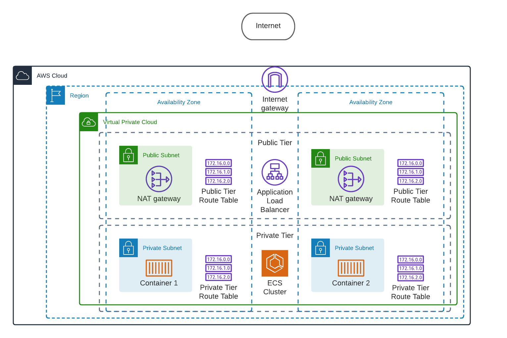

**Figure: VPC with ALB serving internet traffic to containers in private subnets.** This diagram shows public ingress through ALB and private backend tasks.

**How to read it:** Users reach the ALB; the ALB reaches container workloads in private subnets.

**Why it matters:** This is a common production pattern: public entry point, private compute.

**How to apply it:** Permit inbound internet traffic only to the ALB, then permit application traffic from ALB SG to service SG.

**Limitations:** The pattern still needs WAF/rate limiting where appropriate, access logs, TLS policy, deployment safety, and backend health checks.

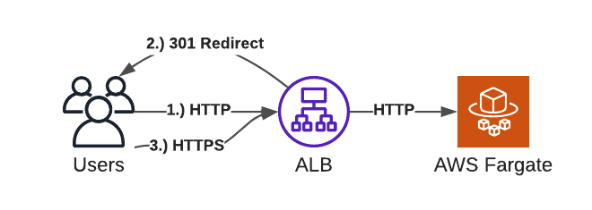

**Figure: Redirecting HTTP to HTTPS with an ALB.** This visual shows HTTP redirection behavior.

**How to read it:** HTTP listener requests are redirected to HTTPS rather than forwarded to the application.

**Why it matters:** Redirecting at the load balancer reduces application responsibility for a common security control.

**How to apply it:** Configure a port 80 listener with redirect action and a port 443 listener with certificate and target forwarding.

**Limitations:** Redirection does not enforce application authentication, secure cookies, HSTS, or end-to-end backend encryption.

### S3 Gateway VPC Endpoints And Endpoint Policies

- **Explanation:** A gateway VPC endpoint for S3 lets private subnet resources access S3 without traversing the public internet. Endpoint policies constrain allowed S3 actions/resources through that endpoint.
- **Problem solved:** Private workloads need S3 access while minimizing public internet dependency and blast radius.
- **How it works:** Recipe `1.9` creates a VPC endpoint for S3, associates route tables, attaches a policy that allows `s3:GetObject` and `s3:PutObject` to a specific bucket, then validates allowed and denied access.
- **Why it matters:** Network path and IAM/resource policy must work together. Endpoint policy is a useful defense-in-depth layer.
- **When to use:** Use S3 gateway endpoints for private VPC workloads that access S3.
- **When not to use:** Do not assume endpoint policy replaces bucket policy, IAM, encryption, or data classification.
- **Tradeoffs:** Endpoints reduce NAT dependency and can improve control, but policy design must be explicit.
- **Common mistakes:** Endpoint route tables not associated; endpoint policy too broad; bucket policy conflicts; testing only allowed access and not denied access.
- **Production example:** Private analytics workers can access only specific S3 buckets through a gateway endpoint.
- **Questions to ask:** Which route tables use the endpoint? Which buckets/actions are allowed? What access should fail?

Recipe pattern:

```json
{
  "Statement": [
    {
      "Sid": "RestrictToOneBucket",
      "Principal": "*",
      "Action": ["s3:GetObject", "s3:PutObject"],
      "Resource": "arn:aws:s3:::example-bucket/*"
    }
  ]
}
```

This policy shape teaches endpoint-level restriction. In production, adapt it with exact bucket ARNs, required actions, explicit principals where possible, encryption constraints, and complementary bucket/IAM policies.

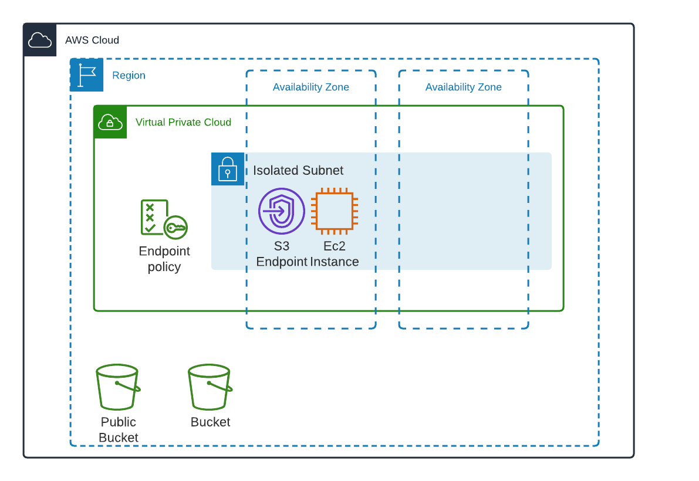

**Figure: S3 gateway VPC endpoint for constrained private access.** This diagram shows recipe `1.9` at the network level: private or isolated subnets reach S3 through a gateway endpoint attached to selected route tables.

**How to read it:** The endpoint is not a compute hop. It is a route-table-integrated path for S3 traffic, and its endpoint policy narrows which S3 resources can be accessed through that path.

**Why it matters:** The recipe solves two problems together: keep S3 traffic off the general internet path and reduce data-exfiltration blast radius by allowing only the intended bucket/actions.

**How to apply it:** Associate the endpoint only with route tables that need S3 access, apply a restrictive endpoint policy, and validate both the expected `aws s3 cp` success against the allowed bucket and `AccessDenied` against another bucket.

**Limitations:** Endpoint policy is not a complete data boundary. You still need IAM, bucket policy, encryption controls, logging, object-level data governance, and tests for unintended routes through NAT or public paths.

### Transit Gateway And VPC Peering

- **Explanation:** VPC peering connects two VPCs directly. Transit Gateway creates hub-and-spoke connectivity and can support transitive routing across multiple VPCs and hybrid networks.
- **Problem solved:** Multi-VPC systems need private connectivity without routing every path through the public internet.
- **How it works:** Recipe `1.10` creates a Transit Gateway, attaches three VPCs, adds route table entries, and configures transitive communication. Recipe `1.11` creates and accepts a VPC peering connection, updates routes, opens security group rules, and validates connectivity.
- **Why it matters:** Connectivity topology shapes operational complexity, routing control, and future growth.
- **When to use:** Use peering for a small number of direct relationships. Use Transit Gateway for many VPCs/accounts, shared egress, hybrid routing, or centralized network control.
- **When not to use:** Avoid peering meshes at scale. Avoid Transit Gateway when a simple point-to-point relationship is enough.
- **Tradeoffs:** Peering is direct and simple but nontransitive. Transit Gateway centralizes routing but adds cost, route-table design, and blast-radius considerations.
- **Common mistakes:** Missing return routes; CIDR overlap; security groups not permitting traffic; assuming peering is transitive; using default TGW route tables without intent.
- **Production example:** A network services account can host Transit Gateway attachments for application VPCs and shared egress.
- **Questions to ask:** How many VPCs must connect? Is transitive routing required? Are CIDRs unique? Who owns route-table changes?

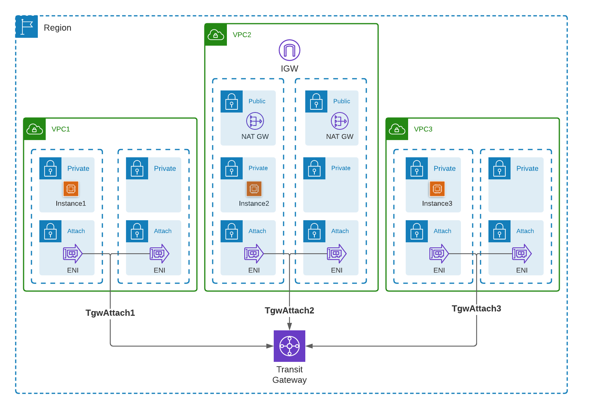

**Figure: Transit Gateway with three VPCs.** This diagram shows hub-and-spoke connectivity for multiple VPCs.

**How to read it:** Each VPC attaches to Transit Gateway; routing determines which spokes can communicate.

**Why it matters:** Transit Gateway is a topology choice, not just another route target.

**How to apply it:** Use route tables intentionally to separate environments, share egress, or centralize inspection.

**Limitations:** The diagram does not show account boundaries, route propagation rules, inspection VPCs, or hybrid connectivity.

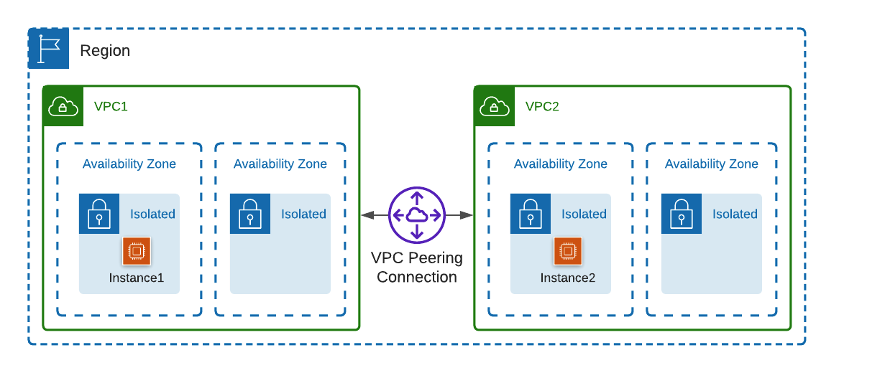

**Figure: Communication between instances in peered VPCs.** This diagram shows direct VPC peering connectivity.

**How to read it:** Traffic flows directly between two VPCs after peering, route, and security rules are in place.

**Why it matters:** Peering is useful for simple private connectivity but does not scale cleanly to complex many-to-many topologies.

**How to apply it:** Use peering for tightly scoped relationships; document routes and security rules on both sides.

**Limitations:** Peering is nontransitive and requires nonoverlapping CIDRs.

### CloudFront And S3 Static Web Content

- **Explanation:** CloudFront caches and distributes content from an origin such as S3 to improve end-user load time and reduce direct origin traffic.
- **Problem solved:** Static web content served directly from S3 may not give optimal global latency or edge controls.
- **How it works:** Recipe `1.12` creates S3 content, CloudFront origin access identity, distribution, and cleanup workflow.
- **Why it matters:** CDN design includes both performance and access control. The public should access content through CloudFront, not necessarily directly from S3.
- **When to use:** Use CloudFront for static websites, media, downloads, APIs with cacheable responses, and global edge delivery.
- **When not to use:** Avoid caching private, user-specific, or strongly consistent content without careful cache policies.
- **Tradeoffs:** CloudFront improves latency and origin protection but adds invalidation, cache key, deployment propagation, and cleanup complexity.
- **Common mistakes:** Leaving the distribution enabled during deletion; direct public bucket exposure; wrong cache behavior; no invalidation/versioning strategy.
- **Production example:** Static frontend assets are stored in S3, distributed by CloudFront, protected by origin access control/identity, with versioned filenames for cache busting.
- **Questions to ask:** What is cacheable? How is origin protected? How are updates invalidated? What must be private?

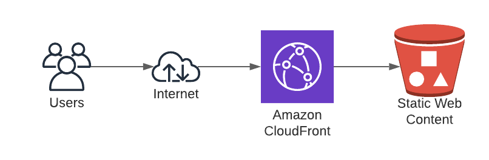

**Figure: CloudFront and S3.** This diagram shows S3 as an origin behind CloudFront.

**How to read it:** Users request content from CloudFront; CloudFront retrieves from S3 on misses.

**Why it matters:** This separates global delivery from origin storage.

**How to apply it:** Use CloudFront policies, origin access controls, TLS, logging, and cache invalidation/versioning as part of the architecture.

**Limitations:** The figure does not cover modern OAC versus OAI details, WAF, signed URLs, or deployment pipelines; verify current AWS recommendations.

The source cleanup workflow is operationally important: disable the distribution, wait for deployment state to settle, delete the distribution using the current ETag, delete the origin access identity using its current ETag, remove bucket objects, delete the bucket, then unset local variables. CloudFront cleanup commonly fails when the runbook ignores wait states or stale ETags.

### Aurora Serverless, IAM Auth, RDS Proxy, Encryption, And Secret Rotation

- **Explanation:** The database recipes teach secure and scalable relational database access patterns: Aurora Serverless creation, IAM database authentication, RDS Proxy for Lambda connection management, encryption of existing RDS storage via snapshot/restore, and Secrets Manager rotation.
- **Problem solved:** Databases are stateful, sensitive, and connection-limited. Serverless and managed services reduce operations but need explicit security and connection handling.
- **How it works:** Recipe `2.1` creates Aurora Serverless PostgreSQL. Recipe `2.2` uses IAM auth so authentication can be tied to AWS identity. Recipe `2.3` places RDS Proxy between Lambda and the database. Recipe `2.4` encrypts an existing database through snapshot/copy/restore mechanics. Recipe `2.5` configures secret rotation.
- **Why it matters:** Database security and availability are usually workload-critical.
- **When to use:** Use IAM auth for AWS-integrated identity flows, RDS Proxy for Lambda or bursty connection patterns, encryption for sensitive data, and rotation for managed credentials.
- **When not to use:** Do not use IAM auth as a substitute for authorization inside the database. Do not assume RDS Proxy fixes slow queries or poor schema design.
- **Tradeoffs:** IAM auth reduces password handling but adds token and policy complexity. RDS Proxy adds a managed hop but improves connection pooling. Encryption retrofit through snapshots can involve downtime/cutover planning.
- **Common mistakes:** Lambda in wrong subnets; security groups not allowing database port; proxy not registered with targets; secret rotation breaking applications; untested restore/cutover.
- **Production example:** A Lambda API writes to Aurora through RDS Proxy using a secret in Secrets Manager, with rotation and CloudWatch alarms for proxy/database health.
- **Questions to ask:** How many concurrent connections can the database handle? How are credentials rotated? Is data encrypted at rest? What is the restore/cutover plan?

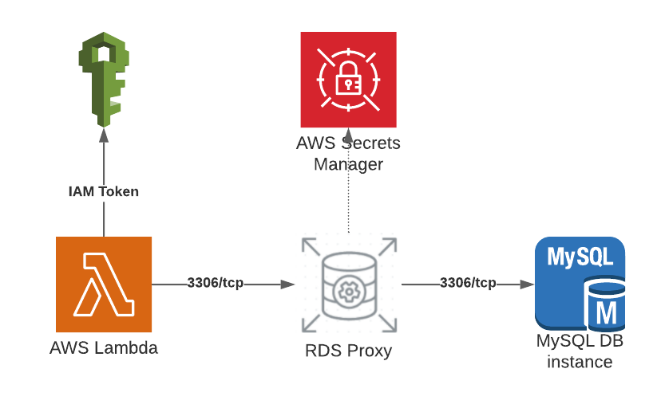

**Figure: Lambda connection path to database via RDS Proxy.** This diagram shows Lambda using RDS Proxy between function and database.

**How to read it:** Lambda connects to the proxy; the proxy manages database connections behind it.

**Why it matters:** Lambda concurrency can overwhelm relational databases without connection pooling.

**How to apply it:** Put Lambda, proxy, and database in compatible networking/security groups; store credentials in Secrets Manager; test failover and connection reuse.

**Limitations:** RDS Proxy does not eliminate query tuning, transaction design, or database capacity planning.

### DynamoDB Provisioned Capacity Autoscaling

- **Explanation:** DynamoDB provisioned capacity can autoscale read and write capacity based on utilization targets.
- **Problem solved:** Workloads with changing traffic need capacity adjustment without constant manual tuning.
- **How it works:** Recipe `2.6` configures autoscaling for a DynamoDB table's provisioned capacity and validates scaling settings.
- **Why it matters:** DynamoDB capacity mode and key design directly affect performance and cost.
- **When to use:** Use provisioned autoscaling for workloads with somewhat predictable traffic and cost-control needs. Consider on-demand for spiky or unpredictable usage.
- **When not to use:** Do not use autoscaling to hide bad partition key design; hot partitions can throttle even when table capacity appears sufficient.
- **Tradeoffs:** Provisioned autoscaling can reduce cost for predictable workloads but may lag sudden spikes. On-demand simplifies capacity but can cost more for steady high volume.
- **Common mistakes:** No alarm on throttles; min/max too low; autoscaling only reads but not writes; poor partition key; no load test.
- **Production example:** A shopping cart table with predictable daily traffic can use provisioned capacity with autoscaling and alarms for consumed capacity and throttling.
- **Questions to ask:** Is traffic predictable? What are min/max bounds? Are keys evenly distributed? What is the throttle policy?

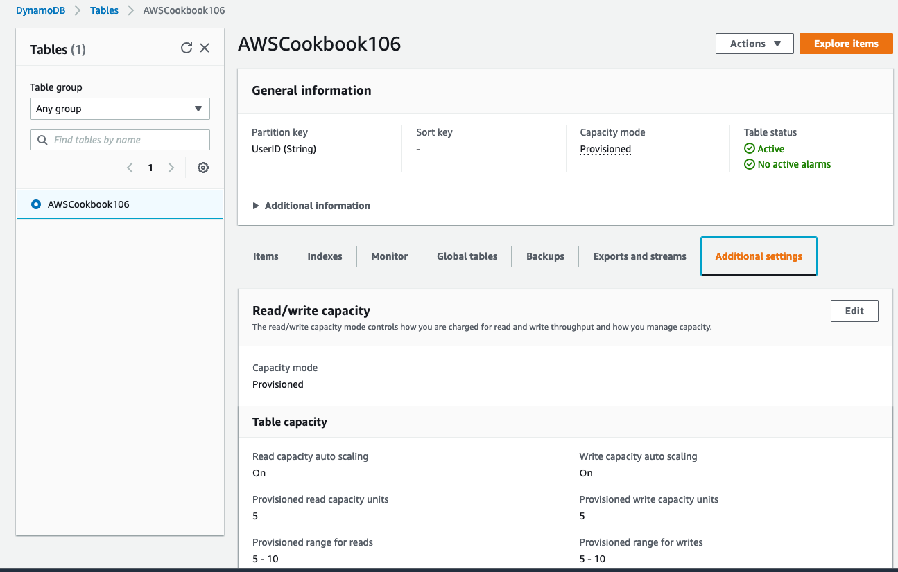

**Figure: DynamoDB scaling settings.** This screenshot shows provisioned capacity autoscaling configuration.

**How to read it:** Autoscaling uses configured capacity limits and target utilization.

**Why it matters:** Capacity settings are both performance and cost controls.

**How to apply it:** Set realistic min/max, monitor throttles and consumed capacity, and validate with representative traffic.

**Limitations:** Autoscaling cannot fix hot keys or inefficient access patterns.

### Database Migration Service

- **Explanation:** AWS Database Migration Service moves data between source and target databases and can support migration tasks through replication instances.
- **Problem solved:** Moving databases to AWS or between engines requires controlled migration, network access, credentials, task setup, validation, and cutover planning.
- **How it works:** Recipe `2.7` sets up source/target database access, DMS networking, replication instance/task, and validates migration progress through DMS console/task state.
- **Why it matters:** Database migration is operationally risky because application correctness depends on complete and consistent data movement.
- **When to use:** Use DMS for supported homogeneous or heterogeneous migrations, continuous replication during migration windows, and migration rehearsals.
- **When not to use:** Avoid DMS as a generic backup or sync tool without understanding schema conversion, data types, constraints, and cutover behavior.
- **Tradeoffs:** Managed migration reduces custom scripting but requires network, permissions, replication capacity, schema compatibility, and validation.
- **Common mistakes:** Security groups block source/target; replication instance undersized; schema not prepared; no validation queries; no rollback/cutover plan.
- **Production example:** Migrate an on-prem MySQL database to RDS by preparing schema, running full load plus CDC, validating row counts/checksums, then cutting over during a maintenance window.
- **Questions to ask:** Is migration homogeneous or heterogeneous? How is schema handled? What lag is acceptable? How will data be validated?

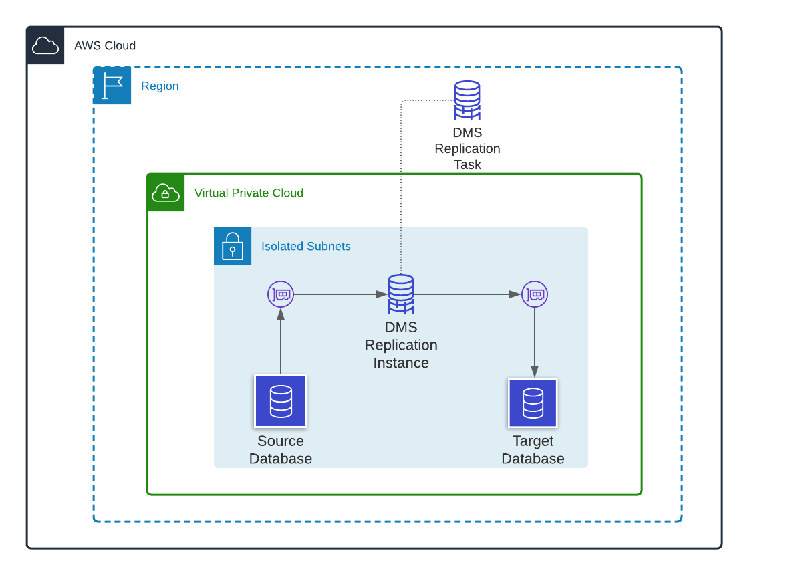

**Figure: DMS network diagram.** This diagram shows DMS connecting source and target databases through AWS networking.

**How to read it:** The replication instance must reach both source and target endpoints.

**Why it matters:** Migration often fails because network or security group paths are incomplete.

**How to apply it:** Validate endpoint connectivity, credentials, subnet groups, security groups, and replication instance sizing before migration.

**Limitations:** The diagram does not cover schema conversion, data validation, cutover sequencing, or application freeze strategy.

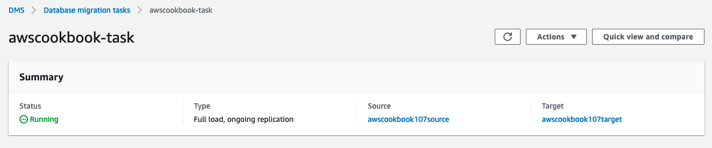

**Figure: DMS task overview.** This screenshot represents the validation checkpoint after starting a replication task.

**How to read it:** DMS task status and task statistics tell you whether replication is running, failed, stopped, or complete, but they are not enough to prove business correctness.

**Why it matters:** The cookbook recipe correctly makes task monitoring part of the migration workflow. Production migration review must go further with row counts, checksums, data-quality queries, application read tests, replication lag review, and cutover rehearsal.

**How to apply it:** Treat the DMS task overview as an early signal. Gate cutover on independent data validation and application-level acceptance tests, not only on a green console state.

**Limitations:** Console task state can hide schema mismatches, transformation mistakes, missing constraints, or application behavior changes.

### Aurora Data API

- **Explanation:** The Aurora Data API lets web services access Aurora Serverless through an HTTPS API rather than a persistent database connection.
- **Problem solved:** Some serverless applications need database access without managing long-lived client connections or database drivers in the same way as traditional apps.
- **How it works:** Recipe `2.8` enables the Data API, connects through service/API calls, and validates queries through RDS query tooling.
- **Why it matters:** Data API changes the application-database integration model and can simplify some serverless workflows.
- **When to use:** Use for suitable Aurora Serverless workloads where HTTP-based database access and Secrets Manager integration fit.
- **When not to use:** Avoid for latency-critical or high-throughput database interaction without validating limits and performance.
- **Tradeoffs:** Data API simplifies connection management but introduces service API semantics, limits, and potential latency.
- **Common mistakes:** Missing secret permissions; no SQL injection protection; assuming it behaves like a persistent driver; ignoring transaction behavior.
- **Production example:** A lightweight admin workflow can execute controlled SQL through a Lambda-backed service using the Data API and narrowly scoped permissions.
- **Questions to ask:** What is the query volume? What permissions are needed? How are statements parameterized and audited?

The source recipe validates the Data API with both CLI and console-oriented workflows. The command-line path uses `aws rds-data execute-statement` with the cluster ARN, secret ARN, database name, and SQL statement. The console path uses the RDS Query Editor to connect with the same secret/database context and run a simple query such as `SELECT * from pg_user;`.

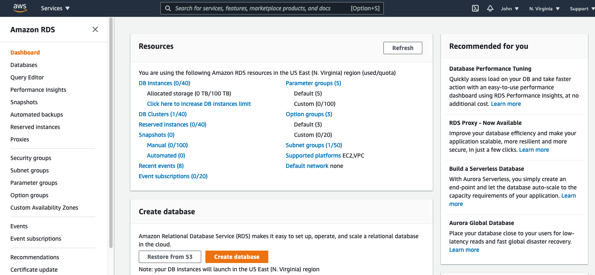

**Figure: RDS console entry point for query validation.** This screenshot is mainly a navigation checkpoint for the cookbook's validation workflow.

**How to read it:** The Data API is validated through RDS tooling rather than by opening a direct database socket from the workstation.

**Why it matters:** This reinforces the integration model: the client invokes a managed HTTPS API using IAM and Secrets Manager context.

**How to apply it:** Use console validation for learning and troubleshooting, but automate production validation with CLI/API checks and application integration tests.

**Limitations:** Console success does not prove application permissions, query parameterization, latency, or transaction behavior.

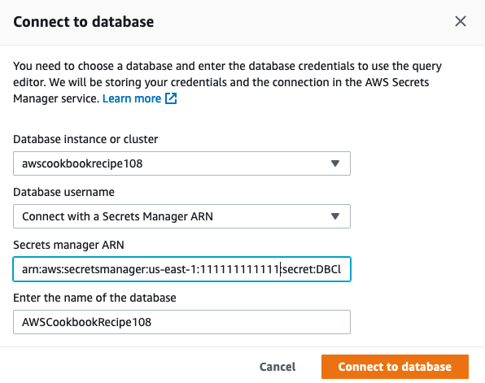

**Figure: Query Editor connection settings.** This screenshot shows the connection fields that bind query execution to a database and secret.

**How to read it:** The secret and database selection are part of the access path. A wrong secret, wrong database, or missing permission produces a different failure mode than a SQL syntax error.

**Why it matters:** Data API troubleshooting must separate IAM permission, secret retrieval, cluster/resource ARN, database name, and SQL execution failures.

**How to apply it:** In runbooks, print or log safe identifiers such as cluster ARN suffix, database name, and secret name/ARN reference while avoiding secret values.

**Limitations:** The screenshot does not teach least-privilege IAM design or parameterized statement construction.

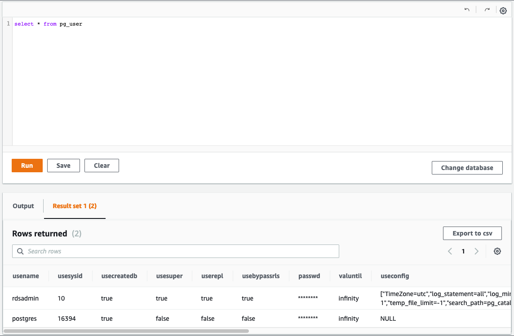

**Figure: Query Editor result.** This screenshot closes the recipe's validation loop by showing a successful query result.

**How to read it:** A result set proves the Data API path can authenticate, reach the cluster, use the secret, execute SQL, and return data for that test query.

**Why it matters:** For production systems, this same idea becomes a smoke test: execute a harmless parameterized query and verify success before enabling traffic.

**How to apply it:** Build a non-destructive health query into deployment validation, then separately test write paths, transactions, error handling, and permission boundaries.

**Limitations:** A simple query does not prove workload performance, concurrency behavior, SQL safety, or transaction semantics.

### ECR Image Lifecycle And Vulnerability Scanning

- **Explanation:** Amazon ECR stores container images. Recipes `3.1` and `3.2` build, tag, push images, and enable image scanning on push.
- **Problem solved:** Container delivery needs a secure and traceable image supply chain before deployment.
- **How it works:** A local Docker image is built, tagged with the ECR repository URI, authenticated to ECR, pushed, and then scanned.
- **Why it matters:** Image tags, scan results, and repository policies influence deployment safety.
- **When to use:** Use ECR for AWS-native container image storage, CI/CD integration, scan-on-push, and lifecycle policies.
- **When not to use:** Do not rely only on mutable `latest` tags for production. Do not ignore scan findings.
- **Tradeoffs:** ECR integrates well with ECS/EKS but still needs lifecycle, access policy, tag strategy, and promotion model.
- **Common mistakes:** Using mutable tags without digest pinning; no scan gate; broad repository permissions; leaving old images forever.
- **Production example:** CI builds an image, scans it, tags with immutable commit SHA, pushes to ECR, and promotes only passing images to production.
- **Questions to ask:** What tag identifies the image? Which scan severity blocks deployment? Who can push or pull?

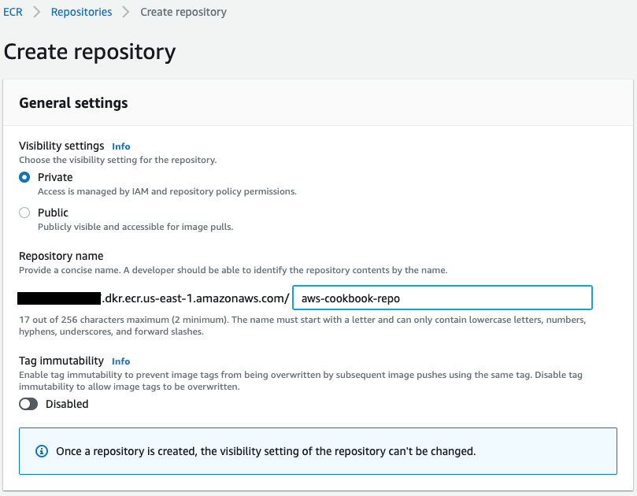

**Figure: ECR repository creation.** This screenshot shows repository creation for container images.

**How to read it:** ECR is the registry boundary for image storage and access control.

**Why it matters:** The registry is part of the software supply chain.

**How to apply it:** Use least-privilege repository policies, immutable tags or digest-based deployment, scan gates, and lifecycle rules.

**Limitations:** ECR scanning is one control, not a complete supply-chain security program.

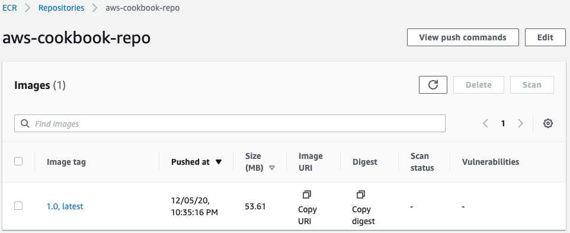

**Figure: Container image with two tags.** This screenshot shows image tagging in ECR.

**How to read it:** One image digest can have multiple tags.

**Why it matters:** Tags are labels, not immutable identity unless configured and governed.

**How to apply it:** Deploy by digest or immutable release tag, and use human-friendly tags only as convenience labels.

**Limitations:** Tags alone do not prove provenance, scan status, or approval.

The source recipe also shows the console path to creating and viewing the repository, but the reusable engineering lesson is the same as the CLI path: the ECR repository is the controlled registry boundary, and the pushed image must be identified by digest or immutable release tag before deployment.

### Lightsail, Copilot, ECS Blue/Green, Autoscaling, EventBridge, And Logs

- **Explanation:** The container chapter moves from simple container deployment to operational ECS patterns: Lightsail containers, AWS Copilot, blue/green deployment, autoscaling, event-triggered Fargate tasks, and log capture.
- **Problem solved:** Containerized applications need repeatable deployment, safe updates, dynamic capacity, event execution, and observability.
- **How it works:** Lightsail provides simplified container deployment. Copilot scaffolds ECS infrastructure. Blue/green deployment shifts traffic between target groups. ECS autoscaling adjusts service desired count. EventBridge can trigger Fargate tasks. ECS logs are captured for inspection.
- **Why it matters:** Running a container is not the same as operating a containerized service.
- **When to use:** Use Lightsail for simple workloads, Copilot for developer-friendly ECS setup, ECS/Fargate for managed container services, blue/green for safer changes, autoscaling for demand, EventBridge for scheduled/event tasks, and centralized logs for operations.
- **When not to use:** Avoid simplified services when production needs exceed their control model. Avoid blue/green without health checks and rollback. Avoid event-triggered tasks without idempotency.
- **Tradeoffs:** Copilot accelerates setup but abstracts resources. Blue/green reduces deployment risk but doubles capacity temporarily. Autoscaling improves elasticity but needs correct metrics.
- **Common mistakes:** No image scan gate; no health checks; target group mismatch; autoscaling on weak metric; missing log group; event rule triggering duplicate/non-idempotent tasks.
- **Production example:** A web service is deployed through Copilot to ECS/Fargate, uses ALB, blue/green deployments, CPU/request-count scaling, CloudWatch logs, and EventBridge-triggered batch jobs.
- **Questions to ask:** What deploys the service? How is rollback performed? What metric scales the service? Where do logs go? Are event-triggered tasks idempotent?

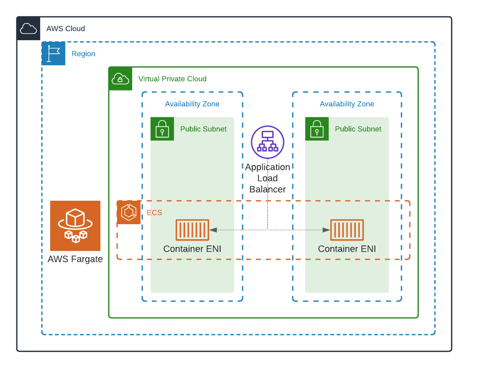

**Figure: AWS Copilot load balanced web service infrastructure.** This diagram shows the infrastructure Copilot can create for a load-balanced ECS service.

**How to read it:** Copilot provisions multiple AWS resources around the service, not only a container task.

**Why it matters:** Higher-level tooling accelerates delivery but still creates infrastructure that must be understood and operated.

**How to apply it:** Use Copilot for repeatable ECS service scaffolding, then review generated networking, IAM, load balancing, logging, and deployment configuration.

**Limitations:** Copilot's abstraction may not fit every enterprise platform standard or advanced topology.

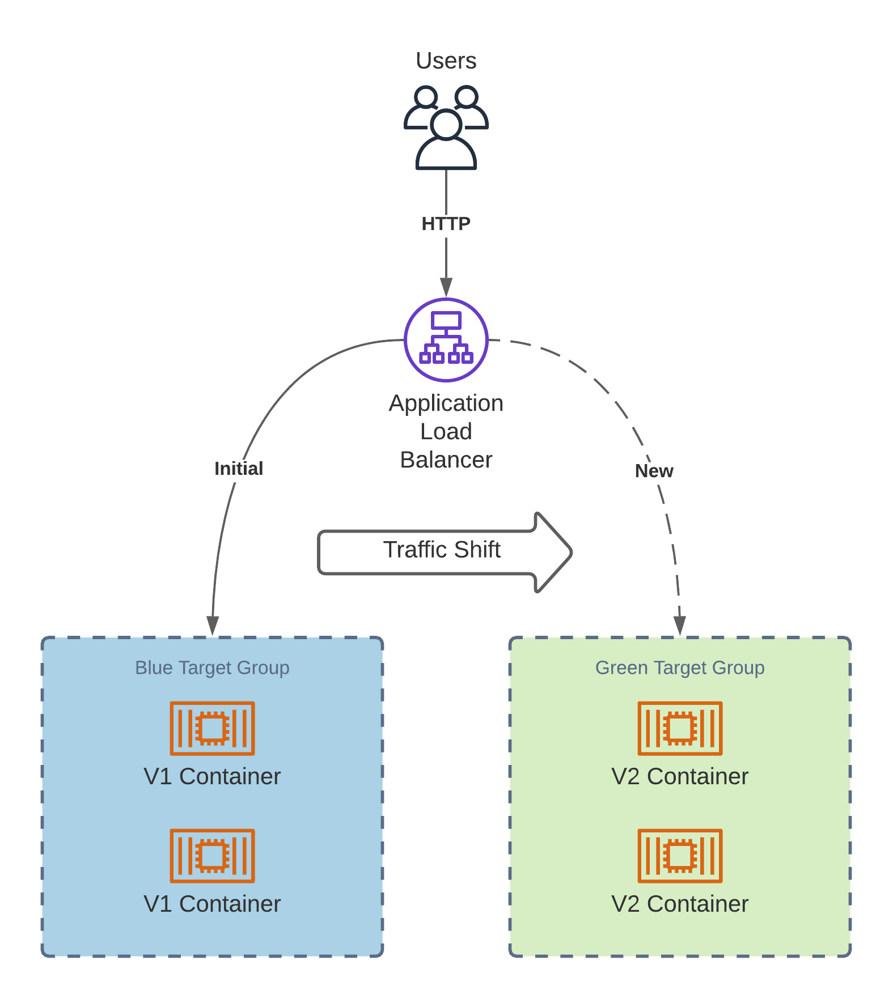

**Figure: Blue/green target group association.** This screenshot shows blue/green deployment target-group relationships.

**How to read it:** Traffic can shift between old and new target groups during deployment.

**Why it matters:** Blue/green deployment reduces release risk by keeping an old version available during validation.

**How to apply it:** Pair blue/green with health checks, smoke tests, rollback, deployment alarms, and capacity planning.

**Limitations:** It does not solve database migration compatibility or stateful session issues by itself.

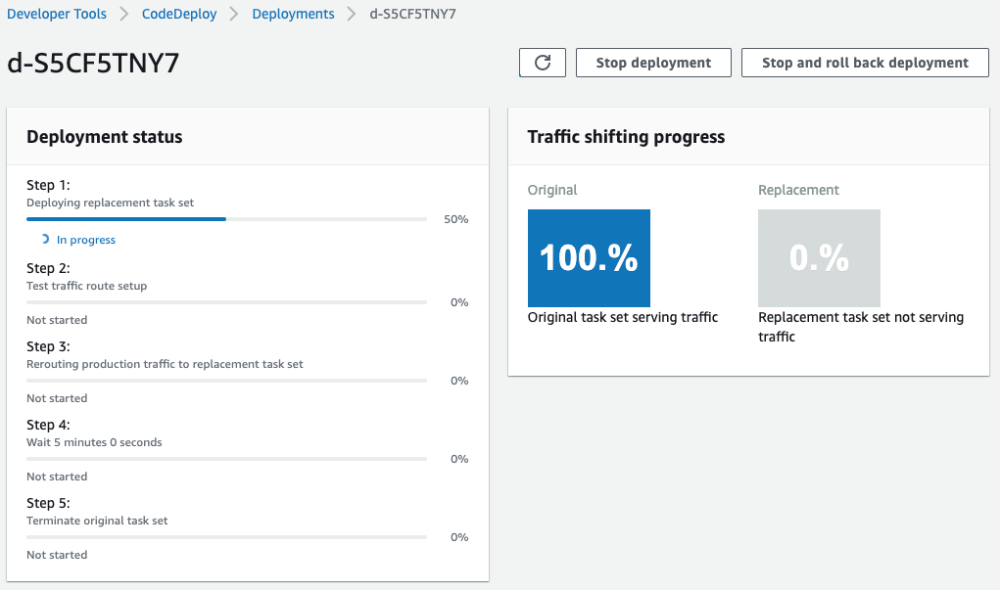

**Figure: Initial blue/green deployment status.** This screenshot shows the deployment as an observable process, not a single command.

**How to read it:** CodeDeploy has lifecycle state and traffic-shift progress. Operators should watch deployment events, target group health, and application smoke-test results before accepting the new version.

**Why it matters:** The cookbook notes that the previous version remains available for a short rollback window while traffic routes to the new target group. This is the safety mechanism that makes blue/green useful.

**How to apply it:** Add pre-traffic and post-traffic validation hooks where possible, define alarms that fail deployment automatically, and make rollback a rehearsed operation.

**Limitations:** A successful traffic shift does not prove backward-compatible database changes, session behavior, or downstream dependency health.

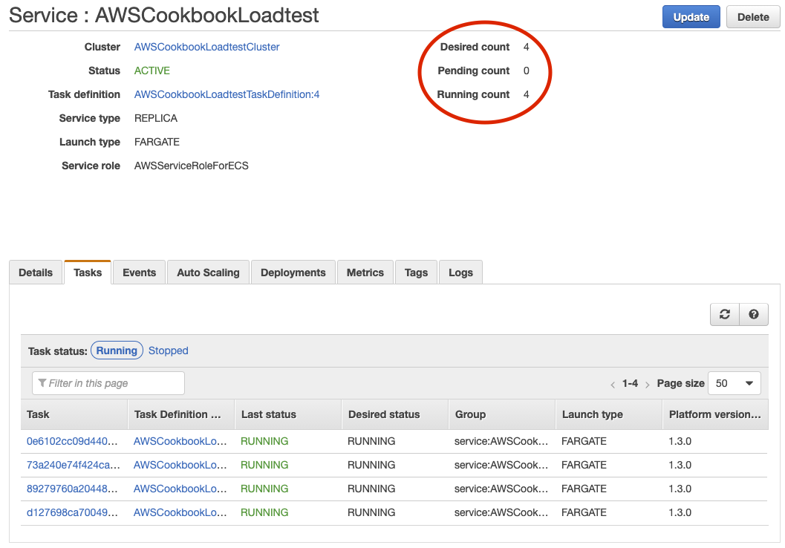

**Figure: ECS service overview after autoscaling.** This screenshot shows desired/running task count after the recipe's CPU load test triggers scale-out.

**How to read it:** The service moves from the minimum task count toward the configured maximum when CloudWatch metrics and Application Auto Scaling policy conditions are met.

**Why it matters:** Autoscaling is observable state transition. You need to verify desired count, running count, task health, and whether scaling actually improves user-facing behavior.

**How to apply it:** Load-test the service, watch desired/running counts and CPU/memory/request metrics, then confirm latency and error rate improve without overloading downstream dependencies.

**Limitations:** Scaling task count does not fix serial bottlenecks, database limits, bad caching, or inefficient code.

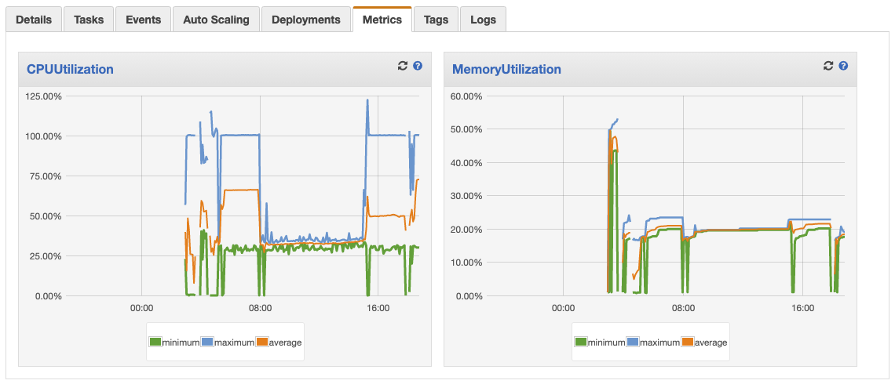

**Figure: ECS service metrics.** This screenshot shows service-level metrics for ECS workloads.

**How to read it:** Metrics reveal CPU, memory, desired/running count, and service behavior.

**Why it matters:** Autoscaling and incident response need reliable service metrics.

**How to apply it:** Define scaling metrics and alert thresholds before production; validate autoscaling with load.

**Limitations:** Infrastructure metrics alone do not prove user experience. Add application metrics and traces.

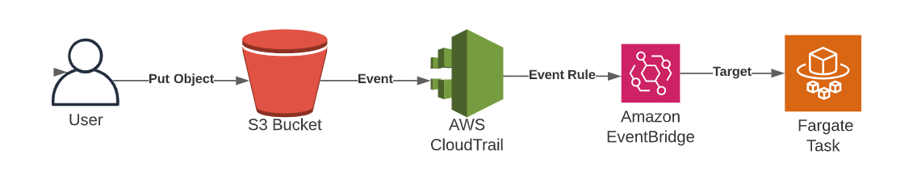

**Figure: Flow of container EventBridge pattern.** This diagram shows an event triggering a container task.

**How to read it:** EventBridge matches an event or schedule, then starts a Fargate/ECS task.

**Why it matters:** Event-triggered containers are useful for batch, automation, and asynchronous tasks.

**How to apply it:** Make tasks idempotent, define retry behavior, capture logs, and alarm on failed invocations.

**Limitations:** EventBridge triggering does not guarantee business idempotency or successful downstream processing.

## 4. Implementation Patterns And Engineering Practices

### Recipe Execution Pattern

- **Problem it solves:** Prevents AWS CLI/CDK experiments from becoming uncontrolled changes.
- **Implementation shape:** Preflight identity/region, deploy prerequisite stack, capture outputs, run resource mutation commands, validate behavior, clean up in dependency order.
- **Minimal scenario:** Before creating a VPC endpoint, confirm account and region, deploy baseline VPC, create endpoint, test allowed S3 access, test denied S3 access, delete endpoint, destroy stack.
- **Tradeoffs and failure modes:** Fast command execution is convenient but fragile if variables are stale. IaC is repeatable but requires more setup.
- **Testing or validation:** Every recipe should include a positive test and, where security is involved, a negative test.
- **Adaptation guidance:** Convert manual CLI sequences into scripts or IaC modules with preflight checks and cleanup.

### Network Tiering Pattern

- **Problem it solves:** Separates public ingress, private application compute, and isolated data resources.
- **Implementation shape:** Create VPC, public/private/isolated subnets, route tables, internet gateway, NAT gateway or endpoints, security groups.
- **Minimal scenario:** ALB in public subnets routes to containers in private subnets; database sits in isolated/private subnets.
- **Tradeoffs and failure modes:** More tiers improve isolation but require precise route and security rules.
- **Testing or validation:** Validate public-to-ALB, ALB-to-app, app-to-database, app-to-S3 endpoint, and denied paths.
- **Adaptation guidance:** Add VPC Flow Logs, Reachability Analyzer checks, and separate route tables per tier.

### Least-Privilege Network Access Pattern

- **Problem it solves:** Reduces exposure from broad IP-based ingress.
- **Implementation shape:** Use source security group references, prefix lists, endpoint policies, and narrow CIDRs.
- **Minimal scenario:** Application instances accept HTTP only from ALB SG; admin access comes through SSM instead of public SSH.
- **Tradeoffs and failure modes:** Narrow rules require better documentation and dependency tracking.
- **Testing or validation:** Validate allowed source works and nonallowed source fails.
- **Adaptation guidance:** Use managed prefix lists for shared corporate/service ranges and avoid open ingress except public edge.

### Database Connection Management Pattern

- **Problem it solves:** Prevents serverless or bursty applications from exhausting relational database connections.
- **Implementation shape:** Put RDS Proxy between Lambda/application and RDS/Aurora; store credentials in Secrets Manager; configure security groups and subnets correctly.
- **Minimal scenario:** Lambda connects to RDS Proxy, proxy pools connections to Aurora.
- **Tradeoffs and failure modes:** Adds a managed dependency but improves connection reuse. It does not fix query inefficiency.
- **Testing or validation:** Load-test Lambda concurrency and monitor DB connections, proxy metrics, errors, and query latency.
- **Adaptation guidance:** Use application-side pooling for non-Lambda runtimes and RDS Proxy where connection storms are likely.

### Credential Rotation Pattern

- **Problem it solves:** Reduces risk from long-lived database passwords.
- **Implementation shape:** Store DB credentials in Secrets Manager; configure rotation Lambda/workflow; ensure application retrieves current secret.
- **Minimal scenario:** RDS MySQL credentials rotate automatically; application uses secret lookup rather than hardcoded password.
- **Tradeoffs and failure modes:** Rotation can break clients if permissions, secret stages, or application refresh behavior are wrong.
- **Testing or validation:** Force rotation in nonproduction and verify application reconnection.
- **Adaptation guidance:** Pair rotation with monitoring and rollback, and define emergency credential recovery.

### Container Supply Chain Pattern

- **Problem it solves:** Makes images traceable, scanned, and deployable safely.
- **Implementation shape:** Build image, tag immutably, push to ECR, scan, promote to environment, deploy through ECS/Copilot/CodeDeploy.
- **Minimal scenario:** CI builds `service:${COMMIT_SHA}`, pushes to ECR, blocks critical findings, and deploys by digest.
- **Tradeoffs and failure modes:** Strict scan gates may block urgent patches; weak gates let vulnerable images deploy.
- **Testing or validation:** Verify repository policy, image scan status, deployment image digest, and rollback.
- **Adaptation guidance:** Add SBOM/signing if required by organization policy.

### Event-Triggered Container Task Pattern

- **Problem it solves:** Runs containerized jobs in response to events or schedules without always-on workers.
- **Implementation shape:** EventBridge rule targets ECS/Fargate task definition with IAM role, network config, logs, and retry/DLQ behavior.
- **Minimal scenario:** A daily job runs as a Fargate task and writes logs to CloudWatch.
- **Tradeoffs and failure modes:** Event duplicates and retries can create duplicate work if tasks are not idempotent.
- **Testing or validation:** Trigger event manually, inspect task state, logs, exit code, and side effects.
- **Adaptation guidance:** Include idempotency key, job lock, or checkpoint for state-changing tasks.

## 5. Code, Configuration, And Workflow Notes

### Safe AWS CLI Preflight

**Problem solved:** Prevents commands from running in the wrong AWS account or region.

```bash
aws sts get-caller-identity
aws configure get region
```

**How it works:** The first command identifies the caller account and ARN. The second checks region resolution. A production script should fail if the account, role, or region does not match expected values.

**Common mistakes:** Trusting default profile, relying on stale shell variables, and omitting region.

**Validation:** Print account, role, region, stack/resource prefix, and operation type before mutating resources.

### VPC Creation And Validation Workflow

**Problem solved:** Creates an isolated network boundary and verifies CIDR assignment.

Representative pattern:

```bash
VPC_ID=$(aws ec2 create-vpc --cidr-block 10.10.0.0/16 \
  --tag-specifications 'ResourceType=vpc,Tags=[{Key=Name,Value=AWSCookbook201}]' \
  --output text --query Vpc.VpcId)

aws ec2 describe-vpcs --vpc-ids "$VPC_ID" \
  --query Vpcs[0].CidrBlockAssociationSet
```

**Prerequisites and assumptions:** AWS CLI permissions for EC2 VPC creation, chosen CIDR does not overlap with planned connectivity, and naming/tags are safe for the target account.

**Common mistakes:** CIDR overlap, no DNS settings review, missing tags, and no cleanup.

**Security/reliability risks:** A VPC alone is not secure or usable; routes, subnets, security controls, and logging must follow.

**Adaptation:** Use IaC for production and apply tags, flow logs, DNS support, and IPAM/CIDR governance.

**Validation:** Describe VPC, route tables, subnets, DNS attributes, and expected tags.

### NAT Gateway Workflow

**Problem solved:** Gives private subnet instances outbound internet access without inbound internet exposure.

Workflow:

1. Allocate Elastic IP.
2. Create NAT gateway in public subnet.
3. Wait for NAT gateway availability.
4. Add `0.0.0.0/0` route in private route tables to NAT gateway.
5. Validate from private instance through SSM session using `ping` or `curl`.
6. Delete NAT gateway and release Elastic IP during cleanup.

**Common mistakes:** Creating NAT in a private subnet, not waiting for available state, using one NAT across AZs without understanding failure/cost, forgetting Elastic IP release.

**Validation:** From a private instance, resolve DNS and reach a known external endpoint; confirm no inbound public path exists.

### Reachability Analyzer Workflow

**Problem solved:** Diagnoses network path reachability.

Workflow:

1. Create network insights path with source, destination, protocol, and port.
2. Start analysis.
3. Inspect whether path is reachable.
4. Modify route/security rules if needed.
5. Rerun analysis.
6. Delete analysis and path objects.

**Common mistakes:** Testing the wrong port or wrong destination ENI/instance; assuming reachability implies application health.

**Validation:** Pair analysis with runtime tests such as `nc -vz`, `curl`, or app-level health checks.

### ALB HTTPS Redirect Workflow

**Problem solved:** Redirects HTTP users to HTTPS at the load balancer.

Workflow:

1. Create or reference certificate.
2. Create ALB security group allowing 80/443 from intended clients.
3. Create load balancer in public subnets.
4. Create target group and register targets.
5. Create HTTPS listener forwarding to target group.
6. Create HTTP listener redirecting to HTTPS.
7. Validate with `curl -v http://...` and `curl -vkL http://...`.

**Common mistakes:** Self-signed certificate in production, unhealthy targets, app SG not allowing ALB SG, no HTTP redirect listener, no access logs.

**Validation:** HTTP returns redirect; HTTPS returns expected app response; target health is healthy.

### Managed Prefix List Workflow

**Problem solved:** Allows multiple security groups or route tables to share the same managed set of CIDR ranges without duplicating every range in every rule.

Workflow:

1. Download or define the source CIDR list, such as AWS IP ranges or corporate ranges.
2. Create a customer-managed prefix list with enough `max-entries` for expected growth.
3. Add stable allowed ranges, then add temporary test ranges such as a workstation `/32` only when needed.
4. Reference the prefix list in security group ingress/egress rules or route entries.
5. Validate allowed access from a listed range and denied access after removing or rolling back that range.
6. Audit usage with `get-managed-prefix-list-associations`.
7. Roll back bad changes with `restore-managed-prefix-list-version` when needed.

**Common mistakes:** Under-sizing `max-entries`, forgetting prefix list version numbers, treating temporary workstation access as permanent, and failing to test denied access after rollback.

**Validation:** Connection from an allowed CIDR succeeds; connection from a removed CIDR times out or is denied; every association has a documented owner and reason.

### S3 Gateway Endpoint Policy Workflow

**Problem solved:** Allows private subnet S3 access while restricting which S3 resources can be reached through the endpoint.

Workflow:

1. Create S3 gateway VPC endpoint.
2. Associate endpoint with selected route tables.
3. Generate endpoint policy for specific bucket/actions.
4. Apply endpoint policy.
5. From private instance, test allowed bucket operation.
6. Test denied bucket operation.
7. Delete endpoint during cleanup.

**Common mistakes:** Only testing allowed access; endpoint route tables omitted; policy too broad; bucket policy conflicts.

**Validation:** Allowed `aws s3 cp` succeeds; unauthorized `aws s3 ls` to another bucket returns `AccessDenied`.

### CloudFront Private S3 Origin Workflow

**Problem solved:** Serves static S3 content through CloudFront while blocking direct public S3 object access.

Workflow:

1. Create the S3 bucket and upload static content.
2. Create the CloudFront origin identity/control mechanism supported by the target architecture.
3. Generate a distribution config that points CloudFront at the S3 origin.
4. Create the distribution and wait for deployed state.
5. Apply a bucket policy that allows reads only through the CloudFront origin access mechanism.
6. Validate direct S3 access fails with `AccessDenied`.
7. Validate CloudFront returns the expected object.
8. For cleanup, disable the distribution, wait for deployment, delete using the current ETag, then remove origin identity/control objects and bucket contents.

**Common mistakes:** Leaving the S3 bucket public, skipping deployment wait states, deleting with a stale ETag, and forgetting that cache invalidation/versioning affects update visibility.

**Validation:** Direct bucket URL is denied; CloudFront domain serves the object; access logs and cache policy match the intended production behavior.

### DMS Migration Workflow

**Problem solved:** Migrates database data with a managed replication service.

Workflow:

1. Prepare source and target database endpoints.
2. Configure network access and secrets.
3. Create DMS replication instance.
4. Create migration task.
5. Monitor task state and errors.
6. Validate row counts, checksums, and application-specific queries.
7. Plan cutover and cleanup.

**Common mistakes:** No schema conversion plan, replication instance cannot reach endpoints, no validation queries, no rollback.

**Validation:** DMS task completes, target data matches source, app tests pass against target.

### Aurora Data API Workflow

**Problem solved:** Executes SQL against Aurora Serverless through an HTTPS API using cluster and secret metadata rather than a long-lived client socket.

Workflow:

1. Enable the Data API for the Aurora Serverless cluster where supported.
2. Capture the cluster ARN, secret ARN, and database name.
3. Grant the caller least-privilege `rds-data:*` actions actually required plus permission to read the specific secret.
4. Execute a harmless query with `aws rds-data execute-statement`.
5. Validate the same path through application code or a deployment smoke test.
6. Test failure cases: wrong secret, missing IAM permission, invalid SQL, transaction behavior, and timeout handling.

**Common mistakes:** Granting broad Data API permissions, logging secret values, concatenating user SQL, assuming Data API latency matches a persistent driver, and treating a single console query as production validation.

**Validation:** Non-destructive query succeeds, expected denied cases fail, application code uses parameterized statements, and metrics/logs show latency and errors.

### ECR Build, Tag, Push, And Scan Workflow

**Problem solved:** Creates a deployable container image and stores it in AWS.

Workflow:

1. Create ECR repository.
2. Authenticate Docker to ECR.
3. Build image.
4. Tag image with repository URI and immutable version.
5. Push image.
6. Enable/review image scan.
7. Clean up repository/image when done.

**Common mistakes:** Deploying `latest`, ignoring scan findings, no lifecycle policy, excessive repository permissions.

**Validation:** Image digest exists in ECR; scan result is reviewed; deployment references intended digest/tag.

### ECS Blue/Green Deployment Workflow

**Problem solved:** Releases a new ECS service version while keeping a rollback path through separate target groups and CodeDeploy-managed traffic shift.

Workflow:

1. Deploy baseline ECS service, ALB listeners, and the current target group.
2. Create or reference the CodeDeploy service role for ECS deployments.
3. Create the green target group and CodeDeploy application/deployment group.
4. Generate the AppSpec and deployment configuration from actual task definition, listener, target group, and S3 artifact values.
5. Start deployment and watch CodeDeploy events, ECS service state, and target group health.
6. Smoke-test the green version before accepting production traffic where hooks/strategy allow it.
7. Roll back during the retention window if health checks, alarms, or smoke tests fail.

**Common mistakes:** Missing CodeDeploy role permissions, wrong listener/target group ARN, no test listener validation, no alarms, and application/database changes that are not backward compatible.

**Validation:** CodeDeploy reaches a successful state, production listener points to the intended target group, target health is green, smoke tests pass, and rollback has been rehearsed.

### ECS Autoscaling Workflow

**Problem solved:** Adjusts service task count based on demand.

Workflow:

1. Define ECS service and task.
2. Register scalable target for service desired count.
3. Attach scaling policy based on CPU/memory/request metric.
4. Generate load or simulate metric.
5. Observe desired/running count changes.
6. Validate application SLO during scale-out and scale-in.

**Common mistakes:** Scaling on CPU when bottleneck is downstream DB; min/max too narrow; no cooldown; no app-level SLO validation.

**Validation:** ECS service metrics, target tracking alarms, running count, latency, error rate, and downstream health.

## 6. Testing, Validation, And Verification

| What To Validate | Why It Matters | Method | Good Signal | Warning Sign |
|---|---|---|---|---|
| AWS account and region | Prevents changes in wrong environment. | `aws sts get-caller-identity`, region/profile checks. | Expected account/role/region printed before mutation. | Resources appear in unexpected account or region. |
| VPC CIDR and route tables | Connectivity depends on routes and address space. | Describe VPCs, subnets, routes, associations. | Subnets have intended route tables and nonoverlapping CIDRs. | Public/private labels do not match routes. |
| Internet gateway path | Public subnets require correct IGW route. | Validate `0.0.0.0/0` to IGW and public target reachability. | Public edge responds as expected. | Instance has public IP but no route or SG access. |
| NAT gateway egress | Private workloads need controlled outbound path. | SSM into private instance and test DNS/HTTP. | Outbound succeeds; inbound remains blocked. | NAT unavailable, wrong route table, high unexpected cost. |
| Security group references | Dynamic access should work without IP hardcoding. | `nc`, Reachability Analyzer, SG describe. | Allowed group source connects; nonallowed source fails. | Same SG membership assumed to imply access. |
| Reachability Analyzer path | Network changes need deterministic validation. | Create/start analysis for source/destination/port. | Analysis result matches expected path. | Network path passes but app still fails due to listener/auth. |
| ALB redirect and target health | HTTPS redirection and backend health are user-facing. | `curl -v`, `curl -L`, target health checks. | HTTP redirects; HTTPS returns app; targets healthy. | Redirect loop, bad cert, unhealthy target. |
| VPC endpoint policy | Private S3 access should be constrained. | Test allowed bucket and denied bucket. | Allowed succeeds; denied returns access denied. | Endpoint policy allows all buckets. |
| Transit/peering routes | Cross-VPC traffic needs bidirectional routes and SGs. | Ping/nc plus route and SG inspection. | Intended VPC paths work only where allowed. | Missing return route or overlapping CIDR. |
| CloudFront/S3 delivery | CDN must serve content and protect origin. | Fetch CloudFront domain, test direct S3 access if restricted. | Edge serves content; origin policy matches intent. | Distribution cannot delete due to enabled state; public bucket exposure. |
| RDS Proxy path | Lambda/database integration depends on networking and credentials. | Invoke Lambda, inspect proxy/DB metrics. | Queries succeed with stable DB connections. | Connection storms, auth failures, SG blocks. |
| Secret rotation | Rotation should not break applications. | Force rotation in nonproduction and run app queries. | App reconnects with current secret. | App caches old password forever. |
| DynamoDB autoscaling | Capacity should adjust without throttling. | Load test and inspect consumed capacity/throttles. | Capacity scales within bounds. | Hot partition throttles despite table capacity. |
| DMS migration | Data movement must be complete and correct. | Row counts, checksums, sample queries, task logs. | Target data matches source. | Task success but application queries fail. |
| ECR scan gate | Images should not deploy with known severe issues. | Review scan findings and CI gate. | Blocking policy matches risk tolerance. | Scan findings ignored. |
| ECS deployment | Container changes must be safe and observable. | Blue/green smoke test, target health, logs. | New version healthy before traffic shift. | Deployment passes but app logs show errors. |
| EventBridge task | Event-triggered work must be idempotent and visible. | Trigger event, inspect task state and logs. | One intended business effect and clear logs. | Duplicate side effects or silent failed tasks. |

## 7. Chapter-by-Chapter Knowledge Extraction

### Chapter 1. Networking

Main engineering lesson: AWS networking is built from composable primitives: VPCs, CIDRs, subnets, route tables, gateways, security groups, prefix lists, endpoints, load balancers, Transit Gateway, peering, and CloudFront. The recipes teach how to create a network path, validate it, and clean it up.

High-density recipe groups:

- **Network foundation (`1.1`-`1.4`):** Create VPCs, subnets, route tables, internet gateways, and NAT gateways. These recipes preserve the core AWS networking workflow: create boundary, create tiers, attach route targets, validate traffic, clean up dependency order.
- **Network access control (`1.5`, `1.8`, `1.9`):** Use security group references, prefix lists, and S3 endpoint policies to express least privilege without brittle IP rules.
- **Network validation (`1.6`):** Reachability Analyzer provides formal path analysis that complements runtime tests.
- **Ingress and delivery (`1.7`, `1.12`):** ALB redirects HTTP to HTTPS; CloudFront improves S3 static content delivery.
- **Cross-VPC connectivity (`1.10`, `1.11`):** Transit Gateway and peering show two different connectivity models.

Important details readers may miss:

- A route table association is just as important as a route entry.
- NAT gateways require public subnet placement and Elastic IP management.
- Security group references require explicit rules.
- Endpoint policies should be validated with allowed and denied operations.
- CloudFront cleanup may require distribution disable/delete sequencing.

Design decisions taught:

- Public subnet plus IGW versus private subnet plus NAT/endpoint.
- Prefix list versus direct CIDR.
- Transit Gateway versus peering.
- ALB redirection versus application-managed redirection.
- CloudFront fronting S3 versus direct S3 access.

Production risks:

- Broad ingress, unexpected public exposure, NAT cost, stale prefix lists, route-table mistakes, and incomplete cleanup.

Implementation considerations:

- Convert repeated CLI steps into IaC modules.
- Add tags, flow logs, budgets, and alarms.
- Prefer SSM Session Manager over public SSH.

How to evaluate:

- Use Reachability Analyzer, `curl`, `nc`, SSM sessions, route inspection, SG inspection, endpoint access tests, ALB target health, and CloudFront fetch tests.

Self-check questions:

- Which route makes this subnet public?
- What source is allowed by this SG rule?
- What access should fail?
- Which resources must be deleted first during cleanup?

### Chapter 2. Databases

Main engineering lesson: Managed databases still require careful access, authentication, encryption, connection management, scaling, migration, and validation.

High-density recipe groups:

- **Aurora Serverless and Data API (`2.1`, `2.8`):** Create serverless relational capacity and expose controlled API-based query access.
- **Authentication and secrets (`2.2`, `2.5`):** Use IAM database authentication and Secrets Manager rotation to reduce static credential risk.
- **Connection management (`2.3`):** RDS Proxy protects relational databases from Lambda concurrency connection storms.
- **Encryption retrofit (`2.4`):** Encrypting an existing RDS database usually involves snapshot/copy/restore or replacement-style workflow, so cutover planning matters.
- **DynamoDB autoscaling (`2.6`):** Provisioned capacity can scale based on utilization, but key design and throttling still matter.
- **Database migration (`2.7`):** DMS needs network access, replication capacity, schema/data validation, and cutover discipline.

Important details readers may miss:

- IAM authentication controls authentication but not all database authorization design.
- Secret rotation must be tested with real client reconnect behavior.
- RDS Proxy improves connection pooling but not query quality.
- DynamoDB autoscaling does not solve hot partitions.
- DMS task success is not the same as application correctness.

Design decisions taught:

- IAM auth versus password-only auth.
- RDS Proxy versus direct Lambda-to-RDS connections.
- Provisioned autoscaling versus other capacity modes.
- DMS migration versus custom migration scripts.
- Data API versus persistent database clients.

Production risks:

- Connection exhaustion, broken rotation, unencrypted data, migration drift, incorrect endpoint security groups, and insufficient validation.

Implementation considerations:

- Use least-privilege IAM, Secrets Manager, KMS, subnet groups, security groups, alarms, and restore tests.

How to evaluate:

- Invoke clients under concurrency, inspect DB/proxy metrics, force secret rotation in nonproduction, validate encrypted target, compare source/target data after DMS, and test query behavior through Data API.

Self-check questions:

- How many connections can this database tolerate?
- Where are credentials stored and rotated?
- How will migration correctness be proven?

### Chapter 3. Containers

Main engineering lesson: Container workflows span image supply chain, deployment platform, release safety, autoscaling, event-driven execution, and logging.

High-density recipe groups:

- **ECR image operations (`3.1`, `3.2`):** Build, tag, push, and scan container images.
- **Simple deployment (`3.3`):** Lightsail provides a simpler container path for small workloads.
- **Copilot and ECS service deployment (`3.4`):** Copilot creates service infrastructure around a container.
- **Safe deployment (`3.5`):** Blue/green deployments manage traffic shift and rollback opportunity.
- **Elastic operations (`3.6`):** ECS autoscaling changes desired task count based on metrics.
- **Event-driven tasks (`3.7`):** EventBridge can launch Fargate tasks on an event or schedule.
- **Logging (`3.8`):** Capturing ECS logs is required for debugging and operations.

Important details readers may miss:

- Tags are not immutable identity unless managed.
- Scan results need a deployment gate.
- Blue/green deployment needs health checks and application compatibility.
- Autoscaling must be tied to a meaningful bottleneck.
- Event-triggered tasks need idempotency and log capture.

Design decisions taught:

- Lightsail versus ECS/Fargate.
- Copilot abstraction versus direct IaC.
- Blue/green versus in-place update.
- Always-on service versus event-triggered task.
- CPU/memory scaling versus business/load metrics.

Production risks:

- Vulnerable images, mutable tags, failed deployments, missing logs, duplicate event processing, no rollback, and scaling downstream dependencies into failure.

Implementation considerations:

- Use CI/CD, image scanning, immutable tags/digests, task roles, health checks, service metrics, log groups, and deployment alarms.

How to evaluate:

- Confirm image digest, scan status, service health, ALB target health, deployment status, ECS metrics, EventBridge invocation, task exit code, and CloudWatch logs.

Self-check questions:

- Which image exactly is deployed?
- What blocks a vulnerable image?
- How does rollback happen?
- Where are task logs?

### Appendix A. Fast Fixes

Main engineering lesson: Cookbook execution creates common local and AWS-state problems. Fast fixes are reminders that local dependencies, AWS CLI state, CDK state, and resource cleanup can block progress.

Practical use:

- Keep a run log of recipe start/end, created IDs, shell variables, and cleanup status.
- Treat local tool failures as environment issues first, not AWS service failures.
- When cleanup fails, inspect dependencies and delete in reverse creation order.

Self-check questions:

- What local dependency changed?
- What generated resource still exists?
- Which command failed first?

## 8. Architecture Decision Guide

| Decision | Choose Option A When | Choose Option B When | Key Tradeoffs | Failure Risks | Questions To Ask |
|---|---|---|---|---|---|
| Public subnet with IGW vs private subnet with NAT/endpoint | Use public subnet for internet-facing load balancers or deliberately public resources. | Use private subnet with NAT/endpoints for backend workloads needing outbound access. | Public reachability vs isolation. | Accidental public exposure or no egress. | Does this resource need inbound internet? |
| NAT gateway vs VPC endpoint | Use NAT for general outbound internet. | Use endpoint for private AWS service access such as S3. | Generality vs private/service-specific control and often lower data path exposure. | NAT cost/blast radius or endpoint policy gaps. | Is destination an AWS service that supports endpoints? |
| Security group reference vs CIDR rule | Use SG reference for dynamic AWS resource relationships. | Use CIDR/prefix list for external or shared IP ranges. | Dynamic intent vs explicit IP ranges. | Brittle IP rules or opaque group relationships. | Is the source a workload identity/group or an IP range? |
| Prefix list vs direct CIDR in SG rules | Use prefix list when ranges are reused or centrally managed. | Use direct CIDR for isolated one-off cases. | Centralized updates vs version/change management. | Stale list or too-broad CIDR. | Who owns range updates? |
| Reachability Analyzer vs manual inspection | Use Reachability Analyzer for formal network path validation. | Use manual/runtime tests for application-layer validation. | Config-level proof vs runtime proof. | Passing network path but failing app. | What exact path, protocol, and port matter? |
| Transit Gateway vs VPC peering | Use TGW for multiple VPCs, transitive routing, shared egress, or central network control. | Use peering for simple direct VPC-to-VPC connection. | Scalable hub vs simple direct path. | Peering mesh or TGW route blast radius. | How many VPCs and accounts must connect? |
| ALB HTTPS redirect vs app redirect | Use ALB redirect to centralize edge behavior. | Use app redirect for app-specific logic. | Centralized control vs application flexibility. | Redirect loops or inconsistent security. | Should redirection happen before app code? |
| RDS Proxy vs direct DB connection | Use RDS Proxy for Lambda/bursty relational access. | Use direct connection for stable low-concurrency clients with pooling. | Connection protection vs extra managed hop. | Connection storms or proxy misconfig. | What is max concurrent client count? |
| IAM DB auth vs password-only auth | Use IAM auth for AWS identity-integrated access. | Use password-only where IAM token flow is not supported or necessary. | Centralized identity vs integration complexity. | Token/permission errors or unmanaged passwords. | Who or what authenticates to the DB? |
| DynamoDB provisioned autoscaling vs fixed capacity | Use autoscaling for variable predictable load. | Use fixed capacity for controlled stable workloads or tests. | Elasticity vs scaling delay/complexity. | Throttling or overspend. | What are min/max and traffic patterns? |
| DMS vs custom migration | Use DMS for supported managed full load/replication. | Use custom migration for unsupported transformations or app-specific logic. | Managed migration vs custom control. | Data drift or custom script bugs. | How will source and target be validated? |
| ECR scan gate vs advisory scan | Use gate for production image promotion. | Use advisory for local experiments or low-risk prototypes. | Security assurance vs delivery friction. | Vulnerable deployments or blocked urgent release. | Which severities block release? |
| Blue/green deployment vs rolling update | Use blue/green when rollback and traffic shift control matter. | Use rolling for simpler stateless low-risk services. | Safety vs extra capacity/complexity. | Bad version reaches users or incompatible state. | Can old and new versions coexist? |
| Always-on ECS service vs EventBridge-triggered task | Use ECS service for continuously serving traffic. | Use triggered task for jobs, automation, or scheduled work. | Availability vs cost and simplicity. | Idle cost or duplicate event side effects. | Is work request-driven or event/job-driven? |

## 9. System Design Playbooks

### Playbook: Secure Private VPC With Controlled Egress

- **Use case:** Backend workloads need outbound AWS/internet access without public inbound exposure.
- **Requirements to clarify first:** Required destinations, AWS service dependencies, internet egress needs, AZ resilience, cost tolerance, logging.
- **Baseline architecture:** VPC, private subnets, route tables, NAT gateways for internet egress, gateway/interface VPC endpoints for AWS services, security groups, NACLs, flow logs.
- **Scaling path:** Add per-AZ NAT, endpoint policies, centralized egress, Transit Gateway, inspection, and automation.
- **Data model considerations:** Not data-heavy, but resource IDs, routes, and policy documents must be tracked.
- **API/integration considerations:** AWS APIs accessed through endpoints where possible.
- **Reliability strategy:** Avoid single-AZ egress for critical workloads; test failover.
- **Security strategy:** No public IPs on private workloads; least-privilege SGs and endpoint policies.
- **Observability strategy:** Flow logs, Reachability Analyzer, NAT metrics, endpoint metrics where available.
- **Cost considerations:** NAT hourly/data cost, endpoint cost, cross-AZ egress.
- **Operational runbook notes:** Validate routes and DNS before app deployment.
- **Common failure modes:** No egress, broad egress, NAT unavailable, endpoint policy blocks required action.
- **Evolution path:** Start with simple NAT/endpoints, then centralize and inspect as estate grows.

### Playbook: Public Web Ingress To Private Containers

- **Use case:** Internet-facing web app backed by ECS/Fargate containers.
- **Requirements:** TLS, HTTP redirect, health checks, scaling, deployment safety, logging.
- **Baseline architecture:** CloudFront optional, public ALB, ALB SG, private container tasks, app SG allowing ALB source, target group, HTTPS listener, HTTP redirect.
- **Scaling path:** Add WAF, autoscaling, blue/green, canary, multi-AZ, observability, and CDN.
- **Data model considerations:** Stateless container where possible; state goes to managed data services.
- **API/integration considerations:** ALB path/host routing and target health endpoints.
- **Reliability strategy:** Multi-AZ ALB and tasks, health checks, rollback.
- **Security strategy:** TLS at edge, app not publicly addressable, least-privilege task role.
- **Observability:** ALB access logs, target health, ECS logs, service metrics, traces.
- **Cost:** ALB, Fargate/EC2 capacity, logs, data transfer.
- **Failure modes:** Unhealthy targets, bad SG rules, redirect loop, certificate mismatch.
- **Evolution:** Start with ALB/ECS; add Copilot/CodeDeploy blue-green and autoscaling.

### Playbook: Serverless Relational Database Access

- **Use case:** Lambda or web service accessing Aurora/RDS.
- **Requirements:** Connection volume, latency, auth model, secrets, network placement, encryption, rotation.
- **Baseline architecture:** Lambda in VPC if needed, RDS Proxy, Secrets Manager, Aurora/RDS, SG rules, subnet groups, CloudWatch metrics.
- **Scaling path:** Tune proxy, add read replicas if appropriate, partition workload, optimize queries.
- **Data model:** Relational schema with transaction boundaries.
- **API/integration:** Lambda database client uses proxy endpoint and current credentials.
- **Reliability:** Multi-AZ database, proxy health, retry policy, backup/restore.
- **Security:** IAM roles, Secrets Manager, KMS, no hardcoded credentials.
- **Observability:** DB connections, proxy borrow latency, query errors, Lambda duration/errors.
- **Cost:** Aurora/RDS capacity, proxy, Lambda duration, NAT if used.
- **Failure modes:** Connection exhaustion, rotation breakage, wrong SG, slow queries.
- **Evolution:** Consider Data API for suitable Aurora Serverless workflows or decouple writes through queues.

### Playbook: Container Supply Chain And Deployment

- **Use case:** Build and operate containerized services on AWS.
- **Requirements:** Image source, registry, scanning policy, deployment platform, rollback, runtime IAM, logs.
- **Baseline architecture:** CI build, ECR repository, scan-on-push, immutable tags, ECS/Copilot/Fargate service, ALB if web-facing, CloudWatch logs.
- **Scaling path:** Add blue/green, autoscaling, EventBridge jobs, lifecycle policies, policy gates, SBOM/signing.
- **Data model:** Image digest/tag metadata, deployment version, scan status.
- **API/integration:** CI/CD integrates with ECR and ECS deployment.
- **Reliability:** Health checks, rollback, target group validation.
- **Security:** Scan gates, least-privilege repository/task roles, no secrets in images.
- **Observability:** Deployment events, ECS metrics, logs, target health.
- **Cost:** Registry storage, compute capacity, load balancer, logs.
- **Failure modes:** Bad image, mutable tag confusion, missing logs, scaling into downstream bottleneck.
- **Evolution:** Move from manual CLI to CI/CD and IaC once workflow is understood.

## 10. Operating, Troubleshooting, And Debugging

| Symptom | Likely Cause | How To Investigate | Fix | Prevention |
|---|---|---|---|---|
| Command affects wrong environment | Wrong profile, region, or stale variable. | Run identity/region checks and echo resource IDs. | Stop, unset variables, switch profile/region. | Preflight guard in scripts. |
| Subnet expected to be public is unreachable | Missing IGW route, no public IP, SG/NACL block. | Inspect route table association, routes, instance addressing, SG/NACL. | Add correct route or move resource behind ALB. | Route-table validation after subnet creation. |
| Private instance cannot reach internet | Missing NAT route, NAT unavailable, DNS issue, SG egress. | Describe NAT state/routes; SSM into instance; test DNS/curl. | Fix route/NAT/DNS/egress or add endpoint. | Per-AZ NAT/endpoints and egress tests. |
| Instances with same SG cannot connect | No self-reference/source SG ingress rule. | Describe SG rules; test with `nc`. | Add explicit source-group ingress rule. | Use SG relationship review. |
| Reachability Analyzer says path blocked | Route, SG, NACL, gateway, or target path mismatch. | Inspect analysis explanation. | Fix the blocking component and rerun. | Include path analysis in change validation. |
| ALB target unhealthy | App not listening, wrong port, SG block, bad health path. | Check target health reason, app logs, SGs. | Fix health endpoint/port/rule. | Smoke tests before traffic shift. |
| HTTP not redirecting to HTTPS | Missing HTTP listener redirect or listener rule wrong. | Describe listeners/rules; `curl -v`. | Add redirect listener action. | ALB config tests in deployment. |
| S3 endpoint access too broad | Endpoint policy permits all resources. | Review endpoint policy and test denied bucket. | Restrict actions/resources. | Negative access tests. |
| Peered/TGW VPC traffic one-way | Missing return route or SG rule. | Inspect route tables both sides and SGs. | Add return route and allowed ingress. | Bidirectional connectivity checklist. |
| CloudFront distribution will not delete | Distribution still enabled or ETag mismatch. | Get distribution config/status/ETag. | Disable, wait deployed, delete with current ETag. | Cleanup runbook with wait states. |
| Lambda cannot connect to DB proxy | Wrong SG/subnet, secret permission, proxy target unavailable. | Check Lambda ENI, SG, proxy target health, logs. | Fix networking/IAM/target registration. | Integration test after deploy. |
| Secret rotation breaks app | App caches old secret or rotation Lambda failed. | Review Secrets Manager rotation status and app logs. | Fix app secret reload or rotation config. | Rotation drill in staging. |
| DynamoDB throttles despite autoscaling | Hot partition or max capacity too low. | Inspect throttles, consumed capacity, key distribution. | Redesign key, raise max, use on-demand if appropriate. | Load test access patterns. |
| DMS task runs but data is wrong | Schema mismatch, transformation issue, missed validation. | Compare row counts/checksums and task logs. | Fix mapping/schema and rerun migration. | Migration rehearsal and validation queries. |
| ECR image deployed is not expected version | Mutable tag overwritten. | Compare task image digest to ECR digest. | Deploy immutable tag/digest. | CI/CD tag policy. |
| Blue/green deployment fails | Target health, listener, or app compatibility issue. | Check CodeDeploy/ECS events and target groups. | Roll back, fix health/app compatibility. | Pre-traffic smoke tests and alarms. |
| EventBridge-triggered task duplicates work | Retry or duplicate event without idempotency. | Inspect event history, task logs, side effects. | Add idempotency keys/locks. | Idempotent task design. |
| ECS logs missing | Log driver/log group/permissions not configured. | Inspect task definition and execution role. | Configure awslogs and permissions. | Log validation in deployment pipeline. |

## 11. Applying This Knowledge To Existing Systems

### AWS CLI/CDK Workflow Review

- **What to inspect:** Scripts, profiles, regions, stack names, generated variables, cleanup order, and manual commands.
- **Why it matters:** Manual workflows create drift and accidental changes.
- **Good looks like:** Commands are wrapped in preflight checks and translated to IaC where repeated.
- **Warning signs:** Engineers paste commands into terminals without account/region guardrails.
- **Suggested improvements:** Add shell safety, dry-run/read-only checks where supported, and IaC modules.

### Network Review

- **What to inspect:** VPC CIDRs, subnets, route tables, IGWs, NAT gateways, endpoints, SGs, prefix lists, peering, TGW, CloudFront/S3 origins.
- **Why it matters:** Most AWS workload failures depend on network path mismatch.
- **Good looks like:** Every route and allowed path has a documented reason and validation.
- **Warning signs:** Public instances, broad ingress, single NAT, overlapping CIDRs, route-table sprawl.
- **Suggested improvements:** Create tiered route tables, use endpoint policies, validate with Reachability Analyzer, and tag network resources.

### Database Review

- **What to inspect:** Aurora/RDS access, auth method, Secrets Manager usage, RDS Proxy, encryption, rotation, DynamoDB capacity, DMS usage.
- **Why it matters:** Database patterns affect security, reliability, and performance.
- **Good looks like:** Credentials rotate safely, connections are pooled, encryption/backup/restore are validated.
- **Warning signs:** Hardcoded passwords, direct Lambda-to-RDS connection storms, unencrypted legacy DB, untested migration.
- **Suggested improvements:** Add RDS Proxy, secret rotation drills, encryption migration plan, and load tests.

### Container Review

- **What to inspect:** ECR repositories, image tags, scan settings, deployment method, ECS/Copilot config, blue/green settings, autoscaling, EventBridge tasks, logs.
- **Why it matters:** Container reliability spans image supply chain and runtime operations.
- **Good looks like:** Immutable images, scan gates, safe deployments, autoscaling validation, centralized logs.
- **Warning signs:** `latest` in production, no scan review, no rollback, no log group.
- **Suggested improvements:** Add CI/CD gates, deploy by digest, configure logging, and test rollback.

### Security Review

- **What to inspect:** IAM permissions for CLI/CDK, service roles, endpoint policies, SG rules, prefix lists, certificate handling, secrets.
- **Why it matters:** Cookbook labs often use broad temporary permissions that should not persist.
- **Good looks like:** Least privilege, ACM-managed certs, restricted endpoint policies, no public SSH, no hardcoded secrets.
- **Warning signs:** Wildcards, unmanaged self-signed production certs, open CIDRs, long-lived credentials.
- **Suggested improvements:** Apply policy simulation, secrets scanning, IAM Access Analyzer-style checks, and SG audits.

### Observability And Cost Review

- **What to inspect:** NAT gateways, load balancers, CloudFront, RDS, DMS, ECS services, log groups, alarms, metrics, cleanup state.
- **Why it matters:** Lab resources can create ongoing charges and operational blind spots.
- **Good looks like:** Resources are tagged, monitored, budgeted, and cleaned up when experiments end.
- **Warning signs:** Orphaned NAT gateways, load balancers, EIPs, CloudFront distributions, RDS clusters, and log groups.
- **Suggested improvements:** Add cost alarms, cleanup automation, TTL tags, and periodic resource inventory.

## 12. Applying This Knowledge To New Systems

Use this sequence when adapting the cookbook to a new AWS system:

1. **Define the target environment:** Account, region, profile, naming prefix, tags, budget, and cleanup policy.
2. **Design the network:** VPC CIDR, subnets, route tables, public/private/isolated tiers, endpoints, egress, ingress, and cross-VPC connectivity.
3. **Design access controls:** IAM roles, security groups, prefix lists, endpoint policies, certificate strategy, and secrets.
4. **Choose data patterns:** Aurora/RDS, RDS Proxy, secret rotation, encryption, DynamoDB capacity mode, migration workflow.
5. **Choose container delivery:** ECR, scanning, tag/digest policy, deployment platform, blue/green/rolling, autoscaling, logs, event triggers.
6. **Convert recipes to IaC:** Use CDK/Terraform/CloudFormation or platform modules for repeatability.
7. **Add validation gates:** Positive and negative tests for network, security, database, and deployment behavior.
8. **Add observability:** Metrics, logs, traces, target health, DMS task state, ECS service state, and cost alarms.
9. **Add cleanup/rollback:** Reverse dependency order, wait states, rollback scripts, and deletion protections where needed.
10. **Production harden:** Tagging, encryption, backups, access reviews, budget alerts, runbooks, and Well-Architected review.

New-system design checklist:

- Account and region are explicit.
- VPC CIDR does not conflict with future connectivity.
- Public ingress is limited to edge components.
- Private workloads use endpoints/NAT intentionally.
- Security group rules describe relationships and least privilege.
- Database credentials are not hardcoded.
- RDS/Aurora connections are pooled or proxied where needed.
- DynamoDB keys and capacity mode are modeled.
- Container images are scanned and immutable.
- Deployments can roll back.
- Event-triggered tasks are idempotent.
- Logs and metrics are available before launch.
- Cleanup and cost controls are defined.

## 13. Technology Mapping

| Concept Or Need | Technology Option | When To Use | Watch Outs | Alternatives |
|---|---|---|---|---|
| Account identity check | AWS STS | Preflight account/role validation. | Does not prove intended permissions are safe. | IAM Access Analyzer/policy simulator. |
| Repeatable infrastructure | AWS CDK | Recipe scaffolding and IaC generation. | Generated resources must be understood and cleaned up. | CloudFormation, Terraform. |
| Isolated network | Amazon VPC | Workload network boundary. | CIDR overlap, DNS, flow logs. | Default VPC only for low-risk experiments. |
| Subnet tiering | Subnets and route tables | Public/private/isolated placement. | Route table associations. | Simpler single-tier only for prototypes. |
| Public internet path | Internet Gateway | Public subnets/load balancers. | Public exposure. | PrivateLink/endpoints for private access. |
| Private outbound internet | NAT Gateway | Private subnet outbound to internet. | Cost, AZ failure, broad egress. | VPC endpoints, NAT instance for niche cases. |
| Dynamic network allow rules | Security group references | Workload-to-workload access. | Need explicit ingress. | CIDR rules, prefix lists. |
| Central CIDR management | Managed Prefix Lists | Shared reusable IP ranges. | Version and ownership. | Direct CIDR rules. |
| Network path analysis | VPC Reachability Analyzer | Validate AWS network config. | Not app-layer validation. | Manual route/SG inspection plus runtime tests. |
| HTTPS ingress | Application Load Balancer | HTTP/HTTPS routing and redirect. | Certificate, target health, SGs. | NLB, CloudFront, API Gateway. |
| Private S3 access | S3 Gateway VPC Endpoint | Private VPC-to-S3 access. | Endpoint and bucket policy design. | NAT gateway, interface endpoints for other services. |
| Multi-VPC hub | Transit Gateway | Many VPCs/transitive routing. | Cost and route-table design. | VPC peering. |
| Direct VPC link | VPC Peering | Simple two-VPC connectivity. | Nontransitive and CIDR constraints. | Transit Gateway. |
| CDN for static content | CloudFront + S3 | Global static delivery. | Cache invalidation, origin access. | Direct S3 website, ALB. |
| Serverless relational DB | Aurora Serverless | Variable relational workloads. | Limits and current feature behavior. | RDS/Aurora provisioned. |
| DB IAM auth | IAM database authentication | AWS identity-integrated auth. | Token/client integration. | Secrets/password auth. |
| DB connection pooling | RDS Proxy | Lambda/bursty relational clients. | Does not fix bad queries. | App-side pooling. |
| Secret rotation | Secrets Manager | Managed credential lifecycle. | Rotation can break apps if untested. | Manual rotation, external vault. |
| NoSQL autoscaling | DynamoDB autoscaling | Provisioned capacity with variable load. | Hot partitions. | On-demand capacity. |
| Database migration | AWS DMS | Managed migration/replication. | Schema/data validation. | Native dump/restore, custom ETL. |
| Container registry | Amazon ECR | Store and scan AWS container images. | Tag mutability, scan gates. | External registry. |
| Simple containers | Lightsail containers | Low-complexity container workloads. | Limited control. | ECS/Fargate. |
| ECS app scaffolding | AWS Copilot | Developer-friendly ECS service setup. | Abstraction limits. | Direct CDK/Terraform/ECS. |
| Safe deploy | Blue/green deployment | Controlled traffic shifting. | Extra capacity, DB compatibility. | Rolling update/canary. |
| Container scaling | ECS Service Auto Scaling | Adjust task count to demand. | Metric choice and downstream limits. | Manual scaling, KEDA/EKS patterns. |
| Event-run containers | EventBridge + Fargate | Scheduled/event tasks. | Idempotency and retries. | Lambda, Step Functions, always-on worker. |
| Container logs | CloudWatch Logs | Central task logging. | Cost, retention, permissions. | Third-party logging, OpenTelemetry. |

## 14. Production Readiness And Delivery Checklist

- **Preflight:** Account, role, region, resource prefix, and change scope are printed and validated.
- **IaC:** Repeated recipes are converted to CDK/Terraform/CloudFormation modules.
- **Tags:** Ownership, environment, cost center, TTL, and application tags are applied.
- **Network:** VPC CIDRs, subnet tiers, route tables, IGW, NAT, endpoints, peering/TGW, and DNS are documented and tested.
- **Security groups:** Ingress and egress are least-privilege; source SG references are preferred over broad CIDRs where appropriate.
- **Endpoint policies:** S3 gateway endpoint policies restrict actions/resources and include negative validation tests.
- **Ingress:** ALB/CloudFront/TLS configuration is validated; self-signed lab certificates are not used for production.
- **Database security:** RDS/Aurora encryption, secrets, IAM auth, and rotation are configured and tested.
- **Database scaling:** RDS Proxy or connection pooling is used for bursty clients; DynamoDB keys/capacity are load-tested.
- **Migration:** DMS migrations have schema plan, connectivity validation, data validation, cutover, and rollback.
- **Container supply chain:** ECR repositories use least privilege, scan gates, lifecycle, and immutable tags/digests.
- **Deployment:** ECS/Copilot services have health checks, rollback, blue/green where needed, and deployment alarms.
- **Autoscaling:** ECS and DynamoDB scaling policies are tied to meaningful metrics and tested.
- **Event tasks:** EventBridge-triggered tasks are idempotent, logged, and alarmed.
- **Observability:** CloudWatch logs, metrics, target health, proxy metrics, DMS task state, ECS service state, and cost dashboards exist.
- **Cleanup:** Runbooks delete resources in dependency order and release chargeable resources such as NAT gateways, EIPs, load balancers, CloudFront distributions, RDS clusters, and DMS instances.
- **Rollback:** Every mutating workflow has rollback or cleanup steps rehearsed in nonproduction.
- **Cost:** Budget alarms and TTL tags protect experimental resources.

## 15. Knowledge Gaps And Further Study

- **AWS feature age:** The book is from 2021. Verify current AWS CLI syntax, service limits, pricing, resource defaults, security recommendations, and newer service features before implementation.
- **Modern CloudFront origin access:** The source uses CloudFront/S3 patterns from its edition. **Inference** Verify current Origin Access Control versus Origin Access Identity guidance before production.
- **Infrastructure as code depth:** The recipes use CDK scaffolding and CLI mutation, but do not fully teach production module design, policy-as-code, drift detection, or CI/CD promotion. **Inference** Convert recurring recipes into tested IaC modules.
- **Security hardening:** Recipes teach useful controls, but production needs threat modeling, IAM review, logging, guardrails, KMS key policy design, and incident response. **Inference** Pair these recipes with AWS Well-Architected Security Pillar review.
- **Database migration complexity:** DMS recipes show the mechanics, but heterogeneous migrations may require schema conversion, application compatibility testing, CDC lag management, and cutover planning.
- **Container platform breadth:** The container chapter focuses on ECS-adjacent workflows and simple deployment patterns. EKS, service mesh, admission control, Kubernetes network policy, and GitOps require separate study.
- **Operational maturity:** The recipes include validation and cleanup, but production needs SLOs, on-call ownership, automated rollback, disaster recovery, and cost governance.

## 16. Practice Exercises

### Concept Checks

1. Explain why a subnet with no internet gateway route is not public.
   - **Strong answer:** Connects public/private behavior to route tables, public IPs, IGW, NACLs, and SGs.
2. Explain the difference between a security group source reference and a CIDR rule.
   - **Strong answer:** Covers dynamic workload membership, IP brittleness, and validation.
3. Explain why RDS Proxy helps Lambda-to-RDS workloads.
   - **Strong answer:** Covers Lambda concurrency, database connection limits, pooling, secrets, and networking.
4. Explain why an ECR image tag is not enough to identify deployed software safely.
   - **Strong answer:** Covers mutable tags, digests, scan status, provenance, and deployment records.

### Implementation Exercises

1. Build a VPC with public and private subnets, NAT egress, and an S3 gateway endpoint.
   - **Strong answer:** Includes route-table associations, endpoint policy, private egress validation, denied S3 test, and cleanup.
2. Create an ALB that redirects HTTP to HTTPS and forwards to private container tasks.
   - **Strong answer:** Includes TLS cert strategy, listeners, target group, SG rules, target health, curl validation, and logs.
3. Configure RDS Proxy for a Lambda function.
   - **Strong answer:** Includes Secrets Manager, SGs, subnets, proxy target health, Lambda invocation, and connection metrics.
4. Build, scan, and deploy a container image to ECS using immutable tags.
   - **Strong answer:** Includes ECR push, scan gate, deployment digest, health check, logs, and rollback.

### Debugging Scenarios

1. A private instance cannot download packages.
   - **Strong answer:** Checks NAT route, NAT state, DNS, SG egress, NACL, and whether an endpoint should be used.
2. Reachability Analyzer says an instance cannot connect to another instance on port 22.
   - **Strong answer:** Checks source/destination, route, NACL, SG source reference, and instance listener.
3. A Lambda function intermittently fails to connect to Aurora.
   - **Strong answer:** Checks connection count, RDS Proxy, SGs, subnets, credentials, DB health, and retry behavior.
4. ECS blue/green deployment shifts traffic to a broken version.
   - **Strong answer:** Checks target health, smoke tests, alarms, rollback, and database compatibility.

### Current-System Assessment Tasks

1. Inventory all NAT gateways, EIPs, load balancers, CloudFront distributions, RDS clusters, DMS instances, and ECS services created by experiments.
   - **Strong answer:** Identifies owners, cost, tags, cleanup status, and deletion dependencies.
2. Review all security groups that allow `0.0.0.0/0`.
   - **Strong answer:** Classifies intended public edge rules versus accidental exposure and recommends SG references/prefix lists.
3. Review all ECR repositories for scan settings and tag mutability.
   - **Strong answer:** Adds scan gates, lifecycle rules, immutable tags, and least-privilege access.

### Future-System Design Tasks

1. Turn the networking recipes into a reusable production VPC module.
   - **Strong answer:** Includes CIDR inputs, subnets, routes, NAT/endpoints, SG baseline, flow logs, tags, and tests.
2. Design an event-triggered container job platform.
   - **Strong answer:** Includes ECR, task definitions, EventBridge rules, IAM, idempotency, logging, retry/DLQ, alarms, and cost model.

## 17. Quick Reference

### Key Terms

- **VPC:** Regional isolated network boundary.
- **CIDR block:** IP address range assigned to VPC/subnet.
- **Subnet:** AZ-scoped slice of VPC address space.
- **Route table:** Rules mapping destinations to network targets.
- **Internet Gateway:** VPC target for public internet routing.
- **NAT Gateway:** Managed outbound internet path for private subnets.
- **Security Group:** Stateful ENI/resource-level traffic filter.
- **Prefix List:** Reusable managed list of CIDR ranges.
- **Reachability Analyzer:** AWS tool for network path analysis.
- **Application Load Balancer:** L7 HTTP/HTTPS load balancer.
- **VPC Endpoint:** Private VPC path to supported AWS services.
- **Transit Gateway:** Hub for VPC/hybrid connectivity.
- **VPC Peering:** Direct private connection between two VPCs.
- **CloudFront:** CDN and edge delivery service.
- **Aurora Serverless:** Serverless relational database capacity model.
- **IAM DB Auth:** Database authentication through AWS IAM token flow.
- **RDS Proxy:** Managed database proxy/connection pool.
- **Secrets Manager:** Secret storage and rotation service.
- **DynamoDB Autoscaling:** Provisioned capacity adjustment based on utilization.
- **DMS:** Database Migration Service.
- **ECR:** Elastic Container Registry.
- **Copilot:** AWS tool for ECS application scaffolding.
- **Blue/green deployment:** Release strategy shifting traffic between old and new environments.
- **Fargate:** Serverless container compute.
- **EventBridge:** Event bus/scheduler/integration service.

### Decision Rules Of Thumb

- Verify account and region before any mutating command.
- Design routes before debugging applications.
- Use SG references for AWS workload relationships.
- Use VPC endpoints for private AWS service access where supported.
- Use Transit Gateway for many VPCs; use peering for simple direct pairs.
- Use ALB HTTPS redirect for centralized web edge behavior.
- Use RDS Proxy for Lambda or bursty relational access.
- Test secret rotation before enabling it in production.
- Model DynamoDB keys before enabling autoscaling.
- Validate DMS migrations with data checks, not task state alone.
- Deploy containers by immutable tag or digest.
- Treat scan findings as deployment inputs.
- Make event-triggered tasks idempotent.
- Always clean up chargeable lab resources.

### Implementation Rules Of Thumb

- Prefer IaC over repeated manual CLI.
- Use tags and naming prefixes for all recipe-created resources.
- Keep positive and negative validation tests.
- Delete resources in reverse dependency order.
- Use SSM Session Manager instead of public SSH for private instances.
- Add CloudWatch logs before debugging runtime issues.
- Capture resource IDs during creation.
- Use wait loops for eventually consistent AWS resource states.
- Avoid wildcard IAM and endpoint policies.
- Add budgets or TTL cleanup for experiments.

### Common Anti-Patterns

- Running cookbook commands in production without preflight.
- Public subnets used for backend services.
- `0.0.0.0/0` inbound rules on non-edge resources.
- NAT gateway used for all AWS service traffic when endpoints fit.
- Endpoint policy allowing all S3 buckets.
- Peering mesh used where Transit Gateway is needed.
- Self-signed lab certs in production.
- Lambda directly overwhelming RDS.
- Secret rotation enabled without application validation.
- DynamoDB autoscaling used to hide hot keys.
- DMS migration accepted without data validation.
- Deploying mutable `latest` image tag.
- Ignoring ECR scan findings.
- ECS service without logs or health checks.
- EventBridge-triggered task with non-idempotent side effects.

### Critical Questions Before Implementation

- Which account, region, and profile am I using?
- What resources will this recipe create?
- What will this cost if I forget cleanup?
- What is the route path?
- What security rule allows the traffic?
- What access should fail?
- What is the validation command?
- What is the cleanup order?
- What happens if this command runs twice?
- How do I convert this lab pattern into repeatable production IaC?
