# AWS EKS Essentials Knowledge

**Document Name:** AWS EKS Essentials: A Comprehensive Guide to Setting Up, Securing, and Scaling EKS Clusters

**Author:** Ebenezer Paintsil, Apress, 2025

**How to Use:** Use this as an EKS engineering playbook. Read the mental models first, then use the implementation patterns, validation workflows, decision guide, troubleshooting notes, and quick reference when designing or reviewing real EKS clusters.

## 1. Learning Roadmap

Study the book as a progression from managed Kubernetes fundamentals to production-facing EKS operations.

1. **Understand the managed-service boundary.** EKS manages the Kubernetes control plane, but you still own cluster access, VPC design, worker nodes, IAM mappings, pod networking, add-ons, storage, observability, workloads, and cost behavior.
2. **Learn the three endpoint models before building clusters.** Public endpoint, private endpoint, and hybrid endpoint clusters create different operational access patterns. The endpoint choice affects bastion design, VPN/Direct Connect requirements, security group rules, Terraform modules, and incident access.
3. **Treat Terraform examples as architecture demonstrations.** The book repeatedly decomposes cluster infrastructure into control plane, data plane, bastion, add-on, pod, and supporting modules. The important lesson is dependency structure, not simply how to run `terraform apply`.
4. **Learn node and pod networking as capacity constraints.** Instance type, ENI count, secondary IP assignment, prefix assignment, security group behavior, and subnet CIDR space decide how many pods can run and how reliably the cluster can scale.
5. **Learn access control in two eras.** The deprecated `aws-auth` ConfigMap teaches the old split between IAM authentication and Kubernetes RBAC authorization. EKS access entries and policy associations teach the newer AWS-managed access model.
6. **Move from pods to services to AWS load balancers.** Port forwarding and proxies are debugging tools. `ClusterIP`, `NodePort`, and load balancer integrations are workload access patterns, each with different exposure and troubleshooting surfaces.
7. **Learn workload identity before granting AWS permissions to pods.** RBAC controls Kubernetes API access. IRSA and EKS Pod Identity control AWS API access from pods. Confusing these layers produces either broken apps or excessive privilege.
8. **Make state, scaling, and observability explicit.** Volumes, storage classes, HPA-style pod scaling, node autoscaling, dashboards, Lens, K9s, and logs are operational primitives, not optional afterthoughts.
9. **Use service mesh and VPC Lattice as design choices, not defaults.** App Mesh, Istio, and VPC Lattice solve service communication, traffic management, and observability problems differently. The book positions VPC Lattice as the simpler AWS-native direction and Istio as a portable mesh alternative.

After studying this knowledge file, an engineer should be able to:

- Explain how EKS control plane, data plane, endpoint access, IAM, RBAC, and VPC networking fit together.
- Design a secure EKS access path for public, private, or hybrid administration.
- Build and validate a cluster with Terraform modules, managed node groups, add-ons, and workload manifests.
- Debug common failures in endpoint reachability, IAM/RBAC access, pod scheduling, service exposure, pod identity, storage, autoscaling, and service-to-service traffic.
- Review an EKS design for production readiness across security, reliability, scaling, observability, cost, and operability.

## 2. Core Mental Models

| Mental Model | Explanation | Helps Solve | Common Mistake |
|---|---|---|---|
| EKS is managed Kubernetes, not serverless Kubernetes | AWS manages the control plane, but the cluster still exposes Kubernetes API, network, identity, scheduling, storage, add-on, and workload concerns. | Avoids assuming AWS owns every operational failure. | Blaming EKS for failures caused by node groups, CNI IP exhaustion, IAM mapping, or service manifests. |
| The endpoint is the administrative front door | Public, private, and hybrid endpoint modes decide who can reach the Kubernetes API server and from where. | Access architecture, bastion/VPN design, security group rules, incident response. | Enabling a public endpoint for convenience and trying to recover security only with weak CIDR restrictions. |
| The control plane is AWS managed; the data plane is customer shaped | EKS control plane runs in AWS-managed VPC infrastructure; worker nodes, pods, ENIs, routes, security groups, and subnets run in your VPC. | Clarifies responsibility boundaries and troubleshooting paths. | Looking for control plane nodes in the customer account or ignoring customer VPC constraints. |
| IAM authenticates; Kubernetes authorizes unless using EKS access policies | In legacy access, AWS IAM proves caller identity, then `aws-auth` maps the IAM principal into Kubernetes groups for RBAC. New access entries move more of this into EKS APIs. | Explains why `aws sts get-caller-identity` can succeed while `kubectl get pods` fails. | Granting IAM permission and expecting Kubernetes RBAC to update automatically. |
| Pod networking is IP allocation under pressure | The VPC CNI assigns VPC IPs to pods through ENIs and secondary IPs or prefixes. Subnet size and instance ENI limits directly shape pod density. | Capacity planning and pod scheduling failures. | Scaling replicas without confirming subnet free IPs, ENI capacity, and CNI settings. |
| Controllers close the loop between desired state and actual state | Kubernetes controllers, EKS add-ons, AWS Load Balancer Controller, App Mesh controller, Gateway API controller, Cluster Autoscaler, and Karpenter all watch desired state and reconcile infrastructure or runtime state. | Debugging why objects exist but behavior has not converged. | Checking only the manifest and ignoring controller logs, events, IAM permissions, and CRD status. |
| Kubernetes identity and AWS identity are separate layers | Service accounts, RBAC roles, IRSA, and Pod Identity serve different purposes. | Safe pod access to AWS APIs and Kubernetes APIs. | Giving a pod a Kubernetes service account and assuming it can call AWS APIs. |
| Services are stable traffic contracts over unstable pods | Pods come and go. Services, endpoints, load balancers, routes, and mesh/lattice objects create stable access paths. | Workload exposure and service-to-service communication. | Debugging a service by looking only at the deployment and not selectors/endpoints/target groups. |
| Autoscaling starts from unschedulability | Cluster Autoscaler and Karpenter react when pending pods indicate insufficient capacity; Karpenter also chooses nodes more directly based on workload requirements. | Node scaling, cost, capacity, and scheduling latency. | Expecting autoscaling to fix bad resource requests, bad tolerations, or missing subnet/IAM permissions. |
| Validation is part of deployment | The book repeatedly validates with `kubectl get`, `kubectl describe`, AWS console checks, logs, endpoint tests, and traffic tests. | Prevents false confidence after successful IaC apply. | Treating `terraform apply` as proof that the cluster is usable. |

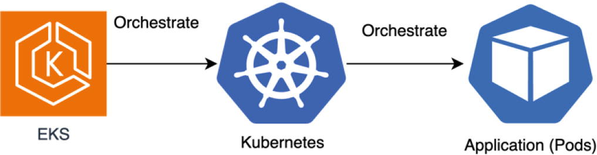

**Figure: EKS orchestrates Kubernetes workloads.** The visual compresses the basic model: EKS provides the managed Kubernetes control-plane experience, Kubernetes schedules and reconciles objects, and pods host application workloads.

**How to read it:** Follow the flow from EKS to Kubernetes to application pods. EKS is not the application runtime; it is the managed Kubernetes service boundary.

**How to apply it:** When debugging, separate failures into control-plane/API access, Kubernetes object reconciliation, node/pod runtime, and application behavior.

**Limitations:** The figure is conceptual. It does not show IAM, VPC networking, ENIs, add-ons, kubelet, load balancers, or storage.

## 3. Deep Concept Notes

### EKS Control Plane, Data Plane, And Cluster Endpoint

EKS creates and operates the Kubernetes control plane for the cluster. The API server, etcd, scheduler, controller manager, and AWS-managed control-plane networking are abstracted away from direct customer administration. The customer still designs the data plane: VPC, subnets, worker nodes, security groups, pod networking, service exposure, and operational access.

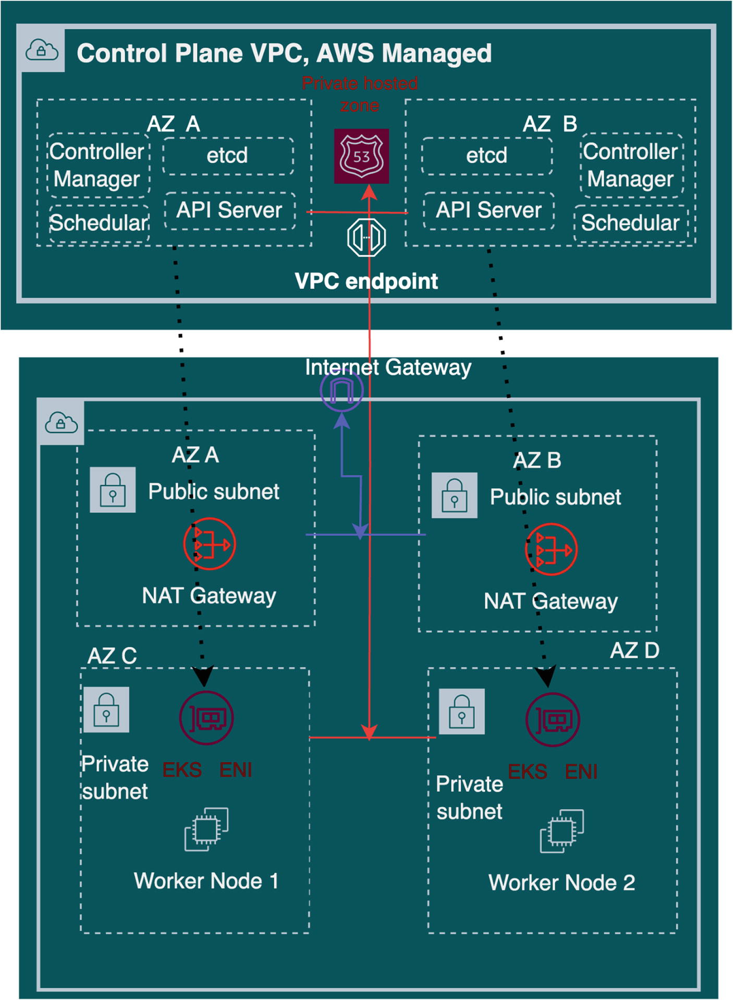

**Figure: EKS control plane and customer data plane.** The architecture separates the AWS-managed control plane from customer-managed worker nodes in the customer VPC.

**How to read it:** The Kubernetes API server and core control-plane components live in AWS-managed infrastructure. Worker nodes and pods run in customer subnets. EKS creates elastic network interfaces and security group relationships so the control plane can communicate with the nodes.

**How to apply it:** In design reviews, ask two separate questions: "Can administrators securely reach the API endpoint?" and "Can the control plane and nodes communicate over the required network paths?" The answer depends on endpoint mode, VPC routing, security groups, and DNS behavior.

**Limitations:** The diagram does not make every operational dependency visible. A real cluster also depends on IAM roles, add-on versions, node bootstrap, CNI health, subnet capacity, and Kubernetes RBAC.

The endpoint access model is the first major EKS design decision:

- **Public endpoint:** The Kubernetes API endpoint is reachable from the internet, optionally restricted by allowed CIDR ranges. This is convenient for labs and distributed administrators but has the largest exposure surface.
- **Private endpoint:** The Kubernetes API endpoint is reachable only inside the VPC or connected private networks. This reduces public exposure but requires a working operational access path such as bastion, VPN, Direct Connect, Session Manager, or private automation runners.
- **Hybrid endpoint:** Both public and private access are enabled. This supports transition and mixed administration but can create confusion unless public access is tightly restricted and tested.

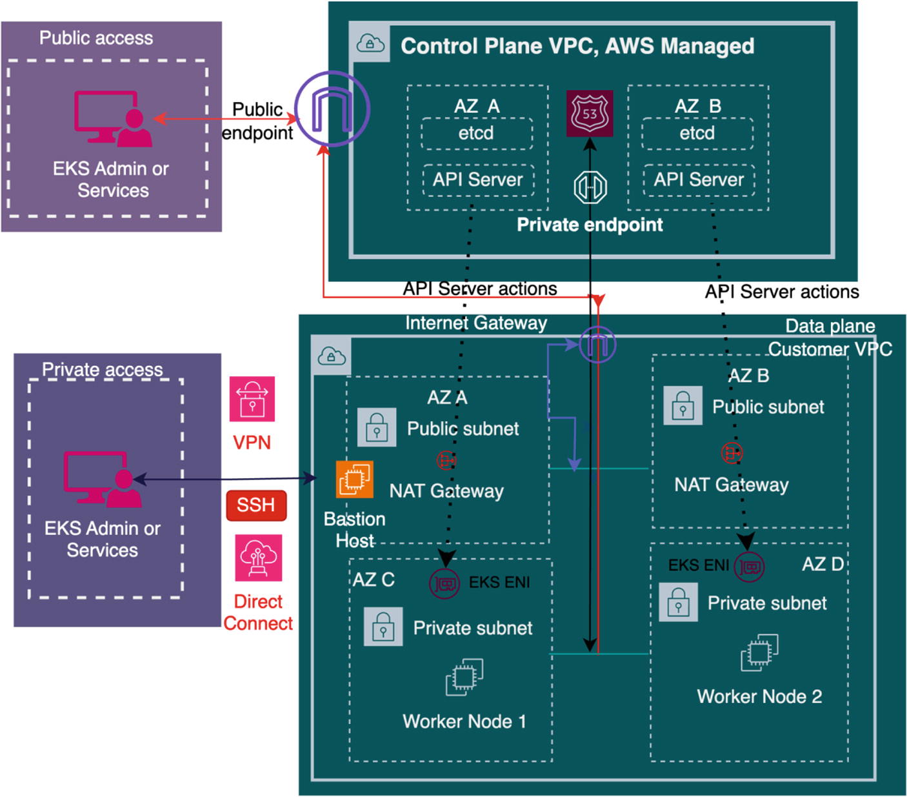

**Figure: Hybrid endpoint access.** The visual shows EKS API access through both public and private paths.

**How to read it:** One path allows access from outside the VPC through the public endpoint. Another path allows access from inside connected private networks. Both paths ultimately target the Kubernetes API server.

**How to apply it:** Use hybrid access only when there is a concrete need, such as migration from public administration to private administration. Validate both paths separately, then remove public access or narrow public CIDRs when private operations are ready.

**Limitations:** The figure does not enforce least privilege. Endpoint reachability is not authorization; IAM and Kubernetes access still need to be correct.

### Terraform Cluster Structure

The implementation chapters use Terraform to create repeatable cluster infrastructure. The source examples organize code into modules such as control plane, data plane, bastion, pod, networking, IAM, and add-ons.

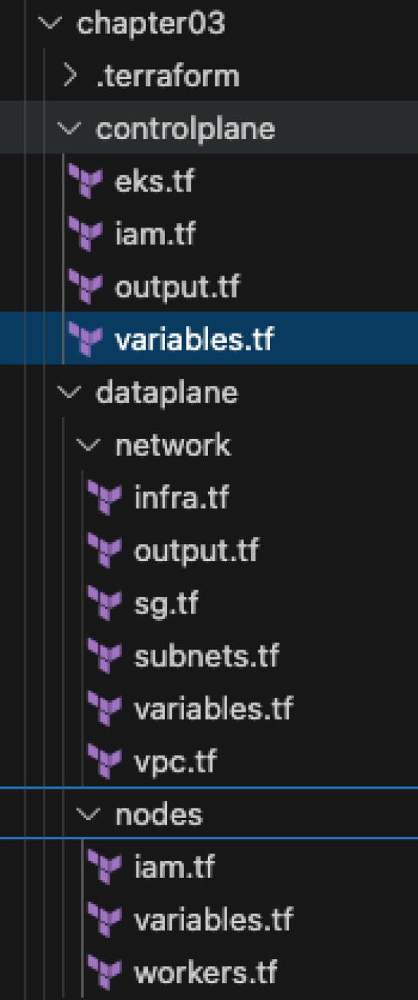

**Figure: Terraform project structure.** The project layout separates control-plane and data-plane responsibilities.

**How to read it:** The directory structure is a dependency map. Control-plane resources define the cluster and endpoint. Data-plane resources define nodes, security groups, subnets, IAM roles, and workload support. Later chapters add bastion, pod, add-on, autoscaler, mesh, and identity modules.

**How to apply it:** Keep modules aligned to ownership boundaries. A cluster module should expose outputs needed by node, add-on, and workload modules without forcing unrelated modules to inspect provider internals.

**Limitations:** A directory structure is not a full delivery system. Production code still needs remote state, locking, provider version pinning, environment separation, tagging, review workflow, drift detection, and rollback.

A practical Terraform deployment workflow from the book can be adapted as:

```bash
terraform init
terraform plan
terraform apply
aws eks update-kubeconfig --name <cluster-name> --region <region>
kubectl get nodes
kubectl get pods -A
```

The workflow solves a sequencing problem: create the infrastructure, update local Kubernetes context, then validate cluster usability. In production, add account/region preflight, plan review, state locking, change approval, and cleanup strategy.

### Private And Hybrid Endpoint Operations

Private endpoint clusters require the administrator to run `kubectl` from a network path that can reach the private API endpoint. The book demonstrates a bastion-centered pattern in which a bastion host sits in the VPC or reachable administrative network and is permitted to talk to the cluster endpoint.

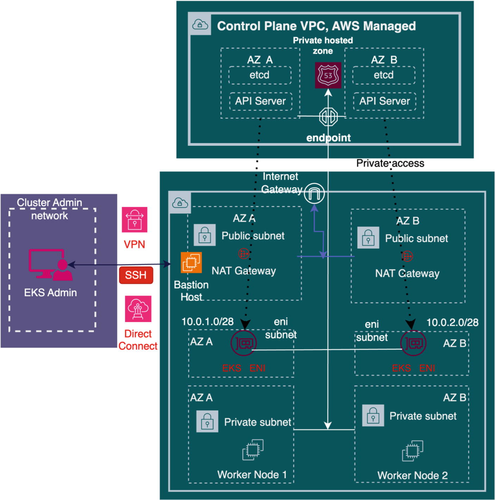

**Figure: Private endpoint cluster with bastion access.** The architecture places administrative access behind a private network path rather than the public internet.

**How to read it:** The admin connects through VPN, Direct Connect, or bastion-like controlled access. The bastion or private runner reaches the cluster endpoint inside the VPC. Worker nodes remain in private subnets.

**How to apply it:** Use private endpoints for production clusters when operations tooling can run inside the network boundary. Validate security group rules, DNS resolution, Session Manager or SSH access, and `aws eks update-kubeconfig` from the bastion path.

**Limitations:** A bastion can become a single operational choke point. Harden it with SSM Session Manager where possible, no broad inbound SSH, logging, patching, MFA-backed access, and emergency break-glass procedures.

Hybrid endpoint clusters are useful during migration and testing because administrators can compare public and private paths.

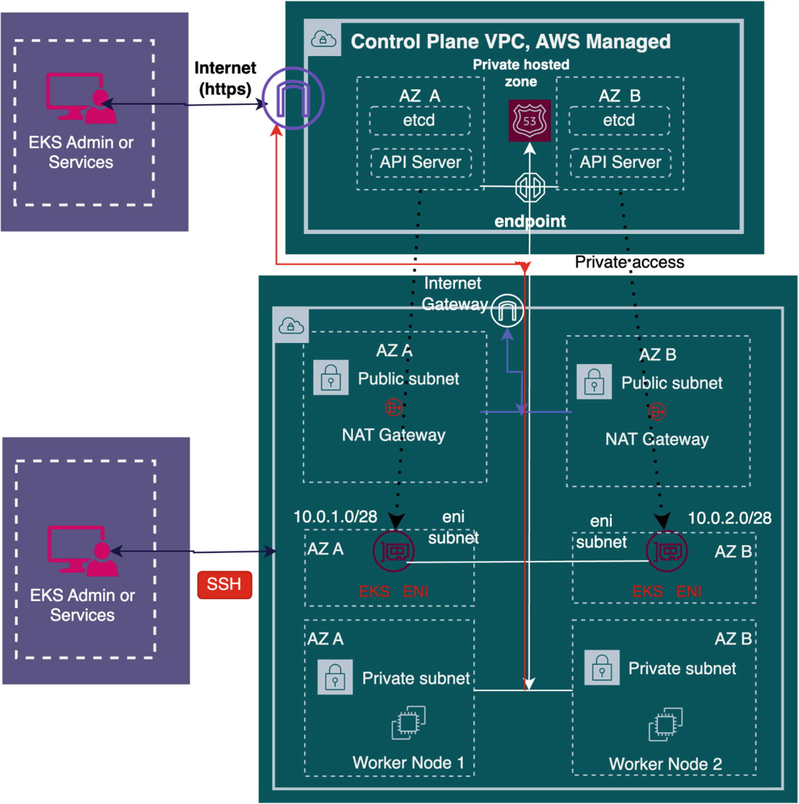

**Figure: Hybrid endpoint cluster architecture.** The visual shows both outside and inside access paths to the control plane.

**How to apply it:** Test public and private path behavior deliberately:

```bash
aws eks update-kubeconfig --name <cluster-name> --region <region>
kubectl auth whoami
kubectl get nodes
kubectl get pods -A
```

Run the same checks from an external workstation and from the private path. If the private path works, restrict or disable public access.

### Worker Nodes, Node Groups, And Update Strategy

EKS workloads run on a data plane. The book covers managed nodes, self-managed nodes, Fargate, custom launch templates, AMI creation, Packer-based images, and graceful node group updates.

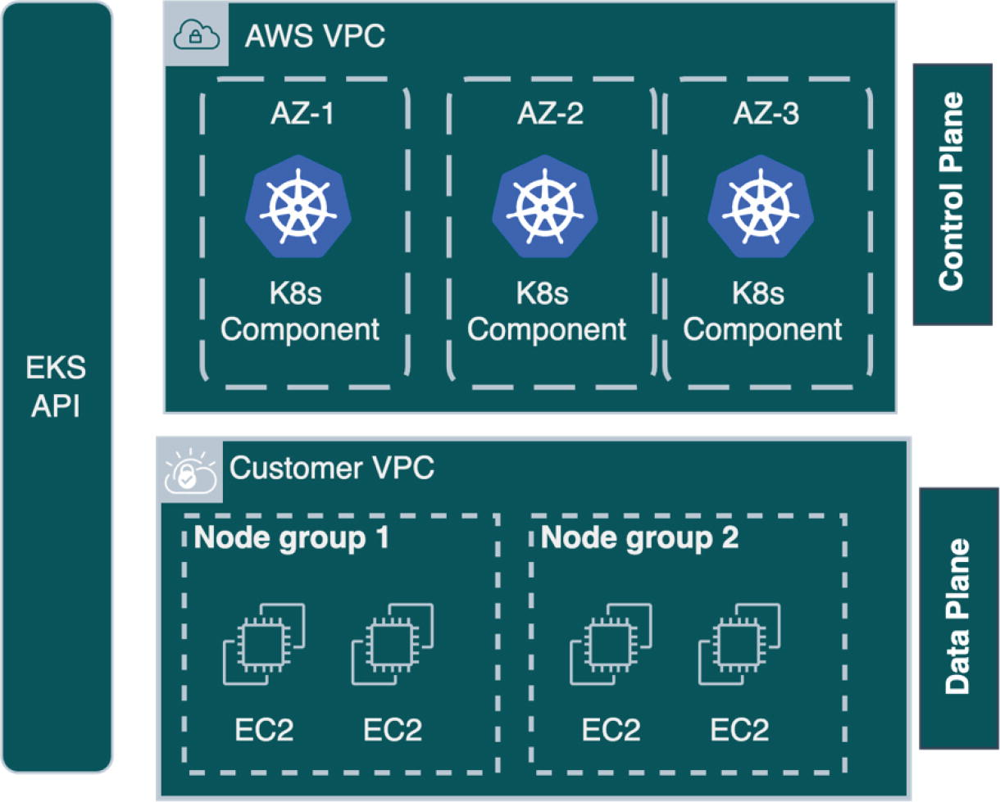

**Figure: EKS node groups.** The visual shows a managed control plane connected to worker node capacity across Availability Zones.

**How to read it:** Worker nodes are where kubelet, kube-proxy, CNI behavior, and pods execute. Node groups are capacity pools with update, scaling, and AMI behavior.

**How to apply it:** Prefer managed node groups for normal EKS operations unless you need deep AMI or lifecycle control. Use launch templates when you need custom AMIs, bootstrap arguments, storage, labels, taints, or instance configuration.

**Limitations:** The figure does not decide the right instance type, AMI patch process, PodDisruptionBudgets, or workload placement constraints.

Node design decisions:

- **Managed node groups:** Better default for most teams. AWS integrates lifecycle and update behavior, while you still manage scaling ranges, instance type, labels, taints, AMI release, and network placement.
- **Self-managed nodes:** More control, more responsibility. Use when custom bootstrap or unsupported lifecycle behavior is required.
- **Fargate:** Reduces node operations for compatible workloads but changes scheduling, DaemonSet, networking, and cost assumptions.
- **Custom launch templates:** Useful for hardened AMIs, Bottlerocket, custom disk size, additional user data, or specialized instance configuration. They also increase upgrade testing requirements.

Graceful updates require more than replacing nodes. Validate that workloads have enough replicas, readiness probes, PodDisruptionBudgets, and anti-affinity/spread behavior before draining or rolling a node group.

### Pod Networking, VPC CNI, And IP Capacity

EKS commonly uses the Amazon VPC CNI so pods receive VPC-routable IP addresses. This makes pod networking AWS-native, but it ties pod capacity to ENI limits, secondary IP allocation, subnet CIDR space, and CNI configuration.

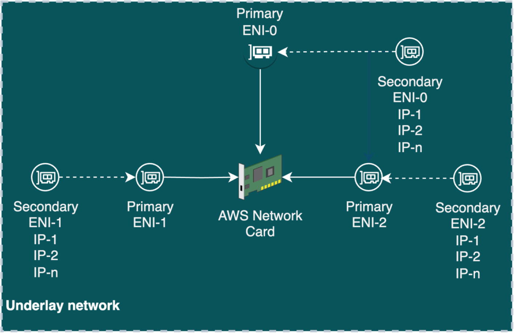

**Figure: VPC CNI ENI and pod IP allocation.** The visual shows ENIs with primary and secondary private IP addresses used for pod networking.

**How to read it:** Nodes attach ENIs. ENIs hold IP addresses. Pods consume those IP addresses. When a node runs out of allocatable pod IPs, scheduling can fail even if CPU and memory appear available.

**How to apply it:** Capacity planning must include subnet free IPs, instance ENI limits, pod density, warm IP or prefix behavior, and multi-AZ subnet allocation. Prefix assignment mode can improve pod density by assigning IP prefixes instead of individual secondary IPs.

**Limitations:** The visual does not show security groups for pods, IPv6, custom networking, network policy, or CNI failure states.

Validation checks:

```bash
kubectl get nodes -o wide
kubectl describe node <node-name>
kubectl get pods -A -o wide
kubectl -n kube-system get daemonset aws-node
kubectl -n kube-system logs daemonset/aws-node
```

Common failure signals include pods stuck in `Pending`, CNI errors in `aws-node` logs, subnet IP exhaustion, and nodes reporting insufficient pod capacity despite unused CPU/memory.

### Add-ons And Controllers

The book frames controllers as reconciliation loops. Kubernetes built-in controllers manage native objects. EKS add-ons and third-party controllers extend reconciliation to AWS or external systems.

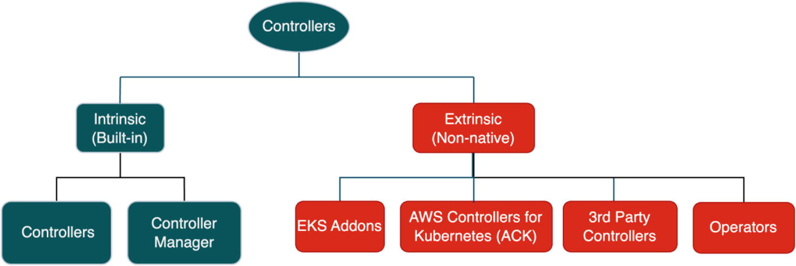

**Figure: Controller taxonomy.** The visual classifies built-in Kubernetes controllers, EKS add-on controllers, AWS controllers, operators, and third-party controllers.

**How to read it:** A controller watches desired state and makes actual state match. The object may be a Kubernetes workload, an EKS add-on, an AWS load balancer, an App Mesh resource, or a VPC Lattice object.

**How to apply it:** When something does not converge, inspect the object, events, CRDs, controller deployment, controller logs, IAM role, and dependent AWS resources.

**Limitations:** The figure explains categories, not health. A controller can be installed and still fail due to missing permissions, incompatible versions, CRD mismatch, or bad object spec.

Important add-on/controller categories:

- **VPC CNI:** Pod IP allocation and networking.
- **CoreDNS:** Cluster DNS.
- **kube-proxy:** Service networking.
- **AWS Load Balancer Controller:** ALB/NLB integration.
- **ACK controllers:** AWS resource management through Kubernetes custom resources.
- **Cluster Autoscaler/Karpenter:** Node capacity reconciliation.
- **App Mesh, Gateway API, Istio controllers:** Service-to-service routing and mesh/lattice behavior.

### IAM, `aws-auth`, RBAC, And EKS Access Entries

Legacy EKS access uses a split model. AWS IAM authenticates the caller. The `aws-auth` ConfigMap maps IAM users/roles into Kubernetes users/groups. Kubernetes RBAC then authorizes actions.

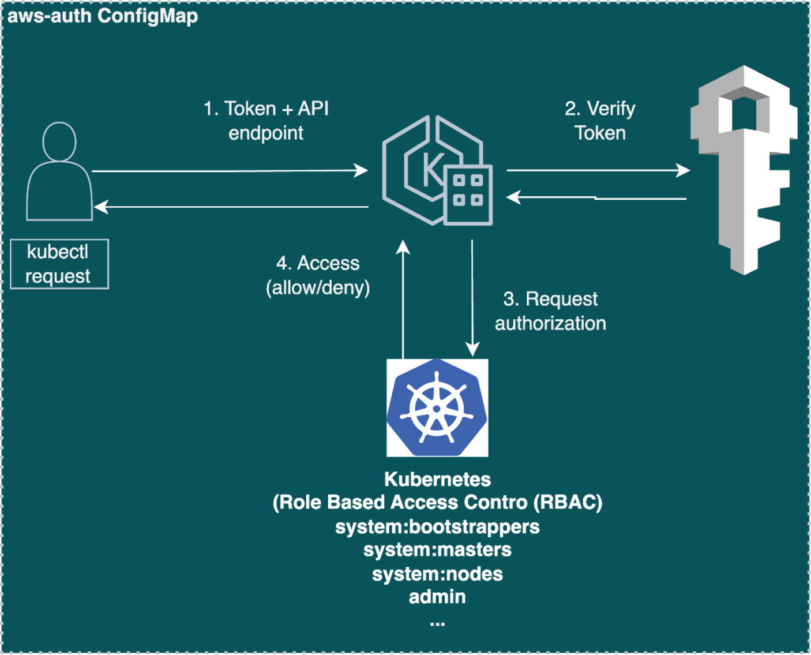

**Figure: Legacy `aws-auth` access flow.** A `kubectl` request carries an AWS-derived token to the Kubernetes API. Authentication is tied to AWS identity; authorization depends on RBAC mappings and Kubernetes groups.

**How to read it:** Successful AWS authentication does not imply Kubernetes authorization. The caller must map to groups with relevant roles.

**How to apply it:** Use `kubectl auth whoami` and `kubectl auth can-i` to prove the final Kubernetes identity and permissions, not only the AWS caller identity.

**Limitations:** The legacy method is operationally risky because ConfigMap editing is easy to break and cluster creator access can be hard to revoke cleanly.

Representative checks:

```bash
aws sts get-caller-identity
aws eks update-kubeconfig --name <cluster-name> --region <region>
kubectl auth whoami
kubectl auth can-i get pods -A
kubectl get configmap aws-auth -n kube-system -o yaml
```

EKS access entries and access policy associations move cluster access management into the EKS API and reduce reliance on manual ConfigMap editing.

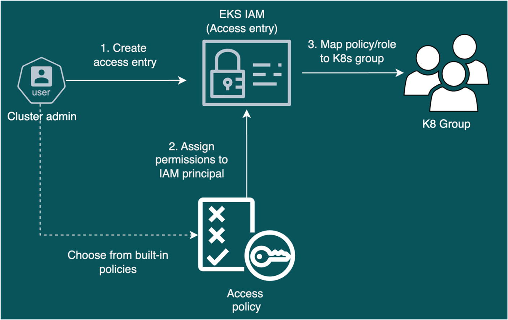

**Figure: EKS access entry and policy association flow.** An administrator creates an access entry for an IAM principal and associates permissions with it.

**How to read it:** The principal identity and EKS access policy association become explicit EKS-managed resources. Namespace-scoped access can be represented directly.

**How to apply it:** Prefer access entries for new clusters where supported. Use namespace-scoped access for tenant or team isolation, and reserve cluster-admin policies for platform administrators.

**Limitations:** Access entries do not remove the need to understand Kubernetes RBAC. Custom permissions may still require Kubernetes roles and bindings.

### Services, Load Balancers, And Traffic Entry

Pods are ephemeral, so service objects give stable access to selected pods. The book walks from local debugging with port forwarding and proxies to service types and AWS load balancers.

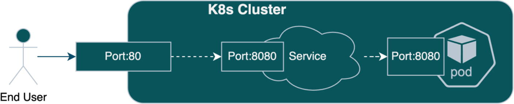

**Figure: ClusterIP service flow.** Requests target a stable service port that forwards to pod target ports.

**How to read it:** The service abstracts pod IPs and exposes a virtual cluster-internal address. Selector labels determine which pods become endpoints.

**How to apply it:** Use `ClusterIP` for internal service-to-service communication. Debug with selectors and endpoints before blaming the application.

**Limitations:** `ClusterIP` is internal to the cluster. It does not provide external access without port forwarding, ingress, load balancer, mesh, or gateway.

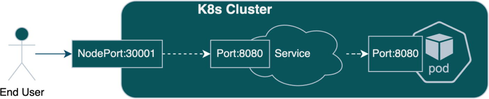

**Figure: NodePort service flow.** Traffic reaches a node port and is forwarded to service backends.

**How to read it:** NodePort exposes a port on nodes, which routes traffic to matching pods.

**How to apply it:** Use NodePort mainly as a learning, debugging, or load-balancer backend mechanism. For production internet ingress, prefer ALB/NLB or ingress/gateway patterns.

**Limitations:** NodePort can expose broad node-level attack surface and complicate network controls.

Core validation:

```bash
kubectl get deploy,pod,svc,endpoints -n <namespace>
kubectl describe svc <service-name> -n <namespace>
kubectl port-forward svc/<service-name> 8080:<service-port> -n <namespace>
kubectl logs deploy/<deployment-name> -n <namespace>
```

For AWS load balancers, validate Kubernetes object status, AWS Load Balancer Controller logs, subnet tags, security groups, target health, IAM permissions, and DNS name.

### Pod Service Accounts, IRSA, And Pod Identity

Kubernetes service accounts identify pods to the Kubernetes API. They do not automatically grant AWS API permissions. For AWS access, the book demonstrates IRSA and EKS Pod Identity.

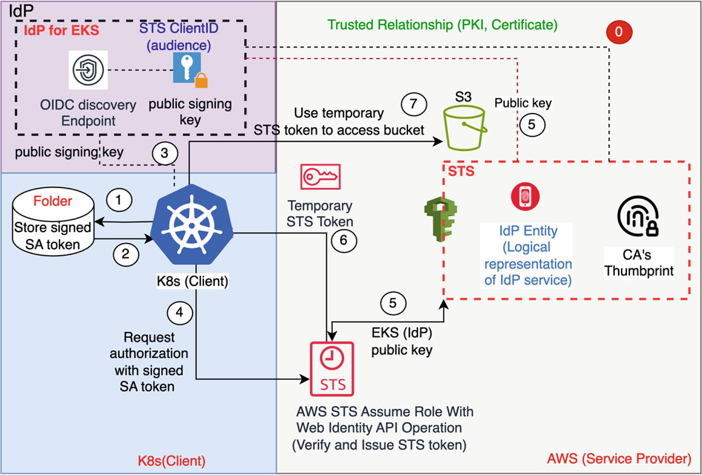

**Figure: IRSA flow.** A pod uses a projected service account token. AWS STS validates that token through the cluster OIDC provider and returns temporary credentials for an IAM role.

**How to read it:** Trust moves through OIDC. The IAM role trust policy must match the service account subject and audience. The pod gets temporary AWS credentials only when the trust relationship and annotation are correct.

**How to apply it:** Use one IAM role per workload responsibility, annotate the service account, scope permissions to required AWS APIs, and validate from inside the pod with `aws sts get-caller-identity`.

**Limitations:** IRSA is easy to misconfigure. Wrong OIDC provider, wrong service account namespace/name, missing annotation, or overly broad trust policy can break access or weaken security.

Practical validation:

```bash
kubectl get sa <service-account> -n <namespace> -o yaml
kubectl describe pod <pod-name> -n <namespace>
kubectl exec -it <pod-name> -n <namespace> -- aws sts get-caller-identity
kubectl logs <pod-name> -n <namespace>
```

Pod Identity simplifies some operational aspects by using EKS Pod Identity associations, but the design question stays the same: which workload should assume which AWS role, under which namespace/service account boundary, with which least-privilege policy?

### Storage And Persistence

Kubernetes volumes attach data to pods. Ephemeral volumes disappear with pod lifecycle. Persistent volumes decouple storage lifecycle from pod lifecycle. The book covers ephemeral volumes, secret volumes, hostPath, persistent volumes, NFS provisioners, EBS, and EFS.

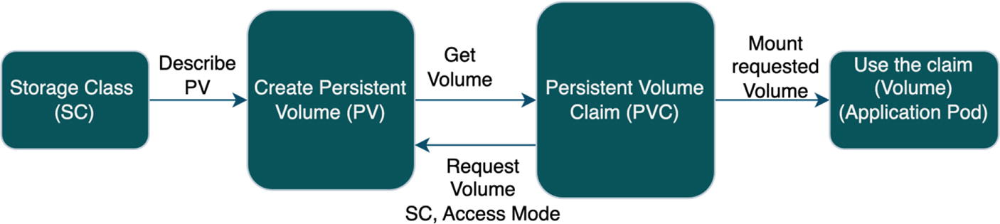

**Figure: Persistent volume provisioning.** The visual shows the relationship between storage class, persistent volume creation, persistent volume claim, and pod usage.

**How to read it:** A workload asks for storage through a PVC. The storage class and provisioner decide how storage is created. The pod mounts the claim, not the cloud volume directly.

**How to apply it:** Use EBS for single-node block storage patterns, EFS for shared file storage, and carefully evaluate access modes, AZ constraints, backup needs, performance, and reclaim policy.

**Limitations:** The figure does not show data protection. Production persistence needs backup/restore tests, encryption, retention, access controls, and failure-domain planning.

Validation:

```bash
kubectl get storageclass
kubectl get pv,pvc -A
kubectl describe pvc <claim-name> -n <namespace>
kubectl describe pod <pod-name> -n <namespace>
```

Failure modes include unbound PVCs, wrong storage class, missing CSI driver, insufficient IAM permissions for the CSI controller, AZ mismatch for EBS, and application assumptions that a volume is shared when it is not.

### Deployment, Rolling Updates, And Pod Scaling

ReplicaSets maintain replica count. Deployments manage ReplicaSets and rolling updates.

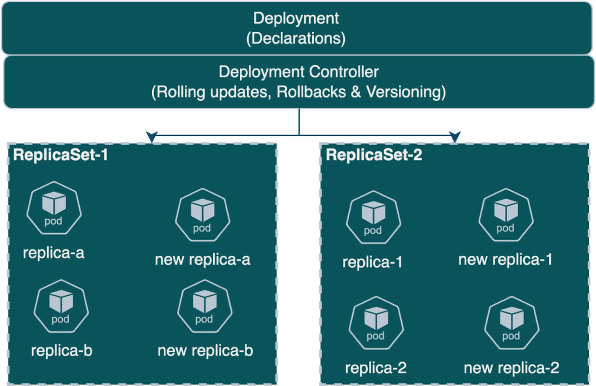

**Figure: Deployment rolling update flow.** A deployment controller creates and shifts traffic between ReplicaSets during rollout.

**How to read it:** The deployment is the desired-state declaration. ReplicaSets are versioned implementation details. Pods are replaceable runtime units.

**How to apply it:** Change images or pod templates through deployments, validate rollout status, and use readiness probes to avoid sending traffic to unready pods.

**Limitations:** A deployment cannot protect you from bad application behavior by itself. Use probes, resource requests, PDBs, logs, metrics, and rollback procedures.

Useful commands:

```bash
kubectl apply -f deployment.yml
kubectl rollout status deployment/<name> -n <namespace>
kubectl rollout history deployment/<name> -n <namespace>
kubectl rollout undo deployment/<name> -n <namespace>
kubectl describe deploy/<name> -n <namespace>
```

### Monitoring And Operator Tooling

The book covers Kubernetes Dashboard, kubefwd, Lens, K9s, and common object-access commands. Treat these as operator interfaces over the same API, not as replacements for observability architecture.

Use dashboard-style tools for exploration and situational awareness. Use CLI and logs for repeatable diagnosis. Use metrics, alerts, traces, and log aggregation for production operations.

Minimum checks:

```bash
kubectl get events -A --sort-by=.lastTimestamp
kubectl top nodes
kubectl top pods -A
kubectl describe pod <pod-name> -n <namespace>
kubectl logs <pod-name> -n <namespace> --previous
```

### Cluster Autoscaler And Karpenter

Cluster Autoscaler adjusts Auto Scaling Groups or node groups when pods cannot schedule. Karpenter provisions nodes more directly using workload requirements and NodePool/NodeClass-style configuration.

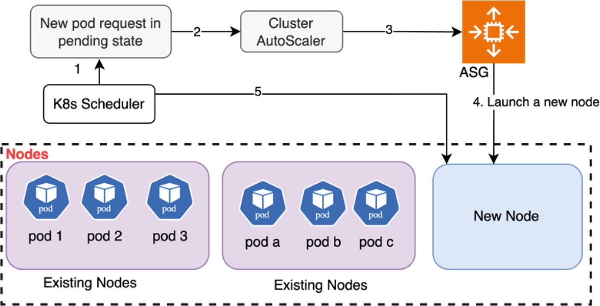

**Figure: Cluster Autoscaler flow.** Pending pods trigger the autoscaler, which changes desired capacity in the backing node group or ASG.

**How to read it:** The autoscaler reacts after scheduling pressure appears. It needs tags, IAM permissions, matching service account identity, and correctly configured node groups.

**How to apply it:** Tag node groups for discovery, grant only needed autoscaling and describe permissions, run the controller in `kube-system`, and validate with a deliberately inflated workload.

**Limitations:** Cluster Autoscaler can be slow and constrained by pre-existing node group shapes. It does not choose arbitrary optimal instance types unless those are represented in node group configuration.

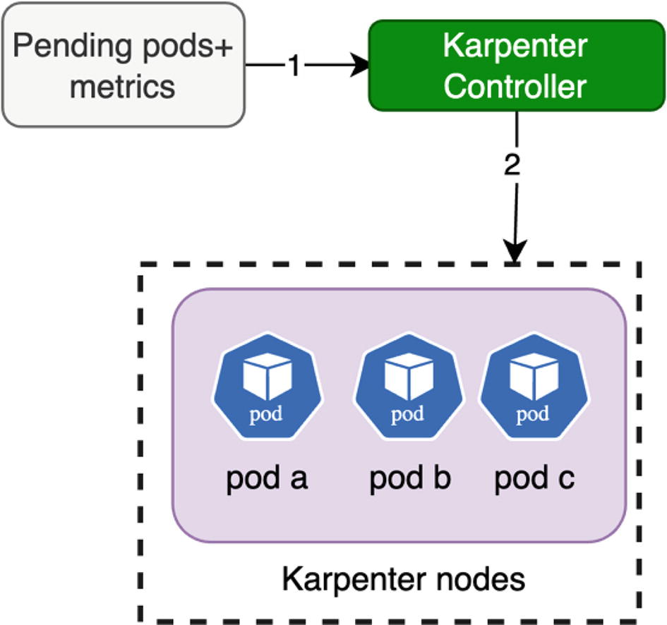

**Figure: Karpenter flow.** Pending pods and workload requirements flow to the Karpenter controller, which provisions suitable nodes.

**How to read it:** Karpenter is closer to direct capacity selection. It can select instance types and create nodes that fit pod constraints.

**How to apply it:** Use Karpenter when fast, flexible, cost-aware node provisioning matters. Define NodePools, EC2 node classes, taints, requirements, subnet selectors, security group selectors, and interruption/expiration behavior deliberately.

**Limitations:** Karpenter still depends on IAM, subnet capacity, security group tags, AMI family, workload requests, tolerations, and scheduling constraints. Bad pod specs produce bad scaling behavior.

Validation workflow:

```bash
kubectl get pods -n karpenter
kubectl logs -f -n karpenter -l app.kubernetes.io/name=karpenter
kubectl apply -f deployment/inflate-app.yml
kubectl scale deployment inflate --replicas 4
kubectl get pods
kubectl get nodes
```

### Service Mesh, App Mesh, VPC Lattice, And Istio

The final chapter uses service-to-service networking to explain why mesh/lattice abstractions exist: routing, traffic shifting, service discovery, observability, policy, and communication between microservices.

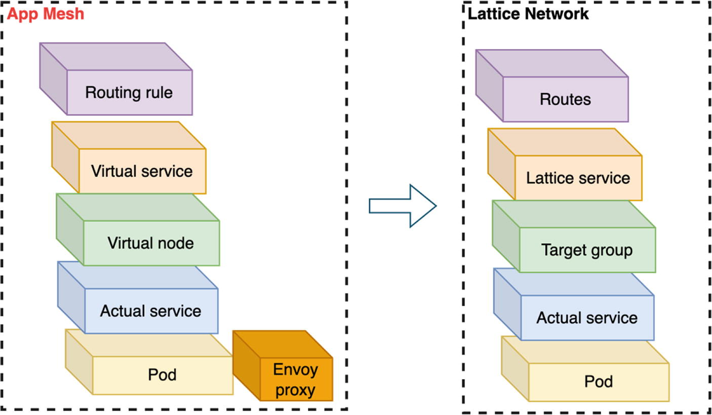

**Figure: App Mesh to VPC Lattice mapping.** The visual maps App Mesh concepts such as virtual service, virtual node, routes, and Envoy proxy to VPC Lattice concepts such as lattice service, target group, and routes.

**How to read it:** VPC Lattice removes the sidecar-heavy model for many AWS-native use cases. App Mesh uses Envoy proxies and mesh resources. VPC Lattice shifts more networking responsibility to managed AWS service networking.

**How to apply it:** Choose App Mesh/Istio when you need mesh behavior and are ready to operate sidecar/control-plane complexity. Choose VPC Lattice when AWS-native managed service-to-service connectivity, monitoring, and authorization fit the problem.

**Limitations:** The book notes AWS's move away from App Mesh. Verify current AWS service status and migration guidance before adopting App Mesh for new systems.

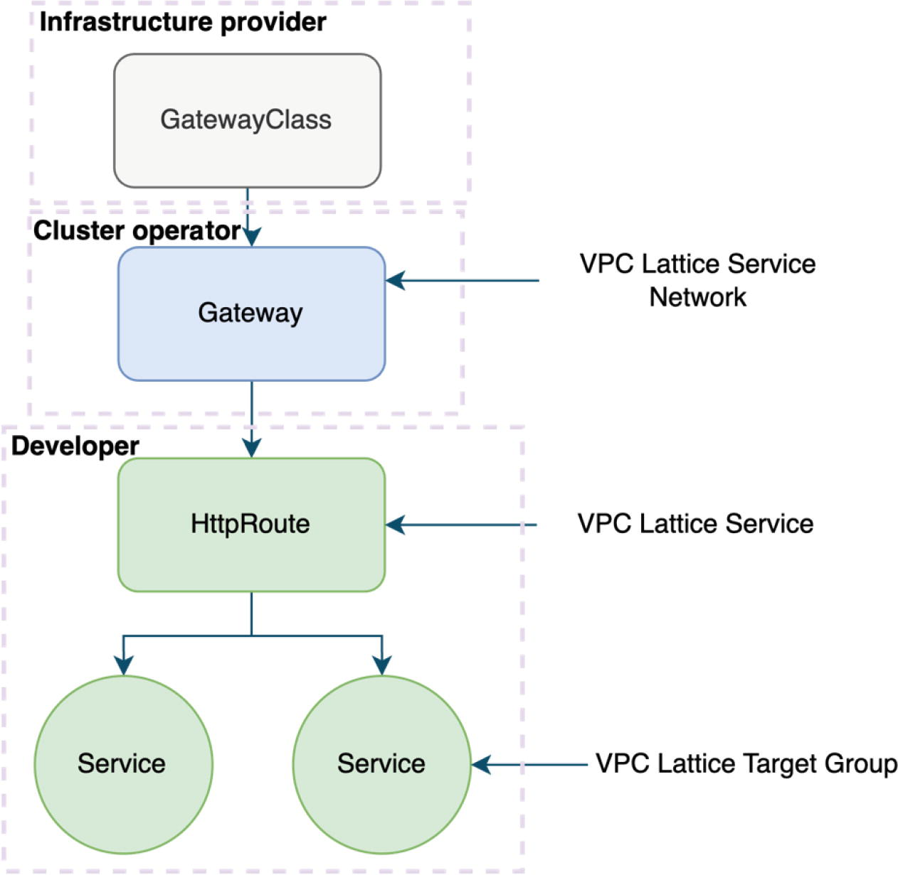

**Figure: Gateway API and VPC Lattice roles.** The Gateway API model separates infrastructure provider, cluster operator, and developer responsibilities.

**How to read it:** GatewayClass belongs to platform/infrastructure ownership. Gateway maps to service network concerns. HTTPRoute and Services are closer to application team ownership.

**How to apply it:** Use role separation to prevent application teams from owning low-level network service setup while still letting them declare routes to services.

**Limitations:** The model needs governance. Without naming, namespace, policy, and ownership rules, Gateway API resources can become another shared-cluster conflict surface.

## 4. Implementation Patterns And Engineering Practices

### Pattern: Public Endpoint Cluster For Learning Or Constrained Admin Access

- **Problem solved:** Fast cluster access from a workstation or remote administrator.
- **Mechanism:** Enable public Kubernetes API endpoint and restrict allowed CIDR ranges where possible.
- **Use when:** Labs, isolated sandboxes, or temporary access where private operations infrastructure is not available.
- **Avoid when:** Production clusters with sensitive workloads, broad administrator populations, or strict network controls.
- **Validation:** Confirm endpoint mode, run `kubectl auth whoami`, then test from allowed and denied networks.
- **Failure modes:** Overly broad `0.0.0.0/0` access, stale administrator IP ranges, confusing IAM success with Kubernetes authorization.

### Pattern: Private Endpoint Cluster With Bastion Or Private Runner

- **Problem solved:** Keep Kubernetes API access off the public internet.
- **Mechanism:** Enable private endpoint access, place operational tooling in the VPC or connected network, and authorize security group traffic to the endpoint.
- **Use when:** Production, regulated environments, private-only clusters, or centralized platform automation.
- **Avoid when:** The organization lacks reliable private connectivity or incident access.
- **Validation:** From the bastion/private runner, run `aws eks update-kubeconfig`, `kubectl get nodes`, `kubectl get pods -A`, and `kubectl auth can-i`.
- **Failure modes:** DNS resolution failure, endpoint security group blocks, bastion lacks IAM permissions, no break-glass path during VPN outage.

### Pattern: Module-Oriented Terraform Cluster Delivery

- **Problem solved:** Repeatable, reviewable EKS infrastructure.
- **Mechanism:** Separate modules for cluster/control plane, network, node groups, IAM, bastion/access, add-ons, and workload examples.
- **Use when:** You need environment repeatability and change review.
- **Avoid when:** One-off console changes are being used as the source of truth.
- **Validation:** `terraform plan`, output review, `terraform apply`, kubeconfig update, Kubernetes object validation, AWS console or CLI checks for dependent resources.
- **Failure modes:** State drift, hidden dependencies between modules, provider version changes, lack of teardown order.

### Pattern: Managed Node Groups First, Custom Nodes When Needed

- **Problem solved:** Provide worker capacity with manageable lifecycle.
- **Mechanism:** Use managed node groups for normal workloads; add launch templates or custom AMIs when needed.
- **Use when:** Teams want AWS-integrated updates and predictable worker management.
- **Avoid when:** Requirements need unsupported customization, specialized bootstrap, or nonstandard lifecycle.
- **Validation:** Node readiness, labels/taints, AMI release, launch template version, rolling update behavior, workload disruption.
- **Failure modes:** Incompatible AMI/bootstrap, insufficient subnets, wrong security group, unmanaged drain behavior, workload PDB blocks.

### Pattern: Controller-Backed AWS Integration

- **Problem solved:** Let Kubernetes objects drive AWS infrastructure such as load balancers, mesh resources, gateway/lattice services, or ACK-managed resources.
- **Mechanism:** Install a controller, grant IAM permissions through IRSA or Pod Identity, apply CRDs/manifests, then watch reconciliation.
- **Use when:** You want declarative cluster-native integration with AWS.
- **Avoid when:** Teams cannot operate controller versions, IAM scope, or CRD lifecycle.
- **Validation:** Controller pods healthy, CRDs present, object status populated, events clean, AWS resource created, traffic or behavior works.
- **Failure modes:** Missing IAM permission, bad subnet tags, incompatible controller version, invalid manifest, controller crash loop.

### Pattern: Workload Identity Through Service Account Boundary

- **Problem solved:** Pods need AWS permissions without node-wide credentials.
- **Mechanism:** Bind a Kubernetes service account to an IAM role using IRSA or EKS Pod Identity.
- **Use when:** Workloads call S3, Secrets Manager, ECR, CloudWatch, DynamoDB, or other AWS APIs.
- **Avoid when:** You can avoid AWS API access entirely or centralize access behind a safer internal service.
- **Validation:** Pod uses expected service account, `aws sts get-caller-identity` inside pod returns expected role, application can call only intended APIs.
- **Failure modes:** Default service account used accidentally, broad IAM policy, wrong namespace in trust policy, missing OIDC provider.

### Pattern: Autoscaling By Proving Scheduling Pressure

- **Problem solved:** Add nodes only when pods cannot schedule.
- **Mechanism:** Deploy autoscaler/Karpenter, then create or scale a workload that exceeds current capacity.
- **Use when:** Cluster workloads vary and overprovisioning is costly.
- **Avoid when:** Workloads have fixed capacity needs or the organization cannot tolerate scaling latency.
- **Validation:** Pending pods appear, autoscaler logs explain scale-up, new nodes join, pods transition to Running, scale-down behavior works.
- **Failure modes:** Missing ASG tags, insufficient IAM, pods unschedulable for reasons autoscaler cannot solve, no subnet IP capacity, wrong taints/tolerations.

## 5. Code, Configuration, And Workflow Notes

### Safe EKS Workstation Preflight

```bash
aws sts get-caller-identity
aws configure get region
aws eks describe-cluster --name <cluster-name> --region <region> \
  --query 'cluster.{name:name,status:status,endpoint:endpoint,version:version}'
aws eks update-kubeconfig --name <cluster-name> --region <region>
kubectl config current-context
kubectl auth whoami
kubectl get nodes
```

This workflow proves account identity, region, cluster existence, kubeconfig context, Kubernetes identity, and basic node visibility. It should precede any mutating cluster operation.

### Endpoint Access Validation

```bash
aws eks describe-cluster --name <cluster-name> --region <region> \
  --query 'cluster.resourcesVpcConfig.{public:endpointPublicAccess,private:endpointPrivateAccess,cidrs:publicAccessCidrs}'
kubectl get --raw /readyz
kubectl get nodes -o wide
```

Run this from each intended operator location. For private clusters, validate from the bastion/private runner. For public clusters, validate that disallowed networks cannot connect.

### Legacy `aws-auth` Review

```bash
kubectl get configmap aws-auth -n kube-system -o yaml
kubectl auth whoami
kubectl auth can-i '*' '*' --all-namespaces
kubectl auth can-i get pods -n default
```

Use this to determine whether a caller is overprivileged. A principal mapped to `system:masters` should be rare and intentionally approved.

### Access Entry Review

```bash
aws eks list-access-entries --cluster-name <cluster-name>
aws eks list-associated-access-policies \
  --cluster-name <cluster-name> \
  --principal-arn <principal-arn>
kubectl auth can-i get pods -n <namespace>
```

Use namespace-scoped access where possible. Keep cluster-admin access small, named, reviewed, and break-glass controlled.

### Service Debugging Workflow

```bash
kubectl get deploy,pod,svc,endpoints -n <namespace>
kubectl describe svc <service-name> -n <namespace>
kubectl get pod -l app=<label> -n <namespace> -o wide
kubectl port-forward svc/<service-name> 8080:<service-port> -n <namespace>
curl http://localhost:8080
```

The workflow validates selector-to-pod matching before investigating external ingress or load balancer configuration.

### IRSA Or Pod Identity Validation From Inside The Pod

```bash
kubectl get sa <service-account> -n <namespace> -o yaml
kubectl exec -it <pod-name> -n <namespace> -- env | grep AWS
kubectl exec -it <pod-name> -n <namespace> -- aws sts get-caller-identity
kubectl exec -it <pod-name> -n <namespace> -- aws s3 ls s3://<expected-bucket>
```

The key is proving the workload receives the intended AWS role, not merely that it runs.

### Cluster Autoscaler Validation

```bash
kubectl -n kube-system get deployment cluster-autoscaler
kubectl -n kube-system logs -f deployment.apps/cluster-autoscaler
kubectl apply -f inflate-app.yml
kubectl scale deployment inflate --replicas 3
kubectl get pods
kubectl get nodes
```

If replicas remain pending, inspect pod events. If autoscaler does not react, inspect controller logs, node group discovery tags, and IAM permissions.

### Karpenter Validation

```bash
kubectl get pods -n karpenter
kubectl logs -f -n karpenter -l app.kubernetes.io/name=karpenter
kubectl get nodepool
kubectl get ec2nodeclass
kubectl scale deployment inflate --replicas 4
kubectl get nodes
```

Karpenter requires correct workload requests and scheduling constraints. A pod with impossible affinity or missing toleration will not be fixed by more capacity.

### VPC Lattice Or Gateway API Validation

```bash
kubectl get gatewayclass,gateway,httproute -A
kubectl describe httproute <route-name> -n <namespace>
kubectl get svc -n <namespace>
kubectl get events -n <namespace> --sort-by=.lastTimestamp
```

Then validate the corresponding VPC Lattice service, target group, association, route, and DNS endpoint in AWS.

## 6. Testing, Validation, And Verification

| Area | What To Prove | Commands Or Checks | Failure Signals |
|---|---|---|---|
| Account context | Operator is in the intended account and region | `aws sts get-caller-identity`, `aws configure get region` | Resources created in wrong account or region |
| Cluster endpoint | API endpoint is reachable only from intended paths | `aws eks describe-cluster`, `kubectl get --raw /readyz` | Timeout, DNS failure, unauthorized public access |
| Kubernetes identity | Caller maps to expected Kubernetes user/groups | `kubectl auth whoami`, `kubectl auth can-i` | IAM identity works but Kubernetes says forbidden |
| Nodes | Nodes are Ready and in expected subnets/AZs | `kubectl get nodes -o wide`, AWS console/CLI | NotReady, wrong AMI, failed bootstrap |
| CNI/IPAM | Pods can receive IPs and communicate | `kubectl -n kube-system logs ds/aws-node`, `kubectl describe node` | Pending pods, CNI allocation errors, subnet exhaustion |
| Add-ons | Core controllers are healthy | `kubectl get pods -n kube-system`, add-on status in EKS | CoreDNS crash loops, controller errors |
| Services | Service selectors produce endpoints and traffic works | `kubectl get svc,endpoints`, port-forward/curl | Empty endpoints, 404/timeout, bad target port |
| Load balancers | AWS LB is provisioned and targets healthy | Controller logs, AWS target health, DNS test | No LB address, unhealthy targets, security group blocks |
| Pod identity | Pod assumes intended AWS role | `aws sts get-caller-identity` inside pod | AccessDenied, wrong role, missing web identity token |
| Storage | PVC binds and pod can persist data | `kubectl get pv,pvc`, pod write/restart/read test | Pending PVC, mount errors, data loss |
| Autoscaling | Pending pods trigger correct capacity changes | Autoscaler/Karpenter logs, node count, pod status | No scale-up, wrong nodes, scale-down too aggressive |
| Mesh/Lattice | Routes send traffic to intended services | Gateway/route status, curl loop, logs | 503, no target group, wrong route weights |

Verification should include negative tests:

- A disallowed user cannot access the cluster.
- A public endpoint rejects access from nonapproved CIDRs.
- A pod without the correct service account cannot call protected AWS APIs.
- A service with a broken selector has no endpoints, proving the test detects misconfiguration.
- Scaling down does not evict critical system pods or violate PDBs.

## 7. Chapter-by-Chapter Knowledge Extraction

### Chapter 1: Introduction To EKS

The chapter frames EKS as managed Kubernetes. The main learning point is the relationship between AWS EKS, Kubernetes orchestration, and application pods. EKS reduces control-plane operations but does not remove Kubernetes concepts. Engineers still need to understand pods, scheduling, services, networking, IAM, and operational validation.

**Application:** Start any EKS design by clarifying what AWS manages and what the platform team manages. The platform team still owns workload runtime, access, network, storage, monitoring, and scaling behavior.

### Chapter 2: EKS Architecture And Cluster Access Control

This is a high-density architecture chapter. It introduces the control plane, API server, etcd, controller manager, scheduler, Route 53 integration, data plane, customer VPC, cluster security group, ENIs, and endpoint access modes.

**Mechanism:** Administrators and automation reach the Kubernetes API through an endpoint. The API server changes cluster desired state. Controllers and scheduler reconcile that state. Worker nodes run kubelet and host pods. Security groups and ENIs allow control-plane/data-plane communication.

**Decision:** Choose public, private, or hybrid endpoint access based on operational access requirements, not convenience. Private access requires a reliable private administration path. Public access requires strong CIDR restriction and IAM/RBAC discipline.

### Chapter 3: EKS Implementations

This high-density chapter implements a public endpoint cluster through Terraform. It covers role assignment, security groups, data plane VPC, subnets, network infrastructure, nodes, IAM, `main.tf`, Terraform deployment, AWS console review, add-ons, cluster ENIs, CLI queries, cluster tests, running an application, endpoint restrictions, network security, additional security groups, stability, and deletion.

**Mechanism:** Terraform builds the control plane and data plane, then the operator validates with AWS console and CLI. The workflow demonstrates that a cluster is not complete until node groups join, add-ons are active, access works, and a test workload runs.

**Reusable workflow:** create or assume the cluster creator role, apply the Terraform root module, update kubeconfig, inspect cluster endpoint/add-ons/ENIs/security groups, run a test pod or deployment, and then restrict endpoint CIDRs. The chapter's practical lesson is sequencing: access, network, nodes, add-ons, workloads, and endpoint hardening must all be verified.

**Validation checks:** confirm cluster status is `Active`, node groups show Ready nodes, `kubectl get pods -A` shows healthy system pods, the application responds through the selected access path, and public endpoint restrictions block unapproved sources.

**Failure modes:** Terraform success but no Ready nodes; cluster endpoint open too broadly; add-on unhealthy; kubeconfig points to wrong cluster; security group changes break control-plane/node traffic.

### Chapter 4: Endpoint Private Access Cluster

This high-density chapter implements private endpoint access. It creates cluster creator roles, users that assume roles, an EKS describe-cluster policy, credential configuration, bastion code, bastion security group, network setup, worker nodes, cluster security group review, Terraform deployment, and bastion-based connection.

**Mechanism:** A private endpoint cluster requires an internal administrative path. The bastion or private runner becomes the place where kubeconfig and `kubectl` can reach the API server.

**Reusable workflow:** create role/user assumption path, grant enough permission to describe the cluster, deploy bastion and private network path, apply cluster infrastructure, validate the cluster security group and bastion security group, then connect from the bastion to the private endpoint.

**Tradeoff:** The model improves API exposure posture but moves operational reliability to the private access path. If VPN, Direct Connect, SSM Session Manager, bastion IAM, or private DNS fails, administrators may lose normal access.

**Operational guidance:** Test IAM role assumption and private endpoint reachability separately. A private endpoint failure can be IAM, DNS, routing, security group, or kubeconfig related.

### Chapter 5: Endpoint Hybrid Access Cluster

This chapter repeats much of the private endpoint implementation but enables both public and private access. It reviews cluster creator role setup, bastion code, network setup, control plane, worker nodes, security group rules, Terraform deployment, cluster review, cleanup, public test, private test, and public endpoint restrictions.

**Mechanism:** Hybrid endpoint mode allows access through public and private paths. This is useful for proving private operations before fully closing public access.

**Reusable workflow:** deploy the hybrid cluster, validate `kubectl` from a public workstation, validate `kubectl` from the private/bastion path, tighten public CIDRs, repeat both positive and negative tests, then decide whether public endpoint access is still required.

**Validation checks:** public path should succeed only from approved CIDRs; private path should succeed from the intended internal route; both paths should map to the same expected Kubernetes identity and RBAC permissions.

**Risk:** Hybrid can become permanently overexposed if the team never disables or restricts the public endpoint.

### Chapter 6: Cluster Nodes

This high-density chapter compares managed nodes, self-managed nodes, Fargate, launch templates, AMIs, Packer-built images, managed node deployment, custom launch templates, user data, graceful node group update, and cluster upgrade tips.

**Mechanism:** Nodes provide compute, kubelet, pod runtime, and networking. Node groups define capacity pools. Launch templates and AMIs define node shape and bootstrap behavior.

**Reusable workflow:** start with a managed node group, inspect launch template and Auto Scaling Group behavior, add a custom launch template only when a concrete requirement exists, test node bootstrap, then validate graceful update by observing pod disruption during a node group rollout.

**Failure modes:** custom AMI missing EKS bootstrap dependencies, launch template security group mismatch, node role missing permissions, user data breaks bootstrap, PDBs prevent drain, or workload replicas are too low for safe replacement.

**Application:** Use managed nodes as the default, custom launch templates for controlled customization, and self-managed nodes only when the operational team is ready to own lifecycle complexity.

### Chapter 7: EKS IP Address Management

This high-density chapter explains node IP addressing, VPC CNI behavior, pod density, pod density demonstrations, prefix assignment mode, and validation.

**Mechanism:** Pod scheduling capacity depends on IP allocation. The VPC CNI allocates pod IPs from the VPC through ENIs. Prefix assignment mode can improve address assignment efficiency and pod density.

**Reusable workflow:** deploy a node, inspect its ENIs and secondary addresses, schedule enough pods to approach pod-density limits, observe `aws-node` behavior, enable prefix assignment where appropriate, and repeat the density test.

**Validation checks:** compare expected maximum pods per node with actual schedulable pods, inspect subnet free IP addresses, and confirm CNI logs do not show IP allocation failures.

**Failure mode:** A cluster can have spare CPU/memory and still fail scheduling because it lacks pod IP capacity.

### Chapter 8: EKS Add-ons

The chapter explains controllers, intrinsic and extrinsic controllers, EKS add-on controllers, ACK, operators, third-party add-ons, self-managed add-ons, implementation, deployment validation, version upgrade, and controller deployment.

**Mechanism:** Add-ons are reconciled components. Some are critical to cluster function, such as VPC CNI, CoreDNS, and kube-proxy. Others extend cluster behavior into AWS services or third-party systems.

**Reusable workflow:** list installed add-ons, compare versions with cluster version support, upgrade in a controlled environment, inspect controller rollout, then validate the behavior the add-on owns. For VPC CNI this means pod networking; for CoreDNS this means DNS resolution; for AWS controllers this means AWS resource reconciliation.

**Application:** Manage add-ons as versioned infrastructure with compatibility checks, controller logs, and rollback plans.

### Chapter 9: Identity And Access Management

This chapter covers the deprecated `aws-auth` ConfigMap approach, token-based access, kubeconfig, RBAC roles, user Alice examples, namespace admin mapping, manual ConfigMap editing, cluster editor roles, and custom groups.

**Mechanism:** IAM authenticates. Kubernetes RBAC authorizes. `aws-auth` maps IAM principals to Kubernetes users/groups.

**Risk:** Manual editing can break access. Cluster creator access can persist in ways that are difficult for organizations to control.

### Chapter 10: The New Cluster Access Management

This chapter introduces access entries, policy associations, built-in access entry policies, authentication modes, granting cluster creator access, namespace access, custom permissions through Kubernetes RBAC, IAM role assignments, console-created access entries, and disabling cluster creator access.

**Mechanism:** EKS access entries represent IAM principals and policy associations as EKS-managed access resources.

**Application:** Prefer this model for new clusters where supported. Keep custom Kubernetes RBAC for permissions not represented by built-in EKS access policies.

### Chapter 11: Kubernetes

The chapter summarizes Kubernetes benefits and architecture: API server, etcd, scheduler, controller manager, kubelet, kube-proxy, add-ons, and pods.

**Application:** EKS operators still need Kubernetes fundamentals. Managed control plane does not remove the need to understand reconciliation, desired state, pods, services, controllers, and node agents.

### Chapter 12: Running Apps On Kubernetes

This chapter covers container packaging, Docker Desktop, running containers on a cluster, custom images, image layers, image optimization, Docker Hub, ECR, and running images on EKS.

**Mechanism:** Applications are packaged as container images, pushed to registries, and referenced in Kubernetes manifests. Runtime success depends on image pull access, registry authentication, tags, and pod spec correctness.

**Application:** Use immutable image tags, registry scanning, minimal base images, and private ECR for production workloads.

### Chapter 13: The Pod Object

This chapter explores pod specification fields: name, namespace, priority, service account, node, labels, annotations, status, QoS, node selectors, tolerations, events, and event listing.

**Mechanism:** The pod spec is the scheduling and runtime contract. Labels select pods. Service accounts set identity. Node selectors/tolerations affect placement. QoS depends on resource requests and limits.

**Validation:** `kubectl describe pod` and events explain scheduling, image pull, permission, and runtime problems better than `kubectl get pod` alone.

### Chapter 14: The Service Object

This high-density chapter covers pod deployment, internal access, port forwarding, proxying, service objects, NodePort, ClusterIP testing, load balancers, AWS ELB, Classic Load Balancer, NLB, ALB, ALB prerequisites, instance metadata, AWS Load Balancer Controller installation, troubleshooting, ALB creation, and testing.

**Mechanism:** Services abstract pods. Load balancers expose selected services externally. ALB/NLB integration depends on Kubernetes manifests plus AWS controller permissions and network tagging.

**Reusable workflow:** deploy the pod/deployment, expose it with a ClusterIP service, prove endpoints exist, test locally with port forwarding, then add external exposure through NodePort, NLB, ALB, or ingress only after internal service behavior is proven.

**Validation checks:** `kubectl get endpoints` proves selector matching; target group health proves load balancer-to-pod reachability; controller logs prove reconciliation; curl/browser tests prove application behavior.

**Failure modes:** Empty endpoints, wrong target port, missing controller, bad subnet tags, unhealthy target groups, security group blocks, or wrong ingress annotations.

### Chapter 15: Pod Service Accounts

This high-density chapter covers RBAC, pod access tests, Secrets Manager, S3/ECR access, IRSA, trust establishment, OIDC automation, testing with port forwarding and exec, debug containers, Pod Identity, Terraform, and CLI tests.

**Mechanism:** Kubernetes service accounts and AWS IAM roles are connected through IRSA or Pod Identity so pods can call AWS APIs safely.

**Reusable workflow:** first prove Kubernetes service account and RBAC behavior, then create IAM policy/role, establish OIDC trust or Pod Identity association, annotate or associate the service account, redeploy the pod, and test AWS API access from inside the pod.

**Failure modes:** service account mismatch, namespace mismatch in trust policy, missing OIDC provider, broad IAM permissions, pod using default service account, SDK falling back to node credentials, or bucket/secret policy denying the role.

**Application:** Scope AWS permissions to workload identity, validate from inside the pod, and never rely on node instance profile permissions for application access unless deliberately chosen.

### Chapter 16: Pod Persistence

This high-density chapter covers Kubernetes volumes, ephemeral volumes, secret volumes, persistent volumes, hostPath, NFS provisioner, EBS, EFS, implementation, and tests.

**Mechanism:** Workload state moves from pod-local lifetime to persistent volume lifetime through PV/PVC/storage class abstractions.

**Reusable workflow:** start with an ephemeral volume to understand pod lifetime, test a Secret volume for configuration material, use hostPath only as a node-local learning pattern, then move to PV/PVC with EBS or EFS for real persistence. For every persistent example, write data, restart/reschedule the pod, and verify whether the data survives as intended.

**Failure modes:** using ephemeral storage for durable state, using hostPath as if it were portable, binding an EBS volume in one AZ then scheduling the pod in another, missing CSI driver IAM permissions, or assuming EFS and EBS have the same consistency/performance profile.

**Decision:** Use ephemeral volumes for temporary state, Secret volumes for mounted secrets, EBS for single-writer block storage, and EFS for shared file workloads.

### Chapter 17: Pod Scaling

The chapter covers Kubernetes controllers, ReplicaSets, manifests, experiments, Deployments, deployment manifests, rolling update strategy, and deployment experiments.

**Mechanism:** Deployments own ReplicaSets and manage rolling changes. ReplicaSets maintain replica count.

**Application:** Use deployments for application rollout, not bare pods. Validate rollout status and rollback behavior.

### Chapter 18: Pod Monitoring

This chapter covers Kubernetes Dashboard, kubefwd, namespace/service account/service/secret/access control/deployment manifests, admin service accounts, Lens, K9s, object access, and common commands.

**Mechanism:** Operator tools access Kubernetes API resources and present cluster state. They are useful for navigation but do not replace monitoring architecture.

**Application:** Use tools like K9s for fast diagnosis, but preserve CLI workflows and centralized observability for repeatable operations.

### Chapter 19: Cluster Autoscaling

This high-density chapter covers Cluster Autoscaler, autoscaling demonstration, autoscaler controller deployment, Karpenter, Karpenter implementation, controller installation, NodePool deployment, application deployment, and comparison.

**Mechanism:** Cluster Autoscaler scales existing node group capacity. Karpenter provisions capacity more flexibly based on pending pods and node requirements.

**Reusable workflow:** deliberately create scheduling pressure with an inflated deployment, observe Pending pods, inspect autoscaler or Karpenter logs, watch node creation, verify pods transition to Running, then scale down and observe consolidation or scale-down behavior.

**Failure modes:** Cluster Autoscaler discovery tags missing, controller service account lacks AWS permissions, autoscaler version does not match cluster version, Karpenter selectors do not match subnets/security groups, workload requests are unrealistic, or pod affinity/toleration rules cannot be satisfied.

**Decision:** Use Cluster Autoscaler when node group-based scaling is sufficient. Use Karpenter when workload shapes vary and faster, more flexible capacity selection matters.

### Chapter 20: Service Mesh And VPC Lattice

The longest and densest chapter covers service orchestration, AWS App Mesh, App Mesh data/control plane, implementation, deployment scenarios, traffic management, logging, CloudWatch/Fluent Bit, VPC Lattice, Gateway API Controller, blue-green deployment, Istio, and Istio ingress gateway.

**Mechanism:** Mesh/lattice systems create service-to-service routing and visibility above basic Kubernetes Services. App Mesh and Istio use Envoy sidecars. VPC Lattice provides AWS-managed service networking abstractions.

**Reusable workflow:** start by proving plain Kubernetes service-to-service communication, add mesh or lattice resources for routing, deploy controllers, validate sidecar injection or lattice target group creation, shift traffic between blue/green services, then add access logs and metrics.

**Tradeoff:** App Mesh and Istio give detailed mesh control but add sidecars, CRDs, controller lifecycle, and debugging complexity. VPC Lattice reduces in-pod sidecar complexity for AWS-native service networking but binds the design more closely to AWS service abstractions.

**Validation checks:** confirm controller health, resource status, sidecar readiness where relevant, route weights, service DNS, target health, access logs, and repeated curl tests that prove traffic distribution.

**Decision:** For AWS-native managed networking, evaluate VPC Lattice and Gateway API. For portable mesh behavior, evaluate Istio. Treat App Mesh cautiously for new designs because the source emphasizes AWS's move toward VPC Lattice.

## 8. Architecture Decision Guide

| Decision | Prefer This | When | Avoid Or Reconsider When | Validation Questions |
|---|---|---|---|---|
| Endpoint access | Private endpoint | Production clusters with private operations path | No reliable VPN/Direct Connect/bastion/private runner | Can operators reach API during incident? Is DNS private path working? |
| Endpoint access | Public restricted endpoint | Learning or temporary admin access | Broad public CIDRs, sensitive workloads | Are CIDRs narrow? Can denied networks connect? |
| Endpoint access | Hybrid endpoint | Migration from public to private operations | No plan to remove public access | Which path is primary? When will public be disabled? |
| Nodes | Managed node groups | General workloads | Deep customization required | Are node updates and drains tested? |
| Nodes | Self-managed nodes | Specialized lifecycle or AMI control | Team lacks node ops maturity | Who patches, drains, replaces, and debugs nodes? |
| Nodes | Fargate | Compatible workloads that should avoid node management | DaemonSets or host-level needs | Are logging, networking, and cost assumptions valid? |
| Pod IPAM | VPC CNI default | AWS-native pod IP integration | Subnet IP scarcity | How many pod IPs per subnet/AZ are available? |
| Pod IPAM | Prefix assignment | Higher pod density | Unsupported instance/CNI constraints | Did pod density improve in validation? |
| Access | EKS access entries | New access management | Unsupported legacy-only cluster | Are policies namespace-scoped where possible? |
| Access | `aws-auth` | Legacy clusters | New cluster design | Is ConfigMap managed safely and reviewed? |
| AWS pod access | IRSA/Pod Identity | Pod calls AWS APIs | Node-wide IAM is being used as shortcut | Does pod assume only intended role? |
| Service exposure | ClusterIP | Internal service access | External users need access | Do endpoints match pods? |
| Service exposure | ALB/NLB | Internet or VPC entry to services | Controller/IAM/subnet tagging not ready | Are targets healthy and security groups correct? |
| Storage | EBS | Single-node block storage | Shared-write file needs | Is AZ placement compatible? |
| Storage | EFS | Shared file access | Low-latency block storage required | Are throughput, access point, and permissions tested? |
| Autoscaling | Cluster Autoscaler | Node group-based scaling | Need rapid flexible provisioning | Are ASG tags and IAM correct? |
| Autoscaling | Karpenter | Flexible, workload-shaped nodes | Organization cannot operate NodePools/EC2 classes | Are disruption and consolidation rules safe? |
| Service networking | VPC Lattice | AWS-native managed service networking | Portability or mesh-specific features dominate | Are Gateway API roles and routes governed? |
| Service mesh | Istio | Portable mesh and sidecar features | Team cannot operate mesh complexity | Are sidecar injection, routing, and observability tested? |

## 9. System Design Playbooks

### Playbook: Production Private EKS Cluster

1. Define VPC, subnets, route tables, DNS, and endpoint strategy.
2. Enable private endpoint access and disable or tightly restrict public endpoint access.
3. Build an operational access path: VPN/Direct Connect, private CI runner, SSM-backed bastion, or trusted admin subnet.
4. Create cluster IAM role, node roles, and least-privilege operator access entries.
5. Deploy managed node groups across multiple AZs with labels, taints, and scaling ranges.
6. Install and pin critical add-ons: VPC CNI, CoreDNS, kube-proxy, EBS/EFS CSI drivers if needed, AWS Load Balancer Controller if using AWS ingress.
7. Validate API access from private path, node readiness, pod IP allocation, DNS, service routing, and load balancer provisioning.
8. Add observability, audit logging, backup, upgrade, and incident access procedures before onboarding workloads.

### Playbook: Team Namespace With Least-Privilege Access

1. Create namespace and resource quotas/limits.
2. Create Kubernetes roles for namespace operators or developers.
3. Create EKS access entries or RBAC bindings for IAM principals.
4. Grant only namespace-scoped access unless cluster-scoped objects are required.
5. Use dedicated service accounts for workloads.
6. Bind AWS permissions through IRSA or Pod Identity per workload.
7. Validate with `kubectl auth can-i` and negative tests from unauthorized users.

### Playbook: Expose A Web Application Through ALB

1. Deploy workload with readiness probes and labels.
2. Create a ClusterIP service targeting the correct container port.
3. Install AWS Load Balancer Controller with correct IAM and subnet tags.
4. Apply ingress or controller-specific manifests.
5. Validate controller logs, ingress status, ALB DNS, target groups, target health, security groups, and application response.
6. Add TLS, WAF, logging, health-check path, and deployment rollback for production.

### Playbook: Add AWS API Access To A Pod

1. Identify the smallest AWS permissions the workload needs.
2. Create an IAM policy and role.
3. Bind the role to a Kubernetes service account through IRSA or Pod Identity.
4. Deploy workload using that service account.
5. Exec into the pod and run `aws sts get-caller-identity`.
6. Test allowed API calls and denied API calls.
7. Monitor CloudTrail for unexpected API usage.

### Playbook: Scale Nodes With Karpenter

1. Confirm workload requests/limits are realistic.
2. Install Karpenter controller on stable capacity.
3. Define EC2 node class with subnet and security group selectors.
4. Define NodePool requirements, taints, consolidation, expiration, and disruption settings.
5. Deploy a workload that exceeds current capacity.
6. Watch Karpenter logs, node creation, pod scheduling, and scale-down.
7. Add budgets, interruption handling, and cost monitoring before production rollout.

## 10. Operating, Troubleshooting, And Debugging

### Cluster API Access Fails

Check in order:

1. `aws sts get-caller-identity` confirms the intended AWS principal.
2. `aws eks describe-cluster` succeeds for the cluster and region.
3. Endpoint access mode matches your network location.
4. Public CIDR restrictions or private route/security group/DNS settings allow your source.
5. `aws eks update-kubeconfig` wrote the expected context.
6. `kubectl auth whoami` and `kubectl auth can-i` prove Kubernetes authorization.

Likely root causes: wrong account/region, wrong cluster name, endpoint not reachable, IAM principal not mapped, access entry missing, RBAC missing, or kubeconfig stale.

### Nodes Do Not Join

Check node IAM role, subnet routing, security groups, bootstrap/user data, AMI compatibility, CNI health, and cluster security group rules. Use EC2 console/system logs and `kubectl get nodes` if the node appears.

Likely root causes: node cannot reach API endpoint, missing node role permissions, incorrect launch template, unsupported AMI, security group blocks, or private endpoint DNS failure.

### Pods Stay Pending

Run:

```bash
kubectl describe pod <pod-name> -n <namespace>
kubectl get events -n <namespace> --sort-by=.lastTimestamp
kubectl describe node <node-name>
```

Look for insufficient CPU/memory, no matching node selector, missing toleration, PVC unbound, pod IP exhaustion, image pull issue, or autoscaler constraints.

### Service Has No Traffic

Check service selector, endpoints, pod readiness, target port, network policy if used, load balancer target health, security groups, and controller logs.

If endpoints are empty, the service selector does not match ready pods. If endpoints are present but traffic fails, inspect target port, application listener, network path, and security group rules.

### Pod Cannot Call AWS API

Check service account, IRSA/Pod Identity binding, IAM trust policy, OIDC provider, role permissions, environment variables inside the pod, and AWS SDK credential chain.

Use `aws sts get-caller-identity` inside the pod to prove role identity before testing the target service API.

### PVC Does Not Bind Or Mount

Check storage class, CSI driver pods, IAM permissions for the CSI controller, access mode, zone constraints, PV/PVC events, and pod mount events.

EBS is zone-bound. A pod scheduled to the wrong AZ may not mount an EBS volume. EFS requires network path and file-system permissions.

### Autoscaler Does Not Add Nodes

Check whether pods are actually unschedulable, controller logs, IAM permissions, node group discovery tags for Cluster Autoscaler, Karpenter NodePool/EC2NodeClass selectors, subnet capacity, and instance type availability.

Autoscalers cannot solve impossible scheduling constraints such as required labels no node template provides, missing tolerations, or PVC topology conflicts.

### Mesh Or Lattice Route Fails

Check CRD/resource status, controller pods/logs, namespace labels for sidecar injection if using mesh, service selectors, route weights, target health, gateway/lattice association, and DNS.

For sidecar meshes, also check that pods have the sidecar injected and are `2/2` ready where expected.

## 11. Applying This Knowledge To Existing Systems

Use this review sequence for an existing EKS cluster:

1. **Inventory cluster basics:** version, endpoint access mode, logging, add-ons, node groups, subnets, CIDRs, and tags.
2. **Review access:** list EKS access entries, `aws-auth`, cluster-admin users, namespace roles, break-glass roles, and stale principals.
3. **Review node posture:** managed/self-managed/Fargate mix, AMI versions, launch templates, scaling ranges, taints/labels, and update process.
4. **Review IP capacity:** subnet free IPs, VPC CNI mode, pod density, ENI limits, and historical pending pod events.
5. **Review workload identity:** identify pods using node IAM permissions, default service account, broad IRSA roles, or stale OIDC trust.
6. **Review service exposure:** map Services, Ingresses, load balancers, security groups, TLS, target health, public exposure, and DNS.
7. **Review persistence:** list storage classes, CSI drivers, PV reclaim policies, backup/restore coverage, and data ownership.
8. **Review autoscaling:** inspect Cluster Autoscaler/Karpenter configuration, logs, scale-up/down behavior, cost, and disruption settings.
9. **Review observability:** events, logs, metrics, audit logs, dashboards, alarms, and runbooks.
10. **Review mesh/lattice usage:** determine whether service networking abstractions are solving real problems or adding unused complexity.

Produce findings as risks with evidence and remediation. Avoid changing endpoint mode, access mappings, or node groups until a rollback path exists.

## 12. Applying This Knowledge To New Systems

For a new EKS platform, choose defaults deliberately:

- Use private endpoint access unless there is a specific reason not to.
- Use managed node groups initially; add Karpenter when workload diversity or cost pressure justifies it.
- Use EKS access entries and namespace-scoped permissions where possible.
- Use IRSA or Pod Identity for every pod that calls AWS APIs.
- Use VPC CNI with explicit IP capacity planning and consider prefix assignment when pod density requires it.
- Install only required add-ons and controllers, with pinned compatible versions.
- Use ALB/NLB through AWS Load Balancer Controller for ingress where appropriate.
- Use EBS/EFS CSI drivers only when workloads need persistent storage.
- Add observability and audit logging before production workloads.
- Treat service mesh, VPC Lattice, and Gateway API as separate design decisions after basic service patterns are understood.

Minimum design artifacts:

- Endpoint and admin access diagram.
- IAM/RBAC access model.
- VPC/subnet/IP capacity plan.
- Node group or Karpenter capacity model.
- Add-on and controller inventory.
- Workload identity policy pattern.
- Ingress/service exposure model.
- Storage and backup model.
- Upgrade, rollback, and incident access runbooks.

## 13. Technology Mapping

| Technology | Role In EKS System | Key Operational Checks |
|---|---|---|
| EKS control plane | Managed Kubernetes API/control-plane components | Cluster status, version, endpoint access, control-plane logs |
| Kubernetes API server | Entry point for cluster desired state | Reachability, authn/authz, `/readyz` |
| etcd | Cluster state store managed by AWS in EKS | Indirect through control-plane health |
| kubelet | Node agent running pods | Node readiness, pod status, node logs |
| kube-proxy | Service networking implementation | Add-on status, service connectivity |
| VPC CNI | Pod IP allocation and networking | `aws-node` logs, subnet free IPs, ENI capacity |
| CoreDNS | Cluster DNS | CoreDNS pods, DNS queries, service discovery |
| Managed node group | Worker capacity pool | AMI version, scaling, readiness, updates |
| Launch template | Node customization | Version, user data, AMI, security groups |
| `aws-auth` | Legacy IAM-to-Kubernetes mapping | ConfigMap contents, `kubectl auth whoami` |
| EKS access entries | New EKS access management | Entries, policy associations, namespace scope |
| Kubernetes RBAC | Kubernetes authorization | Roles, bindings, `can-i` checks |
| IRSA | AWS role assumption by pod through OIDC | Trust policy, annotation, STS identity |
| EKS Pod Identity | AWS role association for pods | Association, agent/controller health, STS identity |
| AWS Load Balancer Controller | ALB/NLB reconciliation | Controller logs, subnet tags, target groups |
| EBS CSI Driver | Block storage provisioning | PVC binding, controller IAM, AZ alignment |
| EFS CSI Driver | Shared file storage provisioning | Mount targets, network path, access points |
| Cluster Autoscaler | Node group scaling from pending pods | ASG tags, logs, node changes |
| Karpenter | Flexible node provisioning | NodePools, EC2NodeClasses, controller logs |
| App Mesh | AWS service mesh with Envoy | Controller, sidecars, mesh resources |
| VPC Lattice | AWS managed service networking | Gateway API resources, service network, target groups |
| Istio | Portable service mesh | Control plane, sidecars, gateways, virtual services |

## 14. Production Readiness And Delivery Checklist

- [ ] Target AWS account, region, and environment are explicit.
- [ ] Cluster endpoint access mode is documented and validated.
- [ ] Private operational access path exists and is tested.
- [ ] Public endpoint, if enabled, is restricted and justified.
- [ ] EKS control-plane logging is enabled according to audit needs.
- [ ] Cluster creator and cluster-admin access are reviewed and minimized.
- [ ] EKS access entries or `aws-auth` mappings are managed as code.
- [ ] Kubernetes RBAC is namespace-scoped where possible.
- [ ] Node groups span intended AZs and use supported AMIs.
- [ ] Node upgrade and drain process is tested with real workloads.
- [ ] VPC CNI version and pod IP capacity are reviewed.
- [ ] Subnets have enough free IPs for nodes, pods, load balancers, and growth.
- [ ] Critical add-ons are version pinned and monitored.
- [ ] Workloads use dedicated service accounts.
- [ ] AWS API access from pods uses IRSA or Pod Identity with least privilege.
- [ ] Ingress/load balancer controllers have scoped IAM and healthy targets.
- [ ] Storage classes, CSI drivers, backups, and restore tests are defined.
- [ ] Readiness/liveness probes and resource requests are present for production workloads.
- [ ] Autoscaling behavior is load tested and cost reviewed.
- [ ] Logs, metrics, events, and audit trails are centralized.
- [ ] Break-glass access is documented, tested, and monitored.
- [ ] Terraform state is remote, locked, backed up, and access controlled.
- [ ] Destructive operations and cluster deletion have explicit safeguards.
- [ ] Runbooks exist for endpoint failure, node failure, CNI/IP exhaustion, access lockout, storage failure, ingress failure, and autoscaler failure.

## 15. Knowledge Gaps And Further Study

The book is implementation-oriented and provides many Terraform and console workflows. Areas that require additional study before production standardization:

- Current AWS service lifecycle and migration guidance for App Mesh versus VPC Lattice should be verified before new adoption.
- EKS version-specific behavior, add-on compatibility, and controller versions change over time.
- Network policy, security groups for pods, IPv6, custom networking, and multi-cluster/multi-account patterns need deeper design work.
- Full backup/restore strategy for Kubernetes objects, persistent data, and disaster recovery is outside the book's main flow.
- Production observability should go beyond dashboard tooling into metrics, tracing, logs, SLOs, alert routing, and incident response.
- Supply-chain security for container images should include scanning, signing, SBOMs, admission control, and runtime policy.
- Terraform production delivery needs remote state, module versioning, CI/CD, policy-as-code, drift detection, and environment promotion beyond the tutorial flow.

## 16. Practice Exercises

1. **Endpoint decision drill:** Given a team with remote administrators, no VPN, and sensitive workloads, design a phased migration from public endpoint access to private endpoint access. A strong answer includes temporary CIDR restriction, private runner/bastion setup, validation from both paths, and public endpoint removal.
2. **Access debugging drill:** A user can run `aws eks describe-cluster` but `kubectl get pods -A` returns forbidden. Explain the likely layers and commands. A strong answer covers IAM authentication, kubeconfig, access entries or `aws-auth`, RBAC, `kubectl auth whoami`, and `kubectl auth can-i`.
3. **IP exhaustion drill:** Pods are pending even though nodes show spare CPU. Diagnose. A strong answer checks pod events, VPC CNI logs, subnet free IPs, ENI limits, pod density, prefix mode, and autoscaler behavior.
4. **IRSA drill:** A pod receives `AccessDenied` calling S3. Diagnose. A strong answer checks service account annotation/association, OIDC provider, IAM trust policy subject, role policy, pod environment, STS identity inside the pod, and bucket policy.
5. **Service exposure drill:** An ALB was created but returns 503. Diagnose. A strong answer checks service selectors, endpoints, pod readiness, target group health, security groups, subnet tags, controller logs, ingress annotations, and health-check path.
6. **Storage drill:** A PVC remains pending. Diagnose. A strong answer checks storage class, CSI driver, IAM permissions, topology/AZ constraints, events, and requested access mode.
7. **Autoscaling drill:** Karpenter is installed but no nodes appear after scaling a deployment. Diagnose. A strong answer checks pending pod reason, NodePool requirements, EC2NodeClass selectors, subnet/security group tags, controller logs, IAM permissions, instance availability, and taints/tolerations.
8. **VPC Lattice drill:** A Gateway API route exists but traffic does not reach services. Diagnose. A strong answer maps GatewayClass, Gateway, HTTPRoute, Service, target group, service network association, controller logs, target health, and DNS.

## 17. Quick Reference

### High-Value Commands

```bash
aws sts get-caller-identity
aws eks describe-cluster --name <cluster-name> --region <region>
aws eks update-kubeconfig --name <cluster-name> --region <region>
kubectl config current-context
kubectl auth whoami
kubectl auth can-i get pods -A
kubectl get nodes -o wide
kubectl get pods -A -o wide
kubectl get events -A --sort-by=.lastTimestamp
kubectl describe pod <pod-name> -n <namespace>
kubectl logs <pod-name> -n <namespace> --previous
kubectl get svc,endpoints -n <namespace>
kubectl port-forward svc/<service-name> 8080:<service-port> -n <namespace>
kubectl get pv,pvc -A
kubectl -n kube-system logs daemonset/aws-node
```

### Design Rules

- Private endpoint first for production, public endpoint only with explicit reason and restriction.
- Managed node groups first; custom nodes only when requirements justify ownership.
- Do not grant AWS permissions through node roles for application workloads unless intentionally designed.
- Validate Kubernetes authorization with `kubectl auth`, not IAM commands alone.
- Treat pod IPs as finite VPC capacity.
- A service without endpoints is usually a selector/readiness problem.
- A controller that cannot reconcile usually needs logs, events, IAM review, and dependent AWS resource checks.
- Autoscaling cannot fix impossible scheduling rules.
- Storage design must include data lifecycle, backup, restore, and AZ/access-mode behavior.
- Mesh, Gateway API, and VPC Lattice should solve a named service networking problem, not be adopted as decoration.

### Failure Triage Order

1. Identity: account, region, IAM principal, kubeconfig context.
2. Reachability: endpoint access, DNS, routes, security groups.
3. Authorization: access entries, `aws-auth`, RBAC, service account.
4. Runtime: nodes, CNI, CoreDNS, add-ons, pods.
5. Workload: image, probes, resources, logs, events.
6. Traffic: service selectors, endpoints, load balancer, target health.
7. State: PVC, CSI, IAM, AZ, backup/restore.
8. Scaling: pending reasons, autoscaler logs, capacity selectors.
9. Service networking: controllers, CRDs, route status, target health.
