# AWS For Solutions Architects Knowledge

- **Document Name:** AWS for Solutions Architects, Second Edition
- **Author:** Saurabh Shrivastava, Neelanjali Srivastav, Alberto Artasanchez, and Imtiaz Sayed, Packt Publishing, 2023
- **Domain:** AWS solution architecture, cloud migration, Well-Architected design, networking, storage, compute, databases, security, CloudOps, analytics, ML, IoT, containers, microservices, data lakes, and cloud-native application implementation.
- **How to Use:** Use this file as an engineering study and application guide. It is organized around architecture judgment: first learn the mental models, then study service domains, then use the decision guides, playbooks, troubleshooting tables, and production checklist when assessing or designing AWS systems.

## 1. Learning Roadmap

Study the book as an AWS architecture operating manual rather than a catalog of services.

1. **Cloud and architecture foundations:** Begin with cloud principles, AWS terminology, elasticity, scalability, availability, security, the Well-Architected Framework, and the AWS Cloud Adoption Framework. These concepts explain why AWS services are designed as managed building blocks.
2. **Core platform domains:** Study networking, storage, compute, databases, identity, security, and CloudOps next. These chapters are the foundation for almost every production AWS workload.
3. **Data and advanced service domains:** Learn big data, streaming, data warehouses, query engines, visualization, machine learning, IoT, blockchain, and quantum only after the platform foundations are clear. These domains are powerful but easy to misuse without data governance, security, cost, and operations controls.
4. **Modern application architecture:** Study containers, microservices, event-driven architecture, Domain-Driven Design, data lakes, lakehouse, and data mesh. These chapters connect AWS services to architecture patterns.
5. **Hands-on application design:** Use the AWSome Store chapter as an implementation-oriented design drill: bounded contexts, serverless architecture, service setup, IAM, billing alerts, and Well-Architected optimization.

Foundational topics to understand first:

- Public cloud, private cloud, IaaS, PaaS, SaaS, elasticity, scalability, and shared responsibility.
- The six Well-Architected pillars: operational excellence, security, reliability, performance efficiency, cost optimization, and sustainability.
- The AWS global infrastructure: Regions, Availability Zones, edge locations, VPCs, subnets, routing, and network controls.
- Storage categories: block, file, object, backup, hybrid storage, and service selection by workload.
- Compute options: EC2, load balancing, Lambda, Fargate, HPC, Outposts, ECS, EKS, and ROSA.
- Database usage models: OLTP, OLAP, relational, key-value, document, graph, time-series, ledger, cache, and migration.
- Security controls: IAM, Organizations, network defense, data protection, detection, compliance, and shared responsibility.

Advanced topics:

- Migration strategy and the 7 Rs.
- High availability, active/passive architectures, sharding, and chaos engineering.
- CloudOps automation, governance, monitoring, cost management, and service management.
- Big data pipelines with EMR, Glue, Kinesis, MSK, Redshift, Athena, and QuickSight.
- MLOps and end-to-end ML pipelines.
- Container platform selection across ECS, EKS, Fargate, and ROSA.
- Microservices, event-driven architecture, pub/sub, DDD, layered architecture, and bounded contexts.
- Data lake zones, Lake Formation, lakehouse, and data mesh.

Fast path:

- For architecture reviews, read sections 2, 8, 10, 11, 14, and 17.
- For service selection, read sections 3, 8, and 13.
- For migrations, read the cloud migration, Cloud Adoption Framework, networking, storage, database, security, and CloudOps chapter notes.
- For production readiness, use sections 6, 10, 11, and 14 as checklists.
- For hands-on design, study section 9 and Chapter 16 in section 7.

After studying, a reader should be able to:

- Explain how AWS managed services map to business and technical requirements.
- Choose between AWS services based on workload behavior, not memorized service names.
- Review an AWS architecture against Well-Architected principles.
- Design baseline network, identity, storage, compute, database, observability, and cost controls.
- Plan migrations and modernization paths using the 7 Rs and Cloud Adoption Framework.
- Debug common AWS architecture failures such as reachability problems, permission errors, scaling bottlenecks, cost spikes, and data pipeline failures.

## 2. Core Mental Models

| Mental Model | Explanation | Helps Solve | Example | Common Misuse |
|---|---|---|---|---|
| Cloud shifts ownership, not responsibility | AWS takes responsibility for parts of the stack, but the customer still owns configuration, identity, data, workload design, and operations. | Prevents false confidence in managed services. | With S3, AWS operates the service, but the customer owns bucket policy, encryption choices, access controls, lifecycle, and data classification. | Assuming "AWS is secure" means the workload is secure. |
| Well-Architected is a review loop | The Well-Architected Framework is not a one-time design form. It is a recurring inspection of decisions across security, reliability, performance, cost, operations, and sustainability. | Creates a structured way to improve systems. | A workload review may find that backups exist but restore has never been tested, making reliability incomplete. | Treating the framework as certification trivia rather than operational governance. |
| Choose services by workload shape | AWS service selection should follow access pattern, latency, durability, consistency, operational model, and cost. | Prevents service-first design. | Use S3 for object storage, EBS for block volumes, EFS for shared files, and FSx for specialized managed file systems. | Picking a service because it is popular or because the console makes it easy. |
| Network design defines blast radius | VPCs, subnets, route tables, security groups, NACLs, endpoints, peering, Transit Gateway, PrivateLink, VPN, Direct Connect, and CloudFront shape reachability and isolation. | Prevents accidental public exposure and hard-to-debug reachability failures. | Private subnets route outbound traffic through controlled gateways, while public entry goes through load balancers or API front doors. | Using one broad VPC and permissive security groups for every workload. |
| Identity is the control plane of the cloud | IAM, roles, policies, Organizations, and account structure decide who or what can change infrastructure and access data. | Reduces privilege escalation and accidental damage. | An EC2 instance or Lambda function should assume a narrow role rather than use embedded long-lived credentials. | Using admin permissions for applications because least privilege takes effort. |
| Migration is portfolio management | Cloud migration is not a single technical move; each application can be rehosted, re-platformed, refactored, revised, repurchased, relocated, retained, or retired. | Helps plan realistic migration waves. | A legacy VM may be rehosted first, while a high-value customer application is refactored into managed services. | Trying to refactor everything during the first migration wave. |
| Managed does not mean zero operations | Managed services reduce infrastructure burden but still need monitoring, IAM, backup, quotas, cost controls, patch awareness, and workload validation. | Keeps operations realistic. | RDS handles database infrastructure, but teams still own schema design, connections, backups, performance tuning, and failover testing. | Believing managed databases remove database engineering. |
| CloudOps is automation plus governance | Cloud operations combine provisioning, service management, cost management, monitoring, audit, compliance, and automated remediation. | Keeps cloud environments sustainable as usage grows. | EventBridge can trigger automation when an Auto Scaling failure or compliance event occurs. | Treating CloudOps as only dashboards or only infrastructure as code. |
| Data platforms are product ecosystems | Data lakes, warehouses, streaming systems, ML pipelines, and dashboards require ingestion, storage, cataloging, transformation, governance, quality, and consumers. | Prevents isolated analytics tools from becoming untrusted data swamps. | A data lake should have zones for raw, cleansed, curated, and consumption data with access controls and metrics. | Dumping files into S3 and calling it a data lake. |
| Modern architectures need boundaries | Microservices, containers, serverless, DDD, and event-driven design only work when ownership and data boundaries are explicit. | Prevents distributed monoliths. | AWSome Store uses bounded contexts to separate domains before choosing serverless implementation components. | Splitting every class or table into a service without domain ownership. |

## 3. Deep Concept Notes

### AWS Cloud Principles And Shared Responsibility

- **Explanation:** AWS provides cloud infrastructure and managed services that let teams provision computing, storage, networking, databases, analytics, and application services on demand. The shared responsibility model divides responsibility between AWS and the customer based on service type.
- **Problem solved:** Traditional infrastructure can require long procurement cycles, capacity overplanning, and heavy undifferentiated operations. Cloud services let teams provision, scale, and retire capacity faster.
- **How it works:** AWS operates the global infrastructure and managed service layers. Customers configure accounts, IAM, network paths, workloads, data protection, logging, and application controls. Responsibility shifts depending on IaaS, PaaS, SaaS, and managed service category.
- **Why it matters:** The shared responsibility model is the starting point for security, operations, and compliance. A workload can use secure AWS primitives and still be insecure because of customer misconfiguration.
- **When to use:** Use this model in every design review and compliance discussion to clarify who owns patching, encryption, network controls, identity, monitoring, and incident response.
- **When not to use:** Do not use it as a generic slogan. Map responsibility for each service and workload specifically.
- **Tradeoffs:** Managed services reduce operational scope but reduce low-level control. Infrastructure services give more control but increase customer responsibility.
- **Common mistakes:** Public buckets, broad IAM policies, unpatched EC2 instances, missing log retention, no backup testing, and assuming AWS handles application-layer compliance.
- **Production example:** In EC2, the customer owns OS patching and host-level configuration. In Lambda, AWS owns more runtime infrastructure, but the customer owns code, IAM role, secrets, event sources, and data handling.
- **Questions to ask:** What does AWS operate? What do we configure? Who owns patching? Who owns encryption keys? Who responds to incidents?

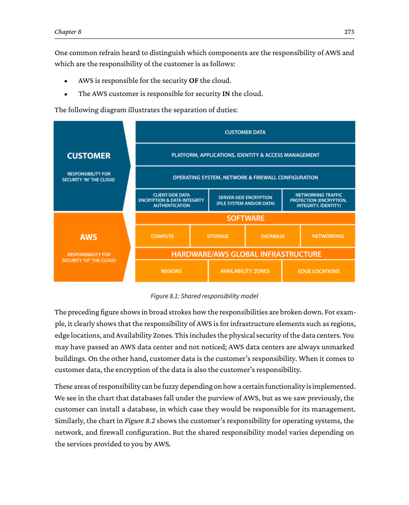

**Figure: Shared responsibility model.** This figure shows how responsibility is divided between AWS and the customer.

**How to read it:** Identify which layers AWS manages and which layers remain customer obligations. Then repeat the exercise per service category because responsibility shifts with IaaS, container, serverless, and managed services.

**Why it matters:** Most AWS incidents are not caused by AWS failing to operate its infrastructure. They are caused by incorrect customer configuration, weak identity design, missing logging, or unsafe application behavior.

**How to apply it:** Add a responsibility table to architecture reviews. For every service, list ownership for patching, encryption, network access, IAM, logging, backup, and restore.

**Limitations:** The visual is conceptual. Current AWS documentation and compliance requirements should be checked for each service and industry.

### AWS Well-Architected Framework

- **Explanation:** The Well-Architected Framework organizes workload review around six pillars: operational excellence, security, reliability, performance efficiency, cost optimization, and sustainability.
- **Problem solved:** Cloud systems often grow organically. The framework gives architects a repeatable way to identify risks and improvements.
- **How it works:** Teams answer pillar-specific questions, identify high-risk issues, and create improvement plans. Lenses apply the same review style to domains such as serverless or industry-specific workloads.
- **Why it matters:** Good architecture is not a single diagram. It is a set of decisions that must remain valid under change, failure, growth, cost pressure, and security threats.
- **When to use:** Use before production launch, after incidents, during major migrations, before scale increases, and on a recurring governance cadence.
- **When not to use:** Do not use it as a box-checking exercise. If answers do not lead to engineering changes, the review is not useful.
- **Tradeoffs:** Comprehensive reviews take time, but skipping them hides risks. Not every recommendation should be implemented immediately; prioritize by business risk.
- **Common mistakes:** Reviewing only infrastructure and ignoring application behavior; skipping cost and sustainability; not assigning owners to remediation.
- **Production example:** A workload with Multi-AZ deployment but no restore test still has a reliability gap. A workload with strong encryption but broad IAM has a security gap.
- **Questions to ask:** Which pillar has the highest risk? Which findings are high-risk issues? Who owns remediation? When will the decision be revisited?

Pillar-level application guide:

| Pillar | What It Forces You To Inspect | Good Engineering Signal | Common Failure Mode | Practical Validation |
|---|---|---|---|---|
| Operational excellence | Deployment, observability, incident response, automation, and continuous improvement. | Teams can deploy, observe, recover, and learn from incidents without heroics. | Manual changes, no runbooks, unclear ownership, and stale dashboards. | Run a game day, simulate an incident, and verify that alerts and runbooks lead to resolution. |
| Security | Identity, detection, infrastructure protection, data protection, and incident response. | Least privilege, centralized logs, encryption, private access, and tested response. | Broad IAM, unmanaged secrets, public data exposure, and no audit trail. | Run access reviews, policy simulation, public exposure checks, and incident-response drills. |
| Reliability | Failure domains, quotas, scaling, backup, restore, and disaster recovery. | Workload survives expected failures and restores within target RTO/RPO. | Multi-AZ compute with single-AZ state, no restore test, no quota planning. | Inject dependency failures, test restore, and verify failover under load. |
| Performance efficiency | Compute, storage, database, network, and workload sizing choices. | Resource choices match measured workload behavior and can evolve. | Oversized resources, wrong instance/storage class, or database chosen by familiarity. | Benchmark with representative traffic and review p95/p99 latency plus saturation metrics. |
| Cost optimization | Ownership, usage visibility, right-sizing, lifecycle, pricing model, and waste. | Unit costs are understood and resources have owners. | Untagged spend, idle resources, expensive scans, and uncontrolled data transfer. | Review cost by tag/workload, run anomaly checks, and model cost at expected growth. |
| Sustainability | Efficient resource use, managed services, lifecycle, and demand-aware scaling. | Workload uses only needed resources and retires stale data. | Always-on overprovisioned capacity and never-expiring data. | Review utilization, autoscaling, storage lifecycle, and workload retirement plans. |

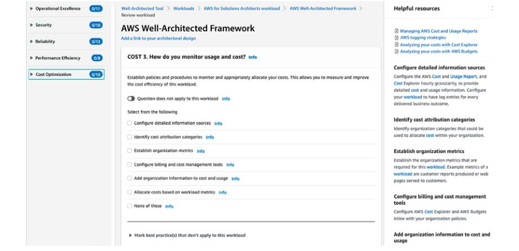

**Figure: AWS Well-Architected Tool.** This figure represents the review mechanism used to evaluate workloads against AWS best practices.

**How to read it:** Treat the tool as an architecture review workflow, not as the architecture itself. The value is in the questions, findings, and remediation plan.

**Why it matters:** It gives teams a common language for risk across operations, security, reliability, performance, cost, and sustainability.

**How to apply it:** Run reviews for critical workloads, record risks in an engineering backlog, and tie remediation to business impact and incident history.

**Limitations:** A tool-based review cannot replace load testing, threat modeling, failure injection, or hands-on operational validation.

### Cloud Migration And Digital Transformation

- **Explanation:** Migration is the process of moving workloads to cloud; digital transformation is broader business and operating-model change enabled by cloud capabilities.
- **Problem solved:** Enterprises need to modernize infrastructure, improve agility, reduce undifferentiated operations, and support new digital products without destabilizing existing systems.
- **How it works:** The book presents migration phases and the 7 Rs: rehost, re-platform, refactor, revise, repurchase, relocate, retain, and retire. The Cloud Adoption Framework helps organize people, process, technology, governance, and business outcomes.
- **Why it matters:** Each application has a different business value, risk profile, technical debt level, and modernization path.
- **When to use:** Use portfolio migration planning when moving existing estates to AWS or modernizing after an initial lift-and-shift.
- **When not to use:** Do not force refactoring for low-value systems or rehost systems that should be retired.
- **Tradeoffs:** Rehosting is fast but may preserve inefficiency. Refactoring is high-value but expensive. Repurchasing reduces custom operations but introduces vendor dependency. Retaining may be correct when business, compliance, or latency constraints require it.
- **Common mistakes:** Starting migration without inventory, dependencies, target landing zone, security baseline, operational model, or rollback plan.
- **Production example:** A three-tier application might first be rehosted to EC2 and RDS, then later re-platformed to containers or refactored into serverless and managed data services.
- **Questions to ask:** What is the business driver? What application dependencies exist? Which 7 R pattern fits this workload? What is the migration wave plan?

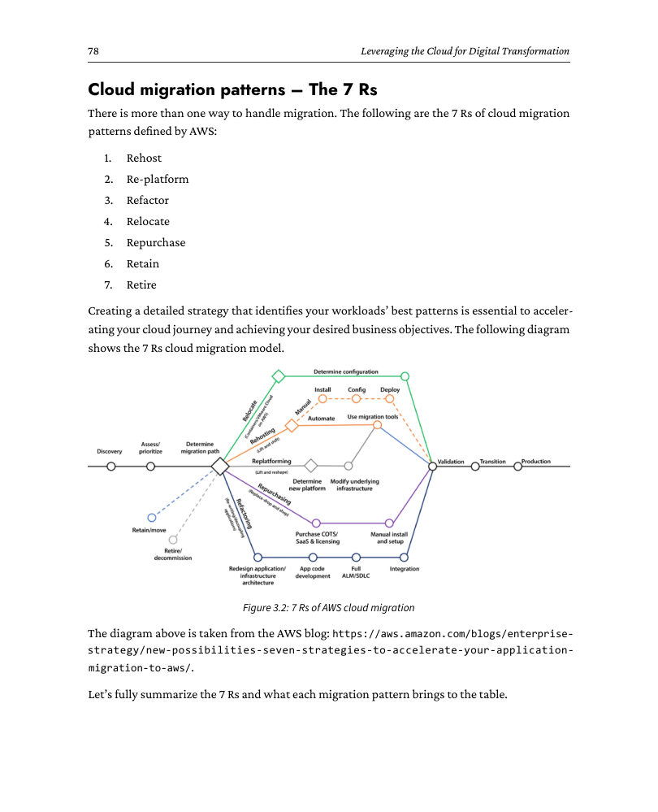

**Figure: 7 Rs migration patterns.** This figure illustrates the migration strategy options used to classify application moves.

**How to read it:** Each R represents a different level of change, risk, and modernization. The right answer depends on business value, technical state, dependencies, and timing.

**Why it matters:** Migration failure often comes from treating every application the same.

**How to apply it:** Build an application portfolio and assign a strategy per workload. Validate dependencies, data movement, security, testing, cutover, and rollback per wave.

**Limitations:** The 7 Rs help categorize strategy but do not replace detailed migration runbooks or application discovery.

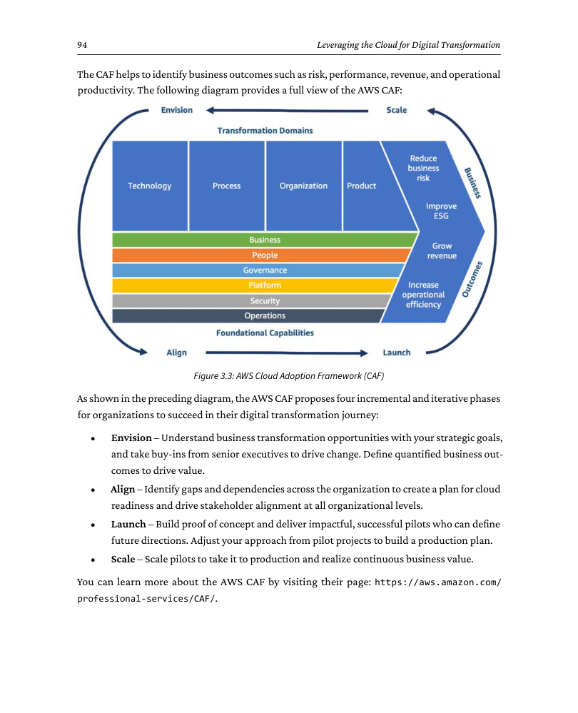

**Figure: AWS Cloud Adoption Framework.** This figure shows the broader organizational dimensions needed for cloud adoption.

**How to read it:** Look beyond technology. Cloud adoption also needs people, governance, operations, security, and business alignment.

**Why it matters:** A technically successful migration can still fail if teams lack ownership, process, financial controls, or operating model changes.

**How to apply it:** Use the framework to identify gaps in skills, governance, platform foundation, security controls, and operating processes before migration waves accelerate.

**Limitations:** The framework guides assessment; each organization still needs concrete roles, roadmaps, metrics, and executive sponsorship.

### High Availability, Reliability, Scalability, And Chaos Engineering

- **Explanation:** AWS architecture uses multiple Availability Zones, load balancing, replication, routing, autoscaling, backups, and operational practices to increase availability and reliability. Chaos engineering validates whether systems behave as expected under failure.
- **Problem solved:** Systems fail through hardware faults, software defects, network problems, overload, regional events, and human error.
- **How it works:** Architectures use active, active/passive, or active/active patterns; scale horizontally or through sharding; and test assumptions by injecting controlled failures.
- **Why it matters:** Availability is not a feature that appears by deploying to AWS. It must be designed, tested, and operated.
- **When to use:** Use multi-AZ and tested recovery for production workloads. Use chaos engineering when the system has enough observability and controls to run safe experiments.
- **When not to use:** Do not perform chaos experiments without blast-radius controls, rollback, monitoring, and business approval.
- **Tradeoffs:** More redundancy increases cost and complexity. Chaos engineering improves confidence but can cause incidents if unmanaged.
- **Common mistakes:** Multi-AZ compute with single-AZ data dependency; failover never tested; scaling compute while database remains bottleneck; sharding without rebalancing plan.
- **Production example:** A retail application can use active/passive recovery for a secondary region while using Multi-AZ within the primary region.
- **Questions to ask:** What failure domains exist? What is the RTO/RPO? Has failover been tested? What chaos experiment validates the biggest assumption?

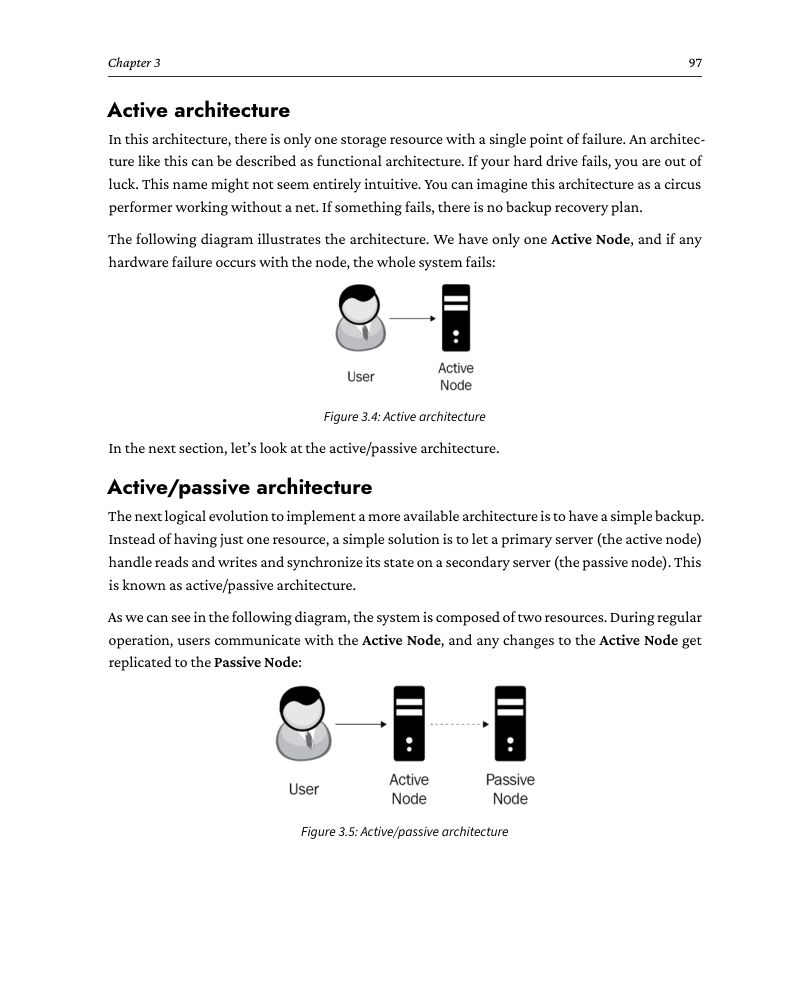

**Figure: Active architecture.** This figure shows a high-availability pattern where resources actively serve workload traffic.

**How to read it:** Identify active nodes and dependency paths. The architecture is useful only if data, routing, and health checks are aligned.

**Why it matters:** Active capacity can improve availability and utilization, but it raises consistency, routing, and failover complexity.

**How to apply it:** Use active patterns for workloads that need low recovery time and can tolerate the operational complexity. Validate health checks and data replication.

**Limitations:** A diagram cannot prove failover. Test dependency failures, DNS/routing behavior, and data consistency under real-like load.

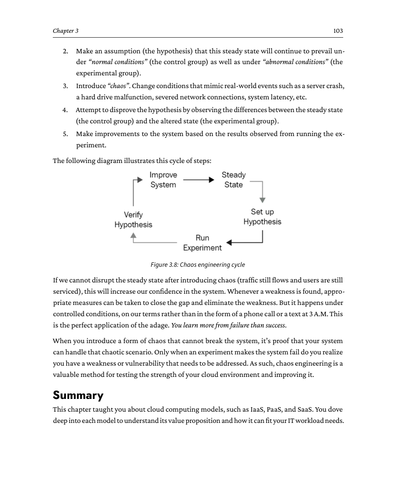

**Figure: Chaos engineering cycle.** This figure shows chaos engineering as an iterative loop.

**How to read it:** Start from a hypothesis, run controlled experiments, observe behavior, learn, and improve.

**Why it matters:** Resilience claims are weak until verified under failure.

**How to apply it:** Begin with low-risk experiments such as instance termination in nonproduction or dependency timeout simulation, then expand only with strong observability and rollback.

**Limitations:** Chaos experiments should not be used as a substitute for design review, backup validation, or security controls.

### AWS Networking

- **Explanation:** AWS networking combines global infrastructure, VPCs, subnets, route tables, gateways, DNS, edge delivery, hybrid connectivity, and security controls.
- **Problem solved:** Workloads need secure, reliable, scalable, and observable connectivity between users, services, accounts, VPCs, on-premises networks, and AWS-managed endpoints.
- **How it works:** Regions and Availability Zones provide physical failure domains. A VPC provides logical isolation. Subnets divide address space. Route tables determine next hops. Security groups and NACLs filter traffic. Transit Gateway, PrivateLink, VPN, Direct Connect, Cloud WAN, Route 53, and CloudFront solve higher-level connectivity patterns.
- **Why it matters:** Network mistakes often appear as application failures, security incidents, or cost surprises.
- **When to use:** Use VPC segmentation, private subnets, endpoints, and managed connectivity for production workloads. Use CloudFront for global content delivery and origin protection.
- **When not to use:** Avoid VPC peering meshes for large network estates; avoid public subnets for workloads that do not need public IPs.
- **Tradeoffs:** Segmentation improves blast-radius control but adds routing and operations complexity. Private connectivity improves security but adds endpoint and DNS design.
- **Common mistakes:** Overlapping CIDRs, broad inbound rules, missing routes, NAT gateway bottlenecks, public database exposure, misconfigured NACLs, and unlogged network paths.
- **Production example:** A web application can expose CloudFront and an Application Load Balancer publicly, run application services in private subnets, access S3 through VPC endpoints, and connect shared services through Transit Gateway.
- **Questions to ask:** What must be reachable from the internet? What should be private? How are accounts and VPCs connected? What paths cross trust boundaries?

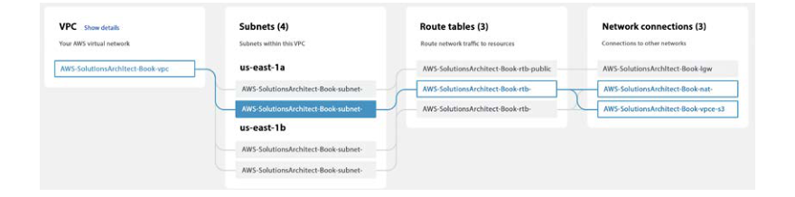

**Figure: VPC configuration with a private subnet flow.** This figure explains how subnet placement and routing affect workload reachability.

**How to read it:** Trace inbound and outbound paths. Public subnets route to internet-facing components; private subnets use controlled egress paths and internal routing.

**Why it matters:** Subnet and route design define whether workloads are exposed, isolated, or unable to reach dependencies.

**How to apply it:** Put public entry components at the edge and keep application/data workloads private unless there is a clear requirement.

**Limitations:** Production designs also need account boundaries, endpoint policies, DNS, logging, inspection, and quota checks.

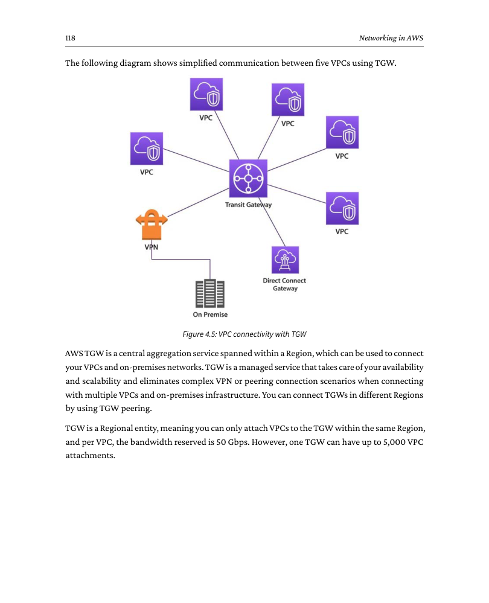

**Figure: VPC connectivity with Transit Gateway.** This figure shows Transit Gateway as a hub for VPC connectivity.

**How to read it:** Compare hub-and-spoke connectivity to direct VPC peering meshes.

**Why it matters:** Transit Gateway simplifies many-to-many network estates but becomes a critical routing and governance point.

**How to apply it:** Use Transit Gateway when multiple VPCs, accounts, or hybrid networks need centralized routing. Design route tables and attachments intentionally.

**Limitations:** It introduces cost, route complexity, and blast-radius considerations that must be reviewed.

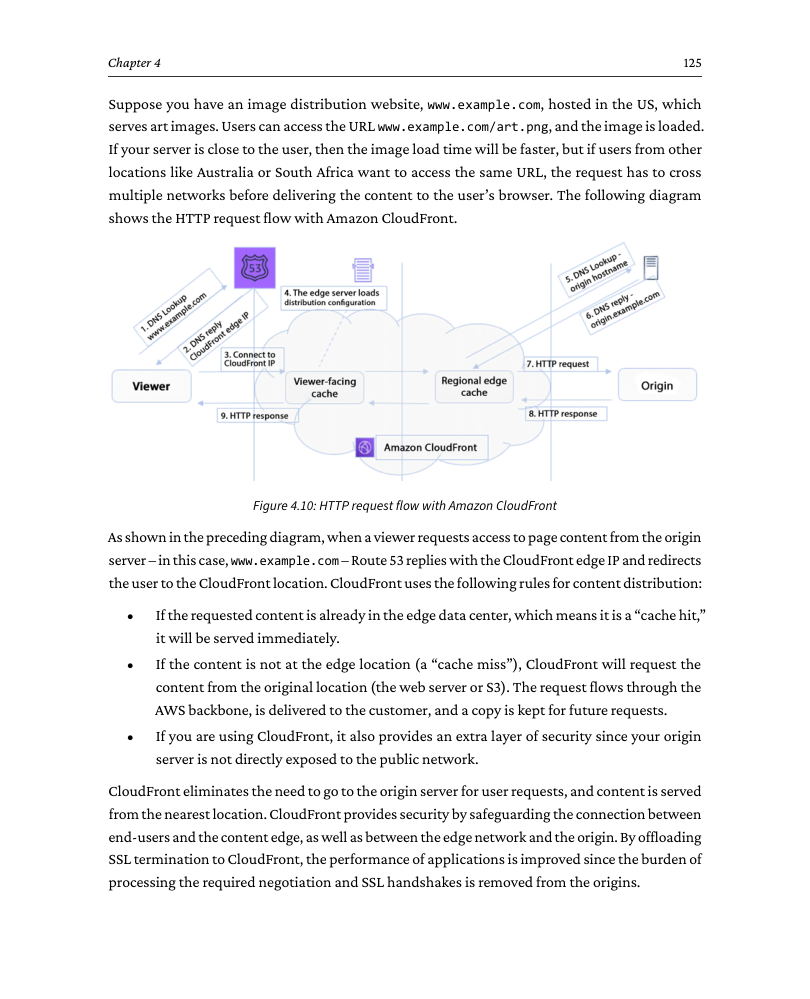

**Figure: HTTP request flow with CloudFront.** This figure shows how edge distribution sits between clients and origins.

**How to read it:** A request may be served from the edge cache; cache misses travel to the origin.

**Why it matters:** CloudFront can reduce latency and origin load, but cache keys, TTLs, private content, invalidation, and headers are correctness decisions.

**How to apply it:** Use CloudFront for static content, media, APIs, and global distribution when caching or edge routing improves user experience.

**Limitations:** Highly personalized or strongly consistent responses need careful cache configuration or origin validation.

### AWS Storage

- **Explanation:** AWS storage services cover block storage, file storage, object storage, backup, hybrid storage, and specialized file systems.
- **Problem solved:** Workloads need different persistence models for VM volumes, shared files, large objects, backups, archives, and on-premises integration.
- **How it works:** EBS provides block volumes for EC2. EFS provides elastic shared file storage. FSx provides managed file systems for specific workloads. S3 provides object storage with storage classes, policies, versioning, lifecycle, access points, and bucket policies. Storage Gateway bridges on-premises and AWS storage. AWS Backup centralizes backup management.
- **Why it matters:** Storage choice affects durability, access latency, sharing model, cost, permissions, backup, and application architecture.
- **When to use:** Use EBS for attached block volumes, EFS for shared Linux file access, FSx for managed Windows/Lustre/NetApp/OpenZFS-style needs, S3 for objects and data lakes, Storage Gateway for hybrid integration, and AWS Backup for centralized protection.
- **When not to use:** Avoid EBS for multi-writer shared files unless the workload supports it. Avoid EFS for object-style data lakes. Avoid S3 for low-latency mutable block semantics.
- **Tradeoffs:** S3 is highly durable and scalable but object-based. EBS is low-latency and attached but AZ-scoped. EFS is shared but has performance mode considerations. Archive storage reduces cost but increases retrieval delay.
- **Common mistakes:** Public S3 exposure, wildcard policies, no lifecycle rules, no versioning where recovery matters, wrong EBS volume type, untested restores, and treating backup as complete without restore drills.
- **Production example:** A content platform can store uploaded media in S3, attach EBS to EC2 workers, share processing assets through EFS, and archive old assets using S3 lifecycle policies.
- **Questions to ask:** Is the data block, file, or object? Is it shared? What is the read/write pattern? What is the retention period? What is the restore objective?

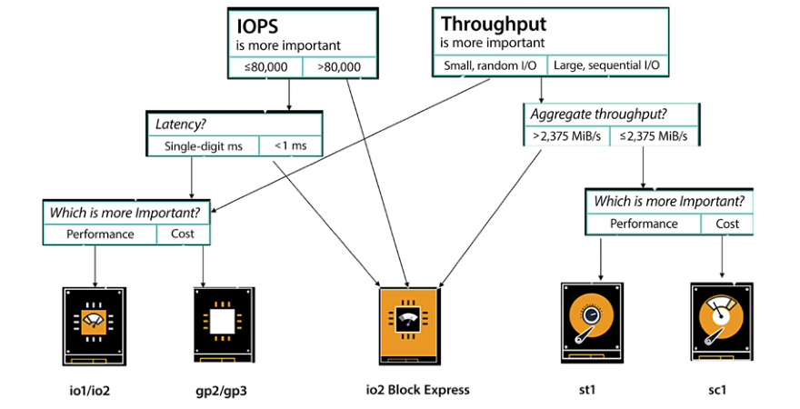

**Figure: EBS volume selection decision tree.** This figure supports choosing EBS volume types based on workload requirements.

**How to read it:** Start from performance and workload characteristics rather than from volume names.

**Why it matters:** Wrong volume choice can create unnecessary cost or performance bottlenecks.

**How to apply it:** Measure IOPS, throughput, latency, and durability needs. Validate with load tests before committing production storage classes.

**Limitations:** EBS capabilities and pricing change. Verify current volume types and limits.

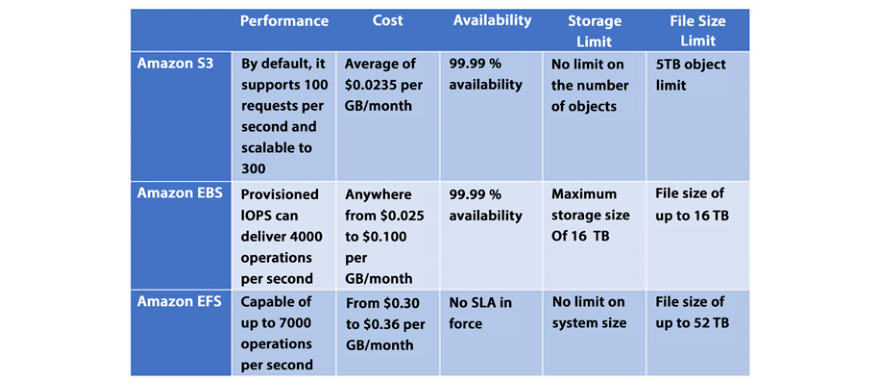

**Figure: Choosing storage service by use case.** This figure maps storage services to workload needs.

**How to read it:** Treat it as a starting decision map: object, block, file, hybrid, backup, archive, and specialized file needs lead to different services.

**Why it matters:** Storage is expensive to change after data grows, so early fit matters.

**How to apply it:** Decide by access pattern, durability, sharing, latency, and lifecycle. Then validate security policy and restore procedures.

**Limitations:** Real workloads often use multiple storage services together.

### AWS Compute And Load Balancing

- **Explanation:** AWS compute includes EC2, AMIs, instance families, purchasing models, load balancing, serverless compute, Fargate, HPC, and hybrid compute through Outposts.
- **Problem solved:** Applications need compute capacity that can scale, fail over, and match runtime requirements without overprovisioning.
- **How it works:** EC2 provides VM-level control. Auto Scaling adjusts fleet size. Elastic Load Balancing routes traffic across targets. Lambda runs functions without server management. Fargate runs containers without managing servers. HPC and Outposts support specialized performance and hybrid requirements.
- **Why it matters:** Compute choice influences operations, deployment model, cost, scaling speed, security patching, and availability.
- **When to use:** Use EC2 when you need OS or host control. Use Lambda for event-driven functions with short-lived execution. Use Fargate for managed container compute. Use load balancers for traffic distribution and health-based routing.
- **When not to use:** Avoid EC2 when operations burden is not justified. Avoid Lambda for unsuitable long-running, latency-sensitive, or runtime-constrained workloads. Avoid sticky sessions as a substitute for stateless design.
- **Tradeoffs:** EC2 gives control but increases operations. Lambda reduces operations but adds limits, cold starts, and event-driven constraints. Fargate simplifies infrastructure but may limit host-level tuning.
- **Common mistakes:** Scaling only compute while databases or NAT gateways bottleneck; missing health checks; no connection draining; wrong instance family; no tagging; ignoring purchasing model tradeoffs.
- **Production example:** A web workload can use ALB, Auto Scaling EC2 or ECS services, and reserved/savings purchasing for stable baseline capacity.
- **Questions to ask:** What runtime control is required? What scales the workload? What health check proves readiness? What pricing model fits usage?

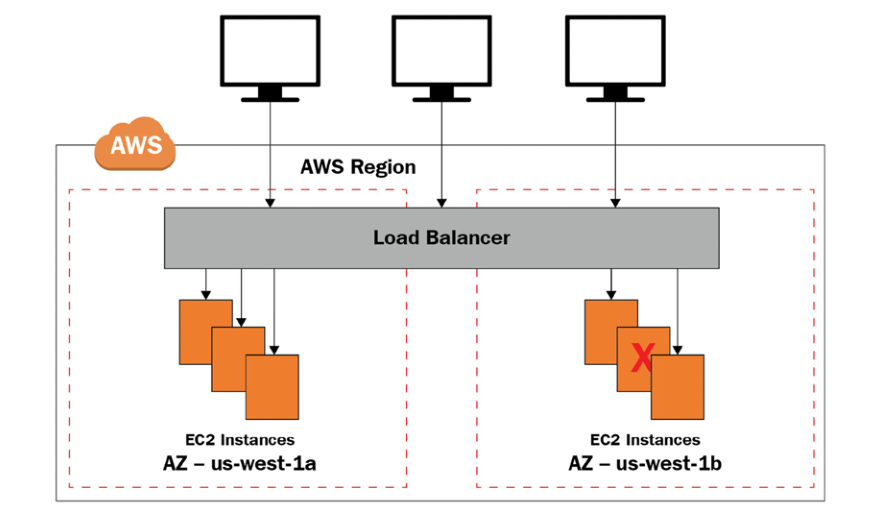

**Figure: Load balancer architecture.** This figure shows traffic distribution across compute resources.

**How to read it:** The load balancer is the stable entry point and distributes traffic only to healthy targets.

**Why it matters:** Load balancing is central to availability, deployment safety, and horizontal scaling.

**How to apply it:** Use health checks, target groups, connection draining, TLS policy, access logs, and deployment strategies such as canary or blue/green.

**Limitations:** The figure does not capture all ELB generations or current feature differences. Validate current ALB, NLB, GWLB, and CLB guidance.

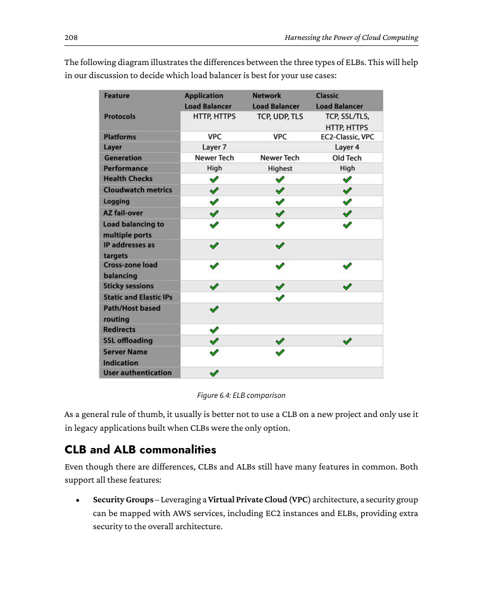

**Figure: ELB comparison.** This figure summarizes Elastic Load Balancing options.

**How to read it:** Compare protocol layer, routing features, target types, and use cases.

**Why it matters:** Choosing the wrong load balancer can limit routing, performance, TLS behavior, or observability.

**How to apply it:** Use ALB for HTTP-aware routing, NLB for high-performance L4/TCP/UDP-style routing, and GWLB for virtual appliances when appropriate.

**Limitations:** Feature sets evolve; verify current capabilities and regional support.

### AWS Database Selection

- **Explanation:** AWS database services cover relational, key-value, document, graph, time-series, ledger, cache, and migration use cases.
- **Problem solved:** Applications require different data models, consistency guarantees, query patterns, throughput, and operational models.
- **How it works:** RDS and Aurora support relational workloads. DynamoDB supports key-value and document-style access at scale. ElastiCache supports Redis/Memcached caching. DocumentDB supports document workloads. Neptune supports graphs. Timestream supports time-series. QLDB supports ledger-style records. Database migration services help move databases to AWS.
- **Why it matters:** Database choice is one of the hardest decisions to reverse after production growth.
- **When to use:** Use relational databases for ACID transactions and SQL; DynamoDB for high-scale key-based access; Redis/Memcached for caching; Neptune for connected graph traversal; Timestream for timestamped metrics/events; Redshift/Athena for analytics rather than transactional serving.
- **When not to use:** Avoid forcing all data into one database type. Avoid NoSQL when arbitrary queries and transactions dominate. Avoid relational databases for unbounded high-scale key-value access without partitioning.
- **Tradeoffs:** Managed databases reduce operations but still require schema design, query design, scaling, backup, monitoring, and security. NoSQL improves scale for known patterns but shifts constraints to application design.
- **Common mistakes:** Poor DynamoDB partition key, unbounded table scans, treating cache as source of truth, missing connection pooling, no read replica strategy, and no migration dry run.
- **Production example:** An ecommerce application may use Aurora for orders, DynamoDB for shopping sessions, ElastiCache for hot catalog reads, OpenSearch for search, and Redshift/Athena for analytics.
- **Questions to ask:** Is this OLTP or OLAP? What are the access patterns? What consistency is required? What is the write/read ratio? What is the recovery objective?

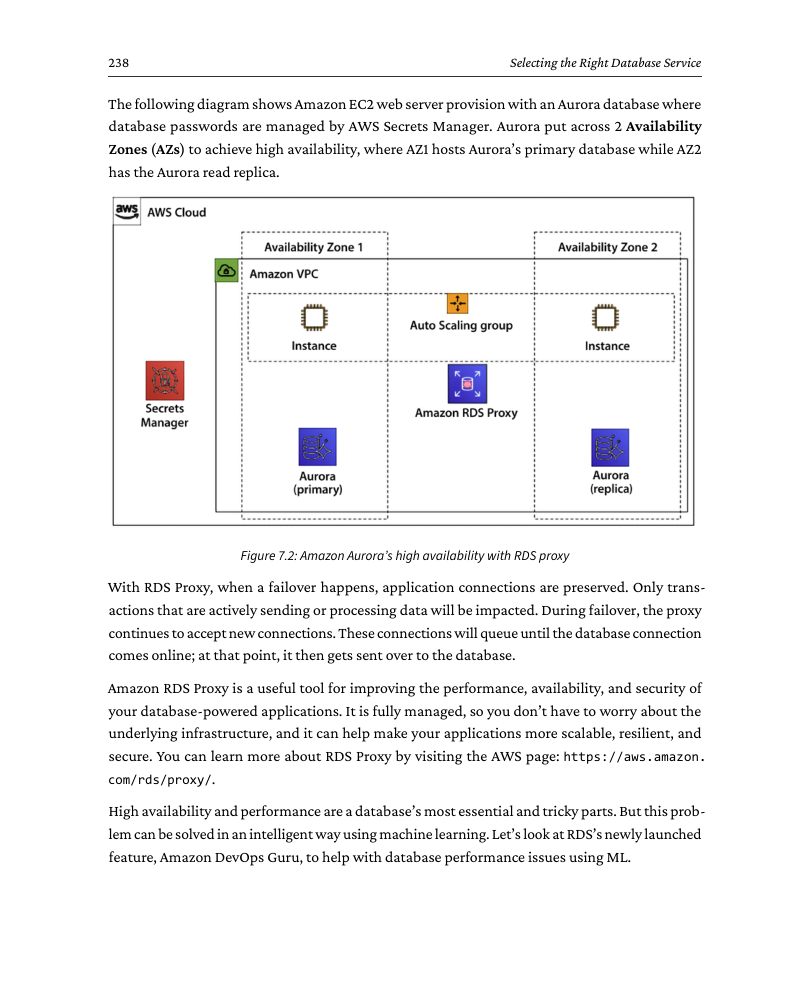

**Figure: Aurora high availability with RDS Proxy.** This figure shows a managed relational high-availability pattern.

**How to read it:** Look for separation between application connections, proxying, database endpoints, and replicas/failover.

**Why it matters:** Database availability is often the real limit of application availability.

**How to apply it:** Use connection pooling/proxying where connection storms are likely, test failover, and design retry behavior around transaction semantics.

**Limitations:** Proxying does not fix slow queries, poor schema design, or inappropriate transactions.

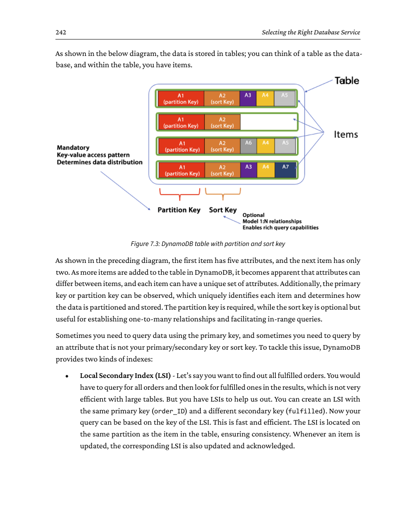

**Figure: DynamoDB table with partition and sort key.** This figure explains the key structure used for DynamoDB access patterns.

**How to read it:** The partition key distributes items; the sort key organizes items with the same partition key for ordered/ranged access.

**Why it matters:** DynamoDB performance and cost depend heavily on key design.

**How to apply it:** Model queries first, choose partition keys that spread load, and use sort keys and indexes only for required access patterns.

**Limitations:** This page does not replace current DynamoDB limits, transaction behavior, global table behavior, and capacity mode guidance.

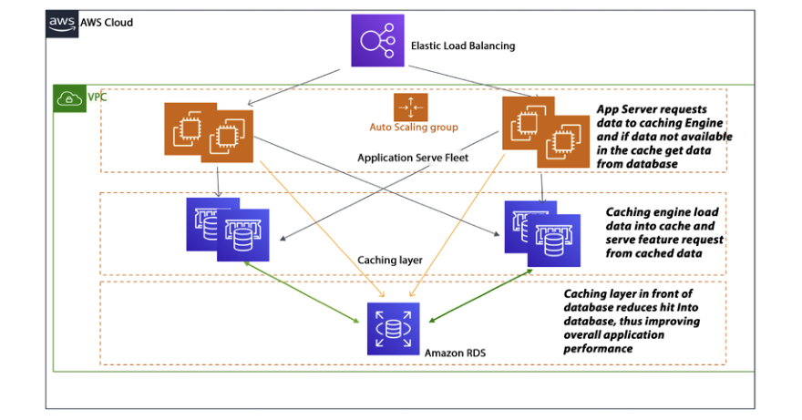

**Figure: Application caching pattern.** This figure shows cache placement between application and database.

**How to read it:** The application checks the cache before falling back to the database.

**Why it matters:** Cache design affects latency, database load, and correctness.

**How to apply it:** Define cache keys, TTLs, invalidation, hot-key strategy, cache-down behavior, and metrics before relying on the cache in production.

**Limitations:** The figure does not cover write-through, write-back, cache stampede, or multi-region cache consistency.

### Security, Identity, And Compliance

- **Explanation:** AWS security architecture combines IAM, Organizations, SCPs, security services, network controls, data protection, monitoring, and compliance frameworks.
- **Problem solved:** Cloud environments can grow quickly and expose data or privileges unless identity, accounts, network, and data controls are intentionally designed.
- **How it works:** IAM users, groups, roles, and policies control access. Organizations and organizational units structure accounts and apply governance. Security services detect threats, manage posture, protect data, and support audit/compliance. Network controls and encryption protect infrastructure and data.
- **Why it matters:** Identity and policy design are central to cloud security because API permissions can create or destroy infrastructure and access data.
- **When to use:** Use multi-account strategy, least privilege, roles, centralized logging, detective controls, encryption, and governance from the start.
- **When not to use:** Avoid long-lived IAM users and broad administrative policies for applications.
- **Tradeoffs:** Strict controls improve safety but can slow delivery if not automated. Central governance improves consistency but must support team autonomy.
- **Common mistakes:** Wildcard IAM, no MFA, shared users, public S3 buckets, no GuardDuty/Security Hub-style detection, unmanaged secrets, missing CloudTrail, and no SCP guardrails.
- **Production example:** A production workload should run in a dedicated account, use IAM roles for services, restrict network access, encrypt data, log control-plane activity, and alert on suspicious behavior.
- **Questions to ask:** Who can assume this role? What can this principal do? What data can be read? What account boundary exists? What events are logged and alerted?

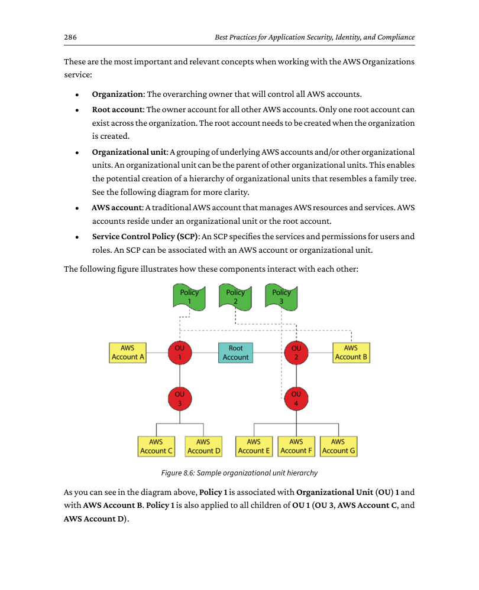

**Figure: Organizational unit hierarchy.** This figure illustrates account organization through OUs.

**How to read it:** Accounts are grouped by environment, function, or governance needs so policies can be applied consistently.

**Why it matters:** Account structure is a security and operations boundary, not just billing structure.

**How to apply it:** Separate production, nonproduction, shared services, security, logging, and sandbox accounts where appropriate. Apply SCPs and guardrails by OU.

**Limitations:** OU design must reflect the organization's compliance, platform, and team operating model.

### CloudOps, Observability, Governance, And Cost

- **Explanation:** CloudOps is the operational model for running AWS environments efficiently and safely. It includes automation, monitoring, audit, service management, cost management, governance, and operational excellence.
- **Problem solved:** Cloud adoption can create sprawl, inconsistent operations, unclear ownership, cost surprises, and poor incident response.
- **How it works:** CloudOps uses services and practices such as Systems Manager, EventBridge, CloudWatch, X-Ray, Audit Manager, Service Catalog/AppRegistry, cost dashboards, budgets, and automated remediation.
- **Why it matters:** Architecture is only production-ready if it can be operated, monitored, audited, patched, and paid for sustainably.
- **When to use:** Use CloudOps practices from the landing zone onward, especially as account count, teams, and workload count grow.
- **When not to use:** Do not confuse CloudOps with a centralized ticket gate that blocks teams without adding automation or guardrails.
- **Tradeoffs:** Automation requires upfront investment but reduces drift and manual errors. Governance improves control but must be productively designed.
- **Common mistakes:** No ownership tags, no budgets, no patch management, alert noise, missing traces, no audit evidence, and manual remediation only.
- **Production example:** An EventBridge rule can detect operational events and trigger remediation or notifications. CloudWatch and X-Ray can connect metrics, logs, and traces to user-impacting behavior.
- **Questions to ask:** Who owns this workload? What does healthy mean? What is automated? What costs are expected? What audit evidence exists?

CloudOps should be designed as a set of feedback loops:

- **Health feedback loop:** Metrics, logs, traces, synthetics, and business KPIs identify whether the workload is serving users correctly. The loop fails when dashboards show infrastructure health but not customer impact.
- **Change feedback loop:** Deployments, configuration changes, and infrastructure updates should leave markers in observability systems so incidents can be correlated with change.
- **Compliance feedback loop:** Audit evidence, policy checks, configuration drift, and remediation workflows should be automated where possible. Manual evidence collection becomes unreliable as account count grows.
- **Cost feedback loop:** Tags, budgets, anomaly detection, cost dashboards, and unit economics should show which workload, team, or product is consuming resources and whether the usage is expected.
- **Improvement feedback loop:** Incidents, Well-Architected findings, security findings, and cost reviews should produce backlog items, not just reports.

Operational validation should include at least four drills:

1. **Access drill:** Can a new operator get the correct least-privilege access without sharing credentials?
2. **Incident drill:** Can the on-call engineer find the failing dependency using logs, metrics, and traces?
3. **Cost drill:** Can the team explain last week's cost by workload and identify anomalies?
4. **Compliance drill:** Can the team produce evidence for logging, encryption, backup, and access controls?

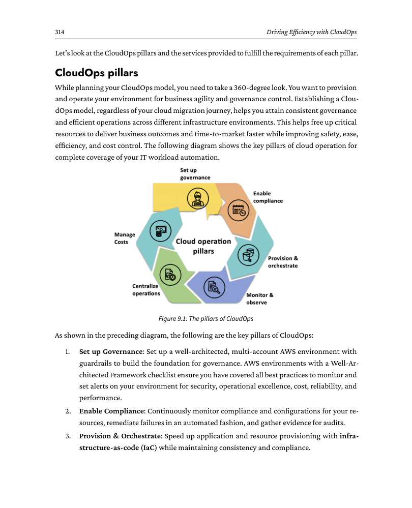

**Figure: CloudOps pillars.** This figure groups operational concerns for AWS environments.

**How to read it:** Treat operations as a multi-pillar discipline: monitoring, automation, governance, cost, compliance, and service management.

**Why it matters:** Cloud scale can turn small manual practices into large operational risk.

**How to apply it:** Build operational capabilities as platform services: standardized logging, patching, monitoring, cost controls, inventory, and remediation.

**Limitations:** Tools do not create ownership. Teams still need on-call, runbooks, escalation, and post-incident improvement.

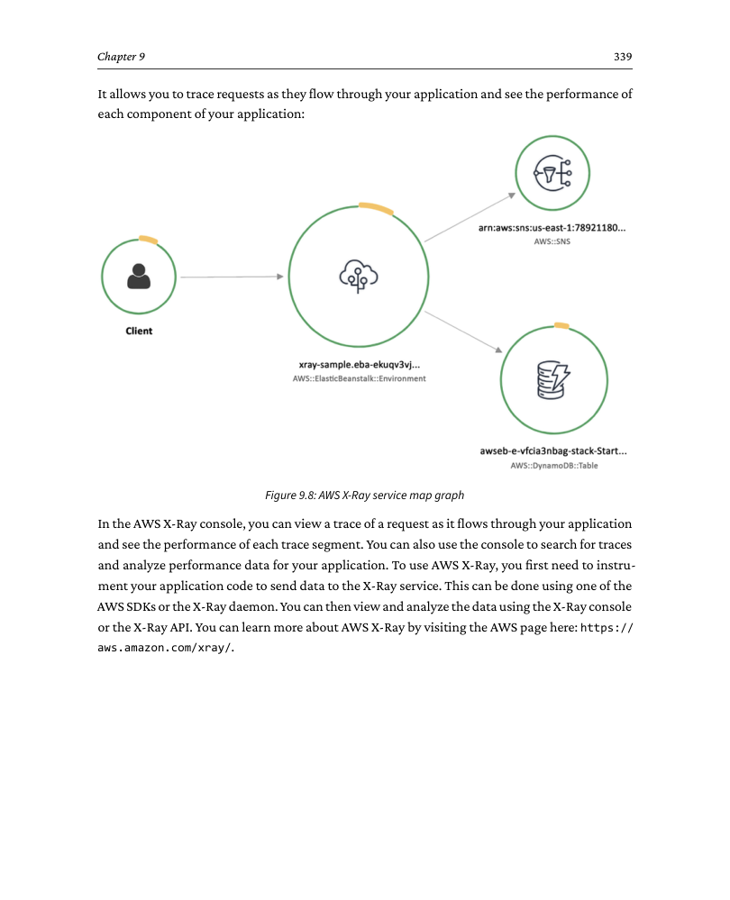

**Figure: AWS X-Ray service map.** This figure shows distributed tracing as a topology of service calls.

**How to read it:** Services and dependencies are visualized by request paths, latency, and errors.

**Why it matters:** Distributed systems cannot be debugged reliably from instance metrics alone.

**How to apply it:** Propagate trace context through APIs, queues, and service calls; use traces to find slow dependencies and error hotspots.

**Limitations:** Tracing requires instrumentation and sampling strategy. It does not replace logs, metrics, or business KPIs.

### Data, Analytics, Streaming, And Visualization

- **Explanation:** AWS analytics services support batch processing, streaming, ETL, cataloging, warehouses, federated queries, dashboards, and data lake architectures.
- **Problem solved:** Organizations need to ingest, transform, query, govern, and visualize large and varied data sources.
- **How it works:** EMR runs big-data frameworks. Glue supports ETL and catalog workflows. Kinesis and MSK handle streaming. Redshift provides a managed data warehouse. Athena queries data in S3. QuickSight visualizes data. Lake Formation helps govern data lakes.
- **Why it matters:** Data systems fail when ingestion, storage layout, metadata, quality, security, and consumption are not designed together.
- **When to use:** Use EMR for managed big data frameworks, Glue for ETL/catalog workflows, Kinesis for AWS-native streaming, MSK for Kafka compatibility, Redshift for warehouse workloads, Athena for serverless S3 queries, and QuickSight for BI dashboards.
- **When not to use:** Avoid using Athena for poorly partitioned uncompressed data at large scale; avoid streaming systems when batch latency is acceptable; avoid dashboards without data quality ownership.
- **Tradeoffs:** Managed services reduce operations but require partitioning, schema, cost, and governance design. Streaming improves freshness but adds ordering, replay, and consumer lag complexity.
- **Common mistakes:** Raw S3 dumps without zones, catalog, or access control; unbounded Athena scans; no stream partition-key design; no data quality checks; dashboards without lineage.
- **Production example:** A data lake can land raw events in S3, catalog with Glue, transform with Glue/EMR, query through Athena/Redshift, and visualize through QuickSight.
- **Questions to ask:** What is the data freshness requirement? What is the partition strategy? Who owns data quality? What access controls apply? What is the cost per query?

Analytics architecture should separate four responsibilities:

- **Ingestion:** How data arrives, how late data is handled, how duplicates are detected, and whether ingestion is batch, streaming, or hybrid.
- **Storage layout:** How data is partitioned, compressed, formatted, and organized into lake zones or warehouse tables.
- **Semantic trust:** How schemas, catalogs, data quality rules, lineage, and ownership make the data understandable and usable.
- **Consumption control:** How query engines, dashboards, workgroups, permissions, and cost limits protect the platform from accidental abuse.

Concrete design checks:

- If Athena queries scan unexpectedly large amounts of data, inspect partitioning, file format, compression, and predicate pushdown.
- If dashboards disagree with source systems, inspect ETL lag, transformation logic, data quality checks, and semantic definitions.
- If streaming consumers fall behind, inspect partition keys, shard/partition count, consumer processing time, downstream throttling, and poison records.
- If a data lake becomes difficult to use, inspect zone definitions, catalog completeness, access policy, ownership, and data product documentation.

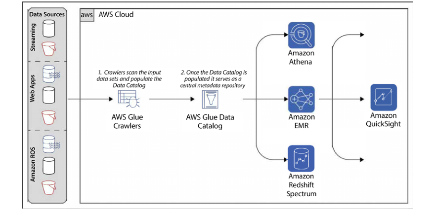

**Figure: AWS Glue workflow steps.** This figure shows a typical Glue-based ETL flow.

**How to read it:** Data moves from source through cataloging and transformation into curated outputs.

**Why it matters:** ETL is not just compute. It needs schema awareness, metadata, scheduling, quality checks, and operational monitoring.

**How to apply it:** Define crawlers/catalogs, transformation jobs, job bookmarks where appropriate, error handling, and data quality checks before production.

**Limitations:** Glue is one option; EMR, streaming, dbt, and warehouse-native transformations may be better for some workloads.

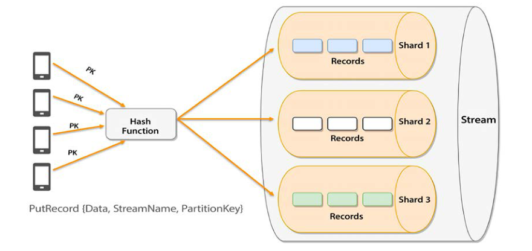

**Figure: Kinesis architecture.** This figure shows streaming ingestion and consumption.

**How to read it:** Producers write records to streams; consumers process records by shard/partitioning model.

**Why it matters:** Streaming design depends on ordering, throughput, retention, replay, and consumer lag.

**How to apply it:** Choose partition keys carefully, monitor shard utilization and iterator age, and design consumers to be idempotent.

**Limitations:** Kinesis and MSK have different operational models. Choose based on ecosystem, compatibility, operations, and team skills.

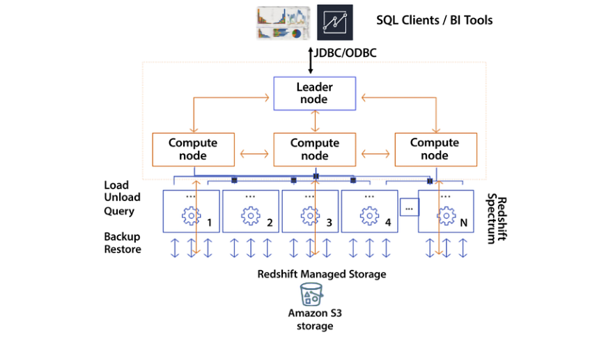

**Figure: Redshift cluster architecture.** This figure explains warehouse cluster structure.

**How to read it:** Identify compute nodes, leader/coordinator behavior, and storage/query execution shape.

**Why it matters:** Warehouse performance depends on distribution, sort, compression, workload management, and query shape.

**How to apply it:** Model data by analytical access patterns, tune distribution and sort choices, and validate with representative queries.

**Limitations:** Redshift features evolve; verify current serverless, RA3, Spectrum, and concurrency behavior.

### Machine Learning, IoT, Blockchain, And Emerging Services

- **Explanation:** The book surveys AWS ML services, MLOps, IoT services, blockchain, quantum computing, and generative AI.
- **Problem solved:** Organizations need to operationalize intelligent, connected, and emerging workloads without building every platform component from scratch.
- **How it works:** AWS offers layered ML services, SageMaker for ML pipelines, IoT services for device connectivity and processing, managed blockchain-related options, Braket for quantum experimentation, and generative AI capabilities.
- **Why it matters:** These domains are architecture disciplines with data, security, operations, cost, and lifecycle concerns, not isolated feature demos.
- **When to use:** Use managed AI/ML services when they meet the problem and reduce time to value. Use SageMaker/MLOps when models need repeatable training, deployment, monitoring, and governance. Use IoT services when device identity, messaging, rules, and fleet management matter.
- **When not to use:** Avoid ML when deterministic rules solve the problem; avoid IoT architectures without device security and lifecycle management; avoid emerging services without business value and risk review.
- **Tradeoffs:** Managed AI reduces platform burden but may constrain customization. Custom ML gives control but requires data science, MLOps, monitoring, and governance.
- **Common mistakes:** No training/serving data separation, no model monitoring, no data drift detection, no device identity strategy, and no secure over-the-air update model.
- **Production example:** An IoT predictive maintenance system can ingest device telemetry, route events, store time-series data, run ML inference, alert operators, and retrain models.
- **Questions to ask:** What data is available? What decision will the model support? How is model performance monitored? How are devices authenticated and updated?

MLOps and IoT introduce two lifecycle problems that ordinary web applications may not expose as clearly:

- **Model lifecycle:** A model has training data, features, parameters, evaluation metrics, deployment artifacts, runtime monitoring, drift detection, and retraining triggers. A model that was valid at launch can become wrong as user behavior, data distribution, or business policy changes.
- **Device lifecycle:** An IoT device has identity, certificate/key material, firmware, connectivity patterns, telemetry, commands, updates, and decommissioning. Device compromise or stale firmware can become a fleet-wide security problem.

Production validation should include:

- Model evaluation with holdout data and business-specific acceptance criteria.
- Monitoring for data drift, prediction drift, latency, and error rates.
- Rollback for model deployments.
- Device authentication and authorization tests.
- Secure update and revocation workflows for IoT devices.
- Cost modeling for telemetry ingestion and model inference volume.

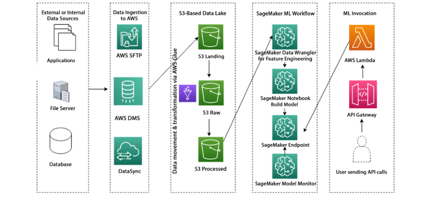

**Figure: End-to-end ML pipeline in AWS.** This figure shows the lifecycle from data to model deployment.

**How to read it:** Follow data preparation, training, validation, deployment, and monitoring.

**Why it matters:** ML success depends on lifecycle engineering, not only model selection.

**How to apply it:** Treat training data, model artifacts, feature transformations, deployment, monitoring, and retraining triggers as production assets.

**Limitations:** The figure does not define model governance, bias assessment, privacy, or current generative AI service choices.

### Containers, ECS, EKS, Fargate, And ROSA

- **Explanation:** Containers package applications and dependencies. AWS offers ECS, EKS, Fargate, and ROSA for container workloads.
- **Problem solved:** Teams need portable deployment units and orchestration for scaling, scheduling, networking, and service operations.
- **How it works:** Docker images are built and run as containers. ECS is an AWS-native orchestrator. EKS provides managed Kubernetes. Fargate provides serverless container compute. ROSA provides managed OpenShift on AWS.
- **Why it matters:** Container platform choice affects operational burden, ecosystem compatibility, networking, IAM, deployment, and team skills.
- **When to use:** Use ECS for AWS-native container simplicity. Use EKS when Kubernetes APIs, ecosystem tools, or platform standardization are required. Use Fargate to reduce host management. Use ROSA when OpenShift is the enterprise standard.
- **When not to use:** Avoid Kubernetes if the team only needs simple container hosting. Avoid Fargate where host-level customization is required.
- **Tradeoffs:** ECS is simpler in AWS contexts; EKS provides Kubernetes flexibility with higher operational complexity; Fargate removes host management but limits control.
- **Common mistakes:** No health checks, no resource requests/limits, weak image scanning, broad task roles, no rollout strategy, and treating containers as security boundaries by default.
- **Production example:** A microservice platform might run ECS services behind ALB, use task roles for AWS access, push images through CI/CD, and add CloudWatch/X-Ray instrumentation.
- **Questions to ask:** Do we need Kubernetes? Who operates the cluster? What is the deployment strategy? How are secrets and IAM roles managed?

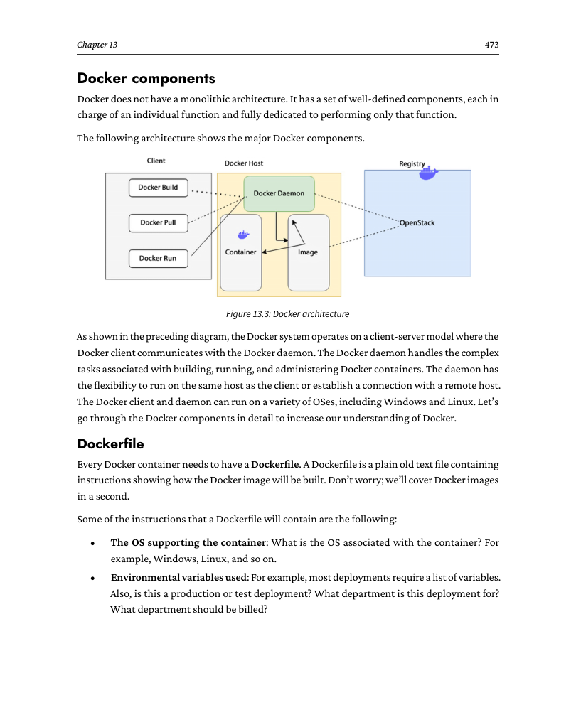

**Figure: Docker architecture.** This figure shows the container build/run ecosystem.

**How to read it:** Images are built and stored in registries, then run by container runtimes.

**Why it matters:** The image supply chain becomes part of production security and delivery.

**How to apply it:** Use immutable images, vulnerability scanning, signed artifacts where appropriate, least-privilege runtime roles, and controlled promotion through environments.

**Limitations:** Docker architecture does not cover full orchestration, networking policy, service discovery, or cluster operations.

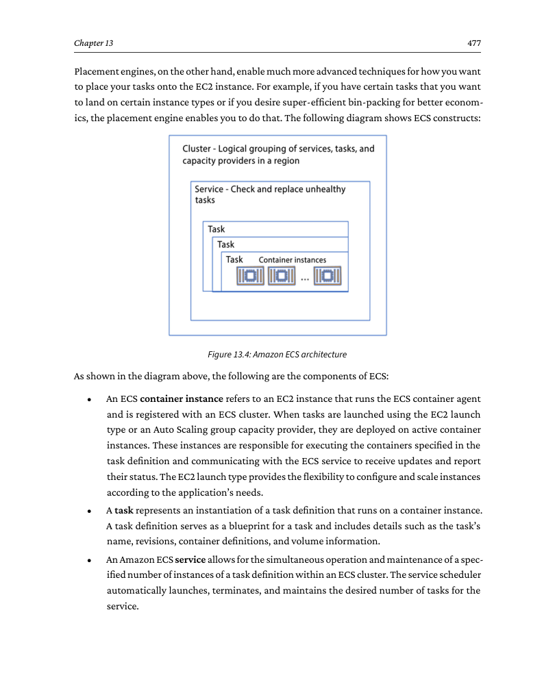

**Figure: Amazon ECS architecture.** This figure shows ECS components for running container services.

**How to read it:** Identify clusters, services, tasks, scheduling, and integration with AWS infrastructure.

**Why it matters:** ECS can provide a lower-operational-overhead container platform for AWS-native workloads.

**How to apply it:** Define task definitions, service desired counts, autoscaling, task roles, logging, health checks, and deployment configuration.

**Limitations:** ECS does not provide Kubernetes APIs. Ecosystem requirements may push a workload to EKS.

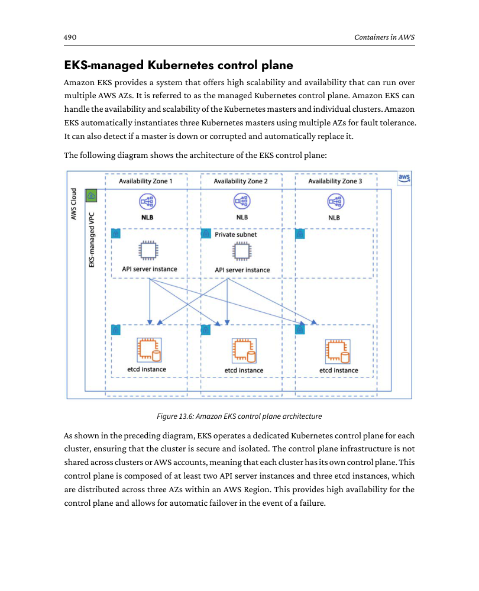

**Figure: EKS control plane architecture.** This figure shows the managed Kubernetes control plane model.

**How to read it:** Separate AWS-managed control-plane responsibilities from customer-managed workload and node responsibilities.

**Why it matters:** EKS reduces control-plane operations but does not eliminate Kubernetes platform engineering.

**How to apply it:** Plan IAM integration, node groups, cluster upgrades, network policy, admission controls, observability, and workload autoscaling.

**Limitations:** Kubernetes operational depth is larger than this book can cover.

### Microservices, Event-Driven Architecture, And DDD

- **Explanation:** The book frames microservices as independently deployable services aligned to business capabilities. It introduces layered architecture, event-driven architecture, streaming, queues, pub/sub, microservice best practices, and Domain-Driven Design.
- **Problem solved:** Large monoliths can become hard to scale, deploy, and own. Microservices and EDA can improve autonomy and scalability when boundaries are correct.
- **How it works:** Services own domain logic and often data. APIs, events, queues, streams, and pub/sub connect services. DDD identifies bounded contexts and relationships before implementation.
- **Why it matters:** Service boundaries become team boundaries, data boundaries, and failure boundaries.
- **When to use:** Use microservices when independent deployment, scaling, ownership, and domain boundaries justify distributed complexity. Use EDA when workflows need decoupling, fanout, replay, or asynchronous processing.
- **When not to use:** Avoid microservices for small teams or unclear domains. Avoid event-driven design without idempotency, schema governance, and observability.
- **Tradeoffs:** Microservices improve autonomy but increase network, data consistency, deployment, testing, and observability complexity.
- **Common mistakes:** Distributed monoliths, shared databases across services, no event versioning, no bounded contexts, synchronous chains, no ownership, and no local development strategy.
- **Production example:** AWSome Store separates domains such as product, order, payment, and customer concerns before mapping them to serverless and managed AWS components.
- **Questions to ask:** What is the bounded context? Who owns the service? What data does it own? What events does it publish? What failure can it tolerate?

Microservice readiness checks:

- **Boundary clarity:** The service owns a business capability, not just a technical layer.
- **Data ownership:** The service owns its write model. Other services integrate through APIs, events, or projections rather than direct table access.
- **Contract stability:** APIs and events have compatibility rules and tests.
- **Failure isolation:** Timeouts, retries, circuit breakers, queues, and fallbacks prevent one service from taking down a chain.
- **Operational maturity:** Each service has logs, metrics, traces, dashboards, SLOs, and an owner.
- **Deployment independence:** A service can be released and rolled back without coordinating every other service.

Event-driven readiness checks:

- Events are named as facts that happened, not vague commands unless the pattern intentionally uses commands.
- Event schemas are versioned and compatible.
- Consumers are idempotent.
- Poison messages are isolated.
- Replays are possible and understood.
- Consumer lag is monitored.
- Ordering guarantees are explicitly scoped by partition key, aggregate, or business entity.

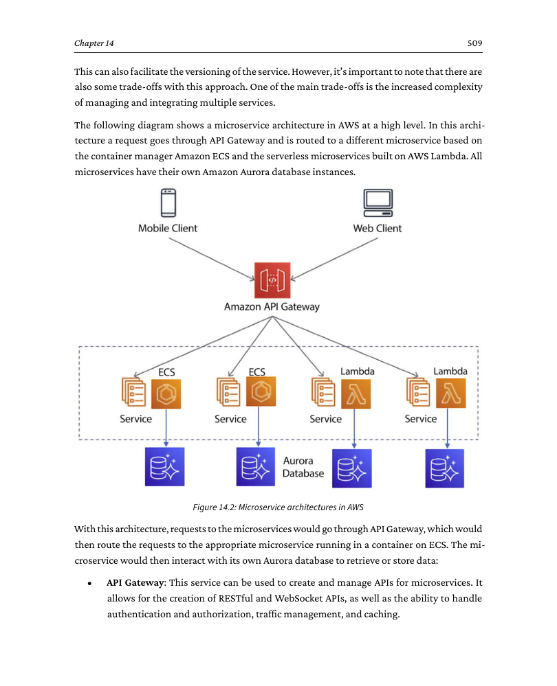

**Figure: Microservice architectures in AWS.** This figure shows how AWS services can compose microservice systems.

**How to read it:** Look for service boundaries, integration mechanisms, and managed services that support routing, messaging, compute, and persistence.

**Why it matters:** Microservices require supporting infrastructure for deployment, security, discovery, integration, observability, and resilience.

**How to apply it:** Start with domain boundaries, then choose AWS primitives that match runtime, integration, and persistence needs.

**Limitations:** The diagram does not make microservices safe by itself. Ownership, testing, and operations must be designed.

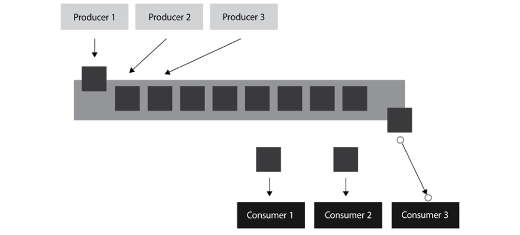

**Figure: Event streaming model.** This figure illustrates asynchronous event flow.

**How to read it:** Producers publish events to a stream; consumers process them independently.

**Why it matters:** Event streaming decouples producers and consumers but adds ordering, replay, lag, and schema evolution concerns.

**How to apply it:** Define event contracts, partitioning, retention, replay policy, idempotent consumers, and monitoring before production.

**Limitations:** Streaming is not automatically the right pattern for every service interaction.

### Data Lakes, Lakehouse, And Data Mesh

- **Explanation:** Data lakes store large volumes of structured, semi-structured, and unstructured data for analytics and ML. A lakehouse combines lake flexibility with warehouse-like management. Data mesh decentralizes data ownership around domains.
- **Problem solved:** Enterprises need to integrate data across systems while preserving governance, quality, and discoverability.
- **How it works:** Data lake architectures commonly include ingestion, raw zone, cleansed zone, curated zone, catalog, governance, processing, and consumption layers. Lake Formation can help manage permissions and governance. Data mesh treats data as a product owned by domains.
- **Why it matters:** Without zones, metadata, quality, and governance, data lakes become untrusted and costly.
- **When to use:** Use data lakes for diverse large-scale data and analytics. Use lakehouse patterns when warehouse-like management and lake storage need to converge. Use data mesh when centralized data teams become bottlenecks and domains can own data products.
- **When not to use:** Avoid data mesh without domain maturity, platform support, governance, and clear product ownership.
- **Tradeoffs:** Data lakes centralize data but can become swamps. Data mesh improves ownership but increases governance and platform complexity.
- **Common mistakes:** No data quality metrics, no access controls, no lifecycle, no catalog, unclear ownership, and all data in a single raw bucket.
- **Production example:** A retail enterprise can publish domain data products from orders, catalog, customer, and fulfillment teams into governed lake zones with shared metadata and access policy.
- **Questions to ask:** Who owns this data? What zone is it in? What quality checks passed? Who can access it? What is the retention rule?

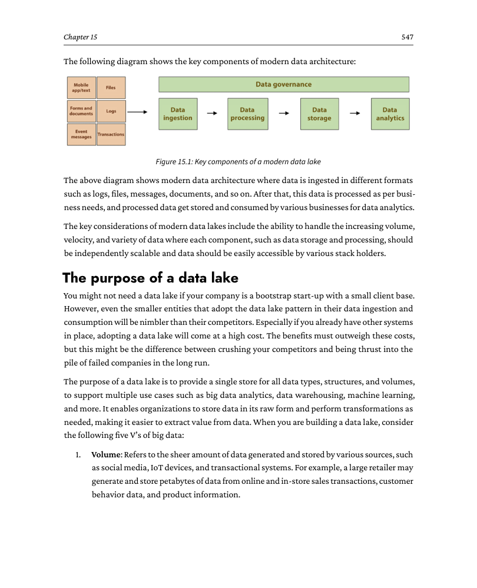

**Figure: Key components of a modern data lake.** This figure shows the major capabilities required beyond storage.

**How to read it:** Look for ingestion, storage, catalog, governance, processing, and consumption.

**Why it matters:** S3 alone is not a data lake architecture.

**How to apply it:** Build data platforms with zones, metadata, governance, quality, and consumer workflows.

**Limitations:** The exact components should match the organization's data domains and regulatory needs.

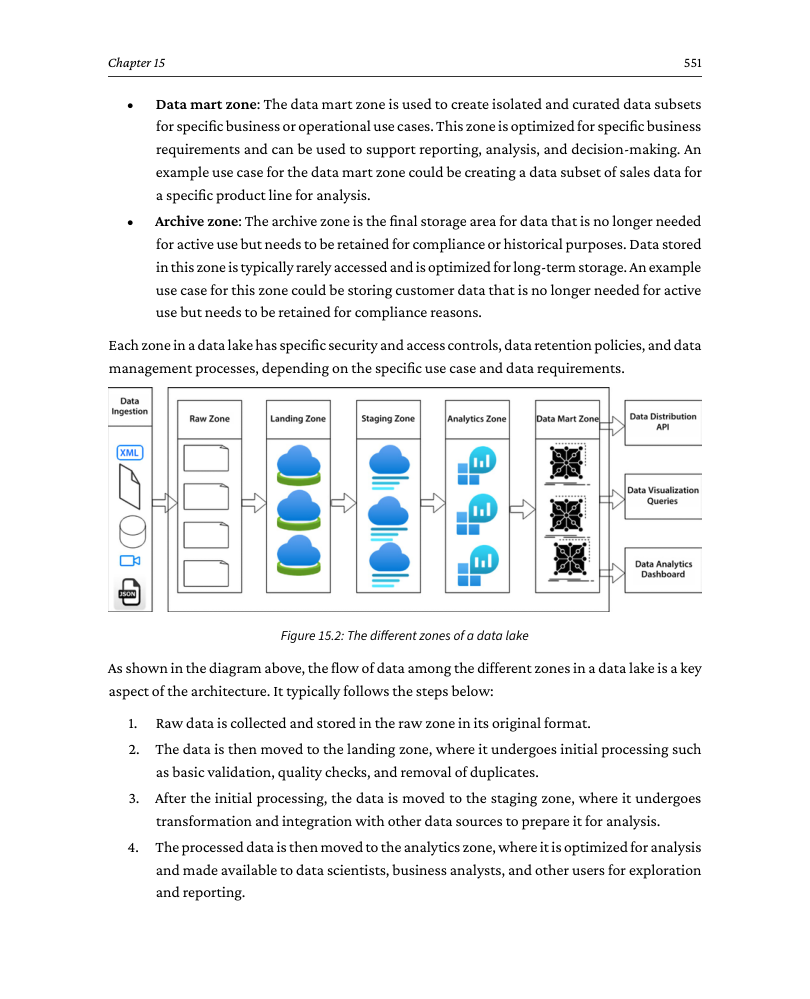

**Figure: Data lake zones.** This figure shows staged data movement from raw to refined forms.

**How to read it:** Data gains structure, quality, and trust as it moves through zones.

**Why it matters:** Zones make data lifecycle and quality visible.

**How to apply it:** Define entry criteria, validation, retention, and access policy for each zone.

**Limitations:** Zones can become bureaucracy if they are not automated and tied to real consumer needs.

### Hands-On AWSome Store Application

- **Explanation:** The final chapter applies DDD and AWS cloud-native architecture to an example ecommerce-style AWSome Store application.
- **Problem solved:** Architects need to turn domain boundaries and service choices into an implementable AWS design.
- **How it works:** The chapter introduces bounded contexts, serverless web-application architecture, AWS service setup, IAM policy attachment, sample configuration, an order context class diagram, and Well-Architected optimization.
- **Why it matters:** Architecture knowledge becomes useful when it can be translated into accounts, services, permissions, deployment, billing alerts, and review loops.
- **When to use:** Use this as a design pattern for small-to-medium serverless applications and as a teaching example for DDD-to-AWS mapping.
- **When not to use:** Do not copy the sample architecture blindly for high-scale or regulated production without deeper requirements analysis.
- **Tradeoffs:** Serverless services reduce infrastructure operations but require attention to limits, IAM, event behavior, cold starts, and observability.
- **Common mistakes:** Creating services manually without infrastructure as code, broad IAM policies, no billing alert, no environment separation, and no Well-Architected review after launch.
- **Production example:** A production ecommerce app should separate catalog, cart, order, payment, and fulfillment concerns; apply IAM least privilege; monitor cost and errors; and validate against Well-Architected pillars.
- **Questions to ask:** What bounded contexts exist? What service owns each data set? What permissions are required? What alerts and reviews protect the workload?

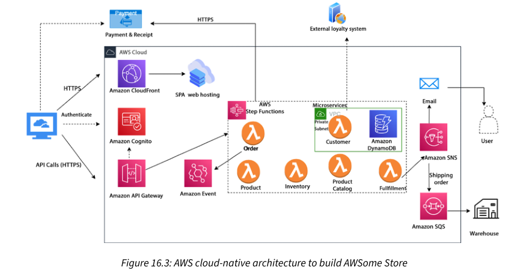

**Figure: AWSome Store cloud-native architecture.** This figure shows the book's hands-on application architecture.

**How to read it:** Map domain functionality to AWS services and identify where frontend, API, compute, data, and integration boundaries sit.

**Why it matters:** It demonstrates moving from domain model to service composition.

**How to apply it:** Use the pattern as a starting point, then adapt for authentication, authorization, environments, deployment automation, observability, and scale.

**Limitations:** A sample architecture is not a production architecture until tested against real requirements, threat model, cost model, and failure modes.

## 4. Implementation Patterns And Engineering Practices

### Landing Zone And Account Governance

- **Problem it solves:** Prevents unmanaged account sprawl, inconsistent controls, and unclear ownership.
- **Implementation shape:** Use AWS Organizations, OUs, account separation, centralized logging, security accounts, shared services, SCP guardrails, tagging standards, and baseline IAM.
- **Example:** Separate production, nonproduction, sandbox, security, logging, and shared-network accounts. Apply stricter SCPs to production than sandbox.
- **Tradeoffs and failure modes:** Strong guardrails can slow teams if not paired with self-service platform workflows. Weak guardrails create security and cost incidents.
- **Validation:** Confirm CloudTrail, Config, GuardDuty-style detection, budgets, and account baselines are enabled consistently.
- **Adaptation:** Start with essential separation and guardrails; evolve OU structure as organization and compliance needs mature.

### VPC And Network Segmentation

- **Problem it solves:** Controls reachability, blast radius, and private/public workload boundaries.
- **Implementation shape:** Design CIDR ranges, public/private subnets across AZs, route tables, NAT/egress, VPC endpoints, security groups, NACLs, DNS, and inter-VPC connectivity.
- **Example:** Public ALB in public subnets, app services in private subnets, databases in isolated private subnets, S3 access through endpoints.
- **Tradeoffs and failure modes:** More segmentation improves control but makes routing and debugging harder. Overlapping CIDRs block future peering or Transit Gateway plans.
- **Validation:** Use reachability tests, route review, flow logs, security group review, and failure drills.
- **Adaptation:** Use Transit Gateway or Cloud WAN for larger estates instead of growing peering meshes.

### Service Selection By Workload

- **Problem it solves:** Avoids tool mismatch and overengineering.
- **Implementation shape:** Classify workload by compute model, data model, latency, consistency, scale, operations, cost, compliance, and team skill.
- **Example:** Use S3 for objects, Aurora for relational transactions, DynamoDB for key-based high-scale access, ECS for AWS-native containers, and Lambda for event-driven functions.
- **Tradeoffs and failure modes:** Highly managed services reduce infrastructure work but require service-specific limits and patterns.
- **Validation:** Run proof-of-concept tests for throughput, latency, IAM, deployment, monitoring, and cost.
- **Adaptation:** Prefer reversible decisions early; document "revisit when" triggers.

### Least-Privilege IAM

- **Problem it solves:** Limits blast radius if credentials or workloads are compromised.
- **Implementation shape:** Use roles for workloads, scoped policies, condition keys, resource-level permissions, permissions boundaries where needed, MFA for humans, and no embedded long-lived credentials.
- **Example:** A Lambda function that reads one DynamoDB table and writes one log group should not have broad DynamoDB or CloudWatch permissions.
- **Tradeoffs and failure modes:** Fine-grained IAM takes time to design and test. Overly restrictive policies can block operations if not tested.
- **Validation:** Use access analysis, policy simulation, integration tests, and audit logs.
- **Adaptation:** Start with narrow generated policies, then refine based on observed access.

### Observability-First Delivery

- **Problem it solves:** Production failures are hard to diagnose without logs, metrics, traces, and business indicators.
- **Implementation shape:** Add structured logs, metrics, traces, dashboards, alerts, correlation IDs, runbooks, and synthetic checks before launch.
- **Example:** A serverless API should emit latency, errors, throttles, cold-start indicators, downstream call metrics, and business success/failure counts.
- **Tradeoffs and failure modes:** Too many metrics and alarms create noise. Too few create blind spots.
- **Validation:** Simulate failures and verify alerts, dashboards, and runbooks lead engineers to root cause.
- **Adaptation:** Start from golden signals and workload-specific SLOs; add deeper diagnostics as incidents reveal gaps.

### Data Lake Zone Discipline

- **Problem it solves:** Prevents data lakes from becoming unmanaged dumps.
- **Implementation shape:** Define raw, cleansed, curated, and consumption zones; catalog metadata; enforce access controls; run data quality checks; set retention/lifecycle policies.
- **Example:** Raw clickstream lands unchanged, cleaned data normalizes schema, curated data provides business-ready tables, and dashboards query curated zones.
- **Tradeoffs and failure modes:** Strong zone discipline adds workflow overhead but improves trust and governance.
- **Validation:** Check data lineage, quality metrics, access logs, and query cost.
- **Adaptation:** Automate movement between zones and publish data contracts for domain-owned data products.

### Domain-Driven Service Boundaries

- **Problem it solves:** Prevents distributed monoliths and unclear ownership.
- **Implementation shape:** Use context mapping to identify bounded contexts, relationships, service ownership, APIs, and events before choosing AWS services.
- **Example:** AWSome Store separates domains such as catalog, order, and payment rather than creating services around technical layers.
- **Tradeoffs and failure modes:** DDD analysis takes time, but skipping it creates shared databases and tightly coupled services.
- **Validation:** Each service should own its data and have clear API/event contracts.
- **Adaptation:** Start with a modular monolith when boundaries are uncertain; split services when ownership and scale justify it.

## 5. Code, Configuration, And Workflow Notes

The source includes practical workflows and selected configuration screenshots rather than long code listings. The following adapted workflows preserve the engineering substance without reproducing long source material.

### Migration Assessment Workflow

1. Inventory applications, dependencies, data stores, owners, compliance needs, and current operational pain.
2. Classify each application by the 7 Rs.
3. Group workloads into migration waves by dependency, risk, and business priority.
4. Build landing zone, network, identity, logging, and security baseline before workload migration.
5. Run migration proof of concept for one representative workload.
6. Execute wave migration with testing, cutover, rollback, monitoring, and cost validation.
7. Revisit modernization opportunities after stabilization.

**Common mistakes:** Starting migrations before dependency mapping; moving workloads without operational ownership; refactoring too early; ignoring data gravity and network latency.

**Validation:** Successful cutover, rollback test, data reconciliation, performance baseline comparison, security control verification, and cost review.

### VPC Design Workflow

1. Define accounts, Regions, and environments.
2. Allocate non-overlapping CIDR ranges.
3. Create public, private, and isolated subnet tiers across AZs.
4. Define route tables, internet gateways, NAT gateways, VPC endpoints, and DNS.
5. Apply security groups and NACLs based on least required traffic.
6. Design interconnectivity through peering, Transit Gateway, PrivateLink, VPN, or Direct Connect.
7. Enable logging and reachability validation.

**Common mistakes:** Overlapping CIDRs, public databases, one route table for everything, no endpoint strategy, and no flow logs.

**Validation:** Reachability Analyzer-style tests, flow logs, security group audits, DNS tests, and failover tests.

### S3 Security And Lifecycle Workflow

1. Block public access by default.
2. Enable encryption and define key ownership.
3. Apply bucket policies and access points by use case.
4. Use versioning where accidental deletion or overwrite matters.
5. Configure lifecycle policies for transition and expiration.
6. Log access where required.
7. Test restore and object retrieval from archive tiers.

**Common mistakes:** Wildcard policies, no lifecycle rules, no versioning for critical objects, unmanaged cross-account access.

**Validation:** Policy simulation, access logs, lifecycle transition checks, restore drills, and cost review.

### Database Selection Workflow

1. Classify workload as OLTP, OLAP, cache, search, graph, time-series, ledger, or document.
2. Define access patterns, query predicates, consistency, scale, latency, retention, and availability.
3. Choose candidate AWS services.
4. Validate data model with representative reads/writes.
5. Test failover, backup/restore, connection behavior, and cost.
6. Define migration and rollback plan.

**Common mistakes:** Choosing DynamoDB without query modeling; using relational DB for large object storage; ignoring cache invalidation; skipping restore tests.

**Validation:** Query tests, load tests, failover tests, backup restore, and cost-per-operation model.

### CloudOps Automation Workflow

1. Define tagging and ownership standards.
2. Centralize logs and audit events.
3. Configure monitoring and SLO dashboards.
4. Use EventBridge and automation for known operational responses.
5. Track cost through budgets, dashboards, and allocation tags.
6. Manage patching, inventory, and compliance evidence.
7. Run incident reviews and feed improvements into backlog.

**Common mistakes:** Manual ticket-only operations, alert noise, no cost owner, no patch inventory, and no runbooks.

**Validation:** Simulated incident, budget alert test, audit evidence retrieval, and automated remediation dry run.

### AWSome Store Serverless Application Workflow

1. Identify bounded contexts and domain responsibilities.
2. Map frontend, API, compute, data, and integration services.
3. Configure IAM with narrow permissions for each component.
4. Add billing alerts and basic operational dashboards.
5. Deploy application components.
6. Run Well-Architected review and optimize findings.

**Common mistakes:** Skipping IAM least privilege, forgetting billing alerts, manually configuring without repeatability, and not mapping domains before services.

**Validation:** Functional tests, IAM access tests, cost alert test, log/metric verification, and Well-Architected improvement backlog.

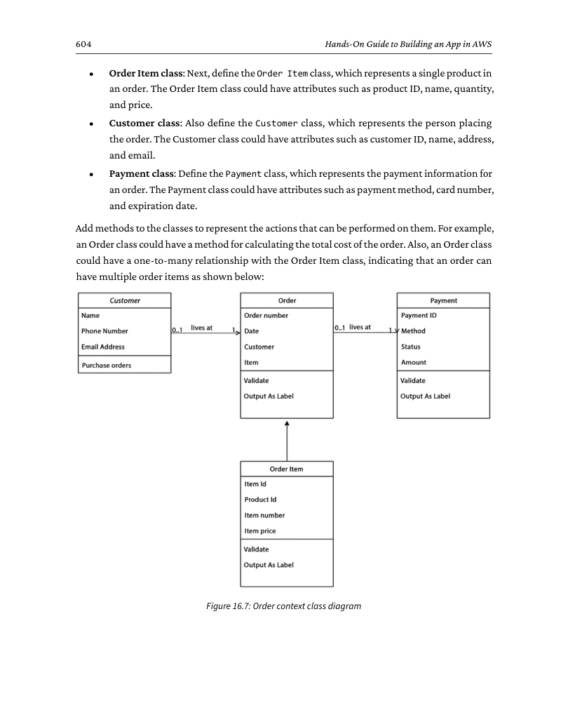

**Figure: Order context class diagram.** This figure shows a domain model artifact from the hands-on application chapter.

**How to read it:** Identify entities and relationships inside the order bounded context.

**Why it matters:** Domain modeling should happen before service decomposition and database selection.

**How to apply it:** Use class/context diagrams to clarify business concepts, aggregate boundaries, and ownership before implementation.

**Limitations:** A class diagram does not define persistence, API, concurrency, or event contracts by itself.

## 6. Testing, Validation, And Verification

| What To Validate | Why It Matters | Method | Good Signal | Warning Sign |
|---|---|---|---|---|
| Well-Architected risk | Architecture must be reviewed across all pillars. | Run pillar review and track high-risk issues. | Findings have owners and remediation dates. | Review creates no engineering work. |
| Account and IAM baseline | Identity mistakes create high blast radius. | Policy simulation, access analysis, SCP review, MFA checks. | Least privilege and account separation enforced. | Wildcard permissions and shared users. |
| Network reachability | Misrouting causes outages and exposure. | Route review, flow logs, reachability tests, DNS tests. | Required paths work and forbidden paths fail. | Public access to private workloads. |
| Storage durability and access | Data loss or exposure is expensive. | Backup/restore tests, S3 policy review, lifecycle checks. | Restore meets RPO/RTO and access is scoped. | Backups exist but restores are untested. |
| Compute scaling | Capacity must match demand. | Load tests, autoscaling tests, health check validation. | Scale-out meets SLO without downstream collapse. | Compute scales but database fails. |
| Database model | Database choice must match access patterns. | Query tests, partition-key tests, failover tests. | Low latency and correct consistency under load. | Scans, hot partitions, connection storms. |
| Security detection | Attacks and misconfigurations must be visible. | Guardrail tests, audit log review, detection simulation. | Alerts fire for suspicious actions. | No CloudTrail-style visibility or alerting. |
| Observability | Operators need fast diagnosis. | Trace/log/metric correlation tests. | Dashboards show user impact and dependency health. | Engineers debug by guessing. |
| Cost controls | Cloud scale can create unbounded spend. | Budgets, cost anomaly tests, tag audits, query cost review. | Costs map to owners and usage. | Untagged resources and surprise bills. |
| Data pipelines | Analytics must be trustworthy. | Data quality tests, lineage checks, stream lag monitoring. | Fresh, cataloged, validated data. | Broken dashboards or unexplained discrepancies. |
| Container platform | Platform must deploy and recover safely. | Rollout, rollback, health probe, image scan tests. | Deployments are observable and reversible. | Manual cluster changes and no image controls. |
| Microservice contracts | Distributed systems need compatibility. | API contract tests, event schema tests, consumer replay. | Backward-compatible evolution. | Deployments break consumers. |
| DR and failover | Availability claims must be proven. | AZ/Region failure drills and restore exercises. | RTO/RPO achieved in practice. | Failover steps are undocumented or manual-only. |

Validation should happen in stages:

- **Design validation:** Well-Architected review, threat model, cost model, migration plan, and architecture decision records.
- **Build validation:** Unit tests, infrastructure tests, IAM policy tests, API contracts, and deployment checks.
- **Pre-production validation:** Load tests, failure injection, backup/restore, network reachability, security scanning, and runbook rehearsal.
- **Production validation:** SLO dashboards, incident reviews, cost reviews, access reviews, data quality monitoring, and recurring Well-Architected improvements.

## 7. Chapter-by-Chapter Knowledge Extraction

### Chapter 1: Understanding AWS Principles and Key Characteristics

Main lesson: AWS adoption is built on cloud computing principles such as elasticity, scalability, availability, security, faster hardware cycles, and reduced undifferentiated infrastructure operations.

Key concepts:

- Public and private cloud differences.
- AWS terminology and service category comparisons.
- Elasticity and scalability as core cloud value.
- Security, physical security, encryption, compliance, availability, hardware refresh, and staff leverage.

Important details readers may miss:

- Elasticity is about adjusting resources to demand; scalability is the ability to handle growth.
- AWS popularity is tied not only to features but also to global infrastructure, service breadth, ecosystem, and operational model.
- Security is a shared design process, not a default property.

Practical use:

- Use this chapter to explain cloud value to stakeholders and to frame architecture tradeoffs before service selection.

Production risks:

- Treating cloud as a data center rental model.
- Migrating without changing operations, cost governance, and security practices.

Self-check questions:

- What operational work does cloud reduce?
- What work remains with the customer?
- Which business outcome justifies cloud adoption?

### Chapter 2: Understanding the AWS Well-Architected Framework and Getting Certified

Main lesson: The Well-Architected Framework gives a repeatable structure for architecture improvement; certification content is secondary to building practical understanding.

Key concepts:

- Six pillars: security, reliability, performance efficiency, cost optimization, operational excellence, and sustainability.
- Well-Architected Tool and lenses.
- AWS certification paths and preparation approaches.

Mechanisms and examples:

- The review process asks pillar-aligned questions and identifies improvement actions.
- Lenses adapt framework review to domains such as serverless.

Design decisions:

- Decide what to remediate now versus later based on risk.
- Choose certification paths based on role, experience, and career direction.

Production risks:

- Reviewing architectures without implementing improvements.
- Optimizing cost while compromising reliability or security.

Self-check questions:

- Which pillar has the highest risk in your current workload?
- What evidence proves a Well-Architected answer?

### Chapter 3: Leveraging the Cloud for Digital Transformation

Main lesson: Cloud enables digital transformation when migration strategy, operating model, architecture, and business change align.

Key concepts:

- IaaS, PaaS, SaaS.
- Migration phases and 7 Rs.
- Digital transformation drivers and pitfalls.
- AWS Cloud Adoption Framework.
- High availability, reliability, scalability, active/passive patterns, sharding, and chaos engineering.

Mechanisms and workflows:

- Application portfolio assessment leads to migration strategy.
- Active/passive architectures provide recovery options.
- Sharding distributes load and data by key or partition strategy.
- Chaos engineering validates resilience assumptions.

Production risks:

- C-suite misalignment.
- Migration without application dependency mapping.
- Sharding without rebalancing and routing strategy.
- Chaos testing without blast-radius control.

Self-check questions:

- Which migration pattern fits each application?
- What organizational capabilities are missing?
- What failure hypothesis should be tested first?

### Chapter 4: Networking in AWS

Main lesson: Networking is the foundation of secure and reliable AWS architecture.

Key concepts:

- Regions, Availability Zones, VPCs, private/public subnets, route tables, VPC peering, Transit Gateway, PrivateLink, Route 53, CloudFront, VPN, Direct Connect, Cloud WAN, security groups, and NACLs.

Mechanisms:

- VPCs isolate network space.
- Route tables direct traffic.
- Security groups are stateful instance/resource-level controls.
- NACLs are stateless subnet-level controls.
- Transit Gateway centralizes connectivity.
- PrivateLink exposes services privately.
- CloudFront caches and routes traffic at edge locations.

Design decisions:

- Peering versus Transit Gateway.
- Public versus private subnet placement.
- VPN versus Direct Connect.
- CloudFront versus direct origin.
- Security group versus NACL control.

Production risks:

- Overlapping CIDR ranges.
- Public exposure of private workloads.
- Incorrect route propagation.
- Single egress bottlenecks.
- Confusing security groups and NACLs.

Self-check questions:

- What is the traffic path from user to data?
- Which routes cross trust boundaries?
- How is network activity logged?

### Chapter 5: Storage in AWS - Choosing the Right Tool for the Job

Main lesson: Storage service choice should follow storage abstraction, access pattern, performance, durability, sharing, security, and lifecycle.

Key concepts:

- EBS, EFS, FSx, S3, S3 storage classes, versioning, S3 best practices, access points, bucket policies, VPC endpoint policies, Storage Gateway, and AWS Backup.

Mechanisms:

- EBS attaches block volumes to compute.
- EFS provides shared file storage.
- S3 stores objects and supports lifecycle transitions.
- Access points and policies segment access.
- Storage Gateway supports hybrid storage patterns.
- AWS Backup centralizes backup policies.

Design decisions:

- Block versus file versus object.
- Frequently accessed versus infrequently accessed versus archive storage.
- Bucket policy versus access point policy.
- Native cloud storage versus hybrid gateway.

Production risks:

- Public S3 access.
- Wildcard policies.
- Wrong EBS volume type.
- Lifecycle rules deleting data unexpectedly.
- Backups not tested.

Self-check questions:

- What access pattern does this data have?
- What is the restore objective?
- Who can read or write the data?

### Chapter 6: Harnessing the Power of Cloud Computing

Main lesson: Compute selection balances control, scaling, operational overhead, and cost.

Key concepts:

- EC2, AMIs, instance types, EC2 pricing, tags, best practices, Elastic Load Balancing, Lambda, Fargate, HPC, and Outposts.

Mechanisms:

- AMIs define instance launch state.
- Tags support cost, ownership, and operations.
- Load balancers distribute traffic.
- Serverless compute shifts infrastructure management away from teams.
- Outposts supports hybrid local compute.

Design decisions:

- EC2 versus serverless.
- On-demand versus reserved/savings/spot style purchasing.
- ALB/NLB/GWLB/CLB choice.
- Cloud versus hybrid compute.

Production risks:

- Untagged resources.
- Wrong pricing model.
- No health checks.
- No autoscaling validation.
- Compute outscales database or network dependencies.

Self-check questions:

- What is the unit of scale?
- What runtime control is required?
- What pricing model matches workload shape?

### Chapter 7: Selecting the Right Database Service

Main lesson: Database selection must match consistency, OLTP/OLAP behavior, data model, access pattern, caching, and migration needs.

Key concepts:

- Database consistency, OLTP versus OLAP, RDS/Aurora, DynamoDB, ElastiCache, Neptune, DocumentDB, Timestream, QLDB, managed database service comparison, and database migration.

Mechanisms:

- Aurora provides managed relational high availability.
- DynamoDB uses partition and sort keys.
- ElastiCache accelerates reads.
- Neptune models graph relationships.
- Timestream stores time-series data.

Design decisions:

- Relational versus NoSQL.
- Cache versus database read.
- OLTP versus data warehouse/query engine.
- Managed migration approach.

Production risks:

- Poor partition key.
- Relational schema mismatch.
- Cache invalidation bugs.
- Migration without rehearsal.

Self-check questions:

- What query patterns must be served?
- What consistency is needed?
- What data model best represents the workload?

### Chapter 8: Best Practices for Application Security, Identity, and Compliance

Main lesson: AWS security architecture is built from shared responsibility, identity, governance, detection, infrastructure protection, data protection, and compliance controls.

Key concepts:

- Shared responsibility, AWS security services, IAM users/groups/roles, AWS Organizations, OUs, GuardDuty, infrastructure protection, data protection, compliance, and security best practices.

Mechanisms:

- IAM policies grant or deny actions.
- Roles provide temporary credentials.
- Organizations group accounts.
- Security services detect and audit activity.
- Encryption and data policies protect information.

Design decisions:

- Account structure.
- User versus role.
- Centralized versus decentralized governance.
- Preventive versus detective controls.

Production risks:

- Overprivileged identities.
- Missing CloudTrail/audit visibility.
- Weak account separation.
- Unencrypted sensitive data.
- Compliance assumed but not evidenced.

Self-check questions:

- What is the blast radius of this principal?
- Where are audit logs stored?
- What compliance evidence is available?

### Chapter 9: Driving Efficiency with CloudOps

Main lesson: CloudOps turns AWS environments into manageable, governable, observable, and cost-aware platforms.

Key concepts:

- CloudOps pillars, automation, EventBridge, Audit Manager, Systems Manager, AppRegistry, CloudWatch, X-Ray, Billing Dashboard, Cost Explorer, and operational efficiency.

Mechanisms:

- Systems Manager helps manage hosts and operations.
- EventBridge triggers automation.
- CloudWatch captures metrics, logs, alarms, and dashboards.
- X-Ray traces distributed requests.
- Cost Explorer and billing dashboards support financial visibility.

Design decisions:

- Central operations versus platform self-service.
- Manual response versus automated remediation.
- Metrics and alarms tied to user impact versus infrastructure-only signals.

Production risks:

- Cloud sprawl.
- Alert fatigue.
- Manual remediation.
- Missing inventory.
- Cost anomalies discovered too late.

Self-check questions:

- What does healthy mean for this workload?
- What is automated?
- Who owns cost and operations?

### Chapter 10: Big Data and Streaming Data Processing in AWS

Main lesson: Big data and streaming architectures require service selection around data volume, processing model, latency, ecosystem, and operational needs.

Key concepts:

- EMR, Glue, Glue versus EMR, Kinesis, MSK, streaming processing, and managed Kafka architecture.

Mechanisms:

- EMR runs distributed data frameworks.
- Glue supports serverless ETL and catalog workflows.
- Kinesis supports AWS-native streaming.
- MSK supports Kafka-compatible streaming.

Design decisions:

- Batch versus streaming.
- Glue versus EMR.
- Kinesis versus MSK.
- Serverless ETL versus cluster-based processing.

Production risks:

- Poor partitioning.
- Consumer lag.
- Schema drift.
- Unbounded stream retention or cost.
- No data quality checks.

Self-check questions:

- What freshness is required?
- What partition key preserves ordering and balances load?
- Who owns failed records?

### Chapter 11: Data Warehouses, Data Queries, and Visualization in AWS

Main lesson: Analytics architecture combines warehouse, lake query, federated access, optimization, and visualization.

Key concepts:

- Redshift, Athena, Athena Federated Query, workgroups, optimization, Redshift Spectrum, QuickSight, and end-to-end analytics architecture.

Mechanisms:

- Redshift provides warehouse compute.
- Athena queries data in S3.
- Workgroups help separate query configuration and cost controls.
- Predicate pushdown and compression reduce query cost.
- QuickSight creates dashboards.

Design decisions:

- Redshift versus Athena.
- Athena versus Redshift Spectrum.
- Compression format.
- Workgroup and cost isolation.

Production risks:

- Full scans.
- Bad file format.
- No partition pruning.
- Dashboard users querying raw data directly.
- No cost controls.

Self-check questions:

- What query patterns are frequent?
- What data format and partitioning reduce cost?
- What dashboards are business-critical?

### Chapter 12: Machine Learning, IoT, and Blockchain in AWS

Main lesson: Advanced AWS services must be integrated into production data, security, monitoring, and lifecycle practices.

Key concepts:

- AI/ML service stack, SageMaker, MLOps, IoT, AWS IoT services, blockchain, Braket, and generative AI.

Mechanisms:

- ML pipelines move from data to training to deployment and monitoring.
- IoT services connect devices, ingest messages, and integrate downstream processing.
- Managed emerging services reduce platform build effort but still need governance.

Production risks:

- No model monitoring.
- Device identity gaps.
- Unsecured firmware/update path.
- Experimentation without business value.

Self-check questions:

- What decision uses the model output?
- How is model drift detected?
- How is each device authenticated?

### Chapter 13: Containers in AWS

Main lesson: AWS offers multiple container paths, and the right one depends on operational control, ecosystem, team skill, and runtime needs.

Key concepts:

- Containerization, VMs, containers versus VMs, Docker, ECS, Kubernetes, EKS, Fargate, ROSA, and choosing container services.

Mechanisms:

- Containers share a host kernel and package dependencies.
- ECS schedules tasks and services.
- EKS provides Kubernetes control plane integration.
- Fargate removes server management.
- ROSA supports OpenShift workloads.

Design decisions:

- ECS versus EKS.
- EC2-backed containers versus Fargate.
- Kubernetes versus simpler AWS-native orchestration.
- OpenShift on AWS for enterprise standardization.

Production risks:

- No image scanning.
- Missing resource limits.
- Cluster upgrade gaps.
- Broad task roles.
- No rollback or readiness probes.

Self-check questions:

- Does the team need Kubernetes?
- Who operates the platform?
- What is the deployment and rollback model?

### Chapter 14: Microservice Architectures in AWS

Main lesson: Microservices and event-driven architecture require domain boundaries, integration patterns, and operational discipline.

Key concepts:

- Monolithic versus microservice architecture, AWS microservice architecture, layered architecture, event streaming, message queueing, pub/sub, microservice best practices, and DDD.

Mechanisms:

- Event streaming supports ordered event processing.
- Message queues decouple producers and consumers.
- Pub/sub broadcasts events to multiple subscribers.
- Layered architecture separates presentation, business, and data concerns.
- DDD identifies bounded contexts.

Production risks:

- Distributed monolith.
- Shared database.
- Event schema breakage.
- Over-synchronous service chains.
- No observability across services.

Self-check questions:

- What bounded context owns this service?
- What events are facts?
- What consistency is required between services?

### Chapter 15: Data Lake Patterns - Integrating Your Data across the Enterprise

Main lesson: Data lakes need architecture, governance, metrics, and ownership to produce trustworthy enterprise data.

Key concepts:

- Data lake definition, purpose, components, Lake Formation, best practices, metrics, lakehouse, data mesh, and choosing between data lake, lakehouse, and data mesh.

Mechanisms:

- Data zones organize maturity and trust.
- Lake Formation supports governance.
- Lakehouse patterns blend lake storage with warehouse-like behavior.
- Data mesh shifts ownership to domains.

Production risks:

- Data swamp.
- No quality metrics.
- Weak governance.
- Unclear domain ownership.
- Excessive query costs.

Self-check questions:

- What zone is this data in?
- Who owns it?
- What quality checks passed?

### Chapter 16: Hands-On Guide to Building an App in AWS

Main lesson: A solution architect must connect domain design, AWS service selection, permissions, cost controls, and Well-Architected review into a working implementation.

Key concepts:

- AWSome Store use case, DDD context map, serverless web app, AWS cloud-native architecture, service setup, billing alerts, IAM policy attachment, sample configuration, order context class diagram, and Well-Architected optimization.

Mechanisms:

- Bounded contexts guide service boundaries.
- Serverless architecture maps frontend, API, compute, data, and integration to AWS managed services.
- Billing alerts and IAM policies are part of setup, not afterthoughts.
- Well-Architected review drives optimization.

Production risks:

- Manual setup that cannot be reproduced.
- IAM too broad.
- No cost alert.
- No domain ownership.
- Sample architecture copied without requirements.

Self-check questions:

- What are the bounded contexts?
- What service owns each data set?
- What IAM permissions are required?
- What Well-Architected issues remain?

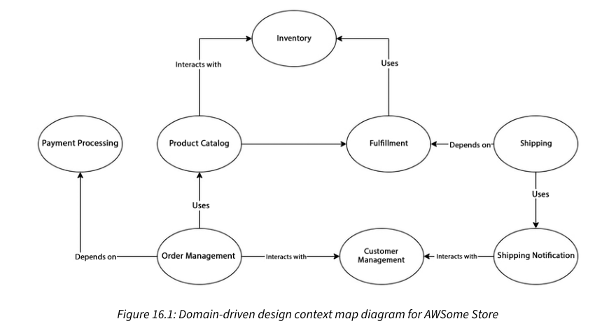

**Figure: DDD context map for AWSome Store.** This figure shows bounded contexts and relationships in the hands-on chapter.

**How to read it:** Focus on domain relationships before AWS services.

**Why it matters:** Good cloud-native design begins with business boundaries, not a service shopping list.

**How to apply it:** Use context mapping to clarify ownership, API boundaries, events, and data stores before implementation.

**Limitations:** Context maps need follow-up service contracts, data models, and operational design.

## 8. Architecture Decision Guide

| Decision | Choose Option A When | Choose Option B When | Key Tradeoffs | Failure Risks | Questions To Ask |
|---|---|---|---|---|---|
| Rehost vs refactor | Rehost when speed, low change risk, or migration deadline dominates. | Refactor when business value, scale, agility, or managed services justify deeper change. | Speed vs modernization value. | Rehost preserves technical debt; refactor expands scope. | What business outcome is required now? |
| IaaS vs PaaS/serverless | Use IaaS when OS/runtime control is needed. | Use PaaS/serverless when managed operations and event-driven scale fit. | Control vs operational simplicity. | Over-managed constraints or under-managed operations. | What control does the workload truly need? |
| VPC peering vs Transit Gateway | Use peering for small/simple direct VPC relationships. | Use Transit Gateway for many VPCs/accounts/hybrid networks. | Simplicity at small scale vs centralized routing. | Peering mesh sprawl or TGW route blast radius. | How many networks must connect? |
| VPN vs Direct Connect | Use VPN for lower-cost encrypted connectivity or backup paths. | Use Direct Connect for predictable private bandwidth and latency. | Cost/setup speed vs performance/predictability. | Internet variability or DX underutilization. | What bandwidth and latency are required? |
| Public endpoint vs PrivateLink/VPC endpoint | Use public endpoints for internet-facing services. | Use private endpoints for internal service access and reduced public exposure. | Accessibility vs private connectivity complexity. | Public exposure or DNS/policy misconfiguration. | Who needs to access the service? |
| EBS vs EFS vs S3 | Use EBS for block volumes, EFS for shared files, S3 for objects. | Use specialized FSx/backup/hybrid services when workloads require. | Performance and semantics differ. | Wrong abstraction creates cost or app complexity. | Is this block, file, or object access? |
| EC2 vs Lambda vs Fargate | Use EC2 for host control, Lambda for event functions, Fargate for managed containers. | Use ECS/EKS/Outposts/HPC when workload shape requires. | Control, limits, cost, scaling, operations. | Cold starts, host burden, runtime mismatch. | What is the execution unit and duration? |
| RDS/Aurora vs DynamoDB | Use RDS/Aurora for SQL and relational transactions. | Use DynamoDB for high-scale key-based access. | Query flexibility vs partitioned scale. | Hot keys or relational bottlenecks. | What are the exact access patterns? |
| Redis/Memcached cache vs no cache | Cache when repeated reads or expensive computation dominate. | Avoid cache when freshness or simplicity matters more. | Latency/load reduction vs invalidation complexity. | Stale data, cache stampede. | What staleness is acceptable? |
| Glue vs EMR | Use Glue for managed/serverless ETL and catalog-centric workflows. | Use EMR for broader big data framework control and cluster needs. | Simplicity vs control. | Service limits or cluster ops burden. | What framework and execution control are needed? |
| Kinesis vs MSK | Use Kinesis for AWS-native streaming. | Use MSK when Kafka compatibility/ecosystem is required. | Managed AWS integration vs Kafka ecosystem. | Partitioning mistakes or operational complexity. | Do consumers require Kafka APIs? |
| Redshift vs Athena | Use Redshift for warehouse performance and managed analytics clusters. | Use Athena for serverless S3 queries and ad hoc lake access. | Performance/control vs serverless simplicity. | Cluster cost or scan cost. | What query latency and concurrency are needed? |
| ECS vs EKS | Use ECS for simpler AWS-native container orchestration. | Use EKS for Kubernetes APIs/ecosystem or platform standardization. | Simplicity vs Kubernetes flexibility. | Unneeded Kubernetes complexity or ecosystem mismatch. | Does the team need Kubernetes? |
| Monolith vs microservices | Use monolith/modular monolith when domain/team complexity is low. | Use microservices when independent ownership and scale justify complexity. | Simplicity vs autonomy. | Distributed monolith. | What bounded context and team own this service? |
| Data lake vs warehouse vs data mesh | Use data lake for broad storage, warehouse for structured analytics, data mesh for domain-owned data products. | Combine as lakehouse or hybrid when requirements overlap. | Centralized platform vs domain ownership. | Data swamp or governance sprawl. | Who owns data quality and access? |

ADR pattern:

| Decision Context | Options Considered | Decision Rule | Consequences | Revisit When |
|---|---|---|---|---|
| Compute platform for new app | EC2, Lambda, ECS/Fargate, EKS | Choose the least operationally complex platform that satisfies runtime, scaling, and ecosystem needs. | Defines deployment, IAM, monitoring, cost, and team skills. | Runtime constraints, traffic shape, or team platform standards change. |
| Storage service | EBS, EFS, S3, FSx, Backup, Gateway | Choose by access semantics, durability, sharing, latency, lifecycle, and hybrid needs. | Defines data access, cost, backup, and security model. | Data size, access pattern, or compliance changes. |
| Database | Aurora/RDS, DynamoDB, ElastiCache, Neptune, Timestream, DocumentDB | Choose by access pattern, transactions, consistency, scale, and query needs. | Hard to change after launch; requires migration plan. | Query or scale assumptions are invalid. |
| Network connectivity | Peering, Transit Gateway, PrivateLink, VPN, Direct Connect, Cloud WAN | Choose by topology, trust boundary, bandwidth, and governance. | Defines routing, cost, and isolation model. | Number of VPCs/accounts or hybrid needs grows. |

## 9. System Design Playbooks

### Playbook: AWS Landing Zone For Enterprise Workloads

- **Use case:** Starting or restructuring AWS adoption.
- **Requirements to clarify first:** Account model, compliance, identity source, network topology, logging, security ownership, budget model, deployment process.
- **Baseline architecture:** AWS Organizations, OUs, separate accounts, centralized logging/security, shared networking, IAM federation, SCPs, tagging, budgets, and baseline CloudOps.
- **Scaling path:** Add self-service account vending, policy-as-code, automated guardrails, centralized network services, and platform golden paths.
- **Data model considerations:** Account and resource metadata, tags, audit events, cost allocation.
- **API/integration:** Identity provider integration, CI/CD roles, ticketing/CMDB where required.
- **Reliability:** Central logging and security accounts must be protected and recoverable.
- **Security:** SCPs, MFA/federation, least privilege, CloudTrail, Config, GuardDuty-style detection.
- **Observability:** Account inventory, compliance posture, audit dashboards, cost dashboards.
- **Cost:** Budgets, tags, service control, anomaly detection.
- **Failure modes:** Shadow accounts, untagged resources, missing logs, overly broad permissions.
- **Evolution:** Move from manual governance to automated guardrails and self-service platform workflows.

### Playbook: Secure Multi-Tier Web Application

- **Use case:** Production web app on AWS.
- **Requirements:** User traffic, API shape, data sensitivity, availability, latency, scaling, deployment frequency.
- **Baseline architecture:** CloudFront, WAF if needed, ALB/API Gateway, private app subnets, RDS/DynamoDB, S3, VPC endpoints, IAM roles, CloudWatch/X-Ray.
- **Scaling path:** Add autoscaling, cache, read replicas, CDN tuning, regional failover if justified.
- **Data model:** Transactional store for core data; S3 for objects; cache for hot reads.
- **API:** REST/GraphQL depending on client needs; idempotency for writes.
- **Reliability:** Multi-AZ, health checks, backups, rollback, failover tests.
- **Security:** Least privilege, TLS, private subnets, encryption, secret management, audit logs.
- **Observability:** SLO dashboard, logs, traces, alarms, business metrics.
- **Cost:** CDN hit ratio, compute scaling, DB capacity, log retention.
- **Failure modes:** Public exposure, DB bottleneck, cache stale data, bad deployments.
- **Evolution:** Move from single app service to domain services only when boundaries and scale justify it.

### Playbook: Data Lake And Analytics Platform

- **Use case:** Enterprise analytics and ML data foundation.
- **Requirements:** Sources, freshness, zones, quality, governance, consumers, query patterns, retention, privacy.
- **Baseline architecture:** S3 zones, Glue Data Catalog, Glue/EMR ETL, Athena/Redshift, Lake Formation, QuickSight, monitoring, lifecycle policies.
- **Scaling path:** Add streaming ingestion, data quality framework, domain data products, lakehouse tables, data mesh governance.
- **Data model:** Raw, cleansed, curated, consumption zones with metadata and ownership.
- **API/integration:** Batch ingestion, streaming, query interfaces, dashboard access.
- **Reliability:** Replayable ingestion, job retries, lineage, partition repair, backup of metadata.
- **Security:** Fine-grained access, encryption, audit, data classification.
- **Observability:** Job success, freshness, quality scores, query cost, consumer usage.
- **Cost:** S3 lifecycle, file format, compression, partitioning, Athena scan control.
- **Failure modes:** Data swamp, schema drift, broken dashboards, unbounded scan cost.
- **Evolution:** Start centralized; introduce data product ownership when domain maturity exists.

### Playbook: Containerized Microservice Platform

- **Use case:** Running multiple service teams on ECS or EKS.
- **Requirements:** Service count, deployment frequency, Kubernetes need, security, networking, observability, autoscaling.
- **Baseline architecture:** Container registry, ECS/EKS cluster, load balancing, IAM roles, secrets, logs, metrics, tracing, CI/CD, image scanning.
- **Scaling path:** Add service mesh if needed, platform templates, policy enforcement, cluster autoscaling, multi-account/multi-region strategy.
- **Data model:** Each service owns its data; avoid shared databases.
- **API/integration:** REST/gRPC/events; contract and schema tests.
- **Reliability:** Health probes, rollout/rollback, circuit breakers, retries with backoff.
- **Security:** Image scanning, least-privilege roles, network policy/security groups, secret rotation.
- **Observability:** Per-service SLOs, traces, dependency maps, deployment markers.
- **Cost:** Cluster utilization, Fargate/EC2 choice, autoscaling, idle resources.
- **Failure modes:** Distributed monolith, cluster upgrade incidents, bad IAM, hidden synchronous chains.
- **Evolution:** Start with ECS if Kubernetes is not required; adopt EKS where ecosystem and platform maturity justify it.

### Playbook: Serverless Domain Application

- **Use case:** Event-driven web or API application such as AWSome Store.
- **Requirements:** Bounded contexts, request/response APIs, asynchronous workflows, data stores, auth, cost, scale.
- **Baseline architecture:** Static/frontend hosting, API Gateway/AppSync, Lambda/Fargate as needed, DynamoDB/RDS/S3, queues/events, IAM roles, observability, billing alarms.
- **Scaling path:** Add domain services, workflow orchestration, caches, async fanout, and service-specific quotas.
- **Data model:** Per-context data ownership and idempotency for commands.
- **API:** Public API contracts, auth, throttling, pagination, idempotency.
- **Reliability:** Retries, DLQs, workflow state, alarms, deployment rollback.
- **Security:** Least-privilege function roles, input validation, secrets management.
- **Observability:** Function errors, duration, throttles, queue age, business events.
- **Cost:** Invocation count, data transfer, logs, API calls, provisioned capacity if used.
- **Failure modes:** Event duplication, hidden throttling, cold starts, missing DLQ, broad IAM.
- **Evolution:** Use Well-Architected reviews to optimize after initial delivery.

## 10. Operating, Troubleshooting, And Debugging

| Symptom | Likely Cause | How To Investigate | Fix | Prevention |
|---|---|---|---|---|
| EC2 or app cannot reach dependency | Route table, security group, NACL, DNS, endpoint, or subnet issue. | Trace route path, review SG/NACL, check flow logs and DNS. | Fix routes/rules/endpoints; add explicit tests. | Network design review and reachability tests. |
| Access denied errors | IAM policy missing action/resource, SCP deny, wrong role, missing trust policy. | Check caller identity, CloudTrail event, policy simulator, SCPs. | Grant least required permission or fix trust relationship. | IAM tests in CI and role inventory. |
| S3 object unexpectedly public or inaccessible | Bucket policy, public access block, ACL, access point, or endpoint policy mismatch. | Review bucket/access point/VPC endpoint policies and access logs. | Correct policy and block public access where required. | Policy review and automated public access checks. |
| Database connection exhaustion | Too many app connections, missing pooling/proxy, scaling app faster than DB. | Inspect DB connections, app instance count, error logs. | Add pooling/RDS Proxy, tune connection limits, throttle scale-out. | Load tests and connection budget. |
| DynamoDB throttling | Hot partition, insufficient capacity, bad key design, burst traffic. | Check throttled requests by key/index and partition distribution. | Redesign keys, add write sharding, cache hot reads, adjust capacity. | Access-pattern modeling before launch. |
| Lambda throttles or high latency | Concurrency limit, cold starts, downstream bottleneck, VPC networking. | Inspect concurrency, duration, init time, downstream metrics. | Increase concurrency, optimize package/init, add async buffering. | Load tests and concurrency alarms. |
| ALB/NLB target unhealthy | Bad health check path, app startup delay, security group issue, port mismatch. | Check target health reason, app logs, SG rules, listener/target config. | Fix health endpoint, ports, readiness, or security rules. | Health check design and deployment canaries. |
| CloudFront cache misses high | Cache key too broad, TTL low, headers/cookies vary, invalidations. | Inspect cache behavior, headers, origin requests, cache metrics. | Tune cache policy, TTL, origin shield, object versioning. | CDN design review and cache tests. |
| Glue/EMR job failures | Schema drift, bad input data, permissions, resource sizing, dependency issue. | Review job logs, catalog schema, input partitions, IAM. | Fix schema handling, permissions, job resources, data quality checks. | Data contracts and pipeline monitoring. |
| Athena query costs spike | Unpartitioned data, wrong file format, full scans, dashboard misuse. | Review scanned bytes, partitions, workgroup, query history. | Partition/compress data, use columnar formats, enforce workgroups. | Query budgets and optimized lake layout. |
| Kinesis/MSK consumer lag | Consumer too slow, bad partition key, downstream failures, poison records. | Check lag by shard/partition, consumer errors, processing duration. | Scale consumers, rebalance keys, handle poison records, optimize processing. | Lag alarms and idempotent processing. |
| EKS deployment fails | Image pull, RBAC/IAM, readiness probe, resource limits, node capacity. | Inspect pod events, logs, node status, IAM role, image registry. | Fix image/IAM/probes/resources or scale nodes. | Admission checks, CI validation, cluster capacity planning. |
| Cost surprise | Untagged resources, logs, NAT data processing, scans, idle compute, egress. | Use Cost Explorer, tags, service breakdown, usage reports. | Add budgets, lifecycle, right-sizing, log retention, query optimization. | Cost allocation and anomaly alerts. |
| Well-Architected review finds repeated issues | No remediation ownership or governance loop. | Review previous findings and backlog status. | Assign owners, prioritize by risk, set deadlines. | Recurring architecture review cadence. |

Operational rules:

- Every production workload should have an owner, SLO, dashboard, runbook, cost tag, and escalation path.
- Every data store should have backup, restore, retention, encryption, access policy, and monitoring.
- Every network path should have an intended route, trust boundary, and logging strategy.
- Every async pipeline should have lag alerts, retry policy, poison-record handling, and replay strategy.
- Every migration should have rollback and data reconciliation.

## 11. Applying This Knowledge To Existing Systems

### Architecture And Well-Architected Review

- **Inspect:** Current diagrams, ADRs, Well-Architected findings, workload owners, SLOs, and recent incidents.
- **Why it matters:** Existing systems often drift from original design assumptions.
- **Good looks like:** Architecture decisions map to requirements and are reviewed periodically.
- **Warning signs:** No one owns the architecture; diagrams are stale; high-risk findings repeat.
- **Improvement options:** Run a Well-Architected review, create remediation backlog, update ADRs, and assign owners.

### Account, Identity, And Governance Review

- **Inspect:** AWS Organizations, OUs, accounts, SCPs, IAM roles, users, trust policies, MFA, and CloudTrail.
- **Why it matters:** Identity is the control plane.
- **Good looks like:** Account separation, least privilege, federation, no long-lived app credentials, central logs.
- **Warning signs:** Admin users, wildcard policies, shared accounts, missing logs.
- **Improvement options:** Implement OUs, roles, SCP guardrails, access reviews, and policy tests.

### Network Review

- **Inspect:** VPCs, CIDRs, subnets, route tables, gateways, endpoints, peering/TGW, DNS, SGs, NACLs, flow logs.
- **Why it matters:** Network design determines exposure and reachability.
- **Good looks like:** Private workloads are private, traffic paths are intentional, logs are available.
- **Warning signs:** Public database subnets, overlapping CIDRs, broad inbound rules, no flow logs.
- **Improvement options:** Segment subnets, tighten rules, add endpoints, rationalize connectivity.

### Storage And Database Review

- **Inspect:** EBS/EFS/S3/FSx usage, lifecycle, versioning, backup, encryption, RDS/DynamoDB/access patterns, cache behavior.
- **Why it matters:** Data architecture is difficult to change later.
- **Good looks like:** Storage and databases match access patterns with tested recovery.
- **Warning signs:** S3 public risk, no restore tests, hot partitions, unbounded scans, cache-as-source-of-truth.
- **Improvement options:** Add lifecycle, restore drills, key redesign, query tuning, cache invalidation.

### Compute And Container Review

- **Inspect:** EC2 sizing, autoscaling, load balancers, Lambda/Fargate use, ECS/EKS configuration, health checks, images, deployments.
- **Why it matters:** Compute design affects availability and operations.
- **Good looks like:** Autoscaling works, deployments roll back, images are scanned, roles are narrow.
- **Warning signs:** Manual servers, pets not cattle, no readiness checks, no resource limits.
- **Improvement options:** Add autoscaling, CI/CD, immutable images, probes, and rollback.

### CloudOps And Cost Review

- **Inspect:** CloudWatch dashboards, X-Ray traces, Systems Manager, EventBridge automation, budgets, Cost Explorer, tags.
- **Why it matters:** Cloud scale needs operational and financial feedback loops.
- **Good looks like:** Cost and health are visible by workload owner.
- **Warning signs:** Untagged spend, alert fatigue, no runbooks, manual patching.
- **Improvement options:** Tag enforcement, budgets, automation, SLO alerts, cost optimization backlog.

### Data Platform Review

- **Inspect:** Data lake zones, Glue catalog, ETL jobs, streaming pipelines, Athena/Redshift usage, QuickSight dashboards, data quality.
- **Why it matters:** Analytics trust depends on governance and quality.
- **Good looks like:** Cataloged, owned, validated, access-controlled data.
- **Warning signs:** Raw bucket as lake, broken dashboards, expensive queries, no lineage.
- **Improvement options:** Add zones, quality checks, workgroups, lifecycle, ownership.

## 12. Applying This Knowledge To New Systems

Use this design sequence:

1. **Clarify business outcome:** Define what the system must achieve and what cloud capability enables.
2. **Capture requirements:** Functional behavior, users, data, security, compliance, latency, availability, scale, cost, sustainability, and operations.
3. **Choose account and governance model:** Account placement, IAM, SCPs, logging, budgets, and environment separation.
4. **Design network foundation:** Region, AZs, VPC, subnets, CIDR, routes, endpoints, ingress, egress, and hybrid connectivity.
5. **Choose compute model:** EC2, Lambda, Fargate, ECS, EKS, or hybrid based on runtime and operations.
6. **Choose storage and databases:** Block/file/object, transactional stores, caches, search, analytics, and retention.
7. **Design security baseline:** Identity, encryption, secrets, network controls, detection, audit, and compliance evidence.
8. **Design observability and CloudOps:** Logs, metrics, traces, dashboards, alarms, runbooks, automation, cost controls.
9. **Plan delivery:** Infrastructure as code, CI/CD, deployment strategy, rollback, migration/backfill, testing.
10. **Review with Well-Architected:** Identify risks and prioritize remediation.
11. **Define evolution triggers:** Document when to add caching, streaming, multi-region, containers, microservices, or data platform maturity.

New-system nonfunctional checklist:

- Availability target and failure domains.
- RTO/RPO and backup/restore.
- Identity and least privilege.
- Data classification and encryption.
- Network exposure and private access.
- Scaling bottleneck and autoscaling metric.
- Observability and incident response.
- Cost allocation and budget.
- Sustainability/resource efficiency.
- Compliance and audit evidence.

## 13. Technology Mapping

| Concept Or Need | Technology Option | When To Use | Watch Outs | Alternatives |
|---|---|---|---|---|
| Account governance | AWS Organizations, OUs, SCPs | Multi-account governance and guardrails. | SCP complexity, account sprawl. | Single account only for small experiments. |
| Architecture review | AWS Well-Architected Tool | Structured workload review. | Needs remediation follow-through. | Internal ADR/review process. |
| VPC isolation | Amazon VPC | Private network boundary for workloads. | CIDR planning, routes, DNS. | Serverless managed networking defaults for simple cases. |
| Many-network connectivity | Transit Gateway | Multi-VPC/account/hybrid hub. | Cost and route table design. | VPC peering, PrivateLink. |
| Private service exposure | PrivateLink/VPC endpoints | Keep service traffic private. | DNS and endpoint policy behavior. | Public endpoints, peering. |
| DNS and routing | Route 53 | DNS, routing policies, health checks. | TTL and failover behavior. | External DNS. |
| Edge delivery | CloudFront | Global caching and origin protection. | Cache keys, private content. | Direct origin, regional cache. |
| Block storage | EBS | EC2-attached volumes. | AZ scope, volume type. | Instance store, managed DB storage. |
| Shared file storage | EFS | Shared Linux file access. | Performance mode and permissions. | FSx, S3. |
| Object storage | S3 | Objects, data lake, static content, backups. | Public access, lifecycle, request cost. | EFS/FSx for file semantics. |
| Hybrid storage | Storage Gateway | On-premises access to AWS storage. | Network dependency and cache sizing. | Direct migration, DataSync. |
| Compute VM | EC2 | OS/runtime control. | Patching and capacity management. | Lambda, ECS, Fargate. |
| Serverless function | Lambda | Event-driven short-lived compute. | Limits, cold starts, concurrency. | ECS/Fargate, EC2. |
| Managed container compute | Fargate | Containers without server management. | Runtime constraints and cost model. | ECS/EKS on EC2. |
| Load balancing | ELB family | Distribute traffic and health route. | Correct ALB/NLB/GWLB choice. | API Gateway, CloudFront. |
| Relational DB | RDS/Aurora | SQL, ACID, relational workloads. | Connections, schema, failover. | DynamoDB, self-managed DB. |
| Key-value/document scale | DynamoDB | Known key-based access at scale. | Partition key and indexes. | RDS, DocumentDB. |
| Cache | ElastiCache | Low-latency shared cache. | Invalidation, hot keys. | DAX, in-process cache. |
| Graph | Neptune | Relationship traversal. | Query model and graph ownership. | Relational recursive queries. |
| Time-series | Timestream | Timestamped metrics/events. | Retention and query pattern. | OpenSearch, S3/Athena. |
| Security detection | GuardDuty and related security services | Threat detection and posture visibility. | Needs alert response. | Third-party SIEM/security tooling. |
| Operations | Systems Manager | Patch, inventory, automation, host management. | Agent/configuration coverage. | External configuration tools. |
| Monitoring/tracing | CloudWatch, X-Ray | Logs, metrics, alarms, traces. | Cost and instrumentation. | OpenTelemetry tools, third-party APM. |
| Batch big data | EMR | Hadoop/Spark ecosystem and cluster control. | Cluster operations. | Glue, Athena, Redshift. |
| ETL/catalog | Glue | Serverless ETL and cataloging. | Job limits, schema drift. | EMR, dbt, custom Spark. |
| Streaming | Kinesis | AWS-native stream ingestion. | Shards, partition keys, lag. | MSK/Kafka, SQS/SNS. |
| Kafka | MSK | Managed Kafka compatibility. | Kafka operations and tuning. | Kinesis. |
| Warehouse | Redshift | Data warehouse analytics. | Distribution/sort/query tuning. | Athena, lakehouse. |
| Lake query | Athena | Serverless S3 SQL queries. | Scan cost and partitions. | Redshift Spectrum, EMR. |
| Visualization | QuickSight | BI dashboards. | Governance and data quality. | Tableau, Power BI. |
| ML platform | SageMaker | ML build/train/deploy pipeline. | MLOps maturity and cost. | Managed AI services, custom platform. |
| IoT | AWS IoT services | Device connectivity and messaging. | Device identity and fleet security. | Custom MQTT platform. |
| Containers | ECS | AWS-native orchestration. | AWS-specific ecosystem. | EKS, ROSA. |
| Kubernetes | EKS | Managed Kubernetes control plane. | Cluster/platform operations. | ECS, Fargate. |
| OpenShift | ROSA | Managed OpenShift on AWS. | Enterprise platform fit and cost. | EKS, self-managed OpenShift. |
| Data governance | Lake Formation | Governed data lake permissions. | Organizational adoption and metadata quality. | Custom governance, third-party catalog. |

## 14. Production Readiness And Delivery Checklist

- **Business and requirements:** Business outcome, workload owner, FRs, NFRs, constraints, data classification, and compliance needs are documented.
- **Well-Architected review:** All six pillars reviewed; high-risk issues have owners and dates.
- **Account governance:** Correct account, OU, SCP, tagging, budgets, and centralized logging are in place.
- **Identity:** IAM roles are least-privilege; no long-lived app credentials; MFA/federation for humans.
- **Network:** VPC, subnets, routes, DNS, endpoints, ingress/egress, SGs, and NACLs are reviewed and tested.
- **Security:** Encryption, secrets, audit logs, detection, data protection, and incident response are configured.
- **Compute:** Runtime choice, autoscaling, health checks, deployment strategy, and rollback are validated.
- **Storage:** Storage service selection, lifecycle, access policy, versioning, backup, and restore are tested.
- **Database:** Data model, access patterns, consistency, backup/restore, failover, connection handling, and migration are validated.
- **Observability:** Logs, metrics, traces, dashboards, SLOs, alarms, and runbooks are production-ready.
- **CloudOps:** Patch/inventory, automation, cost management, audit evidence, and ownership model exist.
- **Data platform:** Catalog, zones, data quality, lineage, governance, and query-cost controls are in place if analytics is involved.
- **Containers:** Images are scanned, immutable, resource-limited, health-checked, and deployed through CI/CD.
- **Microservices:** Boundaries, contracts, data ownership, event schemas, and failure handling are explicit.
- **Testing:** Unit, integration, security, load, failover, restore, migration, and rollback tests pass.
- **Cost:** Budgets, tags, lifecycle, right-sizing, reserved/savings model, and anomaly alerts are configured.
- **Sustainability:** Resource utilization, scaling policies, storage lifecycle, and waste reduction have been reviewed.
- **Delivery:** Infrastructure as code, CI/CD, environment promotion, change approval, and rollback procedures are documented.

## 15. Knowledge Gaps And Further Study

- **Current AWS service behavior:** The book is a 2023 second edition. AWS services, exams, pricing, limits, and managed service features change frequently. Verify current AWS documentation before implementation.
- **Infrastructure as code depth:** The book includes setup guidance but does not deeply teach Terraform, CloudFormation, CDK, policy-as-code, or drift management. **Inference** Study one IaC tool deeply and build guardrails into CI/CD.
- **Advanced networking:** The networking chapter is broad, but production network architectures may require deeper study of DNS, hybrid routing, Direct Connect design, inspection VPCs, IPv6, egress control, and multi-account network segmentation. **Inference** Practice with reference architectures and failure simulations.
- **Security engineering:** The source covers core security services and principles, but deeper production security needs threat modeling, incident response, key management, zero trust, workload identity, and detection engineering. **Inference** Study AWS security reference architectures and run attack-path reviews.
- **Kubernetes operations:** EKS coverage introduces the platform but does not fully teach upgrades, add-ons, CNI behavior, admission control, network policy, cluster autoscaling, GitOps, or multi-cluster operations. See the local Kubernetes knowledge files for deeper study.
- **MLOps and generative AI:** The ML chapter surveys services but does not provide deep model governance, evaluation, prompt/security controls, or GenAI production patterns. **Inference** Study model monitoring, data drift, Responsible AI, and current AWS GenAI services separately.
- **Hands-on reproducibility:** The hands-on chapter includes setup material, but a production implementation should convert manual console steps into repeatable IaC and CI/CD.

## 16. Practice Exercises

### Concept Checks

1. Explain the shared responsibility model for EC2, Lambda, S3, and RDS.
   - **Strong answer:** Names what AWS owns, what the customer owns, and how responsibility changes by service abstraction.
2. Explain the six Well-Architected pillars with one production risk per pillar.
   - **Strong answer:** Connects each pillar to a concrete failure mode and remediation.
3. Compare IaaS, PaaS, and SaaS for a legacy enterprise application.
   - **Strong answer:** Covers control, operations, migration effort, customization, and cost.
4. Explain why S3 is not the same as EBS or EFS.
   - **Strong answer:** Covers object, block, and file semantics with use cases.

### Architecture Exercises

1. Design a multi-account AWS landing zone for a regulated company.
   - **Strong answer:** Includes OUs, accounts, IAM federation, SCPs, logs, security account, network account, budgets, and guardrails.
2. Design a secure three-tier web app.
   - **Strong answer:** Includes CloudFront/ALB/API front door, private subnets, database tier, IAM roles, encryption, logs, health checks, backup, and deployment.
3. Choose a database architecture for an ecommerce application.
   - **Strong answer:** Maps orders, catalog, sessions, search, analytics, and cache to appropriate stores with tradeoffs.
4. Design a data lake with governed analytics access.
   - **Strong answer:** Includes S3 zones, Glue catalog, Lake Formation/access, ETL, quality checks, Athena/Redshift, QuickSight, and cost controls.

### Debugging Scenarios

1. A private EC2 instance cannot download patches.
   - **Strong answer:** Checks routes, NAT, VPC endpoints, DNS, SG/NACL, Systems Manager connectivity, and logs.
2. A Lambda function gets AccessDenied when writing to DynamoDB.
   - **Strong answer:** Checks execution role, resource ARN, IAM policy, trust policy, SCP, and CloudTrail event.
3. Athena costs spike after a dashboard launch.
   - **Strong answer:** Checks scanned bytes, partitions, file format, workgroups, query history, and dashboard query pattern.
4. EKS pods fail after a deployment.
   - **Strong answer:** Checks image pull, readiness/liveness, resource limits, node capacity, IAM/RBAC, and rollback.

### Current-System Assessment Tasks

1. Run a Well-Architected review on one workload and identify the top five remediation items.
   - **Strong answer:** Prioritizes by risk, assigns owners, and creates validation criteria.
2. Review all public network paths in an AWS account.
   - **Strong answer:** Lists internet gateways, public subnets, load balancers, public IPs, security groups, and public S3 exposure.
3. Review AWS cost by workload owner.
   - **Strong answer:** Uses tags, Cost Explorer, budgets, anomalies, and right-sizing recommendations.

### Future-System Design Tasks

1. Build a migration plan for 20 applications using the 7 Rs.
   - **Strong answer:** Includes inventory, dependencies, wave plan, landing zone, security baseline, testing, cutover, rollback, and modernization backlog.
2. Design a microservice architecture from a domain context map.
   - **Strong answer:** Uses bounded contexts, service ownership, data ownership, contracts, events, deployment, observability, and failure handling.

## 17. Quick Reference

### Key Terms

- **IaaS:** Infrastructure service model where customers manage more of the stack.
- **PaaS:** Platform service model where provider manages more runtime and infrastructure.
- **SaaS:** Complete application service consumed by users.
- **Elasticity:** Ability to adjust resources to demand.
- **Scalability:** Ability to handle growth in workload.
- **Shared responsibility:** Division of security and operations ownership between AWS and customer.
- **Well-Architected Framework:** AWS review framework built around six pillars.
- **7 Rs:** Rehost, re-platform, refactor, revise, repurchase, relocate, retain, retire.
- **VPC:** Isolated AWS network boundary.
- **Security group:** Stateful resource-level firewall control.
- **NACL:** Stateless subnet-level network control.
- **Transit Gateway:** Hub for VPC and hybrid connectivity.
- **PrivateLink:** Private service exposure mechanism.
- **CloudFront:** CDN and edge distribution service.
- **EBS:** Block storage for EC2.
- **EFS:** Elastic shared file storage.
- **S3:** Object storage.
- **RDS/Aurora:** Managed relational database services.
- **DynamoDB:** Managed key-value/document database.
- **ElastiCache:** Managed Redis/Memcached cache.
- **Glue:** ETL and data catalog service.
- **Kinesis:** AWS-native streaming service.
- **MSK:** Managed Kafka service.
- **Redshift:** Data warehouse service.
- **Athena:** Serverless SQL over S3 data.
- **SageMaker:** Managed ML platform.
- **ECS:** AWS-native container orchestration.
- **EKS:** Managed Kubernetes control plane.
- **Fargate:** Serverless container compute.
- **Data lake:** Governed storage and processing architecture for diverse data.
- **Data mesh:** Domain-owned data product architecture.

### Decision Rules Of Thumb

- Start with requirements and Well-Architected risks before choosing services.
- Use account boundaries for blast-radius control.
- Keep private workloads private by default.
- Choose storage by access semantics: block, file, object, archive, or hybrid.
- Choose databases by access pattern and consistency, not by trend.
- Add caches only with invalidation, TTL, and cache-down behavior.
- Use ECS when AWS-native container simplicity is enough; use EKS when Kubernetes is required.
- Use Athena for serverless lake queries; use Redshift for warehouse workloads needing predictable performance.
- Use Kinesis for AWS-native streaming; use MSK for Kafka ecosystem compatibility.
- Use data lake zones and governance before scaling analytics consumers.

### Implementation Rules Of Thumb

- Use roles, not long-lived credentials, for workloads.
- Tag resources for ownership and cost.
- Enable logs and metrics before launch.
- Test restore, not only backup.
- Test failover, not only redundancy.
- Model DynamoDB keys before implementation.
- Use CloudFront cache policies deliberately.
- Use infrastructure as code for repeatability.
- Add budgets and cost anomaly detection early.
- Convert Well-Architected findings into backlog items.

### Common Anti-Patterns

- Lift-and-shift everything with no modernization plan.
- Public subnets and broad security groups for private workloads.
- Admin IAM policies for application roles.
- S3 buckets with wildcard access.
- Untagged resources and no budget owner.
- Data lake without catalog, zones, quality, or governance.
- Microservices sharing a database.
- Kubernetes adoption without platform ownership.
- Serverless functions without observability or DLQs.
- Dashboards querying raw unpartitioned data.

### Critical Questions Before Implementation

- What business outcome does this architecture support?
- Which Well-Architected pillar has the highest risk?
- What does AWS own and what do we own?
- Which account and network boundary should this workload use?
- What data is sensitive, authoritative, or derived?
- What service best matches the access pattern?
- What failure must the system survive?
- What is the RTO/RPO?
- What metrics prove health?
- What will this cost at 10x usage?
- How will this design be deployed, rolled back, and reviewed?
