# AWS for Solutions Architects, Second Edition - Engineering Knowledge

- **Detected title:** *AWS for Solutions Architects, Second Edition: The definitive guide to AWS Solutions Architecture for migrating to, building, scaling, and succeeding in the cloud*
- **Authors:** Saurabh Shrivastava, Neelanjali Srivastav, Alberto Artasanchez, Imtiaz Sayed
- **Primary domains:** AWS architecture, cloud migration, networking, storage, compute, databases, security, CloudOps, analytics, ML, containers, microservices, data lakes, serverless application design
- **How to use this file:** Treat it as an architecture field guide. Start with the mental models and decision guides, then use the technology mapping and checklists during design reviews, migrations, production readiness reviews, and troubleshooting.
- **Version note:** The source is from 2023. AWS services, limits, pricing, names, and best practices change frequently. Any implementation should verify current AWS documentation before production use. That verification requirement is an `[Inference]` based on AWS service velocity and the book's own emphasis on rapid cloud evolution.
- **Visual handling:** Important extracted diagrams are explained inside this main knowledge file in section 14, including DynamoDB key design, EBS volume selection, CloudFront request flow, VPC connectivity, data lake zones, event-driven patterns, and EKS control plane architecture.

## 1. Learning Roadmap

This book is broad, not narrow. The right study path is to build an architecture spine first, then attach AWS services to the problems they solve.

Start with the cloud operating model. Chapters 1-3 introduce cloud economics, elasticity, scalability, the AWS Well-Architected Framework, cloud adoption, migration patterns, high availability, reliability, scalability, and chaos engineering. These chapters teach the architect's default question: "What property of the system am I trying to improve, and what operational cost am I accepting?"

Then study the platform substrate. Chapters 4-8 cover networking, storage, compute, databases, and security. These are the foundation for most AWS designs. A weak VPC, identity, storage, or database choice leaks into every later decision: deployment topology, blast radius, availability, observability, cost, and incident response.

Next study operations and data platforms. Chapters 9-12 cover CloudOps, big data, streaming, warehousing, visualization, ML, IoT, blockchain, quantum, and generative AI. These chapters are useful after the core platform choices are understood because they assume governance, automation, IAM, networking, storage, and cost controls exist.

Finally study application architecture. Chapters 13-16 cover containers, microservices, event-driven architecture, domain-driven design, data lake patterns, and a hands-on AWSome Store application. These chapters turn services into systems: APIs, event flows, bounded contexts, data ownership, deployment boundaries, and Well-Architected review.

After studying this file, the reader should be able to:

- Explain how AWS architecture decisions map to Well-Architected pillars.
- Select between AWS compute, storage, database, networking, analytics, and container services using workload requirements instead of service familiarity.
- Design baseline AWS architectures for web applications, data platforms, event-driven systems, and migration programs.
- Identify production risks around identity, network exposure, data durability, operational ownership, cost, observability, and failure recovery.
- Review an existing AWS system and produce specific improvement actions.

## 2. Core Mental Models

| Mental Model | Explanation | Helps Solve | Example | Common Misuse |
|---|---|---|---|---|
| AWS architecture is tradeoff management, not service assembly | Services are implementation choices under constraints: security, reliability, performance, cost, operations, and sustainability. The Well-Architected pillars provide the review frame. | Prevents "service catalog architecture" where diagrams list AWS services without requirements. | Choose DynamoDB for predictable key-value access and scale, not because it is "serverless." | Treating the Well-Architected Framework as a checklist after design instead of a design input. |
| Global infrastructure is a reliability primitive | Regions, Availability Zones, Local Zones, edge locations, and hybrid extensions are topology building blocks. Resilience depends on placement and failure domain boundaries. | Regional and AZ-level failure planning. | Deploy stateless application tiers across multiple AZs behind a load balancer. | Assuming "AWS is highly available" automatically makes a single-AZ workload highly available. |
| Managed services shift work, not accountability | AWS can operate infrastructure layers, but customers still own configuration, access control, data modeling, resilience goals, observability, and cost. | Shared responsibility, operational readiness, compliance. | RDS automates database administration tasks, but schema design, backup strategy, access policies, and query behavior remain workload concerns. | Believing managed equals maintenance-free. |
| Purpose-built data stores reduce accidental complexity | AWS database and storage choices fit different access patterns: relational, key-value, document, graph, time-series, ledger, file, block, and object. | Data architecture decisions. | Use S3 for durable object storage and Athena for ad hoc lake queries; use RDS/Aurora for relational transaction workloads. | Forcing every workload into one database because the team already knows it. |
| Network boundaries are security and operability boundaries | VPCs, subnets, route tables, security groups, NACLs, PrivateLink, TGW, VPN, Direct Connect, CloudFront, and Route 53 shape reachability and blast radius. | Secure connectivity, hybrid design, private service access. | Use PrivateLink to expose a provider service privately without full network peering. | Creating broad CIDR connectivity and then relying only on application authentication. |
| Event-driven systems buy decoupling with debugging cost | Queues, streams, pub/sub, and event buses reduce direct dependencies, but introduce ordering, replay, idempotency, and observability requirements. | Microservices integration and scaling. | Use EventBridge/SQS for order workflow integration where producers should not block on consumers. | Treating asynchronous events as inherently simpler than request/response flows. |
| Migration is a portfolio decision | The 7 Rs frame migration per application or component: rehost, replatform, refactor, revise, repurchase, relocate, retain, retire. | Cloud migration planning. | Rehost a low-risk legacy app first, refactor a differentiating customer platform later. | Applying one migration strategy to every workload. |
| Data lakes need governance more than buckets | A lake requires zones, cataloging, quality, security, ingestion, lineage, monitoring, and cost controls. S3 alone is storage, not a governed data lake. | Enterprise analytics platforms. | Use Lake Formation, Glue Data Catalog, and zone-based organization to make data discoverable and controlled. | Creating a raw S3 dump and calling it a data lake. |
| CloudOps is automation plus ownership | Governance, configuration, audit, provisioning, observability, centralized operations, and finance management must be designed as operating capabilities. | Production maturity. | Use CloudFormation/CDK/Service Catalog for repeatable provisioning and CloudWatch/X-Ray/CloudTrail/Config for visibility. | Shipping application infrastructure manually and treating monitoring as a later task. |

## 3. Deep Concept Notes

### AWS Well-Architected Framework

- **Explanation:** The Well-Architected Framework is AWS's architecture review model organized around security, reliability, performance efficiency, cost optimization, operational excellence, and sustainability.
- **Problem solved:** It gives architects a repeatable way to evaluate whether a workload is designed for production reality rather than only functional correctness.
- **How it works:** Each pillar asks architecture questions and identifies risks. The AWS Well-Architected Tool and workload-specific lenses help structure reviews.
- **Why it matters:** Most cloud failures are not caused by a missing service; they are caused by a missing architectural property such as least privilege, backup validation, scaling path, observability, or cost control.
- **When to use:** Use it before implementation, before launch, during major changes, and after incidents.
- **When not to use:** Do not use it as a bureaucratic gate without workload context. The framework is useful only when it changes design or operating decisions.
- **Tradeoffs:** It improves rigor but can feel broad. Teams need to translate pillar questions into concrete acceptance criteria.
- **Common mistakes:** Running a Well-Architected review after the architecture is already politically fixed; treating "green" answers as permanent; ignoring sustainability and cost until after scale.
- **Production example:** A customer-facing API should be reviewed for IAM scope, data encryption, multi-AZ design, autoscaling behavior, error budgets, dashboards, deployment rollback, and cost allocation before production launch.
- **Questions to ask:** What are the highest-risk pillar findings? Which risks are accepted, mitigated, or transferred? What evidence proves the answer?
- **Source reference:** Chapter 2, pp. 68-84.

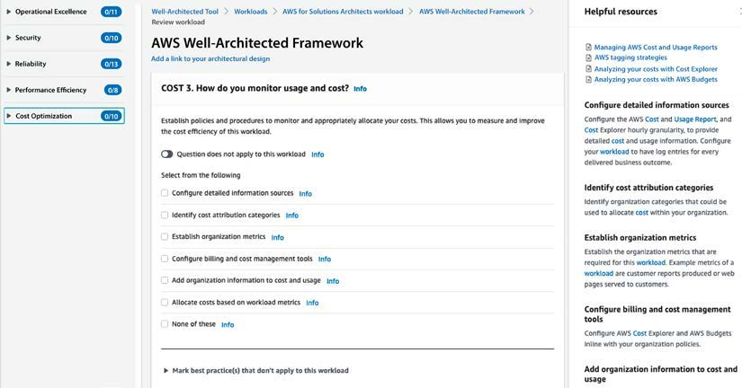

**Figure: AWS Well-Architected Tool.** The source presents the tool as a structured way to validate architectures against AWS best practices.

**How to read it:** Treat the tool as a review workflow, not as the architecture itself. Each answer should map to evidence such as IaC, tests, dashboards, runbooks, or cost reports.

**Why it matters:** The tool helps reveal hidden risk across pillars before the workload is under production pressure.

**How to apply it:** Run the review with engineering, security, operations, and product owners present. Convert findings into tracked engineering work.

**Limitations:** The figure is a product screenshot from the 2023 edition. Verify the current AWS console experience and lens content before use.

### Cloud Migration Strategy and the 7 Rs

- **Explanation:** Migration strategy is a per-workload decision across rehost, replatform, refactor, revise, repurchase, relocate, retain, and retire.
- **Problem solved:** It prevents migration programs from applying one expensive or risky strategy to the whole portfolio.
- **How it works:** Assess each workload's business value, technical debt, dependencies, risk, modernization opportunity, and time constraint. Then choose the minimum migration pattern that meets the business objective.
- **Why it matters:** The migration choice controls cost, timeline, outage risk, and how much cloud-native value is realized.
- **When to use:** Use during portfolio assessment, migration wave planning, and modernization roadmaps.
- **When not to use:** Do not refactor every workload by default. Refactoring is justified when the business value, scaling need, or technical debt reduction outweighs the migration complexity.
- **Tradeoffs:** Rehosting is fast but preserves architecture debt. Refactoring can unlock elasticity and managed services but requires more engineering skill and validation. Retain and retire are valid decisions when migration has no business case.
- **Common mistakes:** Migrating tightly coupled workloads out of dependency order; ignoring licensing; moving data before clarifying cutover and rollback; calling rehosted systems "modernized."
- **Production example:** An internal reporting app with low change rate may be rehosted. A customer checkout system with seasonal spikes may be replatformed or refactored around managed databases, queues, caches, and autoscaling.
- **Questions to ask:** What is the business driver? What dependencies block cutover? What data must move? What is the rollback plan? Which components should be retired instead of migrated?
- **Source reference:** Chapter 3, pp. 116-124.

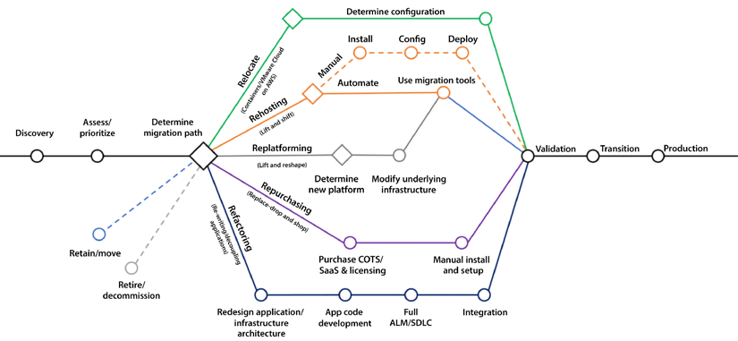

**Figure: 7 Rs of AWS cloud migration.** The source uses this figure to frame migration choices.

**How to read it:** The options are not maturity levels. They are strategies suited to different workloads and constraints.

**Why it matters:** A portfolio-level cloud program succeeds when each workload receives the right migration treatment.

**How to apply it:** Tag each application in the migration inventory with one R, an owner, dependencies, data movement needs, test strategy, and rollback plan.

**Limitations:** The figure does not include workload-specific risk scoring. Teams still need discovery and dependency mapping.

### AWS Networking Foundations

- **Explanation:** AWS networking starts with VPCs, subnets, route tables, internet gateways, NAT gateways, security groups, NACLs, VPC endpoints, and connectivity patterns such as VPC peering, Transit Gateway, PrivateLink, VPN, Direct Connect, Cloud WAN, CloudFront, Route 53, and Global Accelerator.
- **Problem solved:** These services define traffic paths, trust boundaries, hybrid connectivity, and exposure to the internet.
- **How it works:** VPCs isolate network address spaces. Subnets place resources into routing domains. Route tables direct traffic. Security groups and NACLs filter traffic. Edge and hybrid services extend reachability and performance.
- **Why it matters:** Network design affects availability, security, latency, cost, debugging, and future account or region expansion.
- **When to use:** Use VPC-level design at the start of any serious AWS landing zone, not after workloads already depend on ad hoc CIDRs.
- **When not to use:** Avoid overbuilding hub-and-spoke or inspection architectures for tiny systems without compliance or scale drivers. Complexity must match risk.
- **Tradeoffs:** VPC peering is simple but scales poorly for many VPCs. Transit Gateway centralizes routing but adds cost and shared dependency. PrivateLink narrows exposure but requires endpoint/service planning. Direct Connect improves private connectivity but adds circuit and failover planning.
- **Common mistakes:** Overlapping CIDRs; public subnets for private workloads; hardcoded IP assumptions; unmanaged route propagation; no flow logs; no documented ingress/egress model.
- **Production example:** A multi-account platform can use separate VPCs per environment, TGW for shared routing, PrivateLink for internal service exposure, Route 53 for DNS, and CloudFront/WAF for public web entry.
- **Questions to ask:** Which flows must be public, private, or hybrid? Where are inspection points? What is the blast radius of route changes? What logs prove traffic behavior?
- **Source reference:** Chapter 4, pp. 146-181.

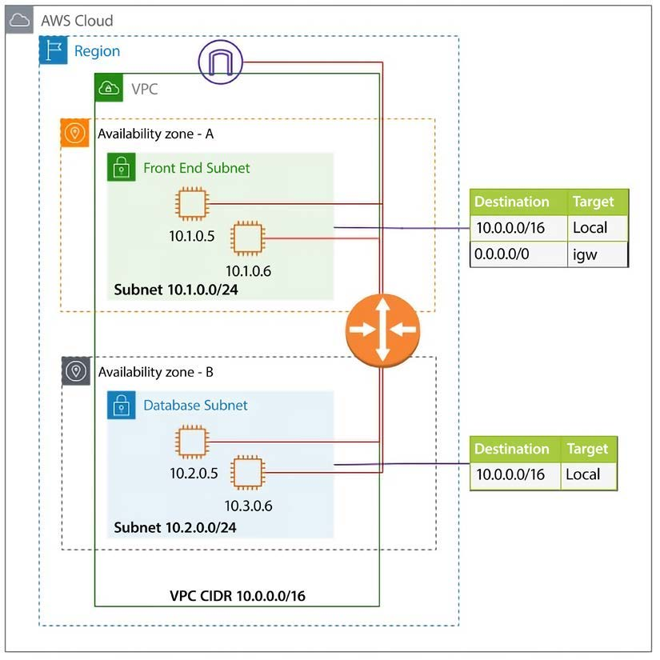

**Figure: AWS VPC network architecture.** The source uses this diagram to show core VPC elements and traffic flow.

**How to read it:** Follow the path from workload subnet to routing component to external or private destination. Identify where traffic is allowed, translated, filtered, or logged.

**Why it matters:** Most AWS security and availability decisions are expressed through reachability.

**How to apply it:** Document subnets, route tables, gateways, security groups, NACLs, endpoints, and DNS behavior as part of every architecture review.

**Limitations:** A single VPC diagram does not show multi-account governance, centralized inspection, or organization-wide IP address management.

### Storage Selection

- **Explanation:** AWS storage choices include block storage with EBS, shared file storage with EFS and FSx, object storage with S3 and Glacier classes, hybrid storage via Storage Gateway, and backup orchestration through AWS Backup.
- **Problem solved:** Different workloads require different access semantics: block device, shared file system, durable object store, archival storage, or hybrid bridge.
- **How it works:** EBS attaches to compute as block volumes. EFS provides elastic NFS file storage. FSx provides managed file systems for specific engines. S3 stores objects with storage classes and lifecycle options. Glacier classes reduce cost for archival retrieval profiles.
- **Why it matters:** Storage mistakes often appear later as performance bottlenecks, restore failures, security exposure, or runaway cost.
- **When to use:** Match storage to access pattern, latency, durability, sharing, throughput, lifecycle, and compliance needs.
- **When not to use:** Do not use EBS for shared multi-instance file access unless the volume mode and workload support it. Do not use S3 as a POSIX file system. Do not use archival classes for hot data.
- **Tradeoffs:** EBS gives low-latency block semantics but is scoped to instance/AZ patterns. EFS simplifies shared access but can cost more or require throughput planning. S3 is highly durable and flexible but object-based. Glacier classes reduce storage cost but increase retrieval complexity.
- **Common mistakes:** Public S3 buckets; wildcard bucket policies; no lifecycle rules; no object lock where immutability is required; missing encryption; no restore test; ignoring S3 request and retrieval costs.
- **Production example:** A web app might use EBS for EC2 boot/data volumes, S3 for uploads, CloudFront for distribution, lifecycle rules for cold objects, and AWS Backup for restore governance.
- **Questions to ask:** Is the workload block, file, or object oriented? What are read/write patterns? What is the RPO/RTO? Who can access the data? How is restore tested?
- **Source reference:** Chapter 5, pp. 182-218.

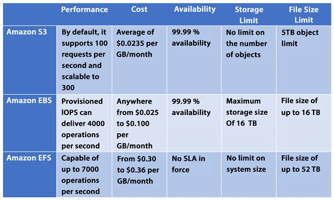

**Figure: Choosing storage service by use case.** The source presents storage selection as a workload-fit decision.

**How to read it:** Begin with access pattern, not service name. The branch should be driven by semantics: block, file, object, archive, or hybrid.

**Why it matters:** Storage shape is hard to change after data and applications depend on it.

**How to apply it:** Capture storage requirements in architecture records before provisioning: latency, throughput, sharing, durability, retention, compliance, lifecycle, and recovery.

**Limitations:** The figure cannot capture all current AWS storage classes, pricing, quotas, or regional availability. Verify current details.

### Compute Selection

- **Explanation:** AWS compute includes EC2, load balancers, Lambda, Fargate, Outposts, VMware Cloud on AWS, and HPC-related options.
- **Problem solved:** It maps workload execution to the right level of control, elasticity, operational burden, latency, and cost model.
- **How it works:** EC2 provides virtual machines and instance families. ELB distributes traffic. Lambda runs functions in response to events. Fargate runs containers without managing servers. Outposts and VMware Cloud on AWS support hybrid requirements.
- **Why it matters:** Compute choice defines patching responsibility, scaling design, deployment model, observability, networking, and cost profile.
- **When to use:** Use EC2 when you need OS/runtime control, persistent processes, special instance families, or lift-and-shift compatibility. Use Lambda for event-driven, short-lived, elastic units of work. Use Fargate for containerized services without node management. Use Outposts/hybrid options for local latency, residency, or migration constraints.
- **When not to use:** Avoid Lambda for long-running workloads or workloads needing stable local state. Avoid unmanaged EC2 fleets when managed services meet requirements. Avoid hybrid compute without a strong latency, regulatory, or migration driver.
- **Tradeoffs:** EC2 gives control with operations work. Lambda gives elasticity with runtime and execution constraints. Containers improve packaging and deployment consistency but require orchestration decisions.
- **Common mistakes:** Selecting instance families by habit; ignoring rightsizing; no autoscaling; no tagging; no backup/snapshot policy; wrong load balancer type; treating serverless as cost-free.
- **Production example:** A public API could use ALB plus ECS/Fargate, while asynchronous image processing uses S3 events and Lambda. A legacy vendor app may stay on EC2 during migration.
- **Questions to ask:** What is the execution duration? What control is required? What scales independently? What is the failure isolation boundary? What team will patch and operate it?
- **Source reference:** Chapter 6, pp. 220-260.

### Database Selection

- **Explanation:** AWS provides relational, NoSQL, in-memory, graph, time-series, ledger, and wide-column database options including RDS/Aurora, DynamoDB, DocumentDB, ElastiCache, Neptune, Timestream, QLDB, and Keyspaces.
- **Problem solved:** Different workloads have different data models, consistency needs, query shapes, latency requirements, and scaling patterns.
- **How it works:** Relational databases model structured relationships and transactions. NoSQL databases optimize access patterns such as key-value or document operations. Caches reduce repeated read latency. Graph databases query relationships. Time-series databases optimize time-ordered metrics/events. Ledger databases preserve verifiable history.
- **Why it matters:** Database choice is one of the highest-friction architecture decisions to reverse.
- **When to use:** Choose the database by access pattern, consistency model, transaction boundaries, query flexibility, scale, and operational maturity.
- **When not to use:** Do not choose DynamoDB for arbitrary relational queries. Do not choose relational databases for unbounded high-volume key-value access without scale planning. Do not add a cache when stale reads or invalidation would break correctness.
- **Tradeoffs:** ACID simplifies correctness but can limit horizontal scale. BASE/eventual consistency improves availability/scale but shifts correctness into application logic. Purpose-built databases reduce workload mismatch but increase platform diversity.
- **Common mistakes:** Modeling DynamoDB like a relational database; ignoring partition keys; using cache as source of truth; treating database migration as only data copy; not validating backup/restore.
- **Production example:** An order system might use Aurora for transactional order state, DynamoDB for shopping cart sessions, ElastiCache for hot product lookups, and S3/Athena for analytical exports.
- **Questions to ask:** What queries must be fast? What consistency is required? How large can partitions become? What is the write pattern? What is the recovery plan?
- **Source reference:** Chapter 7, pp. 262-308.

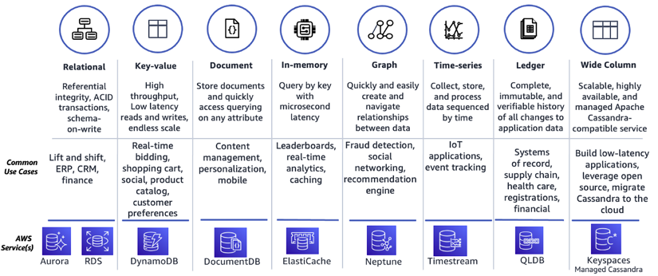

**Figure: AWS database services in a nutshell.** The source summarizes purpose-built database options.

**How to read it:** Read from workload shape to service family. The decision starts with access model and correctness needs.

**Why it matters:** A database selected for the wrong access pattern creates long-term scale, cost, and complexity debt.

**How to apply it:** Write access-pattern tables before selecting a database. Include read/write paths, keys, indexes, consistency, retention, and failure recovery.

**Limitations:** AWS database offerings evolve. Validate current features, limits, and pricing.

### Security, Identity, and Shared Responsibility

- **Explanation:** AWS security uses a shared responsibility model. AWS secures the cloud infrastructure; customers secure their workloads, identities, data, configurations, and access patterns according to service category.
- **Problem solved:** It clarifies who owns which control and prevents gaps between provider responsibility and customer responsibility.
- **How it works:** IAM users, groups, roles, policies, organizations, IAM Identity Center, Control Tower, Cognito, GuardDuty, Inspector, WAF, Shield, Macie, KMS, CloudHSM, Secrets Manager, Detective, Security Hub, Artifact, and related services implement identity, detection, protection, encryption, governance, and compliance capabilities.
- **Why it matters:** Most cloud security incidents involve misconfiguration, over-broad permissions, public data exposure, missing monitoring, or unowned secrets.
- **When to use:** Security architecture is mandatory from landing zone through workload design. Identity and data protection should be designed before application deployment.
- **When not to use:** Do not use long-lived IAM users for application workloads when roles are appropriate. Do not put secrets in code or environment sprawl without rotation controls.
- **Tradeoffs:** Strong controls add operational processes. Centralized governance improves consistency but must avoid blocking teams with brittle approvals.
- **Common mistakes:** Wildcard IAM permissions; no MFA; no account separation; unmanaged root account; public S3 access; no CloudTrail; no GuardDuty/Security Hub triage process; no key rotation plan.
- **Production example:** A multi-account setup can use Organizations and Control Tower for guardrails, IAM Identity Center for workforce access, workload roles for service access, KMS for encryption, CloudTrail/Config for audit, and GuardDuty/Security Hub for detection.
- **Questions to ask:** Who can assume which role? What data is sensitive? How is access reviewed? What detective controls alert on compromise? What is the incident response path?
- **Source reference:** Chapter 8, pp. 310-350.

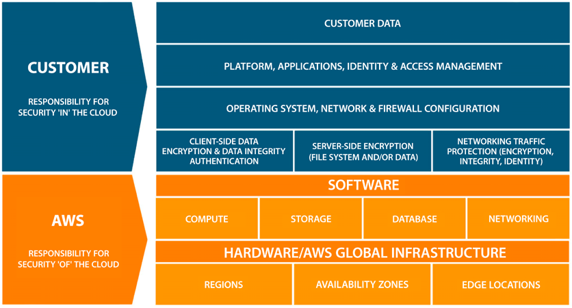

**Figure: Shared responsibility model.** The source uses this figure as the security foundation.

**How to read it:** Separate provider-owned infrastructure controls from customer-owned workload controls.

**Why it matters:** Responsibility gaps become incident paths.

**How to apply it:** For every service in an architecture, write down the customer-owned controls: identity, network exposure, encryption, logging, patching, backup, and data classification.

**Limitations:** The exact boundary differs by service type. Always verify service-specific shared responsibility details.

### CloudOps and Automation

- **Explanation:** CloudOps is the operating model for cloud systems: governance, configuration, compliance, provisioning, observability, centralized operations, and financial management.
- **Problem solved:** It gives teams the discipline to operate many dynamic cloud resources safely.
- **How it works:** AWS services such as CloudTrail, Config, License Manager, CloudWatch, EventBridge, Audit Manager, Systems Manager, CloudFormation, Service Catalog, Proton, CDK, Amplify, X-Ray, Cost Explorer, Budgets, and billing tools support the CloudOps pillars.
- **Why it matters:** Cloud speed without CloudOps creates uncontrolled drift, hidden spend, inconsistent security, and fragile incident response.
- **When to use:** Build CloudOps from the first landing zone, then evolve with application scale.
- **When not to use:** Avoid heavy centralized operations for early experimentation if it blocks learning. `[Inference]` Use lightweight guardrails first, then strengthen controls as blast radius grows.
- **Tradeoffs:** Automation reduces drift but demands code review and lifecycle management. Centralization improves governance but can slow teams if service ownership is unclear.
- **Common mistakes:** Manual console changes with no IaC; no tagging strategy; no budget alarms; no audit logs; no patch automation; dashboard-only observability without alert ownership.
- **Production example:** A team provisions infrastructure with CDK/CloudFormation, tracks config drift with AWS Config, logs API activity with CloudTrail, monitors SLOs with CloudWatch/X-Ray, and controls cost via tags, budgets, and Cost Explorer.
- **Questions to ask:** What is automated? What is auditable? What alerts page humans? What changes are allowed manually? How is cost allocated?
- **Source reference:** Chapter 9, pp. 352-392.

### Big Data, Streaming, Warehousing, and Analytics

- **Explanation:** AWS analytics services support batch processing, ETL, streaming, warehousing, ad hoc querying, and visualization through EMR, Glue, Kinesis, MSK, Redshift, Athena, and QuickSight.
- **Problem solved:** They help convert large or fast-moving datasets into governed, queryable, and useful information.
- **How it works:** EMR runs big data frameworks. Glue catalogs, crawls, transforms, and runs serverless ETL. Kinesis and MSK ingest and process streams. Redshift provides data warehouse architecture. Athena queries data in S3 with SQL. QuickSight visualizes data.
- **Why it matters:** Data systems fail when ingestion, schema, storage layout, query patterns, governance, and cost are designed separately.
- **When to use:** Use Glue for serverless ETL/cataloging, EMR for deeper control over big data frameworks, Kinesis for AWS-native streaming, MSK for Kafka-compatible ecosystems, Redshift for structured warehouse workloads, Athena for serverless lake queries.
- **When not to use:** Do not use Athena as a high-concurrency low-latency OLTP engine. Do not use streaming where batch latency is acceptable. Do not choose Kafka/MSK only because it is popular if the team lacks operational skill.
- **Tradeoffs:** Managed analytics reduces infrastructure work but still needs schema governance, partitioning, file sizing, security, and cost discipline.
- **Common mistakes:** Many small files in S3; no partition strategy; uncompressed row formats for large scans; no schema registry for streams; no data catalog ownership; dashboards without data quality checks.
- **Production example:** Events land in Kinesis/MSK, raw data is stored in S3, Glue catalogs and transforms it, Athena supports ad hoc exploration, Redshift supports curated warehouse workloads, and QuickSight serves dashboards.
- **Questions to ask:** What is the freshness requirement? What schema evolution is allowed? Who owns data quality? What query pattern drives storage layout? How is spend controlled?
- **Source reference:** Chapters 10-11, pp. 394-466.

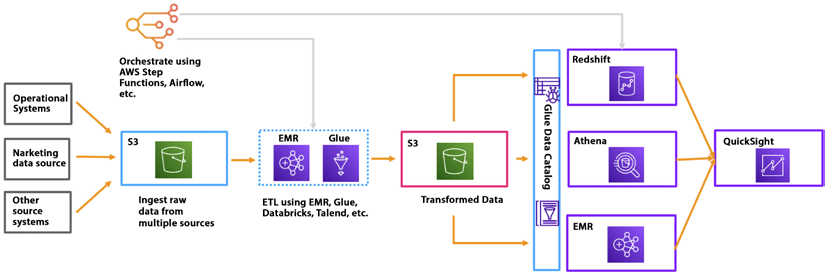

**Figure: AWS analytic architecture.** The source shows how ingestion, processing, storage, query, and visualization services fit together.

**How to read it:** Separate ingestion, durable storage, transformation, serving/query, and presentation layers.

**Why it matters:** Data architecture is an end-to-end flow, not a single service selection.

**How to apply it:** Design data contracts, catalog ownership, partitioning, encryption, lineage, query optimization, and dashboard governance as one system.

**Limitations:** The figure is conceptual. Production designs need account boundaries, IAM, network controls, data quality gates, and cost budgets.

### Containers and Microservices

- **Explanation:** Containers package applications and dependencies consistently. Orchestrators such as ECS and EKS schedule, scale, network, and operate containers. Microservices divide systems around independently deployable business capabilities, often using event-driven communication and domain-driven design.
- **Problem solved:** Containers solve packaging and deployment consistency. Microservices solve organizational and scaling constraints in systems where bounded capabilities need independent evolution.
- **How it works:** Docker images define deployable units. ECS and EKS manage tasks/pods and services. Fargate removes node management for supported workloads. Microservices communicate through APIs, queues, streams, and pub/sub. DDD identifies bounded contexts and ownership boundaries.
- **Why it matters:** Containers without service ownership are just a packaging layer. Microservices without boundaries, observability, and automation create distributed system failure.
- **When to use:** Use containers when runtime packaging and deployment portability matter. Use microservices when teams and domains need independent change, scale, and ownership.
- **When not to use:** Avoid microservices for small teams or simple domains where a modular monolith would be cheaper. Avoid Kubernetes when ECS/Fargate satisfies requirements and the team does not need Kubernetes ecosystem control. `[Inference]`
- **Tradeoffs:** ECS is AWS-native and simpler for many teams. EKS provides Kubernetes compatibility and ecosystem access but increases control-plane and cluster knowledge requirements. Fargate reduces infrastructure operations but can constrain low-level customization.
- **Common mistakes:** Splitting services before understanding the domain; shared databases across microservices; no tracing; synchronous call chains; unbounded event schemas; too many languages; no platform ownership.
- **Production example:** An e-commerce platform can split catalog, order, payment, and fulfillment into bounded contexts, use REST for user-facing APIs, SQS/EventBridge for asynchronous workflows, and separate data stores per service.
- **Questions to ask:** What domain boundary justifies the split? Who owns the service? How are failures isolated? What is the data ownership rule? How are traces correlated?
- **Source reference:** Chapters 13-14, pp. 504-584.

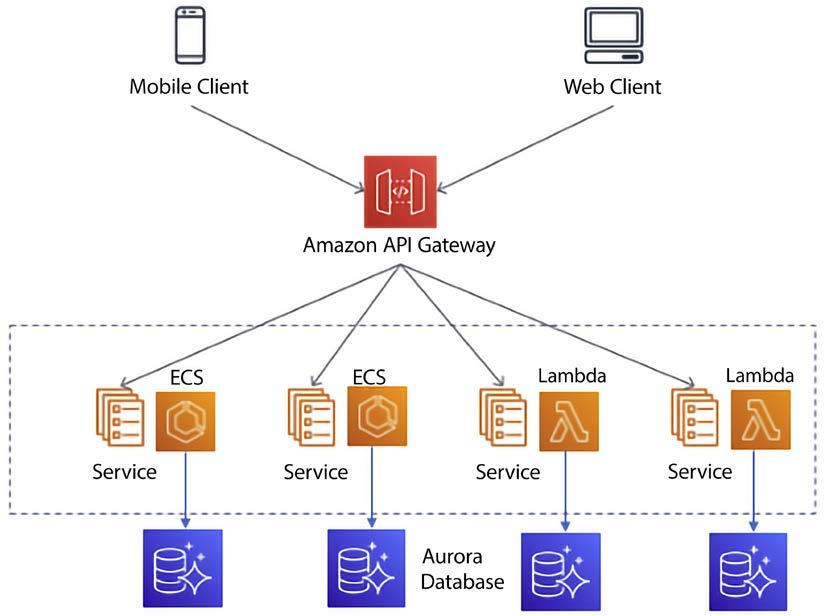

**Figure: Microservice architectures in AWS.** The source places microservices in an AWS implementation context.

**How to read it:** Identify independently deployable services, communication paths, and service-owned data.

**Why it matters:** The microservice boundary should align with business capability and operational ownership.

**How to apply it:** Before creating a service, define its domain, API contract, event contract, data ownership, SLO, alerts, and deployment pipeline.

**Limitations:** Architecture diagrams rarely show operational complexity such as retries, dead-letter queues, schema evolution, and incident ownership.

### Data Lakes, Lakehouse, and Data Mesh

- **Explanation:** A data lake stores large volumes of raw and processed data, often in zones. A lakehouse adds warehouse-like reliability and query patterns over lake storage. Data mesh decentralizes data ownership around domains.
- **Problem solved:** It supports enterprise-scale analytics where many producers and consumers need governed access to diverse data.
- **How it works:** S3 often serves as the storage substrate. Lake Formation, Glue Data Catalog, IAM, encryption, ingestion services, processing engines, and analytics tools provide governance, metadata, security, processing, and consumption.
- **Why it matters:** Without cataloging, quality, lineage, and access control, a data lake becomes a data swamp.
- **When to use:** Use a governed data lake when multiple datasets need durable central storage and flexible processing. Use data mesh when domain teams are ready to own data products and governance is mature enough to federate.
- **When not to use:** Do not implement data mesh as a tooling project without domain ownership and governance. Do not use a lake for low-latency transaction serving.
- **Tradeoffs:** Central lakes simplify platform control but can bottleneck ownership. Data mesh improves domain autonomy but requires strong standards and governance.
- **Common mistakes:** No zone strategy; no catalog; no quality checks; no cost monitoring; no owner per dataset; permissive access; unclear retention.
- **Production example:** Raw, cleaned, curated, and consumption zones separate ingestion from trusted analytics. Domain teams publish governed datasets with catalog entries and quality metrics.
- **Questions to ask:** Who owns each dataset? What zone is it in? What quality checks run? Who can access it? What cost and usage metrics are tracked?
- **Source reference:** Chapter 15, pp. 586-615.

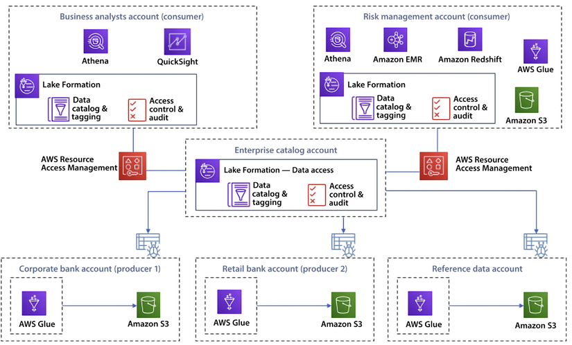

**Figure: Data mesh architecture in AWS.** The source presents data mesh as an architecture spanning multiple data domains/accounts.

**How to read it:** Look for distributed ownership plus shared governance and discovery.

**Why it matters:** Enterprise data scale is often organizational, not just technical.

**How to apply it:** Establish data product standards, cataloging, access patterns, quality metrics, and account boundaries before decentralizing ownership.

**Limitations:** The figure is a high-level architecture. Data contracts, lineage, stewardship, and enforcement processes still need design.

## 4. Chapter-by-Chapter Knowledge Extraction

### Chapter 1: Understanding AWS Principles and Key Characteristics, pp. 42-67

The main lesson is that AWS popularity comes from more than hosted servers. The book ties AWS adoption to elasticity, scalability, security, availability, rapid hardware evolution, and reduced infrastructure administration. The practical takeaway is to evaluate AWS as an operating model and service ecosystem, not merely a remote data center.

Important details include public versus private cloud distinctions, cloud terminology, the scale of AWS service growth, and how cloud elasticity changes capacity planning. The chapter also introduces security and availability as platform-level reasons for adoption, but the architect must still design workload-level controls.

Design decisions taught: when to use cloud elasticity instead of fixed capacity, how to explain cloud value to business stakeholders, and why terminology alignment matters across providers.

Production risks: assuming provider scale automatically solves workload scaling; ignoring security configuration; failing to budget for growth; not training teams on shared cloud vocabulary.

Self-check questions: What workload property benefits from elasticity? Which parts of availability are AWS-provided and which are workload-designed? What cloud terms must the team standardize?

### Chapter 2: Understanding the AWS Well-Architected Framework and Getting Certified, pp. 68-103

The main lesson is that architecture quality is multi-dimensional. Security, reliability, performance efficiency, cost optimization, operational excellence, and sustainability must be evaluated together.

Important details include AWS Well-Architected Lenses and the use of certifications to build credibility. For engineering application, the certification material is secondary; the framework is the durable tool.

Design decisions taught: how to structure architecture reviews; how to map risk findings to remediation work; how to avoid optimizing one pillar while damaging another.

Production risks: treating cost as a later finance issue; leaving operations out of design; using a lens without workload-specific evidence.

Self-check questions: Which pillar has the highest unresolved risk? What evidence supports each review answer? What accepted risk is documented?

### Chapter 3: Leveraging the Cloud for Digital Transformation, pp. 104-145

The chapter teaches that cloud transformation combines technology model selection, migration strategy, organizational change, and resilience design. It covers IaaS, PaaS, SaaS, the 7 Rs, AWS CAF, active/passive and active/active patterns, sharding, and chaos engineering.

Design decisions taught: choose service model by control and responsibility; choose migration strategy by workload; select availability architecture by business criticality; use chaos engineering to validate assumptions.

Production risks: going too fast without leadership and role clarity; going too slow and losing momentum; selecting active/active without data consistency strategy; using sharding before understanding access patterns.

Self-check questions: Which workloads should be retired? What migration waves minimize dependency risk? What failure modes will chaos experiments test?

### Chapter 4: Networking in AWS, pp. 146-181

The chapter teaches that AWS networking is the connective tissue for security, availability, hybrid integration, and performance. It covers global infrastructure, VPCs, Transit Gateway, PrivateLink, Route 53, CloudFront, Global Accelerator, Wavelength, VPN, Direct Connect, Cloud WAN, Network Firewall, security groups, and NACLs.

Design decisions taught: select Region/AZ topology; choose VPC connectivity pattern; decide between public edge delivery and private connectivity; layer network controls with identity and application controls.

Production risks: overlapping CIDR ranges, unmanaged route propagation, single egress chokepoints, broad security groups, public access where PrivateLink/endpoints would work, no flow visibility.

Self-check questions: Which traffic paths cross trust boundaries? What route change could create an outage? How is DNS handled? Where are logs captured?

### Chapter 5: Storage in AWS, pp. 182-219

The chapter teaches storage fit: EBS for block, EFS/FSx for file, S3 for object, Glacier classes for archive, Storage Gateway for hybrid, and AWS Backup for centralized backup.

Design decisions taught: match storage type to access semantics; choose EBS volume by IOPS/throughput/cost; choose S3 storage class by retrieval pattern; secure S3 with block public access, least-privilege policies, encryption, logging, access analysis, Config, Macie, VPC endpoints, and replication.

Production risks: public S3 exposure, wildcard policies, untested restore, wrong archival class, no lifecycle policy, missing object immutability where required.

Self-check questions: What is the access pattern? What is the recovery target? What data is regulated? What lifecycle transition is justified?

### Chapter 6: Harnessing the Power of Cloud Computing, pp. 220-261

The chapter teaches compute selection across EC2, Graviton, instance families, pricing models, Compute Optimizer, AMIs, EC2 best practices, load balancers, Lambda, Fargate, HPC, Outposts, and VMware Cloud on AWS.

Design decisions taught: choose instance family by workload profile; choose load balancer by layer and protocol; choose serverless/container/VM by control and operational burden; use hybrid compute only for real locality or migration needs.

Production risks: wrong instance family, underused reserved capacity, no autoscaling, no AMI hygiene, no tagging, wrong ELB type, no backup/snapshot strategy.

Self-check questions: What is CPU/memory/network/storage bottleneck? What pricing model fits demand certainty? What compute failures are isolated?

### Chapter 7: Selecting the Right Database Service, pp. 262-309

The chapter teaches purpose-built database selection. It frames ACID versus BASE, OLTP versus OLAP, and AWS database families.

Design decisions taught: choose data store by data model and access pattern; use managed databases to reduce operations; use migration tools and approaches intentionally; treat cache and database as separate correctness components.

Production risks: schema or key design that cannot scale, cache inconsistency, wrong consistency model, no backup testing, treating analytics workloads as transaction workloads.

Self-check questions: What queries must be supported? What consistency guarantees are required? What is the migration validation plan?

### Chapter 8: Best Practices for Application Security, Identity, and Compliance, pp. 310-351

The chapter teaches that shared responsibility, IAM, organizations, identity federation, detection, infrastructure protection, data protection, and compliance must be designed as a system.

Design decisions taught: use roles and least privilege; structure accounts/OUs; select preventive and detective controls; protect secrets and keys; collect compliance evidence.

Production risks: broad IAM, no MFA, no central account governance, no GuardDuty/Security Hub response path, unmanaged secrets, missing encryption, no access reviews.

Self-check questions: Who can access production? How are permissions reviewed? What events trigger security response?

### Chapter 9: Driving Efficiency with CloudOps, pp. 352-393

The chapter teaches CloudOps as governance, configuration, compliance, provisioning, observability, centralized operations, and finance management.

Design decisions taught: automate provisioning; use audit and config tools; centralize visibility; manage cloud finance with planning, controls, allocation, and optimization.

Production risks: console drift, no IaC, no cost attribution, missing logs, no incident ownership, manual patching, unmonitored dependencies.

Self-check questions: What is provisioned by code? What configuration drift is detected? Which cost signals are owned by teams?

### Chapter 10: Big Data and Streaming Data Processing in AWS, pp. 394-433

The chapter teaches batch and streaming data processing with EMR, Glue, Kinesis, MSK, and Glue Schema Registry.

Design decisions taught: EMR versus Glue; Kinesis versus MSK; schema registry for streaming; partitioning and file layout for efficient processing.

Production risks: small files, poor partitioning, memory issues in Spark/YARN, ungoverned schemas, wrong stream retention, no replay plan.

Self-check questions: Is the workload batch or streaming? What controls schema evolution? What partition keys control throughput?

### Chapter 11: Data Warehouses, Data Queries, and Visualization in AWS, pp. 434-467

The chapter teaches warehouse and lake query architecture with Redshift, Athena, Redshift Spectrum, and QuickSight.

Design decisions taught: use Redshift for managed warehouse workloads; use Athena for serverless S3 queries; optimize partitions, bucketing, compression, file size, columnar formats, predicate pushdown, column selection, joins, grouping, and approximate functions.

Production risks: scanning too much data, bad file formats, no workgroup controls, wrong distribution/sort strategy, dashboarding untrusted data.

Self-check questions: What query pattern drives storage layout? What query cost guardrails exist? Which dataset is trusted for dashboard decisions?

### Chapter 12: Machine Learning, IoT, and Blockchain in AWS, pp. 468-503

The chapter teaches how AWS exposes emerging technologies as managed service families. It covers ML infrastructure and frameworks, SageMaker pipeline stages, AI services, MLOps, IoT Core and related services, blockchain, Braket, and generative AI.

Design decisions taught: choose managed AI services versus custom ML; design ML lifecycle stages; use IoT services for device connectivity and management; treat emerging tech as use-case driven.

Production risks: models without monitoring, ungoverned training data, device identity gaps, insecure IoT ingestion, technology selection driven by novelty.

Self-check questions: Is ML necessary or would rules/statistics work? How is model drift monitored? How are device credentials rotated?

### Chapter 13: Containers in AWS, pp. 504-545

The chapter teaches containers, VMs, Docker, ECS, Kubernetes, EKS, Fargate, ROSA, and AWS container service selection.

Design decisions taught: containers versus VMs; ECS versus EKS; Fargate versus EC2 capacity; Kubernetes when ecosystem portability or control is needed.

Production risks: cluster sprawl, no image scanning, bad task/pod networking, no resource limits, no rollout strategy, unowned platform layer.

Self-check questions: What needs orchestration? What runtime responsibility remains with the team? Which service owns node patching?

### Chapter 14: Microservice Architectures in AWS, pp. 546-585

The chapter teaches microservices, layered architecture, event-driven architecture, pub/sub, event streaming, asynchronous communication, DDD, and microservice best practices.

Design decisions taught: validate microservices fit before splitting; identify bounded contexts; use asynchronous communication where coupling needs to be reduced; separate frontends/backends; own data per service.

Production risks: distributed monolith, shared database, no tracing, event loss, duplicate events, no idempotency, excessive technology diversity.

Self-check questions: What bounded context owns this data? What happens when a consumer fails? How are event contracts versioned?

### Chapter 15: Data Lake Patterns, pp. 586-615

The chapter teaches data lake purpose, components, zones, Lake Formation, governance, cataloging, quality, security, ingestion, scalability, cost optimization, monitoring, flexible processing, metrics, lakehouse, and data mesh.

Design decisions taught: separate raw and curated zones; govern datasets; choose lake, lakehouse, or mesh based on organization and data needs.

Production risks: data swamp, unknown ownership, no quality checks, uncontrolled access, expensive scans, no lifecycle policy.

Self-check questions: What zone is this dataset in? Who owns quality? What catalog entry tells users how to use it?

### Chapter 16: Hands-On Guide to Building an App in AWS, pp. 616-661

The chapter applies prior concepts to AWSome Store, an e-commerce architecture using DDD, serverless web application patterns, IAM, S3, DynamoDB, Lambda, API Gateway, EventBridge, SQS, Cognito-style authentication/authorization, CLI, CloudFormation, DevOps, logging, monitoring, and Well-Architected review.

Design decisions taught: start from bounded contexts; choose a serverless/cloud-native baseline; provision with infrastructure as code; wire asynchronous events; add observability and review with Well-Architected.

Production risks: demo architecture promoted to production without threat modeling, quotas, error handling, deployment safety, data protection, and incident runbooks.

Self-check questions: What bounded contexts exist? What are the event flows? What operational controls are missing before production?

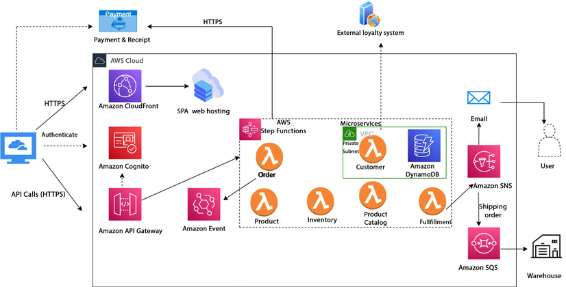

**Figure: AWSome Store cloud-native architecture.** The source uses this architecture to combine services from the book into a concrete application.

**How to read it:** Trace user entry, authentication, API handling, event flow, business logic, and data persistence.

**Why it matters:** It shows architecture as service composition around a domain, not isolated service tutorials.

**How to apply it:** Use this as a starting pattern for serverless web systems, then add production-specific controls: quotas, retries, DLQs, tracing, access reviews, backup, threat model, and cost budgets.

**Limitations:** A hands-on guide is not a complete production reference architecture. Production readiness requires extra evidence.

## 5. Architecture Decision Guide

| Decision | Choose Option A When | Choose Option B When | Key Tradeoffs | Failure Risks | Questions To Ask |
|---|---|---|---|---|---|
| Rehost vs refactor | Rehost when speed, compatibility, and low change risk dominate. | Refactor when architecture debt blocks business goals or cloud-native scale/resilience is needed. | Rehost is faster but preserves debt; refactor is higher value but slower. | Migrated fragility, missed modernization value, failed cutover. | What is the business driver? What dependencies exist? What can be retired? |
| Public endpoint vs PrivateLink/VPC endpoint | Public endpoint is acceptable for internet-facing services with proper edge security. | Private connectivity is needed for internal services, compliance, or reduced exposure. | Public is simpler; private reduces exposure but adds endpoint and DNS planning. | Data exposure, broken private DNS, broad peering. | Which flows must never traverse public internet? |
| VPC peering vs Transit Gateway | Peering fits few VPCs with simple connectivity. | TGW fits many VPCs/accounts and centralized routing. | Peering is simple; TGW centralizes but costs and becomes shared dependency. | Route sprawl, transitive routing assumptions, blast radius. | How many VPCs/accounts/regions will connect? |
| EBS vs EFS/FSx vs S3 | EBS for block workloads attached to compute. | EFS/FSx for shared file systems; S3 for object storage. | Each has different latency, semantics, sharing, lifecycle, and cost. | Wrong semantics, poor performance, impossible sharing, cost spikes. | Is access block, file, or object? Who shares it? |
| EC2 vs Lambda vs Fargate | EC2 when OS control or persistent compute is required. | Lambda/Fargate when managed execution and elasticity fit. | Control versus operations burden. | Runtime limits, cold starts, idle fleets, patch gaps. | What control do we need? What scales independently? |
| ALB vs NLB vs CLB | ALB for HTTP/HTTPS layer 7 routing. | NLB for layer 4 high-performance TCP/UDP/TLS use cases. CLB mainly legacy. | Feature richness versus protocol/performance needs. | Wrong protocol handling, missing health checks, migration debt. | What layer and protocol are being balanced? |
| RDS/Aurora vs DynamoDB | RDS/Aurora for relational transactions and SQL access. | DynamoDB for key-value/document access at scale with known access patterns. | Query flexibility versus horizontal scale and serverless operations. | Bad key design, relational mismatch, transaction complexity. | What are the exact access patterns and consistency needs? |
| Redis/Memcached cache vs no cache | Cache when repeated reads and latency reduction matter and staleness is acceptable. | Avoid cache when correctness cannot tolerate stale/inconsistent data or complexity is not justified. | Lower latency versus invalidation complexity. | Stale reads, cache stampede, source-of-truth confusion. | What is TTL? What invalidates data? What if cache fails? |
| Glue vs EMR | Glue when serverless ETL/catalog integration fits. | EMR when framework control, custom tuning, or cluster behavior is needed. | Simplicity versus control. | Under-tuned jobs, memory errors, operational overhead. | What data volume, framework control, and schedule are required? |
| Kinesis vs MSK | Kinesis when AWS-native streaming is sufficient. | MSK when Kafka compatibility/ecosystem is required. | Managed AWS integration versus Kafka portability/control. | Partition throughput limits, schema drift, operational complexity. | Who operates consumers? Is Kafka API required? |
| Athena vs Redshift | Athena for serverless SQL over S3 and ad hoc lake queries. | Redshift for curated warehouse workloads and managed performance. | Pay-per-scan flexibility versus warehouse optimization. | Excessive scans, bad file layout, wrong concurrency model. | What query latency, concurrency, and data layout are expected? |
| ECS vs EKS | ECS when AWS-native orchestration simplicity is sufficient. | EKS when Kubernetes ecosystem, portability, or APIs are required. | Lower operational complexity versus Kubernetes control. | Overbuilt clusters, platform skill gaps, portability assumptions. | Does the team truly need Kubernetes? |
| Microservices vs modular monolith | Microservices when independent teams/domains need independent deployment and scale. | Modular monolith when domain is small or team cannot absorb distributed complexity. | Autonomy versus distributed-system cost. | Distributed monolith, shared data, poor observability. | What boundary, owner, and data store justify the service? |
| Data lake vs lakehouse vs data mesh | Data lake for centralized flexible storage and processing. | Lakehouse/mesh when transactional analytics or domain-owned data products are needed. | Central governance versus domain autonomy. | Data swamp, fragmented governance, unclear ownership. | Who owns data quality and discoverability? |

## 6. System Design Playbooks

### Playbook: Production AWS Web Application

- **Use case:** Customer-facing web application with APIs, static assets, authentication, business logic, and persistent data.
- **Requirements to clarify first:** Traffic profile, latency target, data sensitivity, auth model, RPO/RTO, regional requirements, deployment frequency, compliance, cost ceiling.
- **Baseline architecture:** Route 53 DNS, CloudFront edge distribution, WAF for web protection, ALB/API Gateway entry, compute on ECS/Fargate/Lambda/EC2 as needed, RDS/Aurora or DynamoDB by data pattern, S3 for objects/static assets, IAM roles, KMS encryption, CloudWatch/X-Ray logs and traces.
- **Scaling path:** Start single region multi-AZ. Add autoscaling, cache, read replicas/global tables, event-driven offload, multi-region DR only when requirements justify it.
- **Data model considerations:** Identify transaction boundaries, access patterns, consistency needs, backup/restore, lifecycle, and analytics export.
- **API/integration considerations:** Use stable API contracts, authentication/authorization, rate limits, idempotency, request tracing, and error semantics.
- **Reliability strategy:** Multi-AZ stateless compute, health checks, graceful degradation, backups, restore tests, DLQs for async work, rollback deployments.
- **Security strategy:** Least privilege roles, no public data stores, KMS, Secrets Manager, WAF/Shield where appropriate, CloudTrail, GuardDuty/Security Hub.
- **Observability strategy:** Golden signals, structured logs, traces, service dashboards, alarms with owners, synthetic checks.
- **Cost considerations:** Tags, budgets, autoscaling, storage lifecycle, rightsizing, reserved/savings plans where demand is steady.
- **Operational runbook notes:** Include deploy/rollback, incident triage, dependency failure, database restore, key rotation, and cost anomaly response.
- **Common failure modes:** Throttling, connection pool exhaustion, cache stampede, IAM denial, public endpoint exposure, missing DLQ, deployment failure.
- **Evolution path:** MVP serverless or simple container deployment -> IaC and observability -> multi-AZ hardening -> async workflows -> advanced DR/multi-region if required.
- **Source grounding:** Chapters 4-9, 13-16.

### Playbook: Governed Data Lake and Analytics Platform

- **Use case:** Enterprise data ingestion, cataloging, transformation, query, dashboards, and cross-domain analytics.
- **Requirements to clarify first:** Data producers/consumers, freshness, schema evolution, quality, lineage, classification, retention, query latency, compliance, cost allocation.
- **Baseline architecture:** S3 zones, Glue Data Catalog and crawlers, Lake Formation governance, Glue/EMR processing, Kinesis/MSK for streaming if required, Athena for ad hoc queries, Redshift for warehouse workloads, QuickSight for visualization.
- **Scaling path:** Start with raw/curated zones and cataloging. Add partitioning, columnar formats, compression, schema registry, quality gates, domain data products, and lakehouse/mesh patterns as maturity grows.
- **Data model considerations:** Partition by query and ingestion patterns, use columnar formats for analytics, avoid many small files, document schema ownership.
- **Reliability strategy:** Idempotent ingestion, replay paths, checkpointing, data quality validation, lifecycle policies, backup for metadata and critical datasets.
- **Security strategy:** Classify data, least privilege access, encryption, audit logs, row/column controls where supported, governed sharing.
- **Observability strategy:** Pipeline success/failure, freshness, volume, schema changes, data quality, query cost, dashboard usage.
- **Cost considerations:** Avoid full scans, use partitions and compression, monitor Athena/Redshift usage, lifecycle cold data.
- **Common failure modes:** Data swamp, schema drift, expensive queries, stale dashboards, orphaned datasets, unowned pipelines.
- **Evolution path:** Central lake -> governed lake -> curated warehouse/lakehouse -> data mesh if domain teams can own products.
- **Source grounding:** Chapters 10-11 and 15.

### Playbook: Event-Driven Microservices on AWS

- **Use case:** Domain services that need independent deployment, asynchronous workflows, and decoupled scaling.
- **Requirements to clarify first:** Bounded contexts, event types, ordering needs, idempotency, consistency model, retry behavior, failure handling, data ownership.
- **Baseline architecture:** API Gateway/ALB for synchronous APIs; EventBridge/SNS/SQS/Kinesis/MSK for asynchronous communication; Lambda/ECS/EKS for compute; service-owned databases; DLQs; CloudWatch/X-Ray tracing.
- **Scaling path:** Start with a small number of bounded services. Add event contracts, schema registry, replay mechanisms, circuit breakers, and domain ownership.
- **Data model considerations:** Each service owns its data. Cross-service workflows use events or APIs, not shared tables.
- **Reliability strategy:** Idempotent consumers, DLQs, retry policies, poison message handling, event replay, correlation IDs.
- **Security strategy:** Service roles, event bus permissions, API authorization, encryption, secrets management.
- **Observability strategy:** End-to-end trace correlation, event lag, queue depth, failure rate, DLQ alarms, per-service SLOs.
- **Cost considerations:** Event volume, retry storms, idle container capacity, stream retention, logging volume.
- **Common failure modes:** Duplicate events, out-of-order processing, unversioned event schemas, synchronous dependency chains, missing owner for failed messages.
- **Evolution path:** Modular monolith -> few bounded services -> async workflows -> platform-level event governance.
- **Source grounding:** Chapters 13-14 and 16.

## 7. Applying This Knowledge To A Current System

Use this assessment framework during an AWS architecture review.

| Review Area | What To Inspect | Why It Matters | What Good Looks Like | Warning Signs | Improvement Options |
|---|---|---|---|---|---|
| Requirements | Business goals, NFRs, RPO/RTO, scale, compliance, data sensitivity | Service choices are meaningless without constraints | Documented requirements tied to architecture decisions | "We chose it because it is AWS-native" | Write an architecture decision record per major choice |
| Account and identity | Organizations, OUs, IAM roles, users, policies, MFA, federation | Identity is the control plane for cloud risk | Role-based access, least privilege, central identity, break-glass process | Long-lived users, wildcard policies, shared credentials | Adopt IAM Identity Center, review policies, remove broad access |
| Network | VPCs, CIDRs, route tables, subnets, ingress/egress, endpoints, flow logs | Reachability defines blast radius | Clear public/private boundaries, logged flows, no overlapping CIDRs | Public workloads by accident, unmanaged routes | Redesign subnets, add endpoints, centralize routing where justified |
| Data stores | Access patterns, consistency, backup, restore, encryption, lifecycle | Data choices are hard to reverse | Data model matches workload and recovery is tested | One database for all workloads, no restore tests | Create access-pattern matrix and backup validation |
| Compute | Runtime model, autoscaling, instance families, serverless limits, images | Compute drives reliability and cost | Right-sized, patched, autoscaled, deployable via pipeline | Snowflake servers, idle fleets, no rollback | Use Compute Optimizer, IaC, immutable images, autoscaling |
| Security monitoring | CloudTrail, GuardDuty, Security Hub, Config, WAF, Inspector, Macie | Detection reduces incident dwell time | Alerts have owners and runbooks | Logs enabled but never reviewed | Define triage process and incident response paths |
| Observability | Metrics, logs, traces, dashboards, alarms, SLOs | You cannot operate what you cannot see | Service-level dashboards and actionable alarms | Dashboard-only monitoring, noisy alarms | Add golden signals, correlation IDs, synthetic checks |
| Cost | Tags, budgets, Cost Explorer, storage lifecycle, commitments | Cost is an architecture property | Spend allocated to owners with budgets and anomaly response | Untagged resources, surprise bills | Enforce tags, add budgets, lifecycle data, rightsizing |
| Deployment | IaC, CI/CD, rollback, change control, drift detection | Manual change creates unknown state | Repeatable deployments and drift alerts | Console-only changes | Move to CDK/CloudFormation/Terraform, Service Catalog where useful |
| Resilience | Multi-AZ, backups, DR, chaos tests, dependency failure modes | Availability claims need evidence | Tested failover and restore procedures | Single AZ, no game days | Define RTO/RPO, run restore/failover exercises |

## 8. Applying This Knowledge To A Future System

When designing a new AWS system, follow this sequence.

1. **Discover requirements before services.** Capture users, business goals, NFRs, data sensitivity, scale, latency, RPO/RTO, budget, compliance, operations ownership, and launch timeline.
2. **Define domain boundaries.** Use DDD-style bounded contexts when the system has multiple business capabilities. Prefer a modular monolith until independent deployment and ownership are justified. `[Inference]`
3. **Choose topology.** Select Region, AZ strategy, account structure, VPC boundaries, public/private ingress, edge routing, and hybrid connectivity.
4. **Select data stores.** Write access patterns, consistency needs, transaction boundaries, retention, backup, restore, and analytics needs before choosing databases.
5. **Select compute.** Choose EC2, Lambda, Fargate, ECS, or EKS by control, runtime, scaling unit, team skill, and operations model.
6. **Design integration.** Use synchronous APIs for request/response boundaries and asynchronous events/queues/streams where decoupling, buffering, or fanout is required.
7. **Build security baseline.** Include account guardrails, IAM roles, least privilege, encryption, secrets, network controls, CloudTrail, GuardDuty/Security Hub, WAF where needed.
8. **Design observability.** Define SLOs, logs, metrics, traces, dashboards, alerts, and incident runbooks before launch.
9. **Design deployment and operations.** Use IaC, CI/CD, rollback, drift detection, patching, backups, restore tests, and ownership documents.
10. **Model cost.** Estimate steady-state and peak cost, data transfer, storage lifecycle, query scans, logs, retries, and commitments.
11. **Run Well-Architected review.** Treat findings as design work, not paperwork.
12. **Plan evolution.** Start with the smallest architecture that preserves future paths: multi-AZ baseline, clear boundaries, IaC, observability, and explicit decision records.

## 9. Technology Mapping

| Concept Or Need | Technology Option | When To Use | Watch Outs | Alternatives |
|---|---|---|---|---|
| Global placement | Regions, AZs, Local Zones | Region/AZ resilience or local latency | Data residency, service availability | Wavelength, Outposts |
| Isolated cloud networking | VPC | Almost all AWS workloads | CIDR planning, routing, subnet exposure | Shared VPC patterns `[Inference]` |
| Many-VPC routing | Transit Gateway | Hub-and-spoke or many account networks | Cost, route blast radius | VPC peering, Cloud WAN |
| Private service exposure | PrivateLink | Provider/consumer private connectivity | DNS and endpoint policy complexity | VPC peering, TGW |
| DNS | Route 53 | Domain and routing policy management | Health checks, split-horizon needs | External DNS |
| CDN/edge | CloudFront | Cache and secure HTTP content globally | Cache invalidation, origin protection | Global Accelerator for non-cache acceleration |
| Block storage | EBS | EC2-attached low-latency storage | AZ scope, snapshots, volume type | Instance store, FSx/EFS |
| Shared file storage | EFS | NFS-style shared access | Throughput/cost mode | FSx families |
| Object storage | S3 | Durable object storage and data lake foundation | Public access, lifecycle, request cost | EFS/FSx for file semantics |
| Backup governance | AWS Backup | Central backup management | Restore testing required | Service-native backups |
| Virtual machines | EC2 | Control over OS/runtime and persistent compute | Patching, scaling, AMI hygiene | Lambda, ECS/EKS/Fargate |
| Serverless functions | Lambda | Event-driven short-running workloads | Duration/runtime/concurrency limits | ECS/Fargate, EC2 |
| Serverless containers | Fargate | Containers without node management | Supported configurations and cost | ECS/EKS on EC2 |
| Relational database | RDS/Aurora | SQL, transactions, relational model | Scaling, schema, connection management | DynamoDB, DocumentDB |
| Key-value/document NoSQL | DynamoDB | Predictable key-based access at scale | Key design, hot partitions | RDS/Aurora, DocumentDB |
| Cache | ElastiCache | Low-latency repeated reads | Invalidation, failover | DAX, app cache |
| Identity | IAM, IAM Identity Center | Workforce and workload access | Least privilege, review, MFA | External IdP federation |
| Org governance | Organizations, Control Tower | Multi-account guardrails | Over-centralization | Manual account management |
| Threat detection | GuardDuty, Security Hub, Detective | Security findings and investigation | Triage process needed | Third-party SIEM |
| Audit/config | CloudTrail, Config, Audit Manager | Change history and compliance | Log retention and alerting | External compliance tools |
| IaC/provisioning | CloudFormation, CDK, Service Catalog, Proton | Repeatable infrastructure | Drift, ownership, module lifecycle | Terraform `[Inference]` |
| Monitoring/tracing | CloudWatch, X-Ray | Metrics, logs, alarms, traces | Noise, sampling, missing context | OpenTelemetry tooling `[Inference]` |
| ETL and catalog | Glue | Serverless ETL, crawlers, catalog | Job tuning, small files | EMR |
| Big data frameworks | EMR | Spark/Hadoop ecosystem control | Cluster tuning and ops | Glue |
| Streaming | Kinesis | AWS-native streams | Shards/throughput, retention | MSK |
| Kafka managed service | MSK | Kafka API/ecosystem compatibility | Kafka operational knowledge | Kinesis |
| Warehouse | Redshift | Analytical warehouse | Distribution/sort/workload management | Athena, Redshift Spectrum |
| Lake query | Athena | Serverless SQL over S3 | File formats, partitions, scan cost | Redshift Spectrum |
| ML lifecycle | SageMaker | Managed model build/train/deploy/monitor | Data/model governance | AI managed services, custom ML |
| Container orchestration | ECS | AWS-native container orchestration | AWS portability | EKS |
| Kubernetes | EKS | Kubernetes ecosystem and APIs | Cluster/platform complexity | ECS, ROSA |
| Event integration | EventBridge, SQS, pub/sub/streams | Decoupled microservice flows | Idempotency, DLQ, ordering | Direct API calls |
| Data governance | Lake Formation, Glue Catalog | Governed lake access and catalog | Ownership and standards | Custom governance stack |

## 10. Failure Modes And Troubleshooting Knowledge

| Symptom | Likely Cause | How To Investigate | Fix | Prevention |
|---|---|---|---|---|
| Application cannot reach dependency | Route table, security group, NACL, DNS, endpoint, or hybrid route issue | VPC route tables, flow logs, SG/NACL rules, DNS resolution, endpoint policies | Correct route/security/DNS policy | Document traffic matrix and test connectivity |
| Public data exposure | S3 bucket/access point/policy misconfiguration or broad IAM | S3 Block Public Access, Access Analyzer, CloudTrail, Config, bucket policies | Block public access, narrow policies, rotate exposed credentials | SCPs, Config rules, policy review |
| Database latency spike | Poor query/index, hot partition, connection exhaustion, cache miss, under-provisioned capacity | DB metrics, query logs, Performance Insights where available, application traces | Tune query/index, adjust capacity, add pooling/cache carefully | Load test and access-pattern design |
| Lambda throttling or slow workflow | Concurrency limits, downstream bottleneck, retry storm | CloudWatch metrics, logs, DLQ, X-Ray traces | Adjust concurrency, backoff, reserved concurrency, DLQ handling | Capacity planning, idempotency, alarms |
| Queue depth increasing | Consumer failure, insufficient concurrency, poison messages, downstream outage | SQS/Kinesis/MSK metrics, consumer logs, DLQ, traces | Scale consumers, isolate poison messages, fix downstream | DLQs, replay runbook, alert on age/depth |
| Athena/analytics costs spike | Full scans, poor partitioning, row formats, no workgroup limits | Query history, scanned bytes, S3 layout, workgroup settings | Partition, compress, convert to columnar, limit queries | Data layout standards and budgets |
| Redshift performance degrades | Wrong distribution/sort, concurrency, vacuum/analyze needs, workload changes | Redshift metrics/query plans, workload management | Tune schema/workload, scale, optimize queries | Review workload and data model periodically |
| Container deployment unstable | Bad health checks, resource limits, image issue, cluster capacity | ECS/EKS events, logs, health check status, CPU/memory | Fix image/config, resources, rollout strategy | CI tests, canary/blue-green deployments |
| Security findings ignored | No triage owner or runbook | Security Hub/GuardDuty queues, ticketing, escalation path | Assign owners and response SLAs | Security operations process |
| Cost anomaly | Idle resources, data transfer, logging volume, query scans, overprovisioned compute | Cost Explorer, Budgets, tags, CUR where available | Rightsize, lifecycle, reduce scans/logs, commitments | Cost allocation, budgets, review cadence |
| Restore fails | Backups untested, missing permissions, wrong retention, corrupted process | Backup job history, restore logs, IAM, runbooks | Repair backup policy and restore process | Scheduled restore drills |
| Event-driven workflow duplicates work | Non-idempotent consumer or retry behavior | Event logs, correlation IDs, DLQ, consumer code | Add idempotency keys and dedupe | Event contract standards |

## 11. Production Readiness Checklist

- **Scalability:** Each tier has a scaling mechanism, scaling metric, limit review, and load-test evidence. Warning sign: manual scale-up is the only plan.
- **Reliability:** Multi-AZ design exists where required, health checks are meaningful, backups are tested, DR targets are documented, and dependency failures are modeled. Warning sign: RTO/RPO are unknown.
- **Maintainability:** Infrastructure is defined as code, service ownership is documented, deployments are repeatable, and architecture decisions are recorded. Warning sign: console changes are normal.
- **Observability:** Logs, metrics, traces, dashboards, and alerts map to SLOs and runbooks. Warning sign: alerts are noisy or ownerless.
- **Security:** IAM follows least privilege, MFA/federation are in place, secrets are managed, encryption is configured, public exposure is intentional, and security findings are triaged. Warning sign: wildcard permissions in production.
- **Performance:** The architecture has known bottlenecks, load tests, database query analysis, cache strategy, CDN/edge decisions, and capacity limits. Warning sign: performance is inferred from dev tests.
- **Cost management:** Tags, budgets, lifecycle policies, rightsizing, and query/data-transfer controls exist. Warning sign: no owner can explain monthly spend.
- **Data protection:** Data classification, retention, encryption, backup, restore, replication, and deletion policies are defined. Warning sign: restore was never tested.
- **Disaster recovery:** Failure modes, failover steps, restore procedures, and communication paths are exercised. Warning sign: DR exists only in a diagram.
- **Deployment safety:** CI/CD, rollback, canary/blue-green where appropriate, schema migration safety, and change audit exist. Warning sign: deploys require manual console edits.
- **Incident response:** On-call ownership, escalation, dashboards, runbooks, and post-incident review process exist. Warning sign: alerts go to a shared inbox.
- **Operational ownership:** Every service, dataset, queue, dashboard, key, and budget has an owner. Warning sign: platform and app teams both assume the other owns a failure path.

## 12. Knowledge Gaps And Further Study

- **Current AWS service behavior and limits:** The book is from 2023, and AWS changes rapidly. Verify current names, quotas, pricing, regional availability, service features, and recommended practices in official AWS documentation before implementation. `[Inference]`
- **Deep landing zone implementation:** The book introduces Organizations, Control Tower, IAM, VPCs, and governance, but a production landing zone needs detailed account vending, SCP strategy, network account design, centralized logging, and security operations. Study AWS Control Tower, AWS Organizations SCPs, AWS Landing Zone Accelerator, and multi-account strategy. `[Inference]`
- **Advanced IAM policy design:** IAM concepts are covered, but large organizations need permission boundaries, ABAC, policy validation, cross-account access patterns, and break-glass processes. Study IAM Access Analyzer, policy evaluation logic, and least-privilege automation. `[Inference]`
- **Detailed data modeling:** DynamoDB, relational databases, and data lakes are introduced, but production systems require deeper modeling exercises. Study DynamoDB single-table/access-pattern design, Aurora scaling, transaction isolation, schema evolution, and data lake table formats. `[Inference]`
- **Kubernetes operations:** EKS is covered, but operating Kubernetes requires cluster upgrades, admission control, network policies, GitOps, autoscaling, multi-tenancy, and security hardening. Study the Kubernetes documentation, EKS best practices guide, and container supply chain security. `[Inference]`
- **Resilience engineering practice:** Chaos engineering is introduced, but experiments require hypotheses, blast-radius control, steady-state metrics, and rollback. Study AWS Fault Injection Service and resilience testing patterns. `[Inference]`
- **Threat modeling and incident response:** The security chapter introduces many services, but teams still need threat modeling methods, incident playbooks, evidence handling, and tabletop exercises. Study STRIDE, AWS Security Incident Response Guide, and cloud forensics basics. `[Inference]`
- **FinOps maturity:** Cost optimization and CloudOps finance are covered, but mature cloud finance needs allocation, forecasting, anomaly detection, unit economics, and commitment management. Study the FinOps Foundation framework. `[Inference]`

## 13. Practice Exercises

1. **Migration portfolio exercise:** Pick five applications and assign one of the 7 Rs to each. A strong answer explains business value, dependency risk, data movement, cutover plan, and why other Rs were rejected.
2. **VPC review exercise:** Given a three-tier web app, design public/private subnets, routing, endpoints, ingress, egress, and flow logging. A strong answer identifies trust boundaries and failure paths.
3. **Storage selection exercise:** Choose storage for uploads, shared reports, VM boot volumes, archival logs, and hybrid file access. A strong answer maps each to access semantics, lifecycle, durability, cost, and restore behavior.
4. **Database access-pattern exercise:** Design data stores for catalog, cart, order, payment, audit, and analytics. A strong answer separates OLTP from analytics and explains consistency choices.
5. **IAM least-privilege exercise:** Replace a wildcard admin policy for an application with roles and scoped permissions. A strong answer covers assume-role trust, resource conditions, rotation, and audit.
6. **CloudOps exercise:** Turn a manually deployed workload into an operated service. A strong answer includes IaC, tagging, CloudTrail/Config, dashboards, alarms, budget, patching, backup, and runbooks.
7. **Streaming troubleshooting exercise:** A queue backlog grows and order events are duplicated. A strong answer investigates consumer errors, downstream dependencies, retry behavior, DLQ, idempotency, and correlation IDs.
8. **Athena cost exercise:** A daily query scans terabytes. A strong answer proposes partitioning, Parquet/ORC, compression, projection, predicate pushdown, workgroup limits, and cost monitoring.
9. **Container platform exercise:** Choose ECS, EKS, or Fargate for three services with different needs. A strong answer justifies operational complexity, portability, scaling, and team skill.
10. **Microservice boundary exercise:** Split an e-commerce system into bounded contexts. A strong answer defines data ownership, APIs, events, and failure isolation.
11. **Data lake governance exercise:** Design raw/clean/curated zones and access controls. A strong answer includes cataloging, quality, lineage, classification, retention, and cost controls.
12. **Well-Architected review exercise:** Review the AWSome Store-style architecture. A strong answer identifies risks across all six pillars and turns them into prioritized engineering tasks.

## 14. Integrated Visual Knowledge

Read visuals as design tools, not decorations. For each diagram, ask:

- What decision does this visual help make?
- What hidden operational risk does it reveal?
- What production evidence would prove this design works?
- What current AWS documentation must be checked before implementation?

#### Migration And Architecture Foundations

#### Cloud Service Classification

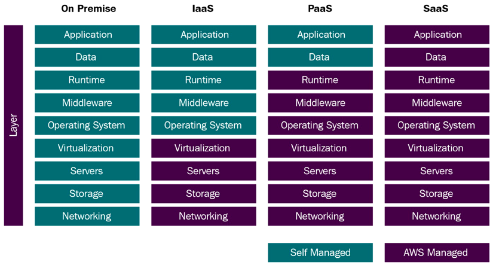

**Figure: Cloud service classification, source p. 105.** This visual separates IaaS, PaaS, and SaaS responsibilities.

**How to read it:** Move from IaaS to SaaS as a shift in responsibility from customer-managed infrastructure toward provider-managed application capability.

**Why it matters:** Service model selection changes what your team must design, patch, monitor, secure, and pay for.

**How to apply it:** During migration, classify each component by how much control it actually needs. Avoid using IaaS by default when a managed platform or SaaS capability meets the requirement.

**Limitations:** Service categories are not always clean. A real AWS workload often combines IaaS, PaaS-like managed services, and SaaS integrations.

#### 7 Rs Of Cloud Migration

**Figure: 7 Rs of AWS cloud migration, source p. 119.** This visual frames migration as a portfolio decision.

**How to read it:** Each R is a valid strategy: rehost, replatform, refactor, revise, repurchase, relocate, retain, and retire. The right answer depends on business value, risk, dependencies, and modernization payoff.

**Why it matters:** A migration program fails when every workload is pushed through the same pattern.

**How to apply it:** Add one migration strategy per application in the portfolio inventory, then attach owner, dependencies, data movement plan, test plan, and rollback path.

**Limitations:** The diagram does not score complexity or business value. Teams still need discovery and dependency mapping.

#### AWS Cloud Adoption Framework

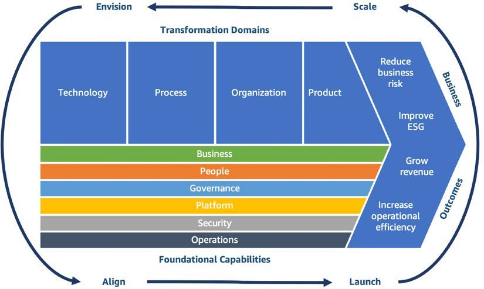

**Figure: AWS Cloud Adoption Framework, source p. 135.** This visual shows cloud adoption as organizational change, not only infrastructure migration.

**How to read it:** Treat the CAF perspectives as workstreams: business, people, governance, platform, security, and operations.

**Why it matters:** Technical migration without operating model, governance, and people readiness usually creates unmanaged cloud sprawl.

**How to apply it:** For each migration wave, assign work items across platform, security, governance, operations, finance, and application teams.

**Limitations:** CAF is a planning model. It does not replace detailed landing zone, workload, or service designs.

#### Active, Active/Passive, And Active/Active Patterns

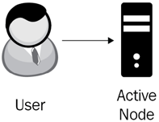

**Figure: Active architecture, source p. 138.** This visual introduces workload placement where active components serve traffic.

**How to read it:** Identify the active serving path and the failure domain it depends on.

**Why it matters:** "Active" does not automatically mean resilient. Resilience depends on independent failure domains, traffic routing, state handling, and recovery.

**How to apply it:** Pair this pattern with health checks, autoscaling, multi-AZ placement, and tested failover.

**Limitations:** The diagram is conceptual and does not show data consistency, DNS failover, or deployment safety.

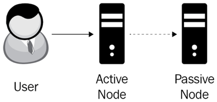

**Figure: Active/passive architecture, source p. 138.** This visual shows a standby path that can take over after failure.

**How to read it:** Look for what is warm, cold, or hot standby. The passive side is useful only if it can meet RTO/RPO.

**Why it matters:** Passive capacity reduces steady-state cost but increases recovery complexity.

**How to apply it:** Define failover trigger, promotion process, data replication, DNS/traffic switch, rollback path, and test cadence.

**Limitations:** The visual does not prove failover works. Restore and failover drills are required.

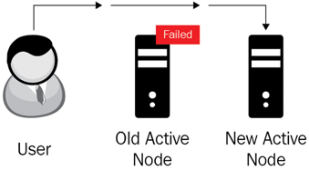

**Figure: Active/passive architecture with an active down node, source p. 139.** This visual illustrates failure handling.

**How to read it:** Track which component detects failure, which component receives traffic next, and whether state is current enough.

**Why it matters:** Failover is a runtime process, not a diagram property.

**How to apply it:** Write a runbook for detection, failover, validation, customer communication, and failback.

**Limitations:** Human approvals, DNS TTL, data lag, and partial failures are not represented.

#### Sharding Architecture

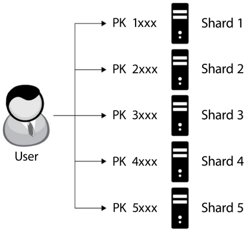

**Figure: Sharding architecture, source p. 141.** This visual shows data/workload split across shards.

**How to read it:** Focus on the shard key and request routing. The architecture succeeds or fails based on whether the key distributes load and supports queries.

**Why it matters:** Sharding can increase scale but makes queries, rebalancing, transactions, and operations harder.

**How to apply it:** Use sharding only after capacity, access-pattern, and operational requirements justify it. Define rebalancing and hot-shard mitigation before launch.

**Limitations:** The diagram does not show resharding, cross-shard queries, or consistency behavior.

#### Chaos Engineering Cycle

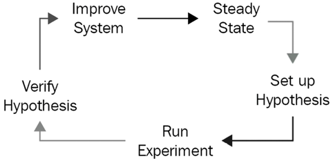

**Figure: Chaos engineering cycle, source p. 144.** This visual frames resilience testing as an iterative loop.

**How to read it:** Start with a steady-state hypothesis, inject controlled failure, observe behavior, learn, and improve.

**Why it matters:** Architecture assumptions about failover, retry, timeout, and recovery need evidence.

**How to apply it:** Run small, reversible experiments first: instance termination, dependency latency, queue backlog, AZ impairment simulation, or denied permission.

**Limitations:** Experiments require blast-radius controls, monitoring, rollback, and stakeholder communication.

#### Networking And Edge

#### VPC Private Subnet Flow

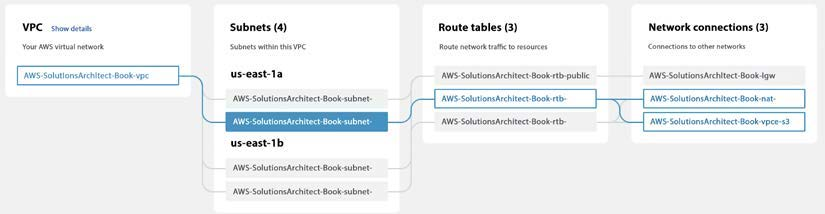

**Figure: AWS VPC configuration with a private subnet flow, source p. 153.** This visual explains how private resources reach external services through controlled network paths.

**How to read it:** Follow traffic from private subnet resources through route tables and egress components.

**Why it matters:** Private subnet design is central to reducing public attack surface.

**How to apply it:** Document every allowed ingress and egress path, then validate with VPC Flow Logs and reachability tests.

**Limitations:** It does not show IAM, endpoint policies, DNS, or centralized inspection.

#### VPC Network Architecture

**Figure: AWS VPC network architecture, source p. 156.** This visual assembles VPC subnets, routing, and gateway concepts.

**How to read it:** Identify public subnets, private subnets, route tables, internet access, and NAT/egress behavior.

**Why it matters:** Most workload exposure decisions are encoded in VPC topology.

**How to apply it:** Use this as a design-review checklist: CIDRs, subnet purpose, route tables, gateways, security groups, NACLs, endpoints, DNS, and logs.

**Limitations:** Multi-account and multi-region networking need additional patterns.

#### VPC Peering Versus Transit Gateway

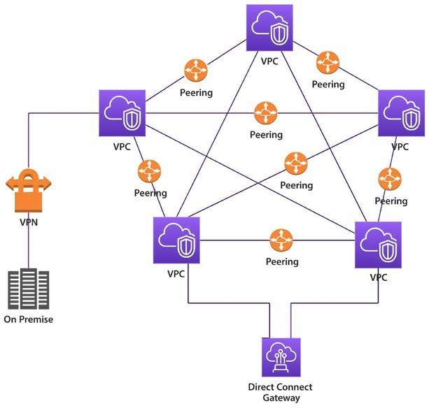

**Figure: VPC connectivity using VPC peering without TGW, source p. 158.** This visual shows point-to-point connectivity.

**How to read it:** Count the number of peering relationships needed as VPC count grows.

**Why it matters:** Peering is simple at small scale but becomes hard to govern across many accounts and VPCs.

**How to apply it:** Use peering for limited simple connectivity. Revisit the design when route management or account count grows.

**Limitations:** It does not show transitive routing limitations or route table complexity in detail.

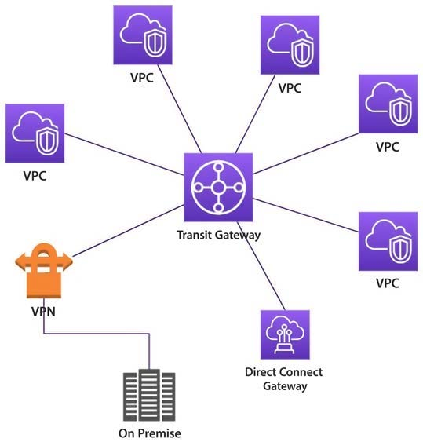

**Figure: VPC connectivity with TGW, source p. 159.** This visual centralizes connectivity through Transit Gateway.

**How to read it:** Treat TGW as a routing hub and shared dependency.

**Why it matters:** TGW reduces mesh complexity but concentrates routing control and failure impact.

**How to apply it:** Use TGW for multi-account, multi-VPC, and hybrid routing where central governance is worth the added cost and dependency.

**Limitations:** Route domains, segmentation, inspection VPCs, and cross-region design still need explicit design.

#### PrivateLink

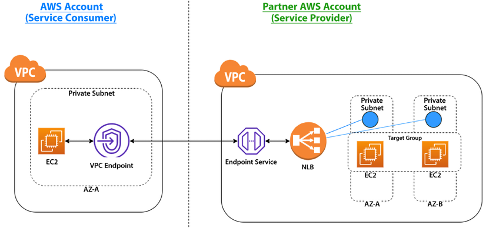

**Figure: PrivateLink between provider and consumer accounts, source p. 161.** This visual shows private service exposure without broad network peering.

**How to read it:** Separate the service provider from service consumer. The consumer reaches an endpoint, not the provider's whole network.

**Why it matters:** PrivateLink narrows blast radius compared with full network connectivity.

**How to apply it:** Use it for internal platform services, partner services, or shared services where consumers should not route to every provider subnet.

**Limitations:** DNS, endpoint policies, scaling, and provider lifecycle need design.

#### Route 53 Routing

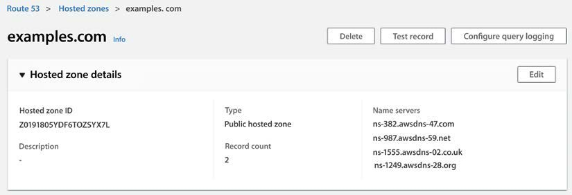

**Figure: Route 53 name server configuration, source p. 163.** This visual explains DNS delegation and resolution.

**How to read it:** Follow how a domain delegates authority and how records point clients to endpoints.

**Why it matters:** DNS is often the first dependency in availability, failover, and routing strategies.

**How to apply it:** Document hosted zones, TTLs, failover records, health checks, private hosted zones, and ownership.

**Limitations:** DNS propagation and client caching behavior can affect real failover time.

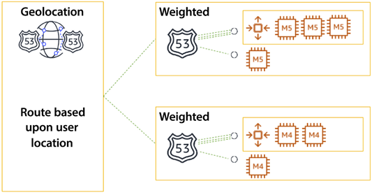

**Figure: Route 53 nested routing policy, source p. 164.** This visual shows combining routing policies.

**How to read it:** Work from client request through routing decision layers.

**Why it matters:** Nested routing enables sophisticated traffic steering, but also creates harder debugging.

**How to apply it:** Use only when a simple latency, weighted, failover, or geolocation policy cannot meet requirements. Keep a test matrix for expected routing outcomes.

**Limitations:** The diagram does not show health-check behavior or TTL impact.

#### CloudFront Request Flow

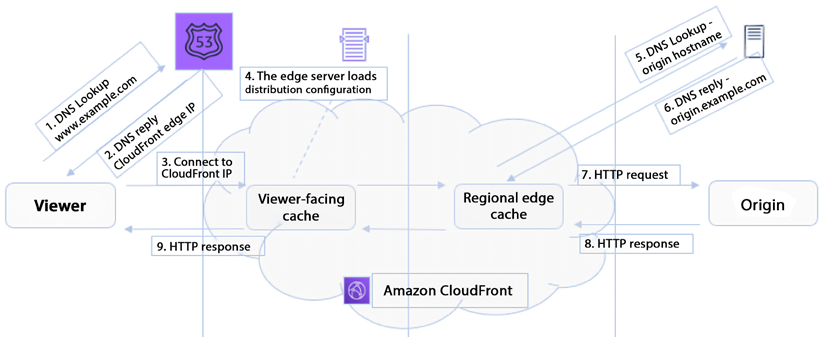

**Figure: HTTP request flow with Amazon CloudFront, source p. 166.** This is one of the most valuable edge diagrams in the book.

**How to read it:** Trace the request from user to edge location to origin and back. Distinguish cache hit behavior from cache miss behavior.

**Why it matters:** CloudFront changes latency, origin load, TLS termination, WAF integration, cache policy, invalidation, and failure behavior.

**How to apply it:** Define cache keys, origin request policies, TTLs, invalidation process, origin protection, signed URLs/cookies if needed, and error caching. Add CloudFront metrics and logs before production.

**Limitations:** The diagram does not show modern cache policy details, origin access control, field-level encryption, or all current CloudFront features. Verify current AWS behavior.

#### Hybrid Connectivity

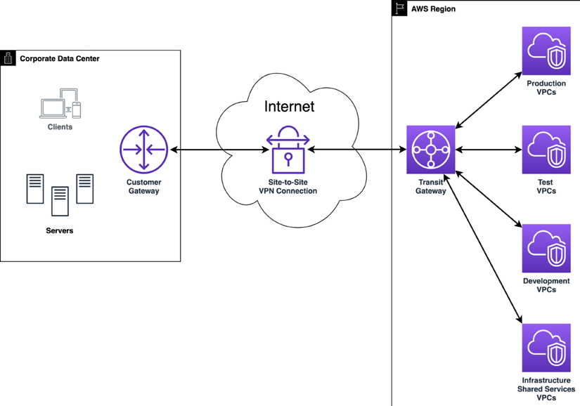

**Figure: AWS Site-to-Site VPN with TGW, source p. 170.** This visual combines encrypted VPN connectivity with centralized routing.

**How to read it:** Follow on-premises traffic through VPN tunnels into TGW and then to VPCs.

**Why it matters:** Hybrid connectivity often becomes a shared production dependency.

**How to apply it:** Plan redundancy, route propagation, failover, monitoring, and bandwidth requirements. Avoid treating VPN as a permanent high-throughput substitute for Direct Connect when requirements exceed it.

**Limitations:** It omits BGP detail, tunnel health alarms, and throughput constraints.

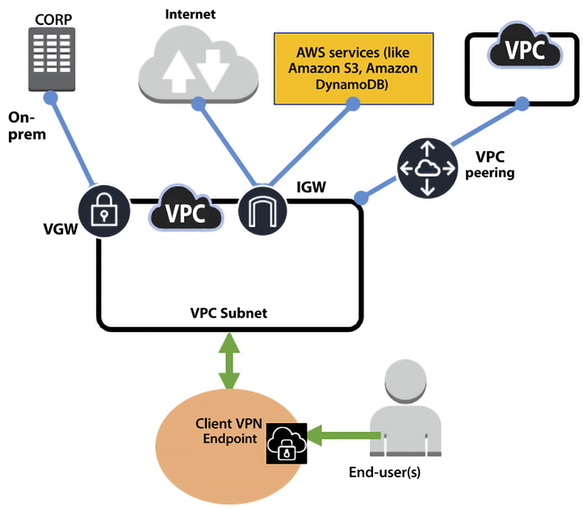

**Figure: AWS Client VPN, source p. 171.** This visual shows user-to-cloud private access.

**How to read it:** Distinguish workforce device access from site-to-site network access.

**Why it matters:** User VPN paths carry identity, endpoint security, split tunnel, and audit implications.

**How to apply it:** Integrate identity, device posture where required, logging, least-privilege network routes, and revocation processes.

**Limitations:** The diagram does not replace a zero-trust access design.

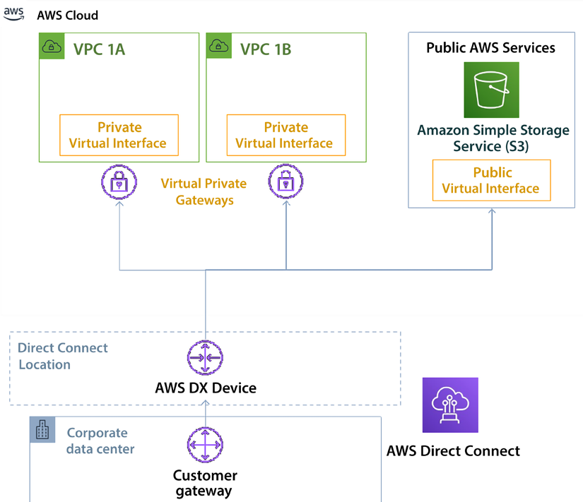

**Figure: AWS Direct Connect interface types, source p. 173.** This visual distinguishes Direct Connect interface options.

**How to read it:** Identify whether connectivity targets public AWS services, private VPC resources, or transit routing.

**Why it matters:** Interface type affects routing, segmentation, and hybrid architecture.

**How to apply it:** Choose interface types based on destination, routing model, redundancy, and security requirements.

**Limitations:** Direct Connect design also requires physical redundancy, location planning, failover tests, and provider coordination.

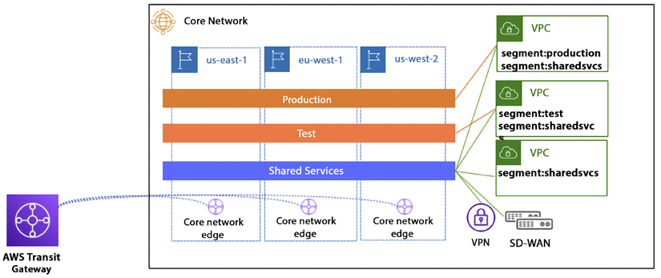

**Figure: AWS Cloud WAN architecture, source p. 175.** This visual shows centralized WAN management across cloud and branch networks.

**How to read it:** Look for global network policy, segments, attachments, and route control.

**Why it matters:** Large organizations need network governance across many locations and accounts.

**How to apply it:** Use Cloud WAN when centralized policy and broad network management are more important than simple point connectivity.

**Limitations:** It is a high-level view. Segmentation, security inspection, and migration from existing WAN still require careful planning.

#### Security Groups And NACLs

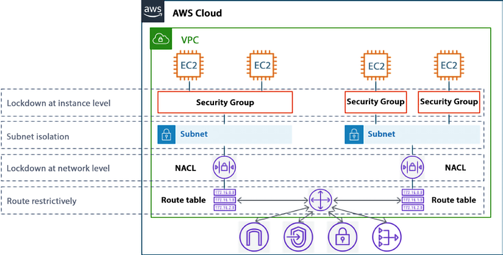

**Figure: SGs and NACLs in network defense, source p. 176.** This visual contrasts resource-level and subnet-level filtering.

**How to read it:** Security groups are stateful and attached to resources. NACLs are stateless and attached to subnets.

**Why it matters:** Misunderstanding SG versus NACL behavior is a common cause of blocked traffic or over-permissive networks.

**How to apply it:** Prefer security groups for workload-level allow rules. Use NACLs for coarse subnet boundaries where stateless behavior is understood.

**Limitations:** Network controls must be combined with IAM, application authorization, logging, and threat detection.

#### Storage And Data Protection

#### EBS Volume Decision Tree

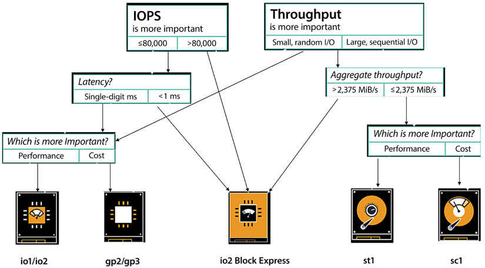

**Figure: Decision tree to select the EBS volume, source p. 187.** This is a high-value storage selection visual.

**How to read it:** Start from workload performance requirements: IOPS, throughput, latency, cost, and access pattern. Then choose a volume family.

**Why it matters:** Wrong EBS volume choice can create either bottlenecks or unnecessary cost.

**How to apply it:** For every EC2-backed workload, document expected IOPS, throughput, latency sensitivity, snapshot needs, growth, and cost target before selecting a volume. Monitor actual usage and revisit with Compute Optimizer or workload metrics.

**Limitations:** EBS volume families and performance limits change over time. Verify current AWS EBS documentation before implementation.

#### S3 Storage Classes

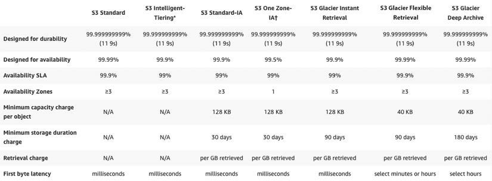

**Figure: Summary of storage class features, source p. 196.** This visual compares S3 storage classes.

**How to read it:** Move across classes by access frequency, retrieval time, availability, resilience, and cost.

**Why it matters:** S3 cost optimization depends on lifecycle behavior, not only object count.

**How to apply it:** Define data lifecycle policies from business retention and retrieval needs. Test retrieval behavior for archive classes before relying on them.

**Limitations:** Pricing, class names, and minimum storage duration rules change. Verify current details.

#### Storage Service By Use Case

**Figure: Choosing storage service by use case, source p. 199.** This visual maps storage need to AWS storage family.

**How to read it:** Start with semantics: block, file, object, backup, archive, hybrid.

**Why it matters:** Storage is hard to change after applications depend on APIs and consistency behavior.

**How to apply it:** Capture access semantics before writing code. Avoid using S3 as a file system or EBS as a shared distributed store unless the workload explicitly supports it.

**Limitations:** It does not cover every current AWS storage feature or third-party storage product.

#### S3 Access Points And Policy Segregation

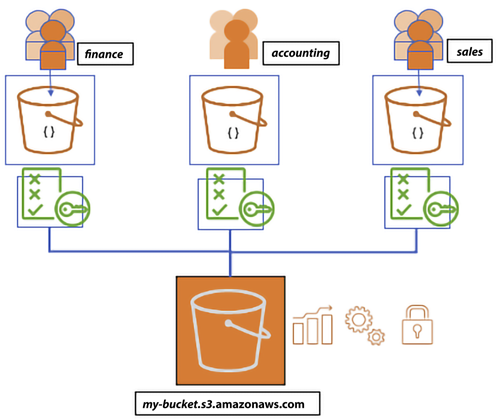

**Figure: Amazon S3 Access Points, source p. 204.** This visual shows separate access paths into the same storage.

**How to read it:** Treat each access point as a workload-specific access boundary with its own policy.

**Why it matters:** Different applications often need different permissions to the same bucket data.

**How to apply it:** Use access points to isolate application-specific access patterns, especially in shared data environments.

**Limitations:** Access points do not remove the need for bucket-level governance, IAM review, and data classification.

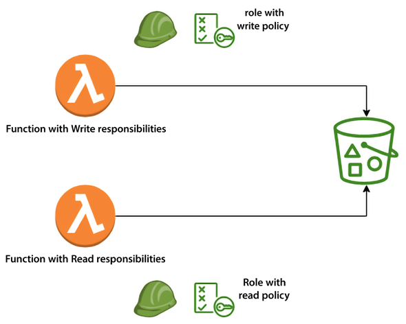

**Figure: Amazon S3 access policy segregation, source p. 205.** This visual reinforces least privilege through separated access policies.

**How to read it:** Identify who gets access to which subset of data and through which policy boundary.

**Why it matters:** Shared buckets without access segmentation often become over-permissive.

**How to apply it:** Define per-workload or per-domain access policies and audit them with IAM Access Analyzer.

**Limitations:** Policy design must still account for identity, network path, encryption keys, and logging.

#### S3 VPC Endpoint And Bucket Policies

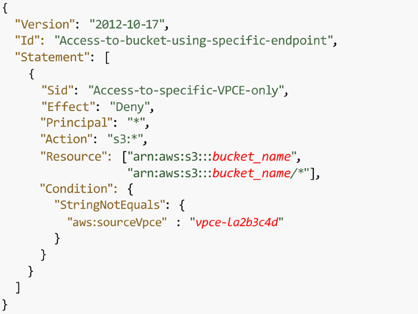

**Figure: VPC endpoint policy, source p. 210.** This visual shows policy control at the private endpoint boundary.

**How to read it:** The VPC endpoint becomes a controlled private path to S3, with policy limiting what can be accessed.

**Why it matters:** Private network paths are not sufficient without scoped permissions.

**How to apply it:** Combine endpoint policies, bucket policies, IAM, and block public access to reduce accidental exposure.

**Limitations:** Endpoint policies can be misunderstood. Test allowed and denied paths explicitly.

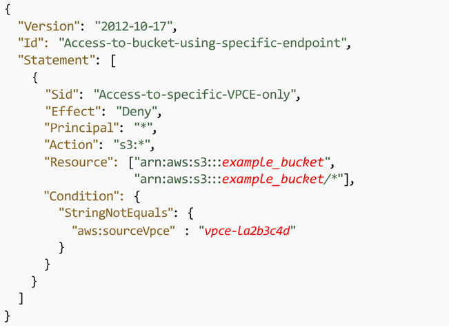

**Figure: S3 bucket policy, source p. 210.** This visual shows resource-level S3 access control.

**How to read it:** Look at principal, action, resource, and condition. Conditions are often where network and security posture are enforced.

**Why it matters:** S3 policy mistakes are high-impact because buckets often hold sensitive data.

**How to apply it:** Use least privilege, avoid wildcards, require TLS where appropriate, restrict source VPC endpoint where appropriate, and audit continuously.

**Limitations:** Bucket policies interact with IAM, SCPs, access points, ACL settings, and KMS policies.

#### Compute And Load Balancing

#### EC2 Pricing Model

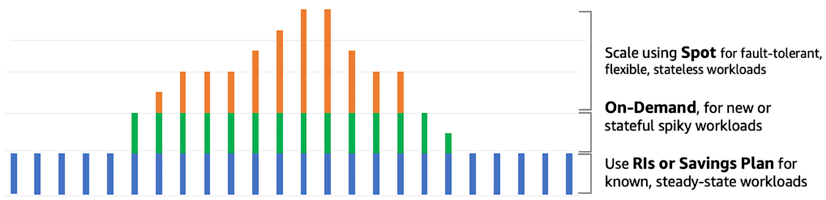

**Figure: EC2 pricing model to optimize cost, source p. 233.** This visual compares compute purchasing models.

**How to read it:** Match commitment level and interruption tolerance to pricing model.

**Why it matters:** EC2 cost optimization is a workload-pattern decision, not only a finance action.

**How to apply it:** Use on-demand for unknown or variable demand, commitments for predictable baselines, and spot only for interruptible work with checkpointing/retry.

**Limitations:** Current pricing programs and discounts change. Verify before committing.

#### EC2 Tags

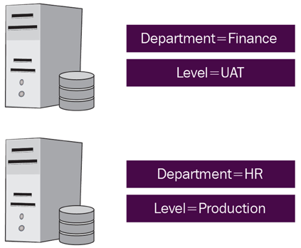

**Figure: EC2 instance tags, source p. 238.** This visual shows metadata used for ownership, automation, and cost allocation.

**How to read it:** Tags are not cosmetic labels; they are operational control data.

**Why it matters:** Untagged resources are hard to secure, charge back, patch, and retire.

**How to apply it:** Enforce required tags such as owner, environment, application, data classification, cost center, and lifecycle.

**Limitations:** Tags are useful only if enforced and integrated into automation.

#### Load Balancer Comparison

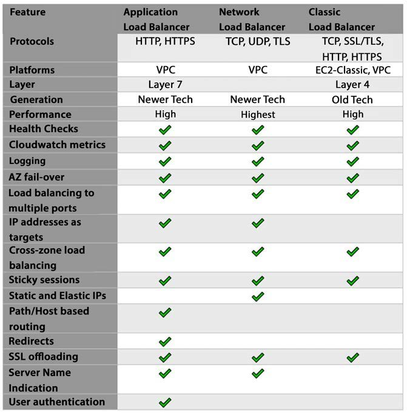

**Figure: ELB comparison, source p. 249.** This visual compares load balancer families.

**How to read it:** Start with protocol and routing need: HTTP layer 7 routing, TCP/UDP layer 4 performance, or legacy CLB.

**Why it matters:** Wrong load balancer selection can constrain routing, TLS, performance, target support, and observability.

**How to apply it:** Use ALB for HTTP/HTTPS services needing host/path/query routing. Use NLB for low-latency layer 4 or static IP-style use cases. Treat CLB mostly as legacy.

**Limitations:** AWS load balancer capabilities evolve. Confirm current feature differences.

#### Outposts Local Services

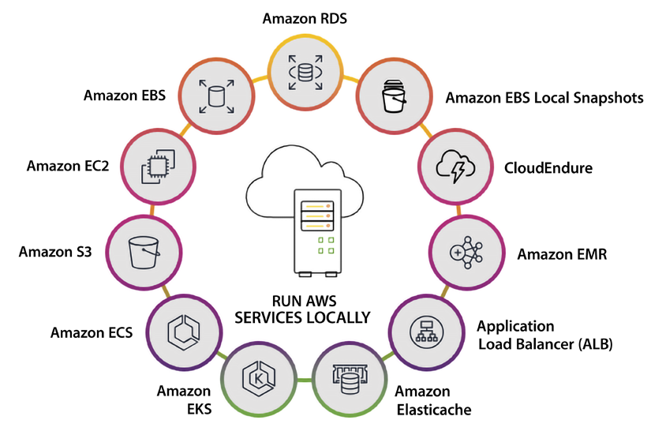

**Figure: AWS Outposts locally available services, source p. 258.** This visual shows hybrid AWS services running on-premises.

**How to read it:** Outposts extends AWS infrastructure into a customer location for workloads with local constraints.

**Why it matters:** Some workloads need local latency, data residency, or migration compatibility while still using AWS operations.

**How to apply it:** Use Outposts only when local execution is a real requirement and lifecycle, capacity, networking, and support are planned.

**Limitations:** Outposts is not a generic replacement for cloud regions. Service availability and capacity planning are central.

#### Databases And Caching

#### OLTP Versus OLAP

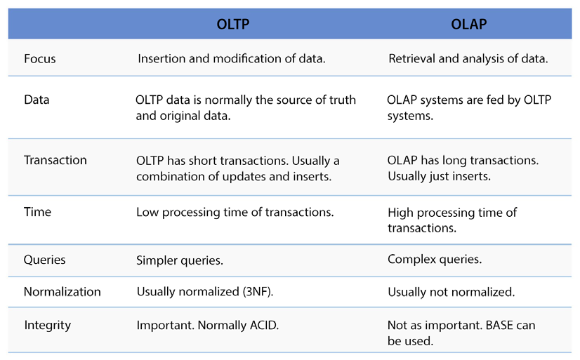

**Figure: Comparison between OLTP systems and OLAP systems, source p. 270.** This visual distinguishes transactional and analytical workloads.

**How to read it:** OLTP optimizes many small operational transactions. OLAP optimizes large analytical queries across datasets.

**Why it matters:** Mixing OLTP and OLAP without isolation causes performance, cost, and operational problems.

**How to apply it:** Keep transaction stores optimized for application correctness, then replicate/export data into analytical stores or lakes for reporting.

**Limitations:** Some modern systems blur the boundary, but workload intent still matters.

#### Aurora High Availability With RDS Proxy

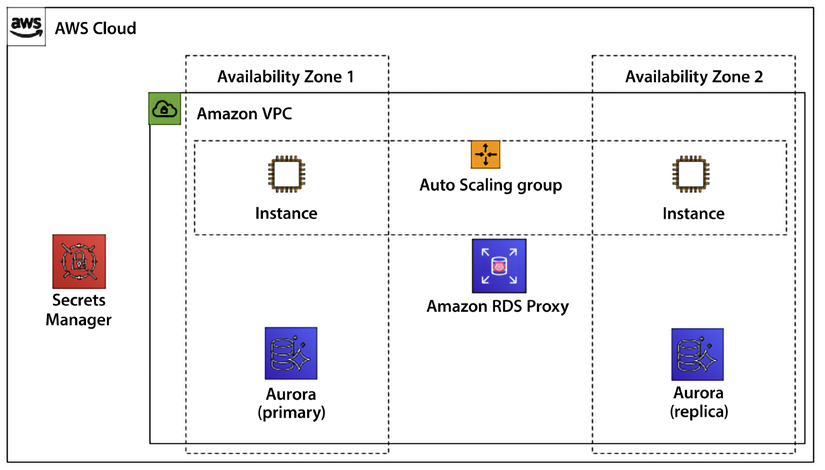

**Figure: Amazon Aurora's high availability with RDS Proxy, source p. 279.** This visual shows database availability and connection management.

**How to read it:** Identify clients, proxy layer, Aurora writer/reader behavior, and failover path.

**Why it matters:** Database failover is often limited by connection behavior as much as by database replication.

**How to apply it:** Use proxying/pooling where connection storms, Lambda concurrency, or failover behavior could overload the database. Test failover under load.

**Limitations:** RDS Proxy is not a substitute for good transaction design, query tuning, or correct retry behavior.

#### DynamoDB Partition And Sort Key

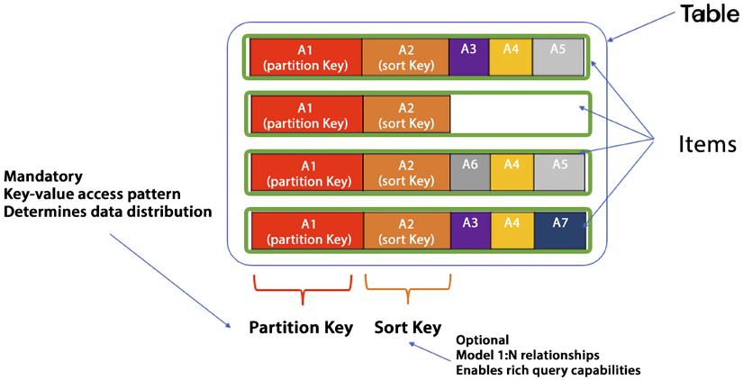

**Figure: DynamoDB table with partition and sort key, source p. 283.** This is a high-value NoSQL data-modeling visual.

**How to read it:** The partition key determines physical/logical distribution and primary lookup grouping. The sort key orders or groups related items within a partition.

**Why it matters:** DynamoDB performance and scalability depend heavily on key design. You do not model DynamoDB by normalizing tables first; you model it from access patterns.

**How to apply it:** Write access patterns before table design. For each query, identify partition key, sort key condition, index need, expected cardinality, write distribution, item size, and hot-key risk.

**Limitations:** The visual does not show single-table design, secondary index tradeoffs, hot partitions, conditional writes, transactions, streams, or adaptive capacity. Those must be learned separately before production-scale DynamoDB design.

#### Application Caching Pattern

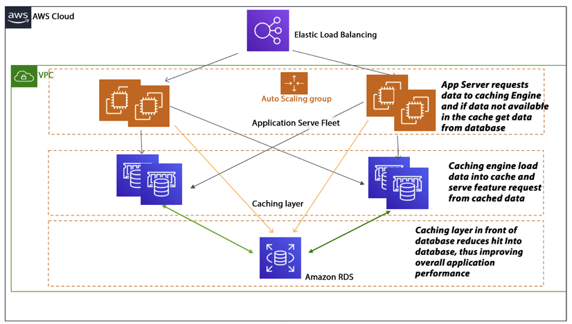

**Figure: Application caching pattern architecture, source p. 289.** This visual shows a cache between application and data source.

**How to read it:** Identify the read path, cache hit path, cache miss path, and source-of-truth database.

**Why it matters:** Caches reduce latency and database load but add invalidation and consistency problems.

**How to apply it:** Define TTLs, cache key design, invalidation rules, fallback behavior, warm-up strategy, and what happens when the cache is unavailable.

**Limitations:** The visual does not show write-through/write-around/write-back differences, stampede protection, or stale-read handling.

#### Redis Versus Memcached

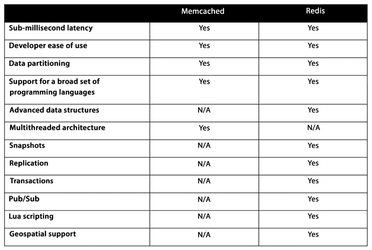

**Figure: Comparison of Redis and Memcached, source p. 290.** This visual supports cache engine selection.

**How to read it:** Compare data structures, persistence/replication features, operational model, and workload need.

**Why it matters:** Cache engine choice affects failover, data structures, latency, and operational behavior.

**How to apply it:** Choose the simplest engine that meets data structure, availability, and persistence requirements.

**Limitations:** Current ElastiCache offerings and engine capabilities should be verified.

#### Graph Relationship Example

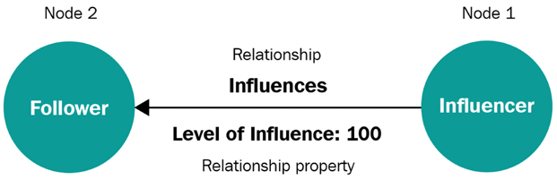

**Figure: Example of a relationship, source p. 292.** This visual introduces graph thinking.

**How to read it:** Focus on nodes and edges rather than rows and joins.

**Why it matters:** Relationship-heavy queries can become expensive in relational models and natural in graph models.

**How to apply it:** Consider graph databases when the primary questions traverse relationships, such as fraud rings, recommendations, identity graphs, or network topology.

**Limitations:** Graph databases are not a universal replacement for relational or key-value stores.

#### Security, Identity, And Governance

#### Shared Responsibility By Service Category

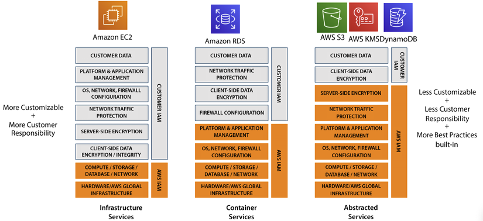

**Figure: Shared responsibility model for different AWS service categories, source p. 315.** This visual refines the shared responsibility model.

**How to read it:** Customer responsibility changes depending on whether the service is infrastructure, container/platform-like, or abstracted managed service.

**Why it matters:** Moving to a managed service shifts some responsibilities but does not eliminate customer accountability.

**How to apply it:** For each selected service, list customer-owned controls: IAM, network, data protection, logging, backup, configuration, and application security.

**Limitations:** Service-specific responsibility details vary. Verify current documentation.

#### AWS Security Services

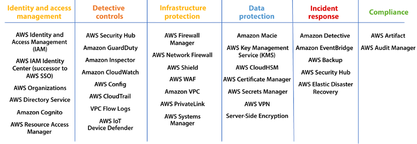

**Figure: AWS security services, source p. 316.** This visual organizes security services by function.

**How to read it:** Group services into identity, detection, infrastructure protection, data protection, and compliance.

**Why it matters:** Security architecture needs layered controls, not a single product.

**How to apply it:** Build a baseline security control map for every account and workload.

**Limitations:** It is a point-in-time service list from 2023.

#### IAM Groups, Users, And Roles

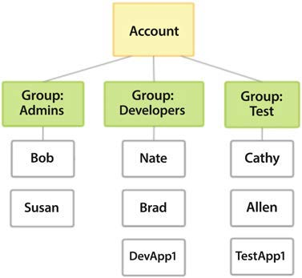

**Figure: AWS IAM user groups and IAM user, source p. 320.** This visual shows user and group relationship.

**How to read it:** Users inherit permissions through group membership, but production patterns should strongly prefer roles and federation where possible. [Inference]

**Why it matters:** Human identity and workload identity are common sources of over-permission.

**How to apply it:** Use IAM Identity Center/federation for humans and IAM roles for workloads. Keep users exceptional.

**Limitations:** The visual is simplified and does not show policy evaluation order, SCPs, permission boundaries, or session policies.

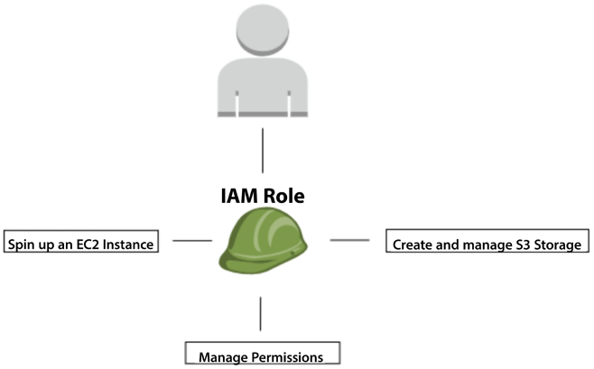

**Figure: AWS IAM role, source p. 321.** This visual shows temporary-assumable identity.

**How to read it:** A trusted principal assumes a role and receives scoped permissions for a session.

**Why it matters:** Roles are foundational for workload identity, cross-account access, and reducing long-lived credentials.

**How to apply it:** Define trust policies narrowly and attach least-privilege permission policies. Audit who can assume production roles.

**Limitations:** The diagram does not show session duration, external IDs, condition keys, or permission boundaries.

#### Organizations And OUs

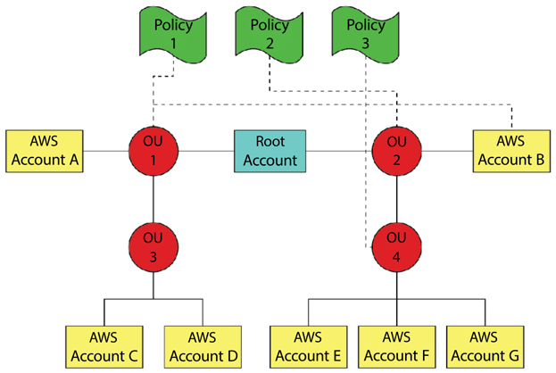

**Figure: Sample organizational unit hierarchy, source p. 327.** This visual shows account grouping.

**How to read it:** OUs are governance containers for accounts and policies.

**Why it matters:** Multi-account strategy is how AWS organizations isolate environments, workloads, teams, and risk.

**How to apply it:** Design OUs around governance needs: security, infrastructure, sandbox, shared services, production, non-production, regulated workloads.

**Limitations:** OU structure must evolve with organization size and compliance needs.

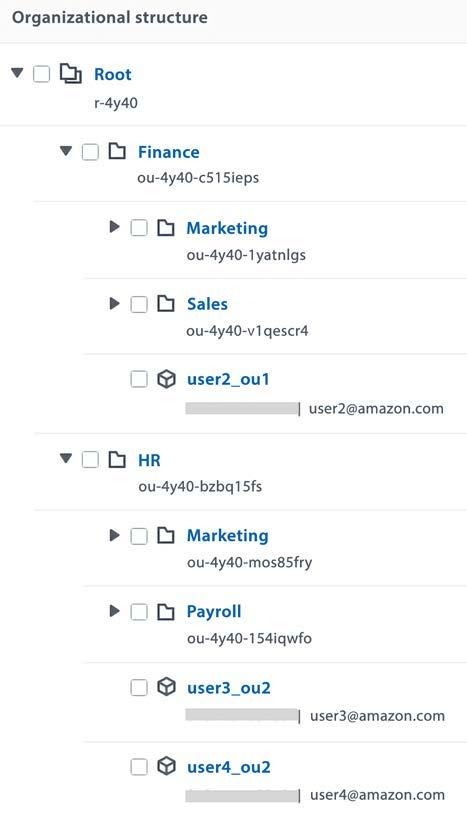

**Figure: AWS organizational unit hierarchy in an AWS account, source p. 328.** This visual connects OUs and accounts.

**How to read it:** Policies attach at organization, OU, or account levels and inherit downward.

**Why it matters:** A poorly planned OU structure creates either weak guardrails or excessive friction.

**How to apply it:** Use SCPs for broad preventive controls, not fine-grained application permissions.

**Limitations:** SCPs do not grant permissions; they only set boundaries. IAM still grants actual access.

#### GuardDuty Data Sources

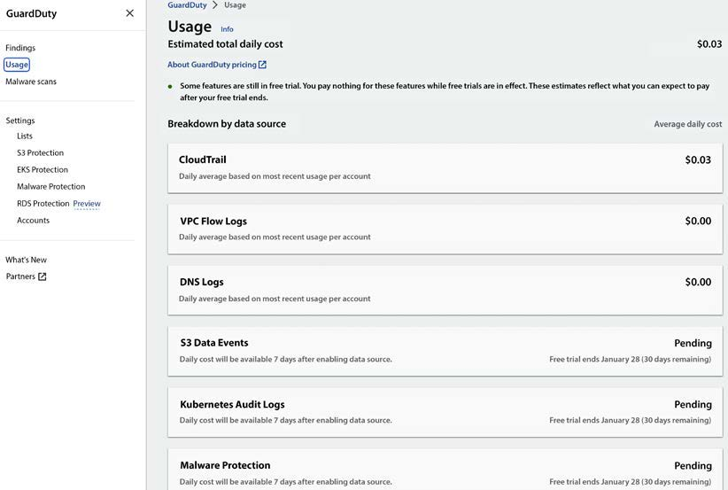

**Figure: Amazon GuardDuty data source list, source p. 336.** This visual shows inputs to threat detection.

**How to read it:** GuardDuty findings depend on monitored telemetry sources.

**Why it matters:** Detection quality depends on enabled sources and response ownership.

**How to apply it:** Enable GuardDuty across accounts and regions where required, route findings to Security Hub or incident tooling, and define severity runbooks.

**Limitations:** GuardDuty detects suspicious behavior; it does not automatically secure the workload.

#### CloudOps, Observability, And Finance

#### Pillars Of CloudOps

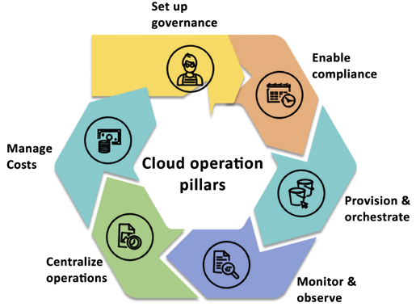

**Figure: The pillars of CloudOps, source p. 355.** This visual frames cloud operations as a capability system.

**How to read it:** Governance, configuration/compliance/audit, provisioning/orchestration, observability, centralized operations, and finance management are all required.

**Why it matters:** Cloud adoption without operations maturity creates drift, hidden risk, and uncontrolled cost.

**How to apply it:** Convert each pillar into platform backlog items and measurable controls.

**Limitations:** The diagram does not assign ownership; your organization must.

#### EventBridge Rule For Autoscaling Failure

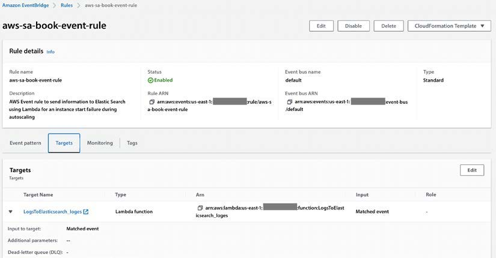

**Figure: EventBridge rule for an autoscaling failure, source p. 366.** This visual shows event-driven operational automation.

**How to read it:** Operational events become rules that trigger responses.

**Why it matters:** Cloud operations should react to system events automatically where safe.

**How to apply it:** Use EventBridge to route operational events to notifications, tickets, Lambda remediations, or incident workflows.

**Limitations:** Automated remediation needs guardrails and audit trails.

#### Systems Manager Operations

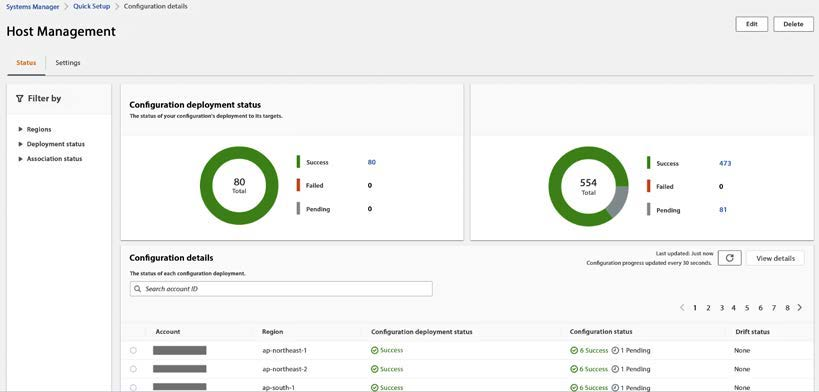

**Figure: AWS Systems Manager host management, source p. 368.** This visual shows host-level management capabilities.

**How to read it:** Systems Manager centralizes inventory, command execution, patching, and session access.

**Why it matters:** EC2 fleets need operational controls even in cloud.

**How to apply it:** Use Systems Manager for patching, inventory, secure shell-less access, automation, and compliance reporting.

**Limitations:** Requires agent/connectivity/IAM setup and process discipline.

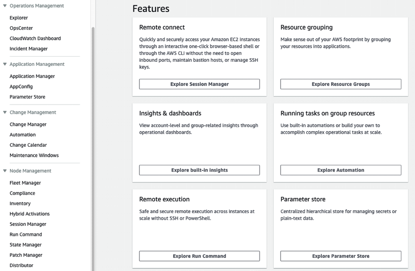

**Figure: AWS Systems Manager for CloudOps monitoring and audit, source p. 369.** This visual connects operations data to monitoring and audit.

**How to read it:** Host and resource state feed compliance and operational workflows.

**Why it matters:** Auditability is part of operability.

**How to apply it:** Tie inventory, patch compliance, configuration, and command history into regular operations reviews.

**Limitations:** It does not cover container/serverless operational patterns.

#### X-Ray Service Map

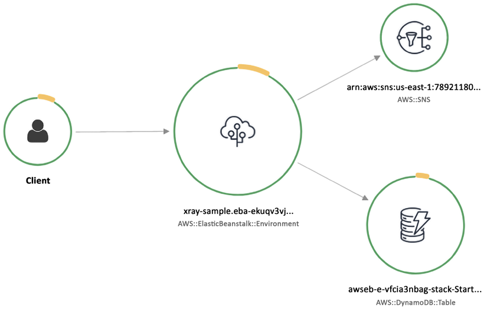

**Figure: AWS X-Ray service map graph, source p. 380.** This visual shows distributed trace relationships.

**How to read it:** Nodes are services or dependencies; edges represent calls. Errors and latency hotspots appear in context.

**Why it matters:** Microservices and event-driven systems are hard to debug from logs alone.

**How to apply it:** Add correlation IDs, tracing, service maps, and latency/error alarms to production services.

**Limitations:** Sampling, async boundaries, and missing instrumentation can hide failures.

#### Cost Explorer

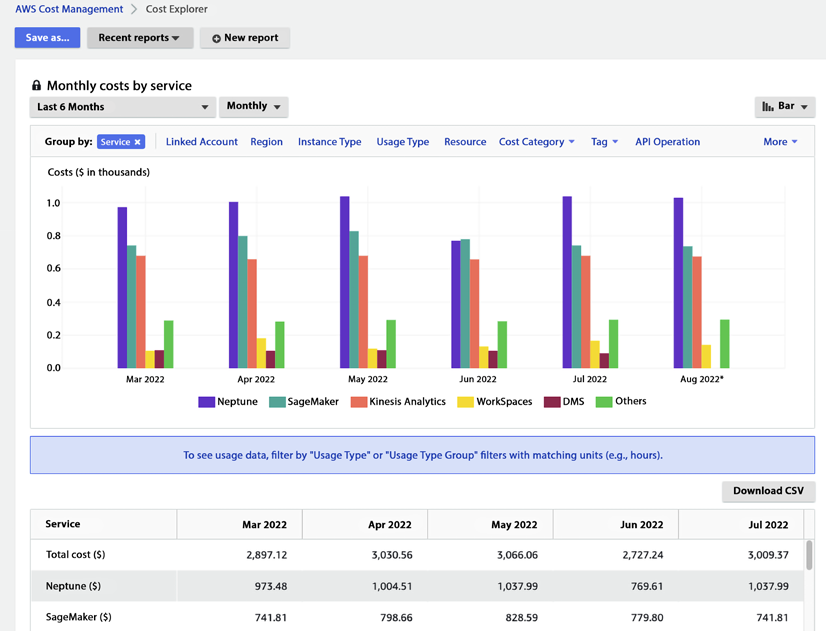

**Figure: AWS Cost Explorer, source p. 389.** This visual shows cost analysis by dimension.

**How to read it:** Cost data becomes useful when grouped by service, account, tag, usage type, or time.

**Why it matters:** Cost is an architecture signal.

**How to apply it:** Enforce tags, review trends, detect anomalies, and connect spend to owners and business metrics.

**Limitations:** Cost Explorer depends on tagging and allocation hygiene.

#### Analytics And Streaming

#### EMR Node Types

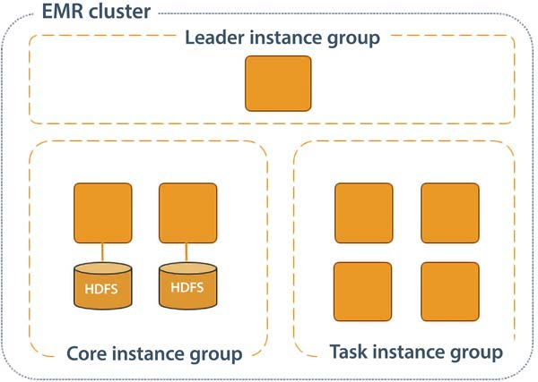

**Figure: Amazon EMR node types, source p. 397.** This visual explains cluster roles.

**How to read it:** Identify primary/master coordination nodes, core nodes with data/task responsibilities, and task nodes for extra compute.

**Why it matters:** Scaling and failure behavior differ by node role.

**How to apply it:** Plan cluster sizing, spot usage, storage behavior, and failure recovery around node roles.

**Limitations:** EMR deployment models and terminology can change; verify current service docs.

#### AWS Glue Workflow

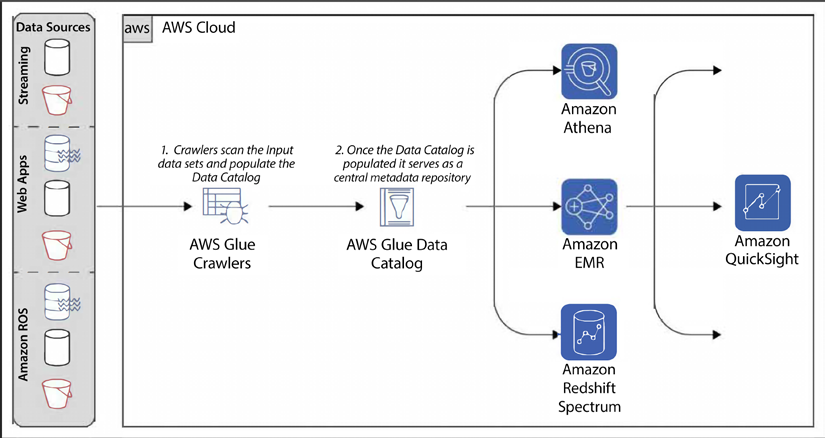

**Figure: AWS Glue typical workflow steps, source p. 412.** This visual shows crawler, catalog, transformation, and target flow.

**How to read it:** Data discovery feeds metadata, which feeds ETL jobs and downstream datasets.

**Why it matters:** ETL without catalog and metadata discipline becomes unmaintainable.

**How to apply it:** Define crawler scope, schema change handling, job ownership, partitioning, and quality checks.

**Limitations:** It does not show data contracts, lineage, or orchestration error handling.

#### MSK And Kinesis

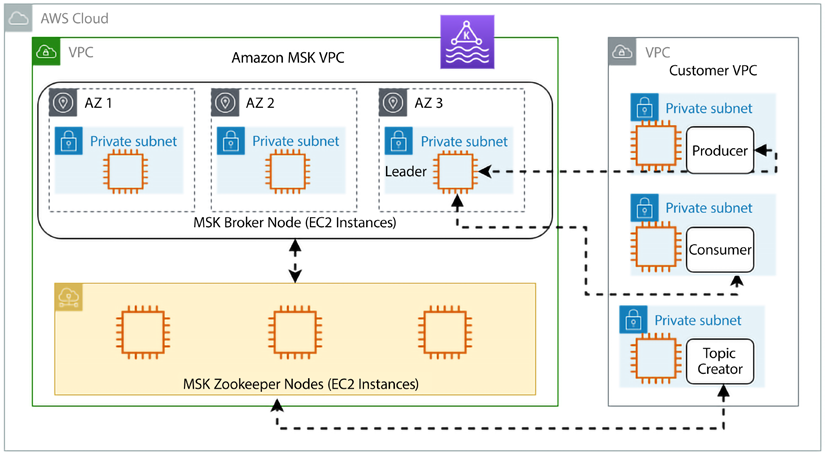

**Figure: Amazon MSK architecture, source p. 428.** This visual shows Kafka brokers and client interaction.

**How to read it:** Producers and consumers interact with broker clusters; partitions distribute stream data.

**Why it matters:** Kafka architecture requires partition, replication, retention, and consumer group planning.

**How to apply it:** Use MSK when Kafka API compatibility or ecosystem integration is required and the team can own Kafka concepts.

**Limitations:** Broker sizing, partition strategy, rebalance behavior, and schema governance are not fully shown.

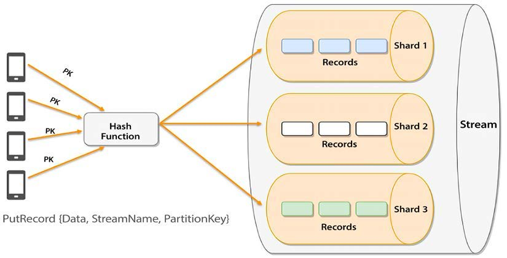

**Figure: Amazon Kinesis architecture, source p. 432.** This visual explains AWS-native streaming.

**How to read it:** Producers write records to streams; consumers process records, often by shard/partition key.

**Why it matters:** Stream architecture controls ingestion throughput, ordering, replay, and consumer scaling.

**How to apply it:** Design partition keys, shard capacity, retention, consumer concurrency, retries, and replay paths.

**Limitations:** The figure does not show all Kinesis family features or current quotas.

#### Redshift Cluster Architecture

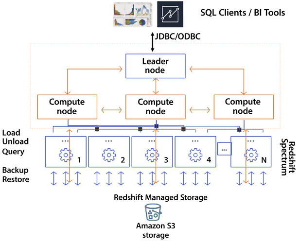

**Figure: Redshift cluster architecture, source p. 438.** This visual shows leader and compute node roles.

**How to read it:** The leader coordinates planning and results; compute nodes process distributed data.

**Why it matters:** Data distribution, sort keys, workload management, and query shape affect warehouse performance.

**How to apply it:** Tune tables and workloads based on query patterns. Monitor skew, queueing, and scan volume.

**Limitations:** Redshift Serverless and current feature behavior should be verified.

#### Athena Data Sources, Compression, And Predicate Pushdown

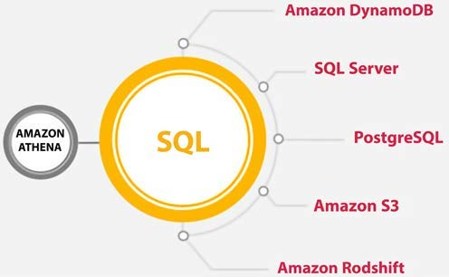

**Figure: Data source types supported by Amazon Athena, source p. 451.** This visual shows Athena as a query layer over multiple sources.

**How to read it:** Athena separates compute/query execution from underlying data storage.

**Why it matters:** Query flexibility can hide cost and governance risks.

**How to apply it:** Control workgroups, access, scanned bytes, and data catalog permissions.

**Limitations:** Federated query connector support and performance vary.

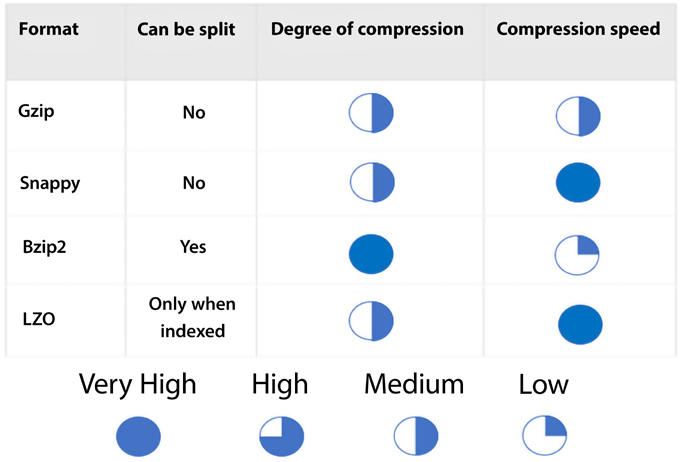

**Figure: Compression formats, source p. 456.** This visual supports file-format and compression decisions.

**How to read it:** Compression affects storage cost, scan cost, and processing behavior.

**Why it matters:** Analytics cost and latency often depend more on file layout than query syntax.

**How to apply it:** Prefer columnar and compressed formats for analytical scans when compatible with consumers.

**Limitations:** Compression choice depends on workload, splitability, and tooling support.

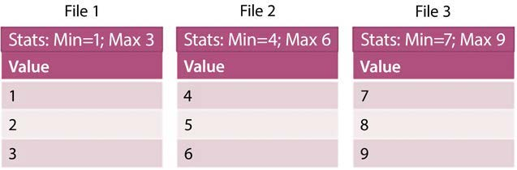

**Figure: Predicate pushdown example, source p. 460.** This visual shows filtering pushed closer to data scanning.

**How to read it:** The query engine avoids reading irrelevant data when layout and format support pushdown.

**Why it matters:** Predicate pushdown reduces scanned bytes, latency, and cost.

**How to apply it:** Design partitions, columnar formats, and query predicates together.

**Limitations:** Pushdown depends on file format, connector, query shape, and engine behavior.

#### ML, IoT, Containers, And Microservices

#### ML Service Stack And SageMaker Pipeline

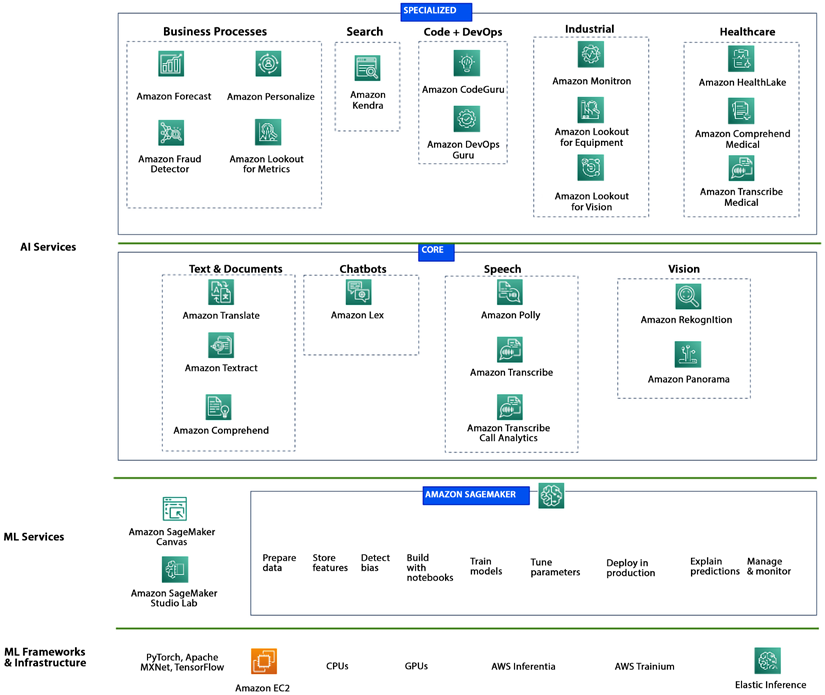

**Figure: AWS ML Services Stack, source p. 472.** This visual organizes ML services by abstraction level.

**How to read it:** Move from infrastructure/frameworks to SageMaker platform services to high-level AI services.

**Why it matters:** Teams should not build custom ML when a managed AI service solves the problem well enough.

**How to apply it:** Select the lowest-operational-burden layer that meets accuracy, control, compliance, and integration needs.

**Limitations:** ML service names and generative AI offerings have changed quickly since 2023.

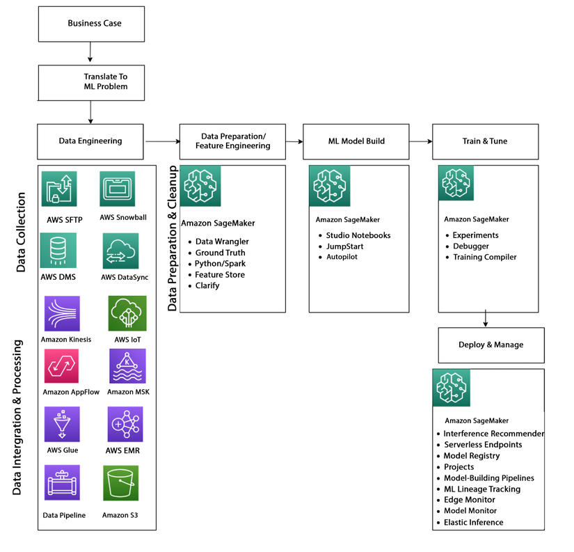

**Figure: AI/ML pipeline and Amazon SageMaker, source p. 476.** This visual shows model lifecycle stages.

**How to read it:** Treat data preparation, training, tuning, deployment, and monitoring as one lifecycle.

**Why it matters:** ML production failures often happen after training: drift, data quality, monitoring, and retraining.

**How to apply it:** Define model ownership, feature/data lineage, evaluation gates, deployment rollback, and drift monitoring.

**Limitations:** It is not a full MLOps governance model.

#### VMs Versus Containers

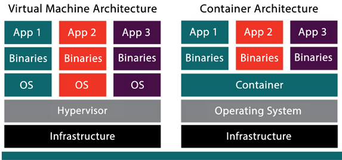

**Figure: VMs versus containers, source p. 511.** This visual contrasts virtualization layers.

**How to read it:** VMs include guest OS per machine; containers share the host kernel and package application dependencies.

**Why it matters:** Runtime isolation, startup speed, density, patching, and deployment workflows differ.

**How to apply it:** Use containers for consistent packaging and deployment when kernel sharing is acceptable. Use VMs where stronger isolation, legacy compatibility, or OS control is needed.

**Limitations:** Security posture depends on runtime, host hardening, image supply chain, and orchestration controls.

#### Docker And ECS

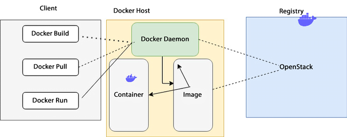

**Figure: Docker architecture, source p. 514.** This visual shows Docker client, daemon, images, registries, and containers.

**How to read it:** Images are immutable package artifacts; containers are running instances; registries distribute images.

**Why it matters:** Container deployment quality depends on image build, scan, registry, and runtime controls.

**How to apply it:** Implement reproducible builds, vulnerability scanning, signed images where required, and clear promotion from dev to production.

**Limitations:** Docker architecture is only part of production container operations.

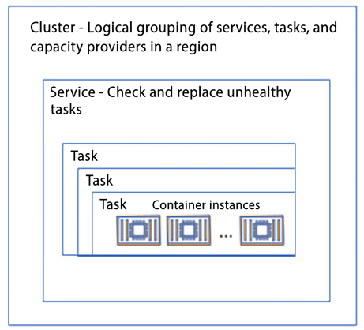

**Figure: Amazon ECS architecture, source p. 518.** This visual shows ECS service/task orchestration.

**How to read it:** ECS schedules tasks, manages service desired state, and integrates with networking and load balancing.

**Why it matters:** ECS is often the simplest AWS-native path for containerized services.

**How to apply it:** Define task definitions, service autoscaling, health checks, IAM task roles, log configuration, and deployment strategy.

**Limitations:** It does not show all Fargate/EC2 launch type tradeoffs.

#### EKS Control Plane

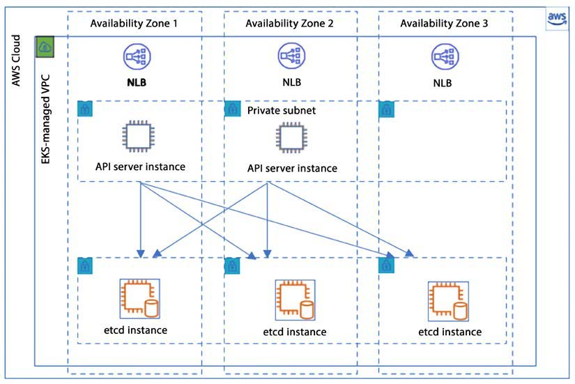

**Figure: Amazon EKS control plane architecture, source p. 531.** This visual shows managed Kubernetes control plane separation.

**How to read it:** AWS manages the control plane availability, while you still manage workloads, worker capacity/runtime choices, networking, IAM integration, and cluster configuration.

**Why it matters:** Managed Kubernetes reduces some operational work but does not remove platform engineering responsibility.

**How to apply it:** Before choosing EKS, define cluster ownership, upgrade process, add-ons, ingress, network policy, secrets, observability, node lifecycle, and multi-tenancy boundaries.

**Limitations:** The diagram does not show all current EKS modes, add-ons, security controls, or GitOps practices.

#### Monolith, Microservices, And Layering

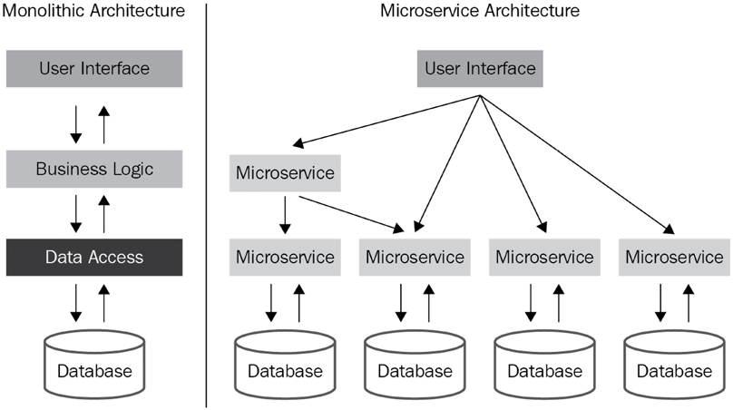

**Figure: Monolithic versus microservice architectures, source p. 549.** This visual compares deployment and ownership boundaries.

**How to read it:** A monolith centralizes deployment; microservices split deployable units by capability.

**Why it matters:** Microservices trade local simplicity for distributed-system complexity.

**How to apply it:** Split only when business capability, team ownership, independent release, or scaling need justifies it.

**Limitations:** A well-structured modular monolith may outperform premature microservices. [Inference]

**Figure: Microservice architectures in AWS, source p. 550.** This visual maps microservices to AWS building blocks.

**How to read it:** Identify service boundaries, integration paths, and data ownership.

**Why it matters:** AWS services do not automatically create good microservice boundaries.

**How to apply it:** Define bounded context, API contract, event contract, data store, SLO, runbook, and owner for each service.

**Limitations:** The visual does not show retries, idempotency, tracing, schema evolution, or incident ownership.

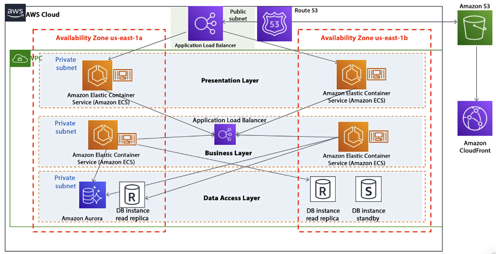

**Figure: Three-layer microservice architecture in AWS, source p. 553.** This visual frames presentation/API/business/data separation.

**How to read it:** Separate entry layer, service logic, and data persistence.

**Why it matters:** Layering helps reason about security, scaling, and deployment boundaries.

**How to apply it:** Keep presentation concerns, business capabilities, and data ownership explicit in architecture diagrams.

**Limitations:** Layering alone does not solve domain boundaries or distributed transactions.

#### Event Streaming, Queues, And Pub/Sub

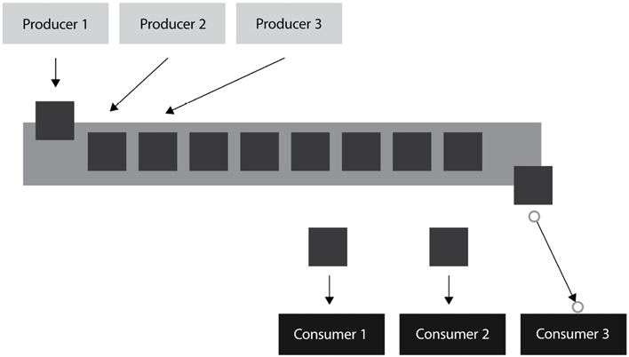

**Figure: Event streaming model, source p. 558.** This visual shows durable ordered event flow.

**How to read it:** Producers append events; consumers read independently, often retaining replay ability.

**Why it matters:** Streams are useful for high-volume event pipelines and replayable processing.

**How to apply it:** Define partition key, ordering requirement, retention, consumer groups, replay process, and schema evolution.

**Limitations:** Streams are not automatically simpler than queues.

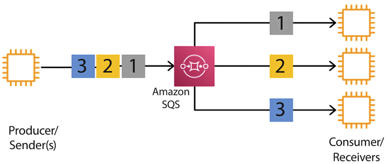

**Figure: Event-driven message queuing model in AWS, source p. 559.** This visual shows queue-based decoupling.

**How to read it:** Producers enqueue work; consumers process at their own rate.

**Why it matters:** Queues buffer load and isolate producer availability from consumer capacity.

**How to apply it:** Configure visibility timeout, DLQ, retry policy, idempotency, and age/depth alarms.

**Limitations:** Queues do not preserve every ordering model unless configured specifically.

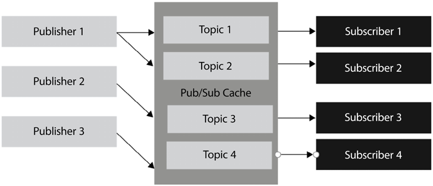

**Figure: The pub/sub model, source p. 560.** This visual shows fanout from publisher to subscribers.

**How to read it:** Publishers emit messages without knowing all consumers.

**Why it matters:** Pub/sub enables new consumers without changing producers.

**How to apply it:** Use topics/event buses when multiple independent subscribers need the same event.

**Limitations:** Subscriber failure, event contract versioning, and filtering require governance.

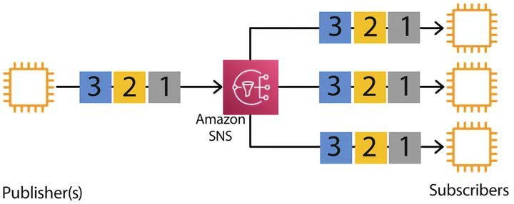

**Figure: Event-driven pub/sub model in AWS, source p. 561.** This visual maps pub/sub to AWS implementation.

**How to read it:** Look for event producer, broker/topic/bus, and multiple consumers.

**Why it matters:** Event-driven AWS systems need explicit consumer isolation and observability.

**How to apply it:** Add DLQs, retries, filtering, schema versioning, trace correlation, and replay plans.

**Limitations:** It does not solve distributed transaction consistency by itself.

#### Data Lakes And Application Design

#### Modern Data Lake Components

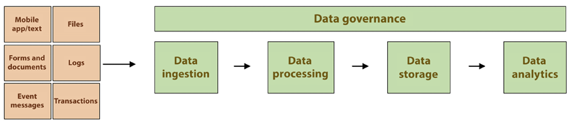

**Figure: Key components of a modern data lake, source p. 588.** This visual shows that a lake is more than storage.

**How to read it:** Identify ingestion, storage, catalog, processing, governance, security, and consumption components.

**Why it matters:** An S3 bucket without governance and metadata is not a production data lake.

**How to apply it:** Define zones, catalog ownership, quality checks, lineage, access controls, monitoring, and cost controls.

**Limitations:** Organizational ownership and data product standards are not shown.

#### Data Lake Zones

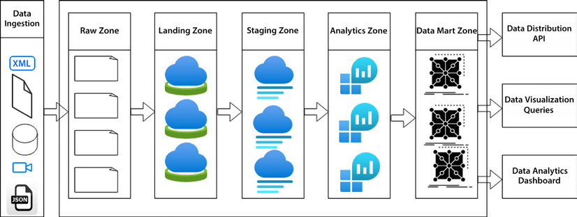

**Figure: Different zones of a data lake, source p. 592.** This visual separates raw, processed, curated, and consumption concepts.

**How to read it:** Data should become more trusted and structured as it moves through zones.

**Why it matters:** Zones prevent raw ingestion chaos from contaminating trusted analytics.

**How to apply it:** Define entry criteria, quality checks, retention, access, and ownership for each zone.

**Limitations:** Zone names differ across organizations; the governance principle matters more than names.

#### AWS Data Lake Components

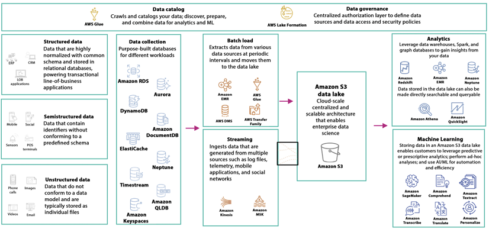

**Figure: AWS data lake components, source p. 594.** This visual maps lake functions to AWS services.

**How to read it:** Separate storage, catalog, access governance, processing, and consumption.

**Why it matters:** Data lake architecture is a system of controls and workflows, not one service.

**How to apply it:** Use this as a checklist for lake design: ingestion, S3 layout, Glue Catalog, Lake Formation, ETL/query engines, security, monitoring, and cost.

**Limitations:** Current service names/features should be verified.

#### Data Mesh Architecture

**Figure: Data mesh architecture in AWS, source p. 612.** This visual shows distributed data domains with shared governance.

**How to read it:** Look for domain-owned data products and common discovery/governance mechanisms.

**Why it matters:** Enterprise data scale is often limited by ownership, not storage capacity.

**How to apply it:** Adopt data mesh only when domain teams can own data quality, contracts, access, and documentation.

**Limitations:** The visual does not show data contract enforcement, stewardship, or platform product management.

#### AWSome Store Context Map

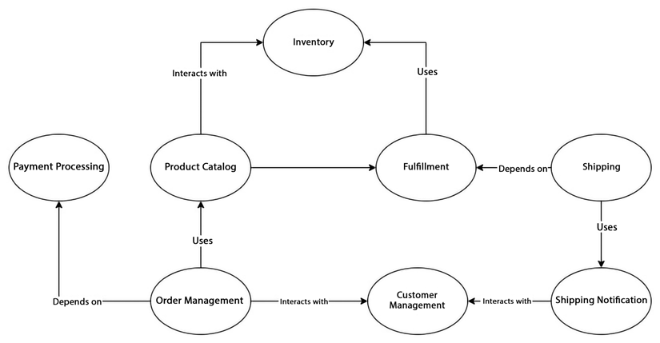

**Figure: Domain-driven design context map for AWSome Store, source p. 618.** This visual identifies bounded contexts for the sample application.

**How to read it:** Each context represents a business capability with relationships to other contexts.

**Why it matters:** Good cloud architecture starts with domain boundaries, not service icons.

**How to apply it:** Before choosing AWS services, map bounded contexts, ownership, APIs, events, and data boundaries.

**Limitations:** A context map must be refined with domain experts.

#### Serverless And Cloud-Native Application Architecture

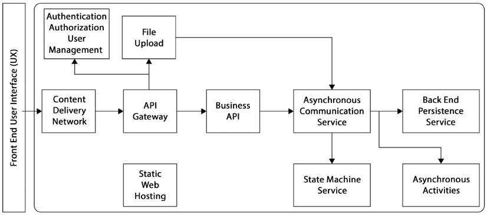

**Figure: Serverless web-application architecture, source p. 619.** This visual shows a serverless application baseline.

**How to read it:** Separate static hosting, API entry, function execution, identity, and data persistence.

**Why it matters:** Serverless designs shift operations toward permissions, limits, event flows, observability, and cost per request.

**How to apply it:** Add IAM least privilege, API throttling, Lambda concurrency controls, DLQs, tracing, logs, and backup plans.

**Limitations:** The diagram is a baseline, not a complete production design.

**Figure: AWS cloud-native architecture to build AWSome Store, source p. 620.** This visual composes many book concepts into an e-commerce system.

**How to read it:** Trace request flow, authentication, API handling, business logic, asynchronous event flow, and persistence.

**Why it matters:** It demonstrates service composition around a domain workflow.

**How to apply it:** Use it as a learning architecture, then add production controls: threat model, quotas, retries, DLQs, idempotency, backups, CI/CD, monitoring, and cost budgets.

**Limitations:** Hands-on examples omit many production hardening details.

#### Order Context Class Diagram

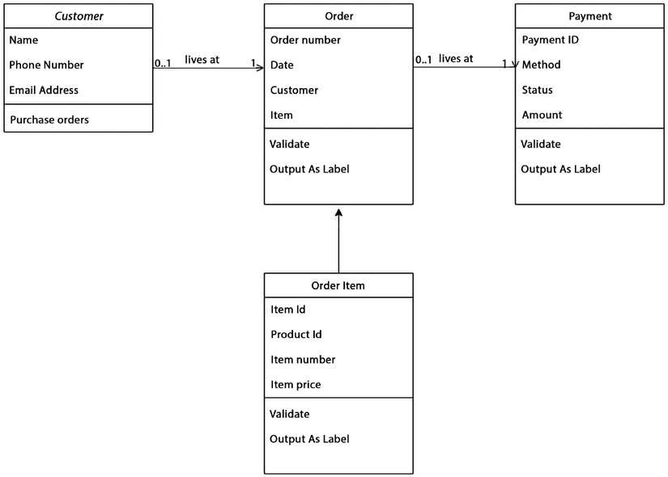

**Figure: Order context class diagram, source p. 645.** This visual connects domain modeling to implementation.

**How to read it:** Identify entities, attributes, and relationships inside the order bounded context.

**Why it matters:** Domain boundaries must eventually become data structures, APIs, and workflows.

**How to apply it:** Use class/domain diagrams to validate that persistence and APIs match business concepts before wiring infrastructure.

**Limitations:** A class diagram does not show event contracts, transaction boundaries, or failure handling.

#### Visuals Still Worth Manual Review

The following extracted visuals are useful but mostly console or certification screenshots. They are better treated as reference images than architecture learning diagrams:

- `page-070-image-01.jpg` through `page-087-image-01.jpg`: Well-Architected and certification screens.
- `page-095-image-01.jpg`, `page-097-image-01.png`, `page-102-image-01.jpg`, `page-102-image-02.png`: certification preparation screens.
- `page-624-image-01.jpg`, `page-626-image-01.jpg`, `page-626-image-02.png`: billing/IAM/code setup screenshots from the hands-on chapter.

If this atlas is expanded further, the next useful step is to add a compact "figure index" table covering every extracted image, including screenshots, with columns for page, caption, asset, category, and whether it is architecture-critical.

## 15. Quick Reference

### Key Terms

- **Region:** Geographic AWS area containing multiple Availability Zones.
- **Availability Zone:** Isolated data center grouping within a Region for fault isolation.
- **VPC:** Isolated virtual network for AWS resources.
- **Security group:** Stateful instance/resource-level traffic filter.
- **NACL:** Stateless subnet-level traffic filter.
- **Transit Gateway:** Hub for connecting many VPCs and networks.
- **PrivateLink:** Private endpoint-based service access without broad network peering.
- **EBS:** Block storage for EC2.
- **EFS/FSx:** Managed file storage options.
- **S3:** Object storage and common data lake substrate.
- **RDS/Aurora:** Managed relational database services.
- **DynamoDB:** Managed key-value/document NoSQL database.
- **ElastiCache:** Managed in-memory cache.
- **CloudTrail:** API activity logging.
- **Config:** Resource configuration tracking and compliance evaluation.
- **CloudWatch:** Metrics, logs, alarms, dashboards, and events.
- **Glue:** Data catalog and serverless ETL.
- **EMR:** Managed big data framework clusters.
- **Kinesis:** AWS-native streaming.
- **MSK:** Managed Kafka.
- **Redshift:** Managed data warehouse.
- **Athena:** Serverless SQL querying over S3 data.
- **ECS/EKS:** Container orchestration services.
- **Fargate:** Serverless container runtime.
- **EventBridge/SQS/SNS:** Event bus, queue, and pub/sub integration services.
- **Lake Formation:** Governance and permissions layer for data lakes.

### Decision Rules Of Thumb

- Start with requirements, not services.
- Use the Well-Architected pillars as design inputs, not launch paperwork.
- Prefer managed services when they meet requirements and reduce undifferentiated operations.
- Use purpose-built databases only when access patterns justify them.
- Keep private workloads private; expose only intentional edges.
- Make asynchronous systems idempotent and observable.
- Treat S3 buckets, IAM roles, queues, keys, and dashboards as owned production assets.
- Use IaC before scale makes manual state impossible to reason about.
- Verify backups by restoring, not by checking that backup jobs are green.
- Add microservices only when boundaries and ownership are clear.

### Common Anti-Patterns

- Lift-and-shift migration presented as modernization.
- Single-AZ production workloads without accepted risk.
- Public S3 buckets or wildcard IAM in production.
- One database used for every access pattern.
- Event-driven workflows with no DLQ, idempotency, or trace correlation.
- Data lake without catalog, quality, ownership, or access controls.
- Kubernetes adopted without platform ownership.
- CloudWatch dashboards with no alarms or runbooks.
- Cost optimization deferred until after spend is already uncontrolled.
- Well-Architected review run after all important choices are fixed.

### Critical Questions Before Implementation

- What business objective does this architecture serve?
- What are the explicit NFRs?
- What failure modes are accepted, mitigated, or untested?
- Which data is sensitive, and who can access it?
- What is the source of truth for infrastructure?
- How will the system scale, and what limit will appear first?
- How will the team know the system is unhealthy?
- How will the team restore data and recover service?
- What is the monthly cost model and owner?
- What current AWS documentation must be checked before build?

## Processing Notes

- Extracted 128 embedded images from the PDF into `knowledge/assets/aws-for-solutions-architects-the-definitive-guide-to-aws-solutions-architecture-knowledge/`.
- Embedded representative figures and integrated detailed explanations for the high-value extracted visuals in this main file.
- Source page references are based on the PDF page numbers reported by the extracted outline and page text.
- Tables were summarized into decision and troubleshooting tables rather than copied verbatim.
- Inferences beyond the source are labeled ``[Inference]``.
