# Certified Kubernetes Administrator (CKA) Study Guide - Engineering Knowledge

- **Detected title:** *Certified Kubernetes Administrator (CKA) Study Guide*
- **Author:** Benjamin Muschko
- **Primary domains:** Kubernetes administration, cluster installation and upgrade, kubeadm, etcd backup and restore, API access control, RBAC, service accounts, admission control, CRDs and operators, Helm, Kustomize, workloads, scheduling, storage, services, ingress, Gateway API, network policies, application troubleshooting, cluster troubleshooting, CKA exam practice.
- **How to use this file:** Use it as a Kubernetes administrator field guide. The source is exam-oriented, but the durable value is operational: knowing how Kubernetes API objects connect, how control-plane and node components fail, how workload scheduling and networking work, and how to troubleshoot under time pressure.
- **Version note:** The source is a 2026 second-edition study guide. Kubernetes and CKA objectives change over time. Treat exam-version-specific commands, Gateway API details, and add-on versions as source-backed for the book, then verify current Kubernetes and CNCF documentation before exam day or production use. `[Inference]`
- **Cross-reference:** The local AWS knowledge file covers managed cloud architecture. This file focuses on Kubernetes mechanics and cluster administration.

## 1. Learning Roadmap

Study this book in dependency order, not just chapter order.

First, learn the control loop mental model. Kubernetes is an API-driven desired-state system: users submit objects, controllers reconcile reality toward the object specification, and node agents run workloads. The source introduces this through the cluster architecture, API primitives, kubectl usage, Deployments/ReplicaSets, scheduling, Services, and troubleshooting chapters.

Second, learn the API request path. Authentication, authorization, and admission control determine whether a request can mutate cluster state. This is the foundation for kubeconfig, RBAC, service accounts, admission control, operators, CRDs, Helm, and Kustomize.

Third, learn workload lifecycle and placement. Pods are the execution unit, but production administration usually deals with Deployments, ReplicaSets, StatefulSets, resource requests/limits, quotas, affinity, taints, tolerations, topology spread constraints, and rollouts.

Fourth, learn data and networking. Volumes, PersistentVolumes, PersistentVolumeClaims, StorageClasses, Services, Ingress, Gateway API, and NetworkPolicies define how workloads keep state and communicate.

Finally, practice troubleshooting as a workflow. The CKA exam and real operations reward fast hypothesis testing: inspect object state, events, logs, endpoints, labels, selectors, DNS, network policy, node conditions, kubelet, certificates, and control-plane Pods.

After studying, the reader should be able to:

- Install and upgrade a kubeadm cluster.
- Back up and restore etcd.
- Explain control-plane and worker-node component responsibilities.
- Manage Kubernetes objects imperatively and declaratively.
- Configure RBAC, service accounts, and admission controls.
- Package or customize workloads with Helm and Kustomize.
- Operate Pods, Deployments, ReplicaSets, autoscaling, quotas, scheduling constraints, volumes, and persistent storage.
- Expose workloads with Services, Ingress, and Gateway API.
- Isolate traffic with NetworkPolicies.
- Troubleshoot application and cluster failures quickly.

## 2. Core Mental Models

| Mental Model | Explanation | Helps Solve | Example | Common Misuse |
|---|---|---|---|---|
| Kubernetes is an API and reconciliation system | Users create objects; controllers and node agents continuously reconcile desired state. | Understanding why object specs, status, controllers, and events matter. | A Deployment creates a ReplicaSet, which creates Pods until the desired replica count exists. | Thinking `kubectl` directly "runs containers" instead of writing API state. |
| The API server is the front door | Every meaningful cluster change passes through authentication, authorization, admission control, and persistence. | Access control, audit thinking, admission failures. | A user can authenticate but still fail RBAC authorization. | Debugging RBAC by only checking kubeconfig context. |
| Labels and selectors are wiring | Workload ownership, Service routing, NetworkPolicy targets, and many controllers depend on labels and selectors. | Service-to-Pod routing, Deployment ownership, policy selection. | A Service routes only to Pods whose labels match its selector. | Changing Pod labels without checking affected Services and policies. |
| Pods are disposable, not durable | Pods can be recreated, rescheduled, restarted, or replaced. Persistent state belongs outside ephemeral container filesystems. | Designing storage, rollouts, and troubleshooting. | A Deployment replacement creates new Pods; volumes preserve data only if configured explicitly. | Storing critical state inside a container filesystem. |
| Scheduling is constraint solving | The scheduler filters and scores nodes using resource requests, selectors, affinity, taints/tolerations, and topology rules. | Predicting Pending Pods and placement behavior. | A Pod with a node selector only schedules on matching nodes. | Assuming the scheduler "balances everything" without resource requests and constraints. |
| Services virtualize Pod identity | Services provide stable discovery and traffic routing over changing Pod IPs. | Exposing workloads and debugging connectivity. | ClusterIP exposes Pods internally; NodePort and LoadBalancer extend reachability. | Confusing `port`, `targetPort`, and `nodePort`. |
| NetworkPolicy is allow-list isolation after selection | Policies select Pods and define allowed ingress/egress; behavior depends on a network plugin that enforces policies. | Pod-level network segmentation. | Default-deny ingress plus explicit allow from selected Pods. | Creating policies without a policy-capable CNI. |
| Storage binding is a contract | PVs, PVCs, and StorageClasses decouple workload storage requests from storage implementation. | Persistent workload design and debugging Pending PVCs. | A Pod mounts a PVC, which binds to a PV with compatible access mode and capacity. | Treating a PVC as the actual volume instead of a claim. |
| Troubleshooting starts with object state, then follows ownership and data paths | Start broad, then follow references: Pod -> ReplicaSet -> Deployment; Service -> Endpoints -> Pods; Node -> kubelet/control-plane components. | Fast CKA and production diagnosis. | A Service has no endpoints because selector labels do not match Pods. | Jumping into logs before checking object status and events. |

## 3. Deep Concept Notes

### Kubernetes Cluster Architecture

- **Explanation:** A Kubernetes cluster contains control-plane nodes and worker nodes. Control-plane components expose the API, schedule Pods, run controllers, and store state in etcd. Worker nodes run kubelet, kube-proxy or equivalent networking behavior, a container runtime, Pods, and containers.
- **Problem solved:** It separates cluster decision-making from workload execution.
- **How it works:** Users and controllers write desired state through the API server. The scheduler assigns unscheduled Pods to nodes. Controllers reconcile higher-level objects. Kubelet ensures containers run on each node.
- **Why it matters:** Troubleshooting requires knowing which component owns the failing behavior. Scheduling problems point to scheduler constraints; node readiness points to kubelet/node health; API errors point to authentication, authorization, admission, or API server availability.
- **When to use:** Use this model whenever debugging cluster behavior or explaining where a command's effect is realized.
- **When not to use:** Do not compress the model into "the master runs Kubernetes." That hides the control-plane components that fail independently.
- **Tradeoffs:** Kubernetes' componentized design creates strong extension points but adds operational surfaces.
- **Common mistakes:** Debugging Pod failures without checking node conditions; treating etcd as just another workload; forgetting that API objects can exist even when runtime state fails.
- **Production example:** A Pod stuck Pending may be a scheduler/resource/constraint problem, not a container image problem.
- **Questions to ask:** Which component owns this transition? Is the desired state accepted by the API? Has a controller acted? Has kubelet acted on the selected node?
- **Source reference:** Chapter 2, High-Level Architecture.

**Figure: Kubernetes cluster nodes and components.** This diagram shows the control plane, worker nodes, Pods, and containers.

**How to read it:** Start at the API/control plane, then follow scheduling and node execution responsibilities.

**Why it matters:** The diagram is the root map for every CKA troubleshooting workflow.

**How to apply it:** When a task fails, locate the failure domain: API access, controller reconciliation, scheduling, node runtime, networking, or application container.

**Limitations:** The diagram is conceptual; production clusters may use managed control planes, alternative CNIs, external load balancers, or provider-specific node management.

### Kubernetes Objects, Manifests, and kubectl

- **Explanation:** Kubernetes exposes API primitives as objects with identity, metadata, desired spec, and observed status. `kubectl` is the primary CLI for creating, reading, updating, deleting, and debugging those objects.
- **Problem solved:** It gives administrators a uniform model for operating many resource types.
- **How it works:** Object manifests define `apiVersion`, `kind`, `metadata`, and `spec`. The API server stores and validates them. Controllers and kubelet update `status` as reality changes.
- **Why it matters:** CKA tasks often require generating a manifest quickly, applying it, inspecting it, and correcting it.
- **When to use:** Use imperative commands for speed and manifest generation; use declarative YAML for repeatable state.
- **When not to use:** Avoid one-off imperative changes for long-lived production resources without capturing them in version control. `[Inference]`
- **Tradeoffs:** Imperative commands are fast under exam pressure but less auditable. Declarative manifests are repeatable but require YAML accuracy.
- **Common mistakes:** Editing generated YAML without checking schema; using `create` where `apply` is intended; forgetting namespace context; ignoring short names and command completion during the exam.
- **Production example:** Generate a Deployment manifest with a dry-run command, edit the YAML, then `kubectl apply` it.
- **Questions to ask:** Is this an imperative repair or a durable declarative change? Which namespace and context are active? Which API version does this resource use?
- **Source reference:** Chapters 1 and 3.

**Figure: Kubernetes object identity.** This visual explains how an object is identified by kind, name, namespace where applicable, and UID.

**How to read it:** Separate human-friendly names from API identity. Names can be reused after deletion; UIDs uniquely distinguish object instances.

**Why it matters:** Controllers, ownership, logs, and events can refer to different incarnations of similarly named resources.

**How to apply it:** When debugging replacement behavior, inspect owner references, labels, and UIDs instead of relying only on names.

**Limitations:** The diagram does not show every metadata field, such as labels, annotations, finalizers, resource versions, or owner references.

**Figure: Kubernetes object structure.** This visual maps YAML sections to Kubernetes object meaning.

**How to read it:** `apiVersion` and `kind` select the API type; `metadata` identifies and classifies; `spec` declares desired state.

**Why it matters:** Most manifest errors come from wrong field placement, wrong API version, or mismatched labels/selectors.

**How to apply it:** Validate YAML structure before applying. Use `kubectl explain` and dry-run output when uncertain.

**Limitations:** The diagram is generic; each resource type has its own schema.

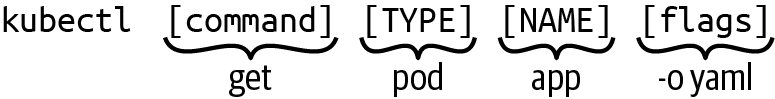

**Figure: kubectl usage pattern.** This visual shows the command/type/name/flags structure.

**How to read it:** Break commands into operation, resource type, resource name, and flags.

**Why it matters:** CKA speed depends on predictable command construction.

**How to apply it:** Practice `kubectl get`, `describe`, `logs`, `exec`, `apply`, `delete`, `create`, `run`, `scale`, `rollout`, `auth can-i`, and JSONPath/output flags.

**Limitations:** Some tasks require YAML fields not expressible conveniently through a single imperative command.

### Cluster Installation, Extension Interfaces, and Upgrades

- **Explanation:** The guide uses kubeadm to install and upgrade clusters, while introducing CNI, CRI, and CSI as the network, runtime, and storage extension interfaces.
- **Problem solved:** Cluster administrators need a repeatable way to bootstrap clusters and understand which plugins provide network, runtime, and storage behavior.
- **How it works:** kubeadm initializes the control plane, generates join commands, configures kubelet bootstrap, and supports upgrades. A Pod network add-on must be installed for normal Pod networking.
- **Why it matters:** A kubeadm cluster is not complete after `kubeadm init`; networking and worker node joining still matter.
- **When to use:** Use kubeadm concepts for CKA and for understanding many self-managed cluster flows.
- **When not to use:** In managed Kubernetes, provider tooling may hide kubeadm but not the underlying concepts. `[Inference]`
- **Tradeoffs:** kubeadm is explicit and educational, but production lifecycle requires additional automation around infrastructure, HA, certificates, and add-ons.
- **Common mistakes:** Forgetting the Pod CIDR needed by a CNI; joining workers before the control-plane endpoint is stable; upgrading workers before control-plane components; skipping drain/uncordon practices.
- **Production example:** Upgrade control-plane nodes first, then worker nodes, ensuring workloads are drained and rescheduled safely.
- **Questions to ask:** Which CNI is installed? Is etcd stacked or external? What is the upgrade order? Can workloads tolerate node drains?
- **Source reference:** Chapter 4.

**Figure: Process for a cluster installation.** This diagram shows kubeadm initialization, network add-on installation, worker joining, and status validation.

**How to read it:** Installation is a sequence: prepare nodes, initialize control plane, configure kubectl, install CNI, join workers, verify readiness.

**Why it matters:** Skipping one step often produces NotReady nodes or non-communicating Pods.

**How to apply it:** In exam practice, memorize the order and know which command proves each step worked.

**Limitations:** The diagram does not include production HA, infrastructure automation, or certificate lifecycle.

**Figure: Stacked etcd topology with three control-plane nodes.** etcd runs on the same nodes as control-plane components.

**How to read it:** Each control-plane node also participates in the etcd quorum, with a load balancer in front of the API servers.

**Why it matters:** Stacked topology is operationally simpler than external etcd but couples control-plane and datastore failure domains.

**How to apply it:** Use it when simplicity is more important than separating etcd infrastructure, and monitor quorum health carefully.

**Limitations:** The diagram does not show backup, latency, quorum-loss behavior, or disaster recovery.

**Figure: External etcd node topology.** etcd runs on separate nodes from the control plane.

**How to read it:** API servers depend on an external etcd cluster rather than local stacked members.

**Why it matters:** This separates control-plane compute failure from datastore failure but increases infrastructure and operational complexity.

**How to apply it:** Consider for production clusters requiring stronger isolation and dedicated etcd operations. `[Inference]`

**Limitations:** External etcd needs its own monitoring, backup, certificate management, and quorum design.

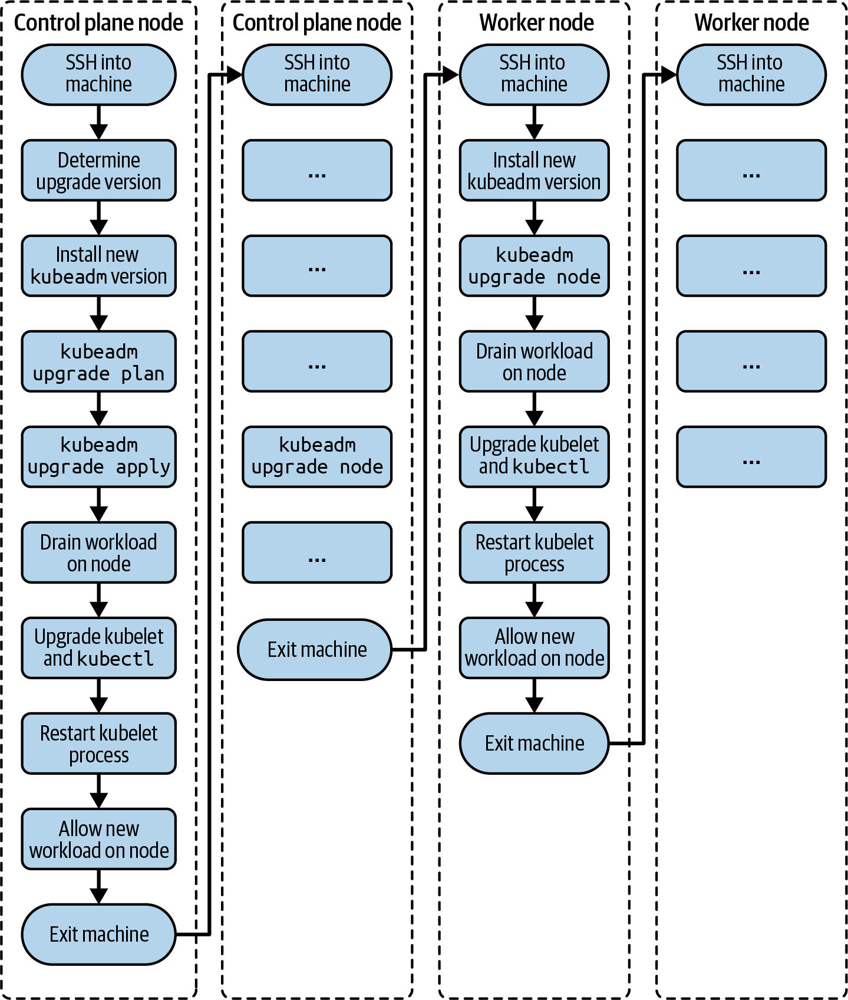

**Figure: Process for a cluster version upgrade.** This diagram shows upgrade order across control-plane and worker nodes.

**How to read it:** Upgrade cluster control-plane components first, then node components, draining workloads where appropriate.

**Why it matters:** Wrong upgrade order can violate Kubernetes version-skew rules and disrupt workloads.

**How to apply it:** Before any upgrade, check target versions, drain strategy, add-on compatibility, backups, and rollback plan.

**Limitations:** Actual version-skew policy and kubeadm commands must be verified for the target Kubernetes version.

### etcd Backup and Restore

- **Explanation:** etcd stores Kubernetes cluster state. Backing up and restoring etcd is the administrator's last line of defense for control-plane state loss.
- **Problem solved:** It provides recovery from catastrophic API state corruption or loss.
- **How it works:** `etcdctl` takes a snapshot using correct certificates and endpoints. Restore creates a new data directory from the snapshot and points etcd at restored state.
- **Why it matters:** Without a valid etcd backup, cluster object state may be unrecoverable.
- **When to use:** Use before risky control-plane operations, before upgrades, and as part of regular disaster recovery.
- **When not to use:** Do not treat etcd restore as a casual rollback for application deployment mistakes. Workload-level rollbacks should use controllers and app release mechanisms. `[Inference]`
- **Tradeoffs:** Snapshot restore can recover cluster state, but it may not restore external storage contents or cloud resources.
- **Common mistakes:** Missing certificates; using wrong endpoint; restoring snapshot without updating etcd manifest/data directory; assuming PVC data is part of etcd backup.
- **Production example:** Take an etcd snapshot before a cluster upgrade, test restore in a non-production environment, and document the commands.
- **Questions to ask:** Where is the snapshot stored? Are certificates available? Has restore been tested? Which data is not covered by etcd?
- **Source reference:** Chapter 5.

**Figure: Process for backing up and restoring etcd.** This diagram shows the recovery workflow around a disaster event.

**How to read it:** Backup must happen before disaster; restore happens after state loss and requires a known-good snapshot.

**Why it matters:** etcd backup is not useful unless the restore process is known and tested.

**How to apply it:** Practice `etcdctl snapshot save`, `snapshot status`, and restore commands with the certificate paths used by kubeadm.

**Limitations:** The visual does not cover external volumes, object storage snapshots, or managed-control-plane backup models.

### Authentication, RBAC, Service Accounts, and Admission

- **Explanation:** Kubernetes API requests pass through authentication, authorization, admission control, and then processing/persistence. RBAC maps subjects to verbs on resources through Roles/ClusterRoles and RoleBindings/ClusterRoleBindings. Service accounts give Pods an API identity.
- **Problem solved:** It controls who and what can act on cluster resources.
- **How it works:** kubeconfig provides clusters, users, and contexts for clients. The API server authenticates the request, checks RBAC authorization, applies admission controllers, and persists accepted changes. Service accounts are namespaced identities mountable into Pods.
- **Why it matters:** Many operational failures are access failures: users cannot list resources, Pods cannot access the API, or admission rejects a manifest.
- **When to use:** Always model API access explicitly for users, CI systems, controllers, and workloads.
- **When not to use:** Do not bind broad cluster-admin privileges to application service accounts for convenience.
- **Tradeoffs:** Narrow RBAC reduces blast radius but requires careful troubleshooting and role design.
- **Common mistakes:** Binding a Role in the wrong namespace; using ClusterRoleBinding when RoleBinding is enough; forgetting that service accounts are namespaced; confusing authentication with authorization.
- **Production example:** A controller Pod uses a service account bound to a Role that allows only required verbs on its CRDs and related resources.
- **Questions to ask:** Who is the subject? Which verbs? Which API groups and resources? Which namespace? Is admission mutating or rejecting the object?
- **Source reference:** Chapter 6.

**Figure: API server request processing.** The request path is authentication, authorization, admission control, then processing.

**How to read it:** A request can fail at each gate for different reasons.

**Why it matters:** Troubleshooting access requires identifying the failed phase, not just reading a generic "forbidden" or validation error.

**How to apply it:** Use `kubectl config view`, `kubectl auth can-i`, role inspection, and event/error messages to locate the phase.

**Limitations:** The diagram does not show audit logging, webhooks, or all admission plugin behavior.

**Figure: RBAC key building blocks.** RBAC combines subjects, resources, and operations.

**How to read it:** Permissions answer "who can do which verb to which resource."

**Why it matters:** RBAC mistakes usually come from one missing dimension: wrong subject, resource, verb, API group, or namespace.

**How to apply it:** Write RBAC rules by starting with exact required commands, then translate them into verbs/resources.

**Limitations:** RBAC is only authorization; it does not authenticate the subject or validate object content.

**Figure: RBAC primitives.** Roles define permissions; bindings attach them to users, groups, or service accounts.

**How to read it:** A Role/ClusterRole is inert until bound. A binding chooses scope and subject.

**Why it matters:** Scope errors create either denied access or excessive access.

**How to apply it:** Prefer namespace-scoped RoleBinding for namespace-scoped work. Use ClusterRoleBinding only when cluster-wide access is required.

**Limitations:** Aggregated ClusterRoles and admission controls can complicate effective permissions.

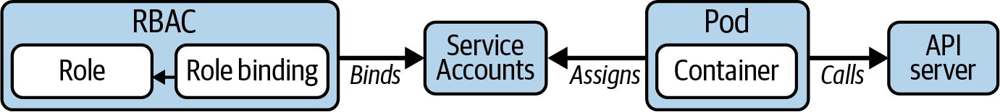

**Figure: Using a service account to communicate with an API server.** This diagram shows how a Pod obtains API identity.

**How to read it:** The Pod uses a service account token to authenticate, then RBAC determines allowed operations.

**Why it matters:** Workload identity is separate from human identity.

**How to apply it:** Create dedicated service accounts per workload/controller and bind minimal permissions.

**Limitations:** Token projection, rotation, and external identity integrations are deeper topics not fully covered by the diagram.

### Operators, CRDs, Helm, and Kustomize

- **Explanation:** CRDs extend the Kubernetes API with custom resource types. Operators pair CRDs with controllers that reconcile custom resources. Helm packages templates and values into charts. Kustomize overlays patch and compose YAML without templating.
- **Problem solved:** These tools extend, package, and customize Kubernetes beyond core primitives.
- **How it works:** A CRD registers a schema; a custom resource stores desired state; an operator/controller watches and reconciles it. Helm renders charts into manifests. Kustomize composes bases and overlays.
- **Why it matters:** Administrators must distinguish API extension from packaging. Installing a chart is not the same as installing a controller that reconciles a CRD.
- **When to use:** Use operators for domain-specific automation, Helm for reusable applications with values, and Kustomize for environment-specific manifest overlays.
- **When not to use:** Avoid operators when simple manifests and native controllers are enough. Avoid Helm charts you cannot inspect or upgrade safely. `[Inference]`
- **Tradeoffs:** Operators encode operational knowledge but add controller risk. Helm simplifies distribution but can hide generated manifests. Kustomize preserves YAML but can become overlay sprawl.
- **Common mistakes:** Installing CRs before CRDs; ignoring controller namespace; upgrading charts without checking rendered diffs; using Kustomize patches that future maintainers cannot trace.
- **Production example:** Install a database operator CRD/controller, then create a database custom resource; package app manifests with Helm; overlay environment differences with Kustomize.
- **Questions to ask:** What reconciles this object? Is the CRD installed? What manifests will Helm render? Which overlay changed this field?
- **Source reference:** Chapters 7-8.

**Figure: The Kubernetes operator pattern.** This diagram shows a CRD, custom resource, and controller loop.

**How to read it:** The user creates custom desired state; the operator observes and reconciles real resources.

**Why it matters:** Operators are Kubernetes-native automation, not just installers.

**How to apply it:** Before installing an operator, inspect its CRDs, permissions, controller deployment, upgrade process, and backup implications.

**Limitations:** Operator quality varies, and a faulty controller can continuously mutate cluster state.

## 4. Chapter-by-Chapter Knowledge Extraction

### Chapter 1: Exam Details and Resources

The chapter frames the CKA as a practical performance exam. It covers the Kubernetes certification path, exam objectives, curriculum domains, relevant primitives, documentation, command-line productivity, time management, and practice strategy. The engineering lesson is that administration is learned by operating resources under constraints, not by memorizing definitions.

Key decisions: set context and namespace deliberately, use `kubectl` aliases and completion, internalize short names, and practice against realistic clusters. Production risk: the same context/namespace mistakes that cost exam time can damage real clusters.

Self-check: Can you identify the active context and namespace before every command? Can you generate YAML quickly? Can you explain which primitive belongs to which exam objective?

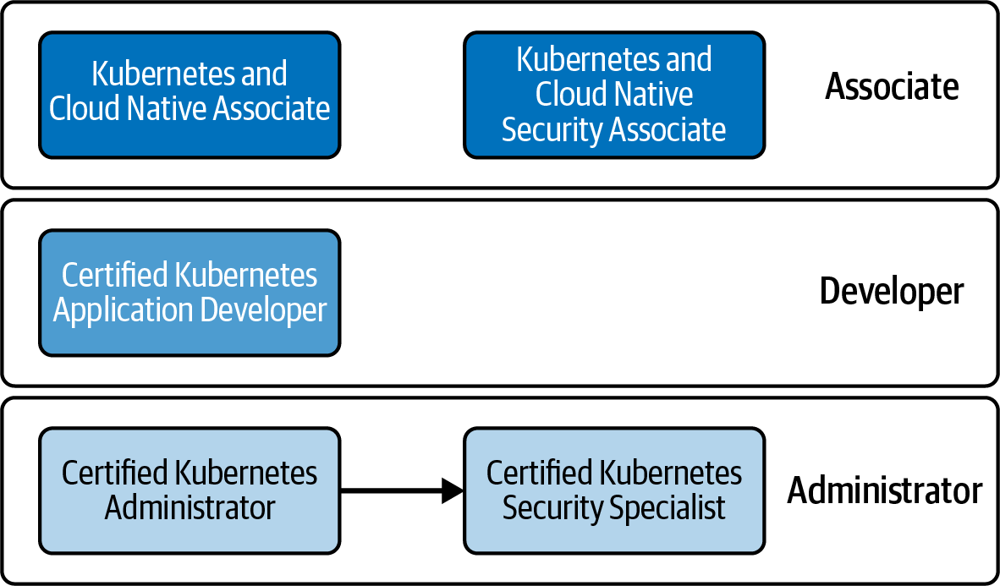

**Figure: Kubernetes certifications learning path.** The visual places CKA among related CNCF certifications.

**How to read it:** CKA is administrator-focused, different from developer, security, and associate tracks.

**Why it matters:** The scope clarifies why this book emphasizes cluster operations, troubleshooting, and infrastructure-facing primitives.

**How to apply it:** Use the CKA lens when prioritizing practice: cluster lifecycle, RBAC, scheduling, storage, networking, and troubleshooting.

**Limitations:** Certification programs can change; verify current CNCF objectives.

**Figure: Kubernetes primitives relevant to the exam.** The diagram maps the exam surface area to resource types.

**How to read it:** Treat it as a dependency map for practice, not a checklist of isolated nouns.

**Why it matters:** CKA tasks usually combine primitives: Deployment plus Service, Pod plus PVC, Service plus selector, Role plus RoleBinding.

**How to apply it:** Practice multi-resource scenarios rather than single-command drills.

**Limitations:** It is tied to the source's exam view and should be checked against current exam objectives.

### Chapter 2: Kubernetes in a Nutshell

The chapter teaches the architecture baseline: Kubernetes orchestrates containerized workloads through control-plane and node components. The important engineering connection is that every later topic attaches to this architecture: RBAC gates API requests, scheduler chooses nodes, kubelet runs containers, services route to Pods, and metrics/troubleshooting inspect this running system.

Production risks include overloaded nodes, unavailable API server, unhealthy etcd, broken CNI, and controllers that cannot reconcile.

Self-check: Can you name the component responsible for scheduling, node execution, API access, controller loops, and persistent cluster state?

### Chapter 3: Interacting with Kubernetes

The chapter explains API objects and `kubectl` workflows. It contrasts imperative, declarative, and hybrid management. The durable lesson is that `kubectl` is an API client; understanding object schema and command output is more important than memorizing one command form.

Tradeoff: Imperative commands help create or inspect resources quickly, while declarative manifests support review and repeatability. The hybrid exam workflow is often: generate YAML imperatively, edit it, apply it, and inspect the result.

Self-check: Can you create, patch, replace, delete, and apply objects? Can you explain when `create`, `apply`, and `replace` differ?

### Chapter 4: Cluster Installation and Upgrade

The chapter covers kubeadm-based cluster installation, CNI/CRI/CSI, Pod network add-on installation, worker joining, HA topology options, and cluster upgrades. The engineering lesson is sequencing: cluster installation and upgrade are ordered workflows with dependency checks.

Production risks: NotReady nodes after missing CNI, unsafe upgrade order, no etcd backup, draining nodes without capacity, and HA designs that do not preserve etcd quorum.

Self-check: Can you install a cluster, add a Pod network, join workers, and upgrade control-plane and worker nodes in the right order?

### Chapter 5: Backing Up and Restoring etcd

The chapter focuses on `etcdctl`, snapshots, and restore. The operational lesson is that cluster-state backup must be specific, tested, and separate from application data backup.

Production risks: Bad snapshot path, missing certs, wrong endpoint, restore process not tested, assuming PV contents are backed up by etcd.

Self-check: Can you locate etcd certificates in a kubeadm cluster and run snapshot/restore commands under pressure?

### Chapter 6: Authentication, Authorization, and Admission Control

The chapter explains API request processing, kubeconfig, RBAC, service accounts, and admission control. The practical lesson is that Kubernetes security is request-flow reasoning.

Production risks: over-broad ClusterRoleBindings, namespace confusion, service accounts with unnecessary access, and admission policies that block workloads unexpectedly.

Self-check: Can you create a Role and RoleBinding, verify access with `kubectl auth can-i`, and bind permissions to a service account?

### Chapter 7: Operators and CRDs

This chapter introduces Kubernetes extensibility through CRDs and operators. The operational lesson is that CRDs add new API types, while controllers/operators make those types useful by reconciling them.

Production risks: installing untrusted operators, leaving CRDs after controller removal, broad operator RBAC, and unknown upgrade behavior.

Self-check: Can you discover CRDs, create a custom resource, and identify the controller watching it?

### Chapter 8: Helm and Kustomize

The chapter teaches package management and manifest customization. Helm manages charts and releases; Kustomize composes and patches manifests. The administrator's job is to understand what will be applied, not just run the tool.

Production risks: blind chart installation, values drift, unreviewed generated YAML, and overlays that hide changes.

Self-check: Can you add a Helm repository, install/upgrade/uninstall a chart, and build Kustomize overlays?

### Chapter 9: Pods and Namespaces

The chapter covers Pod creation, phases, restarts, logs, exec, temporary Pods, Pod IP communication, environment variables, command arguments, and namespaces. The engineering lesson is that Pods are the smallest schedulable unit but rarely the durable administrative boundary.

Production risks: debugging only application logs while ignoring Pod status/events, relying on Pod IPs for stable connectivity, namespace mistakes, and assuming container restarts mean Pod replacement.

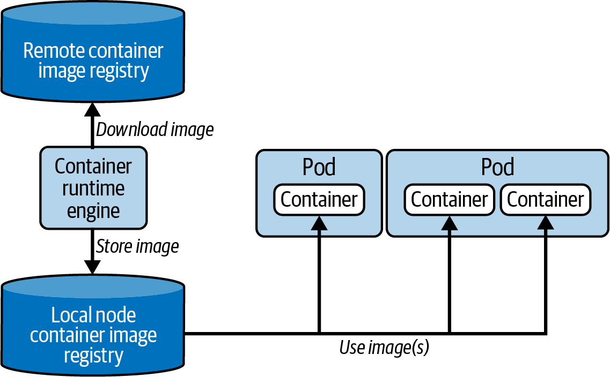

**Figure: CRI interaction with container images.** This visual shows remote registry, local image cache, and runtime interaction.

**How to read it:** Image pull behavior sits between Pod scheduling and container start.

**Why it matters:** ImagePullBackOff and ErrImagePull failures are runtime/image-path problems, not scheduler problems.

**How to apply it:** Check image name, tag, registry credentials, node network access, and runtime events.

**Limitations:** It does not cover every runtime or private registry auth pattern.

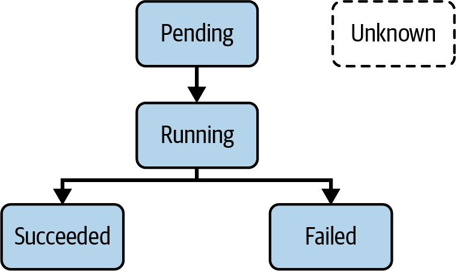

**Figure: Pod lifecycle phases.** The visual shows Pending, Running, Succeeded, Failed, and Unknown.

**How to read it:** Phase summarizes Pod lifecycle, but details live in conditions, container statuses, and events.

**Why it matters:** Correct diagnosis starts by separating scheduling, image pull, container start, crash, and completion states.

**How to apply it:** Use `kubectl get pod`, `describe`, logs, events, and status fields together.

**Limitations:** Phase alone is too coarse for many failures.

### Chapter 10: ConfigMaps and Secrets

The chapter teaches externalized configuration and sensitive data injection through environment variables or volumes. The key operational distinction: ConfigMaps are for non-sensitive config; Secrets are for sensitive values, but base64 encoding is not encryption.

Production risks: putting secrets in ConfigMaps, assuming Secret data is encrypted by default everywhere, leaking env vars in logs/debug dumps, and forgetting mounted config update behavior.

**Figure: Consuming configuration data.** The visual shows ConfigMaps and Secrets injected as environment variables or mounted volumes.

**How to read it:** Configuration can enter containers at process start through env vars or through files mounted from volumes.

**Why it matters:** Delivery mechanism affects update behavior and exposure risk.

**How to apply it:** Use ConfigMaps for app config, Secrets for sensitive values, and choose env vars versus volume mounts based on runtime reload needs.

**Limitations:** The diagram does not cover external secret managers, encryption at rest, or secret rotation strategies.

### Chapter 11: Deployments and ReplicaSets

This chapter covers Deployments, ReplicaSets, Pod template selection, replica replacement, rolling updates, and rollbacks. The core model is ownership: a Deployment owns ReplicaSets, and ReplicaSets own Pods. Updates happen by changing the Pod template.

Production risks: selectors that do not match template labels, rollouts without readiness checks, failing to preserve rollout history, and manual Pod edits that vanish when controllers reconcile.

**Figure: Deployment to ReplicaSet to Pods.** This diagram shows controller ownership hierarchy.

**How to read it:** The Deployment manages ReplicaSets; ReplicaSets maintain matching Pods.

**Why it matters:** Deleting or editing the wrong layer can produce surprising reconciliation behavior.

**How to apply it:** For rollout problems, inspect Deployment, ReplicaSet, and Pod status in sequence.

**Limitations:** The diagram does not show revision history, conditions, or rollout strategy fields.

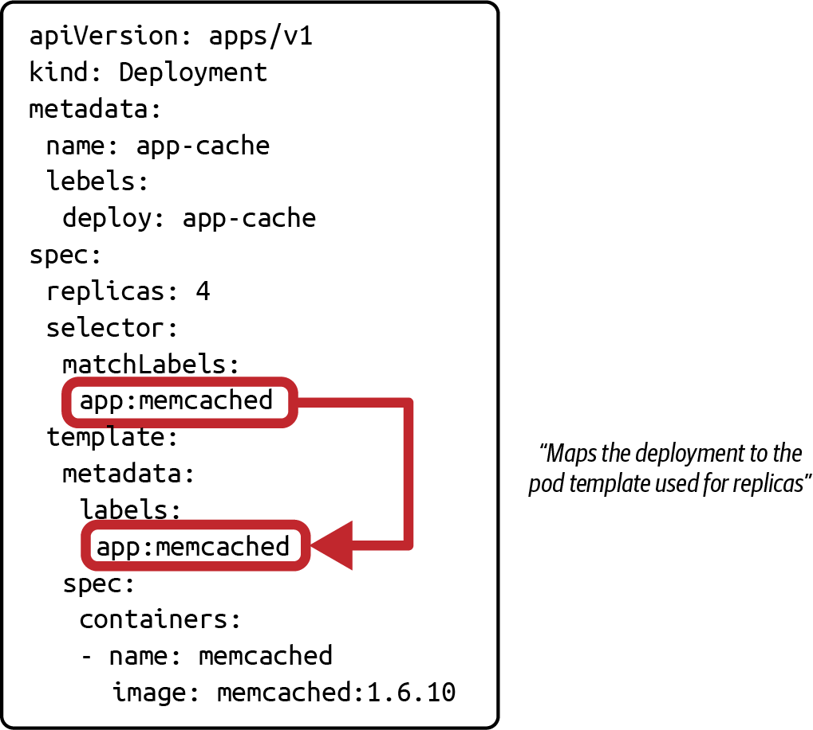

**Figure: Deployment label selection.** This visual ties selectors to Pod template labels.

**How to read it:** The selector must match labels on the Pod template.

**Why it matters:** A selector mismatch can prevent ownership or route traffic incorrectly through related Services.

**How to apply it:** Check selectors and labels before applying workload manifests.

**Limitations:** It shows the simple case, not advanced selector expressions.

**Figure: Rolling update strategy.** This diagram shows new Pods replacing old Pods while traffic continues.

**How to read it:** Rollout gradually shifts capacity from old ReplicaSet to new ReplicaSet.

**Why it matters:** Rolling updates reduce downtime but require readiness probes and capacity headroom to be safe. `[Inference]`

**How to apply it:** Use `kubectl rollout status`, inspect ReplicaSets, and rollback when new Pods fail readiness or crash.

**Limitations:** The diagram does not include readiness gates, maxUnavailable, maxSurge, or application compatibility issues.

### Chapter 12: Scaling Workloads

The chapter explains manual scaling and Horizontal Pod Autoscaler behavior. Scaling changes replica count manually or through metrics-driven control.

Production risks: no metrics server, missing resource requests, scaling on misleading metrics, and scaling a workload whose bottleneck is not CPU/memory.

**Figure: Autoscaling a Deployment.** This visual shows HPA reading metrics and adjusting replicas.

**How to read it:** HPA is a controller loop: observe metrics, compare target, update scale subresource.

**Why it matters:** Autoscaling requires metrics availability and sensible requests/targets.

**How to apply it:** Install metrics support, define resource requests, configure HPA targets, and observe behavior under load.

**Limitations:** HPA does not solve node capacity; cluster autoscaling is a separate concern. `[Inference]`

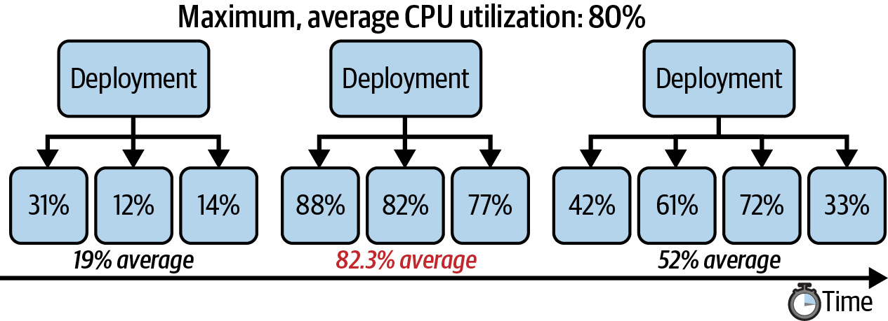

**Figure: Autoscaling a Deployment horizontally.** The visual shows CPU utilization crossing a threshold.

**How to read it:** When observed metric exceeds target, HPA increases replicas; when it drops, it can scale down.

**Why it matters:** Scaling decisions are delayed and metric-driven, not instantaneous.

**How to apply it:** Validate metric collection and expected stabilization behavior during load tests.

**Limitations:** The diagram abstracts away cooldowns, missing metrics, and multi-metric behavior.

### Chapter 13: Resource Requirements, Limits, and Quotas

This chapter teaches container requests, limits, ResourceQuotas, and LimitRanges. Requests influence scheduling; limits constrain runtime usage; quotas govern namespace-level aggregate consumption; LimitRanges set defaults and min/max boundaries.

Production risks: Pods Pending from unsatisfiable requests, CPU throttling from low limits, OOMKilled containers, namespaces without quotas, and quotas without LimitRanges causing unexpected admission failures.

Self-check: Can you explain what requests do at scheduling time and what limits do at runtime?

### Chapter 14: Pod Scheduling

The chapter covers scheduler filtering/scoring, node selectors, node affinity, anti-affinity, taints, tolerations, and topology spread constraints. The durable lesson is that scheduling is explicit constraint modeling.

Production risks: overconstrained Pods, taints without matching tolerations, affinity that prevents recovery, and topology spread constraints that cannot be satisfied.

**Figure: Pod scheduling algorithm.** The scheduler filters nodes, scores feasible nodes, and selects one.

**How to read it:** First remove impossible nodes, then rank remaining nodes.

**Why it matters:** Pending Pods usually mean no node passed filtering, not that the scheduler is idle.

**How to apply it:** Inspect events for failed scheduling reasons: resources, selectors, affinity, taints, or volume constraints.

**Limitations:** The visual simplifies the scheduler framework and plugins.

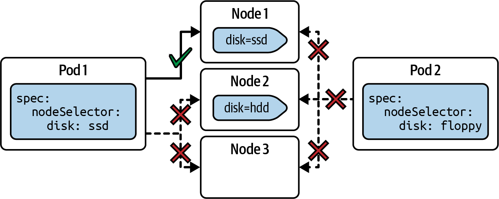

**Figure: Node selector scenarios.** This diagram shows strict label-based placement.

**How to read it:** A Pod with `nodeSelector` can schedule only on nodes with matching labels.

**Why it matters:** Node selectors are simple but rigid.

**How to apply it:** Use for hard placement requirements; verify node labels before applying.

**Limitations:** Node selectors cannot express preferred placement or complex logical conditions.

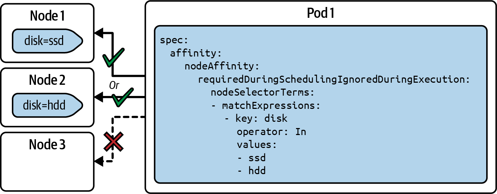

**Figure: Node affinity scenarios.** This visual shows richer scheduling rules than node selectors.

**How to read it:** Affinity can express required and preferred placement with operators.

**Why it matters:** It lets administrators encode placement intent without hardcoding only one node label path.

**How to apply it:** Use required rules for correctness constraints and preferred rules for optimization.

**Limitations:** Strong affinity can reduce availability if too few nodes match.

**Figure: Taints and tolerations scenarios.** Taints repel Pods unless they tolerate the taint.

**How to read it:** Taints belong to nodes; tolerations belong to Pods.

**Why it matters:** This is the standard model for reserving or isolating nodes.

**How to apply it:** Use taints for special nodes, then add tolerations only to workloads allowed there.

**Limitations:** Tolerations permit scheduling but do not force it; combine with affinity when needed.

### Chapter 15: Volumes

The chapter introduces Pod volumes as data shared across containers or preserved across container restarts within the Pod lifecycle. The lesson is that container filesystems are ephemeral; volumes define explicit storage behavior.

Production risks: assuming a volume outlives the Pod, using temporary volumes for durable data, and forgetting read-only mounts.

**Figure: A container using the temporary filesystem versus a volume.** This visual contrasts ephemeral container storage with Pod volumes.

**How to read it:** Container-local files disappear with the container lifecycle; mounted volumes provide an explicit shared storage location.

**Why it matters:** State durability must be designed, not assumed.

**How to apply it:** Use volumes for shared files within a Pod and PersistentVolumes/PVCs for durable storage across Pod replacement.

**Limitations:** Not all volume types are durable; volume behavior depends on type.

### Chapter 16: Persistent Volumes

The chapter covers PVs, PVCs, static and dynamic provisioning, volume mode, access mode, reclaim policy, node affinity, StorageClasses, and mounting claims in Pods.

Production risks: PVC Pending from no matching PV/StorageClass, wrong access mode, unexpected data deletion from reclaim policy, and node affinity preventing scheduling.

**Figure: Claiming a persistent volume from a Pod.** This diagram shows Pod -> PVC -> PV relationship.

**How to read it:** The Pod asks for storage through a PVC; the PVC binds to a compatible PV or dynamically provisioned volume.

**Why it matters:** Workloads should not bind directly to storage implementation details.

**How to apply it:** Debug storage by checking Pod events, PVC phase, PV capacity/access modes/reclaim policy, and StorageClass.

**Limitations:** The diagram does not show CSI driver behavior or provider-specific storage constraints.

### Chapter 17: Services

The chapter explains Service types, label selection, port mapping, ClusterIP, NodePort, and LoadBalancer. The core lesson is that Services create stable virtual access to dynamic Pods.

Production risks: selector mismatch, wrong `targetPort`, NodePort exposure surprises, cloud LoadBalancer cost/exposure, and debugging Service DNS without checking endpoints.

**Figure: Service traffic routing based on label selection.** The Service sends traffic only to selected Pods.

**How to read it:** Matching labels determine backend endpoint membership.

**Why it matters:** Many "service is down" issues are really selector or label issues.

**How to apply it:** Always compare Service selector, Pod labels, and Endpoints/EndpointSlices.

**Limitations:** It does not show readiness filtering or EndpointSlice details.

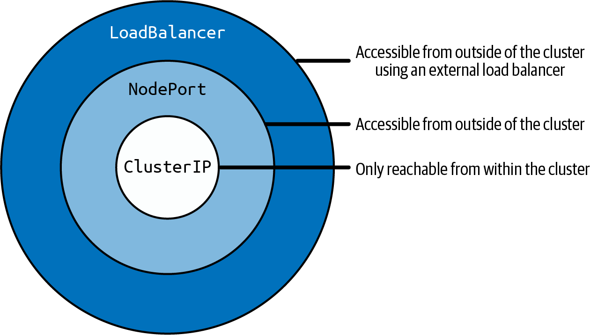

**Figure: Network accessibility characteristics for Service types.** This visual layers ClusterIP, NodePort, and LoadBalancer.

**How to read it:** ClusterIP is internal; NodePort exposes a node port; LoadBalancer asks infrastructure for an external load balancer.

**Why it matters:** Service type is an exposure and operations decision.

**How to apply it:** Choose ClusterIP for internal-only, NodePort for simple node-level exposure, and LoadBalancer when cloud/provider integration is needed.

**Limitations:** Ingress and Gateway API often provide better HTTP routing than raw LoadBalancer Services.

**Figure: Service port mapping.** The Service listens on one port and forwards to a Pod target port.

**How to read it:** `port` is the Service-facing port; `targetPort` is the container/Pod-facing port.

**Why it matters:** Wrong port mapping produces connectivity failures even when labels are correct.

**How to apply it:** Debug by checking Service `port`, `targetPort`, Pod container ports, and endpoint ports.

**Limitations:** Container port declarations are documentation for many cases; actual listening process still matters.

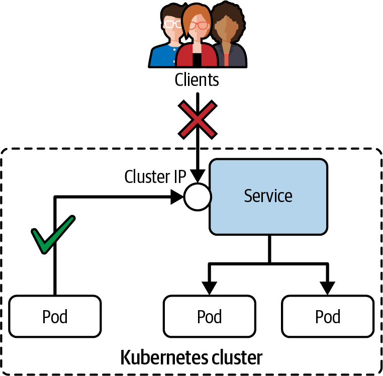

**Figure: Accessibility of a ClusterIP Service.** This visual shows internal-only cluster access.

**How to read it:** Clients inside the cluster can reach the Service; external clients cannot directly use ClusterIP.

**Why it matters:** ClusterIP is the default safe internal service abstraction.

**How to apply it:** Use ClusterIP behind Ingress/Gateway or for service-to-service communication.

**Limitations:** It does not show DNS names or cross-namespace access patterns.

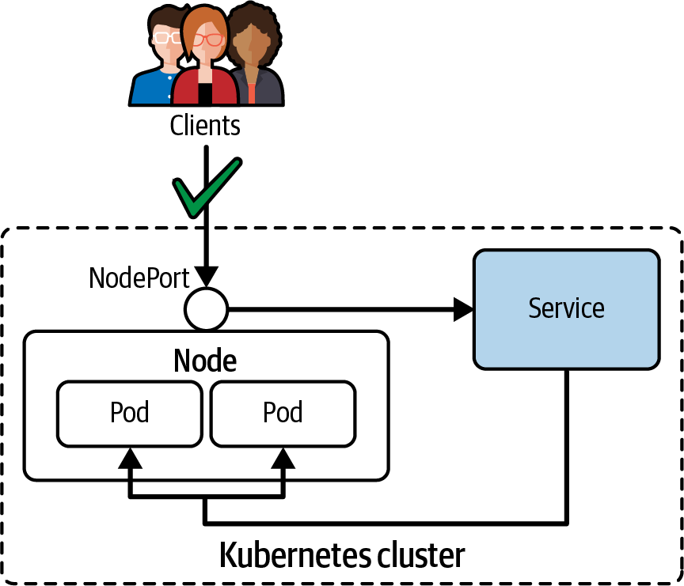

**Figure: Accessibility of a NodePort Service.** This visual shows external access through node IPs and a fixed port.

**How to read it:** Traffic hits any node on the NodePort and is forwarded to selected Pods.

**Why it matters:** NodePort can expose workloads broadly and depends on node network reachability.

**How to apply it:** Use carefully for lab, simple, or infrastructure-integrated cases; prefer higher-level ingress routing for HTTP apps where appropriate.

**Limitations:** Firewalls, node IP reachability, and source traffic policy affect real behavior.

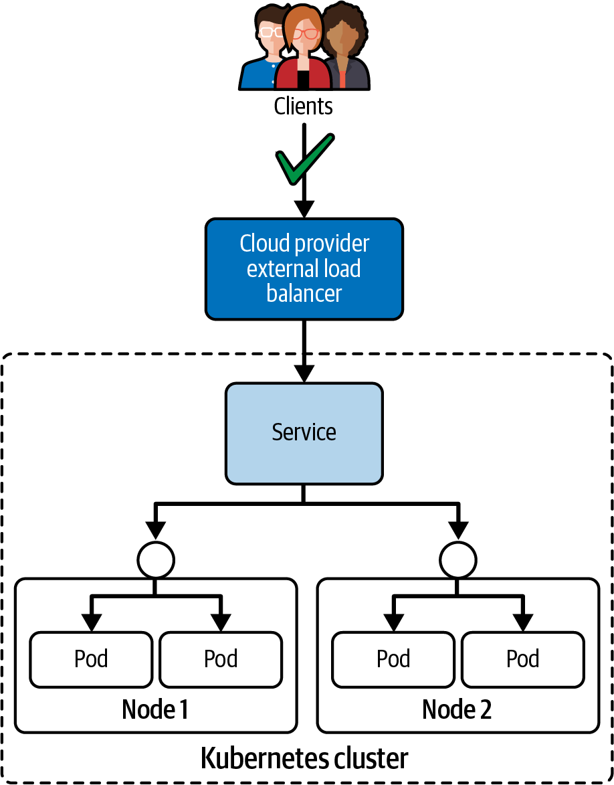

**Figure: Accessibility of a LoadBalancer Service.** This visual shows cloud/provider load balancer integration.

**How to read it:** External load balancer sends traffic to the Service and then to selected Pods.

**Why it matters:** LoadBalancer is convenient but provider-dependent and can create cost/security exposure.

**How to apply it:** Use for externally reachable services when provider integration is available; secure with firewall/security policy where needed.

**Limitations:** Behavior differs by cloud provider and load balancer implementation.

### Chapter 18: Ingresses

The chapter explains Ingress controllers, multiple controllers, rules, path types, TLS support, and access. The key distinction is that an Ingress object is inert without a controller that implements it.

Production risks: installing the object but no controller, ambiguous path rules, wrong IngressClass, TLS secret mistakes, and relying on controller-specific annotations without documenting them.

**Figure: Managing external access to Services via HTTP(S).** Ingress routes external HTTP(S) traffic to Services.

**How to read it:** Client traffic reaches a load balancer/controller, then rules route to Services.

**Why it matters:** Ingress centralizes HTTP routing instead of exposing every Service separately.

**How to apply it:** Install a controller, define IngressClass/rules, validate path matching, and test external access.

**Limitations:** Ingress is less expressive than Gateway API for some multi-team and advanced routing use cases.

### Chapter 19: Gateway API

The chapter introduces Gateway API as a more expressive successor/complement to Ingress for traffic management. It separates infrastructure and application personas through GatewayClass, Gateway, and HTTPRoute resources.

Production risks: missing CRDs/controller, misunderstanding which persona owns which resource, and migration gaps from Ingress.

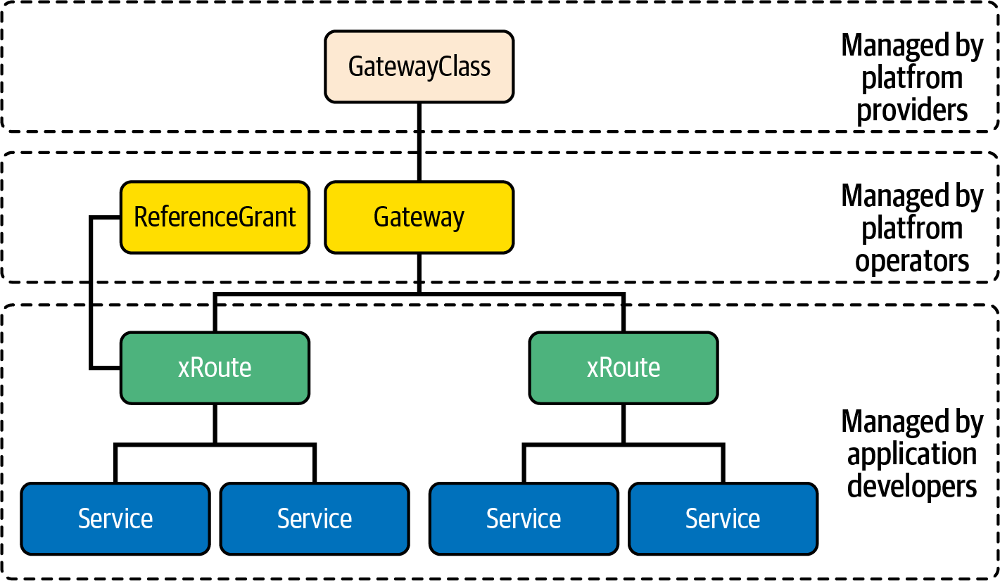

**Figure: Gateway API resources managed by personas.** This visual maps GatewayClass, Gateway, and Routes to responsibilities.

**How to read it:** Infrastructure/platform owners manage classes and gateways; app owners attach routes.

**Why it matters:** Gateway API improves delegation and role separation.

**How to apply it:** Use Gateway API when teams need clearer separation between shared ingress infrastructure and application routing.

**Limitations:** Controller support and feature conformance vary; verify current status.

**Figure: Gateway API HTTP traffic routing.** This diagram shows external traffic routed through Gateway and HTTPRoute to Services.

**How to read it:** Gateway accepts traffic; HTTPRoute binds routing rules to backend Services.

**Why it matters:** It makes HTTP routing explicit and composable.

**How to apply it:** Confirm GatewayClass/controller, Gateway listeners, HTTPRoute parentRefs, hostnames, paths, and backendRefs.

**Limitations:** The visual does not show all route types or policy attachment models.

### Chapter 20: Network Policies

The chapter teaches NetworkPolicy selectors, ingress/egress rules, default policies, port restrictions, and the requirement for a network policy controller. The operational lesson: Services route traffic; NetworkPolicies permit or deny Pod traffic.

Production risks: assuming policies work without a supporting CNI, selecting the wrong Pods, forgetting egress, and blocking DNS.

**Figure: Network policies define traffic from and to a Pod.** This visual shows permitted and restricted communication.

**How to read it:** Policies select Pods, then define allowed ingress or egress peers and ports.

**Why it matters:** Network isolation is allow-list logic once policies select a Pod.

**How to apply it:** Start with default-deny, then add explicit allow rules and test from temporary Pods.

**Limitations:** Enforcement depends on the CNI plugin.

**Figure: Limiting traffic to and from a Pod.** This visual shows application-specific network isolation.

**How to read it:** Only selected sources/destinations and ports are allowed.

**Why it matters:** Least-privilege networking reduces lateral movement and accidental dependencies.

**How to apply it:** Define policies around application communication contracts, then test positive and negative paths.

**Limitations:** NetworkPolicy does not replace authentication, authorization, or encryption.

### Chapter 21: Troubleshooting Applications

The chapter teaches Pod, container, Service, DNS, network policy, and metrics troubleshooting. The workflow is inspect broad state first, then narrow.

Production risks: debugging the wrong layer, not checking events, ignoring endpoint selection, attempting shell access to distroless containers, and missing metrics-server prerequisites.

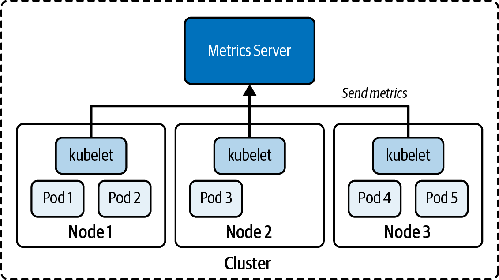

**Figure: Data collection for the Metrics Server.** The visual shows kubelets feeding metrics into Metrics Server.

**How to read it:** Metrics Server gathers resource metrics from nodes/kubelets for APIs consumed by `kubectl top` and autoscalers.

**Why it matters:** HPA and resource inspection depend on metrics pipeline health.

**How to apply it:** When `kubectl top` or HPA fails, inspect Metrics Server deployment, APIService, node/kubelet connectivity, and certificates.

**Limitations:** Metrics Server is not a full observability stack; it does not replace logs, traces, or long-term monitoring.

### Chapter 22: Troubleshooting Clusters

This chapter covers node status, cluster components, kubelet, resources, certificates, kube-proxy, and cluster-info. The key lesson is to separate workload failure from cluster infrastructure failure.

Production risks: NotReady nodes from kubelet/runtime/network issues, expired certificates, unavailable control-plane Pods, resource pressure, and kube-proxy/network failures that look like app outages.

Self-check: Can you diagnose a NotReady node using node conditions, kubelet status, system logs, available resources, and certificate validity?

## 5. Architecture Decision Guide

| Decision | Choose Option A When | Choose Option B When | Key Tradeoffs | Failure Risks | Questions To Ask |
|---|---|---|---|---|---|
| Imperative vs declarative object management | Imperative when speed matters or generating a starter manifest. | Declarative when change must be repeatable and reviewable. | Speed vs auditability. | Drift, accidental context/namespace changes. | Does this change need to survive review and source control? |
| RoleBinding vs ClusterRoleBinding | RoleBinding when access should be namespace-scoped. | ClusterRoleBinding when access truly spans the cluster. | Least privilege vs convenience. | Over-broad access, denied operations. | Which namespace and resources are required? |
| Role vs ClusterRole | Role for namespace-scoped permissions. | ClusterRole for cluster-scoped resources or reusable role definitions. | Narrowness vs reuse. | Granting cluster permissions accidentally. | Is the resource namespaced? |
| kubeadm stacked etcd vs external etcd | Stacked when simpler HA is enough. | External when datastore isolation is required. | Simpler operations vs stronger separation. | Quorum loss, complex recovery. | Who operates etcd and monitors quorum? |
| Helm vs Kustomize | Helm when packaging reusable software with configurable values. | Kustomize when composing/patching existing manifests without templates. | Distribution vs transparent overlays. | Hidden generated YAML, overlay sprawl. | Do we need package lifecycle or environment patches? |
| Deployment vs raw Pod | Deployment when Pods should be replicated, rolled out, and replaced. | Raw Pod only for simple one-off or exam/debug cases. | Controller reliability vs simplicity. | Unmanaged Pod loss. | Should Kubernetes recreate this workload? |
| ConfigMap vs Secret | ConfigMap for non-sensitive config. | Secret for sensitive values. | Simplicity vs data protection requirements. | Secret leakage, config drift. | Is the value sensitive, and how is it rotated? |
| env var vs mounted config | Env var when config is read at process start. | Volume when file-style config or reload behavior is needed. | Simple process config vs dynamic files. | Stale config, leaked env values. | Does the app reload files? |
| requests vs limits | Requests when scheduler needs capacity reservation. | Limits when runtime usage must be capped. | Predictable placement vs throttling/OOM risk. | Pending Pods, CPU throttling, OOMKilled. | What resource does the workload actually need? |
| nodeSelector vs affinity | nodeSelector for simple hard label matching. | Affinity for required/preferred complex placement. | Simplicity vs expressiveness. | Overconstraint, poor resilience. | Is placement mandatory or preferred? |
| taints/tolerations vs affinity | Taints/tolerations to repel general workloads from nodes. | Affinity to attract workloads to nodes. | Exclusion vs placement preference. | Unexpected scheduling or no scheduling. | Are we reserving nodes or choosing preferred nodes? |
| temporary volume vs PVC | Temporary volume for ephemeral/shared-in-Pod data. | PVC for durable storage across Pod replacement. | Simplicity vs durability. | Data loss. | Must data survive Pod deletion? |
| static vs dynamic PV provisioning | Static when pre-created storage must be bound. | Dynamic when StorageClass can provision on demand. | Control vs automation. | Pending PVC, wrong reclaim behavior. | Who creates storage and who cleans it up? |
| ClusterIP vs NodePort vs LoadBalancer | ClusterIP for internal services. | NodePort/LoadBalancer for external exposure. | Internal safety vs external reachability. | Unwanted exposure, port mismatch. | Who needs to access the service and from where? |
| Ingress vs Gateway API | Ingress for common HTTP routing with established controller support. | Gateway API for richer routing and persona separation. | Simplicity/maturity vs expressiveness/delegation. | Missing controller, ambiguous rules. | Who owns shared entry infrastructure? |
| Service vs NetworkPolicy | Service routes traffic to selected Pods. | NetworkPolicy permits or denies Pod traffic. | Discovery/routing vs isolation. | No endpoints, blocked DNS/traffic. | Is the issue reachability or permission? |

## 6. System Design Playbooks

### Playbook: Build and Operate a kubeadm Cluster

- **Use case:** Self-managed Kubernetes cluster for lab, CKA practice, or controlled production-like environment.
- **Requirements to clarify first:** Kubernetes version, node OS, runtime, Pod CIDR, CNI, control-plane HA, etcd topology, certificate lifecycle, backup/restore, upgrade policy.
- **Baseline architecture:** One or more control-plane nodes, worker nodes, kubeadm bootstrap, CNI add-on, kubelet on every node, API endpoint, etcd backup process.
- **Scaling path:** Single control plane for learning -> stacked HA control plane -> external etcd only when operational isolation is justified.
- **Reliability strategy:** Multiple control-plane nodes, load-balanced API endpoint, etcd quorum, tested backups, drain/upgrade runbooks.
- **Security strategy:** Locked-down node access, certificate management, RBAC least privilege, controlled kubeconfig distribution.
- **Observability strategy:** Node readiness, control-plane component health, kubelet logs, etcd health, CNI status, API server errors.
- **Common failure modes:** Missing CNI, NotReady nodes, etcd quorum issues, certificate expiry, failed upgrade, kubelet not running.
- **Source grounding:** Chapters 4, 5, 22.

### Playbook: Deploy and Expose a Stateless Web Application

- **Use case:** Run an HTTP application on Kubernetes with rollout and service exposure.
- **Requirements to clarify first:** Replica count, image, ports, config, secrets, resource requests, readiness, exposure scope, routing rules.
- **Baseline architecture:** Deployment -> ReplicaSet -> Pods, ConfigMaps/Secrets, Service, optional Ingress or Gateway API.
- **Scaling path:** Manual replicas -> HPA with Metrics Server -> topology spread and anti-affinity if high availability matters.
- **Reliability strategy:** Rolling updates, rollback, readiness probes `[Inference]`, Service endpoint validation.
- **Security strategy:** Dedicated service account, least privilege, Secret use, NetworkPolicy.
- **Observability strategy:** `kubectl get/describe`, events, logs, metrics, endpoints, Service routing tests.
- **Common failure modes:** Image pull errors, CrashLoopBackOff, selector mismatch, wrong targetPort, blocked NetworkPolicy, missing Ingress controller.
- **Source grounding:** Chapters 9-14, 17-21.

### Playbook: Add Persistent Storage to a Workload

- **Use case:** Application needs data across Pod restarts or replacement.
- **Requirements to clarify first:** Capacity, access mode, filesystem/block mode, StorageClass, reclaim behavior, backup, node locality.
- **Baseline architecture:** StorageClass for dynamic provisioning or pre-created PV, PVC requested by workload, Pod volume mount.
- **Reliability strategy:** Back up application data separately from etcd, test restore, understand reclaim policy.
- **Security strategy:** Namespace access control, Secret-managed credentials if storage driver requires them, least-privilege CSI permissions. `[Inference]`
- **Observability strategy:** PVC phase, PV binding, Pod events, CSI/storage provisioner logs.
- **Common failure modes:** Pending PVC, incompatible access mode, storage class typo, node affinity conflict, data deleted after PVC/PV cleanup.
- **Source grounding:** Chapters 15-16.

### Playbook: Secure API and Pod Network Access

- **Use case:** Restrict who can administer resources and which Pods can communicate.
- **Requirements to clarify first:** Human users, automation identities, namespaces, allowed verbs/resources, app communication matrix, CNI policy support.
- **Baseline architecture:** kubeconfig contexts, Roles/ClusterRoles, RoleBindings/ClusterRoleBindings, service accounts, NetworkPolicies.
- **Reliability strategy:** Test permissions and allowed network paths before production cutover.
- **Security strategy:** Least privilege RBAC, namespace-scoped bindings where possible, default-deny policies where appropriate.
- **Observability strategy:** `kubectl auth can-i`, API errors, events, network probes from temporary Pods.
- **Common failure modes:** Wrong namespace binding, service account with no permissions, NetworkPolicy blocks DNS, no policy-capable CNI.
- **Source grounding:** Chapters 6 and 20.

## 7. Applying This Knowledge To A Current System

| Review Area | What To Inspect | Why It Matters | What Good Looks Like | Warning Signs | Improvement Options |
|---|---|---|---|---|---|
| Cluster lifecycle | Install method, version, upgrade history, CNI/CRI/CSI | Lifecycle gaps become outages | Documented upgrade and add-on compatibility plan | Unknown install method, stale version | Build upgrade runbook and test in staging |
| etcd and backups | Snapshot schedule, restore procedure, cert paths | Cluster state recovery depends on it | Tested restore with known-good snapshot | Backups exist but restore never tested | Run restore drill |
| API access | kubeconfigs, RBAC, service accounts | API is the control plane boundary | Least privilege with scoped bindings | Cluster-admin everywhere | Audit with `kubectl auth can-i` and RBAC review |
| Workloads | Deployments, ReplicaSets, Pod health, rollouts | Controllers own runtime behavior | Rollouts observable and reversible | Raw production Pods, manual Pod edits | Use controllers and rollout practices |
| Scheduling | Requests, limits, taints, affinity, topology | Placement affects reliability | Explicit constraints and enough capacity | Pending Pods with vague constraints | Inspect scheduler events and simplify constraints |
| Storage | PV/PVC/StorageClass, reclaim policy, backups | Stateful workloads fail differently | Claims bind predictably and data is backed up | Pending PVC, unknown reclaim policy | Document storage class and restore process |
| Services | Selectors, endpoints, ports, DNS | Most app connectivity starts here | Service endpoints match healthy Pods | No endpoints, wrong targetPort | Compare selectors, labels, EndpointSlices |
| Ingress/Gateway | Controller, class, rules, TLS, routes | External traffic depends on controller implementation | Controller installed and routes tested | Ingress exists but no controller | Validate class/controller and route matching |
| NetworkPolicy | CNI support, default policies, app allow rules | Isolation must be explicit | Tested positive and negative paths | Policies applied but no effect | Confirm CNI enforcement and DNS allowances |
| Troubleshooting readiness | Events, logs, metrics, node checks, runbooks | Incident response depends on muscle memory | Layered diagnostic checklist | Engineers jump straight to random logs | Practice CKA-style scenarios |

## 8. Applying This Knowledge To A Future System

1. **Start with cluster ownership.** Decide whether the team owns kubeadm/self-managed lifecycle or uses managed Kubernetes. `[Inference]`
2. **Define API access first.** Human and workload identities should be explicit before workloads are deployed.
3. **Choose packaging and customization model.** Use Helm for packaged applications and Kustomize for overlays where appropriate.
4. **Design workload controllers.** Prefer Deployments for stateless workloads; use StatefulSets where stable identity/storage is required. `[Inference]`
5. **Set resource requests and limits deliberately.** Scheduling and autoscaling depend on resource declarations.
6. **Plan placement constraints.** Use selectors, affinity, taints/tolerations, and topology spread only when requirements justify them.
7. **Design storage contracts.** Choose PVC/StorageClass/reclaim policy before writing stateful manifests.
8. **Design service exposure.** Start with ClusterIP, then add Ingress/Gateway/LoadBalancer only when access requirements demand it.
9. **Add network isolation.** Define application communication matrix and implement NetworkPolicies after CNI support is confirmed.
10. **Build troubleshooting paths.** Every workload should have known commands for status, events, logs, endpoints, metrics, and rollout state.

## 9. Technology Mapping

| Concept Or Need | Kubernetes Option | When To Use | Watch Outs | Alternatives |
|---|---|---|---|---|
| Cluster bootstrap | kubeadm | CKA/self-managed cluster practice | Requires manual infrastructure/add-on handling | Managed Kubernetes tooling |
| Cluster state | etcd | Backing Kubernetes API state | Backup/restore, quorum, certs | Managed control-plane state `[Inference]` |
| Client access | kubeconfig | Manage clusters/users/contexts | Wrong context/namespace | OIDC/provider auth `[Inference]` |
| Authorization | RBAC | Control API verbs/resources | Scope mistakes | Admission policies complement it |
| Workload identity | ServiceAccount | Pod-to-API access | Overbroad bindings | External workload identity `[Inference]` |
| API extension | CRD | Add custom resource types | Needs controller for behavior | Native APIs |
| Operational automation | Operator | Reconcile domain-specific resources | Controller/RBAC risk | Helm/manual ops |
| Packaging | Helm | Install/upgrade applications | Hidden rendered YAML | Kustomize, raw manifests |
| Customization | Kustomize | Compose/patch YAML | Overlay complexity | Helm values |
| Execution unit | Pod | Smallest schedulable unit | Not durable alone | Deployment/StatefulSet |
| Config | ConfigMap | Non-sensitive config | Not secret storage | Secret |
| Sensitive config | Secret | Sensitive values | Base64 is not encryption | External secret systems `[Inference]` |
| Stateless rollout | Deployment | Replica management and rollout | Selector/template mismatch | StatefulSet, DaemonSet `[Inference]` |
| Autoscaling | HPA | Metric-based replica scaling | Needs metrics and requests | Manual scale |
| Resource governance | ResourceQuota, LimitRange | Namespace resource control | Admission surprises | Policy engines `[Inference]` |
| Placement | Affinity, taints, topology spread | Control scheduling | Overconstraint | Simple scheduler defaults |
| Ephemeral/shared Pod storage | Volume | Share files inside Pod | Not necessarily durable | PVC |
| Durable storage | PV/PVC/StorageClass | Persistent workload data | Binding/reclaim behavior | App-managed external DB `[Inference]` |
| Internal service access | ClusterIP Service | Service-to-service routing | Selector/port mismatch | Headless services `[Inference]` |
| Node-level exposure | NodePort | Simple external access | Broad exposure | Ingress/Gateway |
| Provider LB exposure | LoadBalancer | Cloud external load balancer | Cost/provider dependency | Ingress/Gateway |
| HTTP routing | Ingress | Common HTTP(S) routing | Needs controller | Gateway API |
| Advanced/delegated routing | Gateway API | Persona-separated routing | Controller support | Ingress |
| Pod network isolation | NetworkPolicy | Allow-list Pod traffic | Needs CNI enforcement | Service mesh policies `[Inference]` |
| Resource metrics | Metrics Server | `kubectl top`, HPA metrics | Not full monitoring | Prometheus stack `[Inference]` |

## 10. Failure Modes And Troubleshooting Knowledge

| Symptom | Likely Cause | How To Investigate | Fix | Prevention |
|---|---|---|---|---|
| Node NotReady | kubelet down, runtime/CNI issue, resource pressure, cert problem | `kubectl describe node`, kubelet service/logs, node resources, certificates | Restart/fix kubelet/runtime/CNI/certs | Node monitoring and upgrade runbook |
| Pod Pending | Unsatisfied resources, selectors, affinity, taints, PVC not bound | `kubectl describe pod`, events, PVC status, node labels/taints | Adjust constraints, resources, tolerations, storage | Admission checks and capacity planning |
| ImagePullBackOff | Bad image/tag, registry auth, network issue | Pod events, image name, Secret, node connectivity | Correct image/secret/registry access | Use tested images and pull secrets |
| CrashLoopBackOff | App exits repeatedly, bad config, missing secret, command error | Logs previous/current, events, env/config, command | Fix app/config/command | Health checks and config validation |
| Service has no endpoints | Selector labels do not match Pods, Pods not ready | Service selector, Pod labels, EndpointSlices | Correct labels/selectors/readiness | Label conventions and tests |
| Service port unreachable | Wrong `port`/`targetPort`, app not listening | Service YAML, endpoints, Pod ports, `kubectl exec` curl | Fix targetPort/app port | Standard port naming |
| Ingress not routing | No controller, wrong class, path mismatch, backend Service issue | IngressClass, controller Pods/logs, Ingress describe, Service endpoints | Install/fix controller/rules/backend | Route tests in CI/staging |
| Gateway route unattached | Missing CRDs/controller, wrong parentRef/listener/hostname | GatewayClass/Gateway/HTTPRoute status | Fix references/controller | Persona ownership and validation |
| NetworkPolicy blocks traffic | Default deny or missing allow, DNS blocked, wrong Pod selector | Policy YAML, labels, temporary test Pods | Add correct ingress/egress/DNS rules | Communication matrix |
| PVC Pending | No matching PV/StorageClass, capacity/access mismatch | PVC/PV describe, StorageClass, provisioner logs | Fix class/capacity/access mode | Storage templates and tests |
| RBAC forbidden | Missing verb/resource/binding or wrong namespace | `kubectl auth can-i`, Role/Binding inspect | Add scoped permission | Least-privilege tests |
| HPA not scaling | Metrics Server missing, no requests, wrong metric | `kubectl top`, HPA describe, metrics API | Install/fix metrics and requests | Autoscaling smoke tests |
| Rollout stuck | New Pods failing readiness/crashing/image pull | `kubectl rollout status`, ReplicaSets, Pod events/logs | Fix image/config or rollback | Progressive rollout checks |
| etcd restore fails | Wrong certs/endpoint/data dir/static Pod manifest | etcdctl output, kubelet/static Pod logs | Correct restore procedure | Restore drills |

## 11. Production Readiness Checklist

- **Cluster lifecycle:** Version, upgrade path, add-ons, CNI/CRI/CSI, and node lifecycle are documented and tested.
- **etcd recovery:** Snapshots are scheduled, protected, and restored in practice.
- **API security:** kubeconfig access, RBAC, service accounts, and admission behavior are reviewed.
- **Workload controllers:** Production workloads use controllers with rollback and ownership.
- **Resource management:** Requests, limits, quotas, and LimitRanges reflect real workload behavior.
- **Scheduling:** Placement constraints are justified, documented, and tested against node failure.
- **Storage:** PVCs, StorageClasses, reclaim policies, backups, and restore behavior are known.
- **Networking:** Services have correct selectors/ports, ingress/gateway controllers are running, and routes are tested.
- **Isolation:** NetworkPolicies have positive and negative tests and CNI support is confirmed.
- **Observability:** Events, logs, metrics, and rollout/node status checks are part of runbooks.
- **Troubleshooting:** Teams can diagnose common Pod, Service, DNS, policy, node, kubelet, cert, and kube-proxy failures.

## 12. Knowledge Gaps And Further Study

- **Current CKA objectives and Kubernetes version:** The book is dated 2026. Verify current CNCF CKA curriculum and allowed Kubernetes documentation before scheduling the exam. `[Inference]`
- **Managed Kubernetes operations:** The source focuses heavily on CKA and kubeadm. Study managed EKS/GKE/AKS lifecycle, IAM integration, node pools, managed add-ons, and provider-specific load balancers separately. `[Inference]`
- **Advanced observability:** Metrics Server appears for `kubectl top` and HPA, but production observability requires metrics, logs, traces, alerting, and retention. Study Prometheus, Grafana, OpenTelemetry, and Kubernetes event/log pipelines. `[Inference]`
- **Security hardening beyond CKA:** RBAC and NetworkPolicy are covered, but production hardening needs Pod Security Admission, image signing/scanning, runtime security, secrets management, audit logs, and policy engines. `[Inference]`
- **Stateful workload backup:** etcd backup does not back up application data. Study CSI snapshots, Velero, database-native backups, and disaster recovery design. `[Inference]`
- **Scheduler internals and autoscaling:** The source covers exam-level scheduling and HPA. Study scheduler framework, cluster autoscaler/Karpenter-style systems, vertical autoscaling, and disruption budgets for production depth. `[Inference]`

## 13. Practice Exercises

1. **Install a kubeadm cluster:** Initialize a control plane, install a CNI, join a worker, and prove nodes are Ready. A strong answer shows command order and validation commands.
2. **Upgrade a cluster:** Upgrade control plane and worker nodes in order. A strong answer includes drain/uncordon and version checks.
3. **Back up and restore etcd:** Take a snapshot, inspect it, restore it, and confirm API state. A strong answer includes certificate paths and restore validation.
4. **Create scoped RBAC:** Give a service account permission to list Pods in one namespace only. A strong answer uses Role and RoleBinding, then verifies with `auth can-i`.
5. **Deploy a rolling update:** Create a Deployment, update image, inspect ReplicaSets, and rollback. A strong answer explains template changes and rollout state.
6. **Fix a Pending Pod:** Diagnose resource requests, node selectors, taints, and PVC binding. A strong answer uses events as primary evidence.
7. **Expose a workload:** Create Deployment + Service + Ingress or Gateway route. A strong answer verifies selectors, endpoints, route class/controller, and external access.
8. **Apply default-deny NetworkPolicy:** Block all ingress, then allow only one client Pod on one port. A strong answer tests allowed and denied traffic.
9. **Troubleshoot DNS:** Debug a Pod that cannot resolve a Service. A strong answer checks CoreDNS, Service DNS name, namespace, endpoints, and policy.
10. **Repair a NotReady node:** Diagnose kubelet, resources, certificates, and kube-proxy/CNI symptoms. A strong answer separates node health from workload health.

## 14. Quick Reference

### Core Command Patterns

- Check context/namespace before acting.
- Use `kubectl get`, `describe`, events, logs, exec, and output formatting as the primary troubleshooting loop.
- Use `kubectl auth can-i` for RBAC validation.
- Use `kubectl rollout status`, `history`, and `undo` for Deployment rollouts.
- Use `kubectl get endpoints` or EndpointSlices when Services do not route.
- Use temporary Pods for network testing.
- Use node describe, kubelet status/logs, and system resources for node failures.

### Object Relationship Rules

- Deployment -> ReplicaSet -> Pods.
- Service -> selector -> Endpoints/EndpointSlices -> Pods.
- Pod -> PVC -> PV -> storage backend.
- Role/ClusterRole -> RoleBinding/ClusterRoleBinding -> subject.
- ServiceAccount -> Pod identity -> API request -> RBAC/admission.
- GatewayClass -> Gateway -> HTTPRoute -> Service.
- NetworkPolicy -> selected Pods -> allowed ingress/egress.

### Common Anti-Patterns

- Running production workloads as raw Pods.
- Using cluster-admin bindings for convenience.
- Assuming Secrets are encrypted because they are base64 encoded.
- Applying NetworkPolicies without a policy-capable CNI.
- Exposing workloads with NodePort/LoadBalancer when internal or HTTP-route exposure is enough.
- Ignoring events during troubleshooting.
- Treating etcd backup as application data backup.
- Overconstraining scheduling with selectors, affinity, and taints.
- Installing Helm charts without inspecting rendered manifests.

### Critical Questions Before Changing A Cluster

- Which context and namespace am I operating in?
- Which controller owns this object?
- Is this object desired state, observed status, or runtime process?
- Which labels/selectors connect these resources?
- Which component owns the failure: API server, controller, scheduler, kubelet, runtime, CNI, storage, DNS, or application?
- What will happen if this Pod, node, controller, or etcd member disappears?

## 15. Visual Inventory And Coverage

| Visual Category | Extracted | Embedded/Explained | Skipped Or Reference-Only | Notes |
|---|---:|---:|---:|---|
| EPUB image assets | 56 | 42 | 14 | Covers, logos, decorative O'Reilly assets, and low-value tool screenshots were skipped. |
| Figure-captioned visuals | 49 | 42 | 7 | OperatorHub and ArtifactHub screenshots were summarized through the Helm/operator concepts rather than embedded individually. |
| Manual review needed | 0 | 0 | 0 | Extracted figure quality was sufficient for the embedded visuals. |

High-value visuals embedded in this main file include cluster architecture, object identity/structure, kubectl pattern, cluster installation and upgrade, etcd backup/restore, API request processing, RBAC, service accounts, operator pattern, Pod lifecycle, ConfigMap/Secret consumption, Deployment/ReplicaSet relationships, rolling updates, HPA, scheduling constraints, volumes/PV/PVC, Service types and port mapping, Ingress, Gateway API, NetworkPolicy, and Metrics Server flow.

## Processing Notes

- Processed `Certified Kubernetes Administrator (CKA) Study Guide.epub`.
- Generated `knowledge/certified-kubernetes-administrator-cka-study-guide-knowledge.md`.
- Extracted image assets to `knowledge/assets/certified-kubernetes-administrator-cka-study-guide-knowledge/`.
- Read EPUB metadata, spine, table of contents, chapter headings, figure captions, and chapter text.
- Did not overwrite an existing CKA knowledge file; none existed.
- Source-specific commands and exam details should be verified against current Kubernetes and CNCF documentation before use.
