# Certified Kubernetes Administrator (CKA) Study Guide Knowledge

**Document Name:** Certified Kubernetes Administrator (CKA) Study Guide, Second Edition

**Author:** Benjamin Muschko; O'Reilly Media, 2026

**Domain:** Kubernetes administration, cluster lifecycle, RBAC, workloads, scheduling, storage, services, networking, Gateway API, troubleshooting, and certification practice.

**How to Use:** Use this as a self-contained study and operations guide. Read the roadmap first, practice the command workflows repeatedly in a disposable cluster, then use the troubleshooting tables and quick reference under timed conditions. 

## 1. Learning Roadmap

The book is a certification guide, but the knowledge applies directly to production cluster administration. Study it in dependency order rather than chapter order when your goal is practical competence:

1. **Cluster model and API interaction:** Understand nodes, control plane components, object shape, `kubectl`, imperative commands, declarative manifests, and namespaces. These are the mechanics behind every exam task.
2. **Cluster lifecycle:** Learn `kubeadm init`, CNI installation, worker joins, HA topology, version upgrades, and etcd backup/restore. These topics are central to administrator responsibility and have high blast radius.
3. **Security control points:** Learn kubeconfig, authentication, RBAC, admission, service accounts, and the `kubectl auth can-i` feedback loop. This is how you prove that access is intentionally scoped.
4. **Workloads and scheduling:** Practice Pods, Deployments, ReplicaSets, rollouts, rollbacks, autoscaling, resource requests, limits, quotas, LimitRanges, node selectors, affinity, taints, tolerations, and topology spread.
5. **Configuration and storage:** Learn ConfigMaps, Secrets, ephemeral volumes, PersistentVolumes, PersistentVolumeClaims, StorageClasses, access modes, reclaim policies, and claim binding.
6. **Networking:** Study Services, DNS, EndpointSlices, Ingress, Gateway API, CoreDNS, and NetworkPolicies as a single packet path story. Most networking failures come from mismatched labels, wrong ports, missing controllers, DNS issues, or policies blocking traffic.
7. **Troubleshooting:** Finish with application and cluster debugging. Practice moving from symptom to evidence: `get`, `describe`, events, logs, `exec`, `debug`, `cluster-info`, kubelet status, static Pod manifests, certificates, and `kube-proxy`.

Fast path for limited time: memorize object inspection commands, generate manifests with `--dry-run=client -o yaml`, practice `kubeadm` upgrade and etcd backup/restore, drill RBAC with `auth can-i`, and troubleshoot Services by checking selector, endpoints, target ports, DNS, and NetworkPolicies.

After studying, you should be able to build a small cluster with `kubeadm`, install a CNI plugin, upgrade nodes safely, back up and restore etcd, configure RBAC, run and update workloads, constrain scheduling, attach storage, expose applications, restrict network traffic, and debug failures without a GUI.

## 2. Core Mental Models

| Mental Model | Explanation | Helps Solve | Example | Common Misuse |
|---|---|---|---|---|
| Kubernetes is a reconciliation system | You submit desired state through the API server; controllers and node agents converge actual state toward it. | Knowing whether to edit desired state, inspect controller behavior, or debug node execution. | A Deployment creates ReplicaSets, and ReplicaSets keep Pods at the requested replica count. | Treating Pods as durable units instead of replacing them through controllers. |
| The API server is the front door | Every `kubectl` command becomes an API request processed through authentication, authorization, admission, and persistence. | Debugging access failures and understanding why a valid manifest can still be rejected. | `kubectl auth can-i create deployments --as user -n dev` tests authorization before applying a manifest. | Debugging RBAC by changing workload YAML instead of testing the request identity and verb/resource tuple. |
| Labels bind loosely coupled resources | Selectors connect Deployments to Pods, Services to Pods, NetworkPolicies to Pods, and scheduling constraints to nodes. | Fixing "object exists but nothing happens" problems. | A Service routes no traffic when its selector `app=api` does not match any Pod labels. | Assuming resource names connect objects; most runtime connections depend on labels and selectors. |
| Cluster installation is a sequence, not one command | `kubeadm init` only bootstraps the control plane. You still need kubeconfig, a CNI plugin, worker joins, and readiness checks. | Avoiding half-installed clusters. | A node remains `NotReady` until a Pod network add-on is installed and healthy. | Running `kubeadm init` and immediately debugging workloads before networking is installed. |
| etcd is cluster memory | Kubernetes stores cluster state in etcd. Backups and restore procedures protect cluster identity and objects. | Disaster recovery and high-risk maintenance. | Back up with `etcdctl snapshot save`; restore with `etcdutl snapshot restore`; point the static etcd Pod to the restored data directory. | Saving a snapshot without knowing the certs, endpoint, and static Pod manifest path required to restore. |
| Scheduling is filtering then scoring | The scheduler first removes nodes that cannot run the Pod, then chooses among suitable nodes. | Debugging Pending Pods and designing placement rules. | A taint without a matching toleration filters a node out before scoring. | Adding affinity rules when a simple node selector or resource request would be clearer. |
| Services are stable virtual front doors for changing Pods | Services select Pods and route traffic to endpoints. Pods can churn while the Service name and virtual IP remain stable. | Exposing workloads reliably and debugging connectivity. | `ClusterIP` is internal; `NodePort` exposes a port on every node; `LoadBalancer` asks the environment for an external load balancer. | Expecting a Service to select Pods by name or fix container port mistakes automatically. |
| NetworkPolicy is additive allow-listing | In an unrestricted cluster, policies select Pods and then allow specific ingress or egress paths. A default deny policy creates a least-privilege baseline. | Implementing network segmentation and explaining blocked traffic. | A default-deny ingress policy plus a second policy allowing `app=frontend` to reach `role=api` on port 80. | Creating a NetworkPolicy without a CNI plugin that enforces policies, then assuming traffic is protected. |
| Troubleshooting is layer-by-layer narrowing | Start broad, then inspect the exact layer: object status, events, logs, runtime, service endpoints, DNS, policy, nodes, system Pods, kubelet. | Solving exam tasks quickly and avoiding random edits. | For a Service failure: selector -> endpoints -> targetPort/containerPort -> in-cluster request -> DNS -> NetworkPolicy. | Jumping to delete/recreate resources before reading events and conditions. |

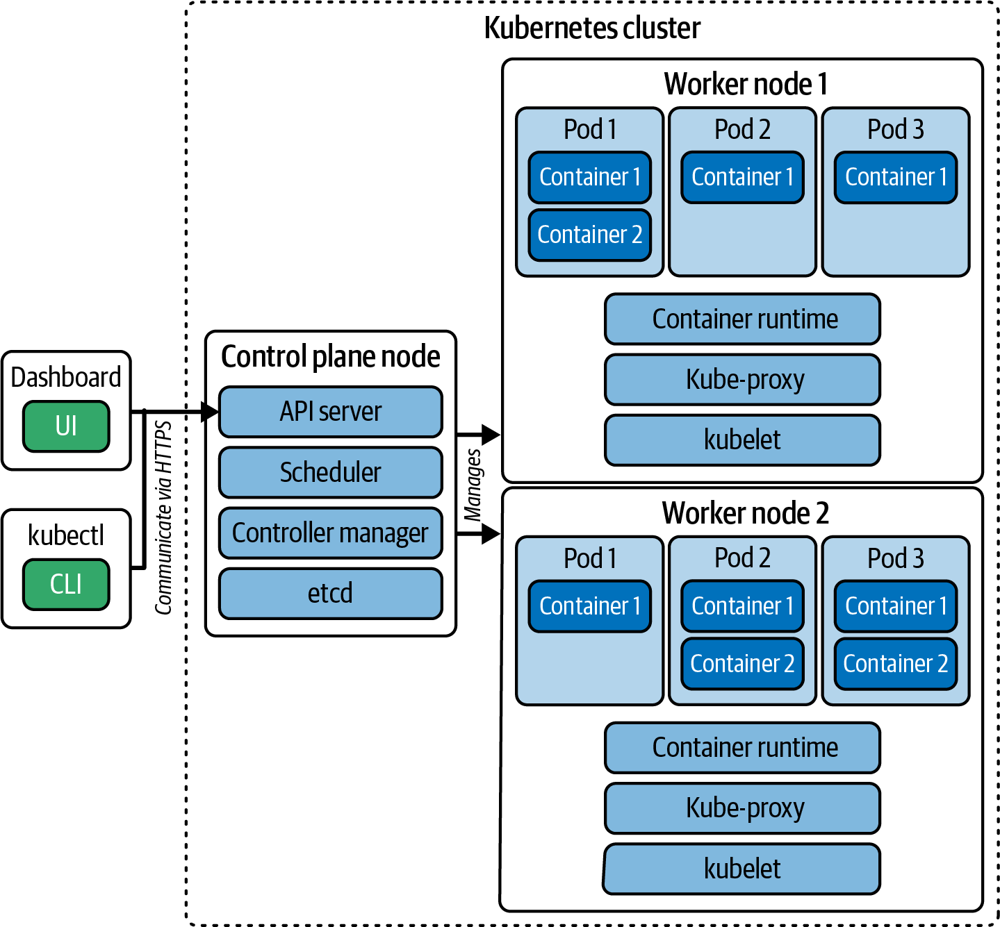

**Figure: Kubernetes cluster nodes and components.** The diagram separates control plane responsibilities from worker-node responsibilities. The API server exposes the management surface, etcd stores cluster state, the scheduler assigns Pods, controllers reconcile resources, kubelet runs Pods on each node, the container runtime starts containers, and kube-proxy participates in Service networking.

**How to read it:** Trace a request from `kubectl` to the API server, then to persistence and controllers. Separately trace Pod execution from scheduler decision to kubelet and runtime on a worker node.

**Why it matters:** Most CKA tasks become easier once you know which component owns the failure. A Pending Pod points toward scheduling constraints or capacity; a CrashLoopBackOff points toward container execution; an API authorization error points toward RBAC; a broken Service points toward selector, endpoint, DNS, or proxy behavior.

**How to apply it:** During troubleshooting, identify whether the failing layer is API admission, scheduling, node execution, application runtime, or networking. Inspect the owner component before changing resources.

**Limitations:** Managed Kubernetes platforms may hide control plane Pods from administrators, so the same model applies conceptually even when the control plane is not directly visible.

## 3. Deep Concept Notes

### Kubernetes Object Model

- **Explanation:** Kubernetes exposes resources as API objects. A typical object has `apiVersion`, `kind`, `metadata`, and `spec`. The cluster records actual runtime status separately, usually under `status`.
- **Problem solved:** Administrators need a consistent way to describe desired state for many resource types: Pods, Deployments, Services, RBAC bindings, PersistentVolumes, Gateways, and policies.
- **How it works:** You submit an object to the API server. The API server validates the schema, applies admission rules, persists state, and controllers or node agents act on it.
- **Why it matters:** The CKA exam is mostly object manipulation under time pressure. If you know the common object skeleton, you can generate YAML quickly and inspect fields with `kubectl explain`.
- **When to use:** Use declarative object definitions for anything that should be repeatable, reviewed, or versioned. Use imperative commands for fast creation or manifest generation.
- **When not to use:** Avoid hand-editing live objects as the only source of truth in real systems; the edit can drift from version-controlled manifests.
- **Tradeoffs:** Declarative manifests are slower to author initially but safer to repeat. Imperative commands are fast but can hide configuration details.
- **Common mistakes:** Confusing `metadata.labels` with selectors, placing fields at the wrong YAML nesting level, using an API version that does not support the field, and editing a generated Pod instead of its controlling Deployment.
- **Production example:** A team stores Deployment, Service, HPA, NetworkPolicy, and Ingress manifests in Git. Cluster changes are made by PR and applied by automation.
- **Questions to ask:** What controller owns this object? Which labels connect it to other objects? Which fields belong under `spec`? How will I validate that the actual state matches desired state?

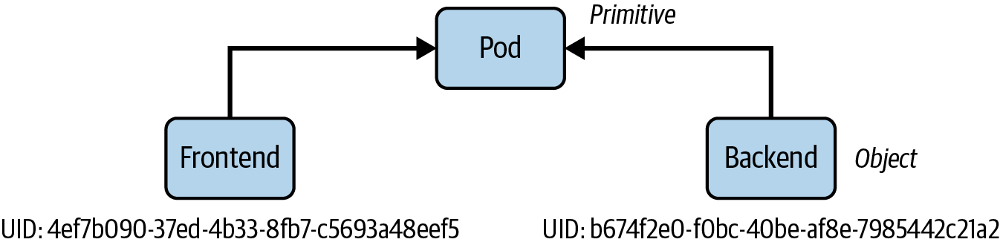

**Figure: Kubernetes object identity.** The object identity model reminds you that name, namespace, kind, and API group/version matter together. The same object name can exist in different namespaces, and not every resource is namespaced.

**How to read it:** Separate object metadata from desired state. Names and labels help humans and selectors find objects; spec fields tell Kubernetes what to reconcile.

**Why it matters:** Many exam errors are namespace errors. A RoleBinding in the wrong namespace or a Pod queried without `-n` can make a correct solution appear missing.

**How to apply it:** Always set the namespace context for a question or pass `-n <namespace>`. For cluster-scoped objects such as ClusterRoles, Nodes, PersistentVolumes, StorageClasses, and GatewayClasses, do not expect a namespace.

**Limitations:** The figure teaches structure, not validation details. Use `kubectl explain <kind>.<field> --recursive` for exact field names in the active cluster version.

### kubectl As The Exam Interface

- **Explanation:** `kubectl` is the command-line client for Kubernetes. It creates, reads, updates, deletes, explains, patches, and tests API objects.
- **Problem solved:** The exam provides no GUI; administrators need fast CLI fluency.
- **How it works:** A command uses the current kubeconfig context, sends a request to the API server, and prints either default tabular output or a selected output format such as YAML, JSON, or JSONPath.
- **Why it matters:** Time saved with aliases, short names, dry-run generation, and JSONPath is time available for reasoning.
- **When to use:** Use `kubectl run`, `create`, `expose`, `autoscale`, `set image`, `rollout`, `scale`, `auth can-i`, `describe`, `logs`, `exec`, `debug`, and `top` as core tools.
- **When not to use:** Do not rely on imperative-only commands when a resource requires unsupported fields. Generate YAML, edit it, then `apply`.
- **Tradeoffs:** Imperative commands minimize typing but do not expose all fields. Declarative YAML is verbose but inspectable.
- **Common mistakes:** Forgetting `--dry-run=client -o yaml`, omitting `--restart=Never` when creating a standalone Pod, using `create` when `apply` is needed, and losing time searching documentation instead of using `kubectl explain`.
- **Production example:** An administrator generates a NetworkPolicy skeleton, edits selectors and ports, applies it, then validates with a temporary BusyBox Pod.
- **Questions to ask:** Can I create this imperatively? If not, can I generate a manifest skeleton? Which namespace and context are active?

```bash
kubectl config set-context <context-of-question> --namespace=<namespace-of-question>
kubectl config use-context <context-of-question>
alias k=kubectl
kubectl api-resources
kubectl explain deployment.spec.strategy.rollingUpdate
kubectl run frontend --image=nginx:1.29.0 --port=80 --dry-run=client -o yaml > pod.yaml
kubectl apply -f pod.yaml
```

### kubeadm Cluster Lifecycle

- **Explanation:** `kubeadm` bootstraps and manages Kubernetes clusters. It initializes the control plane, prints worker join commands, supports upgrades, and manages certificates.
- **Problem solved:** Cluster administrators need a repeatable cluster installation and upgrade path without hand-writing every static Pod manifest and certificate.
- **How it works:** `kubeadm init` creates control plane configuration, certificates, kubeconfigs, and static Pod manifests. A CNI plugin must be installed before Pods can communicate. Worker nodes join using a token and CA certificate hash.
- **Why it matters:** Installation and upgrade are core CKA administrator skills and are high-risk production tasks.
- **When to use:** Use `kubeadm` for self-managed cluster setup, node join, upgrade planning, certificate inspection, and certificate renewal.
- **When not to use:** Do not treat `kubeadm` as infrastructure provisioning. It does not create machines, networks, or cloud resources.
- **Tradeoffs:** `kubeadm` teaches Kubernetes internals and gives control, but it shifts operational responsibility for HA, backups, OS patches, and add-ons to the administrator.
- **Common mistakes:** Forgetting to configure kubeconfig after init, not installing a CNI plugin, using a Pod CIDR inconsistent with the CNI plugin, losing the join command, upgrading kubelet before applying the control plane upgrade, and not draining nodes.
- **Production example:** A maintenance runbook upgrades one control plane node at a time, drains nodes before kubelet upgrades, verifies versions, then uncordons nodes.
- **Questions to ask:** What Kubernetes version is targeted? Which Pod CIDR does the CNI expect? Are etcd backups current? Is this a stacked or external etcd topology?

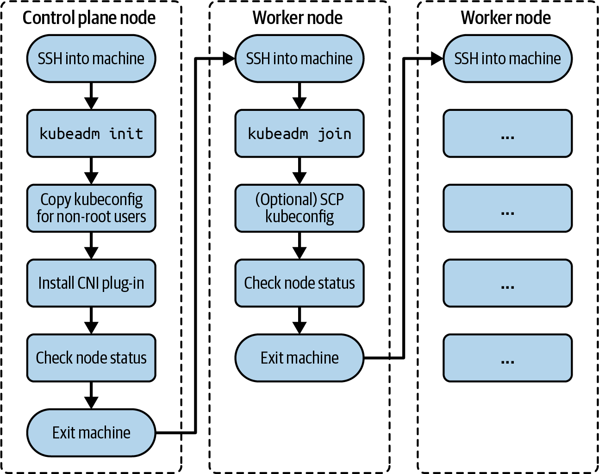

**Figure: Process for a cluster installation.** The installation sequence is control plane initialization, local kubeconfig setup, CNI installation, worker join, and readiness verification.

**How to read it:** Treat each step as a gate. Do not troubleshoot workloads until the control plane is reachable, kubeconfig works, networking is installed, and nodes are Ready.

**Why it matters:** A `NotReady` node immediately after `kubeadm init` is often expected until CNI is installed. Confusing that with an application issue wastes time.

**How to apply it:** Use the figure as an installation checklist: initialize, copy `/etc/kubernetes/admin.conf`, install the specified CNI, join workers, run `kubectl get nodes`, and inspect system Pods.

**Limitations:** Real clusters need more than this flow: HA design, external load balancer, DNS, firewall rules, OS hardening, monitoring, backup, and upgrade automation.

```bash
sudo kubeadm init --pod-network-cidr=10.244.0.0/16
mkdir -p "$HOME/.kube"
sudo cp -i /etc/kubernetes/admin.conf "$HOME/.kube/config"
sudo chown "$(id -u):$(id -g)" "$HOME/.kube/config"
kubectl apply -f https://github.com/flannel-io/flannel/releases/latest/download/kube-flannel.yml
kubeadm token create --print-join-command
kubectl get nodes
```

### High Availability Control Planes

- **Explanation:** A highly available cluster runs multiple control plane nodes and protects etcd availability.
- **Problem solved:** A single control plane node is a single point of failure for scheduling, API access, and control loops.
- **How it works:** In a stacked topology, each control plane node also runs an etcd member. In an external topology, etcd runs on separate nodes. API servers sit behind a stable endpoint such as a load balancer.
- **Why it matters:** HA topology affects failure domains, operational complexity, and upgrade risk.
- **When to use:** Use HA for production clusters where API downtime, scheduler/controller downtime, or etcd loss is unacceptable.
- **When not to use:** For exam labs and local development, a single control plane is simpler and sufficient.
- **Tradeoffs:** Stacked etcd is simpler and needs fewer machines; external etcd isolates storage failure but increases node count and operational burden.
- **Common mistakes:** Calling a multi-worker cluster highly available without multiple control plane nodes, not protecting etcd quorum, and forgetting the stable API endpoint.
- **Production example:** A production cluster uses three control plane nodes behind a load balancer and an etcd snapshot schedule before every upgrade.
- **Questions to ask:** What fails if one control plane node dies? Where is etcd quorum? How are API server endpoints balanced? How are certificates and backups managed?

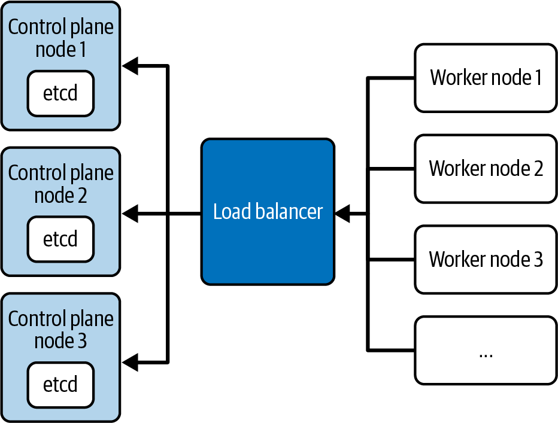

**Figure: Stacked etcd topology.** Each control plane node hosts Kubernetes control plane components and an etcd member.

**How to apply it:** Prefer this topology when you need HA but want fewer machines and lower operational complexity.

**Limitations:** Control plane resource contention can affect etcd, and losing enough control plane nodes can also lose etcd quorum.

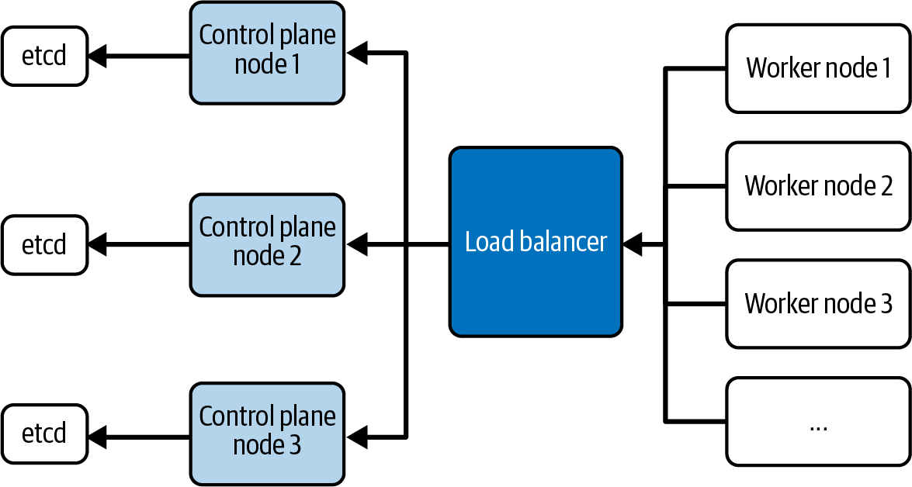

**Figure: External etcd topology.** etcd runs on separate nodes, isolating the cluster datastore from control plane compute.

**How to apply it:** Consider this for stricter failure-domain separation and larger operational teams.

**Limitations:** It requires more machines, more certificates, more monitoring, and stronger etcd operational skill.

### etcd Backup And Restore

- **Explanation:** etcd stores Kubernetes cluster state. Backup captures that state; restore rebuilds it from a snapshot.
- **Problem solved:** Protects against accidental deletion, node loss, storage corruption, and failed maintenance.
- **How it works:** `etcdctl snapshot save` connects to etcd with endpoint and client certificates. `etcdutl snapshot restore` extracts the snapshot to a new data directory. The etcd static Pod manifest must then point at the restored data directory.
- **Why it matters:** Backups are only useful if restore is understood and tested.
- **When to use:** Before upgrades, risky maintenance, control plane changes, and on a schedule for self-managed clusters.
- **When not to use:** Do not treat a snapshot as an application data backup. It preserves Kubernetes objects, not database contents inside application Pods.
- **Tradeoffs:** Snapshot restore is cluster-wide. Restoring older state can overwrite newer object changes.
- **Common mistakes:** Backing up without `ETCDCTL_API=3`, using wrong cert/key paths, restoring to a directory but not updating the etcd manifest, and not verifying snapshot status.
- **Production example:** A runbook takes a snapshot before a control plane upgrade and stores it off-node with restore instructions and certificate paths.
- **Questions to ask:** Where is the etcd static Pod manifest? Which certificates does etcd use? Where will restored data live? How will I verify the API server after restore?

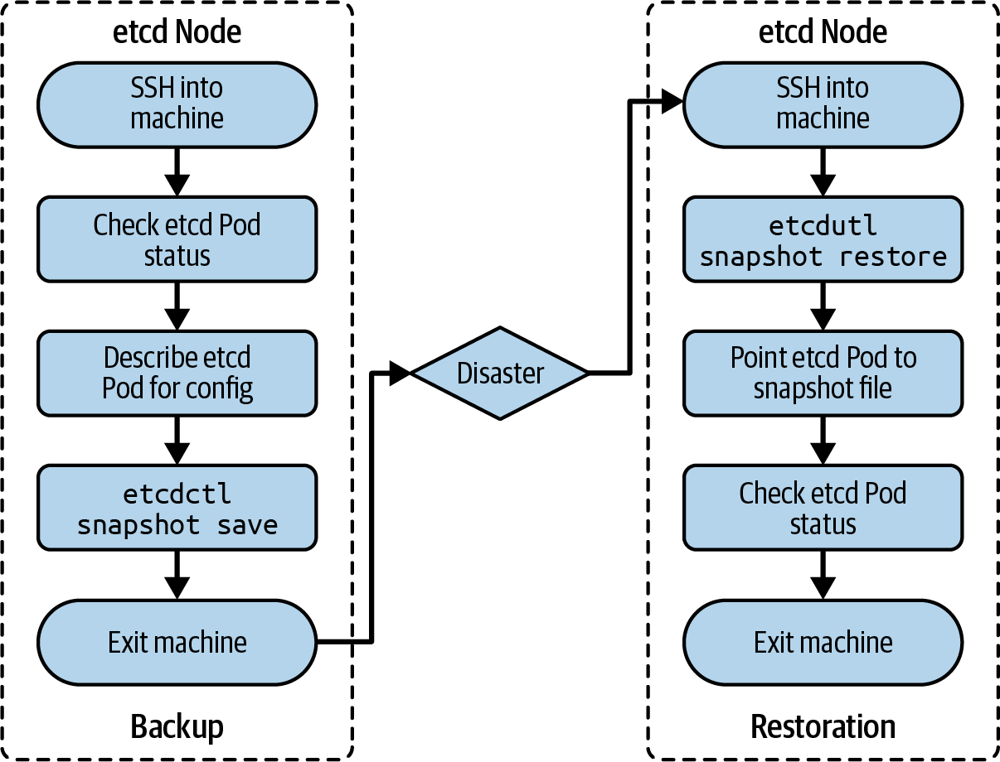

**Figure: Process for backing up and restoring etcd.** The flow separates snapshot creation from restore extraction and static Pod reconfiguration.

**How to read it:** Backup uses the live etcd endpoint. Restore prepares a new data directory. Kubernetes only uses restored data after etcd is reconfigured to point at that directory.

**Why it matters:** A common failure is thinking `snapshot restore` alone changes the cluster. It does not; the running etcd process must start with the restored data.

**How to apply it:** Capture endpoint and certificate flags from the etcd Pod manifest, save a snapshot, validate it, restore into a new directory, update the static Pod manifest, and wait for kubelet to restart etcd.

**Limitations:** The diagram assumes a self-managed control plane where etcd and static Pod manifests are accessible.

```bash
sudo ETCDCTL_API=3 etcdctl \
  --endpoints=https://127.0.0.1:2379 \
  --cacert=/etc/kubernetes/pki/etcd/ca.crt \
  --cert=/etc/kubernetes/pki/etcd/server.crt \
  --key=/etc/kubernetes/pki/etcd/server.key \
  snapshot save /opt/etcd.bak

sudo etcdutl snapshot restore /opt/etcd.bak --data-dir /var/lib/etcd-restore
# Then update /etc/kubernetes/manifests/etcd.yaml to mount and use the restored data directory.
```

### Authentication, Authorization, Admission, And RBAC

- **Explanation:** Kubernetes API requests pass through identity verification, permission checks, and admission controls before persistence.
- **Problem solved:** Administrators need to ensure only the right identities can perform the right actions in the right scope.
- **How it works:** kubeconfig identifies cluster, user, and context. RBAC grants verbs on resources through Roles, ClusterRoles, RoleBindings, and ClusterRoleBindings. Admission can mutate or reject requests after authorization.
- **Why it matters:** Access problems are frequent in real clusters and exam tasks. RBAC is explicit: verb, resource, API group, namespace, and subject must all line up.
- **When to use:** Use Roles for namespace-scoped permissions and ClusterRoles for cluster-scoped resources or reusable role templates.
- **When not to use:** Do not grant cluster-admin access for convenience in production. Do not use a ClusterRoleBinding when a namespace RoleBinding is enough.
- **Tradeoffs:** Fine-grained RBAC improves safety but increases review complexity. Aggregated ClusterRoles reduce duplication but require label discipline.
- **Common mistakes:** Binding a Role in the wrong namespace, omitting API group for apps resources, confusing ServiceAccount subjects with users, and failing to test with `--as`.
- **Production example:** A CI service account can get/list/watch Pods and update Deployments in one namespace but cannot read Secrets or delete namespaces.
- **Questions to ask:** Who is the subject? Which verbs? Which resource and API group? Namespace or cluster scope? How can I test the permission?


**Figure: API server request processing.** Requests move through authentication, authorization, and admission before state is persisted.

**How to read it:** A failure can happen even when the YAML is valid. First the user must be recognized, then allowed, then accepted by admission rules.

**Why it matters:** This flow explains why `Forbidden` differs from validation or admission errors. The fix changes depending on the rejected stage.

**How to apply it:** Use `kubectl auth can-i` to isolate authorization. Use `kubectl describe` and API error messages for validation/admission failures.

**Limitations:** The book covers administrator-level concepts, not every admission controller implementation or policy engine.


**Figure: RBAC key building blocks.** RBAC separates rules from bindings. Roles/ClusterRoles define allowed actions; RoleBindings/ClusterRoleBindings attach those rules to subjects.

**How to apply it:** Create the smallest rule set, bind it to the intended user/group/service account, then test the exact action.

**Limitations:** RBAC grants API permissions, not network access, Linux capabilities, or application-level authorization.

```bash
kubectl create clusterrole service-view --verb=get,list --resource=services
kubectl create namespace development
kubectl create rolebinding ellasmith-service-view \
  --user=ellasmith \
  --clusterrole=service-view \
  -n development
kubectl auth can-i list services --as=ellasmith --namespace=development
kubectl auth can-i watch deployments --as=ellasmith --namespace=production
```

### Operators And Custom Resource Definitions

- **Explanation:** A CRD extends the Kubernetes API with a new resource type; an operator adds a controller that reconciles those custom resources.
- **Problem solved:** Platform teams need Kubernetes-native APIs for domain-specific systems such as databases, backups, certificate automation, and GitOps tools.
- **How it works:** A CRD registers schema and versions. Users create custom resources. A controller watches those resources and creates or updates lower-level objects or external systems.
- **Why it matters:** The CKA expects administrators to discover CRDs, install/configure operators, and interact with custom resources.
- **When to use:** Use operators for repeatable operational behavior that has a clear lifecycle and reconciliation model.
- **When not to use:** Avoid operators for simple static resources where a Deployment and Service are enough.
- **Tradeoffs:** Operators reduce manual runbook work but add controller dependencies and CRD lifecycle management.
- **Common mistakes:** Installing an operator without checking CRDs, assuming custom resources do anything without a controller, and not inspecting controller logs when reconciliation fails.
- **Production example:** A database operator watches `PostgresCluster` objects and creates StatefulSets, Services, PVCs, backups, and failover configuration.
- **Questions to ask:** What CRDs were installed? What controller owns them? Which namespace does it watch? How do I inspect custom resource status?

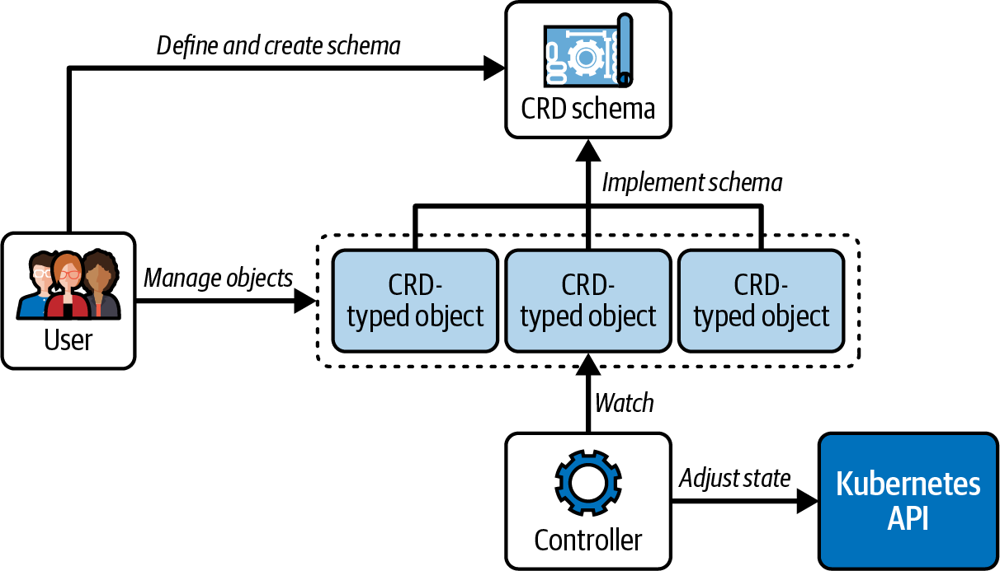

**Figure: The Kubernetes operator pattern.** A custom resource expresses desired state; a controller observes that resource and reconciles backing infrastructure.

**How to apply it:** Debug both the custom resource status and the operator controller logs. If the CR exists but no action occurs, the controller may be absent, misconfigured, or unauthorized.

**Limitations:** Operator internals are outside CKA scope; focus on installation, discovery, basic interaction, and troubleshooting.

### Helm And Kustomize

- **Explanation:** Helm packages Kubernetes manifests into charts and releases; Kustomize overlays configuration changes onto plain manifests without templating.
- **Problem solved:** Administrators need practical ways to install cluster components and manage environment-specific manifest variants.
- **How it works:** Helm installs chart templates with values into a release. Kustomize reads a `kustomization.yaml` and transforms resources with namespace, name prefixes/suffixes, labels, patches, generated ConfigMaps/Secrets, and overlays.
- **Why it matters:** The CKA curriculum includes Helm and Kustomize because real clusters rarely use one flat YAML file per component.
- **When to use:** Use Helm for third-party packaged software and release operations. Use Kustomize for controlled variants of manifests that should remain Kubernetes-native YAML.
- **When not to use:** Avoid Helm when values indirection hides critical security or scheduling settings. Avoid Kustomize when the variation requires complex programming logic.
- **Tradeoffs:** Helm has packaging and release history but template complexity. Kustomize is transparent but less suitable for highly parameterized packages.
- **Common mistakes:** Installing charts into the wrong namespace, not inspecting rendered manifests, forgetting generated ConfigMap names, and applying a base instead of the intended overlay.
- **Production example:** Install an ingress controller with Helm, then use Kustomize overlays to configure applications for dev/stage/prod.
- **Questions to ask:** Do I need a packaged release or a manifest overlay? What namespace is targeted? Can I render before applying?

```bash
helm repo add prometheus-community https://prometheus-community.github.io/helm-charts
helm search repo prometheus
helm install monitoring prometheus-community/kube-prometheus-stack -n monitoring --create-namespace
helm upgrade monitoring prometheus-community/kube-prometheus-stack -n monitoring -f values.yaml
helm uninstall monitoring -n monitoring

kubectl kustomize ./overlays/prod
kubectl apply -k ./overlays/prod
```

### Workload Controllers: Pods, Deployments, ReplicaSets, Rollouts

- **Explanation:** Pods run containers. Deployments manage ReplicaSets. ReplicaSets maintain Pod replica count. Rollouts update Pod templates over time.
- **Problem solved:** Applications need self-healing, scaling, rolling updates, and rollback mechanisms.
- **How it works:** A Deployment owns ReplicaSets; each ReplicaSet selects Pods through labels. Changing the Deployment Pod template creates a new ReplicaSet and gradually shifts replicas according to rollout settings.
- **Why it matters:** Administrators must update applications safely and recover from bad releases.
- **When to use:** Use Deployments for stateless replicated workloads. Use StatefulSets when stable identity and storage are required.
- **When not to use:** Avoid standalone Pods for production applications that require replacement after node or container failure.
- **Tradeoffs:** Rolling updates reduce downtime but can temporarily run mixed versions. Rollbacks help recover binaries but do not automatically roll back external data migrations.
- **Common mistakes:** Mismatched selectors, editing a ReplicaSet instead of Deployment, forgetting to check rollout status, and assuming rollback can undo persistent data changes.
- **Production example:** An administrator updates an image with `kubectl set image`, watches rollout status, then rolls back when readiness checks fail.
- **Questions to ask:** Which controller owns the Pod? Are labels and selectors stable? What is the update strategy? How many old ReplicaSets are retained?

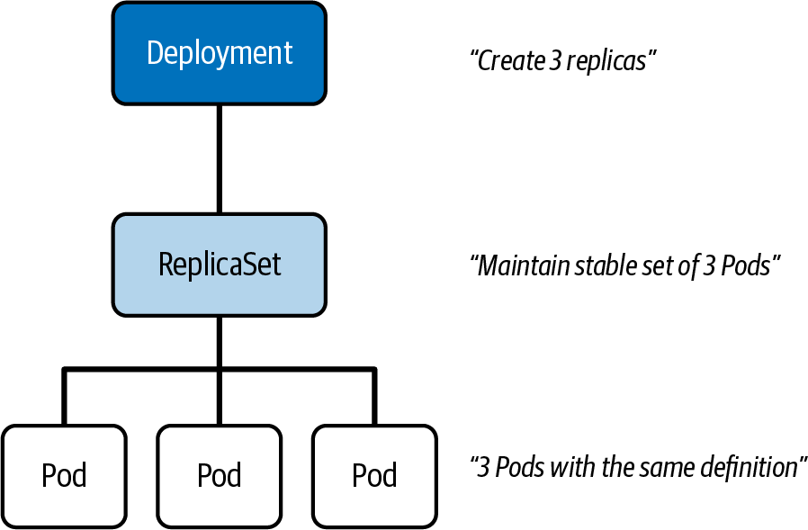

**Figure: Deployment and ReplicaSet relationship.** Deployments control ReplicaSets, and ReplicaSets control Pods.

**How to read it:** Do not treat the current Pods as the source of truth. The Deployment template is the durable desired state.

**Why it matters:** Deleting a Pod under a Deployment usually just triggers replacement. Editing the Pod is not the correct persistent fix.

**How to apply it:** Debug from Deployment to ReplicaSet to Pods: `kubectl describe deployment`, `kubectl get rs`, `kubectl describe pod`.

**Limitations:** The diagram focuses on stateless workloads; StatefulSets add stable identity and volume semantics.

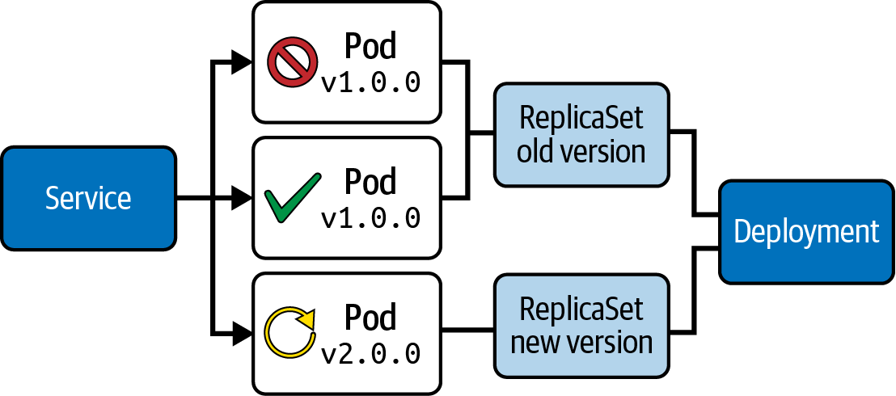

**Figure: Deployment rolling update strategy.** A rolling update adds new Pods while removing old Pods within configured surge and unavailable bounds.

**How to apply it:** Watch rollout progress and pause or roll back if readiness or availability fails.

**Limitations:** Rolling update safety depends on application readiness probes, backward-compatible configuration, and data migration discipline.

```bash
kubectl create deployment app-cache --image=memcached:1.6.8 --replicas=4
kubectl set image deployment/app-cache memcached=memcached:1.6.10
kubectl rollout status deployment/app-cache
kubectl rollout history deployment/app-cache
kubectl rollout undo deployment/app-cache
```

### Autoscaling And Resource Governance

- **Explanation:** Requests reserve scheduling capacity; limits constrain runtime consumption; HPA scales replicas based on metrics; ResourceQuotas and LimitRanges govern namespace consumption.
- **Problem solved:** Clusters need predictable scheduling, fair tenant usage, and adaptive capacity.
- **How it works:** The scheduler uses requests to place Pods. Kubelet and runtime enforce limits. HPA watches metrics from Metrics Server and adjusts replica counts. ResourceQuota rejects objects that exceed namespace budgets. LimitRange can default or enforce per-container bounds.
- **Why it matters:** Without requests, autoscaling may not work and scheduling can overcommit dangerously. Without quotas, one namespace can consume shared cluster capacity.
- **When to use:** Use requests/limits for every production container, HPA for variable stateless workloads, quotas for multi-tenant namespaces, and LimitRanges for guardrails.
- **When not to use:** Avoid CPU limits for latency-sensitive services unless you understand throttling risk. Avoid HPA for workloads that cannot safely run multiple replicas.
- **Tradeoffs:** Strict limits protect nodes but can throttle applications. Autoscaling improves efficiency but needs metrics and stable scaling signals.
- **Common mistakes:** Creating HPA without Metrics Server, missing CPU requests, setting quotas before defaults, and scaling stateful systems without storage and identity planning.
- **Production example:** A namespace enforces default CPU requests via LimitRange and caps total requests with ResourceQuota; Deployments use HPA with readiness probes.
- **Questions to ask:** Are metrics available? Do containers define requests? What happens when quota is exhausted? Is the workload horizontally scalable?

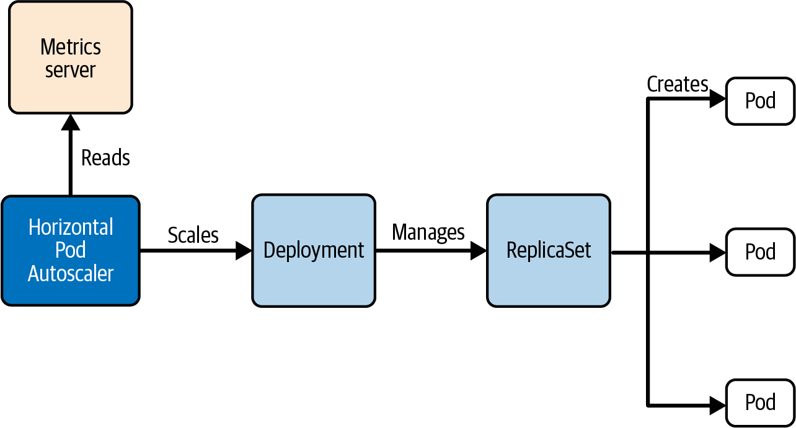

**Figure: Autoscaling a Deployment.** HPA observes metrics and updates the target workload's replica count.

**How to read it:** HPA does not create Pods directly. It changes the scale subresource of a controller such as a Deployment.

**How to apply it:** Validate Metrics Server, resource requests, HPA target, and observed metrics before blaming scaling logic.

**Limitations:** HPA is reactive and metric-dependent; it does not replace capacity planning.

```bash
kubectl top nodes
kubectl top pods
kubectl autoscale deployment app-cache --cpu-percent=80 --min=3 --max=5
kubectl get hpa
kubectl describe hpa app-cache
kubectl scale deployment app-cache --replicas=5
```

### Scheduling Constraints

- **Explanation:** Scheduling constraints tell Kubernetes where a Pod may or should run.
- **Problem solved:** Workloads often need specific hardware, isolation, spread, tenancy, or avoidance behavior.
- **How it works:** Node selectors and required affinity filter nodes. Preferred affinity influences scoring. Taints repel Pods unless tolerated. Topology spread constraints distribute Pods across topology domains such as zones.
- **Why it matters:** Most Pending Pod issues are scheduling issues: insufficient resources, unsatisfied affinity, missing toleration, quota, or unavailable nodes.
- **When to use:** Use node selectors for simple hard requirements, node affinity for expressive placement, taints/tolerations for reserving nodes, and topology spread for resilience.
- **When not to use:** Avoid over-constraining Pods unless the operational need is real; constraints can make workloads unschedulable during failures.
- **Tradeoffs:** More control improves placement but reduces scheduler freedom and cluster utilization.
- **Common mistakes:** Using labels that are absent on target nodes, forgetting the `NoSchedule` effect in tolerations, using required affinity where preferred would suffice, and setting spread constraints with impossible topology.
- **Production example:** GPU workloads tolerate a GPU node taint and require a GPU node label; web replicas use topology spread across zones.
- **Questions to ask:** Is this a hard or soft requirement? Which node labels exist? Are taints present? What happens when one zone is down?

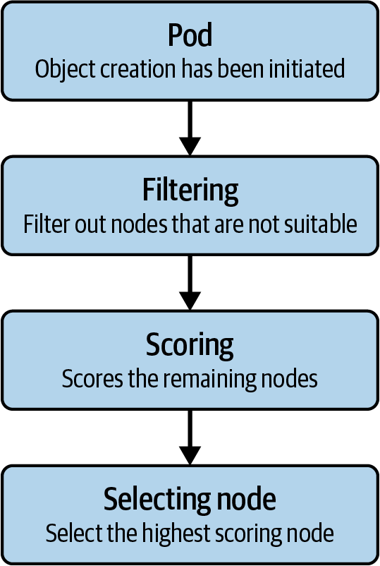

**Figure: Pod scheduling algorithm.** Scheduling filters unsuitable nodes and then scores remaining candidates.

**How to apply it:** For Pending Pods, inspect events for the failed filter reason. Fix capacity, labels, taints, affinity, quotas, or volume binding depending on the event.

**Limitations:** The scheduler has many plugins; the figure teaches the mental model rather than every plugin.

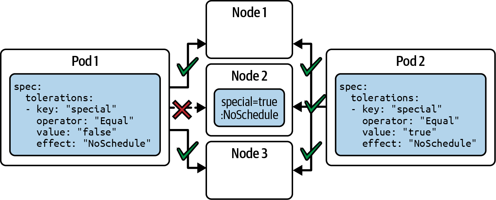

**Figure: Taints and tolerations scenarios.** Taints belong to nodes; tolerations belong to Pods. A matching toleration allows scheduling but does not force it.

**How to apply it:** Use taints to reserve nodes, then combine tolerations with selectors or affinity if the Pod must land there.

**Limitations:** Toleration alone is permission, not placement.

```bash
kubectl label node worker-1 disk=ssd
kubectl taint nodes worker-1 special=true:NoSchedule
kubectl describe pod nginx
kubectl get pod nginx -o wide
kubectl describe node worker-1 | grep -i taint
kubectl taint nodes worker-1 special-
```

### Configuration Data: ConfigMaps And Secrets

- **Explanation:** ConfigMaps store plain configuration; Secrets store sensitive values with Base64 encoding and Secret-specific types.
- **Problem solved:** Applications need environment-specific values without rebuilding images.
- **How it works:** ConfigMaps and Secrets can be consumed as environment variables or mounted as volumes. Secret values in live objects use the `data` field.
- **Why it matters:** Configuration injection is a daily administration task and often appears in exam scenarios.
- **When to use:** Use ConfigMaps for non-sensitive settings, Secrets for credentials, keys, and tokens, and volumes when the application expects files.
- **When not to use:** Do not place credentials in ConfigMaps. Do not assume Kubernetes Secrets are encrypted unless encryption at rest is explicitly configured.
- **Tradeoffs:** Environment variables are simple but usually require Pod restart for changes. Volume mounts can update mounted files, but application reload behavior varies.
- **Common mistakes:** Treating Base64 as encryption, using wrong key names, mounting a Secret where a ConfigMap is referenced by `name` instead of `secretName`, and exposing Secrets in shell history.
- **Production example:** A backend receives database host/user from a ConfigMap and password from a Secret, both mounted or injected by key.
- **Questions to ask:** Is the value sensitive? Does the application need env vars or files? How is rotation handled? Is encryption at rest enabled?

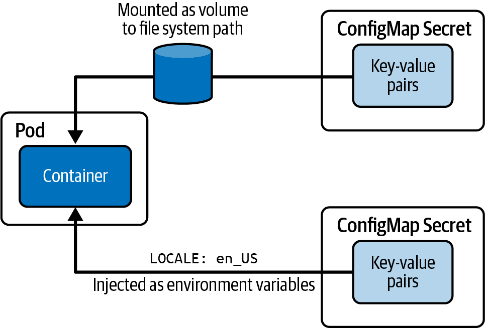

**Figure: Consuming configuration data.** Configuration objects are separate from Pods and are injected into containers through environment variables or volumes.

**How to apply it:** Keep container images generic. Bind environment-specific settings at deployment time.

**Limitations:** The figure does not imply automatic application reload. Validate how the application reacts to changed mounted files or restarted Pods.

```bash
kubectl create configmap db-config \
  --from-literal=DB_HOST=mysql-service \
  --from-literal=DB_USER=backend
kubectl create secret generic db-creds --from-literal=pwd='<redacted>'
kubectl describe configmap db-config
kubectl get secret db-creds -o yaml
```

### Storage: Volumes, PersistentVolumes, Claims, StorageClasses

- **Explanation:** Volumes decouple files from container filesystems. PersistentVolumes represent storage capacity; PersistentVolumeClaims request capacity; StorageClasses enable dynamic provisioning.
- **Problem solved:** Containers are ephemeral, but applications often need shared files, configuration files, temporary scratch space, or durable data.
- **How it works:** A Pod mounts a volume. For persistent storage, a PVC binds to a matching PV or triggers dynamic provisioning through a StorageClass. Reclaim policy controls what happens when the claim is released.
- **Why it matters:** Storage problems often block scheduling or cause data loss.
- **When to use:** Use `emptyDir` for Pod-lifetime scratch, ConfigMap/Secret volumes for configuration, PVCs for durable application data, and dynamic provisioning when a storage driver exists.
- **When not to use:** Avoid `hostPath` for portable production workloads. Avoid local PVs without node affinity and failure planning.
- **Tradeoffs:** Dynamic provisioning is operationally convenient but depends on CSI drivers. Static provisioning is explicit but manual.
- **Common mistakes:** Requesting an access mode unsupported by the PV, mismatching StorageClass, forgetting reclaim policy, and assuming PV data follows Pods across nodes.
- **Production example:** A database StatefulSet uses PVC templates with a StorageClass backed by a CSI driver and a reclaim policy aligned with backup policy.
- **Questions to ask:** Is the data ephemeral or durable? Which access mode is required? Who provisions storage? What happens on claim deletion?

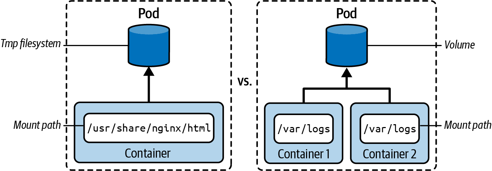

**Figure: Temporary filesystem versus volume.** A container filesystem is tied to the container; a Pod volume can survive container restarts and be shared by containers in the Pod.

**How to apply it:** Use volumes when data must outlive a container restart or be visible to sidecars.

**Limitations:** A normal Pod volume such as `emptyDir` still disappears when the Pod is removed.

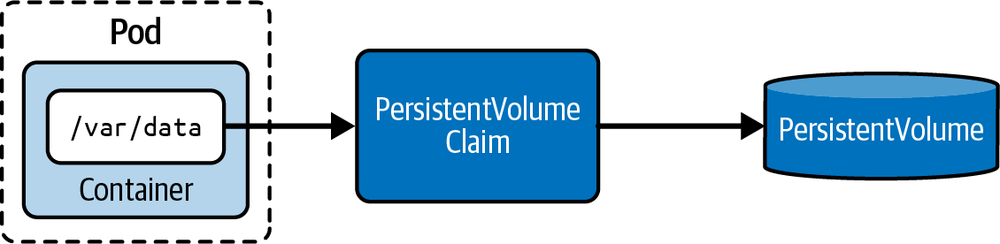

**Figure: Claiming persistent storage.** A Pod references a PVC; the PVC binds to a PV or dynamically provisioned storage.

**How to apply it:** Debug storage by checking PVC status, PV binding, StorageClass, access mode, capacity, and Pod events.

**Limitations:** Binding storage is not a backup strategy. You still need application-aware backup and restore.

```yaml
apiVersion: v1
kind: PersistentVolumeClaim
metadata:
  name: db-pvc
spec:
  accessModes:
    - ReadWriteOnce
  resources:
    requests:
      storage: 1Gi
```

### Services, DNS, Ingress, And Gateway API

- **Explanation:** Services provide stable access to Pods. DNS maps names to Services and Pods. Ingress and Gateway API route external HTTP traffic to Services.
- **Problem solved:** Pods are ephemeral and IPs change; users and services need stable names, ports, and routing rules.
- **How it works:** A Service selector creates endpoints for matching Pods. Cluster DNS creates names. Ingress requires an Ingress controller. Gateway API uses GatewayClass, Gateway, and Route resources managed by a Gateway controller.
- **Why it matters:** Networking is high-density CKA material and a common operational failure area.
- **When to use:** Use ClusterIP for internal access, NodePort for node-level exposure, LoadBalancer when the environment can provision external load balancers, Ingress for HTTP routing, and Gateway API for role-oriented, more expressive traffic management.
- **When not to use:** Do not use Ingress for non-HTTP protocols unless the controller explicitly supports it. Do not create Gateway resources without a GatewayClass/controller.
- **Tradeoffs:** Services are simple and stable; Ingress is mature and controller-specific; Gateway API is more expressive and role-oriented but requires CRDs and controller support.
- **Common mistakes:** Wrong Service selector, wrong `targetPort`, no endpoints, missing Ingress controller, missing GatewayClass, DNS queries from outside the cluster, and NetworkPolicies blocking traffic.
- **Production example:** A web application uses a ClusterIP Service for backend Pods, an Ingress or HTTPRoute for external routing, and NetworkPolicies to restrict backend access.
- **Questions to ask:** Which Pods are selected? Are endpoints present? Is target port correct? Is the controller installed? Is DNS resolving? Are policies blocking traffic?

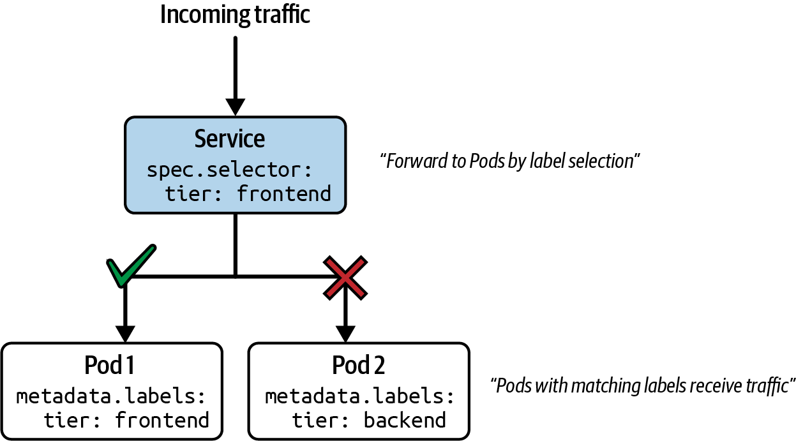

**Figure: Service traffic routing by labels.** A Service routes to Pods selected by labels.

**How to apply it:** When a Service returns no response, compare `kubectl describe service` selectors with `kubectl get pods --show-labels`.

**Limitations:** Service selection does not validate whether the application is actually listening on the target port.

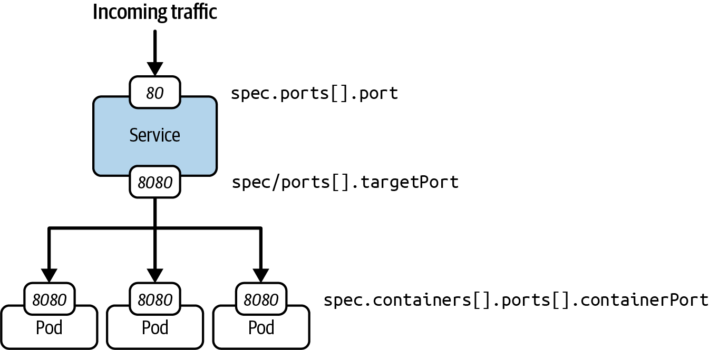

**Figure: Service port mapping.** A Service receives traffic on `port` and forwards to Pod `targetPort`.

**How to apply it:** Debug failed connections by checking Service `port`, `targetPort`, Pod `containerPort`, endpoints, and actual listening process.

**Limitations:** `containerPort` is documentation and metadata for many cases; the container process still must listen on that port.

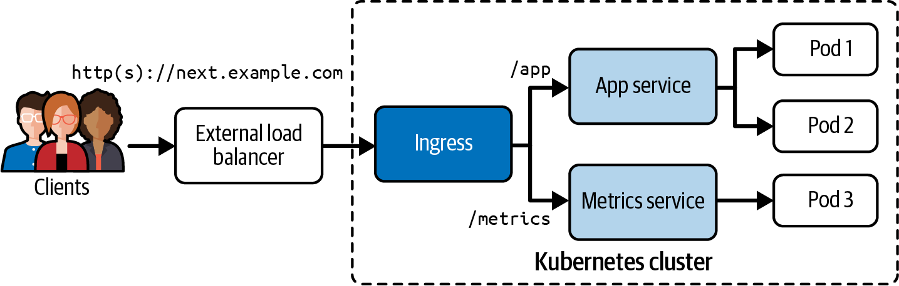

**Figure: Ingress routes external HTTP(S) traffic to Services.** Ingress rules map host/path combinations to Service backends.

**How to apply it:** Verify the Ingress controller first, then inspect IngressClass, rules, backend Service, endpoints, and controller logs.

**Limitations:** Ingress behavior varies by controller, especially annotations, rewrites, and TLS features.

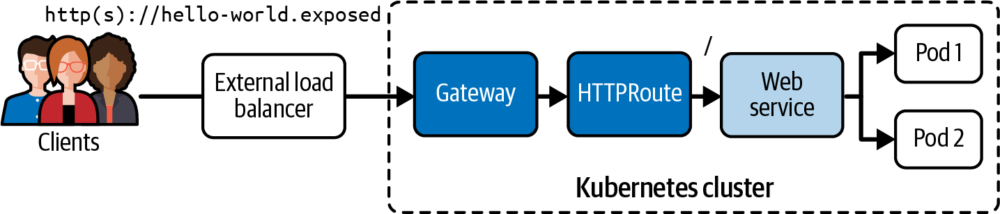

**Figure: Gateway API HTTP routing.** Gateway API separates infrastructure-owned GatewayClasses and Gateways from application-owned Routes.

**How to apply it:** Check available GatewayClasses, whether the Gateway is programmed, and whether HTTPRoutes attach successfully.

**Limitations:** Gateway API requires installed CRDs and a compatible controller.

```bash
kubectl expose deployment echoserver --port=80 --target-port=8080
kubectl get service echoserver
kubectl get endpointslices -l app=echoserver
kubectl run tmp --image=busybox:1.37.0 -it --rm -- wget echoserver:80

kubectl get ingressclasses
kubectl create ingress next-app \
  --rule='next.example.com/app=app-service:8080'

kubectl get gatewayclasses
kubectl get gateways
kubectl get httproutes
```

### NetworkPolicies

- **Explanation:** NetworkPolicies define allowed ingress and egress traffic for selected Pods.
- **Problem solved:** Kubernetes allows Pod-to-Pod communication by default. Production clusters often need least-privilege network segmentation.
- **How it works:** A policy selects target Pods through `podSelector`. Ingress and egress rules allow traffic by Pod selector, namespace selector, IP block, and port. Multiple policies are additive.
- **Why it matters:** Policies directly affect application connectivity and security posture.
- **When to use:** Use default deny policies for sensitive namespaces, then add explicit allow rules for required traffic.
- **When not to use:** Do not rely on NetworkPolicies unless the CNI plugin enforces them.
- **Tradeoffs:** Strong segmentation reduces blast radius but increases debugging complexity.
- **Common mistakes:** Forgetting `policyTypes`, selecting the wrong Pods, allowing only ingress while DNS egress is needed, and testing from outside the policy's namespace assumptions.
- **Production example:** Only frontend Pods may reach API Pods on TCP 80; only API Pods may reach database Pods on TCP 5432.
- **Questions to ask:** Which Pods does the policy select? Is this ingress, egress, or both? Does DNS need an allow rule? Is the CNI enforcing policies?

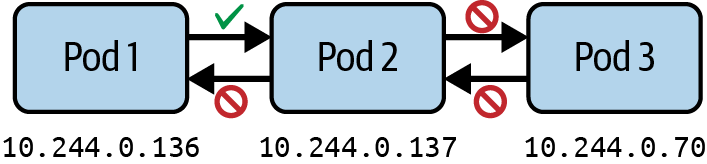

**Figure: Network policies define traffic from and to a Pod.** Policies target Pods and constrain allowed connections.

**How to apply it:** Start with the target Pod. Determine whether a policy selects it, then inspect allowed sources, destinations, and ports.

**Limitations:** NetworkPolicies do not apply to Services directly; they apply to Pods selected by labels.

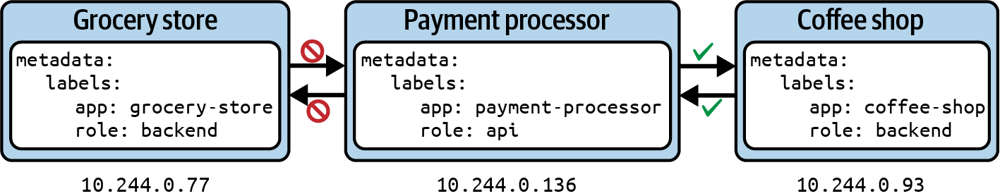

**Figure: Limiting Pod traffic.** The diagram illustrates allow-list thinking: selected Pods receive only defined traffic paths.

**How to apply it:** Build policies incrementally and test each allowed path with temporary Pods.

**Limitations:** Policy behavior depends on label accuracy and CNI enforcement.

```yaml
apiVersion: networking.k8s.io/v1
kind: NetworkPolicy
metadata:
  name: api-allow
spec:
  podSelector:
    matchLabels:
      app: payment-processor
      role: api
  policyTypes:
    - Ingress
  ingress:
    - from:
        - podSelector:
            matchLabels:
              app: coffee-shop
      ports:
        - protocol: TCP
          port: 80
```

## 4. Implementation Patterns And Engineering Practices

### Generate, Then Edit, Then Apply

Problem: CKA tasks often require exact YAML fields, but hand-writing full manifests is slow and error-prone.

Workflow:

```bash
kubectl create deployment web --image=nginx:1.29.0 --replicas=3 --dry-run=client -o yaml > deployment.yaml
kubectl explain deployment.spec.template.spec.containers
vim deployment.yaml
kubectl apply -f deployment.yaml
kubectl get deployment web
```

Tradeoffs: This pattern is fast and accurate for common resources, but not every field is exposed by the imperative generator. Use `kubectl explain` and documentation for unsupported fields.

Validation: `kubectl apply --dry-run=server -f file.yaml` where available, then `kubectl describe` and inspect events.

### Inspect Owners Before Editing Children

Problem: Editing a Pod controlled by a Deployment or ReplicaSet is usually temporary.

Workflow:

```bash
kubectl get pod <pod> -o jsonpath='{.metadata.ownerReferences[*].kind}{" "}{.metadata.ownerReferences[*].name}{"\n"}'
kubectl describe deployment <deployment>
kubectl edit deployment <deployment>
```

Tradeoffs: Controller-level edits persist but may affect multiple replicas. Pod-level changes can be useful for debugging but should not be treated as a fix.

Validation: Confirm a new ReplicaSet or rollout revision only when intended.

### RBAC Permission Loop

Problem: Access fixes must be precise.

Workflow:

```bash
kubectl auth can-i get pods --as=<user> -n <namespace>
kubectl create role pod-reader --verb=get,list,watch --resource=pods -n <namespace>
kubectl create rolebinding pod-reader-binding --role=pod-reader --user=<user> -n <namespace>
kubectl auth can-i list pods --as=<user> -n <namespace>
```

Tradeoffs: Namespace RoleBindings reduce blast radius. ClusterRoleBindings are simpler but risk overgranting.

Validation: Test allowed and denied actions, not only the intended success case.

### Safe Node Maintenance

Problem: Node work can disrupt applications if Pods are evicted unexpectedly.

Workflow:

```bash
kubectl cordon <node>
kubectl drain <node> --ignore-daemonsets --delete-emptydir-data
# perform maintenance
kubectl uncordon <node>
kubectl get pods -A -o wide
```

Tradeoffs: `--delete-emptydir-data` accepts loss of Pod-local temporary data. `--force` may be required for unmanaged Pods but should be used consciously.

Validation: Check node status, Pod rescheduling, and workload availability.

### Service Debugging Ladder

Problem: Service failures span labels, ports, DNS, kube-proxy, and policies.

Workflow:

```bash
kubectl describe service <svc>
kubectl get pods --show-labels
kubectl get endpointslices -l kubernetes.io/service-name=<svc>
kubectl run tmp --image=busybox:1.37.0 -it --rm -- wget <svc>:<port>
kubectl get networkpolicies
kubectl logs -n kube-system -l k8s-app=kube-dns --tail=50
```

Tradeoffs: This method is slower than guessing but prevents destructive changes.

Validation: Test by Service name, fully qualified DNS name, ClusterIP, and Pod IP when narrowing the problem.

## 5. Code, Configuration, And Workflow Notes

### Object Management: Imperative, Declarative, Hybrid

Use imperative commands when the object is simple and speed matters:

```bash
kubectl run frontend --image=nginx:1.29.0 --port=80
kubectl delete pod frontend
kubectl create namespace apps
```

Use declarative commands when repeatability matters:

```bash
kubectl apply -f nginx-deployment.yaml
kubectl apply -f app-stack/
kubectl delete -f nginx-deployment.yaml
```

Use the hybrid pattern for exam speed:

```bash
kubectl run frontend --image=nginx:1.29.2 --port=80 --dry-run=client -o yaml > pod.yaml
vim pod.yaml
kubectl apply -f pod.yaml
```

Common mistake: `kubectl create` fails if the object already exists; `kubectl apply` can create or update.

### Cluster Upgrade Flow

The book's upgrade model is: upgrade `kubeadm`, apply or plan the control plane upgrade, drain node, upgrade kubelet/kubectl, restart kubelet, uncordon, verify.

```bash
sudo apt-mark unhold kubeadm
sudo apt-get update
sudo apt-get install -y kubeadm=<target-version>
sudo apt-mark hold kubeadm
sudo kubeadm upgrade plan
sudo kubeadm upgrade apply v<target-version>

kubectl drain <node> --ignore-daemonsets
sudo apt-get install -y kubelet=<target-version> kubectl=<target-version>
sudo systemctl daemon-reload
sudo systemctl restart kubelet
kubectl uncordon <node>
kubectl get nodes
```

Prerequisites: a tested etcd backup, clear target version, package repository availability, and node-by-node sequencing.

### CRD Discovery And Custom Resource Interaction

```bash
kubectl get crds
kubectl describe crd <plural>.<group>
kubectl api-resources | grep <group-or-kind>
kubectl get <custom-resource-plural>
kubectl describe <custom-resource-kind> <name>
```

Validation: If a custom resource exists but does nothing, inspect the operator/controller Deployment, Pods, logs, RBAC, and watched namespaces.

### ConfigMap And Secret Consumption

For environment variables:

```yaml
envFrom:
  - configMapRef:
      name: db-config
  - secretRef:
      name: db-creds
```

For volumes:

```yaml
volumes:
  - name: config
    configMap:
      name: db-config
containers:
  - name: app
    image: example/app:1.0
    volumeMounts:
      - name: config
        mountPath: /etc/config
```

Validation: `kubectl exec` into a test container when appropriate, inspect environment variables or mounted files, and confirm the application can reload or restart safely.

### Persistent Storage Binding

```bash
kubectl apply -f pv.yaml
kubectl apply -f pvc.yaml
kubectl get pv,pvc
kubectl describe pvc <claim>
kubectl describe pod <pod>
```

Warning signs: PVC stuck Pending, Pod stuck Pending with volume binding errors, access mode mismatch, StorageClass mismatch, or local PV node affinity conflict.

### Ingress And Gateway API Minimal Checks

```bash
kubectl get ingressclasses
kubectl get ingress
kubectl describe ingress <name>
kubectl get svc,endpointslices

kubectl get crds | grep gateway.networking.k8s.io
kubectl get gatewayclasses
kubectl get gateways
kubectl get httproutes
kubectl describe gateway <name>
kubectl describe httproute <name>
```

Validation: A rule object without a controller is inert. Always check controller availability and status conditions.

## 6. Testing, Validation, And Verification

| What To Validate | Why It Matters | Method | Good Signal | Warning Sign |
|---|---|---|---|---|
| Context and namespace | Wrong context causes correct work in the wrong cluster or namespace. | `kubectl config current-context`, `kubectl config view --minify`, `kubectl config set-context --current --namespace=<ns>` | Commands target expected cluster and namespace. | Objects not found, duplicate resources in default namespace. |
| API object schema | YAML nesting errors waste time. | `kubectl explain`, `kubectl apply --dry-run=server -f file.yaml` | Server accepts object or reports precise field issue. | Unknown field, wrong API version, validation error. |
| Node readiness | Workloads cannot schedule reliably on NotReady nodes. | `kubectl get nodes`, `kubectl describe node` | Nodes Ready, conditions healthy. | MemoryPressure, DiskPressure, PIDPressure, NetworkUnavailable, Ready Unknown/False. |
| CNI health | Pods need network connectivity. | `kubectl get pods -A`, CNI namespace Pods, node status | CNI DaemonSet Pods Running, nodes Ready. | Nodes NotReady after init, Pod IP/connectivity failures. |
| etcd backup | Restore depends on usable snapshots. | `etcdctl snapshot save`, `etcdutl snapshot status` | Snapshot saved and status readable. | Missing certs, endpoint refused, unknown snapshot status. |
| RBAC rule | Permissions should match exact user action. | `kubectl auth can-i <verb> <resource> --as=<subject> -n <ns>` | Expected yes/no results. | Broad yes for unrelated actions or no for intended action. |
| Rollout health | Bad updates should be caught quickly. | `kubectl rollout status`, `kubectl describe deployment`, events | New ReplicaSet available, old scaled down. | ProgressDeadlineExceeded, unavailable replicas, failing readiness. |
| HPA functionality | Autoscaling requires metrics and requests. | `kubectl top`, `kubectl get hpa`, `kubectl describe hpa` | Metrics present, targets populated. | `<unknown>` targets, missing resource requests. |
| Service routing | Services only work with matching endpoints and ports. | `kubectl describe svc`, `kubectl get endpointslices`, test Pod | Endpoints exist and requests succeed. | Empty endpoints, selector mismatch, connection refused. |
| DNS | Service discovery depends on CoreDNS. | `wget service`, FQDN test, CoreDNS logs | Short name and FQDN resolve in namespace. | NXDOMAIN, CoreDNS Pods failing, NetworkPolicy blocks DNS. |
| NetworkPolicy | Least privilege should allow required paths only. | Temporary test Pods, `kubectl describe networkpolicy` | Allowed paths work; denied paths fail. | Policy selects no Pods or blocks DNS/unintended traffic. |
| Cluster components | Control plane and system add-ons must be healthy. | `kubectl get pods -n kube-system`, logs | System Pods Running. | CrashLoopBackOff, ImagePullBackOff, static Pod crash. |
| kubelet | Node agent owns Pod execution. | SSH node, `systemctl status kubelet`, `journalctl -u kubelet` | Active running, clean logs. | Inactive, certificate errors, runtime unavailable. |

## 7. Chapter-by-Chapter Knowledge Extraction

### Chapter 1. Exam Details and Resources

Main lesson: CKA is a performance-based administration exam. You need speed, command fluency, and documentation navigation, not passive recognition.

Key concepts: exam domains, Kubernetes versions, curriculum categories, Kubernetes primitives, official documentation, context/namespace setup, aliases, completion, short names, time management.

Practical use: Begin every task by setting context and namespace. Use `k` alias, `api-resources`, short names like `po`, `svc`, `deploy`, `pvc`, and `kubectl explain`.

Risk: Solving in the wrong namespace or context can make an answer functionally absent.

Self-check: Can you generate a Pod manifest, set namespace context, and list API resources without documentation?

### Chapter 2. Kubernetes in a Nutshell

Main lesson: Kubernetes coordinates containers through a control plane and worker nodes.

Key concepts: API server, scheduler, controller manager, etcd, kubelet, kube-proxy, container runtime, control plane versus worker responsibilities.

Practical use: Map symptoms to components. API failures implicate API server, auth, or admission; scheduling failures implicate scheduler and constraints; runtime failures implicate kubelet, runtime, image, or container command.

Risk: Treating Kubernetes as one opaque service makes troubleshooting slow.

Self-check: Explain what happens from `kubectl apply -f pod.yaml` to a container starting on a node.

### Chapter 3. Interacting with Kubernetes

Main lesson: Kubernetes administration is object management through `kubectl`.

Key concepts: object structure, imperative creation, declarative apply, patch/edit, deletion, dry-run generation, `last-applied-configuration`, GitOps-oriented manifests.

Practical use: For exam work, generate manifests imperatively, edit missing fields, and apply declaratively. Use `kubectl explain` to avoid field mistakes.

Risk: Imperative commands are fast but incomplete for complex specs.

Self-check: When should you use `create`, `apply`, `edit`, `patch`, and `replace`?

### Chapter 4. Cluster Installation and Upgrade

Main lesson: Cluster lifecycle includes infrastructure assumptions, extension interfaces, `kubeadm`, CNI setup, HA topology, and node-by-node upgrades.

Key concepts: CNI, CRI, CSI, `kubeadm init`, Pod CIDR, admin kubeconfig, CNI add-on, join token, stacked versus external etcd, `kubeadm upgrade`, drain/uncordon.

Practical use: Treat installation and upgrade as gated workflows. Verify nodes and system Pods after every major step.

Risk: Skipping CNI leaves nodes NotReady; upgrading components in the wrong order can break the cluster.

Self-check: Can you recover the worker join command and explain why a node is NotReady after init?

### Chapter 5. Backing Up and Restoring etcd

Main lesson: etcd backup and restore protect cluster state but require exact endpoint, certificate, and static Pod knowledge.

Key concepts: `etcdctl`, `etcdutl`, snapshot save, snapshot restore, etcd static Pod manifest, restored data directory.

Practical use: Inspect the etcd Pod manifest to copy cert paths and data directory settings. Validate backups and know how to point etcd to restored data.

Risk: A snapshot that has never been restored is only a hope, not a recovery plan.

Self-check: Which command creates the snapshot, which command restores it, and what manifest must change afterward?

### Chapter 6. Authentication, Authorization, and Admission Control

Main lesson: API requests are authenticated, authorized, admitted, and persisted. RBAC controls verbs on resources for subjects.

Key concepts: kubeconfig clusters/users/contexts, Role, ClusterRole, RoleBinding, ClusterRoleBinding, aggregated ClusterRoles, service accounts, `auth can-i`.

Practical use: Build RBAC from the required action backward. Test the exact subject, namespace, verb, and resource.

Risk: Overgranting with ClusterRoleBinding or binding in the wrong namespace.

Self-check: Can you grant a user list/get on Services in one namespace and prove they cannot watch Deployments elsewhere?

### Chapter 7. Operators and Custom Resource Definitions

Main lesson: CRDs extend the API; operators reconcile custom resources.

Key concepts: CRD schema, custom resource, operator pattern, controller, OperatorHub/Artifact Hub discovery, CRD inspection.

Practical use: After operator installation, run `kubectl get crds`, inspect custom resource schemas, create a CR, and check controller status.

Risk: Installing a CRD without the controller gives you a stored object with no operational behavior.

Self-check: What command proves a custom resource type exists, and where would you look if its status never changes?

### Chapter 8. Helm and Kustomize

Main lesson: Administrators need package and customization tools for real cluster components.

Key concepts: Helm repositories, charts, values, releases, install/upgrade/uninstall; Kustomize bases, overlays, generators, common labels, name strategies, recursive apply.

Practical use: Render before applying when possible. Keep values and overlays reviewed because they can change security, storage, scheduling, and networking behavior.

Risk: Installing into the wrong namespace or accepting chart defaults blindly.

Self-check: When would you choose Helm over Kustomize?

### Chapter 9. Pods and Namespaces

Main lesson: Pods are the basic execution unit; namespaces scope many resources and commands.

Key concepts: Pod lifecycle phases, logs, exec, temporary Pods, Pod IP communication, env vars, command/args, namespace creation and scoping.

Practical use: Use temporary Pods as in-cluster test clients. Use `logs`, `describe`, and `exec` to move from status to evidence.

Risk: Standalone Pods are not self-healing like controller-managed Pods.

Self-check: How do you create a one-off BusyBox test Pod and remove it automatically?

### Chapter 10. ConfigMaps and Secrets

Main lesson: Runtime configuration should be external to images and injected through ConfigMaps or Secrets.

Key concepts: literal/file/env-file creation, env var injection, volume mounts, Secret types, Base64 encoding, `stringData`, encryption-at-rest caveat.

Practical use: Choose ConfigMap for non-sensitive values and Secret for sensitive values; validate mounted paths and environment names.

Risk: Treating Secret Base64 as encryption or leaking secrets through command history and logs.

Self-check: How do you mount a Secret as files, and how does that differ from `envFrom`?

### Chapter 11. Deployments and ReplicaSets

Main lesson: Deployments provide self-healing, rolling update, rollback, and replica management for stateless workloads.

Key concepts: Deployment, ReplicaSet, selector, Pod template, rollout revision, change cause, rollback, persistent data caution.

Practical use: Change the Deployment template, not individual Pods. Use rollout commands to observe and recover.

Risk: Rollbacks do not automatically undo external state or persistent data migrations.

Self-check: Can you update an image, annotate the change cause, inspect rollout history, and roll back?

### Chapter 12. Scaling Workloads

Main lesson: Workloads can scale manually or automatically when metrics and resource requests exist.

Key concepts: `kubectl scale`, HPA, Metrics Server, CPU/memory metrics, min/max replicas, multiple metrics.

Practical use: Check `kubectl top` and HPA status before assuming autoscaling works.

Risk: HPA targets remain unknown when Metrics Server is absent or requests are missing.

Self-check: What prerequisites must be true before CPU-based HPA can scale?

### Chapter 13. Resource Requirements, Limits, and Quotas

Main lesson: Requests, limits, quotas, and LimitRanges are the governance layer for cluster resources.

Key concepts: CPU/memory units, requests, limits, ResourceQuota, LimitRange, default requests/limits, admission rejection.

Practical use: Use namespace quotas and defaults to enforce tenant boundaries. Inspect rejection messages; they usually state the exceeded constraint.

Risk: Setting quotas without defaults can make simple Pods fail because they omit requests/limits.

Self-check: Why can a Pod be rejected before scheduling even if nodes have capacity?

### Chapter 14. Pod Scheduling

Main lesson: Scheduling constraints express hard and soft placement needs.

Key concepts: scheduler filter/score, node selectors, node affinity, anti-affinity, taints, tolerations, topology spread constraints.

Practical use: For Pending Pods, read events first. They tell you whether labels, taints, resources, spread, or volume binding blocked scheduling.

Risk: Over-constrained workloads reduce resilience and make outages worse.

Self-check: Why does a toleration not guarantee placement on a tainted node?

### Chapter 15. Volumes

Main lesson: Volumes decouple files from container lifetime and enable sharing inside a Pod.

Key concepts: ephemeral volumes, `emptyDir`, ConfigMap/Secret volumes, read-only mounts, multiple containers sharing a volume.

Practical use: Use volumes for temporary shared data and file-based configuration. Use PVCs for durability beyond the Pod lifetime.

Risk: Assuming `emptyDir` survives Pod deletion.

Self-check: When is a read-only mount useful?

### Chapter 16. Persistent Volumes

Main lesson: Kubernetes separates storage supply from storage demand with PVs and PVCs.

Key concepts: static provisioning, dynamic provisioning, StorageClass, access modes, volume mode, reclaim policy, node affinity, binding by volume name.

Practical use: Debug storage through PVC status, PV status, events, StorageClass, access modes, and node affinity.

Risk: Local storage binds workloads to nodes and needs failure planning.

Self-check: What happens when a PVC requests a StorageClass that no provisioner supports?

### Chapter 17. Services

Main lesson: Services provide stable names and virtual IPs for changing Pod backends.

Key concepts: selector, endpoints, EndpointSlices, ClusterIP, NodePort, LoadBalancer, ExternalName, port/targetPort, DNS, environment variables.

Practical use: Always check selector and endpoints before debugging kube-proxy or DNS.

Risk: Empty endpoints usually mean labels do not match or Pods are not ready.

Self-check: How do you prove whether a Service has backend endpoints?

### Chapter 18. Ingresses

Main lesson: Ingress routes external HTTP(S) traffic to Services through an installed controller.

Key concepts: Ingress controller, IngressClass, host, path, path type, backend Service, TLS termination note.

Practical use: Create Services first, ensure controller exists, then create rules and inspect assigned address/status.

Risk: Ingress resources do nothing without a controller.

Self-check: What is the difference between a Service and an Ingress?

### Chapter 19. Gateway API

Main lesson: Gateway API is a role-oriented successor path for richer ingress traffic management.

Key concepts: Gateway API CRDs, GatewayClass, Gateway, HTTPRoute, controller, route attachment, Ingress-to-Gateway migration.

Practical use: Check available GatewayClasses before creating a Gateway. Inspect status conditions such as accepted/programmed/attached.

Risk: Creating Gateway objects before CRDs or controllers exist.

Self-check: Which resource usually represents infrastructure owner intent and which represents application route intent?

### Chapter 20. Network Policies

Main lesson: NetworkPolicies implement Pod-level traffic allow lists when supported by the CNI plugin.

Key concepts: default deny, podSelector, ingress, egress, namespaceSelector, ipBlock, ports, additive policies.

Practical use: Apply default deny, add explicit allows, and test with temporary Pods.

Risk: Policies do not select Services directly and may not be enforced by every CNI.

Self-check: How do you allow one labeled Pod group to reach another on a single port?

### Chapter 21. Troubleshooting Applications

Main lesson: Application troubleshooting moves from object status to events, logs, process inspection, debug containers, Service checks, DNS, and policies.

Key concepts: `get`, `describe`, events, port-forward, `logs --previous`, `exec`, ephemeral containers with `kubectl debug`, distroless images, Service selectors, endpoints, DNS, NetworkPolicy.

Practical use: For CrashLoopBackOff, use `describe`, logs, previous logs, and image/command checks. For distroless images, inject an ephemeral debug container.

Risk: Minimal images improve security but reduce in-container debugging tools.

Self-check: How do you debug a running distroless Pod with no shell?

### Chapter 22. Troubleshooting Clusters

Main lesson: Cluster troubleshooting requires component knowledge and node-level investigation.

Key concepts: node status, control plane component Pods, kube-system, `cluster-info`, node conditions, resource pressure, kubelet service, journal logs, certificate expiration, kube-proxy.

Practical use: For NotReady nodes: inspect node conditions, SSH to node, check resources, check kubelet status/logs, check certificates, check runtime and kube-proxy.

Risk: Static control plane Pods are restarted by kubelet from manifest files; editing the wrong layer delays recovery.

Self-check: Where are static Pod manifests for self-managed control plane components, and what happens when you edit them?

## 8. Architecture Decision Guide

| Decision | Choose Option A When | Choose Option B When | Key Tradeoffs | Failure Risks | Questions To Ask |
|---|---|---|---|---|---|
| Imperative commands vs declarative manifests | Use imperative for fast simple objects and manifest skeletons. | Use declarative for repeatable configuration and complex fields. | Speed vs reviewability. | Imperative drift; YAML field mistakes. | Will this need to be repeated or reviewed? |
| Single control plane vs HA control plane | Use single control plane for labs and exam practice. | Use HA for production availability. | Simplicity vs resilience. | API outage, etcd loss, quorum failure. | What is acceptable API downtime? |
| Stacked etcd vs external etcd | Use stacked for fewer nodes and simpler HA. | Use external for datastore isolation. | Lower node count vs stronger separation. | Quorum loss, operational complexity. | Who operates etcd and monitors quorum? |
| RoleBinding vs ClusterRoleBinding | Use RoleBinding for namespace-scoped grants. | Use ClusterRoleBinding for cluster-wide access. | Least privilege vs convenience. | Overgranting. | Does the subject need access outside one namespace? |
| Deployment vs standalone Pod | Use Pod for quick tests or static examples. | Use Deployment for self-healing stateless apps. | Simplicity vs resilience. | Pod loss, unmanaged drift. | Should this restart if deleted or moved? |
| Manual scale vs HPA | Use manual scale for fixed or one-off capacity. | Use HPA for variable stateless workloads with metrics. | Control vs automation. | Missing metrics, oscillation. | Are requests and Metrics Server present? |
| Node selector vs affinity | Use selector for simple hard label match. | Use affinity for expressive required/preferred rules. | Simplicity vs flexibility. | Unschedulable Pods. | Is this hard or preferred placement? |
| Taints/tolerations vs affinity | Use taints to repel general workloads from special nodes. | Use affinity to attract Pods to desired nodes. | Node reservation vs workload preference. | Toleration alone does not force placement. | Are nodes reserved or merely preferred? |
| ConfigMap vs Secret | Use ConfigMap for non-sensitive config. | Use Secret for credentials and sensitive data. | Transparency vs sensitivity. | Secret leakage, false encryption assumption. | Is encryption at rest configured? |
| Static PV vs dynamic provisioning | Use static when storage is pre-created or special. | Use dynamic when a StorageClass/provisioner can allocate. | Explicit control vs automation. | Pending claims, wrong reclaim policy. | Who owns provisioning and cleanup? |
| ClusterIP vs NodePort vs LoadBalancer | Use ClusterIP for internal access. | Use NodePort/LoadBalancer for external access depending on environment. | Internal stability vs exposure. | Open node ports, unavailable cloud LB. | Who needs to reach it and from where? |
| Ingress vs Gateway API | Use Ingress for mature HTTP routing with installed controller. | Use Gateway API for role-oriented, expressive routing when supported. | Maturity vs flexibility. | No controller, unsupported CRDs. | What controller exists in this cluster? |
| Allow-all network vs default deny | Allow-all may be acceptable for isolated labs. | Default deny for production least privilege. | Ease vs security. | Broken app traffic, missing DNS egress. | What traffic paths are truly required? |

ADR-style pattern:

| Decision Context | Options Considered | Decision Rule | Consequences | Revisit When |
|---|---|---|---|---|
| Exposing HTTP service externally | Service LoadBalancer, Ingress, Gateway API | Prefer Ingress/Gateway for host/path routing; LoadBalancer for direct L4 exposure. | Requires controller and status checks. | Traffic policy, TLS, or multi-team ownership changes. |
| Restricting workload placement | Node selector, affinity, taints/tolerations, topology spread | Use the least restrictive mechanism that encodes the real requirement. | Simpler scheduling and fewer Pending Pods. | Capacity failures or compliance placement rules appear. |
| Namespace tenant controls | No quotas, ResourceQuota, LimitRange | Use LimitRange defaults before strict quotas. | Better admission behavior and predictable scheduling. | Tenant demand or cluster capacity changes. |

## 9. System Design Playbooks

### Playbook: Build A Small Self-Managed Cluster

- **Use case:** Create a lab or exam-practice cluster with one control plane and one or more workers.
- **Requirements to clarify first:** Kubernetes version, OS, container runtime, Pod CIDR, CNI plugin, SSH access, hostnames, firewall rules.
- **Baseline architecture:** One control plane with API server, scheduler, controller manager, and etcd; worker nodes running kubelet, runtime, and kube-proxy; CNI DaemonSet.
- **Scaling path:** Add workers with `kubeadm join`; for production, move to multiple control plane nodes and planned etcd topology.
- **Security strategy:** Protect admin kubeconfig, avoid sharing cluster-admin, configure RBAC after installation.
- **Observability strategy:** Verify system Pods, kubelet, node conditions, and CNI health.
- **Operational runbook:** `kubeadm init`, configure kubeconfig, install CNI, join workers, validate nodes and Pods, snapshot etcd.
- **Failure modes:** Node NotReady before CNI, join token expired, Pod CIDR mismatch, certificate or kubelet errors.
- **Evolution path:** Add HA endpoint, backup schedule, monitoring, ingress controller, storage driver, and policy controls.

### Playbook: Deploy And Update A Stateless Application

- **Use case:** Run replicated web/API workload.
- **Requirements to clarify first:** image, ports, replicas, config, secrets, health checks, resource requests, exposure, network restrictions.
- **Baseline architecture:** Deployment + Service + ConfigMap/Secret + optional HPA + NetworkPolicy + Ingress/Gateway.
- **Scaling path:** Start fixed replicas, add HPA after metrics and resource requests exist.
- **Reliability strategy:** Readiness/liveness probes, rolling update settings, rollback plan.
- **Security strategy:** Least-privilege ServiceAccount, Secret separation, NetworkPolicy.
- **Observability strategy:** logs, events, rollout status, metrics, Service endpoints.
- **Failure modes:** bad image, wrong command, failing readiness, selector mismatch, HPA unknown targets, blocked network path.
- **Evolution path:** Add progressive rollout tooling, PodDisruptionBudgets, stronger policy, autoscaling, SLO alerts.

### Playbook: Expose HTTP Traffic

- **Use case:** Route external HTTP requests to services.
- **Requirements to clarify first:** hostnames, paths, TLS, controller availability, Service backends, route ownership.
- **Baseline architecture:** Deployment -> Service -> Ingress or Gateway/HTTPRoute -> controller -> external address.
- **Security strategy:** TLS termination where required, NetworkPolicy from ingress controller to backend, minimal annotations.
- **Observability strategy:** Ingress/Gateway status, controller logs, backend endpoints, access tests.
- **Failure modes:** missing controller, wrong IngressClass/GatewayClass, wrong path type, empty Service endpoints, DNS mismatch.
- **Evolution path:** Move from simple Ingress to Gateway API when multi-team route ownership or richer routing is needed.

### Playbook: Lock Down East-West Traffic

- **Use case:** Enforce least-privilege Pod communication.
- **Requirements to clarify first:** required sources/destinations, ports, DNS egress, namespace boundaries, CNI enforcement.
- **Baseline architecture:** default deny ingress/egress, explicit allow policies, test Pods for validation.
- **Security strategy:** Label discipline, namespace segmentation, additive policies reviewed like firewall rules.
- **Observability strategy:** connection tests, policy descriptions, CNI logs where available.
- **Failure modes:** selected no Pods, forgot DNS, blocked health checks, policy unsupported by CNI.
- **Evolution path:** Generate policies from observed traffic, add CI policy checks, document application dependency maps.

## 10. Operating, Troubleshooting, And Debugging

| Symptom | Likely Cause | How To Investigate | Fix | Prevention |
|---|---|---|---|---|
| Pod Pending | Unsatisfied resources, taints, affinity, quota, PVC binding. | `kubectl describe pod`, events, `kubectl describe node`, PVC status. | Adjust constraints, add toleration, free capacity, fix PVC/StorageClass. | Keep placement rules minimal and define requests realistically. |
| CrashLoopBackOff | Bad command, app crash, config error, missing file, failed dependency. | `kubectl logs`, `kubectl logs --previous`, events, image command. | Fix command/config/image/dependency. | Add probes, config validation, and pre-deploy checks. |
| ImagePullBackOff | Bad image name/tag, registry auth, network issue. | `kubectl describe pod`, events. | Correct image or imagePullSecret. | Pin images and validate registry access. |
| Service has no traffic | Selector mismatch or no ready endpoints. | `kubectl describe svc`, `kubectl get pods --show-labels`, `kubectl get endpointslices`. | Fix labels/selectors/readiness. | Standardize app labels and test endpoints. |
| Service connects but app refuses | Wrong `targetPort` or app not listening. | Check Service YAML, Pod ports, `exec`/logs. | Correct targetPort or app config. | Include port checks in readiness. |
| DNS name fails | CoreDNS issue, wrong namespace, NetworkPolicy egress block. | Test short and FQDN names, CoreDNS Pods/logs, policy. | Fix DNS, use FQDN, allow DNS egress. | Include DNS in network policy tests. |
| Ingress has no effect | No controller, wrong class, bad backend. | `kubectl get ingressclasses`, controller Pods/logs, `describe ingress`. | Install/use correct controller/class and backend Service. | Validate controller before creating rules. |
| Gateway not programmed | Missing GatewayClass/controller or invalid attachment. | `kubectl describe gateway`, `kubectl describe httproute`. | Use existing GatewayClass, fix listener/route attachment. | Check status conditions after apply. |
| HPA shows `<unknown>` | Metrics Server missing or no resource requests. | `kubectl top`, `kubectl describe hpa`, Deployment resources. | Install metrics, add requests. | Standardize resource requests. |
| Node NotReady | kubelet down, resource pressure, network failure, certificate issue. | `kubectl describe node`, SSH, `systemctl status kubelet`, `journalctl -u kubelet`, `df -h`, `top`. | Restart/fix kubelet, free resources, fix certs/network/runtime. | Monitor node conditions and kubelet. |
| Control plane component crashed | Static Pod manifest error, cert issue, image/config issue. | `kubectl get pods -n kube-system`, logs, `/etc/kubernetes/manifests`. | Fix manifest/certs; kubelet restarts static Pod. | Back up manifests before edits and validate upgrades. |
| RBAC Forbidden | Missing verb/resource/API group binding. | `kubectl auth can-i ... --as ...`, inspect bindings. | Create narrow Role/Binding. | Test allowed and denied actions. |
| NetworkPolicy blocks app | Policy selects target Pod and lacks allow path. | `kubectl describe networkpolicy`, temporary Pods, labels. | Add required ingress/egress rule. | Maintain traffic dependency map. |
| PVC Pending | No matching PV or StorageClass/provisioner issue. | `kubectl describe pvc`, `kubectl get pv,storageclass`. | Fix StorageClass, provisioner, PV capacity/access mode. | Test storage provisioning in each cluster. |

Fast cluster triage sequence:

```bash
kubectl get nodes
kubectl get pods -A
kubectl describe node <node>
kubectl cluster-info
kubectl cluster-info dump
ssh <node>
systemctl status kubelet
journalctl -u kubelet --tail=50
df -h
top
kubeadm certs check-expiration
```

Fast application triage sequence:

```bash
kubectl get pod <pod> -o wide
kubectl describe pod <pod>
kubectl logs <pod> --all-containers
kubectl logs <pod> --previous
kubectl exec -it <pod> -- /bin/sh
kubectl debug -it <pod> --image=busybox:1.37.0
```

## 11. Applying This Knowledge To Existing Systems

Use this assessment framework against an existing cluster:

- **Context and access:** Inspect kubeconfig contexts, cluster versions, admin identities, and default namespaces. Good looks like documented access paths and least-privilege roles. Warning signs are shared cluster-admin kubeconfigs and unclear ownership.
- **Cluster lifecycle:** Inspect installation method, upgrade history, etcd backup schedule, certificate expiration, CNI/CSI/CRI choices, and HA topology. Good looks like tested backups and node-by-node upgrade runbooks. Warning signs are unknown etcd restore steps or single control plane in production.
- **RBAC:** List ClusterRoleBindings and namespace RoleBindings. Good looks like narrow bindings to groups/service accounts. Warning signs are broad `cluster-admin` bindings.
- **Workloads:** Review controller ownership, probes, resource requests/limits, rollout history, and restart patterns. Good looks like controller-managed workloads with explicit resources and health checks. Warning signs are standalone Pods and frequent restarts.
- **Scheduling:** Inspect taints, labels, affinity, topology spread, quotas, and Pending events. Good looks like simple placement rules tied to real constraints. Warning signs are unschedulable workloads after one node failure.
- **Configuration:** Check ConfigMap/Secret usage and Secret exposure. Good looks like non-sensitive config in ConfigMaps and sensitive config in Secrets with rotation and encryption-at-rest plans. Warning signs are secrets in ConfigMaps or manifests committed in plain text.
- **Storage:** Inspect PV/PVC status, StorageClasses, reclaim policies, and application backup strategy. Good looks like clear dynamic provisioning and tested restore. Warning signs are `hostPath` production storage and unknown reclaim effects.
- **Networking:** Verify Services, EndpointSlices, DNS, Ingress/Gateway controllers, and NetworkPolicies. Good looks like working endpoints and explicit policies. Warning signs are empty endpoints, controllerless Ingresses, or no network segmentation.
- **Observability:** Check Metrics Server, logs, events retention, system component visibility, and alerting on node conditions. Good looks like actionable alerts and quick root-cause paths. Warning signs are troubleshooting that starts with manual guesses.
- **Operational maturity:** Confirm runbooks for node maintenance, cluster upgrade, certificate renewal, etcd restore, application rollback, and service/network failures.

## 12. Applying This Knowledge To New Systems

When designing a new Kubernetes-backed system:

- **Requirement discovery:** Identify availability target, tenant boundaries, compliance needs, expected traffic, stateful components, external exposure, and operations team skill.
- **Cluster choice:** Use managed Kubernetes if the organization does not need or cannot operate self-managed control plane responsibilities. Use `kubeadm` self-managed clusters when learning internals, meeting special infrastructure constraints, or preparing for CKA-style administration.
- **Baseline architecture:** Namespaces per environment/team, RBAC groups, Deployments for stateless apps, StatefulSets/PVCs where identity and storage matter, Services for stable access, Ingress/Gateway for HTTP exposure, NetworkPolicies for segmentation.
- **Capacity estimation:** Start with requests based on measured local or staging usage, set quotas at namespace level, and use HPA only after metrics and horizontal safety exist.
- **API and integration:** Expose internal services through ClusterIP and DNS. Use stable labels and ports. Avoid coupling clients to Pod IPs.
- **Deployment strategy:** Keep manifests in version control. Render Helm charts and Kustomize overlays in CI. Use rollout status, readiness probes, and rollback paths.
- **Security baseline:** Least-privilege RBAC, Secret hygiene, NetworkPolicies, no unnecessary privileged Pods, restricted node access, and certificate expiration monitoring.
- **Observability baseline:** Metrics Server for CKA-relevant metrics, workload logs, events, node conditions, ingress/gateway logs, and alerts for CrashLoopBackOff, NotReady, and storage failures.
- **Disaster recovery:** Define etcd snapshot and restore for self-managed clusters, application data backups, and runbooks tested in a non-production cluster.
- **Evolution roadmap:** Start simple, then add HA control plane, autoscaling, topology spread, policy automation, GitOps, progressive delivery, and stronger SRE practices as operational maturity grows.

## 13. Technology Mapping

| Concept Or Need | Technology Option | When To Use | Watch Outs | Alternatives |
|---|---|---|---|---|
| Cluster bootstrap | `kubeadm` | Self-managed clusters, CKA practice. | Does not provision infrastructure. | Managed Kubernetes, distribution installers. |
| CLI administration | `kubectl` | All cluster object operations. | Context/namespace mistakes. | API clients, dashboards. |
| Package management | Helm | Install third-party components and manage releases. | Values can hide risky defaults. | Kustomize, raw manifests, operators. |
| Manifest overlays | Kustomize | Environment-specific variations without templates. | Generated names and overlay selection. | Helm values, GitOps tools. |
| Cluster datastore | etcd | Kubernetes state storage. | Backup/restore and quorum critical. | Managed control plane hides operation. |
| Container runtime | containerd / CRI-O | Node container execution via CRI. | Runtime health affects all Pods. | Other CRI-compatible runtimes. |
| Pod networking | CNI plugin: flannel, Calico, Cilium, cloud CNI | Pod-to-Pod networking and often policy enforcement. | Pod CIDR and policy support vary. | Provider default CNI. |
| Storage integration | CSI driver | Dynamic storage provisioning. | Access modes, reclaim policy, driver health. | Static PVs, local volumes. |
| Metrics for HPA | Metrics Server | `kubectl top` and HPA resource metrics. | Missing requests break CPU target logic. | External/custom metrics stacks. |
| Internal service discovery | CoreDNS | Service and Pod DNS. | Policies can block DNS; CoreDNS can fail. | External DNS for non-cluster names. |
| HTTP ingress | Ingress controller | Host/path routing with mature ecosystem. | Controller-specific annotations. | Gateway API. |
| Advanced ingress | Gateway API controller | Role-oriented traffic management. | Requires CRDs and controller. | Ingress, service mesh gateways. |
| Network segmentation | NetworkPolicy | Least-privilege Pod traffic. | Requires enforcing CNI. | Service mesh policy, cloud firewalls. |
| Debug minimal images | Ephemeral containers via `kubectl debug` | Distroless images or missing shell tools. | Debug containers are not resilient app containers. | Sidecar debugging, node-level tools. |

## 14. Production Readiness And Delivery Checklist

- Contexts and namespaces documented; no shared long-lived cluster-admin kubeconfig for routine work.
- Cluster version, node versions, CNI, CSI, CRI, and add-ons are recorded.
- etcd backup and restore are tested for self-managed clusters.
- Certificate expiration is monitored; renewal runbook exists.
- Node maintenance uses cordon, drain, maintenance, uncordon, and workload validation.
- Workloads are controller-managed unless intentionally one-off.
- Deployments define readiness checks, resource requests, and rollback strategy.
- ConfigMaps and Secrets are separated; Secret handling avoids logs and shell history where possible.
- RBAC grants are least-privilege and tested with `kubectl auth can-i`.
- Namespaces have appropriate ResourceQuotas and LimitRanges.
- HPA workloads have Metrics Server available and container requests defined.
- Storage uses PVCs/StorageClasses with explicit reclaim expectations and backup strategy.
- Services have stable labels, endpoints, and tested port mappings.
- Ingress/Gateway resources have installed controllers and status checks.
- NetworkPolicies start from a documented model and include DNS and health-check needs.
- Monitoring covers node conditions, system Pods, workload restarts, rollout failures, HPA health, storage binding, DNS, and ingress/gateway status.
- Runbooks exist for CrashLoopBackOff, Pending Pods, Service failures, DNS failures, NetworkPolicy blocks, NotReady nodes, kubelet failure, and control plane static Pod failure.
- Delivery pipeline renders manifests, validates schemas, applies changes, checks rollout status, and supports rollback.

## 15. Knowledge Gaps And Further Study

- **Managed Kubernetes operations:** The book focuses heavily on CKA-relevant self-managed tasks. Study EKS, GKE, and AKS operational differences if your production clusters are managed. **Inference:** managed control planes change what you can inspect and repair directly.
- **Deep CNI behavior:** The book introduces CNI and NetworkPolicy but does not fully compare Calico, Cilium, flannel, and cloud CNIs. Study your cluster's chosen CNI, policy model, dataplane, and observability.
- **Advanced admission control:** The book covers the request pipeline but not deep policy engines. Study ValidatingAdmissionPolicy, Pod Security Admission, Kyverno, or OPA Gatekeeper as applicable.
- **Production backup beyond etcd:** etcd snapshots protect cluster objects, not application data. Study Velero, CSI snapshots, database-native backups, and restore testing.
- **Service mesh and advanced traffic management:** Ingress and Gateway API are covered at administrator level. Study service mesh only if your systems need mTLS, retries, traffic splitting, or deep L7 policy.
- **Security hardening:** CKA overlaps with security but does not replace CKS. Study image provenance, runtime security, Pod Security Standards, audit logging, and node hardening.
- **Observability depth:** Metrics Server is exam-relevant, but production needs logs, metrics, traces, SLOs, alerting, and incident response.

## 16. Practice Exercises

1. **Context speed drill:** Given a namespace and context, set both, create an NGINX Pod manifest with `--dry-run=client -o yaml`, apply it, and prove it is running. A strong answer uses explicit context/namespace checks and does not create objects in `default` accidentally.
2. **kubeadm install drill:** Bootstrap a one-control-plane cluster, configure kubeconfig, install a CNI plugin, join one worker, and verify nodes. A strong answer explains why CNI is required before Ready status.
3. **etcd recovery drill:** Back up etcd, delete a test namespace, restore the snapshot in a disposable cluster, and verify state. A strong answer distinguishes snapshot save, snapshot restore, and static Pod manifest reconfiguration.
4. **RBAC drill:** Grant a user get/list/watch on Pods in one namespace only. Prove allowed and denied actions. A strong answer uses Role/RoleBinding and `kubectl auth can-i --as`.
5. **Deployment rollback drill:** Create a Deployment, update to a bad image, observe rollout failure, inspect history, and roll back. A strong answer checks rollout status and understands old ReplicaSets.
6. **HPA drill:** Create a Deployment with CPU requests, install/verify Metrics Server, create HPA, and inspect target metrics. A strong answer explains why requests and metrics are prerequisites.
7. **Scheduling drill:** Taint a node, try to schedule a Pod, add a toleration, then add node affinity. A strong answer explains the difference between allowing and requiring placement.
8. **Storage drill:** Create a PVC and Pod that mounts it. Debug a Pending claim by intentionally using a nonexistent StorageClass. A strong answer reads PVC events and explains binding.
9. **Service drill:** Break a Service by changing Pod labels, then fix it. A strong answer compares selectors, labels, and EndpointSlices.
10. **Ingress/Gateway drill:** Create a Service, expose it with Ingress or Gateway API based on available controller resources, and verify routing. A strong answer checks class/controller status first.
11. **NetworkPolicy drill:** Apply default deny, then allow one client Pod to reach one server Pod on one port. A strong answer verifies both allowed and denied paths and accounts for DNS if needed.
12. **Application troubleshooting drill:** Fix a CrashLoopBackOff caused by a bad command. A strong answer uses `describe`, `logs --previous`, and edits the controller or manifest rather than the Pod.
13. **Cluster troubleshooting drill:** Diagnose a NotReady worker node. A strong answer checks node conditions, kubelet status, journal logs, disk/memory, certificates, and kube-proxy.

## 17. Quick Reference

### Core Commands

```bash
kubectl config current-context
kubectl config set-context --current --namespace=<ns>
kubectl api-resources
kubectl explain <resource>.<field>
kubectl get <resource> -A
kubectl describe <resource> <name> -n <ns>
kubectl apply -f <file-or-dir>
kubectl delete -f <file-or-dir>
kubectl run tmp --image=busybox:1.37.0 -it --rm -- sh
```

### Workloads

```bash
kubectl create deployment app --image=nginx --replicas=3
kubectl set image deployment/app nginx=nginx:1.29.0
kubectl rollout status deployment/app
kubectl rollout history deployment/app
kubectl rollout undo deployment/app
kubectl scale deployment/app --replicas=5
```

### Cluster Lifecycle

```bash
kubeadm token create --print-join-command
kubectl drain <node> --ignore-daemonsets --delete-emptydir-data
kubectl cordon <node>
kubectl uncordon <node>
kubeadm upgrade plan
kubeadm certs check-expiration
```

### RBAC

```bash
kubectl create role pod-reader --verb=get,list,watch --resource=pods -n dev
kubectl create rolebinding pod-reader --role=pod-reader --user=alice -n dev
kubectl auth can-i list pods --as=alice -n dev
```

### Troubleshooting

```bash
kubectl get events --sort-by=.lastTimestamp
kubectl logs <pod> --previous
kubectl exec -it <pod> -- /bin/sh
kubectl debug -it <pod> --image=busybox:1.37.0
kubectl get endpointslices
kubectl cluster-info dump
journalctl -u kubelet --tail=50
```

### Rules Of Thumb

- Set context and namespace before solving a task.
- Generate YAML fast, then edit deliberately.
- Use `describe` and events before deleting resources.
- Debug owned resources through their controller, not just the child Pod.
- Empty Service endpoints usually mean selector/label/readiness problems.
- HPA needs metrics and resource requests.
- Tolerations permit scheduling on tainted nodes; they do not attract Pods.
- NetworkPolicies select Pods, not Services.
- Ingress and Gateway resources need controllers.
- etcd restore is not complete until the running etcd process uses the restored data directory.
- A CKA answer is not done until you validate it with `get`, `describe`, logs, status, endpoints, or a live request.
