# Certified Kubernetes Security Specialist CKS Study Guide Knowledge

**Document Name:** Certified Kubernetes Security Specialist (CKS) Study Guide  
**Author:** Benjamin Muschko, O'Reilly Media, 2023  
**Domain:** Kubernetes security, CKS exam preparation, cluster setup, cluster hardening, system hardening, workload security, supply chain security, runtime security, monitoring, logging, and security troubleshooting.  
**How to Use:** Use this as a deep CKS study and field-reference artifact. Read the mental models first, then practice the command workflows until you can diagnose, implement, validate, and explain each control under exam time pressure.

This knowledge file was created from `books/Certified Kubernetes Security Specialist (CKS) Study Guide.epub`. The EPUB text, chapter hierarchy, command/configuration examples, review-answer appendix, and high-value diagrams were parsed across the full source. Extracted visuals are stored under `knowledge/assets/certified-kubernetes-security-specialist-cks-study-guide-knowledge/`. The source is a certification/exam guide, so this file emphasizes fast task workflows, command patterns, validation checks, common traps, troubleshooting drills, and strong-answer criteria. Treat source commands and manifests as study material; adapt them carefully to the current Kubernetes version and your cluster policy before production use.

Related local knowledge files:

- `knowledge/certified-kubernetes-administrator-cka-study-guide-knowledge.md` for cluster administration workflows that underpin CKS tasks.
- `knowledge/system-design-on-aws-building-and-scaling-enterprise-solutions-knowledge.md` and `knowledge/aws-for-solutions-architects-knowledge.md` for broader cloud architecture and platform risk context.

## 1. Learning Roadmap

Study CKS as a sequence of defensive layers. The exam tests whether you can secure a live Kubernetes cluster quickly, not whether you can recite definitions.

1. **Understand the attack surface.** Start with Kubernetes primitives, API server access, service accounts, Pods, nodes, container images, admission control, and audit/runtime signals.
2. **Secure the cluster network and control plane.** Practice NetworkPolicies, Ingress TLS, metadata endpoint protection, Dashboard access control, kube-bench, API server request processing, RBAC, service account minimization, and version upgrades.
3. **Harden nodes and host-level controls.** Learn OS package/service minimization, users/groups/file permissions, open ports, firewall rules, AppArmor, and seccomp.
4. **Reduce workload attack impact.** Practice security contexts, non-root execution, privileged-container prevention, Pod Security Admission, Gatekeeper/OPA, Secrets and etcd encryption, runtime classes, gVisor, and service mesh/mTLS concepts.
5. **Secure the supply chain.** Optimize base images, use multi-stage builds, reduce image layers, sign and validate images, whitelist registries, use ImagePolicyWebhook/Gatekeeper, statically analyze Dockerfiles/manifests, and scan images with Trivy.
6. **Monitor runtime behavior.** Use Falco, custom Falco rules, immutable container patterns, read-only root filesystems, audit policies, log backends, and webhook audit backends.

Foundational skills:

- Fast `kubectl` inspection and YAML editing.
- RBAC verbs/resources/apiGroups reasoning.
- Pod and container `securityContext` fields.
- NetworkPolicy selectors and directionality.
- Admission controller mental model.
- Control-plane static manifest editing on kubeadm-style clusters.
- Linux file permissions, users, services, ports, AppArmor, and seccomp basics.

High-yield CKS practice order:

1. NetworkPolicy default-deny and allow-list policies.
2. RBAC for users and service accounts.
3. Service account token automounting and token generation.
4. kube-bench result interpretation and control-plane remediation.
5. Pod Security Admission namespace labels.
6. SecurityContext non-root, capabilities, privileged, read-only root filesystem.
7. Secrets and etcd encryption.
8. Image scanning, static analysis, registry policy, and image validation.
9. Falco installation/rules/log inspection.
10. Audit policy and API server audit backend configuration.

Fast path for exam readiness:

- Memorize command shapes, but practice validation more than creation.
- For every security control, know the positive and negative test.
- Keep a personal checklist for "what to inspect first" by symptom.
- Practice editing YAML under time pressure with `kubectl explain`, `kubectl auth can-i`, `kubectl exec`, `kubectl logs`, `journalctl`, and static manifest paths.

After studying, a reader should be able to:

- Lock down Pod-to-Pod traffic with NetworkPolicies.
- Harden API access with RBAC and service account constraints.
- Identify insecure cluster and node configuration.
- Apply Linux and container runtime hardening controls.
- Enforce workload policies with PSA, Gatekeeper, and admission mechanisms.
- Secure images and registries before workload deployment.
- Detect runtime abuse using Falco and audit logs.
- Validate security controls with concrete commands and failure-mode tests.

## 2. Core Mental Models

| Mental Model | Explanation | Helps Solve | Example | Common Misuse |
|---|---|---|---|---|
| Kubernetes security is layered | No single control protects the cluster. Network, RBAC, admission, runtime, host, and supply chain controls reduce different risks. | Prevents one-control thinking. | A non-root Pod still needs NetworkPolicy, image scanning, RBAC, and audit coverage. | Assuming Pod Security Admission replaces runtime monitoring or RBAC. |
| Default connectivity is too permissive | Pods can often communicate freely unless a NetworkPolicy selects them and restricts traffic. | Limits lateral movement after Pod compromise. | Apply default-deny ingress, then allow only frontend-to-backend traffic. | Creating a policy but using labels/selectors that select no Pods. |
| API server access is the cluster control plane | The API server authenticates, authorizes, admits, and persists requested changes. | Focuses hardening around request processing. | A service account token mounted into a Pod can call the API if RBAC allows it. | Hardening nodes while leaving broad cluster-admin RBAC. |
| RBAC grants verbs over resources, not intentions | Kubernetes authorizes exact operations by API group, resource, namespace, and verb. | Produces precise least privilege. | Grant `get,list,watch` on Pods but not `create` or `delete`. | Binding `cluster-admin` because a workload needs one narrow permission. |
| Service account tokens are credentials | Mounted tokens let Pods authenticate to the API server. | Prevents credential exposure inside workloads. | Disable token automounting for Pods that do not need API access. | Leaving default service account tokens mounted everywhere. |
| Admission control is policy at creation/update time | Admission plugins and webhooks can reject or mutate resources before persistence. | Enforces workload policy before insecure Pods run. | PSA or Gatekeeper rejects privileged Pods. | Expecting admission to detect behavior after a Pod is already running. |
| Node hardening protects the substrate | Kubernetes Pods ultimately run on Linux nodes. OS packages, services, ports, credentials, permissions, AppArmor, and seccomp matter. | Reduces host escape and node compromise impact. | Remove unused packages and close unnecessary ports. | Treating Kubernetes YAML as the whole security boundary. |
| Container image trust starts before deployment | Image size, base image, layers, signatures, registry allowlists, static analysis, and vulnerability scanning are supply-chain controls. | Prevents vulnerable or malicious workloads entering the cluster. | Scan images with Trivy and enforce trusted registries. | Scanning after deployment but not blocking unsafe images. |
| Runtime security is detection plus immutability | Falco/audit logs detect suspicious behavior; distroless images and read-only roots reduce mutation opportunities. | Catches attacks that bypass preventive controls. | Alert when a shell is spawned in a container or a package manager runs. | Believing runtime alerts are unnecessary if admission policies exist. |
| Exam security tasks need proof | Passing CKS means not just applying YAML, but verifying that the control works. | Avoids partial answers. | After RBAC creation, use `kubectl auth can-i`; after NetworkPolicy, test allowed and denied traffic. | Applying a manifest and moving on without validation. |

## 3. Deep Concept Notes

### CKS Exam Task Model

- **Explanation:** CKS tasks are hands-on security operations performed against a Kubernetes cluster. The source organizes the exam domains into cluster setup, cluster hardening, system hardening, microservice vulnerability minimization, supply chain security, and runtime security.
- **Problem solved:** Security knowledge must be operationalized into fast, correct cluster changes.
- **How it works:** Tasks commonly require inspecting current state, editing YAML/manifests, applying policies, configuring control-plane or node components, and validating results.
- **Why it matters:** Many CKS failures come from incomplete validation, wrong namespace/context, or overbroad permissions.
- **When to use:** Use this mental model for exam practice and for real-world security runbooks.
- **When not to use:** Do not copy exam shortcuts into production without change control, backups, and rollout planning.
- **Tradeoffs:** Exam speed rewards direct command usage; production rewards repeatable automation and review.
- **Common mistakes:** Wrong context, wrong namespace, no backup before static manifest edit, no validation, forgetting `apiGroup`, using default service account, and leaving broad privileges.
- **Production example:** A production RBAC change should be implemented through GitOps or IaC, but the same CKS skill helps reason about the exact `Role`, `ClusterRole`, `RoleBinding`, or `ClusterRoleBinding`.
- **Questions to ask:** What namespace is targeted? What exact security invariant is required? How can I prove it works and prove the forbidden path fails?

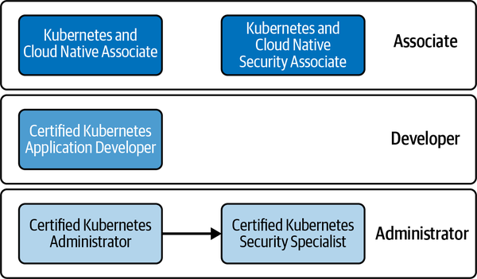

**Figure: Kubernetes certifications learning path.** The diagram positions CKS after foundational Kubernetes credentials.

**How to read it:** CKS builds on operational Kubernetes knowledge. It assumes cluster administration fluency before security specialization.

**Why it matters:** CKS tasks are not isolated security trivia. They require CKA-level cluster operations, YAML fluency, and debugging.

**How to apply it:** If you struggle with scheduling, services, kubeconfig, static Pods, or basic RBAC, review CKA topics before deep CKS practice.

**Limitations:** The diagram is a learning path, not a guarantee that certifications cover every production security concern.

### NetworkPolicy And Pod-to-Pod Isolation

- **Explanation:** NetworkPolicies define allowed ingress and egress traffic for selected Pods. They are enforced by the cluster networking plugin if it supports NetworkPolicy.
- **Problem solved:** By default, a compromised Pod may reach other Pods and services. NetworkPolicies reduce lateral movement.
- **How it works:** A policy selects target Pods with `podSelector`, chooses directions with `policyTypes`, and lists allowed peers/ports. A default-deny policy selects Pods and allows no traffic in the chosen direction.
- **Why it matters:** NetworkPolicy is one of the most practical cluster setup defenses tested by CKS.
- **When to use:** Use default-deny baseline per namespace and add explicit allow policies for required application flows.
- **When not to use:** Do not assume policies work if the CNI plugin does not enforce them. Do not rely on NetworkPolicy for identity-level authorization inside an application.
- **Tradeoffs:** Tight policies improve isolation but can break service discovery, probes, DNS, and legitimate dependencies if not tested.
- **Common mistakes:** Wrong namespace; selectors matching no Pods; forgetting egress/DNS; using only Pod labels but needing namespace labels; assuming policy order matters like firewall rules.
- **Production example:** A frontend Pod can call backend Pods on port 3000, while unrelated Pods in other namespaces cannot.
- **Questions to ask:** Which Pods are selected? Which direction is isolated? Which peers and ports are allowed? Does DNS still work?

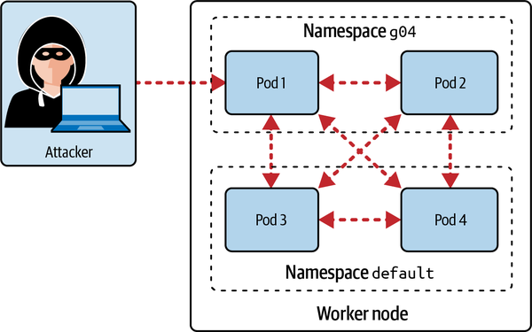

**Figure: Attacker gains Pod network access.** The diagram shows that a compromised Pod can reach other Pods when network traffic is not restricted.

**How to read it:** The compromised Pod is a foothold. Without network restrictions, it becomes a launch point for lateral movement.

**Why it matters:** NetworkPolicy is a containment control. It does not prevent initial compromise, but it reduces what a compromised workload can reach.

**How to apply it:** Start with default-deny ingress/egress in sensitive namespaces, then add narrow allow rules for required flows.

**Limitations:** NetworkPolicy does not inspect application-layer authorization, prevent malicious behavior inside allowed flows, or work without a supporting CNI.

Representative workflow:

```yaml
apiVersion: networking.k8s.io/v1
kind: NetworkPolicy
metadata:
  name: default-deny-ingress
  namespace: g04
spec:
  podSelector: {}
  policyTypes:
  - Ingress
```

This policy selects all Pods in namespace `g04` and denies ingress unless another policy allows traffic. Validate by attempting a connection that worked before policy creation and confirming it times out. Then add an allow policy and validate the intended source succeeds while an unrelated source still fails.

### Ingress TLS And External Service Exposure

- **Explanation:** Ingress manages HTTP(S) access to Services. TLS termination uses certificates and Kubernetes TLS Secrets.
- **Problem solved:** External service exposure needs encrypted traffic and centralized HTTP routing.
- **How it works:** An Ingress controller watches Ingress resources. TLS certificate/key data is stored in a Secret of type `kubernetes.io/tls`; the Ingress references the Secret and routes host/path traffic to Services.
- **Why it matters:** Misconfigured Ingress exposes services insecurely or fails traffic routing.
- **When to use:** Use Ingress for HTTP(S) workloads that need host/path routing and TLS termination.
- **When not to use:** Do not use Ingress for non-HTTP protocols unless supported by controller-specific extensions.
- **Tradeoffs:** Centralized TLS simplifies service apps but creates controller dependency and certificate lifecycle needs.
- **Common mistakes:** Wrong Secret type/name/namespace; missing Ingress controller; service port mismatch; self-signed cert used where trusted cert is required; no redirect from HTTP to HTTPS if required.
- **Production example:** A cluster uses NGINX Ingress or cloud load-balancer ingress to terminate TLS and forward to internal Services.
- **Questions to ask:** Which controller implements this Ingress? Where is the TLS Secret? Does the Service port match? How is certificate rotation handled?

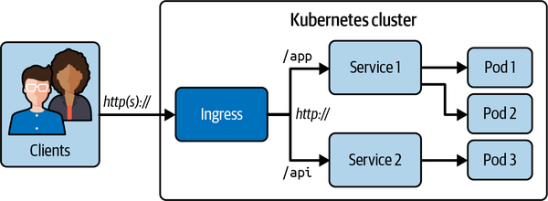

**Figure: Managing external access via HTTP(S).** The diagram shows an Ingress-based path from outside clients to Kubernetes Services.

**How to read it:** External traffic reaches an Ingress controller, which routes to backend Services and Pods.

**Why it matters:** Ingress is a security boundary for TLS, routing, and exposure control.

**How to apply it:** Pair Ingress with TLS Secrets, strict host/path rules, controller hardening, and network policy between ingress and backends.

**Limitations:** Ingress does not replace application authentication, authorization, WAF/rate limiting, or service-to-service encryption.

### Metadata Endpoint Protection

- **Explanation:** Cloud provider metadata endpoints can expose credentials or instance metadata to workloads that can reach them.
- **Problem solved:** A compromised Pod may query the node metadata service and steal credentials or sensitive platform information.
- **How it works:** NetworkPolicies, cloud-specific metadata protections, IMDS settings, and node-level firewall controls can prevent Pod access to metadata endpoints.
- **Why it matters:** Metadata abuse is a common cloud-native privilege escalation path.
- **When to use:** Always evaluate metadata access in cloud-hosted Kubernetes clusters.
- **When not to use:** Do not rely only on application code to avoid metadata endpoints.
- **Tradeoffs:** Blocking metadata may break workloads that legitimately depend on cloud metadata unless they use safer identity mechanisms.
- **Common mistakes:** Ignoring link-local addresses, assuming Pods cannot reach node-level metadata, or using broad egress policies.
- **Production example:** Block Pod egress to cloud metadata IPs while using workload identity mechanisms for cloud credentials.
- **Questions to ask:** Can a Pod reach the metadata endpoint? Which workloads genuinely need cloud credentials? Is there a safer identity path?

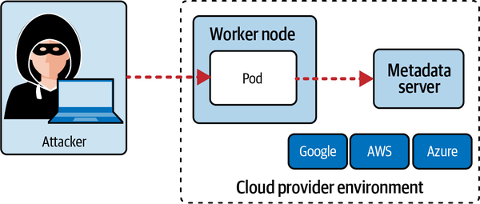

**Figure: Compromised Pod reaches metadata server.** The diagram shows a Pod foothold becoming access to node/cloud metadata.

**How to read it:** The attack path moves from container compromise to infrastructure credential exposure.

**Why it matters:** Metadata endpoints connect Kubernetes workload security to cloud account security.

**How to apply it:** Add egress restrictions, cloud provider metadata hardening, and workload identity; validate by attempting access from a test Pod.

**Limitations:** Exact controls vary by cloud provider and Kubernetes distribution.

### Kubernetes Dashboard And GUI Access

- **Explanation:** GUI components such as Kubernetes Dashboard can expose cluster operations through a web interface and usually authenticate with tokens.
- **Problem solved:** Dashboards are convenient but can become privilege-escalation targets if exposed broadly or backed by overprivileged service accounts.
- **How it works:** Dashboard access uses service account tokens or other auth flows. RBAC determines what the authenticated identity can see/do.
- **Why it matters:** The source shows both administrative and restricted user flows, making the RBAC consequence visible in the UI.
- **When to use:** Use dashboards only when needed, behind strong authentication, network restrictions, and least-privilege RBAC.
- **When not to use:** Avoid exposing dashboards publicly or using cluster-admin tokens for routine access.
- **Tradeoffs:** GUIs simplify inspection but can hide exact API calls and encourage broad tokens.
- **Common mistakes:** Long-lived admin token; public dashboard; insecure flags; no token expiration awareness; no namespace-scoped RBAC.
- **Production example:** Dashboard access is restricted to internal network/VPN, short-lived tokens, and read-only or namespace-scoped roles.
- **Questions to ask:** Who can reach the Dashboard? Which identity does it use? What can that identity do?

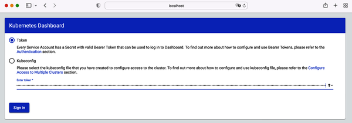

**Figure: Dashboard token login.** The screenshot shows token-based Dashboard authentication.

**How to read it:** The UI access level depends entirely on the token's identity and RBAC permissions.

**Why it matters:** Token theft or overprivileged tokens turn a GUI into a cluster-control path.

**How to apply it:** Use restricted tokens, short lifetimes, RBAC review, and network restrictions.

**Limitations:** Dashboard UI behavior does not replace command-line permission validation with `kubectl auth can-i`.

### Kubernetes Component Security And kube-bench

- **Explanation:** kube-bench checks Kubernetes cluster configuration against CIS benchmark-style controls.
- **Problem solved:** Control-plane and node component flags/configuration may be insecure or drift from recommended baseline.
- **How it works:** kube-bench runs as a job or local command, inspects configuration files, flags, permissions, and reports `PASS`, `FAIL`, `WARN`, or remediation suggestions.
- **Why it matters:** CKS tasks may require interpreting benchmark output and fixing insecure settings.
- **When to use:** Use as a periodic cluster configuration audit and as an exam-practice validation tool.
- **When not to use:** Do not apply every recommendation blindly; some checks are environment-specific or manual.
- **Tradeoffs:** Benchmark compliance improves baseline hygiene but can conflict with distribution-managed settings.
- **Common mistakes:** Ignoring `WARN`/manual checks; editing static Pod manifests without backup; not waiting for control-plane restart; assuming managed clusters allow all remediation.
- **Production example:** Run kube-bench in CI or scheduled audits, then track exceptions and remediation.
- **Questions to ask:** Which check failed? Is it applicable? What file/flag changes it? How do I verify after restart?

Representative command pattern:

```bash
kubectl apply -f https://raw.githubusercontent.com/aquasecurity/kube-bench/main/job-master.yaml
kubectl get pods
kubectl logs kube-bench-master-<suffix> > control-plane-kube-bench-results.txt
```

Use the output as an audit signal. A strong workflow captures results, identifies applicable failures, edits the correct component configuration, waits for restart, reruns the check, and records the exception if a check is intentionally not applicable.

### API Server Request Processing, Users, Certificates, And RBAC

- **Explanation:** API server requests pass through authentication, authorization, and admission before reaching persistence. RBAC grants permissions to users, groups, and service accounts through Roles/ClusterRoles and bindings.
- **Problem solved:** Cluster control must be limited to authorized identities.
- **How it works:** A user can be represented by a client certificate and kubeconfig entry. A Role grants verbs on resources in a namespace; a ClusterRole can grant cluster-scoped or reusable permissions. RoleBinding and ClusterRoleBinding attach those permissions to subjects.
- **Why it matters:** API server access is the control plane. Least privilege depends on exact verbs/resources and scope.
- **When to use:** Use namespace-scoped Roles/RoleBindings whenever possible; use ClusterRole only when the resource scope requires it.
- **When not to use:** Avoid broad `cluster-admin` for service accounts or users that only need narrow actions.
- **Tradeoffs:** Precise RBAC requires more effort but reduces compromise blast radius.
- **Common mistakes:** Missing `apiGroups`; binding wrong subject kind/name/namespace; using ClusterRoleBinding when RoleBinding is enough; no `kubectl auth can-i` validation.
- **Production example:** A user can list Pods in one namespace but cannot create Deployments or view Secrets.
- **Questions to ask:** Which identity? Which namespace? Which verbs? Which resources? Which API group? How do I prove denial?

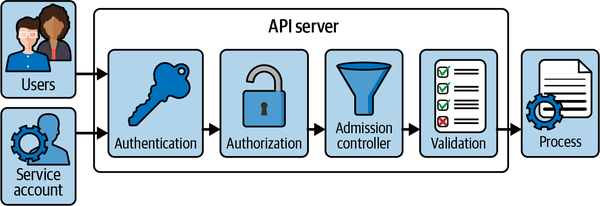

**Figure: API server request processing.** The diagram shows request flow through API server security stages.

**How to read it:** A request must authenticate, authorize, pass admission, and then be persisted or rejected.

**Why it matters:** RBAC is only one gate. Admission controllers and validation also affect outcomes.

**How to apply it:** Debug API access by identifying which stage failed: authentication, authorization, admission, or resource validation.

**Limitations:** The diagram does not cover every admission plugin, webhook failure mode, or API aggregation behavior.

Representative RBAC validation pattern:

```bash
kubectl auth can-i get pods --as jane -n red
kubectl auth can-i create deployments --as jane -n red
```

The first command should return `yes` only if the Role/Binding grants it. The second should return `no` if least privilege is correct. In the exam, always validate both allowed and forbidden actions.

### Service Account Minimization

- **Explanation:** Service accounts authenticate Pods to the API server. Tokens can be mounted automatically unless disabled.
- **Problem solved:** A compromised Pod with a service account token may call the Kubernetes API.
- **How it works:** A Pod references a service account. RBAC grants or denies that service account. `automountServiceAccountToken: false` prevents automatic token mount when API access is unnecessary.
- **Why it matters:** Default service account token exposure is a common avoidable risk.
- **When to use:** Create dedicated service accounts with minimal permissions for workloads that need API access.
- **When not to use:** Do not bind broad roles to `default` service accounts.
- **Tradeoffs:** Disabling automount improves security but breaks workloads that implicitly expect Kubernetes API access.
- **Common mistakes:** Binding a ClusterRole when namespace Role is enough; forgetting the service account namespace in RoleBinding subject; leaving automount enabled; failing to generate short-lived token when needed.
- **Production example:** A controller gets a dedicated service account with only the verbs/resources it reconciles.
- **Questions to ask:** Does this Pod need API access? Which service account is mounted? What can it do?

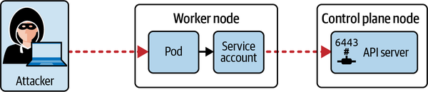

**Figure: Attacker uses service account to call API server.** The diagram shows a compromised Pod using mounted credentials.

**How to read it:** The attack path depends on the token inside the Pod and the RBAC permissions attached to that token's service account.

**Why it matters:** Workload compromise becomes cluster API access if tokens and RBAC are too permissive.

**How to apply it:** Disable automount for Pods that do not need the API. Create dedicated service accounts with least privilege.

**Limitations:** Token minimization does not protect against all application-layer compromise; it reduces Kubernetes API blast radius.

### Kubernetes Version Upgrades

- **Explanation:** Frequent Kubernetes upgrades reduce exposure to known vulnerabilities and keep clusters within supported versions.
- **Problem solved:** Old clusters accumulate security fixes, API deprecations, and unsupported components.
- **How it works:** kubeadm-style upgrades follow a staged process: plan, upgrade control-plane components, drain/upgrade nodes, uncordon, and validate.
- **Why it matters:** CKS expects awareness of security updates and version lifecycle.
- **When to use:** Maintain a regular upgrade cadence and patch critical vulnerabilities quickly.
- **When not to use:** Do not upgrade production without backups, compatibility review, and rollback planning.
- **Tradeoffs:** Upgrades reduce vulnerability exposure but can introduce API/behavior changes.
- **Common mistakes:** Skipping release notes; not draining nodes; upgrading kubelet before control plane incorrectly; ignoring deprecated APIs.
- **Production example:** Run pre-upgrade API deprecation checks, upgrade staging, then production with PodDisruptionBudgets and rollback plan.
- **Questions to ask:** What version skew is allowed? Which APIs are removed? What workloads are disruption-sensitive?

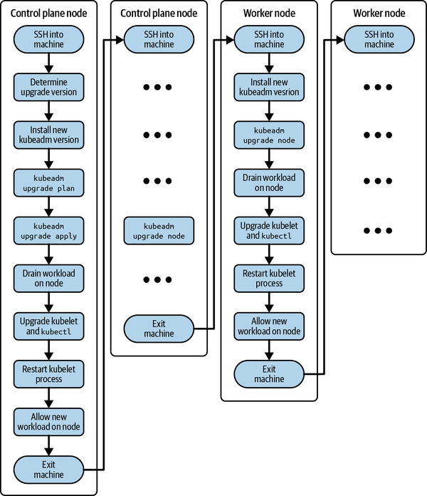

**Figure: Cluster version upgrade process.** The diagram shows a staged control-plane and node upgrade flow.

**How to read it:** Upgrades are ordered and validated step by step, not performed as one uncontrolled change.

**Why it matters:** Security updates must be applied without destabilizing cluster workloads.

**How to apply it:** Use a runbook: backup, plan, drain, upgrade, validate, uncordon, and monitor.

**Limitations:** Managed Kubernetes services have provider-specific upgrade workflows.

### Host OS Hardening, Users, File Permissions, Ports, And Firewall Rules

- **Explanation:** System hardening minimizes host attack surface by reducing packages/services, managing users/groups, controlling file permissions, closing ports, and applying firewall rules.
- **Problem solved:** Container isolation is not absolute. Node compromise undermines cluster security.
- **How it works:** Inspect services, packages, users, groups, file modes, listening ports, and firewall rules. Disable or remove what is unnecessary.
- **Why it matters:** Many Kubernetes security failures become severe only after reaching the node.
- **When to use:** Apply to worker and control-plane nodes, especially self-managed clusters.
- **When not to use:** Do not remove packages/services without understanding cluster component dependencies.
- **Tradeoffs:** Minimal hosts are safer but require discipline for debugging and operations tooling.
- **Common mistakes:** Leaving unused services listening; broad file permissions on sensitive config; stale users; no firewall baseline; using outdated `netstat` knowledge without alternatives.
- **Production example:** Only required kubelet/container runtime ports are exposed; sensitive certs/manifests are readable only by root.
- **Questions to ask:** What services are listening? Who can read kubeconfig/certificates? Which users can escalate privileges?

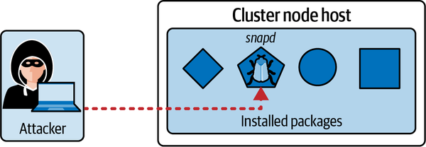

**Figure: Attacker exploits an OS-level vulnerability.** The diagram shows host OS weakness as a Kubernetes risk.

**How to read it:** A vulnerable package/service on the node can become a cluster compromise path.

**Why it matters:** Kubernetes security includes Linux hardening.

**How to apply it:** Remove unused packages, patch nodes, close ports, and protect sensitive files.

**Limitations:** Hardening must be coordinated with node lifecycle and cluster operations.

### AppArmor And seccomp

- **Explanation:** AppArmor restricts program capabilities through profiles. seccomp filters system calls available to a process.
- **Problem solved:** Containers may execute unexpected file, process, or syscall behavior if unrestricted.
- **How it works:** AppArmor profiles are loaded on nodes and referenced by Pods/containers. seccomp profiles can use runtime defaults or custom JSON profiles referenced in Pod security settings.
- **Why it matters:** Kernel-level controls reduce impact if an attacker gains code execution in a container.
- **When to use:** Use runtime default seccomp broadly; apply stricter AppArmor/seccomp profiles for sensitive workloads.
- **When not to use:** Avoid custom profiles without testing; overly strict profiles can break applications.
- **Tradeoffs:** Strong profiles reduce attack surface but increase compatibility and debugging effort.
- **Common mistakes:** Profile not loaded on node; wrong annotation/field for cluster version; assuming profile is active without checking; no application test after applying profile.
- **Production example:** Use `RuntimeDefault` seccomp and a custom AppArmor profile for a workload that should not write to sensitive paths.
- **Questions to ask:** Is the profile loaded? Which container uses it? Which syscalls/files does the app need?

### SecurityContext, Non-Root Execution, Privileged Mode, And Capabilities

- **Explanation:** Pod/container `securityContext` controls Linux user/group, privilege escalation, privileged mode, capabilities, read-only filesystem, and related runtime constraints.
- **Problem solved:** Default container settings may run as root, allow privilege escalation, or expose host-level capabilities.
- **How it works:** Configure fields such as `runAsNonRoot`, `runAsUser`, `runAsGroup`, `allowPrivilegeEscalation`, `privileged`, `capabilities`, and `readOnlyRootFilesystem`.
- **Why it matters:** Workload compromise impact is lower when containers run with minimal Linux privilege.
- **When to use:** Apply restrictive defaults to application workloads; use exceptions only for clearly justified infrastructure components.
- **When not to use:** Do not force non-root blindly if the image filesystem and process permissions are incompatible; fix the image.
- **Tradeoffs:** Restrictive contexts improve security but expose image build/runtime assumptions.
- **Common mistakes:** Setting `runAsNonRoot` on an image that still requires root-owned paths; allowing privileged mode; forgetting init containers; not dropping capabilities.
- **Production example:** A web app runs as UID 1000, drops all capabilities, disallows privilege escalation, and mounts writable paths explicitly.
- **Questions to ask:** Which UID runs the process? Does it need root? Which capabilities are required? Can root filesystem be read-only?

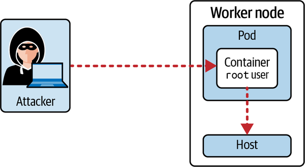

**Figure: Attacker misuses root user container access.** The diagram shows root execution inside a container as an attack amplifier.

**How to read it:** Root inside a container is not the same as root on the host, but it increases the impact of container escape, mounted file access, and misconfiguration.

**Why it matters:** Non-root execution is a high-yield workload hardening control.

**How to apply it:** Build images that support non-root users, then enforce `runAsNonRoot` and explicit UID/GID.

**Limitations:** Non-root execution does not replace seccomp, AppArmor, NetworkPolicy, or RBAC.

### Pod Security Admission And Gatekeeper/OPA

- **Explanation:** Pod Security Admission enforces built-in Pod Security Standards by namespace labels. OPA Gatekeeper enforces custom policies using admission webhooks and constraint templates.
- **Problem solved:** SecurityContext best practices need automated enforcement, not manual review of every Pod.
- **How it works:** PSA labels namespaces with modes such as `enforce`, `audit`, or `warn` and levels such as privileged, baseline, and restricted. Gatekeeper evaluates constraints against admission requests.
- **Why it matters:** Admission prevents insecure workloads from being created.
- **When to use:** Use PSA for baseline/restricted Pod security controls; use Gatekeeper for custom organization policy.
- **When not to use:** Do not rely on admission alone for already-running workloads or runtime behavior.
- **Tradeoffs:** Strict admission improves safety but can block legacy workloads. Audit/warn modes support migration.
- **Common mistakes:** Labeling wrong namespace; using enforce too early; no exception process; Gatekeeper policy not matching intended resources.
- **Production example:** New namespaces default to `restricted` PSA enforcement, with audited exceptions for system workloads.
- **Questions to ask:** Which namespaces are enforced? What level? What exceptions exist? How are violations surfaced?

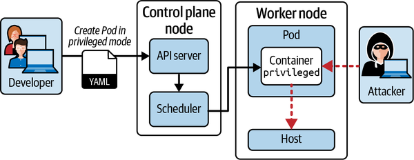

**Figure: Developer creates a Pod with privileged mode.** The diagram shows privileged mode as a dangerous workload configuration.

**How to read it:** Privileged containers weaken isolation and can interact with host capabilities.

**Why it matters:** Admission policy should prevent privileged Pods except for tightly controlled infrastructure needs.

**How to apply it:** Enforce Pod Security Standards or Gatekeeper constraints rejecting `privileged: true`.

**Limitations:** Admission enforcement must be paired with runtime detection and namespace governance.

### Secrets, etcd Access, And Encryption At Rest

- **Explanation:** Kubernetes Secrets are stored in etcd. Without encryption at rest, someone with etcd data access can read secret values.
- **Problem solved:** Protect sensitive configuration and credentials if etcd storage or backups are accessed.
- **How it works:** Configure an encryption provider file for the API server and rewrite Secrets so they are stored encrypted. Access to etcd and encryption keys must be tightly controlled.
- **Why it matters:** Secrets are not automatically safe just because the object kind is named `Secret`.
- **When to use:** Encrypt Secrets at rest and restrict etcd/control-plane access in production clusters.
- **When not to use:** Do not treat Kubernetes Secrets as a full secrets-management solution for all use cases without rotation, access review, and external secret integration considerations.
- **Tradeoffs:** Encryption improves confidentiality but adds key management and recovery responsibility.
- **Common mistakes:** Enabling encryption but not rewriting existing Secrets; storing encryption config insecurely; broad RBAC read access to Secrets; no backup/restore test.
- **Production example:** API server uses an encryption provider, KMS or strong key management, and only narrow controllers/users can read Secrets.
- **Questions to ask:** Can anyone read Secrets through RBAC? Is etcd encrypted? Are old Secrets rewritten? Where are encryption keys stored?

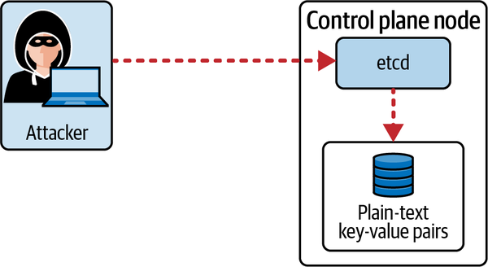

**Figure: Attacker gains etcd access to read Secrets.** The diagram shows why etcd access is highly sensitive.

**How to read it:** If an attacker reaches etcd data and Secrets are not encrypted, sensitive values are exposed.

**Why it matters:** etcd is the cluster's source of truth and must be protected like a critical database.

**How to apply it:** Encrypt Secrets at rest, restrict etcd access, secure backups, and audit Secret reads.

**Limitations:** Encryption at rest does not stop authorized API users from reading Secrets.

### RuntimeClass, gVisor, And Pod-to-Pod mTLS

- **Explanation:** RuntimeClass selects an alternate container runtime handler such as gVisor. mTLS encrypts and authenticates service-to-service traffic.
- **Problem solved:** Stronger sandboxing and encrypted Pod communication reduce impact of container compromise and network snooping.
- **How it works:** Install/configure a sandbox runtime, define a RuntimeClass, and reference it in Pods. mTLS is typically adopted through a service mesh or application-level certificate management.
- **Why it matters:** Some workloads need stronger isolation than default container runtime behavior.
- **When to use:** Use sandbox runtimes for untrusted or high-risk workloads; use mTLS for sensitive service communication.
- **When not to use:** Avoid sandbox runtimes without compatibility/performance testing. Avoid service mesh adoption without operational maturity.
- **Tradeoffs:** Better isolation can cost performance and compatibility. mTLS adds certificate lifecycle and debugging complexity.
- **Common mistakes:** RuntimeClass exists but node runtime not installed; no performance test; assuming mTLS replaces NetworkPolicy; no certificate rotation plan.
- **Production example:** Run tenant-submitted code with gVisor/Kata-style sandboxing and enforce mTLS between sensitive services.
- **Questions to ask:** What runtime handler exists on nodes? What workloads justify sandboxing? How is mTLS identity issued and rotated?

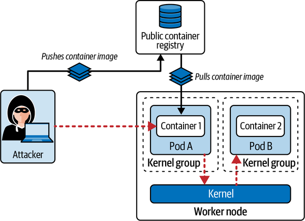

**Figure: Attacker gains access to another container.** The diagram motivates stronger workload isolation.

**How to read it:** A container breakout or weak isolation can let compromise affect neighboring workloads.

**Why it matters:** Runtime sandboxing reduces the blast radius for high-risk workloads.

**How to apply it:** Use RuntimeClass with a configured sandbox runtime and test compatibility.

**Limitations:** Sandbox runtimes reduce risk but do not replace patching, RBAC, network policy, or image security.

### Image Footprint, Multi-Stage Builds, Signing, Digests, And Registry Policy

- **Explanation:** Supply chain security reduces image attack surface and verifies image provenance. The source covers small base images, multi-stage builds, layer reduction, optimization tools, signing, digest validation, registry trust, Gatekeeper registry allowlists, and ImagePolicyWebhook.
- **Problem solved:** Vulnerable, bloated, or malicious images can compromise workloads before runtime defenses see anything.
- **How it works:** Use minimal base images, multi-stage builds, immutable digests, signatures, registry allowlists, admission policy, static analysis, and vulnerability scanning.
- **Why it matters:** Kubernetes will run what you ask it to run unless admission and supply-chain controls stop unsafe images.
- **When to use:** Use these controls for every production image pipeline.
- **When not to use:** Do not depend on public mutable tags for production.
- **Tradeoffs:** Strict controls can slow development but reduce deployed risk.
- **Common mistakes:** Using `latest`; no digest pinning; trusting public registries blindly; no scan gate; no Dockerfile linting; not validating signatures.
- **Production example:** CI builds a minimal image, scans it, signs it, publishes it to a trusted registry, and admission policy permits only signed/trusted-registry images.
- **Questions to ask:** What image digest is deployed? Was it scanned? Was it signed? Which registries are allowed?

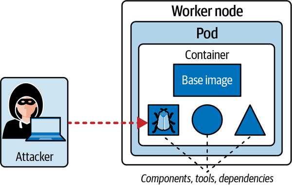

**Figure: Attacker exploits container image vulnerabilities.** The diagram shows the image as part of runtime attack surface.

**How to read it:** Vulnerabilities are shipped into the cluster if the image pipeline does not block them.

**Why it matters:** Runtime security starts at build time.

**How to apply it:** Use minimal bases, scan images, rebuild frequently, pin by digest, and gate deployment.

**Limitations:** Scans detect known vulnerabilities, not all malicious behavior or logic flaws.


**Figure: Image digest.** The screenshot shows an immutable digest associated with an image.

**How to read it:** Tags can move; digests identify specific image content.

**Why it matters:** Deploying by digest or validating digest reduces ambiguity.

**How to apply it:** Prefer immutable references and record digests in deployment artifacts.

**Limitations:** Digest pinning proves content identity, not that content is safe.

### Admission Webhooks And ImagePolicyWebhook

- **Explanation:** Admission webhooks intercept API requests and can allow, deny, or mutate resources. ImagePolicyWebhook is an admission controller that delegates image admission decisions to a backend.
- **Problem solved:** Clusters need policy gates that block unsafe images or workload specs before they run.
- **How it works:** API server sends admission review requests to a configured webhook/backend. The backend evaluates Pod/image fields and returns allow/deny.
- **Why it matters:** Admission policy converts supply-chain rules into enforceable cluster behavior.
- **When to use:** Use Gatekeeper/Kyverno/admission policy for workload constraints and ImagePolicyWebhook-style controls for image decisions where applicable.
- **When not to use:** Do not rely on a custom webhook without high availability, timeout/failure policy decisions, and testing.
- **Tradeoffs:** Admission webhooks improve enforcement but can block cluster operations if unavailable or misconfigured.
- **Common mistakes:** Wrong failurePolicy; backend TLS/config errors; no dry-run/audit mode; no exception flow; policy matches too broadly or too narrowly.
- **Production example:** Admission rejects Pods whose images are not from approved registries or lack required signatures.
- **Questions to ask:** What happens if the webhook is down? What resources are matched? How are exceptions handled?

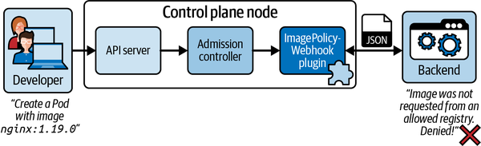

**Figure: Pod-specific API call handled by a webhook.** The diagram shows admission interception of API requests.

**How to read it:** The API server asks an external policy component before allowing the object.

**Why it matters:** This is how custom policy becomes cluster enforcement.

**How to apply it:** Use webhook-based policy carefully: test failure modes, TLS, timeouts, matching, and audit behavior.

**Limitations:** Admission controls only create/update operations; they do not monitor runtime drift by themselves.

### Static Analysis And Vulnerability Scanning

- **Explanation:** Static analysis tools inspect Dockerfiles and Kubernetes manifests; vulnerability scanners inspect container images for known vulnerabilities.
- **Problem solved:** Many insecure settings are detectable before deployment.
- **How it works:** Hadolint checks Dockerfile practices. Kubesec scores Kubernetes manifests. Trivy scans images for known vulnerabilities.
- **Why it matters:** Pre-deployment checks reduce insecure workloads entering the cluster.
- **When to use:** Run in CI and during exam tasks where tools are available.
- **When not to use:** Do not treat tool score as complete security proof.
- **Tradeoffs:** Tools catch common issues quickly but can produce false positives/negatives.
- **Common mistakes:** Running scans but ignoring output; not failing CI on severe findings; scanning only after deployment.
- **Production example:** CI blocks images with critical vulnerabilities and manifests with privileged containers unless approved.
- **Questions to ask:** Which severity blocks release? What exceptions are allowed? Is the scanner database current?

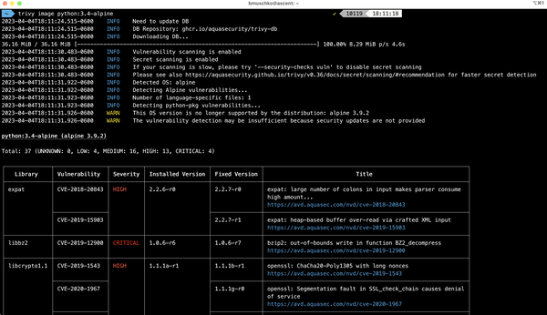

**Figure: Trivy scan report.** The screenshot shows vulnerability findings from image scanning.

**How to read it:** Findings are grouped by package/CVE/severity/fixed version depending on scanner output.

**Why it matters:** Scanning gives actionable remediation signals before runtime.

**How to apply it:** Rebuild with patched base image/packages, choose a smaller base, or block deployment until high-risk findings are resolved.

**Limitations:** Vulnerability scans do not detect all malware, misconfigurations, or exploitable paths.

### Falco, Runtime Behavior Analytics, And Container Immutability

- **Explanation:** Falco observes runtime behavior and emits alerts based on rules. Container immutability reduces changes attackers can make after compromise.
- **Problem solved:** Preventive controls may fail. Runtime behavior must be monitored for suspicious actions.
- **How it works:** Falco consumes system call and Kubernetes context data, applies rules/macros/lists, and logs events. Immutable containers use distroless images, externalized config, and read-only root filesystems.
- **Why it matters:** Runtime visibility is critical for detecting shell access, package installation, sensitive file reads, and unexpected process execution.
- **When to use:** Use Falco or equivalent runtime detection for production clusters, and immutable patterns for application containers.
- **When not to use:** Do not generate noisy alerts without triage processes.
- **Tradeoffs:** Runtime detection adds observability and response burden. Read-only filesystems require explicit writable volumes for legitimate writes.
- **Common mistakes:** Default rules not tuned; no log collection; alerts ignored; read-only root set without writable tmp/cache mounts; distroless image prevents debugging without alternate debug process.
- **Production example:** Alert when a shell is spawned in an app container and the root filesystem is read-only so package installation fails.
- **Questions to ask:** Which runtime actions are suspicious? Where do alerts go? Can the app run with read-only root?

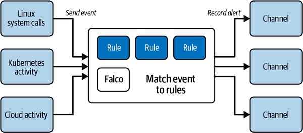

**Figure: Falco high-level architecture.** The diagram shows Falco collecting events and applying rules.

**How to read it:** Falco observes runtime activity, enriches it, and emits alerts when rules match.

**Why it matters:** Runtime detection catches behavior that static manifests cannot.

**How to apply it:** Install Falco, inspect default rules, add custom rules for workload risks, and route alerts to a monitored destination.

**Limitations:** Falco is detection, not prevention. Alerts require response.

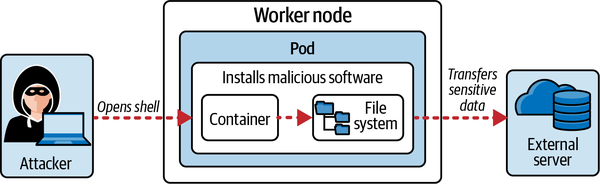

**Figure: Attacker shells into a container and installs malicious software.** The diagram shows mutable container risk.

**How to read it:** A writable root filesystem and package tools let attackers modify running containers.

**Why it matters:** Immutability reduces post-compromise persistence and drift.

**How to apply it:** Use distroless/minimal images, remove package managers, run as non-root, and set `readOnlyRootFilesystem: true`.

**Limitations:** Apps may need writable paths; mount explicit volumes for those paths.

### Audit Logs

- **Explanation:** Kubernetes audit logs record API server requests according to an audit policy and backend configuration.
- **Problem solved:** Administrators need visibility into who did what through the Kubernetes API.
- **How it works:** An audit policy defines which events are logged and at what level. The API server writes to a log backend or sends events to a webhook backend.
- **Why it matters:** API changes are the authoritative control-plane activity trail.
- **When to use:** Enable audit logging for production clusters and exam tasks that require monitoring malicious API activity.
- **When not to use:** Do not log everything at high verbosity without storage and privacy planning.
- **Tradeoffs:** More audit detail improves forensics but increases storage, noise, and sensitive-data exposure.
- **Common mistakes:** Policy file path wrong; API server static manifest not updated; no log directory mount; too-broad/too-narrow audit policy; no log rotation.
- **Production example:** Log metadata for read/list activity and request/response for sensitive mutation operations where appropriate, then ship audit logs to SIEM.
- **Questions to ask:** Which events are captured? Where are logs stored? Who reviews them? What sensitive data is included?

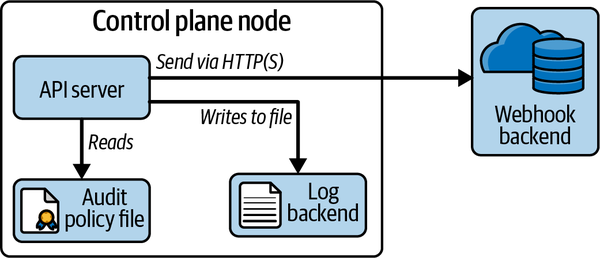

**Figure: High-level audit log architecture.** The diagram shows API server audit event generation and backend handling.

**How to read it:** API requests pass through the API server; audit policy decides what events are emitted to backends.

**Why it matters:** Audit logs are the control-plane evidence trail.

**How to apply it:** Configure policy and backend, restart API server safely, generate test API calls, and inspect resulting logs.

**Limitations:** Audit logs show API activity, not every host or container runtime event.

## 4. Implementation Patterns And Engineering Practices

### Secure-by-Default Namespace Pattern

- **Problem it solves:** Namespaces often start permissive.
- **Implementation shape:** Apply default-deny NetworkPolicies, PSA labels, resource quotas/limits where relevant, and narrow service account policies.
- **Minimal example:** Label a namespace for restricted PSA, create `default-deny-ingress`, disable default token use for Pods that do not need API access.
- **Tradeoffs and failure modes:** Strict defaults can break workloads until allow rules and security contexts are defined.
- **Testing or validation:** Run allowed and denied network tests; attempt to create a privileged Pod and confirm rejection.
- **Adaptation guidance:** Use audit/warn modes first for legacy namespaces, then enforce after remediation.

### Least-Privilege API Access Pattern

- **Problem it solves:** Overbroad RBAC increases cluster compromise blast radius.
- **Implementation shape:** Create dedicated service account/user, Role or ClusterRole with minimal verbs/resources, RoleBinding/ClusterRoleBinding with narrow scope, and validate with `kubectl auth can-i`.
- **Minimal example:** A namespace reader can `get,list,watch pods` in one namespace and cannot create Pods or read Secrets.
- **Tradeoffs and failure modes:** Precise RBAC takes more YAML but makes abuse harder.
- **Testing or validation:** Validate allowed and denied verbs with `kubectl auth can-i --as`.
- **Adaptation guidance:** Avoid binding `cluster-admin`; create aggregated roles only when needed.

### Hardened Workload Pattern

- **Problem it solves:** Reduces impact of application compromise.
- **Implementation shape:** Minimal signed/scanned image, non-root UID/GID, no privilege escalation, no privileged mode, dropped capabilities, seccomp RuntimeDefault, read-only root filesystem, explicit writable volume, no API token unless needed.
- **Minimal example:** A web container runs as UID 1000, drops all capabilities, uses read-only root, mounts `/tmp`, and has no service account token.
- **Tradeoffs and failure modes:** Some images fail until rebuilt for non-root and explicit writable paths.
- **Testing or validation:** `kubectl exec id`, attempt write to root filesystem, inspect Pod spec, and confirm application health.
- **Adaptation guidance:** Fix Dockerfile ownership and paths rather than weakening runtime policy.

### Admission Enforcement Pattern

- **Problem it solves:** Prevents insecure workloads from entering the cluster.
- **Implementation shape:** Use PSA for baseline/restricted controls and Gatekeeper/OPA or ImagePolicyWebhook for custom policies such as allowed registries.
- **Minimal example:** Namespace has `pod-security.kubernetes.io/enforce=restricted`; Gatekeeper denies images outside approved registry.
- **Tradeoffs and failure modes:** Policy misconfiguration can block legitimate deployments or fail open/closed unexpectedly.
- **Testing or validation:** Attempt to create violating and compliant resources; inspect webhook errors and audit events.
- **Adaptation guidance:** Roll out in audit/warn mode before enforce for existing clusters.

### Supply Chain Gate Pattern

- **Problem it solves:** Blocks vulnerable or untrusted images before deployment.
- **Implementation shape:** Dockerfile linting, manifest static analysis, image scanning, digest pinning, signing/verification, trusted registry admission policy.
- **Minimal example:** CI runs Hadolint, Kubesec, Trivy; signs image; deployment references digest; admission permits only trusted registry.
- **Tradeoffs and failure modes:** Security gates can slow release unless exception and patch workflows exist.
- **Testing or validation:** Use intentionally bad Dockerfile/manifest/image and confirm CI/admission blocks.
- **Adaptation guidance:** Define severity thresholds and exception expiry dates.

### Runtime Detection And Response Pattern

- **Problem it solves:** Detects malicious behavior that preventive controls miss.
- **Implementation shape:** Falco installed on nodes, tuned rules, central log collection, audit policy configured, alert routing, incident runbook.
- **Minimal example:** Falco alerts when a shell starts in a container; audit logs show who created the Pod.
- **Tradeoffs and failure modes:** Noisy rules cause alert fatigue; missing logs prevent investigation.
- **Testing or validation:** Generate controlled suspicious behavior and verify alert/log path.
- **Adaptation guidance:** Tune rules per workload and route high-severity signals to an incident process.

## 5. Code, Configuration, And Workflow Notes

### NetworkPolicy Default Deny Then Allow

**Problem solved:** Prevents unrestricted ingress and adds explicit allowed traffic.

Workflow:

1. Identify namespace and labels:

```bash
kubectl get ns g04 --show-labels
kubectl get pods -n g04 --show-labels -o wide
```

2. Apply default-deny ingress:

```yaml
apiVersion: networking.k8s.io/v1
kind: NetworkPolicy
metadata:
  name: default-deny-ingress
  namespace: g04
spec:
  podSelector: {}
  policyTypes:
  - Ingress
```

3. Validate denied traffic with `kubectl exec` and a short timeout.
4. Add allow policy using `namespaceSelector`, `podSelector`, and ports.
5. Validate allowed source succeeds and unrelated source times out.

**Common mistakes:** CNI does not enforce NetworkPolicy; wrong labels; forgetting namespace labels; not testing denied path.

### RBAC User Workflow

**Problem solved:** Grants a user narrow access to cluster resources.

Workflow:

1. Create private key and certificate signing request.
2. Create Kubernetes `CertificateSigningRequest`.
3. Approve CSR.
4. Add user credentials to kubeconfig.
5. Create Role and RoleBinding.
6. Validate:

```bash
kubectl auth can-i get pods --as <user> -n <namespace>
kubectl auth can-i create deployments --as <user> -n <namespace>
```

**Common mistakes:** Subject name mismatch, wrong namespace, wrong API group, ClusterRoleBinding when RoleBinding is enough.

### Service Account Minimization Workflow

**Problem solved:** Prevents Pods from carrying unnecessary API credentials.

Workflow:

1. Inspect mounted tokens:

```bash
kubectl get pod <pod> -o yaml
kubectl exec <pod> -- ls /var/run/secrets/kubernetes.io/serviceaccount
```

2. Disable automatic token mount:

```yaml
automountServiceAccountToken: false
```

3. Create dedicated service account only if needed.
4. Bind minimal Role.
5. Validate with `kubectl auth can-i --as system:serviceaccount:<ns>:<sa>`.

**Common mistakes:** Binding permissions to `default`; disabling automount on a controller that needs API access without replacement.

### Static Control-Plane Manifest Remediation

**Problem solved:** Changes API server flags or audit/encryption configuration on kubeadm-style clusters.

Workflow:

1. Backup static manifest:

```bash
sudo cp /etc/kubernetes/manifests/kube-apiserver.yaml /tmp/kube-apiserver.yaml.bak
```

2. Edit manifest flags.
3. Wait for kubelet to restart the static Pod.
4. Validate API server health and target behavior.

**Common mistakes:** YAML indentation error, missing hostPath mount for policy file, forgetting restart/wait, no backup.

### SecurityContext Hardened Pod Snippet

**Problem solved:** Reduces Linux privilege inside a container.

```yaml
securityContext:
  runAsNonRoot: true
  runAsUser: 1000
  runAsGroup: 3000
  allowPrivilegeEscalation: false
  readOnlyRootFilesystem: true
  capabilities:
    drop: ["ALL"]
  seccompProfile:
    type: RuntimeDefault
```

**Adaptation:** Add writable `emptyDir` or persistent volumes for paths the app must write, and rebuild images so files are owned by the runtime UID.

**Validation:** Exec `id`, try writing to `/`, inspect process behavior, and run app health checks.

### Pod Security Admission Workflow

**Problem solved:** Enforces built-in Pod security standards for a namespace.

```bash
kubectl label ns secure \
  pod-security.kubernetes.io/enforce=restricted \
  pod-security.kubernetes.io/audit=restricted \
  pod-security.kubernetes.io/warn=restricted
```

**Validation:** Try creating a privileged Pod and confirm rejection or warning/audit based on mode.

**Common mistakes:** Labeling wrong namespace; not accounting for existing workloads; enforcing before remediation.

### etcd Secret Encryption Workflow

**Problem solved:** Encrypts Secret data at rest.

Workflow:

1. Create encryption provider configuration.
2. Mount it into API server.
3. Add `--encryption-provider-config` to API server manifest.
4. Restart API server.
5. Rewrite existing Secrets:

```bash
kubectl get secrets --all-namespaces -o json | kubectl replace -f -
```

6. Validate etcd value is not plaintext and API still returns Secret through authorized path.

**Common mistakes:** Not rewriting existing Secrets; storing encryption key insecurely; breaking API server due to bad manifest.

### Image Scanning And Static Analysis Workflow

**Problem solved:** Finds image and manifest issues before deployment.

```bash
hadolint Dockerfile
kubesec scan pod.yaml
trivy image nginx:1.25
```

**Validation:** Confirm findings are reviewed and severe findings block release according to policy.

**Common mistakes:** Scanner database stale, no severity threshold, exceptions never expire.

### Falco Rule Workflow

**Problem solved:** Detects suspicious runtime behavior.

Workflow:

1. Install Falco.
2. Review config and default rules.
3. Generate a test event such as shell execution in a container.
4. Inspect Falco logs.
5. Add or override custom rules.
6. Reload/restart and retest.

**Common mistakes:** No central log collection, noisy rules ignored, custom rule syntax error.

### Audit Policy Workflow

**Problem solved:** Records Kubernetes API activity.

Workflow:

1. Create audit policy file.
2. Add API server flags for audit policy and log/webhook backend.
3. Mount policy/log paths into static Pod if needed.
4. Restart API server.
5. Generate test API calls.
6. Inspect audit logs.

**Common mistakes:** Policy file not mounted, too much or too little logging, no log rotation, webhook backend unavailable.

## 6. Testing, Validation, And Verification

| What To Validate | Why It Matters | Method | Good Signal | Warning Sign |
|---|---|---|---|---|
| NetworkPolicy isolation | Prevents lateral movement. | `kubectl exec` connection tests from allowed and denied Pods. | Allowed source succeeds; denied source times out. | Policy selects no Pods or all traffic still works. |
| Ingress TLS | Protects external HTTP traffic. | `curl -k https://host`, inspect Secret and Ingress. | TLS route reaches expected Service. | Wrong Secret namespace or no controller. |
| Metadata endpoint protection | Prevents cloud credential theft. | Exec into test Pod and attempt metadata IP access. | Metadata access blocked where not needed. | Pod can retrieve credentials. |
| kube-bench remediation | Hardens cluster config. | Run kube-bench before/after. | Applicable failures resolved or documented. | Blind remediation breaks control plane. |
| RBAC least privilege | Prevents API abuse. | `kubectl auth can-i --as ...`. | Required verbs allowed, dangerous verbs denied. | ClusterRoleBinding used unnecessarily. |
| Service account token exposure | Reduces credential theft. | Inspect Pod volumes and automount field. | Pods without API need have no token. | Default token mounted everywhere. |
| Kubernetes upgrade readiness | Reduces vulnerability exposure. | Check versions, skew, deprecated APIs, upgrade plan. | Upgrade rehearsed and validated. | Unsupported old version. |
| Host OS footprint | Reduces node attack surface. | List packages/services/listening ports. | Only required services exposed. | Unused services and open ports. |
| File permissions | Protects sensitive files. | `ls -l`, ownership checks. | Certs/manifests restricted. | World-readable sensitive files. |
| AppArmor/seccomp | Limits kernel/file behavior. | Inspect Pod spec and node profiles. | Expected profile active. | Profile referenced but not loaded. |
| Non-root workload | Reduces container compromise impact. | `kubectl exec id`, inspect securityContext. | Non-root UID, no privilege escalation. | Root or privileged container. |
| PSA/Gatekeeper | Enforces workload policy. | Attempt violating Pod creation. | Violation rejected/warned/audited as intended. | Insecure Pod admitted. |
| Secret encryption | Protects etcd data at rest. | Inspect etcd raw value and API access. | Raw storage not plaintext; API still works. | Existing Secrets not rewritten. |
| RuntimeClass sandbox | Improves isolation. | Inspect RuntimeClass and Pod runtime. | Pod uses configured handler and works. | Runtime handler absent on node. |
| Image trust | Prevents untrusted images. | Check digest/signature/registry policy. | Only approved image sources admitted. | Mutable public tag accepted. |
| Static analysis | Catches manifest/Dockerfile issues. | Hadolint/Kubesec output. | Findings triaged and fixed. | Tool output ignored. |
| Vulnerability scanning | Finds known CVEs. | Trivy image scan. | Severe findings fixed or excepted. | Critical findings deployed. |
| Falco runtime detection | Detects suspicious behavior. | Trigger test event and inspect logs. | Expected alert appears. | No alert or unmonitored logs. |
| Audit logging | Captures API activity. | Generate API call and inspect audit log. | Event appears at intended level. | API server fails or logs absent. |

## 7. Chapter-by-Chapter Knowledge Extraction

### Chapter 1. Exam Details and Resources

Main lesson: CKS is a hands-on security certification built on Kubernetes operational fluency.

Key concepts:

- Kubernetes certification path and prerequisite knowledge.
- Exam domains: cluster setup, cluster hardening, system hardening, microservice vulnerabilities, supply chain, monitoring/logging/runtime security.
- Kubernetes primitives and external tools relevant to exam tasks.
- Candidate skills: fast documentation use, command-line fluency, and practical validation.

Practical use:

- Use this chapter to scope the study plan and identify weak prerequisite areas.

Production risk connection:

- Security specialization without operational fundamentals leads to fragile controls and poor debugging.

Self-check:

- Can you edit YAML quickly, inspect RBAC, debug Pods, and recover from static manifest mistakes?

### Chapter 2. Cluster Setup

Main lesson: Secure cluster setup starts by reducing unnecessary network and external access and validating component configuration.

High-density topics:

- NetworkPolicies for Pod-to-Pod restrictions.
- kube-bench and component security best practices.
- Ingress TLS termination.
- Metadata endpoint protection.
- Kubernetes Dashboard access and RBAC.
- Binary verification with checksums.

Mechanisms:

- NetworkPolicies isolate selected Pods by direction, peer selector, and port.
- kube-bench maps cluster config to CIS-style benchmark findings.
- Ingress TLS uses TLS Secret and controller routing.
- Dashboard access depends on token identity and RBAC.
- Binary verification compares known checksum to downloaded binary checksum.

Failure modes:

- Policy selects wrong Pods; CNI does not enforce NetworkPolicy; Dashboard exposed with admin token; metadata endpoint reachable; static control-plane remediation breaks API server; binary checksum ignored.

Validation:

- Use positive/negative traffic tests, kube-bench reruns, `curl`/browser TLS checks, `kubectl auth can-i`, metadata access tests, and checksum commands.

Exam strong answer includes:

- Implement control, prove allowed path, prove denied path, clean up or leave final required state.

### Chapter 3. Cluster Hardening

Main lesson: API server access and RBAC are the core control-plane security boundary.

High-density topics:

- API server request processing.
- Secure API server connection methods.
- User certificate workflow.
- Role/RoleBinding for users.
- Service account permission minimization.
- Token automounting.
- Service account token generation.
- Kubernetes upgrade process.

Mechanisms:

- Authentication identifies caller; authorization checks RBAC; admission evaluates policy; API server persists accepted object.
- RBAC grants verbs on resources and API groups.
- Service accounts are namespace-scoped identities for Pods.
- Upgrade workflows maintain supported and patched cluster versions.

Failure modes:

- Anonymous access; insecure API server port; overbroad roles; default service account abuse; token mounted in Pods; wrong subject namespace; stale cluster version.

Validation:

- `kubectl auth can-i`, kubeconfig user tests, service account impersonation checks, Pod token inspection, version checks.

Exam strong answer includes:

- Exact RBAC scope, verification of granted permission, and verification that nonrequired permission is denied.

### Chapter 4. System Hardening

Main lesson: Kubernetes node security is Linux system security plus container runtime controls.

High-density topics:

- Host OS footprint minimization.
- CIS Ubuntu benchmark awareness.
- User/group/file permission management.
- Open port identification and firewall rules.
- AppArmor profiles.
- seccomp default and custom profiles.

Mechanisms:

- Removing packages/services reduces exploit surface.
- File permissions protect certificates, kubeconfigs, manifests, and host data.
- Firewalls restrict external network access.
- AppArmor and seccomp restrict process capabilities and syscalls.

Failure modes:

- Unused vulnerable package; open ports; world-readable sensitive files; stale users; AppArmor profile not loaded; seccomp profile path wrong; workload breaks under restrictive profile.

Validation:

- Inspect services, packages, users/groups, `ss`/port listings, file modes, AppArmor status, Pod profile fields, and workload health.

Exam strong answer includes:

- Apply host-level hardening and prove the insecure path is gone without breaking required Kubernetes services.

### Chapter 5. Minimizing Microservice Vulnerabilities

Main lesson: Workload manifests should limit Linux privilege, enforce security policy, protect secrets, isolate runtime, and encrypt service communication where needed.

High-density topics:

- SecurityContext non-root and UID/GID controls.
- Privileged container prevention.
- Pod Security Admission and Pod Security Standards.
- Gatekeeper/OPA custom policy.
- Secrets and etcd encryption.
- RuntimeClass/gVisor.
- Pod-to-Pod mTLS.

Mechanisms:

- SecurityContext sets runtime Linux identity and restrictions.
- PSA/Gatekeeper rejects unsafe Pod specs at admission.
- etcd encryption protects stored Secret values.
- RuntimeClass selects an alternate sandbox runtime.
- mTLS encrypts/authenticates service traffic.

Failure modes:

- Root containers, privileged Pods, policy not enforced, Gatekeeper constraint mismatch, Secrets readable in etcd, runtime handler missing, mTLS misconfigured.

Validation:

- Inspect Pod YAML, attempt violating Pod creation, check etcd raw data, validate RuntimeClass usage, confirm app health under restrictions.

Exam strong answer includes:

- Harden workload spec, enforce policy at namespace/admission level, and prove violations are blocked.

### Chapter 6. Supply Chain Security

Main lesson: Cluster security begins before Pods are created; images and manifests must be trusted and analyzed.

High-density topics:

- Minimal base images.
- Multi-stage builds.
- Layer reduction and optimization.
- Image signing and digest validation.
- Public registry risks.
- Gatekeeper registry allowlists.
- ImagePolicyWebhook.
- Hadolint, Kubesec, and Trivy.

Mechanisms:

- Smaller images reduce package/vulnerability footprint.
- Multi-stage builds separate build tools from runtime.
- Digest validation pins exact content.
- Admission policies block untrusted registries/images.
- Static and vulnerability scanners identify known risks.

Failure modes:

- Mutable tags, malicious public images, vulnerable base images, no CI gate, webhook unavailable, false confidence from checksum/digest without trust policy.

Validation:

- Scan image, lint Dockerfile, scan manifest, check digest, attempt disallowed registry Pod, inspect admission error.

Exam strong answer includes:

- Use the named tool/policy, interpret output, and make or describe the remediation.

### Chapter 7. Monitoring, Logging, and Runtime Security

Main lesson: Preventive controls must be paired with runtime detection and API audit evidence.

High-density topics:

- Falco installation, configuration, default and custom rules.
- Falco rule/macro/list structure.
- Distroless images and immutable containers.
- ConfigMaps/Secrets for configuration.
- Read-only root filesystem.
- Audit policies.
- Log and webhook audit backends.

Mechanisms:

- Falco detects runtime system call patterns.
- Immutable container patterns reduce post-compromise changes.
- Audit policy controls API event capture level.
- Audit backends persist or forward events.

Failure modes:

- Falco not running; rules too noisy; no alert routing; read-only root breaks app due to missing writable volume; audit policy file not mounted; log volume fills disk.

Validation:

- Trigger test event, inspect Falco logs, try writing to root filesystem, generate API call, inspect audit log.

Exam strong answer includes:

- Configure detection/logging and prove event visibility with a generated action.

### Appendix. Answers to Review Questions

Main lesson: The appendix reinforces task-level reasoning. It is useful for checking why a control works, not just what command to run.

Use for:

- Comparing your solution reasoning against expected answers.
- Reviewing RBAC and Dashboard permission outcomes.
- Practicing concise explanations for exam-style tasks.

## 8. Architecture Decision Guide

| Decision | Choose Option A When | Choose Option B When | Key Tradeoffs | Failure Risks | Questions To Ask |
|---|---|---|---|---|---|
| Default-deny NetworkPolicy vs selective policy only | Use default-deny for sensitive namespaces and production baseline. | Use selective policy only for transitional or low-risk namespaces. | Strong isolation vs breakage risk. | DNS/app dependencies blocked. | What traffic must still work? |
| Ingress TLS termination vs app-level TLS | Use Ingress TLS for centralized HTTP(S) edge control. | Use app/service mesh TLS when end-to-end encryption is required. | Central simplicity vs deeper encryption. | Plain backend traffic or cert sprawl. | Where is traffic decrypted? |
| RoleBinding vs ClusterRoleBinding | Use RoleBinding for namespace-scoped access. | Use ClusterRoleBinding only for cluster-wide needs. | Least privilege vs convenience. | Cluster-wide privilege leak. | Is the resource namespace-scoped? |
| Dedicated service account vs default service account | Use dedicated SA for any workload needing API access. | Use default only for workloads with no permissions and token disabled where possible. | Clear ownership vs setup overhead. | Default SA overprivileged. | Does this Pod need API access? |
| Disable token automount vs allow token | Disable when workload does not call API. | Allow only when API access is required. | Reduced credential exposure vs app compatibility. | Workload breaks or token stolen. | What API calls does workload make? |
| PSA vs Gatekeeper/OPA | Use PSA for built-in Pod Security Standards. | Use Gatekeeper for custom organization policy. | Simplicity vs flexibility. | Policy gaps or webhook outages. | Is the requirement covered by PSA? |
| Non-root enforcement vs image rebuild | Enforce when image supports non-root. | Rebuild image when it assumes root. | Fast hardening vs correct long-term fix. | App crash or root workload. | Who owns image changes? |
| seccomp RuntimeDefault vs custom profile | Use RuntimeDefault broadly. | Use custom profile for high-risk/specific workloads. | Compatibility vs tighter syscall control. | Profile blocks legitimate syscalls. | What syscalls does app need? |
| Public tag vs digest-pinned image | Use digest for production and exam supply-chain tasks. | Use tags for dev convenience only. | Reproducibility vs ease. | Tag drift/malicious replacement. | What exact image is deployed? |
| Gatekeeper registry allowlist vs ImagePolicyWebhook | Use Gatekeeper when constraint-based policy is enough. | Use ImagePolicyWebhook for custom backend decisions. | Simpler policy vs custom logic. | Webhook availability or policy bypass. | What image decision data is needed? |
| Distroless/read-only vs debug-friendly image | Use distroless/read-only for production runtime. | Use debug image for temporary troubleshooting. | Reduced attack surface vs debug convenience. | Debug tools available to attacker. | How will production debugging work safely? |
| Falco runtime detection vs audit logs | Use Falco for container/host behavior. | Use audit logs for API server activity. | Runtime process visibility vs control-plane visibility. | Missing half the attack path. | Is suspicious behavior API-level or runtime-level? |

## 9. System Design Playbooks

### Playbook: Secure Namespace Baseline

- **Use case or problem type:** New application namespace needs secure defaults.
- **Requirements to clarify first:** Required traffic, API access, Pod security level, exceptions, DNS needs, ingress path.
- **Baseline architecture:** Namespace labels for PSA, default-deny NetworkPolicies, dedicated service accounts, no default token automount, resource policies, and image registry policy.
- **Scaling path:** Add Gatekeeper constraints, namespace templates, GitOps enforcement, and runtime detection labels.
- **Data model considerations:** Secrets ownership and RBAC.
- **API/integration considerations:** Only workloads that need Kubernetes API receive service accounts.
- **Reliability strategy:** Test app startup, DNS, probes, and service communication after restrictions.
- **Security strategy:** Deny by default, allow explicitly.
- **Observability strategy:** Audit denied actions and Falco runtime alerts.
- **Cost considerations:** Minimal direct cost; operational time for policy maintenance.
- **Operational runbook notes:** Validate allowed/denied network and API paths before handoff.
- **Common failure modes:** DNS blocked, probes fail, workload rejected by PSA, service account missing.
- **Evolution path:** Start with audit/warn for legacy workloads, enforce for new workloads.

### Playbook: Least-Privilege Workload Controller

- **Use case:** A controller or job needs limited API access.
- **Requirements:** Exact resources, verbs, namespace scope, token lifetime, audit needs.
- **Baseline architecture:** Dedicated service account, Role/ClusterRole, binding, automount only for Pods that need it, audit logging.
- **Scaling path:** Split permissions by controller responsibility; use separate namespaces/accounts.
- **Data model:** RBAC rules map verbs/resources/API groups to workload identity.
- **Reliability:** Avoid over-restricting required controller operations.
- **Security:** No `cluster-admin`, no broad Secret access.
- **Observability:** Audit API calls by service account.
- **Failure modes:** Controller forbidden errors, overprivileged token theft.
- **Evolution:** Periodically review actual API usage and reduce permissions.

### Playbook: Hardened Application Deployment

- **Use case:** Production app Pod needs low privilege and admission enforcement.
- **Requirements:** UID/GID, writable paths, required capabilities, network flows, image trust, runtime profile.
- **Baseline architecture:** Minimal signed/scanned image, digest pinning, securityContext, PSA/Gatekeeper, NetworkPolicy, no unnecessary token, read-only root.
- **Scaling path:** Add custom seccomp/AppArmor, RuntimeClass sandbox, service mesh mTLS.
- **Data model:** Secrets and config separated from image.
- **Reliability:** Run app tests under hardened context.
- **Security:** Drop capabilities, non-root, no privilege escalation.
- **Observability:** Falco and audit events for violations.
- **Failure modes:** App cannot write temp files, bad ownership, image blocked, profile too strict.
- **Evolution:** Fix image build and app paths instead of weakening controls.

### Playbook: Secure Image Pipeline

- **Use case:** Prevent vulnerable/malicious images from running.
- **Requirements:** Trusted registries, signing, scan thresholds, digest pinning, static analysis, exception process.
- **Baseline architecture:** Hadolint, Kubesec, Trivy, signing, trusted registry, admission policy, CI gates.
- **Scaling path:** Add SBOMs, provenance, policy-as-code, and continuous rescanning.
- **Data model:** Image digest, signature, scan report, exception metadata.
- **Reliability:** CI gates must be deterministic and fast enough for developers.
- **Security:** Block critical CVEs and untrusted registries.
- **Observability:** Scan reports and admission denial events.
- **Failure modes:** Scanner DB stale, mutable tag drift, webhook outage.
- **Evolution:** Move from advisory scans to enforceable admission policy.

### Playbook: Runtime Detection And Forensics

- **Use case:** Detect and investigate malicious runtime/API activity.
- **Requirements:** Runtime events, API events, alert routing, retention, incident workflow.
- **Baseline architecture:** Falco on nodes, custom rules, Kubernetes audit policy, log backend, alerting, runbook.
- **Scaling path:** Central SIEM, response automation, workload-specific rules, evidence retention.
- **Data model:** Event fields, user/service account, namespace, Pod, container, process, syscall, API verb.
- **Reliability:** Detection components monitored and updated.
- **Security:** Alerts for shell, package install, sensitive file read, privileged Pod creation, Secret access.
- **Observability:** Falco logs and audit logs correlated by time/workload.
- **Failure modes:** Too much noise, missing audit policy, log disk pressure, no response owner.
- **Evolution:** Tune rules from incidents and threat models.

## 10. Operating, Troubleshooting, And Debugging

| Symptom | Likely Cause | How To Investigate | Fix | Prevention |
|---|---|---|---|---|
| NetworkPolicy has no effect | CNI does not enforce policy or selector mismatch. | Check CNI, `kubectl describe networkpolicy`, Pod labels. | Fix labels/policy or use enforcing CNI. | Validate with allowed/denied tests. |
| Expected traffic is blocked | Default-deny missing allow rule, DNS blocked, wrong namespaceSelector. | Exec from source Pod; inspect labels and ports. | Add precise allow rule. | Document required flows before deny. |
| Ingress TLS fails | Secret missing/wrong namespace, controller absent, host mismatch. | `kubectl describe ingress`, controller logs, Secret type. | Create correct TLS Secret and Ingress. | Ingress smoke tests. |
| kube-bench check still fails | Wrong file/flag, static Pod not restarted, check not applicable. | Inspect kube-bench output and component manifest. | Correct applicable config and rerun. | Track benchmark exceptions. |
| User still forbidden | RBAC subject/API group/namespace wrong. | `kubectl auth can-i --as`, describe RoleBinding. | Fix binding/Role verbs/resources. | Use least-privilege test cases. |
| User has too much access | ClusterRoleBinding or broad role. | `kubectl auth can-i '*' '*' --as`. | Replace with namespace RoleBinding. | RBAC review. |
| Service account token visible unexpectedly | Automount default enabled. | Inspect Pod spec and volume mounts. | Set `automountServiceAccountToken: false`. | Namespace/workload templates. |
| API server down after edit | Static manifest YAML/flag/mount error. | Check kubelet logs and manifest backup. | Restore backup, fix YAML. | Backup before edits. |
| Host hardening breaks node | Removed required package/service or firewall blocked kubelet/runtime. | Check kubelet/container runtime status and ports. | Restore required service/rule. | Test in staging. |
| AppArmor/seccomp not applied | Profile not loaded or wrong field/annotation. | Check node profile status and Pod spec/events. | Load profile and correct spec. | Profile validation. |
| Pod rejected by PSA | Namespace enforce level blocks spec. | Read admission error. | Harden Pod or adjust namespace mode intentionally. | Audit/warn before enforce. |
| Gatekeeper policy does not trigger | Constraint mismatch or Gatekeeper not running. | Check constraints, templates, Gatekeeper pods/logs. | Fix match and constraint. | Test violating manifest. |
| Secret still plaintext in etcd | Existing Secret not rewritten or encryption not active. | Inspect API server config and raw etcd. | Rewrite Secrets and verify config. | Encryption validation runbook. |
| RuntimeClass Pod pending/fails | Handler unavailable on node. | Describe Pod and RuntimeClass; inspect node runtime. | Install/configure runtime handler. | RuntimeClass compatibility test. |
| Trivy findings ignored | No CI/admission gate. | Inspect pipeline policy. | Add severity threshold and exception flow. | Supply-chain policy. |
| Admission webhook blocks all Pods | Webhook unavailable or failurePolicy behavior. | Check webhook config, service, TLS, logs. | Restore webhook or adjust failure policy carefully. | HA webhook and staged rollout. |
| Falco logs no alert | Falco not running, rule disabled, event not matching. | Check Falco pods/service, config, rule, logs. | Enable/tune rule and retest. | Detection tests. |
| Read-only root breaks app | App writes to root filesystem. | Container logs and failed write paths. | Mount writable volume for required path or rebuild image. | Image/app compatibility test. |
| Audit logs absent | Policy path/mount/backend flag wrong. | Check API server manifest and logs. | Fix policy/backend mounts/flags. | Generate test API call after config. |

## 11. Applying This Knowledge To Existing Systems

### Cluster Setup Review

- **What to inspect:** NetworkPolicies, Ingress TLS, metadata endpoint access, Dashboard exposure, kube-bench findings, binary provenance.
- **Why it matters:** These controls reduce external exposure and lateral movement.
- **Good looks like:** Default-deny policies, explicit allow rules, TLS ingress, blocked metadata access, no public Dashboard, benchmark findings tracked.
- **Warning signs:** No NetworkPolicies, Dashboard cluster-admin token, reachable metadata service, ignored kube-bench failures.
- **Suggested improvement options:** Apply secure namespace baselines, run kube-bench, restrict Dashboard, test network paths.

### RBAC And API Access Review

- **What to inspect:** ClusterRoleBindings, service accounts, token automounting, users/certificates, kubeconfigs, audit logs.
- **Why it matters:** API permissions control cluster modification and data access.
- **Good looks like:** Namespace-scoped roles, dedicated service accounts, no unnecessary tokens, audit trail.
- **Warning signs:** Many `cluster-admin` bindings, default service account permissions, broad Secret reads.
- **Suggested improvement options:** Run `kubectl auth can-i` checks, reduce bindings, disable automounting, create dedicated identities.

### Node/System Hardening Review

- **What to inspect:** OS packages, services, open ports, users/groups, file permissions, firewall rules, AppArmor/seccomp availability.
- **Why it matters:** Node compromise undermines workload isolation.
- **Good looks like:** Minimal services, restricted sensitive files, required ports only, runtime default seccomp.
- **Warning signs:** Unused services, world-readable certs/kubeconfigs, broad SSH, no profiles.
- **Suggested improvement options:** Patch/remove packages, close ports, enforce profiles, add host hardening baseline.

### Workload Security Review

- **What to inspect:** Pod securityContext, privileged mode, capabilities, root user, read-only root, PSA labels, Gatekeeper constraints, Secrets use, RuntimeClass.
- **Why it matters:** Workload specs define compromise blast radius.
- **Good looks like:** Non-root, no privilege escalation, dropped capabilities, restricted PSA, encrypted Secrets.
- **Warning signs:** Privileged Pods, root images, broad Secret mounts, no admission policy.
- **Suggested improvement options:** Harden manifests, label namespaces, add constraints, encrypt etcd Secrets.

### Supply Chain Review

- **What to inspect:** Dockerfiles, base images, image tags/digests, signing, registries, scan reports, CI gates, admission policies.
- **Why it matters:** Unsafe images enter before runtime.
- **Good looks like:** Minimal images, digest pinning, trusted registries, scans and static analysis enforced.
- **Warning signs:** `latest` tags, public untrusted registries, critical CVEs, no Dockerfile linting.
- **Suggested improvement options:** Add Hadolint/Kubesec/Trivy gates, signing, allowed-registry admission.

### Runtime And Audit Review

- **What to inspect:** Falco deployment/rules/log routing, audit policy, audit backend, alert ownership, immutable container settings.
- **Why it matters:** Prevention fails; detection and evidence are necessary.
- **Good looks like:** Runtime alerts monitored, audit logs retained, custom rules for critical workloads.
- **Warning signs:** No runtime detection, audit disabled, logs local-only, alert noise ignored.
- **Suggested improvement options:** Install/tune Falco, configure audit logs, define response runbooks.

## 12. Applying This Knowledge To New Systems

Use this sequence for a new Kubernetes cluster or workload platform:

1. **Define security baseline:** Kubernetes version, CNI NetworkPolicy support, admission strategy, RBAC model, runtime detection, audit retention.
2. **Create secure namespaces:** PSA labels, default-deny NetworkPolicies, service account defaults, resource controls.
3. **Define identity model:** Human access, service accounts, certificate/kubeconfig handling, least-privilege RBAC.
4. **Harden nodes:** Minimal OS, patching, services, firewall, file permissions, AppArmor/seccomp, kubelet/runtime config.
5. **Harden workloads:** SecurityContext, non-root images, read-only root, no privilege, dropped capabilities, runtime profiles.
6. **Secure secrets:** Encryption at rest, RBAC restrictions, rotation/integration with external secret management if needed.
7. **Secure supply chain:** Minimal images, scan/lint, signatures, digest pinning, trusted registries, admission policy.
8. **Add runtime visibility:** Falco or equivalent, audit policy, log backend, alert routing, incident runbooks.
9. **Validate controls:** Positive/negative tests for every policy.
10. **Automate and govern:** GitOps/IaC, CI gates, recurring scans, audit reviews, exception management.

New-system baseline checklist:

- NetworkPolicy-capable CNI installed.
- Default-deny namespace policy template available.
- PSA `restricted` or staged audit/warn/enforce plan defined.
- Gatekeeper/Kyverno/custom admission policy strategy chosen if needed.
- Human access is role-based and auditable.
- Default service account token automounting is controlled.
- Node OS hardening baseline exists.
- AppArmor/seccomp runtime support verified.
- Secrets encryption configured and tested.
- Supply-chain scan/signing policy enforced.
- Falco/runtime detection installed and tested.
- Audit policy and backend configured.
- Upgrade cadence and vulnerability response process defined.

## 13. Technology Mapping

| Concept Or Need | Technology Option | When To Use | Watch Outs | Alternatives |
|---|---|---|---|---|
| Pod network isolation | NetworkPolicy | Restrict Pod ingress/egress. | Requires enforcing CNI and correct selectors. | Service mesh policy, cloud firewall controls. |
| Cluster config benchmark | kube-bench | CIS-style config audit. | Manual/applicability checks. | Managed provider security posture tools. |
| HTTP(S) external access | Ingress + controller | Host/path routing and TLS. | Controller, Secret, and Service mismatch. | Gateway API, LoadBalancer Service. |
| GUI access | Kubernetes Dashboard | Visual inspection when strictly controlled. | Token exposure and overprivilege. | kubectl, Lens/internal tools with RBAC. |
| API auth/authorization | Certificates, kubeconfig, RBAC | Human and workload API control. | Subject/API group/scope mistakes. | OIDC provider, external auth. |
| Workload identity | ServiceAccount | Pod API access. | Token automount and broad RBAC. | External workload identity systems. |
| Version security | kubeadm/provider upgrade | Patch vulnerabilities and stay supported. | API deprecations, workload disruption. | Managed cluster auto-upgrade policies. |
| Host package/service hardening | Linux package/service tools | Minimize node footprint. | Removing required dependencies. | Immutable node images. |
| Port inspection | `ss`, firewall tooling | Identify exposed services. | Host/network policy mismatch. | Cloud/network security tooling. |
| Mandatory access control | AppArmor | Restrict process/file behavior. | Profile availability and compatibility. | SELinux where supported. |
| Syscall filtering | seccomp | Restrict kernel syscall surface. | Custom profile breakage. | RuntimeDefault, sandbox runtime. |
| Pod security baseline | Pod Security Admission | Enforce built-in standards. | Namespace labels and legacy workload migration. | Gatekeeper, Kyverno. |
| Custom policy | OPA Gatekeeper | Enforce custom admission constraints. | Webhook availability and policy correctness. | Kyverno, ValidatingAdmissionPolicy. |
| Secret storage protection | Encryption at rest for etcd | Protect stored Secret values. | Key management and rewriting old Secrets. | External secrets/KMS integration. |
| Sandbox runtime | gVisor/RuntimeClass | Stronger container isolation. | Performance/compatibility. | Kata Containers, separate nodes. |
| Service encryption | mTLS/service mesh | Encrypt/authenticate Pod-to-Pod traffic. | Certificate/mesh operations. | Application TLS. |
| Dockerfile linting | Hadolint | Static Dockerfile checks. | Findings need policy. | Custom linters. |
| Manifest scoring | Kubesec | Static manifest security analysis. | Score is not complete proof. | kube-score, Polaris, policy engines. |
| Image scanning | Trivy | Known vulnerability detection. | Scanner DB freshness and exceptions. | Grype, commercial scanners. |
| Image admission | ImagePolicyWebhook | Custom image allow/deny backend. | Webhook HA/failure policy. | Gatekeeper/Kyverno image policies. |
| Runtime detection | Falco | Detect suspicious syscalls/Kubernetes context. | Tuning and alert routing. | Tetragon, commercial runtime tools. |
| API audit | Kubernetes audit logs | API activity evidence. | Storage/noise/sensitive data. | Managed control-plane audit integration. |

## 14. Production Readiness And Delivery Checklist

- **Cluster version:** Supported Kubernetes version and upgrade cadence defined.
- **Network isolation:** NetworkPolicy-capable CNI installed; default-deny and allow policies tested.
- **Ingress security:** TLS configured; controller hardened; external exposure documented.
- **Metadata protection:** Pod access to cloud metadata blocked or replaced with safe identity.
- **Benchmarking:** kube-bench or equivalent run; findings remediated or exception-tracked.
- **API access:** No insecure/anonymous access; RBAC least privilege; human access auditable.
- **Service accounts:** Dedicated service accounts; default token automount controlled; no broad default permissions.
- **Node hardening:** Packages/services minimized; ports restricted; sensitive files permissioned; firewall baseline applied.
- **Kernel controls:** AppArmor/seccomp profiles available and applied where required.
- **Workload security:** Non-root, no privileged mode, no privilege escalation, dropped capabilities, read-only root where possible.
- **Admission policy:** PSA enforced or staged; Gatekeeper/custom policies tested; exceptions governed.
- **Secrets:** etcd encryption enabled; old Secrets rewritten; RBAC restricts Secret reads; key management documented.
- **Sandboxing:** RuntimeClass/sandbox used for high-risk workloads and compatibility tested.
- **Traffic encryption:** mTLS/service mesh/application TLS used where sensitive Pod-to-Pod traffic requires it.
- **Supply chain:** Minimal images, static analysis, vulnerability scanning, signing/digest pinning, trusted registries.
- **Runtime detection:** Falco or equivalent deployed, tuned, monitored, and tested.
- **Audit logging:** Audit policy configured; logs shipped/retained; sensitive data exposure considered.
- **Validation:** Every control has an allowed and denied test.
- **Runbooks:** Incident response, rollback, policy exception, and upgrade runbooks exist.

## 15. Knowledge Gaps And Further Study

- **Current Kubernetes version behavior:** The source was published in 2023 and exam Kubernetes versions change. Verify current CKS environment versions, APIs, Pod Security Admission behavior, service account token behavior, and exam curriculum before sitting the exam.
- **Policy ecosystem evolution:** The book emphasizes OPA Gatekeeper and ImagePolicyWebhook. **Inference** Also study Kyverno and Kubernetes ValidatingAdmissionPolicy if your production environment uses them.
- **Managed Kubernetes differences:** Some control-plane edits, kube-bench remediation, audit configuration, and metadata controls differ on managed services such as EKS, GKE, and AKS. **Inference** Map CKS concepts to your provider's supported controls.
- **Advanced runtime security:** Falco basics are covered, but production runtime response requires alert triage, SIEM integration, evidence retention, and incident playbooks.
- **Service mesh/mTLS operations:** The book introduces mTLS concepts, but production mesh operation requires certificate lifecycle, sidecar/resource overhead, policy design, and debugging.
- **Supply-chain provenance depth:** Signing and scanning are covered, but modern production programs should also study SBOMs, SLSA, provenance attestations, admission verification, and rebuild cadence.
- **Linux hardening depth:** The system hardening chapter provides exam-focused Linux workflows. Production baselines should include distro-specific hardening guides, immutable node images, vulnerability management, and automated compliance.

## 16. Practice Exercises

### Concept-Check Questions

1. Explain how a Kubernetes API request is processed.
   - **Strong answer:** Covers authentication, authorization, admission, validation, persistence, and where RBAC/admission policies apply.
2. Explain why disabling service account automounting reduces risk.
   - **Strong answer:** Identifies mounted token as API credential and discusses workloads that do or do not need API access.
3. Compare PSA and Gatekeeper.
   - **Strong answer:** PSA enforces built-in Pod Security Standards by namespace label; Gatekeeper enforces custom constraints through admission webhook.
4. Explain why digest pinning does not prove an image is safe.
   - **Strong answer:** Digest proves exact content, but image may still be vulnerable or malicious unless scanned/signed/trusted.

### Implementation Exercises

1. Create a namespace with default-deny ingress and allow only frontend Pods to call backend Pods on one port.
   - **Strong answer:** Uses correct namespace/pod labels, validates frontend succeeds and unrelated Pod fails.
2. Create a user with read-only Pod access in one namespace.
   - **Strong answer:** Creates certificate/kubeconfig or impersonation setup, Role/RoleBinding, and validates allowed/denied verbs.
3. Harden a Pod to run as non-root with read-only root filesystem and RuntimeDefault seccomp.
   - **Strong answer:** Applies securityContext, fixes writable paths, validates UID and app health.
4. Configure audit logging for Secret reads and Pod creates.
   - **Strong answer:** Creates audit policy, mounts it into API server, configures backend, generates test events, and inspects logs.

### Debugging Scenarios

1. A NetworkPolicy was applied but all Pods can still connect.
   - **Strong answer:** Checks CNI support, namespace, selectors, `policyTypes`, labels, and test method.
2. A Pod is rejected after enabling restricted PSA.
   - **Strong answer:** Reads admission error, identifies violating fields, fixes securityContext or namespace policy intentionally.
3. Falco does not alert when a shell opens in a container.
   - **Strong answer:** Checks Falco running state, rules, config, logs, event generation, and output routing.
4. Audit logs disappear after API server edit.
   - **Strong answer:** Checks static manifest mounts/flags, file paths, API server logs, and restores backup if needed.

### Current-System Assessment Tasks

1. Inventory all `cluster-admin` bindings.
   - **Strong answer:** Lists subjects, owners, justification, and reduction plan.
2. Identify workloads running as root or privileged.
   - **Strong answer:** Queries Pod specs, classifies exceptions, and proposes securityContext/PSA remediation.
3. Scan all running images for high/critical vulnerabilities.
   - **Strong answer:** Maps image digests to workloads, scans with current DB, prioritizes fixes, and adds CI/admission gates.

### Future-System Design Tasks

1. Design a secure default namespace template.
   - **Strong answer:** Includes PSA labels, NetworkPolicy, service account defaults, resource constraints, image policy, and validation tests.
2. Design a Kubernetes runtime detection pipeline.
   - **Strong answer:** Includes Falco deployment, rule tuning, log shipping, audit logs, alert routing, and incident runbooks.

## 17. Quick Reference

### Key Terms

- **NetworkPolicy:** Kubernetes object controlling Pod ingress/egress traffic.
- **CNI:** Container Network Interface plugin; must support NetworkPolicy for enforcement.
- **Ingress:** HTTP(S) routing resource implemented by an Ingress controller.
- **TLS Secret:** Secret of type `kubernetes.io/tls` holding cert/key data.
- **kube-bench:** CIS benchmark-style Kubernetes configuration checker.
- **RBAC:** Role-based access control using Roles/ClusterRoles and bindings.
- **ServiceAccount:** Namespace-scoped workload identity.
- **Automount token:** Automatic mounting of service account token into Pods.
- **PSA:** Pod Security Admission, built-in enforcement of Pod Security Standards.
- **OPA Gatekeeper:** Admission policy engine for Kubernetes using constraints/templates.
- **SecurityContext:** Pod/container security settings for Linux identity and privilege.
- **Privileged container:** Container with broad host-like privileges.
- **AppArmor:** Linux mandatory access control profile system.
- **seccomp:** Linux syscall filtering mechanism.
- **RuntimeClass:** Kubernetes object selecting a container runtime handler.
- **gVisor:** Sandbox runtime implementation.
- **etcd encryption:** API server encryption of stored resources such as Secrets.
- **Image digest:** Immutable content identifier for container image.
- **Hadolint:** Dockerfile linter.
- **Kubesec:** Kubernetes manifest security analyzer.
- **Trivy:** Vulnerability scanner.
- **ImagePolicyWebhook:** Admission controller for image policy decisions.
- **Falco:** Runtime security detection tool.
- **Audit policy:** Kubernetes configuration defining which API events are audited.

### Decision Rules Of Thumb

- Use default-deny NetworkPolicies, then add precise allow rules.
- Validate both allowed and denied paths.
- Use RoleBinding before ClusterRoleBinding when namespace scope is enough.
- Disable service account token automounting unless needed.
- Use dedicated service accounts for workloads that call the API.
- Enforce PSA restricted baseline for new application namespaces.
- Use Gatekeeper/OPA for custom policy beyond PSA.
- Run containers as non-root and drop capabilities by default.
- Use RuntimeDefault seccomp as a baseline.
- Encrypt Secrets at rest and restrict RBAC access to Secrets.
- Prefer image digests and trusted registries over mutable tags.
- Scan images and manifests before deployment.
- Use Falco for runtime behavior and audit logs for API activity.

### Implementation Rules Of Thumb

- Always check namespace and context first.
- Use `kubectl auth can-i` for RBAC verification.
- Use `kubectl describe` to read admission and scheduling errors.
- Backup static manifests before editing.
- Wait for control-plane component restarts after manifest changes.
- Re-run the same validation after remediation.
- For every policy, test a violating object.
- For every runtime alert, generate a controlled test event.
- Keep exception handling explicit and time-bounded.

### Common Anti-Patterns

- NetworkPolicy YAML applied without CNI enforcement.
- Selectors matching no Pods.
- Dashboard exposed with admin token.
- Broad `cluster-admin` service accounts.
- Default service account tokens mounted everywhere.
- Static Pod manifest edited without backup.
- Privileged Pods accepted in application namespaces.
- Root images used because build files are poorly owned.
- Secrets stored unencrypted in etcd.
- Public mutable image tags in production.
- Scans run but findings ignored.
- Admission webhook with unsafe failure behavior.
- Falco installed but logs unmonitored.
- Audit logging configured without retention or rotation.

### Critical Questions Before Implementation

- What namespace, context, and cluster am I changing?
- What exact attack path is this control reducing?
- Which identity is making the API call?
- What does the policy select?
- What action should be allowed?
- What action should be denied?
- How do I prove both?
- What breaks if this policy is too strict?
- Is this an exam shortcut or production-safe change?
- What rollback or backup exists?
