# Certified Kubernetes Security Specialist (CKS) Study Guide - Engineering Knowledge

- **Detected title:** *Certified Kubernetes Security Specialist (CKS) Study Guide*
- **Author:** Benjamin Muschko
- **Primary domains:** Kubernetes security, cluster setup, cluster hardening, host hardening, microservice vulnerability reduction, supply chain security, monitoring, logging, runtime security, and performance-based CKS exam practice.
- **How to use this file:** Use it as a Kubernetes security field guide. The source is exam-oriented, but the reusable engineering value is a threat-driven approach to hardening a cluster from network paths, API access, node operating systems, Pod privileges, image supply chain, runtime behavior, and audit evidence.
- **Version note:** The source reflects the CKS curriculum and Kubernetes ecosystem at publication time. Kubernetes security APIs, admission policy options, scanner output, and exam objectives can change; verify current CNCF and Kubernetes documentation before exam day or production rollout. `[Inference]`
- **Coverage method:** Parsed the EPUB spine from preface through appendix, extracted chapter text and the complete image inventory, then converted the material into operational patterns and decision guides.

## 1. Learning Roadmap

Study the book as a defense-in-depth sequence.

First, anchor on the CKS scope. The exam assumes Kubernetes administration skill and then narrows the task to security controls: reduce blast radius, make unsafe actions impossible by default, and preserve evidence when something suspicious happens.

Second, secure communication paths. Start with NetworkPolicies, Ingress TLS, control-plane endpoint exposure, GUI access, metadata server exposure, and binary verification. These topics show that cluster security begins before workload hardening.

Third, secure the API. Understand the request pipeline: authentication proves identity, authorization checks permissions, admission can mutate or reject, validation checks object shape, and persistence stores accepted state. Most Kubernetes security controls either protect this path or install logic into it.

Fourth, harden nodes and workloads. Minimize host software, permissions, and external access. Inside Pods, constrain users, Linux capabilities, privileged mode, host namespaces, filesystem write access, seccomp, AppArmor, and admission policies.

Fifth, treat the supply chain as part of runtime security. Minimal base images, image digest pinning, image trust, static analysis, admission webhooks, CI/CD scanning, and vulnerability reports reduce the chance that a workload starts with known compromise built in.

Finally, instrument runtime behavior. Falco-style behavioral detection, immutable container expectations, Kubernetes audit logs, and log filtering convert incidents from hidden behavior into observable evidence.

After studying, the reader should be able to:

- Build default-deny network isolation and explicit service-to-service allowances.
- Explain Kubernetes API request processing and place RBAC/admission controls correctly.
- Minimize service account, node, host OS, and cloud IAM exposure.
- Configure Pod and container security contexts for least privilege.
- Use Pod Security Admission and policy engines to block unsafe workload specs.
- Protect Secrets and understand why etcd access is a high-impact failure.
- Reduce container image attack surface and verify image identity.
- Scan workloads and images before deployment.
- Use Falco, audit logs, and runtime evidence to detect suspicious behavior.
- Practice security tasks under performance-based exam constraints.

**Figure: Kubernetes certifications learning path.** The CKS sits after general Kubernetes administration knowledge. Read this as a dependency warning: security tasks assume you already know Pods, Services, RBAC, networking, cluster lifecycle, and troubleshooting.

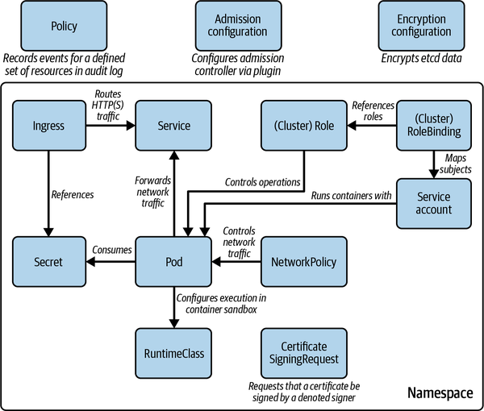

**Figure: Kubernetes primitives relevant to the exam.** The exam is not about every Kubernetes feature. It focuses on primitives that create or reduce security risk: Pods, Services, NetworkPolicies, Ingress, ServiceAccounts, RBAC, admission, Secrets, and runtime controls.

## 2. High-Value Mental Models

| Mental Model | Explanation | Helps Solve | Example | Common Misuse |
|---|---|---|---|---|
| Assume breach, then cut paths | A compromised Pod should not imply access to every Pod, API endpoint, metadata endpoint, or dashboard. | NetworkPolicy, endpoint exposure, GUI lockdown, metadata access. | Default-deny ingress and egress, then allow DNS and specific app paths. | Relying only on perimeter controls once the attacker is already inside a Pod. |
| The API server is the security choke point | Every meaningful cluster mutation flows through authentication, authorization, admission, validation, and persistence. | RBAC debugging, webhook design, audit interpretation. | A Pod creation request can authenticate, pass RBAC, then be rejected by admission. | Treating RBAC as the only control in the request path. |
| Service accounts are workload identities | Pods can call the API as mounted service account tokens; unnecessary tokens increase blast radius. | Least-privilege API access from workloads. | Disable automount where the workload does not need Kubernetes API access. | Leaving broad default service account access available to every Pod. |
| Privilege is a workload property, not just a user property | Root users, capabilities, privileged mode, host namespaces, and writable filesystems change what a compromised process can do. | Pod hardening, Pod Security Admission, policy enforcement. | Drop all capabilities and add only the one required. | Assuming a container boundary is enough even when privileged mode is enabled. |
| Secrets are only as safe as their storage and readers | Kubernetes Secrets reduce accidental exposure but do not remove the need to protect etcd, RBAC, and runtime mounts. | Secret management, etcd hardening, RBAC design. | Encrypt Secrets at rest and limit who can read them. | Treating Base64-encoded Secret values as cryptographic protection. |
| Supply chain risk starts before Kubernetes sees a Pod | Large images, mutable tags, malicious registries, weak pipelines, and unscanned manifests become cluster risk. | Image selection, digest pinning, scanning, admission policy. | Deploy an image by digest after vulnerability scanning. | Scanning only running Pods after an image has already shipped. |
| Runtime detection catches what prevention misses | Hardening reduces risk; behavioral detection and audit logs reveal suspicious activity after execution begins. | Incident response, threat hunting, audit trails. | Alert on unexpected shell execution inside a container. | Expecting static YAML controls to catch all runtime behavior. |
| Exam speed comes from repeatable command patterns | CKS tasks reward fast inspection, manifest editing, validation, and correction under time pressure. | Performance-based exam practice and production incident drills. | Use `kubectl auth can-i`, `kubectl explain`, dry runs, and targeted log queries. | Memorizing isolated commands without understanding why they work. |

## 3. Cluster Setup And Network Boundaries

### NetworkPolicy as Pod-Level Segmentation

- **Explanation:** NetworkPolicies constrain ingress and egress traffic for selected Pods. They are Kubernetes objects, but enforcement requires a network plugin that implements policy behavior.
- **Problem solved:** A compromised workload should not freely connect to every other workload or leave the cluster without explicit permission.
- **How it works:** A policy selects target Pods by labels, declares ingress and/or egress policy types, then lists allowed peers, namespaces, IP blocks, and ports. Once a Pod is selected by a policy for a direction, traffic not allowed by policy is denied for that direction.
- **Production use:** Start with namespace-level default-deny policies, then add small allow policies for DNS, ingress controller traffic, service-to-service calls, and required external endpoints.
- **Common mistakes:** Writing a policy without labels that match the intended Pods; forgetting egress DNS; assuming NetworkPolicy works without a policy-capable CNI; allowing broad namespace selectors because it is faster during troubleshooting.
- **Review questions:** Which Pods does this policy select? Which direction is isolated? What traffic remains implicitly allowed? Does the CNI enforce NetworkPolicy?

**Figure: An attacker who gained access to Pod 1 has network access to other Pods.** This is the default risk NetworkPolicy addresses. Without isolation, one compromised Pod can scan and talk to unrelated Pods across nodes and namespaces.

### Ingress TLS and Edge Routing

- **Explanation:** Ingress routes external HTTP(S) traffic to internal Services based on hosts and paths. TLS can terminate at the Ingress, but traffic inside the cluster may still be plaintext unless additional controls are used.
- **Problem solved:** Centralized entry routing reduces ad hoc service exposure and gives a place to enforce TLS, host routing, and certificate handling.
- **How it works:** An Ingress controller watches Ingress objects and configures a proxy or load balancer. Rules map host/path combinations to Services, and TLS configuration references certificate material.
- **Production use:** Require HTTPS at the edge, use managed certificate rotation or documented certificate renewal, and pair Ingress policy with NetworkPolicy so backend Pods are reachable only from expected ingress components.
- **Common mistakes:** Assuming Ingress TLS automatically encrypts Pod-to-Pod traffic; exposing Services with NodePort while also using Ingress; failing to restrict which namespaces can create externally reachable routes. `[Inference]`

**Figure: Managing external access to the Services via HTTP(S).** The figure separates external HTTP(S) access from internal service routing. Treat the Ingress as the front door, not as a complete east-west traffic security solution.

### Metadata Server and Cloud Endpoint Exposure

- **Explanation:** In cloud environments, node metadata endpoints can expose credentials or instance identity information. A Pod that can reach node metadata may gain privileges outside Kubernetes.
- **Problem solved:** Prevents a workload compromise from becoming cloud account compromise.
- **How it works:** Block workload access to metadata IPs with network policy, node firewalling, cloud metadata hardening features, or provider-specific workload identity mechanisms. The exact control depends on platform support. `[Inference]`
- **Production use:** Audit metadata reachability from Pods, prefer scoped workload identity, and block generic metadata access from namespaces that do not need it.
- **Common mistakes:** Treating Kubernetes RBAC as sufficient while the Pod can still obtain node or cloud credentials.

**Figure: An attacker who gained access to the Pod has access to metadata server.** This visual shows why cloud metadata is part of the Kubernetes threat model. The risky path leaves Kubernetes API controls and reaches infrastructure identity.

### Dashboard and GUI Exposure

- **Explanation:** Web dashboards provide convenient cluster visibility but can become high-value attack surfaces when externally exposed or bound to excessive permissions.
- **Problem solved:** Limits the blast radius of stolen tokens or dashboard access.
- **How it works:** Dashboard access is mediated by authentication token and the permissions of the underlying Kubernetes identity. RBAC determines what the user or service account can view or mutate.
- **Production use:** Avoid public exposure, require strong authentication, bind least-privilege roles, and prefer short-lived or externally managed identity flows where available. `[Inference]`
- **Common mistakes:** Reusing privileged service account tokens; confusing dashboard login success with authorization success; exposing dashboard endpoints for convenience.

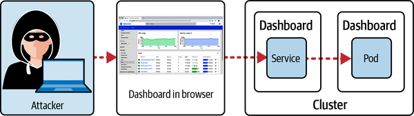

**Figure: An attacker who gained access to the Dashboard.** Dashboard compromise gives the attacker a UI over the same API capabilities allowed to the chosen identity.

**Figure: The usage of the token in the Dashboard login screen.** The token is not just a login string; it maps to Kubernetes identity and RBAC permissions.

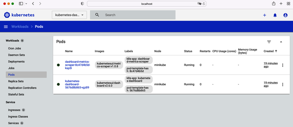

**Figure: The Dashboard view of Pods in a specific namespace.** A permitted dashboard view can reveal object names, labels, images, and operational details useful to an attacker.

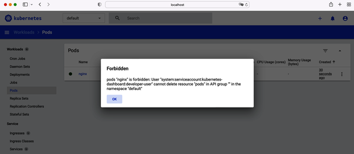

**Figure: An error message rendered when trying to invoke a permitted operation.** Authorization failures are useful proof that RBAC is restricting the dashboard identity. Verify negative cases, not only successful access.

### Binary Integrity Verification

- **Explanation:** Cluster tooling and platform binaries should be verified against trusted checksums before use.
- **Problem solved:** Prevents a compromised download path from injecting malicious executables into the operator or node environment.
- **How it works:** Download the binary and published checksum from trusted locations, compute the local checksum, and compare before installation or execution.
- **Production use:** Automate checksum or signature verification in provisioning scripts and CI images used for cluster administration. `[Inference]`
- **Common mistakes:** Downloading over HTTPS but never verifying integrity; copying commands from untrusted pages; installing tools into privileged automation runners without provenance checks.

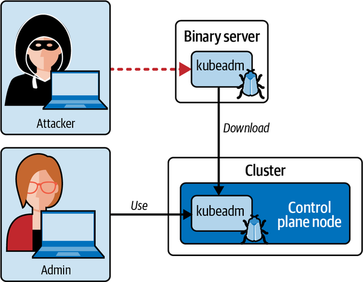

**Figure: An attacker who injected malicious code into a binary.** The attack path is outside Kubernetes but can compromise Kubernetes because administrators and nodes run the downloaded binary.

## 4. Cluster Hardening And API Access

### API Request Processing

- **Explanation:** Kubernetes API calls pass through authentication, authorization, admission control, request validation, and then storage. Security decisions happen at multiple stages.
- **Problem solved:** Helps place controls in the right layer and debug why a request succeeded or failed.
- **How it works:** Authentication identifies the caller. Authorization decides whether the caller can perform the verb on the resource. Admission can mutate or reject a request based on policy. Validation checks schema and object consistency.
- **Production use:** Use RBAC for subject permissions, admission for object policy, audit logs for evidence, and validation errors as feedback when manifests are malformed.
- **Common mistakes:** Debugging admission rejections as RBAC failures; granting cluster-admin to bypass a temporary error; installing webhooks without failure-mode and availability planning. `[Inference]`

**Figure: API server request processing.** Read left to right: identity first, permission second, policy third, object validity fourth. This is the central map for Kubernetes security debugging.

### API Server Exposure

- **Explanation:** The API server is the front door to the cluster. Exposing it broadly increases the chance of brute force, credential misuse, and exploit attempts.
- **Problem solved:** Reduces attack surface for cluster mutation and discovery.
- **How it works:** Restrict network access to the API endpoint, require strong credentials, rotate certificates/tokens, and monitor audit logs for unusual callers.
- **Production use:** Put the API endpoint behind private networking, allow-listed administration networks, VPN or bastion paths, and identity-aware access where the platform supports it. `[Inference]`
- **Common mistakes:** Making the API endpoint internet-accessible for operational convenience; relying on obscurity of kubeconfig files; leaving stale admin certificates active.

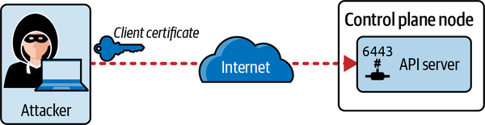

**Figure: An attacker calls the API server from the internet.** This is the most direct cluster compromise path: if the API is reachable and credentials are weak or stolen, every downstream control is under pressure.

### RBAC and Least Privilege

- **Explanation:** RBAC binds subjects to allowed verbs on resources through Roles, ClusterRoles, RoleBindings, and ClusterRoleBindings.
- **Problem solved:** Users and workloads get only the actions required for their job.
- **How it works:** Namespaced Roles apply within a namespace; ClusterRoles can describe cluster-scoped permissions or reusable permission sets. Bindings attach subjects to roles.
- **Production use:** Prefer narrow Roles, namespace scoping, and explicit verbs. Validate with `kubectl auth can-i` for both allowed and denied cases.
- **Common mistakes:** Binding `cluster-admin` to service accounts; granting wildcard verbs/resources; forgetting that secrets read permission is highly sensitive; binding to `default` service accounts broadly.

### Service Accounts as API Identities

- **Explanation:** Pods can receive projected service account tokens and use them to call the API server.
- **Problem solved:** Workloads that need API access can authenticate without embedding static credentials.
- **How it works:** The Pod references a service account; Kubernetes mounts token material unless automount is disabled. API requests made with that token are authorized through RBAC.
- **Production use:** Create a dedicated service account per workload that needs API access, bind only required verbs/resources, disable automount for workloads that do not need API access, and regularly test capabilities.
- **Common mistakes:** Assuming service account identity is harmless; allowing every Pod to use the default account token; forgetting that an attacker with shell access inside the container can use mounted credentials.

**Figure: An attacker uses a service account to call the API server.** The figure shows why service account tokens are valuable to attackers. A compromised container can become an API client.

### Kubernetes Version Updates

- **Explanation:** Frequent updates reduce exposure to fixed vulnerabilities and keep cluster components within supported version skew.
- **Problem solved:** Unpatched control planes, kubelets, and clients accumulate known vulnerabilities and unsupported behavior.
- **How it works:** Upgrade control-plane components first, then node components, draining workloads as needed and validating health between steps.
- **Production use:** Maintain an upgrade calendar, test add-ons, check API deprecations, back up etcd for self-managed clusters, and document rollback limits. `[Inference]`
- **Common mistakes:** Delaying upgrades until emergency windows; upgrading nodes before the control plane; ignoring CNI, CSI, admission webhook, and policy engine compatibility.

**Figure: Process for a cluster version upgrade.** Security hardening includes lifecycle discipline. Upgrades are not just feature adoption; they close vulnerabilities and keep components in a supported relationship.

## 5. System Hardening

### Minimize Host OS Footprint

- **Explanation:** Kubernetes nodes should run only the packages and services needed to operate the node.
- **Problem solved:** Fewer packages and background services means fewer vulnerabilities, fewer open ports, and less post-exploitation tooling.
- **How it works:** Inventory packages and services, disable unnecessary services, remove unneeded software, and keep the remaining OS patched.
- **Production use:** Build minimal node images, enforce configuration baselines, and replace nodes through image rollout rather than hand-edited long-lived servers where possible. `[Inference]`
- **Common mistakes:** Installing debugging tools permanently on every node; allowing node configuration drift; leaving default services enabled after cluster bootstrap.

**Figure: An attacker exploits an OS-level vulnerability.** The cluster inherits node risk. A vulnerable package on the host can become the path around Kubernetes workload controls.

### Minimize IAM and Credential Exposure

- **Explanation:** Cloud IAM roles, node credentials, and local credentials should be narrowly scoped and protected from workload access.
- **Problem solved:** Prevents host or Pod compromise from becoming broad infrastructure compromise.
- **How it works:** Scope node roles, restrict credential file permissions, block metadata access when not needed, and prefer workload-specific identities over shared node-level credentials. `[Inference]`
- **Production use:** Separate node permissions from workload permissions and audit which credentials exist on nodes.
- **Common mistakes:** Giving nodes broad cloud roles because it simplifies integration; placing static credentials on node filesystems; failing to consider file permissions as part of cluster security.

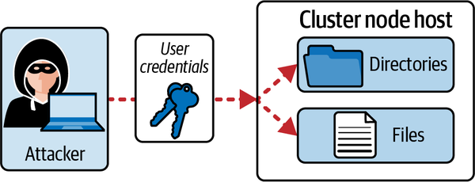

**Figure: An attacker uses stolen credentials to access files.** This shows the lateral jump from stolen credentials to file access. Credential scope and filesystem protection decide how much damage follows.

### AppArmor, seccomp, and Kernel-Level Constraints

- **Explanation:** Kernel hardening tools restrict what processes can do, even after code execution begins.
- **Problem solved:** Reduces the impact of exploited processes by limiting system calls, file access patterns, and privilege-sensitive behavior.
- **How it works:** seccomp filters system calls; AppArmor profiles restrict program capabilities and filesystem access on supported distributions. Kubernetes can reference these controls in Pod configuration depending on node support.
- **Production use:** Start with runtime default seccomp profiles, then use stricter workload-specific profiles for high-risk workloads. `[Inference]`
- **Common mistakes:** Enabling profiles without testing; assuming every node supports the same profile names; treating kernel controls as a replacement for least privilege elsewhere.

## 6. Workload And Microservice Vulnerability Reduction

### Security Contexts

- **Explanation:** Pod and container security contexts define runtime constraints such as user ID, group ID, capabilities, privileged mode, privilege escalation, filesystem behavior, and seccomp profile.
- **Problem solved:** Prevents common container escape or privilege escalation conditions from being the default.
- **How it works:** Pod-level settings apply broadly; container-level settings can override or specialize. The runtime enforces Linux-level controls where supported.
- **Production use:** Run as non-root, drop all Linux capabilities by default, disable privilege escalation, use read-only root filesystems where feasible, set seccomp to runtime default, and avoid host namespaces and hostPath mounts unless justified. `[Inference]`
- **Common mistakes:** Setting `runAsNonRoot` but using an image that requires root; adding capabilities without documenting why; enabling privileged mode to solve file permission issues.

**Figure: An attacker misuses root user container access.** If the process runs as root in the container, a compromise starts with more power. Reduce the starting privilege before an incident occurs.

**Figure: A developer creates a Pod with enabled privileged mode.** Privileged mode changes the threat model. It should be treated as an explicit exception path controlled by policy, review, and narrow namespaces.

### Pod Security Admission and Policy Engines

- **Explanation:** Admission policy enforces workload safety rules before unsafe Pods are persisted or scheduled.
- **Problem solved:** Prevents insecure specifications from entering the cluster, rather than relying on developers to remember every setting.
- **How it works:** Pod Security Admission evaluates Pods against predefined security profiles. Policy engines such as OPA Gatekeeper can express organization-specific rules.
- **Production use:** Apply baseline restrictions broadly, reserve privileged workloads for controlled system namespaces, and use custom policy for labels, allowed registries, hostPath rules, and required security context fields. `[Inference]`
- **Common mistakes:** Enforcing strict policy in existing namespaces without auditing breakage; forgetting exemptions for cluster components; deploying webhooks without considering failure policy.

### Secret Protection

- **Explanation:** Kubernetes Secrets can be mounted or exposed as environment variables, but access to etcd, broad RBAC, or compromised Pods can still reveal them.
- **Problem solved:** Keeps sensitive configuration out of plain manifests and supports controlled distribution to workloads.
- **How it works:** Secret objects are stored by the API server, persisted in etcd, and delivered to authorized Pods. Encryption at rest and tight RBAC reduce exposure.
- **Production use:** Encrypt Secrets at rest, restrict `get/list/watch` on Secrets, avoid environment variables for highly sensitive values when process dumps or logs are a concern, and rotate secrets after suspected exposure. `[Inference]`
- **Common mistakes:** Confusing Base64 with encryption; giving read access to Secrets through broad roles; allowing every operator to list Secrets cluster-wide.

**Figure: An attacker gains access to etcd to read Secrets.** etcd access is cluster-state access. If Secrets are not protected at rest and etcd is compromised, application credentials are exposed.

### Runtime Sandboxing and East-West Encryption

- **Explanation:** Runtime sandboxes and mutual TLS reduce what a compromised container can reach or observe.
- **Problem solved:** Sandboxing strengthens isolation between workloads; mTLS protects service-to-service traffic from passive interception or unauthorized peers.
- **How it works:** Sandboxed runtimes such as gVisor or Kata Containers introduce stronger isolation boundaries. mTLS encrypts and authenticates communication between services, often through a service mesh. `[Inference]`
- **Production use:** Use stronger runtime isolation for untrusted or multi-tenant workloads, and use mTLS for sensitive in-cluster traffic that crosses trust boundaries.
- **Common mistakes:** Assuming ordinary container isolation is equivalent to VM isolation; enabling mTLS without operational ownership of certificates, identity, telemetry, and failure modes.

**Figure: An attacker gains access to another container.** This visual emphasizes isolation between containers and workloads. A compromise should remain local, not become automatic access to neighbors.

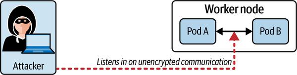

**Figure: An attacker listens to Pod-to-Pod communication.** Network encryption matters when east-west traffic carries sensitive data or crosses shared infrastructure. NetworkPolicy controls who can talk; mTLS can protect what they say.

## 7. Supply Chain Security

### Minimal Base Images

- **Explanation:** Smaller, purpose-built images reduce packages, tools, and vulnerabilities available to attackers.
- **Problem solved:** Limits exploitability and post-exploitation capability inside containers.
- **How it works:** Choose minimal base images, remove build-time dependencies from runtime images, and use multi-stage builds to separate compilation from execution. `[Inference]`
- **Production use:** Track image size and vulnerability count, pin versions, and rebuild images when base images receive security fixes.
- **Common mistakes:** Using full distribution images for tiny services; installing package managers and shells in production images by default; failing to rebuild after base image patches.

**Figure: An attacker exploits container image vulnerabilities.** The base image is inherited risk. Every unnecessary package is another possible vulnerability and another tool an attacker may use.

### Image Integrity, Digests, and Registries

- **Explanation:** Image identity should be stable and verifiable. Tags are convenient labels; digests identify immutable image content.
- **Problem solved:** Prevents mutable tags or malicious registry updates from silently changing deployed code.
- **How it works:** Pulling by digest binds deployment to content. Registries store image manifests and layers; trust depends on registry controls, authentication, and verification workflows.
- **Production use:** Pin production deployments by digest after scanning and promotion, and protect registry write permissions. `[Inference]`
- **Common mistakes:** Deploying `latest`; allowing many CI jobs to push to production repositories; scanning a tag and then deploying the same tag after it has changed.

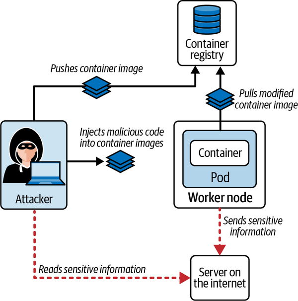

**Figure: An attacker injects malicious code into a container image.** This shows supply chain compromise before deployment. Kubernetes may faithfully run a malicious image if the image passes admission and scheduling.

**Figure: The image digest of the alpine:3.17.0 container image on Docker Hub.** Digest pinning converts image selection from a mutable name to content-addressed identity.

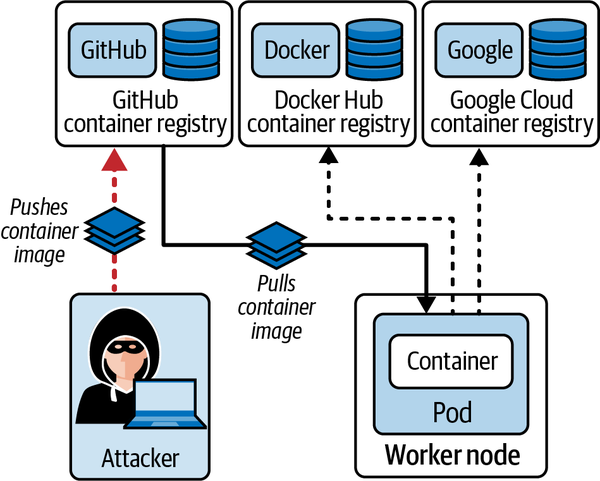

**Figure: An attacker uploads a malicious container image.** Registry permissions are production permissions. If attackers can publish into trusted repositories, deployments can become the delivery mechanism.

### Admission Webhooks and Static Analysis

- **Explanation:** Admission webhooks intercept Kubernetes API requests and can validate or mutate objects before persistence.
- **Problem solved:** Converts organizational rules into enforceable cluster policy.
- **How it works:** The API server sends admission review requests to configured webhook services. The webhook responds with allow, deny, patches, or warnings depending on type and configuration.
- **Production use:** Enforce allowed registries, required security contexts, label requirements, digest pinning, and restricted volume types through policy. `[Inference]`
- **Common mistakes:** Creating a webhook that can block the API during outage; writing policy that is impossible for system components to satisfy; failing to test dry-run and rollout behavior.

**Figure: Intercepting a Pod-specific API call and handling it with a webhook.** This is the extension point for custom guardrails. The request is still an API request, but policy can decide whether it becomes stored cluster state.

### CI/CD Security and Image Scanning

- **Explanation:** Pipelines should build, test, scan, and promote artifacts before deployment. Image scanners such as Trivy report known vulnerabilities in image contents.
- **Problem solved:** Finds known vulnerable packages and configuration issues before workloads reach the cluster.
- **How it works:** The pipeline builds images, scans them, runs static checks on manifests, and gates deployment based on severity policy.
- **Production use:** Fail builds for critical vulnerabilities with available fixes, track accepted risk exceptions, and rescan images because vulnerability databases change over time. `[Inference]`
- **Common mistakes:** Treating a clean scan as proof of no vulnerabilities; ignoring scanner database freshness; allowing manual deployment paths that bypass pipeline checks.

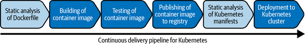

**Figure: An exemplary continuous delivery pipeline for Kubernetes.** Security gates belong in the delivery path, not only after deployment. The pipeline is where image selection, scanning, and manifest checks become repeatable.

**Figure: Reporting generated by scanning a container image with Trivy.** Scanner output is a triage artifact. Use severity, package, fixed version, and reachability context to decide whether to patch, rebuild, or temporarily accept risk.

## 8. Monitoring, Logging, And Runtime Security

### Behavior Analytics and Falco

- **Explanation:** Runtime tools watch host and container activity for suspicious behavior such as unexpected shells, sensitive file reads, package installation, or unusual network activity.
- **Problem solved:** Detects behaviors that static Kubernetes configuration cannot predict.
- **How it works:** Falco observes kernel events through drivers or eBPF-style mechanisms, enriches events with Kubernetes metadata, evaluates rules, and emits alerts.
- **Production use:** Start with common rules, tune noisy alerts, route findings to incident workflows, and preserve enough context to answer who, what, where, and when. `[Inference]`
- **Common mistakes:** Installing detection without response ownership; ignoring high-volume noisy rules until operators stop trusting alerts; failing to map alerts back to Pods, namespaces, and images.

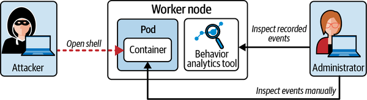

**Figure: Malicious events recorded by behavior analytics tool.** Hardening lowers probability; behavior analytics improves visibility after something starts happening.

**Figure: Falco high-level architecture.** The architecture separates event capture, rule evaluation, and alert output. Operationally, each layer can fail or need tuning.

### Immutable Containers

- **Explanation:** A running container should be treated as immutable: do not install software, patch files manually, or mutate runtime state as the durable fix.
- **Problem solved:** Keeps production behavior reproducible and makes suspicious runtime changes easier to detect.
- **How it works:** Rebuild and redeploy images for changes. Use read-only root filesystems and policy where feasible to prevent runtime mutation.
- **Production use:** Investigate with ephemeral/debug tooling where appropriate, then ship fixes through the image pipeline. `[Inference]`
- **Common mistakes:** Shelling into containers and installing tools during incidents without recording changes; relying on manual fixes that disappear on restart; allowing writable root filesystems by default.

**Figure: An attacker shells into a container and installs malicious software.** Mutable runtime state gives attackers a persistence and tooling path. Immutability makes the path noisier and less reliable.

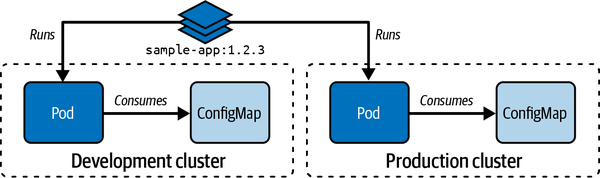

**Figure: Using the same container image across multiple environments.** Promote the same image artifact through environments. Rebuilding different images per environment weakens traceability and makes scan results less meaningful.

### Audit Logs

- **Explanation:** Kubernetes audit logs record API server activity and are essential for understanding cluster access and mutation history.
- **Problem solved:** Provides evidence for who did what, from where, against which resource, and whether the request was allowed or denied.
- **How it works:** An audit policy selects which events and detail levels to record. The API server emits audit events to configured backends.
- **Production use:** Record sensitive resource access, failed authorization attempts, privileged workload creation, role binding changes, secret reads, and admission denials. Preserve logs outside the cluster for incident response. `[Inference]`
- **Common mistakes:** Logging too little to reconstruct incidents; logging so much that storage and query become unusable; failing to protect audit logs from tampering.

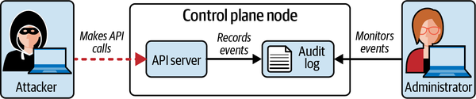

**Figure: An attacker monitored by observing audit logs.** Audit logs turn API activity into evidence. They do not prevent the action, but they make hidden cluster mutation harder.

**Figure: The high-level audit log architecture.** The API server is the source of audit events. Policy decides what to capture, and backends decide how durable and queryable the evidence becomes.

## 9. Decision Guides

### Network Isolation Decision Guide

| Question | Prefer | Rationale | Watch For |
|---|---|---|---|
| Do Pods need to receive traffic from all namespaces? | Default-deny ingress plus named allows | Makes expected relationships explicit. | Namespace selector sprawl. |
| Does the workload need internet egress? | Default-deny egress with explicit DNS and endpoint allow rules | Reduces exfiltration and command-and-control paths. | DNS accidentally blocked. |
| Is traffic entering through an Ingress? | Allow backend Pods only from ingress controller namespace/labels | Keeps bypass traffic out. | Controller labels changing during upgrades. |
| Is cloud metadata reachable? | Block unless a workload-specific identity design requires it | Prevents cloud credential theft from Pods. | Provider-specific metadata exceptions. |

### API Access Decision Guide

| Need | Control | Validation Command Or Evidence | Risk If Wrong |
|---|---|---|---|
| Human admin access | Scoped kubeconfig, short-lived identity, RBAC | `kubectl auth can-i` with target verbs | Over-broad human mutation rights. |
| Workload API access | Dedicated service account and narrow Role | Inspect mounted token and RoleBinding | Pod compromise becomes API compromise. |
| Object safety rules | Pod Security Admission or policy webhook | Admission rejection for unsafe fixture | Unsafe Pods admitted silently. |
| Investigation history | Audit policy and durable backend | Query for role changes, secret reads, Pod exec | Incidents cannot be reconstructed. |

### Workload Hardening Decision Guide

| Workload Condition | Minimum Hardening | Stronger Hardening | Watch For |
|---|---|---|---|
| Stateless web service | non-root user, no privilege escalation, dropped capabilities, runtime seccomp | read-only root filesystem, mTLS, egress policy | Image requiring root writes. |
| Batch job | non-root, scoped service account, no host mounts | dedicated namespace policy and short token lifetime | Broad job permissions. |
| Node-level agent | explicit privileged exception, narrow namespace, audited RBAC | dedicated nodes or sandboxing where possible | Normalizing privileged mode. |
| Untrusted tenant workload | strict admission, network isolation, sandboxed runtime | separate clusters or node pools | Shared kernel and noisy neighbor risk. `[Inference]` |

## 10. Incident And Operations Playbooks

### Compromised Pod Triage

1. Identify the Pod, namespace, image, node, service account, owner, and start time.
2. Preserve evidence: logs, events, audit entries, Falco alerts, image digest, and current manifest.
3. Check mounted service account permissions with `kubectl auth can-i --as=system:serviceaccount:<namespace>:<serviceaccount>`.
4. Inspect NetworkPolicies to determine reachable Pods, namespaces, DNS, metadata endpoints, and internet egress.
5. Rotate credentials exposed through Secrets, environment variables, projected files, or cloud metadata.
6. Rebuild and redeploy from a clean image; avoid manual mutation of the running container as the fix.
7. Add or tighten controls that would have blocked or detected the path: admission, security context, RBAC, egress policy, scanner gate, or runtime alert.

### Unsafe Privileged Pod Request

1. Determine why privileged mode, host namespace, hostPath, or added capability is requested.
2. Replace with a narrower capability or file permission change if possible.
3. If the exception is real, isolate it in a controlled namespace with strict RBAC and network policy.
4. Add admission policy so only approved identities and namespaces can create the exception.
5. Add audit and runtime detection for changes to that workload class.

### Suspicious API Activity

1. Query audit logs for the user/service account, source IP, verb, resource, namespace, and response code.
2. Inspect recent RoleBinding and ClusterRoleBinding changes.
3. Check whether the identity can read Secrets, create Pods, exec into Pods, or bind roles.
4. Disable or rotate the credential if compromise is plausible.
5. Review admission and RBAC gaps that allowed the action.

## 11. Common Failure Modes

| Symptom | Likely Cause | Check | Fix |
|---|---|---|---|
| NetworkPolicy appears ignored | CNI does not enforce NetworkPolicy or Pod selector does not match | CNI docs, Pod labels, policy status/tests | Use policy-capable CNI and correct labels. |
| Pod cannot resolve DNS after egress deny | DNS egress not allowed | Test UDP/TCP 53 to kube-dns/CoreDNS | Add explicit DNS egress allow. |
| Dashboard login works but actions fail | Token identity lacks RBAC permissions | Dashboard error, `kubectl auth can-i` | Bind only required permissions. |
| Admission webhook blocks normal work | Policy too broad or webhook unavailable | API server events/logs, webhook failure policy | Stage policy, add exemptions, fix availability. |
| Secret values exposed | Broad RBAC or etcd/storage compromise | Secret read audit logs, role bindings, etcd config | Restrict RBAC, encrypt at rest, rotate secrets. |
| Scanner reports many criticals | Large or stale base image | Scanner output, image Dockerfile | Rebuild with patched minimal base. |
| Falco alerts are ignored | Rule noise or unclear ownership | Alert volume, false-positive review | Tune rules and route high-confidence alerts. |
| Audit logs are missing key events | Audit policy too narrow or backend misconfigured | API server audit flags and policy | Update policy and durable log sink. |

## 12. Practice Drills

- Create a namespace with default-deny ingress and egress, then allow one frontend Pod to call one backend Pod and DNS only.
- Create a service account with permission to list Pods in one namespace, then prove it cannot read Secrets or create Pods.
- Write a Pod spec that runs as non-root, disallows privilege escalation, drops all capabilities, uses runtime default seccomp, and mounts a read-only root filesystem.
- Configure an admission policy goal: reject privileged Pods outside an approved namespace.
- Scan an image with Trivy, record the digest, and decide whether the image should be promoted.
- Simulate a suspicious `kubectl exec` or Pod creation event and find it in audit logs.
- Write an incident note from a Falco alert that includes Pod, namespace, image, node, service account, event rule, and next action.

## 13. Visual Inventory

| Classification | Count | Files | Handling |
|---|---:|---|---|
| High-value embedded figures | 34 | `ckss_0101.png` through `ckss_0706.png` excluding appendix files | Embedded near the concept each figure supports. |
| Reference-only figures | 2 | `ckss_aa01.png`, `ckss_aa02.png` | Extracted for completeness but not embedded in the main concept flow. |
| Decorative/duplicate/noise icons | 6 unique files, 123 repeated occurrences | `1.png` through `6.png` | Not copied; these are tiny callout markers and do not add standalone engineering meaning. |

### Reference-Only Appendix Figures

| Figure | Why Reference-Only |
|---|---|
| `ckss_aa01.png` | Appendix answer screenshot confirming a Dashboard permissions outcome already explained in the dashboard section. |
| `ckss_aa02.png` | Appendix answer screenshot confirming a denied Dashboard view already explained in the dashboard/RBAC section. |

## 14. Final Validation

- **Source coverage method:** EPUB metadata, spine, chapter files, appendix, and image references were parsed locally. The knowledge file covers the preface, all seven main chapters, and appendix answer material at summary level.
- **Extracted visual count:** 36 real `ckss_*` figures copied to `knowledge/assets/certified-kubernetes-security-specialist-cks-study-guide-knowledge/`.
- **Embedded/explained visual count:** 34 chapter figures embedded and explained in context.
- **Reference-only count:** 2 appendix figures extracted and inventoried as reference-only.
- **Decorative/duplicate/noise count:** 6 unique tiny callout icon files, 123 repeated occurrences, excluded from the asset folder.
- **Missing local asset link count:** 0 expected after validation.
- **Manual-review-needed count:** 0 for extraction and rendering; review current Kubernetes/CKS documentation before production or exam use because upstream details change over time.
