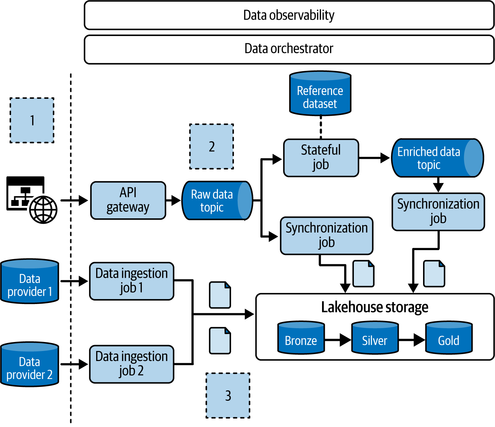
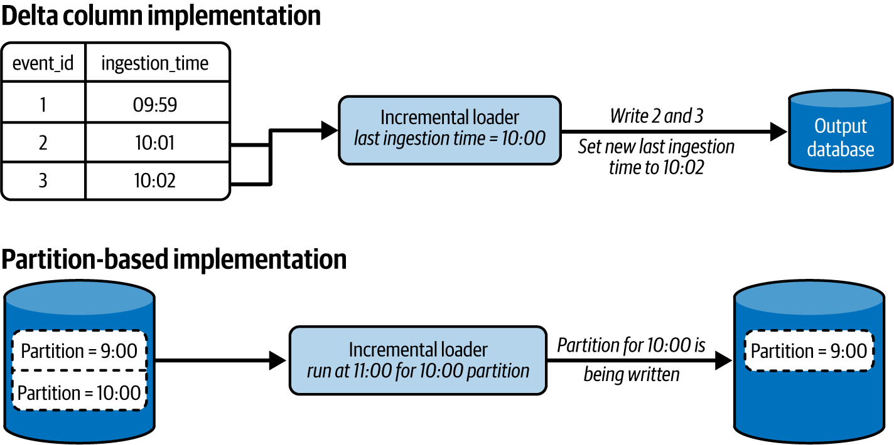
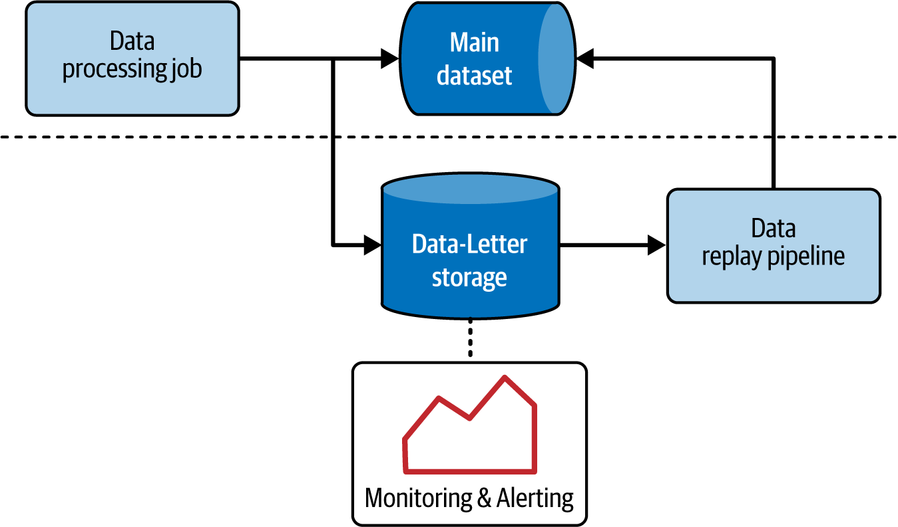
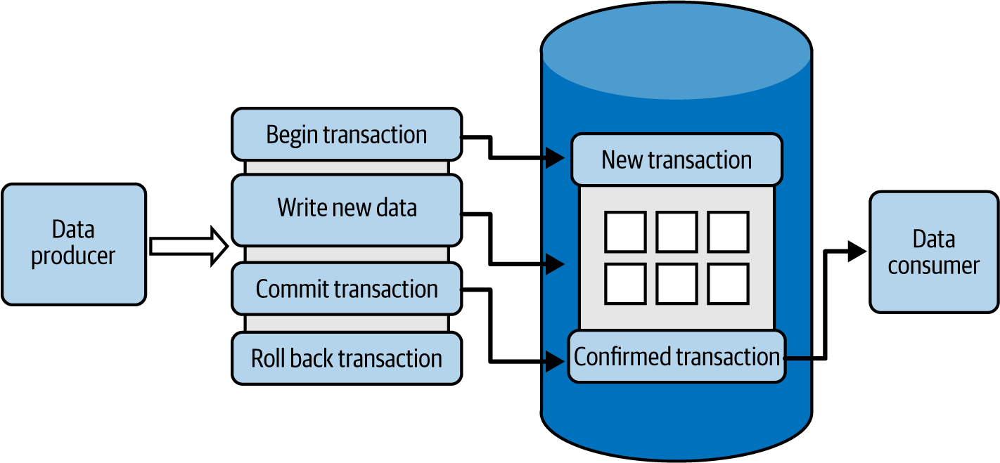
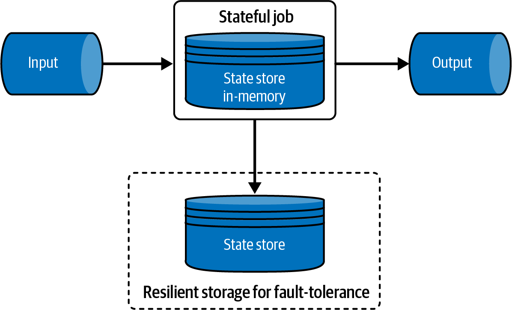
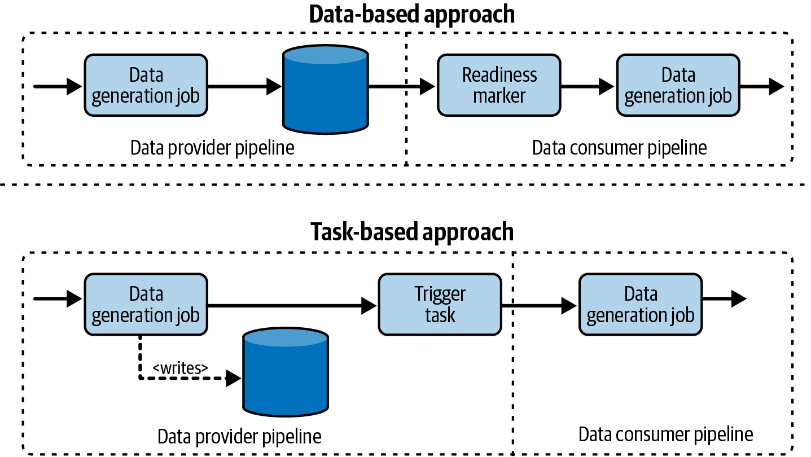
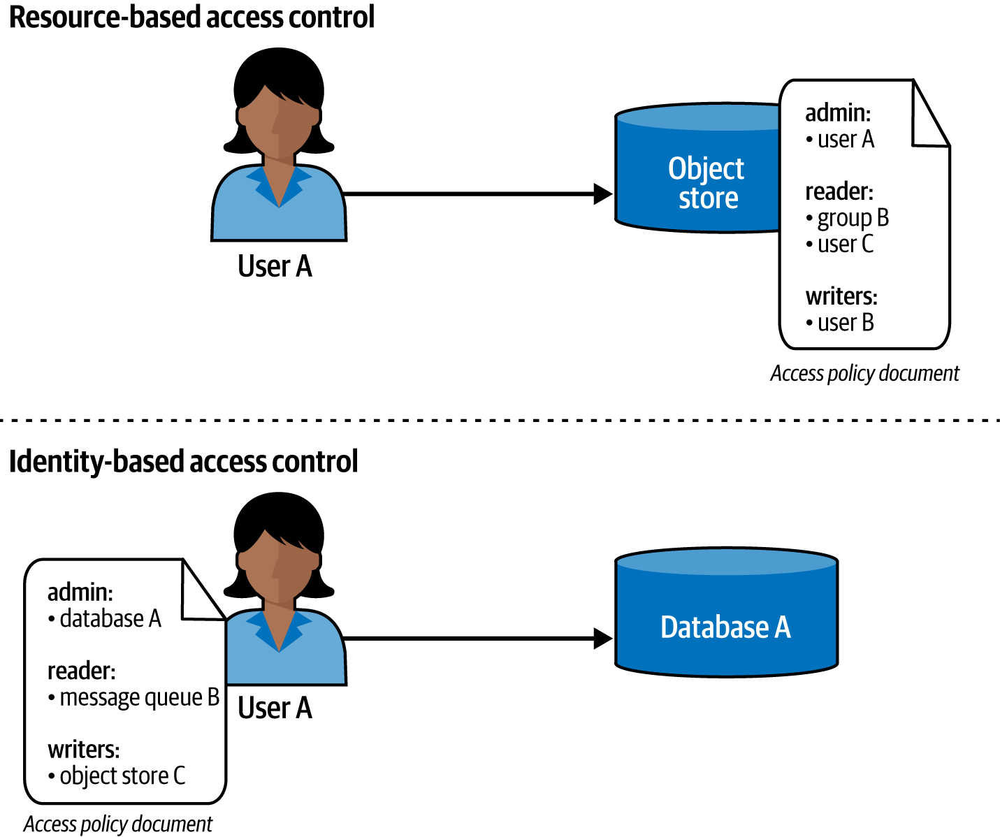
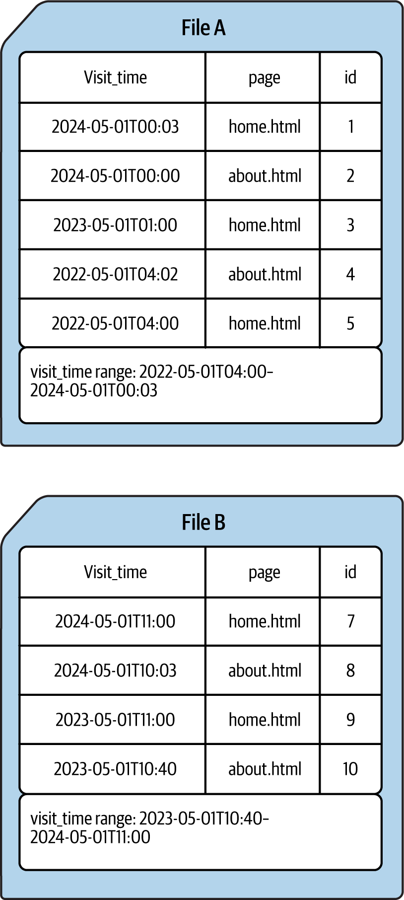
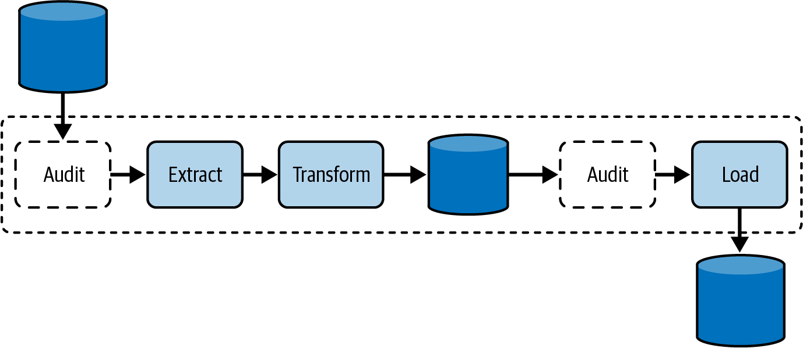
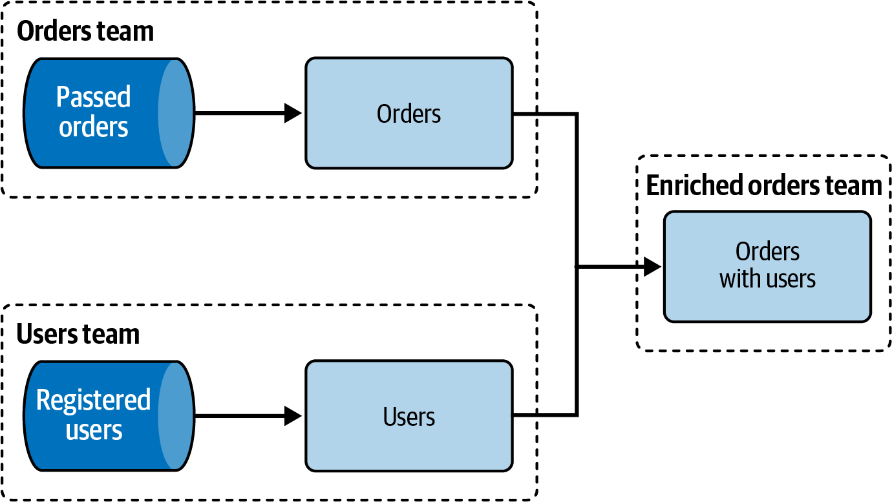

# Data Engineering Design Patterns - Knowledge

**Document Name:** Data Engineering Design Patterns  

**Author:** Bartosz Konieczny, O'Reilly, 2025 metadata from PDF  

**Domain:** Data engineering architecture, pipeline implementation patterns, lakehouse/data warehouse design, data quality, data security, data observability, operational reliability.  

**How to Use:** Use this as a design-review and implementation companion. Start with the mental models, then use the chapter extraction and decision guides when choosing patterns for ingestion, error handling, idempotency, enrichment, orchestration, security, storage, quality, and observability. The source PDF was parsed as full text with chapter boundaries and extracted figures. The generated guidance is source-grounded unless marked as **Inference**.

## 1. Learning Roadmap

Study the book as a data-flow lifecycle, not as an alphabetized catalog of patterns. The chapters deliberately move from getting data into the platform, through making pipelines reliable and repeatable, then toward making data useful, secure, efficient, trustworthy, and observable.

1. First understand the common case study: a blog analytics platform with online events, offline provider datasets, a real-time layer, batch/lakehouse processing, and exposed analytical datasets. The same pressures appear in most data platforms: producers are imperfect, consumers need fresh and correct data, storage is expensive, and failures must not silently corrupt downstream decisions.
2. Learn ingestion patterns before reliability patterns. Full Load, Incremental Load, CDC, Replication, Compaction, Readiness Markers, and External Triggers define how data arrives and when downstream work can begin.
3. Learn error and retry patterns next. Dead-lettering, deduplication, late data handling, filter interception, and checkpointing define how pipelines survive malformed records, duplicates, late arrivals, and failures.
4. Learn idempotency before backfilling. Fast Metadata Cleaner, Data Overwrite, Merger, Stateful Merger, Keyed Idempotency, Transactional Writer, and Proxy are the practical base for reruns and recovery.
5. Learn value and flow patterns once the pipeline can repeat safely. Joiners, decorators, aggregators, sessionizers, orderers, sequencers, fan-in/fan-out, orchestration, and runner patterns decide how data becomes product-facing information.
6. Learn security, storage, quality, and observability as production hardening layers. These chapters turn a working pipeline into a governed, performant, debuggable, and trusted system.

Fast path for design reviews: read `Core Mental Models`, then `Architecture Decision Guide`, then the relevant chapter subsection and the `Operating, Troubleshooting, And Debugging` table. Fast path for implementation: read the target pattern in `Chapter-by-Chapter Knowledge Extraction`, then inspect `Code, Configuration, And Workflow Notes` and `Testing, Validation, And Verification`.

After studying this file, you should be able to choose ingestion and update strategies, design replay-safe pipelines, reason about late and duplicate data, plan security and privacy controls, optimize storage for read patterns, enforce schema and quality rules, and define observability signals that detect broken data flow before consumers report it.

## 2. Core Mental Models

| Mental Model | Explanation | Helps Solve | Example | Common Misuse |
|---|---|---|---|---|
| A data pattern is a reusable solution with consequences | The book frames patterns like recipes: reusable templates that must be contextualized and adapted. Every pattern has costs, boundaries, and failure modes. | Avoids one-off designs and vocabulary confusion. | Dead-Letter isolates malformed records so a stream can continue. | Applying a pattern because it has a name, without accepting its operational cost. |
| Pipelines are contracts between producers and consumers | Ingestion, readiness, schema compatibility, quality enforcement, and lineage all exist because teams depend on each other's data products. | Cross-team reliability, governance, and evolution. | A readiness marker tells downstream jobs when an hourly Silver dataset can be consumed. | Treating pipelines as private jobs when downstream teams already depend on their timing and schema. |
| Retries demand idempotency | Errors, manual backfills, replay, and automatic retries are normal. A pipeline is not production-ready until rerunning it produces one correct result. | Backfill safety and failure recovery. | A daily partition overwrite can make a batch job replay-safe for that day. | Assuming exactly-once processing in a framework automatically gives exactly-once delivery. |
| Time has multiple meanings | Event time, processing time, ingestion time, append time, SLA time, and watermark time answer different questions. | Late data, lag monitoring, sessionization, and SLA validation. | A stream may process quickly in processing time while still being late by event time. | Using wall-clock processing time as a proxy for business freshness. |
| Data shape and storage layout are design decisions | Partitioning, bucketing, sorting, manifests, materialization, normalization, and denormalization encode workload assumptions. | Query cost, latency, skew, update complexity, and storage footprint. | Sorting Parquet files by a frequent predicate can reduce scanned blocks. | Optimizing for today's query shape without planning evolution or compaction. |
| Observability is data-specific, not only infrastructure-specific | Healthy CPU and memory do not prove data freshness, completeness, schema compatibility, lineage, or quality. | Detects silent data failures. | A flow interruption detector notices that no records were written although the job is still running. | Relying only on job success/failure and ignoring dataset-level signals. |



**Figure: Case-study data platform.** The book uses a blog analytics platform to make patterns concrete: online events and offline provider datasets flow through real-time and batch layers before consumers query enriched analytical outputs.

**How to read it:** Treat each boundary as a possible contract: data producers, streaming brokers, object storage, batch processors, enrichment services, and serving tables each introduce different latency, correctness, and ownership pressures.

**Why it matters:** The same architecture explains why the book orders the patterns as a lifecycle. You cannot reason about observability or quality well until you know what is ingested, how replay works, and which consumers rely on the output.

**How to apply it:** When reviewing an existing system, draw this equivalent map first. Mark producer ownership, storage layers, processing mode, exposed datasets, and consumer dependencies. Then choose patterns at the boundaries where the map shows instability.

**Limitations:** The case study is intentionally generic. It does not replace workload-specific capacity estimates, regulatory classification, schema governance, or cost modeling.

## 3. Deep Concept Notes

### Data Engineering Design Patterns

- **Explanation:** A data engineering design pattern is a reusable template for solving a recurring data-platform problem. The book differs from general software design-pattern material by focusing on data-specific concerns: ingestion, backfill, data correctness, idempotency, late data, privacy, storage layout, quality, and observability.
- **Problem solved:** Teams repeatedly reinvent partial solutions for the same issues, such as malformed records stopping streams, duplicate records after replay, storage layouts that make reads expensive, and schema changes breaking consumers.
- **How it works:** A pattern names the context, problem, solution shape, consequences, and implementation variants. The pattern does not remove engineering judgment; it gives a shared vocabulary and known tradeoffs.
- **Why it matters:** Data platforms fail in ways that look successful at the job layer. A job can finish while publishing incomplete, duplicated, late, unauthorized, or unobservable data.
- **When to use:** Use patterns during design reviews, incident retrospectives, and refactoring plans when a failure mode recurs or a requirement crosses team boundaries.
- **When not to use:** Do not introduce a pattern if the simple version is already correct, cheap, observable, and unlikely to need replay or scale. Patterns add structure but also add maintenance.
- **Tradeoffs:** Patterns improve repeatability and communication but can hide complexity behind names. The source repeatedly emphasizes gotchas such as backfill snowballs, small-file buildup, metadata limitations, access-policy maintenance, and false positives in monitors.
- **Common mistakes:** Treating pattern names as certifications of correctness; ignoring producer/consumer contracts; optimizing for batch without considering streaming; confusing data-processing exactly-once claims with end-to-end delivery guarantees.
- **Production example:** A malformed record in a Kafka stream should not always stop the job. Dead-lettering lets good records continue while preserving bad records for analysis, but the team must monitor the dead-letter destination to avoid hidden data loss.
- **Questions to ask:** What is the recurring problem? Is it correctness, latency, cost, security, or operability? What are the consequences of adding the pattern? Who owns its monitoring and cleanup?

### Ingestion And Readiness

- **Explanation:** Ingestion patterns decide how external or upstream data becomes available inside the platform. They range from simple full reloads to CDC streams and event-driven triggers.
- **Problem solved:** Data arrives with different change characteristics: small static reference datasets, append-only event tables, mutable transactional databases, external APIs, irregular provider drops, and continuously produced streams.
- **How it works:** Full Loader copies an entire dataset. Incremental Loader reads only new or changed chunks using a delta column or partition. CDC reads database commit logs. Replicators copy data across environments or storage boundaries. Compactor rewrites small files into larger units. Readiness Marker publishes a signal that a dataset is ready. External Trigger starts ingestion from an external event instead of polling.
- **Why it matters:** Ingestion is the first contract in the platform. If it is too slow, too expensive, not replayable, or ambiguous about readiness, every downstream system inherits the problem.
- **When to use:** Match the pattern to source semantics: full load for small or slowly changing datasets without change markers; incremental or CDC for growing datasets; readiness markers for physically isolated pipelines; external triggers for irregular data production.
- **When not to use:** Avoid CDC if the latency requirement does not justify database-layer setup complexity. Avoid full loads for fast-growing datasets. Avoid convention-only readiness if producers can publish incomplete data.
- **Tradeoffs:** Lower latency generally increases setup complexity. Pull-based approaches are easier to reason about but may waste resources. Push/event-driven approaches reduce waste but require replay and execution context design.
- **Common mistakes:** Forgetting physical deletes in incremental loads; exposing data before a provider finished writing all files; using production data in test environments without masking PII; running compaction too frequently and creating compute contention.
- **Production example:** A legacy database table with an `updated_at` column can use Incremental Loader. If consumers later require near-real-time updates, CDC may become appropriate, but the team must handle schema evolution, connector availability, and replay.
- **Questions to ask:** Does the source expose reliable change metadata? Can rows be deleted? Is latency measured in minutes, hours, or days? Who declares readiness? How will ingestion be replayed?



**Figure: Incremental loading by data shape.** The diagram contrasts two incremental strategies: using an explicit delta column or using physical/logical partitions.

**How to read it:** Identify the boundary that lets the loader select a subset. A delta column works when change metadata is reliable. A partition strategy works when the source physically groups new data by date, hour, or another partition key.

**Why it matters:** Incremental loading is not just "load less data." The selector becomes a correctness dependency. If deletes, late updates, or mutable partitions are not represented, downstream data drifts.

**How to apply it:** Before implementing an incremental job, prove the selector catches inserts, updates, and deletes required by consumers. Add a validation query comparing row counts or checksums between source and target for a sampled window.

**Limitations:** This pattern does not automatically provide low latency or exact correctness for all changes. If the source cannot express relevant changes, CDC or periodic reconciliation may be needed.

### Error Management And Late Data

- **Explanation:** Error-management patterns isolate, detect, compensate for, or recover from data errors without turning every bad record into a full pipeline outage.
- **Problem solved:** Real data systems see malformed records, duplicate records, data arriving after the expected window, filter regressions, and processor crashes.
- **How it works:** Dead-Letter diverts unprocessable records. Windowed Deduplicator keeps a bounded memory of seen records. Late Data Detector compares event or ingestion time against lateness rules. Static and Dynamic Late Data Integrators repair previously published results. Filter Interceptor explains why records were filtered. Checkpointer saves progress and state for restart.
- **Why it matters:** Data errors are often business-visible. A batch may publish wrong aggregates because a producer is late, a stream may silently drop malformed input, or a filter change may remove 90% of records.
- **When to use:** Use these when input quality is imperfect, processing is long-running, duplicate delivery is possible, or consumers require recovery instead of permanent approximation.
- **When not to use:** Do not dead-letter business-critical records without alerts and remediation ownership. Do not deduplicate unbounded streams without a retention/window strategy. Do not integrate late data if consumers explicitly accept approximate windows and cost matters more than correction.
- **Tradeoffs:** Error isolation improves availability but can hide data loss. Deduplication uses state and still may not provide end-to-end exactly-once delivery. Late-data repair improves correctness but can trigger backfill snowballs and storage growth.
- **Common mistakes:** Believing checkpointing is exactly-once; not monitoring the dead-letter destination; choosing a lateness window without measuring source delays; letting concurrent backfills update overlapping partitions.
- **Production example:** A daily analytics table may use a 15-day static late-data window. Records older than 15 days are intentionally excluded from correction, trading exact historical correctness for bounded cost.
- **Questions to ask:** Is an error local to a record or global to the dataset? Can downstream consumers tolerate approximate results? What state must survive restarts? How will late corrections be communicated?



**Figure: Dead-letter pattern.** The diagram separates the main processing path from the error path: valid records continue to the target while invalid records move to a dedicated destination.

**How to read it:** The important boundary is the risky transformation. The pattern wraps that boundary, captures the failing input and useful error context, and keeps the main flow alive.

**Why it matters:** Dead-lettering changes a pipeline from fail-fast to partial-success. That can improve availability but must be paired with review and reprocessing so errors do not become invisible data loss.

**How to apply it:** Include the original record, error class, parsing/transformation version, processing timestamp, source offset or file path, and correlation identifiers in the dead-letter output. Add alerting on volume and error-rate changes.

**Limitations:** Dead-lettering is dangerous when every record is semantically required for correctness. For financial, compliance, or reconciliation workloads, failing the whole dataset may be more appropriate.

### Idempotency, Backfill, And Replay

- **Explanation:** Idempotency means rerunning a pipeline for the same logical input produces one correct output, not duplicated or conflicting data. The book treats idempotency as the natural consequence of retries and backfills.
- **Problem solved:** Automatic retries, manual reruns, historical backfills, late-data corrections, and partial failures all write to data that may already exist.
- **How it works:** Fast Metadata Cleaner deletes or hides prior outputs at metadata granularity. Data Overwrite replaces physical data blocks. Merger applies inserts, updates, and deletes. Stateful Merger keeps extra state to restore or replay datasets. Keyed Idempotency makes a database write unique by key. Transactional Writer stages changes until commit. Proxy exposes immutable data through an intermediary.
- **Why it matters:** Without idempotency, every recovery path risks duplicate records, conflicting updates, broken aggregates, or corrupted downstream materializations.
- **When to use:** Use metadata cleaning or overwrite for partitioned batch jobs, merger patterns for incremental changes, keyed writes for key-addressable databases, transactions when the sink supports commit semantics, and proxies when the underlying dataset must remain immutable.
- **When not to use:** Avoid metadata cleaner if backfill granularity does not match table layout. Avoid key-based idempotency if key generation is unstable under late data. Avoid transactional assumptions in sinks without real atomic commit support.
- **Tradeoffs:** Coarse-grained overwrite is simple but expensive. Merge is targeted but requires keys and delete semantics. Stateful merge enables backfill but adds state-table correctness risk. Transactions improve visibility guarantees but can be hard in distributed systems.
- **Common mistakes:** Generating keys from processing time; using append-only writes during rerun; assuming table format compaction is data cleanup; forgetting no-data operations such as compaction in state history.
- **Production example:** A daily object-store dataset partitioned by event date can be overwritten by partition on rerun. A CDC-backed customer table should use merge semantics keyed by customer ID and operation timestamp.
- **Questions to ask:** What is the logical idempotency boundary: run, partition, record, transaction, or dataset version? Can deletes be represented? Can the sink atomically publish the new state?



**Figure: Transactional Writer.** The diagram shows staged writes becoming visible only after an explicit commit, with rollback available before publication.

**How to read it:** Separate "write happened" from "write is visible." The pattern protects readers from seeing partial output while a producer is still writing.

**Why it matters:** Many data failures are publication failures, not compute failures. If readers list files or query tables while a job is mid-write, they can consume incomplete data even though the job eventually succeeds.

**How to apply it:** Prefer sinks with native transactions or table formats with atomic commit logs. When that is unavailable, stage output in a temporary location and publish through a manifest, pointer, or metadata swap.

**Limitations:** Transactional scope is only as broad as the system supports. A transaction in one table does not guarantee consistency across all side effects unless the platform provides that coordination.

### Data Value Creation

- **Explanation:** Data value patterns transform raw or technical data into useful analytical information. They cover enrichment, decoration, aggregation, sessions, and ordering.
- **Problem solved:** Consumers rarely need raw events only. They need context, business metadata, aggregates, sessions, and ordered delivery that match analytical questions.
- **How it works:** Static Joiner combines records with a slowly changing or static dataset. Dynamic Joiner joins two changing streams or datasets using buffering and lateness rules. Wrapper and Metadata Decorator add context around or beside payloads. Distributed and Local Aggregator summarize records with or without network exchange. Incremental and Stateful Sessionizer group events into sessions. Bin Pack Orderer and FIFO Orderer preserve useful write order.
- **Why it matters:** This is where technical pipelines become business data products, but it is also where state, skew, late data, and consistency issues amplify.
- **When to use:** Use static joins for reference enrichment, dynamic joins for event streams with bounded correlation needs, distributed aggregation for large grouped data, local aggregation when grouping keys are local and shared, sessionizers for activity gaps, and orderers when the sink requires partial or strict order.
- **When not to use:** Avoid dynamic joins when lateness is unbounded and exactness is mandatory. Avoid local aggregation if consumers require grouping keys that are not local. Avoid FIFO ordering for high-throughput paths unless the latency cost is acceptable.
- **Tradeoffs:** Enrichment adds dependency freshness concerns. Distributed aggregation has shuffle/network cost and skew risk. Sessionization requires state and inactivity windows. Ordering increases latency and may reduce parallelism.
- **Common mistakes:** Joining against an unsynchronized static dataset; choosing an inactivity gap without product semantics; ignoring state-store scaling; treating session windows as exact when checkpointing gives at-least-once behavior.
- **Production example:** A visit-event stream can enrich device IDs with a static device table. If that reference table changes late, a Slowly Changing Dimension strategy may be needed to keep historical correctness.
- **Questions to ask:** Is the enrichment time-sensitive? Are both sides dynamic? What state retention is required? What ordering guarantee do consumers actually need?



**Figure: Stateful sessionizer.** The diagram shows a processing job interacting with a state store to keep open session context across events.

**How to read it:** Each event can read, update, or close state. The state store is part of the correctness boundary, not a passive cache.

**Why it matters:** Sessionization is easy to describe and difficult to operate. The state grows with active keys, depends on inactivity windows, and must survive failure through checkpointing or durable storage.

**How to apply it:** Define the session key, inactivity gap, state TTL, late-event handling, checkpoint frequency, and recovery expectations before writing transformation logic.

**Limitations:** Checkpointing and state stores often provide at-least-once processing behavior. Downstream idempotency is still needed if duplicates can be produced after recovery.

### Data Flow And Orchestration

- **Explanation:** Data flow patterns define how tasks and pipelines depend on each other and how concurrent executions are controlled.
- **Problem solved:** As pipelines grow, teams need to model sequential steps, cross-pipeline dependencies, fan-in, fan-out, conditional branches, and concurrency without hiding logic in code.
- **How it works:** Local Sequencer runs steps inside one execution unit. Isolated Sequencer links independent execution units through scheduling, task, or dataset dependencies. Aligned Fan-In waits for all parents. Unaligned Fan-In runs despite partial parent failure or absence. Parallel Split runs branches concurrently. Exclusive Choice selects branches by condition. Single Runner enforces one active execution. Concurrent Runner allows multiple independent executions.
- **Why it matters:** Orchestration is where pipeline correctness becomes visible. A misleading dependency graph can make partial results look complete or make concurrency corrupt shared state.
- **When to use:** Use local sequencing for tightly coupled steps with shared runtime. Use isolated sequencing for independently owned pipelines. Use fan-in/fan-out for aggregate flows. Use single runner when state requires sequential processing. Use concurrent runner when datasets are independent.
- **When not to use:** Avoid hiding orchestration in processing code if operators need a clear DAG. Avoid concurrent runs when shared state, ordering, or backfill semantics are not protected.
- **Tradeoffs:** More orchestration visibility improves operations but can add scheduling overhead. Local sequencing reduces orchestration complexity but hides substep visibility. Fan-in improves completeness but can delay downstream jobs.
- **Common mistakes:** Confusing dataset dependency with task dependency; building unaligned fan-in without annotating partial results; enabling concurrency without capacity and state isolation.
- **Production example:** A daily aggregate that combines multiple source aggregates should use aligned fan-in if all parents are required. If partial results are acceptable, unaligned fan-in must mark which inputs were missing.
- **Questions to ask:** Is the dependency logical, physical, or ownership-driven? Are partial results valid? Can runs overlap? Where should operators see the branch decision?



**Figure: Dependency strategies between pipelines.** The diagram contrasts approaches to connecting independent pipelines.

**How to read it:** Look for where the dependency is enforced: in the scheduler, through produced datasets, or inside processing logic.

**Why it matters:** The place where a dependency is represented determines who can see it, debug it, retry it, and reason about missing or partial inputs.

**How to apply it:** Prefer orchestration-visible dependencies for operationally significant sequencing. Use dataset-level dependencies when readiness is the real condition and teams are loosely coupled.

**Limitations:** A visible DAG is not automatically a correct contract. You still need data readiness, quality checks, and clear semantics for partial data.

### Security, Privacy, And Access Control

- **Explanation:** Security patterns protect data by separating sensitive columns, overwriting or removing regulated fields, controlling row/column/resource access, encrypting data, anonymizing or pseudo-anonymizing values, and avoiding credential exposure.
- **Problem solved:** Data systems often copy sensitive data into many layers. Without deliberate controls, private values leak into lower environments, logs, temporary files, data lakes, and overbroad cloud permissions.
- **How it works:** Vertical Partitioner separates mutable/PII and immutable attributes. In-Place Overwriter updates legacy storage directly. Fine-Grained Accessors enforce row/column/resource authorization. Encryptor protects data at rest and in motion. Anonymizer removes sensitive information. Pseudo-Anonymizer masks, tokenizes, hashes, or perturbs while preserving some utility. Secrets Pointer stores references to credentials. Secretless Connector uses platform identity or certificate workflows.
- **Why it matters:** Security is not only a final access-control rule. Storage layout, replication, testing data, lineage, logging, and operational credentials all affect exposure.
- **When to use:** Use partitioning for deletion or privacy-driven storage separation. Use fine-grained access for shared warehouses and cloud resources. Use encryption broadly but do not treat it as a substitute for authorization. Use secretless access where cloud/platform identity supports it.
- **When not to use:** Avoid pseudo-anonymization when re-identification risk is unacceptable. Avoid in-place overwrite as a long-term strategy if the legacy layout forces repeated large rewrites. Avoid credential pointers without rotation and logging discipline.
- **Tradeoffs:** Stronger controls often add query overhead, policy maintenance, transformation complexity, or information loss. Security-by-the-book may conflict with maintainability if every resource has extremely granular policies without automation.
- **Common mistakes:** Moving production PII into staging; masking direct identifiers but leaving quasi-identifiers; logging secrets fetched by pointer; granting broad object-store writes to processing jobs.
- **Production example:** A production-to-staging replicator should transform or anonymize PII before writing into staging, then validate that sensitive fields are absent from both data and logs.
- **Questions to ask:** What fields are personal, sensitive, regulated, or contractual? Which systems store copies? Who can read raw, transformed, and temporary data? How are secrets rotated?



**Figure: Resource-based and identity-based access control.** The diagram compares two policy-placement models for cloud resources.

**How to read it:** Identity-based access attaches permissions to the caller. Resource-based access attaches permissions to the resource. Many real systems use both.

**Why it matters:** Data pipelines need least privilege at both table and infrastructure layers. A job with broad object-store permissions can accidentally overwrite datasets beyond its domain.

**How to apply it:** For each pipeline identity, list required read/write resources and scope policies to those paths, tables, topics, secrets, and keys. Automate policy generation when possible so maintenance does not degrade security.

**Limitations:** Fine-grained policies can become unmanageable without naming conventions, ownership metadata, and regular access review.

### Storage Layout And Read Performance

- **Explanation:** Storage patterns shape how data is physically and logically organized so writes, reads, updates, retention, and governance match workload needs.
- **Problem solved:** As datasets grow, naive layouts cause expensive scans, slow joins, hot partitions, too many files, stale materialized views, and inconsistent duplicated attributes.
- **How it works:** Horizontal Partitioner groups rows by a partition key. Vertical Partitioner splits columns. Bucket colocates high-cardinality keys into fixed buckets. Sorter orders records on disk. Metadata Enhancer stores min/max or summaries for skipping. Dataset Materializer precomputes expensive results. Manifest avoids repeated listing. Normalizer reduces duplication. Denormalizer reduces joins.
- **Why it matters:** Storage design controls cost and latency. The best compute code cannot compensate indefinitely for bad file sizes, poor partitioning, excessive listing, or joins that contradict the query workload.
- **When to use:** Partition on common pruning dimensions with bounded cardinality. Bucket when a high-cardinality column is frequently filtered or joined. Sort when predicates or range scans benefit from data skipping. Materialize repeatedly expensive queries. Normalize for consistency; denormalize for read speed.
- **When not to use:** Avoid partitioning by high-cardinality or frequently changing attributes. Avoid bucketing if future bucket changes are likely. Avoid denormalization when updates are frequent and consistency is critical.
- **Tradeoffs:** Read optimization often increases write cost, storage footprint, or evolution cost. Normalization improves consistency but adds join cost. Denormalization improves reads but makes updates and data lineage harder.
- **Common mistakes:** Partitioning by user ID and creating millions of small partitions; ignoring compaction after streaming writes; materializing views without refresh ownership; relying on object-store listing for large tables.
- **Production example:** A weekly analytics table can use horizontal partitions by event date, sorting by high-value predicates, and metadata statistics for skipping irrelevant files.
- **Questions to ask:** What are the dominant predicates? How often do partition keys change? How large are files? Who owns refresh and retention? What happens when query patterns evolve?



**Figure: Metadata information for data skipping.** The diagram shows how file or block statistics can allow a reader to avoid scanning irrelevant data.

**How to read it:** The query predicate is compared with stored metadata such as min/max values. Blocks whose summaries cannot satisfy the predicate are skipped.

**Why it matters:** Metadata enhancement is one of the cheapest ways to reduce scan cost when file formats and table formats support it. It turns layout information into execution-time pruning.

**How to apply it:** Use columnar formats and table formats that persist useful statistics. Validate by comparing scanned bytes/files before and after sorting or metadata enhancement.

**Limitations:** Statistics help only when predicates align with recorded metadata. Low-quality statistics, unsorted writes, or highly overlapping ranges reduce benefit.

### Data Quality And Schema Evolution

- **Explanation:** Quality patterns prevent, detect, and safely evolve data defects before they become consumer-visible surprises.
- **Problem solved:** Job success does not prove dataset quality. Producers can send NULLs, invalid domains, incompatible schemas, incomplete files, or schema drift that breaks consumers.
- **How it works:** Audit-Write-Audit-Publish validates before and after writing, then publishes only if checks pass. Constraints Enforcer delegates field rules to database/table constraints. Schema Compatibility Enforcer checks changes against consumer compatibility modes. Schema Migrator supports evolution with grace periods. Offline Observer monitors quality separately. Online Observer monitors as part of the pipeline.
- **Why it matters:** Quality is a contract. A table that loads successfully can still be wrong if row counts drop unexpectedly, required fields are NULL, or a producer changed a type.
- **When to use:** Use AWAP when publishing poor data is worse than extra latency. Use constraints for hard table-level guarantees. Use schema compatibility for multi-consumer datasets. Use observers to track quality rules and profiles over time.
- **When not to use:** Avoid all-or-nothing constraints when consumers need partial data and remediation paths. Avoid online observers if added latency is unacceptable and late insight is tolerable.
- **Tradeoffs:** Strong quality gates add compute, latency, and coordination overhead. Offline observers decouple cost but detect issues late. Schema migration can increase record size and complexity during grace periods.
- **Common mistakes:** Only validating schema, not business quality; treating schema registry success as semantic compatibility; publishing after write without a second audit; failing to version quality expectations.
- **Production example:** A daily aggregate should write to staging, audit row count, NULL rates, and domain constraints, then publish through a metadata swap only if checks pass.
- **Questions to ask:** Which defects should block publication? Which defects should alert only? How are schema changes communicated? How long can old and new schemas coexist?



**Figure: AWAP applied to a pipeline.** The diagram places audits before and after writing, with publication as the final step.

**How to read it:** The first audit checks input or computed data. The write stage persists output in a non-public or staged area. The second audit checks the written result before exposure.

**Why it matters:** Many failures happen between computation and persisted output. The second audit catches write-side truncation, missing files, corrupted partitions, or unexpected post-write state.

**How to apply it:** Define blocking checks such as completeness, schema, row-count ranges, required fields, and freshness. Publish via atomic pointer, table version, manifest, or permission change after checks pass.

**Limitations:** AWAP is not bulletproof. Quality rules must evolve as producers, consumers, and business definitions change.

### Data Observability And Lineage

- **Explanation:** Observability patterns make data-flow health, freshness, skew, latency, SLA adherence, and lineage visible.
- **Problem solved:** Infrastructure monitoring can miss data-specific failures such as empty writes, partition skew, consumer lag, missed business SLAs, undocumented dependencies, and unknown column origins.
- **How it works:** Flow Interruption Detector detects missing writes for continuous or irregular arrival. Skew Detector compares expected and actual distribution. Lag Detector measures consumer delay by offset or time. SLA Misses Detector compares job or stream behavior to expectations. Dataset Tracker builds dataset-level dependency graphs. Fine-Grained Tracker traces column or row origins.
- **Why it matters:** Trustworthy data requires early detection and explainability. Consumers should not be the monitoring system.
- **When to use:** Use flow detectors for key feeds, skew detectors where partition completeness matters, lag detectors for streaming consumers, SLA detectors for downstream timing commitments, dataset trackers for impact analysis, and fine-grained trackers when column-level governance or debugging is required.
- **When not to use:** Avoid noisy detectors without seasonality and ownership. Avoid lineage projects with no operational use case or maintenance path.
- **Tradeoffs:** Observability adds storage, compute, thresholds, metadata management, and alert tuning. Managed lineage may create vendor lock-in. Fine-grained lineage may not see custom code.
- **Common mistakes:** Alerting on every small fluctuation; defining lag as a single max value that hides partition skew; treating a lineage graph as complete when custom transformations are excluded.
- **Production example:** A critical hourly dataset should alert when no files arrive in the expected window, when partition distribution deviates strongly from baseline, and when downstream SLA windows are at risk.
- **Questions to ask:** What data failure would consumers notice first? What metric detects it earlier? Who owns the alert? Does the lineage graph cover custom code paths?



**Figure: Dataset tracking.** The diagram shows dataset dependencies across teams and domains.

**How to read it:** The graph is a family tree for data objects. It exposes which team owns which dataset and which downstream objects depend on it.

**Why it matters:** Lineage changes incident response. Instead of guessing who is affected by a schema or quality issue, teams can identify downstream dependencies and coordinate repairs.

**How to apply it:** Use lineage metadata in change management: before modifying a schema, partition, or quality rule, inspect downstream datasets and notify owners. During incidents, start from the broken dataset and walk downstream impact.

**Limitations:** Dataset-level lineage may not explain why a specific column value is wrong. For that, fine-grained lineage or transformation-level debugging is needed.

## 4. Implementation Patterns And Engineering Practices

| Pattern Family | Implementation Shape | Validation Approach | Main Tradeoff |
|---|---|---|---|
| Full and incremental ingestion | Use native export/import for full loads; use delta columns, partitions, or CDC connectors for changes. | Reconcile source and target counts/checksums for sampled windows; validate delete handling. | Simplicity versus latency and correctness coverage. |
| Replication | Copy production-like data to another environment either unchanged or transformed. | Validate schema, record counts, date formatting, PII masking, and environment isolation. | Test realism versus privacy and transformation risk. |
| Compaction | Periodically rewrite many small files into fewer larger files. | Track file count, file size distribution, scan time, and compaction job cost. | Read performance versus compute cost and write contention. |
| Readiness and triggers | Publish a marker, event, or orchestration signal after data is complete. | Test late/incomplete provider writes and replay of trigger events. | Pull safety versus push efficiency. |
| Dead-lettering | Wrap risky transformation boundaries and route failed records with context. | Alert on dead-letter volume, rate, and repeated error classes. | Availability versus hidden data loss. |
| Deduplication and lateness | Keep bounded state or compare windows to event-time rules. | Use replay tests with duplicates, late events, and out-of-order inputs. | Correctness versus state size and latency. |
| Idempotent writing | Clean, overwrite, merge, key, transact, or proxy outputs by stable logical boundary. | Rerun the same input and compare output uniqueness and table versions. | Replay safety versus I/O, state, and sink capability. |
| Enrichment and aggregation | Join, decorate, aggregate, sessionize, or order records by business meaning. | Test late reference changes, skewed keys, state recovery, and window boundaries. | Business value versus state, shuffle, and freshness complexity. |
| Orchestration | Model dependencies and concurrency in orchestration or dataset readiness contracts. | Simulate parent failure, partial results, backfill, and overlapping runs. | Operational visibility versus scheduling complexity. |
| Security | Partition sensitive data, enforce table/resource policies, encrypt, anonymize, and avoid embedded credentials. | Scan outputs/logs for PII and secrets; review policies and effective permissions. | Protection versus usability, query cost, and maintenance overhead. |
| Storage optimization | Partition, bucket, sort, enrich metadata, materialize, manifest, normalize, or denormalize. | Measure scanned bytes, files listed, query latency, write cost, and update complexity. | Read speed versus write cost and evolution rigidity. |
| Quality and observability | Gate publication, enforce constraints, manage schema evolution, observe profiles, detect flow/skew/lag/SLA, and track lineage. | Run contract tests, quality checks, anomaly alerts, and lineage impact analysis. | Trust and debuggability versus compute, latency, and alert noise. |

Engineering practices that recur across the source:

- Define the correctness boundary before choosing a pattern. For example, a partition overwrite is safe only if the partition is the complete logical unit of replacement.
- Make hidden state explicit. Checkpoints, state tables, manifests, schema registries, readiness markers, and lineage stores become production dependencies.
- Treat source time and processing time separately. Lateness, sessions, lag, and SLAs require explicit time semantics.
- Preserve enough context for replay. Dead-letter records, trigger events, CDC offsets, manifests, and state snapshots should let engineers diagnose and replay safely.
- Validate both data and publication. AWAP and transactional writing show that "computed successfully" is not the same as "published safely."
- Avoid unowned conventions. Readiness marker names, path layouts, bucket counts, policy names, and lineage annotations need ownership and review.

## 5. Code, Configuration, And Workflow Notes

The book contains technology examples, including Delta Lake-style merge/overwrite workflows, database grants, schema compatibility modes, secret managers, and lineage tools. The following excerpts are intentionally compact and adapted; they show implementation shapes without reproducing source listings.

### Incremental Load Workflow

```sql
-- Load rows changed since the last successful watermark.
INSERT INTO target_visits
SELECT *
FROM source_visits
WHERE updated_at > :last_successful_watermark
  AND updated_at <= :current_watermark;
```

Use this only when `updated_at` is reliable for all inserts and updates. It does not catch physical deletes unless the source emits tombstones or a separate reconciliation process exists. Validate each run by storing watermarks, source row counts for the selected range, target row counts, and a sample checksum.

### Partition Overwrite For Idempotent Batch

```sql
-- Replace a complete logical partition, not an arbitrary subset.
INSERT OVERWRITE TABLE visits_daily PARTITION (event_date = '2026-05-24')
SELECT *
FROM staged_visits_daily
WHERE event_date = '2026-05-24';
```

This is a good fit when the partition is the full unit of correctness. It fails when late data belongs to old partitions that are not included in the overwrite plan, or when consumers read the partition while overwrite is in progress. Pair it with staging and atomic publication when possible.

### Merge For CDC-Like Changes

```sql
MERGE INTO current_users AS target
USING staged_user_changes AS source
ON target.user_id = source.user_id
WHEN MATCHED AND source.operation = 'DELETE' THEN DELETE
WHEN MATCHED THEN UPDATE SET *
WHEN NOT MATCHED AND source.operation <> 'DELETE' THEN INSERT *;
```

The merge pattern needs a stable key, operation semantics, and ordering rules. Test out-of-order updates, repeated events, duplicate deletes, and backfill from historical change logs.

### Dead-Letter Handling Shape

```python
try:
    output = transform(input_record)
    write_valid(output)
except Exception as error:
    write_dead_letter({
        "raw_record": input_record,
        "error_type": type(error).__name__,
        "processor_version": PROCESSOR_VERSION,
        "source_offset": source_offset,
        "observed_at": processing_time,
    })
```

Do not stop at this shape. Add alerting, replay tooling, ownership, and data retention. If the record is mandatory for correctness, dead-lettering may be the wrong fit.

### Readiness Marker Workflow

1. Producer writes all files for the dataset into a staging or final prefix.
2. Producer validates completeness, row count, schema, and required business checks.
3. Producer writes a marker such as `_READY`, a manifest, a table version, or an orchestration event.
4. Consumer reads only versions or prefixes with the marker.
5. Consumer records which marker/version it consumed for replay and audit.

The marker is a contract. If it is convention-only, add periodic validation that no unmarked or partially marked data is being consumed.

### Secretless Connector Workflow

1. Assign a workload identity to the pipeline runtime.
2. Grant that identity only the required resources and actions.
3. Configure the connector to request short-lived credentials or platform-authenticated access at runtime.
4. Ensure logs never print issued tokens or connection strings.
5. Test rotation, permission removal, and failure behavior before production.

This reduces stored-secret handling but does not eliminate security work. Identity configuration, policy scope, and audit logging remain required.

## 6. Testing, Validation, And Verification

| What To Validate | Why It Matters | Method | Good Signal | Warning Sign |
|---|---|---|---|---|
| Ingestion completeness | Downstream correctness starts with source coverage. | Compare source/target counts, checksums, partitions, CDC offsets, and delete representation. | Counts and sampled values reconcile for the intended window. | Incremental loads miss deletes or mutable historical partitions. |
| Readiness semantics | Consumers should not read incomplete data. | Simulate partial provider writes and late file arrival. | Consumers ignore data until marker/version/manifest exists. | Consumers list paths directly and race the producer. |
| Dead-letter path | Bad records should be visible and recoverable. | Inject malformed records and replay them after fix. | Main flow continues, alerts fire, context is sufficient for diagnosis. | Dead-letter volume grows silently. |
| Deduplication and ordering | Duplicates and out-of-order delivery corrupt aggregates. | Replay duplicate and reordered inputs across window boundaries. | Output uniqueness and aggregate correctness hold. | Exactly-once framework setting is treated as sufficient proof. |
| Idempotent rerun | Backfill and retry must not duplicate data. | Run same input twice; compare output row identity, versions, and aggregates. | Second run produces no additional logical records. | Append-only sinks grow after rerun. |
| Merge semantics | CDC and incremental updates need correct row state. | Test inserts, updates, deletes, duplicates, and out-of-order changes. | Final table matches expected latest state. | Delete tombstones are ignored or late updates resurrect deleted rows. |
| State recovery | Streams and sessionizers depend on durable state. | Kill and restart jobs during active windows. | Checkpoints restore state without incorrect duplicate output. | State reset causes session splits or duplicate writes. |
| Storage layout | Layout choices should improve target workloads. | Benchmark scanned files/bytes, query latency, and write cost before/after. | Read cost drops without unacceptable write overhead. | More partitions or buckets increase small-file and listing cost. |
| Security controls | Sensitive data and credentials must not leak. | Run PII scans, secret scans, and effective-permission checks. | Only intended fields, identities, and paths are accessible. | Masked data can be re-identified or broad policies remain. |
| Quality gates | Published datasets should satisfy consumer contracts. | AWAP, constraints, schema compatibility checks, and profile tests. | Bad data blocks publication or alerts with context. | Job succeeds while row counts, schema, or NULL rates regress. |
| Observability | Operators should detect data failures early. | Test flow interruption, skew, lag, SLA, and lineage scenarios. | Alerts are timely, actionable, and owned. | Alarm fatigue or consumer-reported incidents. |

## 7. Chapter-by-Chapter Knowledge Extraction

### Preface And Chapter 1 - Introducing Data Engineering Design Patterns

Main lesson: data engineering needs its own pattern vocabulary because normal software design patterns do not cover data-specific concerns such as backfill, lateness, correctness, storage layout, and observability.

Important details:

- A pattern is a reusable, customizable template, not a fixed prescription.
- Each pattern has a context, solution, reusability property, common language benefit, and consequences.
- The case study provides common pipeline roles: online ingestion, offline provider data, real-time processing, batch/lakehouse processing, and data exposition.
- The book's flow follows the lifecycle of data from arrival through trustworthy operation.

Self-check: Can you explain why a dead-letter queue is a data engineering pattern rather than only an error-handling implementation detail? Can you identify the equivalent of the blog analytics layers in your current platform?

### Chapter 2 - Data Ingestion Design Patterns

Density: high. The chapter covers seven ingestion patterns and four major diagrams.

- **Full Loader:** Best for small or slowly changing datasets without reliable change metadata. It is simple but suffers from growing data volume and consistency during load. Validate with full row-count and freshness checks.
- **Incremental Loader:** Loads chunks using delta columns or partitions. It reduces volume but must address physical deletes, mutable old data, and expensive backfills.
- **Change Data Capture:** Uses database commit logs or equivalent change streams to lower latency. It improves freshness but adds database-layer setup complexity, connector operations, schema evolution handling, and at-rest data considerations.
- **Passthrough Replicator:** Copies data without alteration, often across environments. It is useful for consistent test data but may leak PII or serialization quirks.
- **Transformation Replicator:** Copies data with masking, filtering, or format changes. It supports safe production-like testing but increases schema and formatting risk.
- **Compactor:** Rewrites many small files into fewer larger files. It improves read and listing performance but consumes compute and needs housekeeping for old files.
- **Readiness Marker:** Publishes a marker that data is complete. It helps loosely coupled teams coordinate but relies on a reliable definition of ready.
- **External Trigger:** Starts ingestion from an event rather than frequent polling. It reduces waste but requires replay, error management, and execution context.

Practical use case: A platform might full-load a device reference table daily, CDC a user table, compact streaming event files every hour, and publish readiness markers for Silver-layer tables.

Production risks: missed deletes, PII replication, small files, producer markers written too early, trigger events lost or duplicated.

Self-check: Which ingestion pattern would you choose for a mutable source table without `updated_at` but with database logs? What validation proves your readiness marker is trustworthy?

### Chapter 3 - Error Management Design Patterns

Density: high. The chapter covers malformed records, duplicates, late data, filtering, and fault tolerance.

- **Dead-Letter:** Keeps processing valid records while isolating invalid records. It must include alerting, context, retention, and replay. Hidden errors and snowball backfills are major risks.
- **Windowed Deduplicator:** Removes duplicates over a bounded window. It trades memory/storage for duplicate tolerance but is not an end-to-end exactly-once guarantee.
- **Late Data Detector:** Measures when records arrive after the expected window. It depends on time semantics and framework support.
- **Static Late Data Integrator:** Recomputes a fixed lookback window. It bounds cost but can miss older corrections and trigger repeated backfills.
- **Dynamic Late Data Integrator:** Repairs only impacted partitions or windows. It saves resources but adds concurrency and state complexity.
- **Filter Interceptor:** Captures which filter condition removed records. It helps distinguish data change from software regression but adds runtime overhead.
- **Checkpointer:** Saves stream position and state. It reduces restart cost but adds latency and does not equal exactly-once by itself.

Practical use case: A streaming ingestion job can checkpoint offsets and state, dead-letter malformed records, deduplicate within a time window, and emit late-data metrics. A daily aggregate can use static late integration for the last 15 days.

Production risks: dead-letter backlog, false confidence in checkpointing, late-data repair racing concurrent runs, and filter counters adding overhead.

Self-check: What must be included in a dead-letter record to support replay? Why does checkpointing not guarantee exactly-once delivery?

### Chapter 4 - Idempotency Design Patterns

Density: high. The chapter is central because retries and backfills are unavoidable.

- **Fast Metadata Cleaner:** Removes prior outputs through metadata, such as weekly tables or table versions. It is fast but constrains backfill granularity and can complicate exposition.
- **Data Overwrite:** Replaces physical data blocks or partitions. It is broadly supported but can be I/O-heavy and requires cleanup to reclaim storage.
- **Merger:** Applies insert/update/delete changes into existing data. It requires unique keys and clear delete semantics.
- **Stateful Merger:** Adds a state table or version history for restoration and consistent backfill. It improves recoverability but adds state correctness risk.
- **Keyed Idempotency:** Uses stable keys to write once. It depends on key-generation properties and database behavior; late data can break naive keys.
- **Transactional Writer:** Makes changes visible only after commit. It protects readers from partial output but may be hard across distributed sinks.
- **Proxy:** Exposes immutable data through an intermediary layer. It can be simple but depends on convention and extra protection to keep data immutable.

Practical use case: Use partition overwrite for daily batch facts, merge for CDC dimension tables, and transactional publication for multi-file outputs.

Production risks: unstable keys, old partitions skipped during backfill, merge deleting wrong records, transaction scope misunderstood, and compaction changing state history.

Self-check: What is your pipeline's idempotency boundary? How do you prove a backfill can run twice without changing the final logical dataset?

### Chapter 5 - Data Value Design Patterns

Density: high. The chapter turns reliable data movement into useful data products.

- **Static Joiner:** Enriches records with static or slowly changing reference data. Watch for consistency and SCD requirements.
- **Dynamic Joiner:** Joins two dynamic datasets or streams. Requires buffering, lateness strategy, and state cleanup.
- **Wrapper:** Adds an envelope around input records. Helps carry metadata but can split entity meaning across payload and wrapper.
- **Metadata Decorator:** Stores extra information in metadata rather than payload. Useful when storage supports metadata, but scope is limited.
- **Distributed Aggregator:** Aggregates at scale with network exchange. Watch data skew and reclaiming unused capacity.
- **Local Aggregator:** Aggregates locally without network exchange. It is cheaper but freezes scaling and may not serve all grouping keys.
- **Incremental Sessionizer:** Builds sessions from incremental data. Late data and sequential execution make backfill expensive.
- **Stateful Sessionizer:** Uses state store support for continuous sessions. Scaling state and at-least-once behavior are key issues.
- **Bin Pack Orderer:** Groups records into ordered bulk requests for partial commit data stores. Task retries and batch construction add complexity.
- **FIFO Orderer:** Writes records in input order. It is simple semantically but has I/O and latency overhead and is not automatically exactly-once.

Practical use case: A visit stream may join static device metadata, sessionize by user inactivity gap, aggregate visits by page, and write ordered batches to a sink.

Production risks: stale enrichment, state-store growth, skewed aggregation keys, window boundaries with late events, and ordering reducing throughput.

Self-check: When is a static join not actually static? What state must be stored to recover a sessionizer safely?

### Chapter 6 - Data Flow Design Patterns

Density: high. The chapter moves from individual transformations to pipeline topology.

- **Local Sequencer:** Runs ordered steps in one execution unit. Simple for tightly coupled logic but hides substep operations.
- **Isolated Sequencer:** Sequences independent execution units through scheduler, task, or dataset dependencies. Better for ownership boundaries.
- **Aligned Fan-In:** Starts downstream only after all parents succeed. Useful for completeness but creates waiting and resource overhead.
- **Unaligned Fan-In:** Starts despite parent failure or absence. Useful for partial results but requires clear annotation.
- **Parallel Split:** Runs concurrent branches from one parent. Improves latency but dependencies or compute needs may limit parallelism.
- **Exclusive Choice:** Selects execution branches. Keeps unnecessary work from running but can hide heavy data-based logic.
- **Single Runner:** Allows one active run. Protects sequential state but hurts backfill latency.
- **Concurrent Runner:** Allows independent runs. Improves throughput but risks resource starvation and shared-state conflicts.

Practical use case: Use isolated sequencing between team-owned pipelines, aligned fan-in for required aggregate inputs, and single runner for stateful session backfills.

Production risks: hidden conditional branches, partial data exposed as complete, overlapping runs corrupting state, and scheduler overhead.

Self-check: Is your dependency a task dependency, dataset dependency, or consumer contract? Are partial results explicitly labeled?

### Chapter 7 - Data Security Design Patterns

Density: high. The chapter covers deletion, access, protection, anonymization, and credentials.

- **Vertical Partitioner:** Splits columns such as PII and immutable attributes to simplify removal or access control. Querying full rows becomes more expensive.
- **In-Place Overwriter:** Removes or modifies sensitive data in legacy layouts. It is pragmatic but I/O-heavy.
- **Fine-Grained Accessor for Tables:** Controls row and column access in databases/warehouses. Native support helps but complex structures can be hard.
- **Fine-Grained Accessor for Resources:** Scopes cloud resource access. Maintenance and least-privilege rigor must be balanced.
- **Encryptor:** Protects data at rest and in transit. CPU overhead and key loss risk must be managed.
- **Anonymizer:** Removes protected information. Stronger protection but loses information.
- **Pseudo-Anonymizer:** Masks, tokenizes, hashes, or perturbs sensitive values. Preserves some utility but can create a false sense of security.
- **Secrets Pointer:** Stores a pointer to credentials in a secrets service. Beware logs and refresh for long-running jobs.
- **Secretless Connector:** Uses platform identity or certificates instead of managed secrets. Still requires setup, rotation, and maintenance.

Practical use case: A staging replication pipeline can use transformation replication plus pseudo-anonymization, resource-level least privilege, and secretless cloud identity.

Production risks: re-identification, broad policies, leaked secrets in logs, encryption-key loss, and expensive in-place rewrites.

Self-check: Which fields can identify a person alone or in combination? What effective permissions does the pipeline identity have?

### Chapter 8 - Data Storage Design Patterns

Density: high. The chapter covers physical and logical layout decisions that drive cost and latency.

- **Horizontal Partitioner:** Groups rows by partition key. Good for pruning, risky with high cardinality, skew, or changing attributes.
- **Vertical Partitioner:** Splits columns into separate datasets. Improves isolation, hurts full-row reads.
- **Bucket:** Colocates high-cardinality keys into buckets. Useful for joins and direct access, costly to evolve.
- **Sorter:** Stores blocks sorted by common predicates. Improves skipping, increases write overhead.
- **Metadata Enhancer:** Persists statistics for data skipping. Usually valuable with columnar/table formats, but adds write-time overhead.
- **Dataset Materializer:** Precomputes expensive views. Improves reads but creates refresh and governance work.
- **Manifest:** Records files to avoid repeated listing. Useful for object stores and table formats, but manifest growth matters.
- **Normalizer:** Reduces duplication. Improves consistency, adds join cost.
- **Denormalizer:** Reduces joins. Improves read speed, increases storage and update complexity.

Practical use case: A data lake fact table can partition by event date, sort by common filters, use table-format metadata for skipping, and materialize a consumer-facing aggregate.

Production risks: small partitions, bucket evolution, stale materializations, large manifests, and denormalized update anomalies.

Self-check: What query patterns justify the current layout? Which layout choice is hardest to change later?

### Chapter 9 - Data Quality Design Patterns

Density: high. The chapter turns correctness into enforceable publication and evolution rules.

- **Audit-Write-Audit-Publish:** Validates before and after writing, then publishes only good data. Adds compute and latency but protects consumers.
- **Constraints Enforcer:** Uses table/database constraints for quality. Simple and strong, but all-or-nothing behavior can create producer-consumer loops.
- **Schema Compatibility Enforcer:** Prevents breaking schema changes through registry or table/store mechanisms. Adds communication overhead.
- **Schema Migrator:** Evolves schemas with compatibility periods. Supports consumer transition but can increase record size and complexity.
- **Offline Observer:** Runs quality observation separately. No production-path latency, but insight can be late.
- **Online Observer:** Observes inside the pipeline. Faster feedback, but adds processing delay and possible scope differences.

Practical use case: For critical business aggregates, publish only after AWAP checks pass and use schema compatibility enforcement before producers can publish new versions.

Production risks: stale quality rules, blocking too much, late offline alerts, schema registry treated as the whole quality strategy.

Self-check: Which quality checks block publication? Which only alert? How do consumers learn about schema migration timelines?

### Chapter 10 - Data Observability Design Patterns

Density: high. The chapter focuses on detecting and explaining data failures.

- **Flow Interruption Detector:** Detects missing data flow for continuous or irregular arrivals. Threshold and metadata choices are difficult.
- **Skew Detector:** Detects incomplete or imbalanced data distributions. Seasonality and team communication matter.
- **Lag Detector:** Measures consumer delay by offset or time. Skew can hide inside aggregate lag.
- **SLA Misses Detector:** Measures missed latency commitments. Streaming event-time SLAs are harder because late data changes interpretation.
- **Dataset Tracker:** Builds dataset-level lineage across teams and data objects. Managed tools may create vendor lock-in; custom systems require effort.
- **Fine-Grained Tracker:** Tracks column or row dependencies. Helpful for detailed debugging and governance, but custom code and visualization are hard.

Practical use case: A platform team can monitor no-write windows, partition skew, consumer lag, SLA misses, and lineage impact for critical datasets.

Production risks: false positives, alarm fatigue, incomplete lineage, hidden custom transformations, and event-time SLA ambiguity.

Self-check: What data-specific incident would not be detected by your infrastructure dashboards? Which lineage level is needed to debug it?

### Appendix - Summary of Patterns

The appendix is a compact reminder of all pattern names, use cases, and gotchas. Its main value is as a pattern-selection checklist after you already understand the chapters. Do not use it as a substitute for design reasoning; it names gotchas but does not provide enough context to implement safely.

## 8. Architecture Decision Guide

| Decision | Choose Option A When | Choose Option B When | Key Tradeoffs | Failure Risks | Questions To Ask |
|---|---|---|---|---|---|
| Full Loader vs Incremental Loader | Full dataset is small, slow-changing, or lacks change metadata. | Dataset is growing and reliable delta/partition metadata exists. | Simplicity vs lower load volume. | Full load grows too expensive; incremental misses deletes. | Can the source represent deletes and old updates? |
| Incremental Loader vs CDC | Batch latency is acceptable and change metadata is reliable. | Low latency and full change stream are required. | Operational simplicity vs setup complexity. | CDC connector breaks schema assumptions; incremental query is stale. | Is database-log access allowed and supportable? |
| Polling vs External Trigger | Source generation is regular or trigger reliability is weak. | Source generation is irregular and events can be replayed. | Predictability vs resource efficiency. | Polling wastes compute; triggers are lost or duplicate. | Can each trigger be correlated to a replayable dataset version? |
| Fail Fast vs Dead-Letter | Any bad record invalidates the dataset. | Bad records can be isolated while valid records remain useful. | Strong consistency vs availability. | Hidden data loss in dead-letter storage. | Who monitors and reprocesses bad records? |
| Static vs Dynamic Late Integration | A bounded correction window is acceptable. | Late data can arrive across variable historical partitions. | Bounded cost vs flexible correctness. | Static misses old corrections; dynamic races concurrent runs. | How late is late in observed production data? |
| Partition Overwrite vs Merge | Output unit is a complete partition or run. | Changes are row-level inserts, updates, and deletes. | Simpler replay vs targeted updates. | Overwrite misses affected partitions; merge mishandles ordering. | What key and operation semantics exist? |
| Local vs Distributed Aggregation | Data is already colocated by grouping key. | Groups span partitions/workers and volume requires scale. | Low network cost vs scalable grouping. | Local aggregates cannot serve all queries; distributed jobs skew. | What grouping keys do consumers need? |
| Single Runner vs Concurrent Runner | Shared state, ordering, or sequential backfill is required. | Runs are independent and resources can handle concurrency. | Correctness vs throughput. | Overlap corrupts state; concurrency starves other workloads. | Can two runs touch the same logical output? |
| Anonymizer vs Pseudo-Anonymizer | Protection matters more than preserving analytical detail. | Utility must be preserved and re-identification risk is acceptable/managed. | Privacy strength vs data usefulness. | Pseudo-anonymized data is re-identified. | Which fields combine into quasi-identifiers? |
| Normalize vs Denormalize | Update consistency and duplication control dominate. | Read latency and join elimination dominate. | Consistency vs read speed and storage footprint. | Normalized model is too slow; denormalized updates drift. | How often are duplicated attributes updated? |
| Offline vs Online Observer | Monitoring should not slow production path and late insight is acceptable. | Fast detection matters more than added pipeline overhead. | Decoupling vs timely detection. | Offline alert arrives too late; online observer causes latency. | What is the maximum acceptable detection delay? |
| Dataset vs Fine-Grained Lineage | Impact analysis at table/topic level is enough. | Column/row origin is needed for debugging or governance. | Lower implementation effort vs detailed traceability. | Dataset graph hides column-level breakage; fine-grained graph incomplete. | Which incidents require lineage to resolve? |

ADR-style pattern:

| Decision Context | Options Considered | Decision Rule | Consequences | Revisit When |
|---|---|---|---|---|
| Selecting ingestion strategy for a source | Full load, incremental load, CDC, external trigger | Choose the simplest strategy that satisfies latency, delete/update coverage, and replay requirements. | Simpler options reduce ops load; complex options require connector and state ownership. | Data volume, latency, or mutation semantics change. |
| Making a pipeline replay-safe | Metadata clean, overwrite, merge, keyed write, transaction | Choose the idempotency boundary that matches the logical completeness unit. | Replay becomes testable but storage and publication logic become stricter. | New backfill scope or sink capability appears. |
| Publishing trusted datasets | Direct write, staged write, AWAP, transactional publication | Use staged plus audit plus atomic publication for critical consumer-facing data. | Adds latency and compute but prevents visible bad data. | Consumers accept partial data or quality requirements increase. |

## 9. System Design Playbooks

### Playbook: Build A Replay-Safe Batch Data Product

- **Use case:** A daily analytical table consumed by business dashboards.
- **Clarify first:** Source completeness, expected lateness, partition key, consumer freshness SLA, quality rules, and backfill window.
- **Baseline architecture:** Ingest into raw/staged storage, transform to daily partition, audit input, write output to staging, audit output, publish through metadata swap or table version.
- **Scaling path:** Start with partition overwrite; add compaction, sorting, metadata enhancement, and materialized views when scans grow.
- **Data model considerations:** Choose partition granularity aligned with replay boundary. Use stable keys if row-level merge is needed.
- **Reliability strategy:** Idempotent rerun, checkpoints for long jobs where relevant, and dead-letter only for non-critical malformed records.
- **Security strategy:** Separate or mask PII, least-privilege write access, encrypted storage, no secrets in code.
- **Observability strategy:** Flow interruption, row-count profile, skew detector, SLA miss detector, and lineage to downstream dashboards.
- **Common failure modes:** Partial publish, duplicate rows after rerun, old partitions missed by late data, stale materialized views.
- **Evolution path:** Add schema compatibility enforcement and schema migration rules as producers and consumers multiply.

### Playbook: Build A Near-Real-Time Event Pipeline

- **Use case:** Events arrive continuously and consumers need low-latency access.
- **Clarify first:** Event-time semantics, duplicate delivery, late-event tolerance, ordering requirements, stateful operations, target latency.
- **Baseline architecture:** Source topic or CDC stream, stream processor with checkpointing, dead-letter path, state store for joins/sessionization, object-store or table sink with transactional publication where possible.
- **Scaling path:** Add partitioning, compaction for object-store outputs, skew monitoring, and state-store scaling.
- **Data model considerations:** Include event time, processing time, producer ID, schema version, and stable business keys.
- **Reliability strategy:** Checkpoint offsets and state; downstream idempotency for replay; bounded dedup windows.
- **Security strategy:** Secretless connectors or secret pointers, encrypted transit and storage, masked lower-environment replication.
- **Observability strategy:** Consumer lag, flow interruption, late data rate, dead-letter volume, state growth, SLA misses.
- **Common failure modes:** State loss on restart, lag hidden by skew, duplicate output after retry, late events reopening sessions unexpectedly.
- **Evolution path:** Add schema compatibility enforcement, fine-grained lineage for critical derived fields, and dynamic late-data integration if correction cost is justified.

### Playbook: Secure Production-Like Test Data

- **Use case:** Engineers need realistic data in non-production environments.
- **Clarify first:** Which fields are PII, whether referential integrity must be preserved, whether downstream tests require realistic distributions, and who can access staging.
- **Baseline architecture:** Production extract, transformation replicator, anonymizer or pseudo-anonymizer, staging sink with least-privilege access and audit logs.
- **Scaling path:** Automate masking rules, run PII scans, version transformation logic, and add lineage from production source to staging derivative.
- **Data model considerations:** Preserve keys only when safe; tokenize or hash consistently if joins must work.
- **Reliability strategy:** Validate schema and row counts after transformation; dead-letter transformation failures with safe placeholders.
- **Security strategy:** No direct passthrough of PII; no secrets in logs; resource policies scoped to staging.
- **Common failure modes:** Re-identification from quasi-identifiers, stale PII definitions, logs containing raw values, overly broad staging access.
- **Evolution path:** Move toward secretless connectors and policy-as-code review for environment replication.

## 10. Operating, Troubleshooting, And Debugging

| Symptom | Likely Cause | How To Investigate | Fix | Prevention |
|---|---|---|---|---|
| Downstream table is empty but job succeeded | Flow interruption, early publish, wrong output path, or marker written too early. | Check output file count, row count, marker timestamp, job logs, and lineage. | Revoke marker/version, rerun from last good input, repair path config. | AWAP, flow detector, readiness marker validation. |
| Duplicate records after backfill | Non-idempotent append, unstable key, or dedup window too small. | Compare run IDs, keys, partitions, and write mode. | Rebuild affected partitions or merge by stable key. | Rerun tests and explicit idempotency boundary. |
| CDC target has wrong final row state | Out-of-order events, missing deletes, or merge rule error. | Inspect operation timestamps, tombstones, offsets, and merge audit counts. | Replay ordered changes from safe checkpoint. | CDC contract tests and stateful merge history. |
| Streaming job recovers but emits duplicates | Checkpoint/commit boundary mismatch. | Compare source offsets, sink commits, and checkpoint timestamps. | Deduplicate downstream or restore from last consistent checkpoint. | Transactional sink or keyed idempotency. |
| Late data causes aggregate drift | Lateness window too short or no integration path. | Profile event-time vs processing-time delay distribution. | Recompute impacted windows with static/dynamic integrator. | Late data detector and published correction policy. |
| Query costs rise sharply | Small files, partition explosion, missing metadata, stale materialization. | Inspect file counts, average file size, scanned bytes, partition cardinality. | Compact, repartition, sort, materialize, or manifest. | Storage layout benchmarks and compaction SLO. |
| Data quality alert fires after consumers complain | Offline observer schedule too late or missing online gate. | Compare issue time, observation time, publication time, and consumer read time. | Add blocking quality gate for critical checks. | AWAP and online observer for high-risk rules. |
| Access audit finds broad permissions | Resource accessor too coarse or identities shared. | Review effective permissions per workload identity. | Split identities and narrow resource policies. | Policy-as-code and periodic access review. |
| Schema change breaks consumers | No compatibility enforcement or migration window. | Inspect schema versions, consumer expectations, and registry history. | Roll back producer schema or add compatibility fields. | Schema Compatibility Enforcer and Schema Migrator. |
| Lineage graph misses broken column | Dataset-level tracking only or custom code untracked. | Trace query plan, transformation code, and column mappings manually. | Add fine-grained lineage annotations or supported framework hooks. | Fine-Grained Tracker for critical derived fields. |

## 11. Applying This Knowledge To Existing Systems

Use this assessment framework on one pipeline or data product at a time.

| Review Area | What To Inspect | What Good Looks Like | Warning Signs | Improvement Options |
|---|---|---|---|---|
| Source contract | Change semantics, delete handling, schema ownership, freshness expectation. | Contract names inserts, updates, deletes, schema evolution, and SLA. | "We just query what changed" without proof. | Add incremental/CDC validation and schema compatibility. |
| Ingestion | Loader type, trigger/readiness, replay ability. | Chosen pattern matches source volume and latency. | Polling expensive sources or trusting early files. | Readiness markers, external triggers, CDC, reconciliation. |
| Idempotency | Rerun boundary, write mode, keys, transaction/publish behavior. | Same input can run twice with one logical output. | Append-only writes in replay paths. | Partition overwrite, merge, transactions, proxy. |
| Error handling | Bad-record path, late-data strategy, duplicate strategy. | Errors are visible, recoverable, and owned. | Dead-letter path has no alerts. | Dead-letter monitoring, late integrator, dedup tests. |
| State | Checkpoints, state tables, manifests, watermarks. | State is durable, versioned where needed, and restorable. | State stored only in local runtime. | Durable checkpoints, state snapshots, recovery drills. |
| Storage layout | Partitions, buckets, sorting, file size, materializations. | Layout matches real query predicates and replay needs. | Tiny files, high-cardinality partitions, stale views. | Compaction, sorting, metadata enhancement, manifest. |
| Security | PII classification, policies, secrets, encryption. | Least privilege, masked lower environments, no credentials in code/logs. | Shared credentials and broad object-store writes. | Secretless connectors, policy narrowing, anonymization. |
| Quality | Blocking checks, schema compatibility, observers. | Critical defects block publication; noncritical defects alert. | Job success is treated as data success. | AWAP, constraints, schema migration, quality profiles. |
| Observability | Flow, skew, lag, SLA, lineage, ownership. | Data-specific signals alert before consumers complain. | Only CPU/memory/job-status dashboards. | Add detectors and lineage tracking. |
| Cost | Compute, scan bytes, listing operations, refresh costs. | Cost is explainable by workload and layout. | Materializations refresh blindly; compaction too frequent. | Benchmark and tune layout/refresh/compaction cadence. |

## 12. Applying This Knowledge To New Systems

When designing a new data system, walk through these questions before choosing technologies:

1. What data arrives, from whom, how often, and with what change semantics?
2. What latency do consumers need: seconds, minutes, hours, or days?
3. Can records be updated or deleted after first arrival?
4. What event-time, ingestion-time, and processing-time fields exist?
5. What is the replay/backfill boundary?
6. Which outputs require exactness, and which can be approximate?
7. What sensitive fields exist, and where may they be copied?
8. Which schema changes are allowed without consumer migration?
9. Which quality defects must block publication?
10. Which data-specific signals prove the system is healthy?

Baseline architecture evolution:

- **MVP:** Choose the simplest loader, explicit write mode, basic quality checks, and visible orchestration. Keep the storage layout easy to reason about.
- **Production-ready v1:** Add idempotent rerun tests, readiness or transactional publication, dead-letter/replay ownership, security policies, and data-specific alerts.
- **Scaling phase:** Add compaction, partition/bucket/sort decisions, metadata enhancement, materialization, lag/skew monitoring, and cost dashboards.
- **Governed phase:** Add schema compatibility, schema migration, lineage, PII scanning, policy review, and documented consumer contracts.

Capacity estimation approach:

- Estimate source volume per day/hour, average and p95 record size, growth rate, expected late-data distribution, duplicate rate, and number of affected partitions per backfill.
- Estimate file count and target file sizes for object-store outputs.
- Estimate state size for deduplication, dynamic joins, and sessionization as active keys times state per key times retention.
- Estimate scan cost by expected predicates, partition pruning, sorting, and metadata skipping.

## 13. Technology Mapping

The source discusses technologies as examples rather than as a single prescribed stack. Verify current product behavior before implementation.

| Concept Or Need | Technology Option | When To Use | Watch Outs | Alternatives |
|---|---|---|---|---|
| CDC ingestion | Debezium with Kafka Connect | Database commit logs must feed low-latency streams. | Setup complexity, schema evolution, connector operations. | Native database CDC, managed cloud CDC, incremental loader. |
| Object-store table format | Delta Lake, Apache Iceberg, Apache Hudi | Need transactional metadata, manifests, versioning, schema evolution, or efficient reads. | Feature differences and operational maturity. | Plain Parquet with external catalog, warehouse tables. |
| Orchestration | Apache Airflow or managed scheduler | Need visible dependencies, retries, and schedules. | Hidden logic if conditions live only in processing code. | Dagster, Prefect, cloud orchestrators, event buses. |
| Streaming broker | Apache Kafka or managed equivalent | Need durable event streams, offsets, and consumer lag. | Partition skew, retention, exactly-once misconceptions. | Pulsar, Kinesis, Pub/Sub, queues. |
| State and checkpointing | Stream framework checkpoints/state stores | Need recovery for streams, joins, sessions, dedup. | Latency, state growth, backend scaling. | External database state, batch recomputation. |
| Schema compatibility | Schema Registry or table-format schema checks | Multiple consumers depend on stable schemas. | Coordination overhead and migration complexity. | Contract tests, data catalog checks, manual review. |
| Data quality observation | Great Expectations/Soda-like checks, custom jobs, warehouse constraints | Need enforceable or observable rules. | Rule drift, compute cost, all-or-nothing semantics. | Database constraints, AWAP custom checks. |
| Lineage | OpenLineage/Marquez, managed catalogs | Need dataset or column impact analysis. | Vendor lock-in, custom code coverage. | Manual metadata capture, table annotations. |
| Secrets | Secrets manager, workload identity, certificates | Need credentials without hardcoding. | Rotation, logging leakage, setup complexity. | Secretless cloud connectors, short-lived tokens. |
| Fine-grained access | Warehouse grants, row/column policies, cloud IAM | Need row, column, or resource-level control. | Policy sprawl and maintenance. | Dataset separation, views, tokenized fields. |

## 14. Production Readiness And Delivery Checklist

- Ingestion strategy matches source change semantics, delete behavior, and latency requirement.
- Every producer/consumer dataset contract names freshness, schema, quality, and ownership expectations.
- Pipeline has a documented idempotency boundary and rerun test.
- Backfill procedure identifies affected partitions/windows and prevents concurrent conflicting runs.
- Bad-record handling includes context, alerting, retention, and replay ownership.
- Late-data strategy is explicit and tested with observed delay distributions.
- Publication path prevents consumers from reading partial output.
- Storage layout has target partition/file-size/bucket/sort assumptions and benchmark evidence.
- Compaction or small-file mitigation exists for streaming/object-store outputs.
- PII and sensitive fields are classified before replication or lower-environment use.
- Access policies are least privilege for tables, topics, object paths, secrets, and keys.
- Secrets are not stored in code, configs, logs, or data outputs.
- Encryption at rest and in transit is configured where required and key ownership is defined.
- Schema compatibility rules and migration windows are documented.
- Blocking quality checks are separated from alert-only checks.
- Observability includes flow interruption, skew, lag, SLA, quality, and lineage where relevant.
- Dashboards include data-specific signals, not only job and infrastructure health.
- Incident runbook explains how to stop publication, roll back/pin a version, replay, and notify consumers.
- Cost controls track compute, scanned bytes, listed files, materialized refreshes, and compaction.
- Ownership is assigned for markers, manifests, schema rules, quality checks, alerts, and lineage metadata.

## 15. Knowledge Gaps And Further Study

- **Current technology behavior:** The source gives patterns and examples, but specific behavior in Delta Lake, Iceberg, Hudi, Kafka, Airflow, cloud IAM, and managed lineage tools changes over time. **Inference:** Verify current documentation for transaction isolation, schema evolution, checkpoint guarantees, and IAM features before implementation.
- **Quantitative tuning:** The book explains pattern consequences but does not provide universal thresholds for compaction cadence, lateness windows, skew detection, or alert thresholds. Study your production distributions and run load tests.
- **Data contracts:** The source implies producer/consumer contracts through readiness, schema, quality, and lineage. **Inference:** Study formal data contract practices, consumer-driven contract testing, and domain ownership models.
- **Privacy engineering:** The security chapter covers anonymization and pseudo-anonymization patterns, but re-identification risk is domain- and regulation-specific. Study k-anonymity, differential privacy, tokenization architectures, and applicable regulations.
- **Distributed transaction theory:** Transactional Writer is discussed as a pattern, but cross-system atomicity is a deeper topic. Study two-phase commit, outbox/inbox patterns, exactly-once semantics, and transactional table formats.
- **Operational economics:** Storage and processing choices imply cost tradeoffs. **Inference:** Add cloud cost-model exercises for scanned bytes, object listing, streaming state, materialized refresh, and compaction.

## 16. Practice Exercises

1. **Ingestion choice:** Given a mutable source database with no `updated_at` but available commit logs, design ingestion for a five-minute freshness SLA. A strong answer should compare full load, incremental load, and CDC; explain CDC setup risk; include delete handling, schema evolution, and replay validation.
2. **Idempotent backfill:** A daily batch appends to an object-store table and duplicates rows on rerun. Redesign it. A strong answer should define the logical partition boundary, choose overwrite or merge, stage output, validate row counts, and prove rerun safety.
3. **Dead-letter review:** A stream has a dead-letter table but no alerts. Create an operating model. A strong answer should include record context, alert thresholds, ownership, replay procedure, retention, and when to fail fast instead.
4. **Late data policy:** A product owner asks for exact historical correction forever. Analyze the tradeoff. A strong answer should discuss observed lateness distribution, static vs dynamic integration, backfill snowball, storage impact, concurrency, and consumer expectations.
5. **Storage optimization:** A table partitioned by user ID has millions of small partitions. Propose a redesign. A strong answer should explain partition cardinality, bucketing, sorting, metadata enhancement, compaction, migration, and validation through scanned bytes.
6. **Security replication:** Engineers want production data in staging. Design a safe replication pipeline. A strong answer should classify PII, choose transformation replication, anonymization/pseudo-anonymization, access policies, secret handling, scans, and audit logs.
7. **Quality gate design:** A dashboard table occasionally drops 50% of rows. Add controls. A strong answer should include AWAP checks, row-count baselines, schema compatibility, publication blocking, alerting, and rollback.
8. **Observability gap:** A job succeeds but consumers get incomplete partitions. Add data observability. A strong answer should include flow interruption, skew detection, readiness validation, SLA detector, lineage impact, and incident runbook.
9. **Lineage depth:** Decide whether dataset-level or column-level lineage is needed for a regulatory report. A strong answer should explain impact analysis, column derivation, custom code coverage, managed tooling limits, and governance use cases.
10. **Concurrency review:** An orchestrator allows overlapping backfills for the same dataset. Assess risk. A strong answer should identify shared state, output partitions, single vs concurrent runner, locks or orchestration constraints, and tests.

## 17. Quick Reference

Key terms:

- **Full Loader:** Copies an entire dataset.
- **Incremental Loader:** Copies only selected changes or partitions.
- **CDC:** Reads source changes as they occur, often from commit logs.
- **Readiness Marker:** Signal that a dataset is complete and safe to consume.
- **Dead-Letter:** Side path for unprocessable records.
- **Windowed Deduplicator:** Bounded duplicate-removal strategy.
- **Late Data:** Data that arrives after the expected processing window.
- **Checkpointer:** Persists processing progress and state.
- **Idempotency:** Rerun safety: same logical input yields one correct output.
- **Merger:** Applies row-level insert/update/delete changes.
- **Transactional Writer:** Publishes only after commit.
- **Sessionizer:** Groups events into sessions using keys and inactivity gaps.
- **Fan-In/Fan-Out:** Pipeline topology for converging or splitting branches.
- **Anonymizer/Pseudo-Anonymizer:** Removes or obscures sensitive information.
- **Metadata Enhancer:** Adds statistics that let readers skip data.
- **AWAP:** Audit, write, audit, publish.
- **Schema Compatibility:** Rules that prevent producer changes from breaking consumers.
- **Flow Interruption:** Missing data movement despite expected arrival.
- **Lineage:** Dependency tracking between datasets, columns, or rows.

Rules of thumb:

- Choose the simplest ingestion pattern that satisfies latency and mutation semantics.
- Never design retries without idempotency.
- Treat dead-lettering as partial failure, not success.
- Define event time, processing time, and SLA time explicitly.
- Make publication atomic or marker-driven for consumer-facing datasets.
- Optimize storage layout for measured query patterns, not guesses.
- Do not replicate production data to lower environments without privacy transformation.
- Quality gates should block only defects that consumers cannot safely tolerate.
- Data observability must include dataset signals, not only job health.
- Lineage should serve concrete operations: impact analysis, debugging, compliance, or ownership.

Common anti-patterns:

- Append-only reruns with no deduplication or overwrite.
- High-cardinality partitions causing small files.
- Convention-only readiness markers with no validation.
- CDC without delete and schema-evolution handling.
- Dead-letter tables nobody monitors.
- Pseudo-anonymized data treated as fully anonymous.
- Materialized views with no refresh ownership.
- Alerts that ignore seasonality and create alarm fatigue.
- Lineage graphs that exclude custom transformations but are presented as complete.
