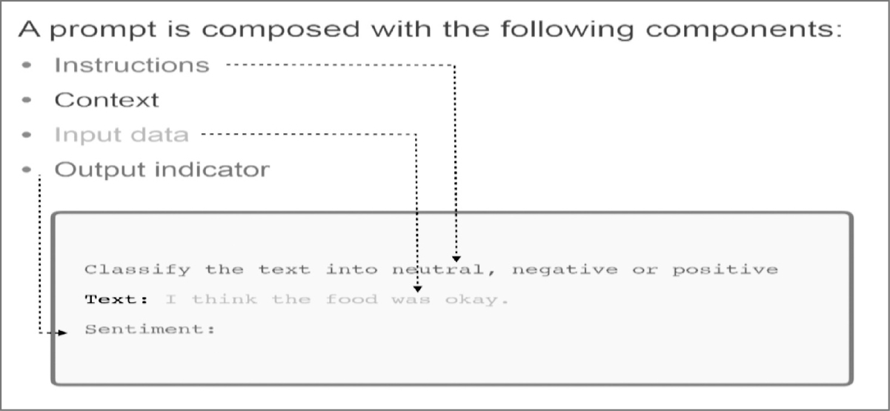
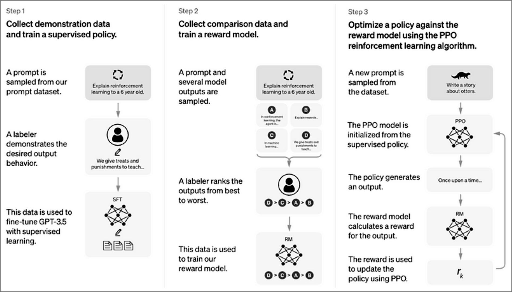
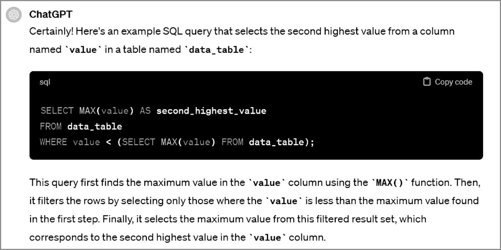

# Prompt Engineering: Empowering Communication Knowledge

- **Detected title:** `Prompt Engineering`
- **Authors:** Ajantha Devi Vairamani and Anand Nayyar
- **Primary domains:** prompt design, ChatGPT usage, prompt patterns, professional prompt applications, API integration, prompt evaluation
- **How to use this file:** Treat this as an engineering application guide, not a chapter recap. The source is broad and practical; this file turns it into reusable mental models, decision criteria, implementation playbooks, and failure-mode checklists.
- **Related knowledge files:** `prompting-knowledge.md` covers a newer, more systematic prompt-engineering curriculum with context engineering, agents, structured outputs, multimodal prompting, and production edge cases.

## 1. Learning Roadmap

Study the source in three passes.

1. **Foundation pass:** Read Chapters 1-3 first. They establish prompts as control surfaces for LLM behavior, explain how ChatGPT evolved from GPT-style language modeling toward instruction following, and introduce instruction prompting, zero-shot, one-shot, few-shot, and self-consistency prompting.
2. **Domain-transfer pass:** Read Chapters 4-18 as examples of prompt reuse across work domains. Do not memorize the sample prompts. Extract the invariant design moves: specify audience, task, context, constraints, role, evidence requirements, output shape, and evaluation criteria.
3. **Engineering pass:** Read Chapters 17, 19, and 20 together. These are the most useful chapters for engineering practice because they discuss evaluation, API model choice, integration, authentication, response handling, error management, and real-world application workflows.

The foundational dependency is: **communication goal -> prompt structure -> model behavior -> output evaluation -> iteration**. API integration adds another dependency: **use case -> model choice -> request construction -> response validation -> operational safeguards**.

After studying, an engineer should be able to:

- Turn vague human intent into a prompt contract with role, task, context, constraints, and output criteria.
- Choose between zero-shot, one-shot, few-shot, and self-consistency prompting based on task ambiguity and risk.
- Evaluate generated output against usefulness, correctness, tone, format, privacy, and domain constraints.
- Design a minimal ChatGPT/API workflow with authentication, request payloads, response handling, and failure recovery.
- Recognize which parts of the source are dated and require current API documentation before implementation.

## 2. Core Mental Models

| Mental Model | Explanation | Helps Solve | Example | Common Misuse |
| --- | --- | --- | --- | --- |
| Prompt as a behavioral specification | A prompt is not just a question; it is an instruction bundle that shapes what the model attends to and how it responds. | Vague output, inconsistent tone, missing structure. | Ask for a security review by naming the role, code context, risk categories, and expected report format. | Treating prompt writing as clever phrasing instead of requirement specification. |
| Context is part of the task | The model can only optimize against visible context and learned patterns. Good prompts include necessary background, examples, and constraints. | Missing assumptions, hallucinated details, overly generic answers. | Give schema, business rules, and output format when asking for a SQL query. | Dumping irrelevant context that hides the important signal. |
| Prompt patterns are reusable, not universal | Instruction, zero-shot, one-shot, few-shot, and self-consistency prompts are tools. Their value depends on ambiguity, complexity, and verification cost. | Choosing a technique instead of guessing. | Few-shot for classification style consistency; self-consistency for reasoning tasks where one chain may be brittle. | Using few-shot examples that conflict with the requested output. |
| Prompting is an iterative control loop | The source treats evaluation and refinement as necessary, not optional. A prompt improves through feedback, observation, and revision. | Prompt drift, brittle workflows, unclear success criteria. | Test a customer-support prompt on normal, hostile, incomplete, and edge-case tickets, then refine. | Rewriting many variables at once so no one knows what improved the result. |
| Professional prompting is domain translation | Chapters 4-18 show that effective prompts adapt to domain norms, not only grammar. | Applying generic AI output to specialized work. | Healthcare prompts need patient empathy and ethical boundaries; developer prompts need code context, expected behavior, and constraints. | Asking the same generic prompt across legal, medical, software, and marketing contexts. |
| API prompting is product engineering | API usage is not only prompt text. It includes model selection, authentication, payload shape, error handling, latency, cost, and user experience. | Turning demos into reliable applications. | Build a support assistant with request validation, model choice, response parsing, retry policy, and human escalation. | Treating an API call as equivalent to a production feature. |

## 3. Deep Concept Notes

### Prompt Components

- **Explanation:** The source presents prompts as composed of instructions, context, input data, and output indicators. In engineering terms, these map to task definition, execution environment, payload, and response contract.
- **Problem solved:** It prevents the model from guessing intent, audience, data boundaries, or output shape.
- **How it works:** The instruction tells the model what to do. Context constrains interpretation. Input data supplies the object of work. The output indicator makes the result inspectable or machine-usable.
- **Why it matters:** Most prompt failures are specification failures. If the prompt does not state what matters, the model fills gaps using generic priors.
- **When to use:** Always for repeated work, handoffs, automation, API calls, domain-specific answers, and any output that needs review.
- **When not to overuse:** For simple exploratory brainstorming, a heavy structure can slow discovery. Start light, then add structure when output quality or repeatability matters.
- **Tradeoffs:** More structure improves control but can overconstrain creativity or consume context budget.
- **Common mistakes:** Missing audience, missing data definitions, asking for "best" without criteria, and specifying output shape without specifying quality criteria.
- **Production example:** A ticket triage prompt should include ticket text, severity definitions, allowed categories, escalation criteria, and JSON schema.
- **Questions to ask:** What should the model optimize for? What should it refuse or escalate? What format must downstream systems consume?
- **Source reference:** Ch. 1; Fig. 1.2.



**Figure: Components of a prompt.** This figure shows instruction, context, input data, and output indicator as distinct parts of a prompt.

**How to read it:** Treat the figure as a prompt-contract checklist. If any part is absent, the model must infer it.

**Why it matters:** The output indicator is especially important for engineering workflows because it turns natural language into a result that can be validated, parsed, compared, or logged.

**How to apply it:** For any repeated prompt, create a template with named slots: role, task, context, input, constraints, output format, and evaluation criteria.

**Limitations:** The figure is introductory. It does not cover security boundaries, tool permissions, context-window limits, or schema validation, which must be added for production use.

### Instruction Prompting

- **Explanation:** Instruction prompting tells the model exactly what task to perform and how to perform it.
- **Problem solved:** It reduces ambiguity when the user has a known objective.
- **How it works:** The prompt frames the model response by naming the desired action: summarize, classify, rewrite, compare, extract, translate, debug, or generate.
- **Why it matters:** Instruction prompts are the baseline for almost every other technique. Zero-shot, few-shot, and self-consistency prompts usually still contain direct instructions.
- **When to use:** Use when the task is clear and the model likely has enough general competence without examples.
- **When not to use alone:** Avoid relying on instructions only when domain terminology, style, edge cases, or output format are unusual.
- **Tradeoffs:** Fast to write and cheap to run, but brittle for nuanced or ambiguous tasks.
- **Common mistakes:** Asking several unrelated tasks in one instruction; giving a role but no objective; using vague verbs such as "improve" without criteria.
- **Production example:** "Classify this review as positive, neutral, or negative. Return only one label and a one-sentence reason."
- **Source reference:** Ch. 3, "Instructions Prompt Technique."

### Zero-Shot, One-Shot, And Few-Shot Prompting

- **Explanation:** Zero-shot uses only the task instruction; one-shot gives one example; few-shot gives multiple examples.
- **Problem solved:** It controls output style and task interpretation without training or fine-tuning.
- **How it works:** Examples act as local demonstrations. The model infers the pattern and applies it to new input.
- **Why it matters:** Examples are often more precise than prose. They show edge cases, tone, field names, and what "good" means.
- **When to use:** Use zero-shot for simple tasks, one-shot for format anchoring, and few-shot for classification, extraction, tone transfer, or style matching.
- **When not to use:** Avoid few-shot when examples are outdated, low quality, inconsistent, or too narrow to represent real input.
- **Tradeoffs:** More examples improve pattern learning but consume context and can bias the model toward accidental features.
- **Common mistakes:** Mixing positive and negative examples without labels, giving examples that contradict instructions, and failing to include a hard case.
- **Production example:** A support-ticket classifier can include examples for billing, authentication, bug report, cancellation, and urgent outage.
- **Questions to ask:** Are examples diverse? Are labels correct? Do examples cover borderline cases?
- **Source reference:** Ch. 3, "Zero, One, and Few Shot Prompting."

### Self-Consistency Prompting

- **Explanation:** Self-consistency asks the model to solve or reason through a problem multiple ways and then compare the answers.
- **Problem solved:** It reduces dependence on a single brittle reasoning path.
- **How it works:** Multiple independent reasoning attempts create a small ensemble. Agreement is a weak confidence signal; disagreement tells the user to inspect assumptions.
- **Why it matters:** Complex reasoning, math, planning, and diagnosis tasks can fail silently when only one answer is generated.
- **When to use:** Use for non-trivial reasoning, policy analysis, architecture tradeoff reviews, and debugging hypotheses.
- **When not to use:** Avoid for simple factual answers, deterministic extraction, or low-latency paths where extra tokens are not worth the cost.
- **Tradeoffs:** Better error detection but higher latency and token cost. It can still converge on the same wrong assumption.
- **Common mistakes:** Treating majority agreement as proof; asking for hidden reasoning instead of inspectable assumptions and checks.
- **Production example:** Ask for three plausible root causes of a latency spike, compare evidence needed for each, then choose the next diagnostic step.
- **Source reference:** Ch. 3, "Self-Consistency Prompt."

### Prompt Evaluation And Refinement

- **Explanation:** Chapter 17 frames prompt engineering as continuous evaluation and refinement through feedback.
- **Problem solved:** It turns subjective prompt quality into a testable loop.
- **How it works:** Define quality criteria, test prompts against varied inputs, inspect outputs, revise the prompt, and repeat.
- **Why it matters:** Prompt behavior changes across task types, users, models, and input distributions. Evaluation catches regressions before users do.
- **When to use:** Use whenever a prompt is reused, embedded in a workflow, shared with a team, or connected to an API.
- **When not to overbuild:** For one-time exploratory work, a lightweight review may be sufficient.
- **Tradeoffs:** Evaluation adds up-front effort, but reduces downstream rework and operational incidents.
- **Common mistakes:** Testing only happy paths, not saving prompt versions, and not defining "acceptable" output.
- **Production example:** A prompt library should include test cases, expected properties, model version, and changelog.
- **Questions to ask:** What makes an answer unacceptable? Which errors are costly? How will users report failures?
- **Source reference:** Ch. 17.

### API Model Choice

- **Explanation:** Chapter 19 treats API model selection as a practical decision involving quality, resources, cost, latency, scale, and feedback.
- **Problem solved:** It prevents selecting the most capable or cheapest model by habit rather than fit.
- **How it works:** Start with a pilot, compare candidate models on representative tasks, measure quality and resource requirements, then iterate.
- **Why it matters:** Model choice affects user experience, operating cost, response time, and safety margin.
- **When to use:** Use when integrating conversational AI into applications, especially if traffic volume or task risk is meaningful.
- **When not to use source details unverified:** The source discusses a 2024-era ChatGPT API model spectrum. Current OpenAI models, pricing, rate limits, and API parameters must be verified against current official documentation before implementation.
- **Tradeoffs:** High-capability models may improve quality but raise cost and latency. Smaller models may be enough for constrained extraction or classification.
- **Common mistakes:** Benchmarking with toy prompts, ignoring latency percentiles, and not retesting after prompt or model changes.
- **Production example:** A content assistant might route simple rewriting to a cheaper model and policy-sensitive review to a stronger one. **[Inference]**
- **Source reference:** Ch. 19.

### API Integration Workflow

- **Explanation:** Chapter 20 covers practical API integration: registration, API keys, authentication, request construction, response handling, error management, advanced features, and application examples.
- **Problem solved:** It moves from ad hoc ChatGPT use to software integration.
- **How it works:** A client sends an authenticated request containing model choice, prompt/messages, parameters, and input data. The application parses the response, handles errors, and presents or stores the result.
- **Why it matters:** Production systems need explicit handling for authentication failure, malformed output, rate limits, timeouts, unsafe content, and user trust.
- **When to use:** Use for applications such as customer service, education, content creation, virtual assistance, translation, research, games, and internal tools, all discussed by the source.
- **When not to use directly:** Avoid direct model exposure for high-risk domains without human review, policy controls, logging, and privacy design.
- **Tradeoffs:** API integration enables automation but introduces vendor dependency, privacy obligations, and operational failure modes.
- **Common mistakes:** Hardcoding keys, sending sensitive data unnecessarily, trusting unvalidated structured output, and skipping retries/timeouts.
- **Source reference:** Ch. 20.



**Figure: Training language models to follow instructions with human feedback.** The figure summarizes supervised fine-tuning, reward-model training, and policy optimization.

**How to read it:** The diagram explains why instruction-following models behave differently from base completion models: human demonstrations and preferences shape the model toward helpful responses.

**Why it matters:** Prompt engineers should not assume the model is merely completing text. It has been optimized to follow instructions, but that does not guarantee truthfulness or task suitability.

**How to apply it:** Write prompts that make desired behavior explicit and include evaluation criteria; do not rely on the model's helpfulness training to infer domain-specific constraints.

**Limitations:** The source uses this as background. It does not provide current training details for modern models, and those details may differ by provider and model generation.

## 4. Chapter-by-Chapter Knowledge Extraction

### Preface

- **Main lesson:** Prompt engineering is framed as a communication discipline for making LLMs useful across domains.
- **Practical implication:** Treat prompting as a bridge between human intent and model behavior.
- **Risk:** The preface is broad and optimistic; engineers should add evaluation, privacy, and operational constraints before using prompts in production.

### Chapter 1: Introduction To Prompt Engineering

- **Main lesson:** A prompt guides an LLM response and can include instructions, context, constraints, and input data.
- **Key concepts:** prompt components, prompt types, communication function, benefits, future of LLM communication.
- **Details readers may miss:** The chapter repeatedly connects prompt quality to output relevance and usefulness. That implies prompt quality is an engineering variable, not an aesthetic preference.
- **Design decisions taught:** Decide what context and output indicators are needed before asking the model to perform a task.
- **Production risks:** Under-specified prompts create inconsistent outputs, especially in workflows where outputs are consumed by other systems.
- **Self-check:** Can you identify the instruction, context, input data, and output indicator in a prompt?

### Chapter 2: Introduction To ChatGPT

- **Main lesson:** ChatGPT is presented as an instruction-following conversational model shaped by the GPT lineage and RLHF.
- **Key concepts:** GPT history, InstructGPT transition, ChatGPT UI, account setup, data visibility warnings.
- **Details readers may miss:** The chapter includes a privacy warning around conversational data visibility. That becomes a system-design requirement, not just a user tip.
- **Design decisions taught:** Do not put sensitive data into AI tools unless privacy and retention policies are understood.
- **Production risks:** The UI examples and model access notes are date-sensitive; verify current service URLs, features, pricing, and data-use policies before applying them.
- **Self-check:** What user data is sent to the model provider, logged by your app, and visible to support staff?

### Chapter 3: Prompt Engineering Techniques For ChatGPT

- **Main lesson:** Prompting techniques should be selected based on task complexity and output needs.
- **Key concepts:** instruction prompts, zero-shot, one-shot, few-shot, self-consistency, prompt gallery examples.
- **Details readers may miss:** The examples cover classification, entity extraction, relationship extraction, question answering, summarization, keyword extraction, editing, translation, and transliteration. These are distinct task families with different validation needs.
- **Design decisions taught:** Use few-shot prompting when format or classification behavior must be learned from examples; use self-consistency when reasoning errors are costly.
- **Production risks:** Sample outputs should not become implicit truth tests. Engineers need independent validation for facts, code, and domain-specific claims.
- **Self-check:** Which prompting technique would you choose for sentiment classification, SQL generation, and root-cause analysis, and why?



**Figure: Prompting with schema context for SQL generation.** This image shows that code-generation prompts often need table structure and specific query intent.

**How to read it:** The useful part is not the SQL itself; it is the inclusion of schema context before asking for a database answer.

**Why it matters:** LLMs cannot reliably generate correct queries if the schema is omitted or ambiguous.

**How to apply it:** For code or data prompts, include schema, constraints, sample rows when appropriate, database dialect, expected output, and forbidden assumptions.

**Limitations:** Generated SQL must still be reviewed for correctness, security, performance, and authorization boundaries.

### Chapters 4-6: Creative Thinking, Writing, And Conversation

- **Main lesson:** Prompts can shape ideation, writing, and dialogue by giving the model a purpose, audience, style, and conversational goal.
- **Key concepts:** brainstorming, artistic expression, overcoming writer's block, narrative development, deep discussions, active listening, empathy.
- **Design decisions taught:** Separate divergent generation from convergent evaluation. First ask for options; then ask for critique, selection criteria, and revision.
- **Production risks:** Creative prompts can produce plausible but shallow ideas unless constrained by audience, medium, brand, ethics, and factual boundaries.
- **Self-check:** Does the prompt ask for raw ideas, refined copy, critique, or final output?

### Chapters 7-15: Professional Domain Prompts

- **Main lesson:** Each domain uses prompts to encode professional norms and task-specific constraints.
- **Key concepts:** business communication, executive strategy, developer prompts, healthcare communication, education, legal work, marketing, nonprofit work, public speaking.
- **Details readers may miss:** The chapters are best used as pattern libraries. The durable lesson is not the exact text of a prompt but the mapping from domain constraints to prompt slots.
- **Design decisions taught:** For regulated or high-stakes domains, prompts should include scope limits, review requirements, and uncertainty handling.
- **Production risks:** Legal, medical, financial, and executive decision support require verification and human accountability.
- **Self-check:** What domain assumptions must be explicit before the model can produce a useful response?

### Chapter 16: Digital Prompts And Technology

- **Main lesson:** Digital platforms amplify prompt reach and raise ethical considerations.
- **Key concepts:** digital prompting, technology platforms, responsible use.
- **Design decisions taught:** Treat prompts embedded in products as user-facing behavior, not internal notes.
- **Production risks:** A prompt that is acceptable for one user in a private chat may be unsafe when reused at scale.
- **Self-check:** Who can trigger the prompt, what data does it see, and what harm could a bad response cause?

### Chapter 17: Evaluating And Refining Prompts

- **Main lesson:** Prompt quality should be improved through feedback and iteration.
- **Key concepts:** evaluation, feedback gathering, refinement, relevance.
- **Design decisions taught:** Build a test set before optimizing a prompt used in applications.
- **Production risks:** If prompt tests do not include adversarial, ambiguous, and out-of-domain inputs, deployment quality will be overestimated.
- **Self-check:** What are the acceptance criteria for output correctness, format, tone, and safety?

### Chapter 18: Data Science And Analytics Prompts

- **Main lesson:** Prompts can support analytics tasks such as data cleaning, exploratory analysis, visualization, feature selection, model evaluation, and NLP.
- **Design decisions taught:** Use AI to assist analysis workflows, but do not let it replace statistical validation or data provenance.
- **Production risks:** Generated analytical conclusions can be wrong if the model lacks the raw data, misunderstands column meaning, or invents causal explanations.
- **Self-check:** Which parts of the analysis are model suggestions, and which are verified against data?

### Chapter 19: ChatGPT API Model Spectrum

- **Main lesson:** Model selection should be tied to use case, quality, cost, latency, resource needs, and feedback.
- **Design decisions taught:** Use pilot studies and representative workloads before selecting a model.
- **Production risks:** Model names, prices, and behavior are time-sensitive; the source is useful for the decision process, not as a current API reference.
- **Self-check:** What metrics decide whether a model is acceptable for this use case?

### Chapter 20: Integrating The ChatGPT API

- **Main lesson:** Real-world integration needs authentication, request design, response handling, error management, advanced features, and application-specific workflows.
- **Design decisions taught:** Separate prompt design from product architecture: API keys, logging, retries, user state, validation, and escalation belong outside the prompt.
- **Production risks:** Prompt injection, privacy exposure, malformed responses, over-automation, and unbounded cost.
- **Self-check:** What happens when the model times out, refuses, returns invalid output, or gives a low-confidence answer?

### Chapter 21: Concluding Remarks

- **Main lesson:** Prompt engineering is presented as an evolving communication practice.
- **Practical implication:** Build durable prompting skill around clear intent, context, evaluation, and iteration rather than memorizing platform-specific UI details.

## 5. Architecture Decision Guide

| Decision | Choose Option A When | Choose Option B When | Key Tradeoffs | Failure Risks | Questions To Ask |
|---|---|---|---|---|---|
| Zero-shot vs few-shot | Use zero-shot when the task is simple and output format is obvious. | Use few-shot when style, labels, or edge cases need demonstration. | Zero-shot is cheaper; few-shot is more controllable. | Few-shot examples can bias or conflict with task requirements. | What does a good answer look like? Can examples show it better than prose? |
| Instruction prompt vs role prompt | Use instruction-first when the task is more important than persona. | Use role prompt when expertise, tone, or professional norms matter. | Roles improve framing; instructions improve task clarity. | Persona can become theatrical and reduce precision. | Does the role add relevant constraints or just decoration? |
| Self-consistency vs single answer | Use single answer for simple extraction or low-risk drafting. | Use self-consistency for reasoning, diagnosis, or design tradeoffs. | Self-consistency costs more tokens and latency. | Multiple wrong paths can agree on the same false premise. | What evidence would disconfirm the answer? |
| Chat UI vs API integration | Use UI for exploration, learning, and manual work. | Use API for repeatable workflows, product features, automation, and logging. | UI is fast to start; API requires engineering controls. | API misuse can expose data, create cost spikes, or produce unvalidated output. | Who consumes the output and how is it validated? |
| General model vs task-specific routing | Use one model for low volume or simple systems. | Route tasks when workloads differ by risk, cost, or complexity. | Routing can reduce cost but adds orchestration. | Incorrect routing can degrade quality or safety. | Which tasks need the strongest reasoning or stricter validation? |
| Human review vs automation | Automate when output is low-risk and verifiable. | Add review for high-stakes, ambiguous, regulated, or user-impacting decisions. | Review slows throughput but reduces harm. | Full automation can turn model errors into business actions. | What is the cost of a wrong response? |

## 6. System Design Playbooks

### Playbook: Prompt Library For Internal Teams

- **Use case:** Teams need reusable prompts for writing, analysis, development, support, and leadership workflows.
- **Requirements to clarify first:** Target users, domain risk, input data sensitivity, allowed tools, expected formats, review requirements.
- **Baseline architecture:** A versioned repository of prompt templates with metadata: purpose, owner, source chapter/pattern, variables, examples, expected output, model assumptions, and test cases.
- **Scaling path:** Start with Markdown templates; add automated tests for high-value prompts; add model/version compatibility notes; add review workflow for regulated domains.
- **Data considerations:** Classify which prompts may include confidential, customer, regulated, or production data.
- **Observability:** Track prompt usage, failure reports, revisions, and evaluation results.
- **Failure modes:** Prompt drift, duplicated templates, unclear ownership, stale model assumptions.
- **Evolution path:** Move reliable prompts into product code only after acceptance tests and privacy review.

### Playbook: API-Based Customer Support Assistant

- **Use case:** Automate first-draft support responses or classify support tickets.
- **Requirements to clarify first:** Ticket categories, escalation criteria, tone, privacy constraints, response format, human review thresholds.
- **Baseline architecture:** User/ticket input -> sanitization -> prompt template -> model call -> structured response validation -> policy checks -> human review or send.
- **Reliability strategy:** Retry transient API failures, time out gracefully, fall back to human queue, save prompt/model version.
- **Security strategy:** Do not expose API keys client-side. Remove unnecessary PII. Treat user input as untrusted content.
- **Observability strategy:** Log request IDs, category, confidence signal, validation failures, escalation decisions, and latency. Avoid logging sensitive text unless approved.
- **Cost considerations:** Use model routing and token budgets. Cache non-sensitive static guidance.
- **Common failure modes:** Prompt injection, overconfident bad advice, invalid JSON, wrong escalation, privacy leakage.

### Playbook: Developer Code Assistant Prompt

- **Use case:** Ask an LLM to explain, debug, or generate code.
- **Requirements to clarify first:** Language, framework, runtime, expected behavior, actual behavior, error messages, constraints, file boundaries, test command.
- **Baseline prompt shape:** Role as senior engineer; task; relevant code; reproduction steps; constraints; expected output; request for assumptions and validation steps.
- **Scaling path:** Add few-shot examples for bug report format or code review findings. Add self-consistency for root-cause analysis.
- **Reliability strategy:** Require tests, compile checks, or manual verification steps. Do not trust generated code without execution.
- **Security strategy:** Ask for injection, authorization, secrets, and dependency risks where relevant.
- **Failure modes:** Invented APIs, incorrect version assumptions, plausible but untested fixes, overbroad refactors.

## 7. Applying This Knowledge To A Current System

Use this as an assessment checklist for any AI-assisted workflow.

| Area | What To Inspect | Why It Matters | What Good Looks Like | Warning Signs | Improvement Options |
|---|---|---|---|---|---|
| Prompt clarity | Task, context, input, output indicator, constraints. | Missing specification causes inconsistent output. | Prompt can be understood without hidden tribal knowledge. | "Make this better"; no target audience or criteria. | Add named sections and examples. |
| Prompt evaluation | Test set, acceptance criteria, failure examples. | Prompt changes can regress behavior. | Representative cases cover normal, edge, and adversarial inputs. | Only manual spot-checking. | Add golden tests and review checklist. |
| Data privacy | What data is sent to the model. | Chapter 2 warns that user interactions may be visible or used according to platform policies. | Sensitive data is removed or approved; retention is understood. | Users paste secrets, health data, legal facts, or customer PII casually. | Add data classification and redaction. |
| Model selection | Model used, why, cost, latency, quality. | Chapter 19 frames model choice as use-case dependent. | Pilot results justify the selection. | Defaulting to one model everywhere. | Benchmark representative tasks. |
| Integration robustness | API errors, invalid responses, timeouts. | Chapter 20 discusses error handling and response management. | Failures degrade gracefully. | Unhandled exceptions expose users to raw errors. | Add retries, fallbacks, validation, and logging. |
| Human review | Which outputs require approval. | High-risk domains need accountability. | Clear review thresholds and escalation paths. | Model output directly triggers high-impact actions. | Add workflow gates and audit trail. |

## 8. Applying This Knowledge To A Future System

When designing a new AI feature, follow this sequence.

1. **Define the user job.** What task is the model helping with: writing, classification, extraction, support, search, code, or decision support?
2. **Classify risk.** Is the output creative, operational, financial, legal, medical, security-related, or customer-facing?
3. **Write the prompt contract.** Include role only when it adds expertise. Always include task, context, input boundaries, constraints, output format, and evaluation criteria.
4. **Choose a prompting strategy.** Use zero-shot for simple tasks, few-shot for format/style/classification, and self-consistency for reasoning-heavy tasks.
5. **Design validation.** Decide what can be checked automatically: JSON schema, required fields, citations, allowed labels, length, policy flags, deterministic tests.
6. **Choose a model by pilot.** Compare cost, latency, quality, failure rate, and user satisfaction on representative data.
7. **Add operational controls.** Include timeouts, retries, rate limits, logging, prompt/model versioning, privacy controls, and human escalation.
8. **Plan iteration.** Capture feedback, update prompt tests, and document prompt revisions.

### Reusable Prompt Contract Template

Use this template when converting the source's prompt-component model into an engineering artifact.

```text
Role:
You are [domain role only if it changes the quality criteria].

Task:
[Single primary action: classify, extract, summarize, compare, critique, generate, debug, translate, or plan.]

Context:
[Relevant background, audience, domain constraints, system state, schema, policy, or prior decisions.]

Input:
<<<
[Untrusted user/document/code/data input]
>>>

Constraints:
- Do not assume facts not present in the input unless marked as inference.
- Ask for clarification when required information is missing.
- Follow privacy/security/domain boundaries.
- Use [tone/length/level] appropriate for [audience].

Output:
[Required structure: JSON schema, table, bullet report, checklist, patch plan, etc.]

Quality Criteria:
- Correctness:
- Completeness:
- Format validity:
- Safety/privacy:
- Evidence or uncertainty handling:
```

**Why this extends the source:** Chapters 1 and 3 teach the components and techniques, while Chapter 17 teaches refinement. The template combines them into a repeatable prompt artifact that can be reviewed, tested, and versioned. **[Inference]**

### Prompt Acceptance Rubric

Use this rubric before promoting a prompt from personal use to shared or product use.

| Criterion | Pass Condition | Failure Signal | Repair Move |
|---|---|---|---|
| Task clarity | A reviewer can name the exact action expected. | The model may summarize, advise, or generate when the user wanted extraction. | Rewrite the task as one primary verb plus object. |
| Context sufficiency | The prompt includes all domain facts needed for the task. | Output contains generic advice or invented assumptions. | Add only relevant context, schema, examples, or constraints. |
| Output inspectability | The result can be checked by a human or program. | Free-form prose hides missing fields or unsupported claims. | Add required sections, labels, tables, or JSON schema. |
| Edge handling | Missing, ambiguous, risky, or out-of-scope input has defined behavior. | The model guesses, overanswers, or ignores uncertainty. | Add clarification, refusal, escalation, or `unknown` handling. |
| Evaluation readiness | The prompt has representative test cases. | Quality is judged by vibes or one successful demo. | Add normal, edge, adversarial, and regression examples. |
| Operational fit | Cost, latency, privacy, and failure behavior are understood. | The prompt works in chat but cannot be safely automated. | Add model choice, validation, logging, and fallback design. |

## 9. Technology Mapping

| Concept Or Need | Technology Option | When To Use | Watch Outs | Alternatives |
| --- | --- | --- | --- | --- |
| Exploratory prompting | ChatGPT web UI | Manual learning, ideation, one-off writing, experimentation. | UI features, URLs, and pricing in the source are date-sensitive. | Other model UIs, local LLM tools. |
| Programmatic AI feature | ChatGPT API | Repeatable app workflows, automation, integration. | API keys, rate limits, invalid output, cost, privacy. | Other LLM APIs, self-hosted models. |
| Prompt technique | Few-shot prompting | Need stable style, labels, or format. | Example quality determines behavior. | Fine-tuning, retrieval, rules. |
| Prompt technique | Self-consistency | Need stronger reasoning checks. | Higher token cost and latency. | Human review, deterministic solver, tests. |
| API planning | Pilot model comparison | Need to choose model for a use case. | Current model names and prices must be verified. | Benchmarks, A/B tests. |

## 10. Failure Modes And Troubleshooting Knowledge

| Symptom | Likely Cause | How To Investigate | Fix | Prevention |
|---|---|---|---|---|
| Output is generic | Missing context, audience, constraints, or examples. | Compare prompt against component checklist. | Add domain context and output criteria. | Use prompt templates with required fields. |
| Output format changes | Format instruction is weak or examples conflict. | Test multiple inputs and inspect pattern drift. | Add explicit schema or few-shot examples. | Validate output and reject malformed responses. |
| Model invents facts | Prompt asks for knowledge without evidence or admits no uncertainty. | Ask for sources, confidence, or unknowns; verify externally. | Require uncertainty handling and verification. | Do not use LLM as sole factual authority. |
| Wrong code/query | Missing environment, schema, version, or expected behavior. | Review provided context and run tests. | Add schema, version, constraints, and test cases. | Require execution or review before merge. |
| Unsafe or private data exposure | Users paste sensitive information; app logs prompts. | Audit input fields, logs, and provider policy. | Redact data and restrict usage. | Add privacy notices and data classification. |
| API feature fails intermittently | Timeouts, rate limits, invalid response, auth error. | Inspect status codes, latency, retry logs. | Add retry policy, fallbacks, and validation. | Treat LLM call as unreliable external dependency. |
| Prompt works in testing but fails in production | Test cases were too narrow. | Compare production failures to test distribution. | Add edge cases and adversarial cases. | Build prompt evaluation suites before rollout. |

### Evaluation Test Set Design

Chapter 17's refinement loop becomes much stronger when paired with a concrete test set. For any reusable prompt, create at least these cases:

- **Happy path:** A normal input that should succeed cleanly.
- **Boundary case:** Minimal valid input, maximum expected input, or unusual but valid format.
- **Ambiguous case:** Input that should trigger a clarification question or assumptions section.
- **Missing-data case:** Input where the model must return `unknown`, `null`, or an explicit gap rather than inventing facts.
- **Adversarial case:** Input that contains instruction-like text, policy pressure, or attempts to override the task.
- **Domain-risk case:** Input involving privacy, legal, medical, security, finance, or customer impact where escalation may be needed.
- **Regression case:** A previously failed production input that must remain fixed.

For each case, store the expected properties rather than only an exact answer. Useful properties include valid JSON, required labels, no unsupported claims, required uncertainty section, no secrets, no extra prose, and correct escalation.

## 11. Production Readiness Checklist

- **Prompt contract:** Every production prompt has owner, purpose, version, task, context, constraints, output format, and evaluation criteria.
- **Model decision:** Model choice is justified by pilot results, not convenience.
- **Input handling:** User input is sanitized, size-limited, and treated as untrusted.
- **Output validation:** Structured outputs are parsed and validated before use.
- **Privacy:** Sensitive data is classified, redacted, or explicitly approved.
- **Security:** API keys are server-side only, rotated, and never placed in prompts or client code.
- **Reliability:** Timeouts, retries, fallbacks, and human escalation exist.
- **Observability:** Logs capture latency, errors, model/prompt version, validation failures, and escalation decisions.
- **Cost:** Token budgets, rate limits, and usage alerts are configured.
- **Safety:** High-risk outputs require review or refusal rules.
- **Change control:** Prompt changes go through tests and changelog review.

## 12. Knowledge Gaps And Further Study

- **Current API details:** The source discusses API integration and model selection, but model names, parameters, pricing, URLs, and policies are time-sensitive. **[Inference]** Verify current official OpenAI documentation before implementation.
- **Prompt injection defense:** The source implies safety and responsible use but does not deeply systematize prompt injection threat modeling. **[Inference]** Study prompt injection, tool-use permissions, retrieval poisoning, and data exfiltration patterns.
- **Structured output validation:** Chapter 20 discusses response handling, but production systems need schema validation, retries, and typed contracts. **[Inference]** Study JSON Schema, function/tool calling, constrained decoding, and parser failure handling.
- **Evaluation science:** Chapter 17 introduces refinement but does not provide a full evaluation methodology. **[Inference]** Study golden datasets, rubric evaluation, human preference review, A/B tests, and regression tracking.
- **Domain compliance:** Healthcare, legal, and finance prompt examples need regulatory framing before real use. **[Inference]** Study HIPAA, legal professional responsibility, financial compliance, and organizational AI policy as applicable.

## 13. Practice Exercises

1. **Prompt decomposition:** Take a vague request such as "summarize this report" and rewrite it with role, task, context, input boundaries, output format, and evaluation criteria. A strong answer explains why each part was added.
2. **Technique selection:** For sentiment classification, SQL generation, executive strategy planning, and incident root-cause analysis, choose zero-shot, few-shot, or self-consistency. A strong answer ties the technique to ambiguity, risk, and validation cost.
3. **Prompt test design:** Build a ten-case test set for a support-ticket classifier. A strong answer includes normal, ambiguous, urgent, empty, hostile, and out-of-scope examples.
4. **API architecture review:** Design an API-based writing assistant. A strong answer covers authentication, prompt template versioning, input limits, output validation, privacy, cost controls, and fallback behavior.
5. **Privacy assessment:** Identify what data should never be pasted into a public AI chat for a healthcare, legal, or developer workflow. A strong answer separates secret, regulated, proprietary, and low-risk data.

## 14. Quick Reference

### Key Terms

- **Prompt:** Input instructions and context that guide a model response.
- **Instruction prompt:** A direct task request.
- **Zero-shot prompting:** Asking without examples.
- **One-shot prompting:** Asking with one example.
- **Few-shot prompting:** Asking with several examples.
- **Self-consistency prompting:** Asking for multiple reasoning paths and comparing results.
- **Output indicator:** The required format or shape of the answer.
- **Prompt evaluation:** Testing whether a prompt reliably produces acceptable output.
- **API integration:** Embedding model calls inside software with authentication, response handling, and operational controls.

### Rules Of Thumb

- If output is vague, add context and criteria.
- If output format drifts, add schema or examples.
- If reasoning is risky, use self-consistency or human review.
- If data is sensitive, do not send it until privacy and retention are understood.
- If a prompt will be reused, give it tests, an owner, and a version.
- If integrating with an API, treat the model as an unreliable external dependency.

### Anti-Patterns

- Prompting with hidden assumptions.
- Using role-play as a substitute for task clarity.
- Trusting generated facts without verification.
- Copying prompt examples into regulated domains without review.
- Putting API keys or secrets in prompts.
- Shipping unvalidated model output directly to users.

## Visual Inventory And Coverage

| Source Section | Caption Or Nearby Heading | Asset Path | Visual Type | Engineering Value | Target Section | Decision | Reason |
|---|---|---|---|---|---|---|---|
| Cover/title | Cover and publisher logo | `assets/prompt-engineering-knowledge/coverpage.jpg`, `logo_B.jpg` | Cover/branding | Low | Metadata only | Skip | Decorative/reference-only. |
| Ch. 1 | Fig. 1 Prompt input | `assets/prompt-engineering-knowledge/fig1_1_B.jpg` | Chat screenshot | Low-medium | Prompt basics | Summarize in text | Useful as an example, but not more explanatory than text. |
| Ch. 1 | Components of a Prompt | `assets/prompt-engineering-knowledge/fig1_2_B.jpg` | Concept diagram | High | Prompt Components | Include and explain | Shows core prompt structure. |
| Ch. 1 | Question answering | `assets/prompt-engineering-knowledge/fig1_3_B.jpg` | Task illustration | Medium | Chapter 1 | Summarize in text | Supports task categories but is not central. |
| Ch. 1 | SQL prompt/code example | `assets/prompt-engineering-knowledge/fig1_4_B.jpg` | Code/prompt screenshot | High | Chapter 3 / developer prompts | Include and explain | Demonstrates schema context for code generation. |
| Ch. 2 | RLHF/InstructGPT process | `assets/prompt-engineering-knowledge/fig2_1_B.jpg` | Process diagram | High | API/model background | Include and explain | Explains instruction-following model behavior. |
| Ch. 2 | ChatGPT UI screenshots | `fig2_2_B.jpg`, `fig2_3_B.jpg`, `fig2_4_B.jpg`, `fig2_11_1_B.jpg` | UI screenshots | Low-medium | Chapter 2 | Summarize/skip | UI is date-sensitive; privacy warning is captured in text. |
| Ch. 3 | Prompt gallery examples | `fig3_1_B.jpg` through `fig3_15_B.jpg` | Prompt/output screenshots | Medium | Ch. 3 patterns | Summarize in text | Examples cover useful task families, but embedding all would add bulk without proportional engineering value. |
| Ch. 20 | API/application figures | `fig20_143_1_B.jpg`, `fig20_144_1_B.jpg`, `fig20_150_1_B.jpg` | UI/example screenshots | Medium | API integration | Summarize in text | Useful as examples but not necessary for reusable engineering guidance. |

## Final Validation Block

- **Source coverage method used:** full EPUB text parsed from all spine XHTML sections, including preface, table of contents, chapters 1-21, and index; visual references parsed from EPUB XHTML and images extracted from EPUB archive.
- **Extracted visual count:** 29 image files extracted into `knowledge/assets/prompt-engineering-knowledge/`.
- **Embedded/explained visual count:** 3.
- **Reference-only visual count:** 24.
- **Decorative/duplicate/extraction-noise count:** 2 cover/branding images.
- **Missing local asset link count:** 0 after link validation.
- **Manual-review-needed count:** 0.
