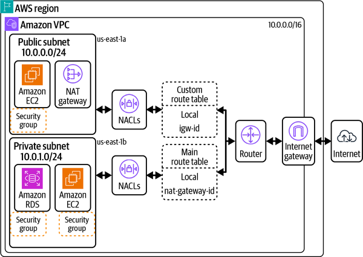
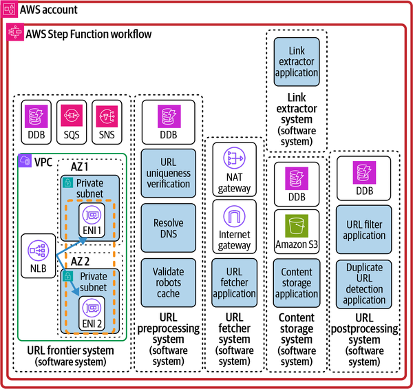
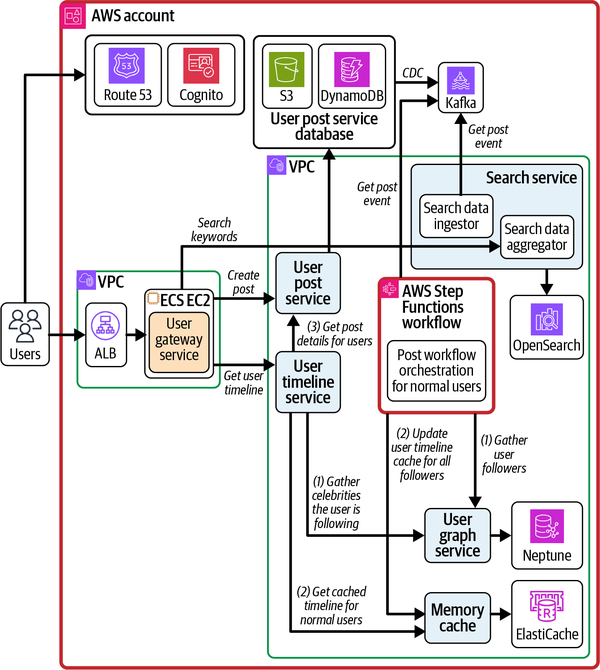
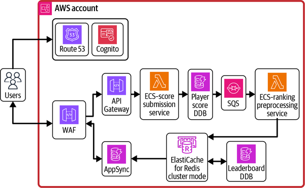
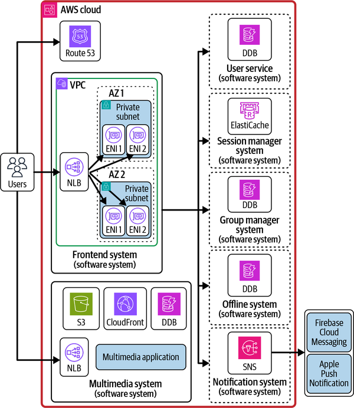
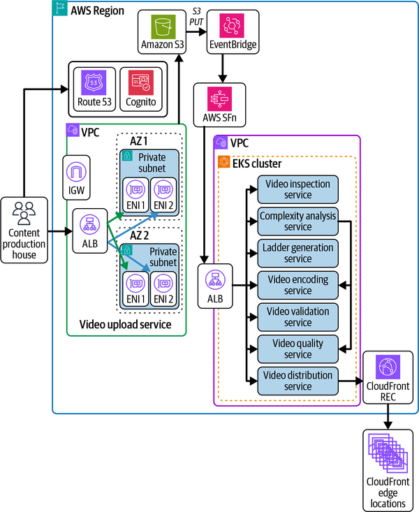

# System Design on AWS - Engineering Knowledge

## Source Context

- **Detected title:** *System Design on AWS*
- **Authors:** Jayanth Kumar and Mandeep Singh
- **Source date:** 2025-02-21
- **Scope:** System design basics, AWS service selection, and end-to-end use cases for URL shorteners, crawlers/search, social feeds, leaderboards, reservations, chat, video processing, and stock trading.
- **Version note:** AWS services evolve quickly. Treat service behavior, limits, quotas, and exact feature names as source-grounded for the 2025 book, then verify current AWS documentation before production use. `[Inference]`

## How To Use This Knowledge File

This book is useful because it combines two layers that engineers often study separately:

1. General system design principles: consistency, availability, scalability, storage, caching, load balancing, protocols, containers, and architecture patterns.
2. AWS implementation choices: VPC networking, DynamoDB, RDS/Aurora, ElastiCache, compute options, messaging, orchestration, monitoring, identity, analytics, and managed AI/data services.

Use this file as a design-review guide. For each system, move from requirements to tradeoffs, then to service selection, then to Day 0 architecture, then to Day N scaling and operations.

## Core Thesis

Enterprise-scale AWS design is a chain of tradeoffs. The right architecture is not the one with the most managed services or the most familiar database. The right architecture fits consistency, latency, throughput, availability, cost, operational skill, compliance, and growth path. The book repeatedly shows that early systems should optimize for clarity and managed operations, while scaled systems must revisit partitioning, data ownership, network topology, asynchronous workflows, observability, and blast-radius control.

## High-Value Mental Models

| Mental Model | Explanation | Why It Matters | Common Misuse | Source Area |
|---|---|---|---|---|
| Requirements drive architecture | Latency, consistency, scale, durability, data sensitivity, and user flows decide the design. | Prevents service-first architecture. | Choosing AWS services before writing access patterns and failure modes. | Ch. 1, Part III |
| Consistency is a spectrum | Strong consistency simplifies reasoning but costs availability, latency, or coordination. Eventual consistency improves scale but shifts complexity to application behavior. | Most distributed data bugs are consistency expectation bugs. | Calling a system eventually consistent without defining user-visible stale states. | Ch. 1-3 |
| Data model before database | Access patterns, write rates, query shapes, cardinality, retention, and consistency should come before service choice. | Prevents expensive migrations. | Choosing DynamoDB, Aurora, or OpenSearch because they are popular. | Ch. 2-4, Ch. 10 |
| Caches trade freshness for latency and load reduction | A cache is a controlled inconsistency mechanism. | Helps decide TTL, invalidation, and fallback behavior. | Adding Redis without knowing what can be stale. | Ch. 4, Ch. 10 |
| Network topology is architecture | VPCs, subnets, routing, endpoints, peering, Transit Gateway, PrivateLink, edge, and DNS shape reachability and blast radius. | Many cloud outages are routing, DNS, security group, or dependency failures. | Treating networking as setup rather than design. | Ch. 9 |
| Managed services buy operations at the price of constraints | Lambda, Fargate, App Runner, DynamoDB, AppSync, Kinesis, Step Functions, and managed analytics reduce undifferentiated operations but impose service limits and behavior. | Helps Day 0 teams launch faster. | Staying on a managed abstraction after requirements exceed its fit. | Ch. 10-13, Part III |
| Day 0 and Day N are different architectures | Launch architecture and scaled architecture should be related but not identical. | Prevents overbuilding early and under-planning later. | Either designing for imaginary hyper-scale or ignoring migration paths. | Part III |

## System Design Foundations

### Communication And Consistency

**Figure: Sequence diagrams for strong consistency and eventual consistency, source Ch. 1.** The visual compares write/read behavior under different consistency expectations.

**How to read it:** Strong consistency coordinates before exposing a value. Eventual consistency accepts temporary divergence and resolves replication later.

**Why it matters:** User experience, retry behavior, conflict handling, and availability all depend on this choice. A banking order system and a social like counter usually cannot use the same consistency model.

**Application:** For each entity, write the consistency contract: which reads must reflect the latest write, which values may lag, how long stale data is acceptable, and what users see during reconciliation.

**Figure: PACELC theorem decision flowchart, source Ch. 1.** PACELC extends CAP by asking what the system chooses during partitions and during normal operation.

**How to read it:** During a partition, choose availability or consistency. Else, choose latency or consistency.

**Why it matters:** Many designs only discuss partition behavior, but most systems spend most of their time outside partitions where latency-consistency tradeoffs still matter.

**Application:** Use PACELC in design reviews for data stores, replication, cache invalidation, search indexing, cross-region writes, and event pipelines.

### Storage And Database Selection

**Figure: Decision flowchart for database selection, source Ch. 3.** The visual summarizes how data shape and access requirements influence relational, key-value, document, columnar, and graph choices.

**How to read it:** Start from access pattern and relationship shape. Do not start from a database brand.

**Why it matters:** Relational databases are strong for joins, transactions, and structured schemas. Key-value stores fit predictable key access. Document stores fit flexible aggregate documents. Columnar systems fit high-write distributed workloads and analytics patterns. Graph stores fit relationship traversal.

**Application:** Before choosing a database, write an access-pattern matrix: operation, key/query, cardinality, consistency, latency target, write rate, read rate, item size, retention, and failure behavior.

### Caching

**Figure: Caching strategies, source Ch. 4.** The figure groups read-intensive and write-intensive cache approaches.

**How to read it:** Cache-aside, read-through, write-through, write-behind, and refresh-ahead move different responsibilities between application, cache, and database.

**Why it matters:** Caching is not just a latency optimization. It changes failure behavior, consistency, cost, and load distribution.

**Application:** Define cache ownership, TTL, invalidation event, warmup strategy, stampede protection, fallback behavior, and what data is allowed to be stale.

### Load Balancing And Edge Components

**Figure: Load balancer, reverse proxy, forward proxy, and API gateway, source Ch. 5.** The visual separates common network intermediaries.

**How to read it:** A load balancer distributes traffic. A reverse proxy fronts services. A forward proxy represents clients. An API gateway adds API-specific concerns such as routing, auth, transformation, throttling, and observability.

**Why it matters:** Confusing these components leads to misplaced responsibilities and hard-to-debug traffic paths.

**Application:** In architecture diagrams, label which layer terminates TLS, authenticates callers, enforces rate limits, performs routing, retries, and emits access logs.

### Architecture Patterns

**Figure: Microservice architecture, source Ch. 8.** The visual shows independently deployable services communicating over APIs and events.

**How to read it:** The value is not service count; it is independent ownership, scaling, deployment, and failure isolation.

**Why it matters:** Microservices amplify operational complexity. They are useful when organizational and domain boundaries justify the cost.

**Application:** Prefer microservices when team ownership, deployment independence, domain separation, and scaling differences are clear. Prefer a modular monolith when the domain is still unstable or the team cannot operate distributed systems. `[Inference]`

## AWS Service Architecture

### Networking

**Figure: Overview of AWS networking components, source Ch. 9.** The diagram shows subnets, route tables, an internet gateway, NAT behavior, and public/private network placement.

**How to read it:** A subnet is not public by name; it is public because routing and gateway configuration make it reachable. Route tables define reachability.

**Why it matters:** Network design controls blast radius. Misplaced routes, public subnets, or broad security rules can expose systems accidentally.

**Application:** For each workload, document inbound path, outbound path, DNS behavior, security groups, NACL assumptions, VPC endpoints, internet exposure, and cross-account or cross-region connectivity.

**Figure: AWS Transit Gateway, source Ch. 9.** Transit Gateway centralizes connectivity among many VPCs and networks.

**How to read it:** Transit Gateway is a hub-and-spoke networking service. It reduces the management burden of many pairwise peering relationships.

**Why it matters:** VPC peering can become route-table sprawl at scale. Transit Gateway improves manageability but adds cost and routing design responsibility.

**Application:** Use peering for simple low-scale connectivity. Consider Transit Gateway for many VPCs, accounts, or hybrid networks. Define route domains and blast-radius boundaries deliberately.

**Figure: Content distribution via CloudFront, source Ch. 9.** CloudFront caches and delivers content through edge locations.

**How to read it:** User traffic reaches an edge location first; the edge serves cached objects or forwards misses to the origin.

**Why it matters:** Edge caching improves latency and reduces origin load, but cache keys, invalidation, origin protection, and signed access become design concerns.

**Application:** Use CloudFront for static assets, media, APIs with cacheable responses, and edge protection. Define cache keys, TTLs, invalidation policy, origin failover, WAF rules, and access logging.

### Data Services

**Figure: DynamoDB internal architecture, source Ch. 10.** The visual shows DynamoDB as a managed partitioned service rather than a server you operate.

**How to read it:** DynamoDB scales by partitioning data and spreading throughput. The table design must align with key access patterns.

**Why it matters:** DynamoDB can be excellent for predictable high-scale key-value access, but poor key design creates hot partitions, expensive scans, and awkward secondary indexes.

**Application:** Model access patterns first. For each query, identify partition key, sort key, index need, expected cardinality, write distribution, item size, and consistency requirement.

### Compute And Scaling

**Figure: Autoscaling, source Ch. 11.** The visual shows capacity changing based on demand signals.

**How to read it:** Autoscaling is feedback control. It detects load and adjusts compute capacity.

**Why it matters:** Autoscaling is not instant. Spiky traffic, cold starts, dependency bottlenecks, and stateful workloads can break naive scaling assumptions.

**Application:** Pair autoscaling with load testing, warm capacity, queue buffering, circuit breakers, and scaling policies tied to meaningful service indicators.

### Application Integration

**Figure: AppSync integration with multiple data sources, source Ch. 12.** AppSync can expose a GraphQL API over multiple backend services and stores.

**How to read it:** Resolvers connect graph fields to data sources. This can simplify client access while hiding backend composition.

**Why it matters:** GraphQL federation and managed API layers can reduce client complexity, but they can also concentrate authorization, performance, and resolver complexity.

**Application:** Use AppSync when clients need flexible graph-shaped reads across data sources. Design resolver latency, batching, auth boundaries, schema ownership, and error semantics explicitly.

## Day 0 To Day N Design Pattern

The use-case chapters share a repeatable method:

1. Start with product requirements and core user flows.
2. Sketch a logical architecture without cloud products.
3. Identify storage, communication, consistency, and scale constraints.
4. Choose Day 0 AWS services that minimize operational burden.
5. Revisit bottlenecks for Day N scale.
6. Add partitioning, regional strategy, caching, asynchronous processing, observability, and cost controls.

Day 0 should be understandable and launchable. Day N should be evolvable and resilient. The mistake is either overbuilding Day 0 or designing Day 0 with no migration path.

## Use-Case Architecture Patterns

### URL Shortener

**Figure: URL shortener system, source Ch. 14.** The architecture includes URL creation, redirection, storage, analytics, and AWS deployment concerns.

**How to read it:** The core path is write long URL to short key, then read short key to redirect. Analytics is asynchronous because it should not slow down redirects.

**Why it matters:** URL shorteners teach key generation, hot-key management, redirects, caching, analytics decoupling, and read-heavy scaling.

**Application:** Optimize redirect latency separately from analytics. Use caching for popular links, protect key generation from collision, and make analytics event-driven.

### Web Crawler And Search Engine

**Figure: Web crawler architecture, source Ch. 15.** The crawler fetches, deduplicates, stores, and schedules pages for indexing.

**How to read it:** Crawling is a frontier management problem. The system must decide what to fetch, when to fetch it, how to avoid duplicates, and how not to overload external sites.

**Why it matters:** Search architecture separates ingestion from query serving. The write path and read path have different scaling needs.

**Application:** Use queues and orchestration for crawl work, store raw content durably, deduplicate URLs/content, and decouple indexing from query serving.

### Social Network And Newsfeed

**Figure: Day N social network architecture, source Ch. 16.** The architecture evolves toward multiple services, data stores, event flows, and regional concerns.

**How to read it:** Social systems split post creation, timeline construction, search, media, notifications, and analytics. Hot users and high fanout dominate scale decisions.

**Why it matters:** Newsfeeds expose push-versus-pull tradeoffs. Fanout-on-write speeds reads but can be expensive for celebrity accounts. Fanout-on-read reduces write amplification but increases read latency.

**Application:** Choose timeline strategy by follower distribution, freshness needs, and cost. Treat counters, likes, comments, and media as separate access patterns.

### Online Game Leaderboard

**Figure: Scaled online game leaderboard architecture on AWS, source Ch. 17.** The design uses low-latency stores and scaling paths for score submission and ranking.

**How to read it:** Leaderboards need fast writes, fast top-N reads, anti-cheat considerations, and time-windowed rankings.

**Why it matters:** The hot path is latency-sensitive and write-heavy. A relational-only design often becomes expensive or slow for real-time ranking.

**Application:** Use sorted-set-like structures, partition leaderboards by game/time/region, persist durable score history, and separate real-time ranking from analytics.

### Hotel Reservation System

**Figure: Property reservation system Day N architecture, source Ch. 18.** The scaled design combines onboarding, search, booking, payment, reviews, and pricing.

**How to read it:** Reservation systems have multiple consistency zones. Search can be eventually consistent, but booking availability and payment state require stronger coordination.

**Why it matters:** Overselling inventory is a business-critical failure. Search performance and booking correctness need different stores and workflows.

**Application:** Separate search indexes from booking truth. Lock or reserve inventory for bounded time, use state machines for booking/payment, and make cancellation/refund transitions explicit.

### Chat Application

**Figure: Chat application Day N architecture, source Ch. 19.** The design handles persistent connections, message routing, transient storage, media, and user/session state.

**How to read it:** Chat is a connection-management and routing problem as much as a message-storage problem.

**Why it matters:** Online users need low-latency delivery; offline users need durable or transient storage and replay. Group chat adds fanout complexity.

**Application:** Track user-to-connection mapping, handle reconnects, persist acknowledgments, separate media flow from message metadata, and design for regional failure.

### Video Processing Pipeline

**Figure: Video-processing pipeline Day N architecture, source Ch. 20.** The design orchestrates upload, inspection, encoding, packaging, distribution, and streaming.

**How to read it:** Video processing is mostly asynchronous. User upload triggers a pipeline; distribution is optimized separately through storage and edge delivery.

**Why it matters:** Encoding is compute-heavy, parallelizable, and failure-prone. Streaming is read-heavy and edge-sensitive.

**Application:** Use object storage for source and outputs, orchestrate encoding steps, validate outputs, protect content with DRM where needed, and distribute through CloudFront or media-specific AWS services.

### Stock Trading Platform

**Figure: Market order execution architecture, source Ch. 21.** The design connects user intent, broker systems, order management, market data, and exchange connectivity.

**How to read it:** Market data flows from exchanges to users; order execution flows from users to exchanges. These paths have different latency, correctness, and compliance requirements.

**Why it matters:** Trading systems are high-stakes. Correctness, auditability, sequencing, and low latency matter more than generic web scaling patterns.

**Application:** Separate live tick delivery, historical charting, order entry, order state, audit logging, and exchange connectivity. Treat compliance and deterministic state transitions as first-class requirements.

## Decision Guides

### Storage Selection

| Need | Good Fit | Watch Out |
|---|---|---|
| ACID transactions and relational queries | RDS or Aurora | Scaling writes and schema migrations require planning. |
| Predictable key-value access at high scale | DynamoDB | Bad partition keys create hot partitions and scans. |
| Flexible document aggregates | Document database options | Cross-document joins and transactions may be awkward. |
| Search and text retrieval | OpenSearch or search-specific service | Index freshness and query cost are separate from source-of-truth consistency. |
| Relationship traversal | Neptune or graph database | Do not use graph databases for simple lookup workloads. |
| Cache and low-latency repeated reads | ElastiCache/Redis or DAX for DynamoDB | Staleness, invalidation, and stampedes must be designed. |
| Object/media storage | S3 | Access pattern, lifecycle, and distribution controls matter. |

### Compute Selection

| Compute Option | Use When | Avoid When |
|---|---|---|
| Lambda | Event-driven, bursty, short-running units of work. | Long-running jobs, tight runtime control, or specialized networking/runtime needs dominate. |
| App Runner | You want simple containerized web service deployment. | You need deep control over cluster behavior and networking. |
| ECS Fargate | Containers without managing instances. | Cost or unsupported configuration pushes you toward EC2-backed capacity. |
| ECS/EKS on EC2 | You need more control over nodes, cost, or runtime. | The team cannot operate clusters safely. |
| EC2 | You need OS/runtime control or long-running custom workloads. | Managed services satisfy the requirement with lower operational burden. |

### Integration Selection

| Need | Candidate | Design Concern |
|---|---|---|
| Asynchronous decoupling | SQS, SNS, EventBridge | Ordering, idempotency, retries, DLQs. |
| High-throughput ordered stream | Kinesis or MSK | Partitioning, consumer lag, retention, replay. |
| Workflow state machine | Step Functions | State boundaries, retries, compensating actions, payload size. |
| Graph API over many sources | AppSync | Resolver latency, schema ownership, authorization. |
| Batch/data workflow | MWAA/Airflow, Glue, EMR | Dependency management, job retries, data quality. |

## Architecture Review Checklist

| Area | Questions |
|---|---|
| Requirements | What are the latency, throughput, consistency, availability, durability, retention, compliance, and cost constraints? |
| Data | What is the source of truth? Which data can be stale? Which writes require coordination? |
| Scale | What is the expected cardinality, read/write ratio, peak pattern, and growth path? |
| Failure | What happens when the database, queue, cache, region, dependency, or network path fails? |
| Networking | Which paths are public, private, cross-VPC, cross-account, cross-region, or hybrid? |
| Security | Where are identity, authorization, encryption, audit, secrets, and least privilege enforced? |
| Observability | Which SLIs, logs, traces, dashboards, alerts, and business metrics prove the system works? |
| Cost | Which components scale with requests, storage, data transfer, shards, provisioned capacity, or idle compute? |
| Operations | Who owns deploys, incidents, backups, restores, schema changes, and runbooks? |
| Evolution | What changes between Day 0 and Day N? What migration path preserves users and data? |

## Production Playbooks

### Playbook: Design A New AWS System

1. Write functional and nonfunctional requirements.
2. Identify the critical user flows and data entities.
3. Define consistency and latency per flow.
4. Build the access-pattern matrix.
5. Choose storage per access pattern, not per team preference.
6. Choose communication style: synchronous API, queue, stream, or workflow.
7. Draw the AWS network path and trust boundary.
8. Select compute based on operational control and scaling needs.
9. Add observability, identity, security, backups, and cost controls.
10. Define Day 0 launch architecture and Day N migration triggers.

### Playbook: Evolve From Day 0 To Day N

1. Identify the first bottleneck using metrics, not guesses.
2. Split read and write paths if their scaling profiles diverge.
3. Add cache only when stale behavior is acceptable.
4. Partition data or traffic by natural boundaries.
5. Move long work to asynchronous workflows.
6. Introduce regional or multi-account boundaries when blast radius requires it.
7. Replace convenience managed abstractions only when constraints justify the operational cost.
8. Run migration with traffic shadowing, dual writes, backfills, and rollback plans where needed. `[Inference]`

### Playbook: Review A Data Store Choice

1. List every query and write.
2. Mark required consistency for each operation.
3. Estimate hot keys, item sizes, cardinality, and growth.
4. Identify secondary indexes and denormalized copies.
5. Decide backup, restore, retention, and audit requirements.
6. Model failure behavior and retry behavior.
7. Calculate cost for normal, peak, and failure traffic.
8. Document why alternatives were rejected.

## Troubleshooting Guide

| Symptom | Likely Cause | Investigate | Repair |
|---|---|---|---|
| Database latency spikes | Missing index, hot partition, connection storm, lock contention, or underprovisioned capacity. | Query plans, partition metrics, connection counts, slow logs. | Redesign keys/indexes, pool connections, shard, cache carefully, or change store. |
| Cache improves latency but causes wrong results | Stale data contract is undefined. | TTLs, invalidation path, write path, user-visible stale cases. | Define freshness, invalidate by event, shorten TTL, or remove cache for critical data. |
| API scales poorly under bursts | Synchronous dependency chain or slow autoscaling. | Per-hop latency, queue depth, cold starts, scaling policy. | Add queues, pre-warm capacity, reduce dependency fanout, use backpressure. |
| Cross-VPC connectivity breaks | Route table, DNS, security group, NACL, endpoint, or peering/TGW route issue. | VPC route tables, flow logs, resolver rules, endpoint policies. | Fix routes/security/DNS and document traffic matrix. |
| Stream consumers lag | Partition count, hot shard, slow consumer, downstream bottleneck. | Consumer lag, shard metrics, retry rates, DLQ. | Repartition, scale consumers, batch, isolate poison records. |
| Search results are stale | Indexing pipeline lag or source-index consistency mismatch. | CDC lag, queue lag, index refresh, failed indexing jobs. | Define freshness SLO, monitor lag, replay failed events. |
| Multi-region failover surprises users | State, DNS, data replication, or dependency assumptions were not tested. | RTO/RPO tests, traffic switch process, data divergence. | Run game days, automate failover, make user-visible consistency explicit. |

## Visual Inventory And Coverage

Extracted visuals: 162. Embedded and explained in this file: 20. Skipped or reference-only: 142.

| Visual | Asset | Decision | Reason |
|---|---|---|---|
| Consistency sequence diagrams | `assets/system-design-on-aws-building-and-scaling-enterprise-solutions-knowledge/sdoa_0102.png` | Include | Core distributed systems concept. |
| PACELC flowchart | `assets/system-design-on-aws-building-and-scaling-enterprise-solutions-knowledge/sdoa_0108.png` | Include | Core tradeoff model. |
| Database selection flowchart | `assets/system-design-on-aws-building-and-scaling-enterprise-solutions-knowledge/sdoa_0304.png` | Include | Central service-selection aid. |
| Caching strategies | `assets/system-design-on-aws-building-and-scaling-enterprise-solutions-knowledge/sdoa_0401.png` | Include | Reusable cache decision model. |
| Load balancer/proxy/API gateway | `assets/system-design-on-aws-building-and-scaling-enterprise-solutions-knowledge/sdoa_0501.png` | Include | Clarifies network intermediary roles. |
| Microservices | `assets/system-design-on-aws-building-and-scaling-enterprise-solutions-knowledge/sdoa_0807.png` | Include | Anchors architecture pattern tradeoffs. |
| VPC networking components | `assets/system-design-on-aws-building-and-scaling-enterprise-solutions-knowledge/sdoa_0906.png` | Include | Central AWS networking model. |
| Transit Gateway | `assets/system-design-on-aws-building-and-scaling-enterprise-solutions-knowledge/sdoa_0908.png` | Include | Important scaling pattern for VPC connectivity. |
| CloudFront | `assets/system-design-on-aws-building-and-scaling-enterprise-solutions-knowledge/sdoa_0915.png` | Include | Important edge distribution model. |
| DynamoDB architecture | `assets/system-design-on-aws-building-and-scaling-enterprise-solutions-knowledge/sdoa_1001.png` | Include | Critical managed data service. |
| Autoscaling | `assets/system-design-on-aws-building-and-scaling-enterprise-solutions-knowledge/sdoa_1102.png` | Include | Core compute scaling pattern. |
| AppSync | `assets/system-design-on-aws-building-and-scaling-enterprise-solutions-knowledge/sdoa_1206.png` | Include | Useful API composition pattern. |
| URL shortener | `assets/system-design-on-aws-building-and-scaling-enterprise-solutions-knowledge/sdoa_1412.png` | Include | Representative read-heavy service. |
| Web crawler | `assets/system-design-on-aws-building-and-scaling-enterprise-solutions-knowledge/sdoa_1511.png` | Include | Representative ingestion/search system. |
| Social network Day N | `assets/system-design-on-aws-building-and-scaling-enterprise-solutions-knowledge/sdoa_1610.png` | Include | Representative feed and scale system. |
| Leaderboard Day N | `assets/system-design-on-aws-building-and-scaling-enterprise-solutions-knowledge/sdoa_1704.png` | Include | Representative low-latency ranking system. |
| Reservation Day N | `assets/system-design-on-aws-building-and-scaling-enterprise-solutions-knowledge/sdoa_1817.png` | Include | Representative consistency-sensitive workflow. |
| Chat Day N | `assets/system-design-on-aws-building-and-scaling-enterprise-solutions-knowledge/sdoa_1907.png` | Include | Representative connection-heavy system. |
| Video Day N | `assets/system-design-on-aws-building-and-scaling-enterprise-solutions-knowledge/sdoa_2008.png` | Include | Representative async media pipeline. |
| Trading execution | `assets/system-design-on-aws-building-and-scaling-enterprise-solutions-knowledge/sdoa_2108.png` | Include | Representative high-stakes low-latency system. |
| Remaining chapter figures | multiple | Skip/reference-only | Useful for full chapter study, but many are variants of the included patterns or detailed implementation views that would bloat the main learning path. |
| Cover and decorative assets | `cover.png`, title assets | Skip | Not engineering-relevant. |

## Gaps To Research Next

- Current AWS service quotas, regional availability, and pricing for every selected service.
- Current DynamoDB single-table design, adaptive capacity, transactions, global tables, and stream behavior.
- Current Aurora Limitless Database and Aurora Serverless capabilities before using them as a scaling plan.
- Modern multi-account landing zone, AWS Organizations, SCP, IAM Identity Center, and network account patterns. `[Inference]`
- Current AWS Well-Architected Framework pillars and workload-specific lenses. `[Inference]`
- Formal threat modeling and compliance controls for the high-stakes examples such as stock trading and reservations. `[Inference]`
