# System Design on AWS - Engineering Knowledge

- **Detected title:** *System Design on AWS*
- **Subtitle from filename/context:** Building and Scaling Enterprise Solutions
- **Authors:** Jayanth Kumar and Mandeep Singh
- **Primary domains:** system design fundamentals, distributed systems tradeoffs, storage, relational and nonrelational databases, caching, load balancing, communication protocols, containers, deployment, architectural patterns, AWS networking, AWS storage, AWS compute, AWS messaging/orchestration/monitoring/IAM, analytics and ML services, and applied AWS designs for URL shorteners, crawlers/search, social feeds, leaderboards, reservations, chat, video processing, and stock trading.
- **How to use this file:** Treat this as a design review and architecture synthesis guide. The source is broad; use the mental models, decision guides, and playbooks to reason about systems before choosing AWS services.
- **Version note:** The source is dated 2025. AWS services, names, limits, pricing, and feature behavior change frequently. Verify current AWS documentation before implementation. [Inference]
- **Related local knowledge files:** `aws-for-solutions-architects-the-definitive-guide-to-aws-solutions-architecture-knowledge.md` overlaps on AWS service selection; `certified-kubernetes-administrator-cka-study-guide-knowledge.md` overlaps on container orchestration mechanics.

## 1. Learning Roadmap

Study the book as three layers.

First, learn the system design primitives in Chapters 1-8. These chapters build the architectural vocabulary: communication mode, consistency, availability, reliability, scalability, storage, databases, caching, load balancing, protocols, containerization, deployment, and architecture patterns. This layer teaches how to reason before choosing services.

Second, map the primitives to AWS services in Chapters 9-13. These chapters cover networking, storage, databases, compute, messaging, workflow orchestration, monitoring, identity, analytics, and ML. This layer teaches implementation options and service boundaries.

Third, study the applied designs in Chapters 14-21. These use cases are the strongest part of the book for architecture practice: URL shortener, crawler/search engine, social network/newsfeed, game leaderboard, hotel reservation, chat, video processing, and stock trading. Each design starts with requirements, then evolves from basic design to AWS Day 0 and Day N architecture.

After studying, the reader should be able to:

- Translate product requirements into functional and nonfunctional requirements.
- Identify the dominant tradeoff: latency, throughput, consistency, availability, cost, maintainability, or operational complexity.
- Choose storage and database technologies by access pattern and consistency need.
- Select caching, load balancing, and communication patterns intentionally.
- Map AWS services to system responsibilities rather than assembling service icons.
- Evolve an architecture from simple Day 0 launch to high-scale Day N design.
- Review failure modes and operational readiness for AWS-based enterprise systems.

## 2. Core Mental Models

| Mental Model | Explanation | Helps Solve | Example | Common Misuse |
|---|---|---|---|---|
| Architecture is tradeoff selection | Every design optimizes some qualities by spending complexity, cost, or risk elsewhere. | Avoids one-size-fits-all service choices. | A chat system favors low latency and connection management; a crawler favors throughput and politeness. | Calling one service "best" without workload context. |
| Communication shape controls coupling | Synchronous calls couple availability and latency; asynchronous flows decouple but add eventual consistency and debugging complexity. | API, queue, stream, workflow decisions. | URL redirects need synchronous reads; crawler ingestion can be async. | Using queues to hide unclear ownership. |
| Data model follows access pattern | Relational, key-value, document, columnar, graph, and search stores fit different read/write/query shapes. | Database selection and scaling. | Leaderboards need sorted score access; hotel search needs geospatial/text search. | Choosing databases by familiarity only. |
| Consistency is a product property | Strong consistency simplifies correctness; eventual consistency improves availability/latency but shifts correctness to application workflows. | Booking, feeds, leaderboards, trading. | Hotel room booking needs strong conflict prevention; newsfeed fanout may tolerate eventual consistency. | Treating eventual consistency as just a database setting. |
| Cache is a correctness boundary | Caches improve latency and load but create invalidation, staleness, and failure-mode work. | Hot reads and edge distribution. | URL shortener redirect cache; leaderboard top-N cache; CloudFront video delivery. | Adding cache before defining staleness tolerance. |
| Load balancing is placement plus health plus policy | LBs distribute traffic, hide failures, enforce routing policy, and shape availability. | Multi-tier and multi-region designs. | ALB/API Gateway in front of app services; Route 53 and CloudFront at the edge. | Assuming round-robin is enough. |
| Day 0 and Day N are different architectures | Launch architecture optimizes speed and learning; scale architecture optimizes resilience, performance, and operations. | Architecture evolution. | A URL shortener can start with App Runner/RDS and evolve to DynamoDB, caches, queues, and multi-region. | Designing Day N complexity before product risk is known. |
| AWS services map to system responsibilities | AWS is not a checklist; each service should own a clear responsibility in the design. | Service selection. | Kinesis for streaming data, SQS for task buffering, Step Functions for workflow state, CloudWatch for signals. | Drawing AWS icons without explaining data/control flow. |
| Failure domains must be explicit | Systems fail at node, AZ, region, dependency, queue, cache, database, and network boundaries. | Availability and disaster recovery. | Active-active versus active-passive failover; multi-region chat or social feed. | Believing managed services remove system-level failure planning. |

## 3. Deep Concept Notes

### Distributed System Tradeoffs

- **Explanation:** The book frames system design around communication, consistency, availability, reliability, scalability, maintainability, fault tolerance, and classic tradeoffs such as time versus space, latency versus throughput, performance versus scalability, and consistency versus availability.
- **Problem solved:** It prevents architects from jumping directly to AWS services before understanding what the system must optimize.
- **How it works:** Each quality attribute pulls architecture in different directions. Strong consistency often adds coordination latency. Higher availability often adds redundancy and failover complexity. Higher throughput often requires batching, sharding, async processing, or partitioned state.
- **Why it matters:** Enterprise systems usually fail because an implicit tradeoff becomes visible under load or failure.
- **When to use:** Use these concepts at requirement discovery, design review, incident review, and architecture evolution.
- **When not to use:** Do not use CAP/PACELC as slogans. The real work is identifying which operations need which consistency and latency properties.
- **Tradeoffs:** Explicit tradeoffs improve clarity but require business stakeholders to accept constraints.
- **Common mistakes:** Optimizing for both strict consistency and maximum availability without acknowledging coordination cost; confusing throughput with latency; measuring availability for a component but not for the end-to-end workflow.
- **Production example:** A stock trading order path should prioritize correctness and low latency; a newsfeed timeline can tolerate eventual consistency in many paths.
- **Questions to ask:** What must be correct immediately? What can lag? What is the user-visible failure? Which dependency dominates availability?
- **Source reference:** Chapter 1.

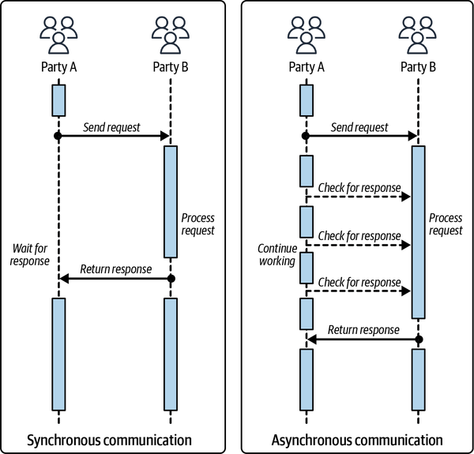

**Figure: Sequence diagram for synchronous versus asynchronous communication.** The diagram contrasts blocking request/response with decoupled message flow.

**How to read it:** In synchronous communication, the caller waits for the callee. In asynchronous communication, work is handed off and processed later.

**Why it matters:** The choice determines latency coupling, retry behavior, failure propagation, and user experience.

**How to apply it:** Use synchronous calls where the user needs immediate confirmation; use asynchronous queues/streams/workflows where buffering, fanout, or long-running processing matters.

**Limitations:** The figure does not show retries, idempotency, backpressure, or ordering guarantees.

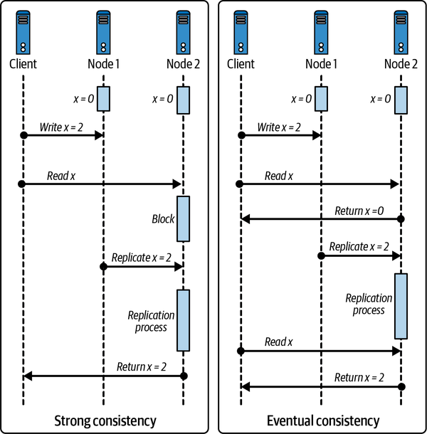

**Figure: Sequence diagrams for strong consistency and eventual consistency.** The visual shows the difference between immediate visibility and delayed convergence.

**How to read it:** Strong consistency requires reads to observe the latest committed write; eventual consistency allows temporary divergence.

**Why it matters:** Consistency determines correctness guarantees and user-visible anomalies.

**How to apply it:** Use strong consistency for booking conflicts, payments, and order execution. Use eventual consistency for feeds, counters, analytics, and search indexes when lag is acceptable.

**Limitations:** Real systems may offer per-operation or bounded-staleness variants not shown in the simplified diagram.

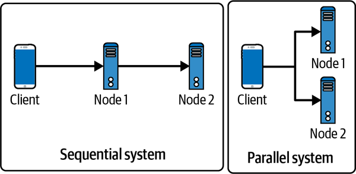

**Figure: Sequential system versus parallel system.** The diagram compares availability composition.

**How to read it:** Sequential dependencies multiply failure risk; parallel redundancy can improve availability if failover works.

**Why it matters:** End-to-end availability is often worse than individual service availability.

**How to apply it:** Minimize serial dependencies in critical paths and add redundancy only with health checks, failover, and state strategy.

**Limitations:** The figure abstracts away correlated failures and operational mistakes.

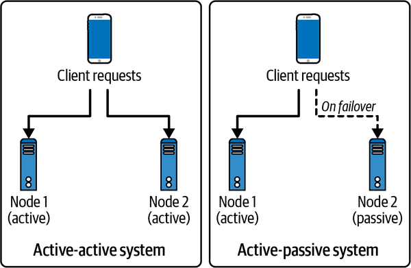

**Figure: Active-active failover system setup versus active-passive failover system setup.** The visual compares two availability patterns.

**How to read it:** Active-active serves traffic from multiple sites; active-passive keeps standby capacity for failover.

**Why it matters:** The choice affects cost, data consistency, operational complexity, and recovery time.

**How to apply it:** Choose active-active when low recovery time and global serving justify complexity; choose active-passive when simpler failover and lower steady-state cost are acceptable.

**Limitations:** Data replication and conflict resolution are not fully represented.

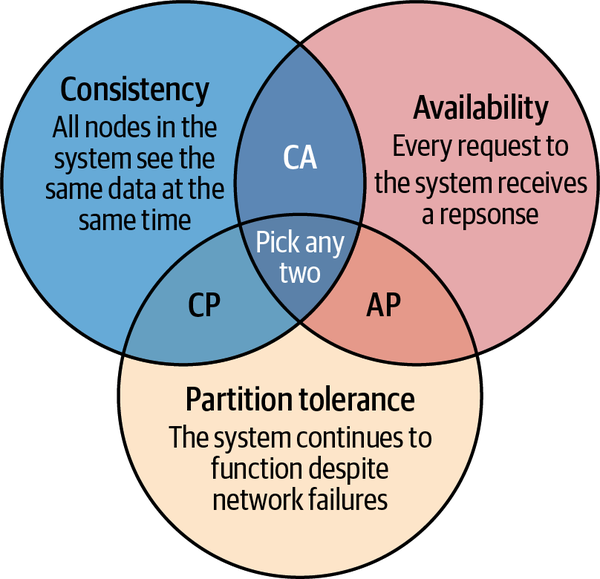

**Figure: CAP theorem Venn diagram.** The diagram frames the tradeoff between consistency, availability, and partition tolerance.

**How to read it:** Under network partition, a distributed system must choose how to trade consistency and availability.

**Why it matters:** CAP explains why distributed databases expose different consistency and availability behaviors.

**How to apply it:** Use CAP to discuss failure behavior, then validate the actual guarantees of the chosen database/service.

**Limitations:** CAP is not enough for normal-case latency tradeoffs; the PACELC model extends the conversation.

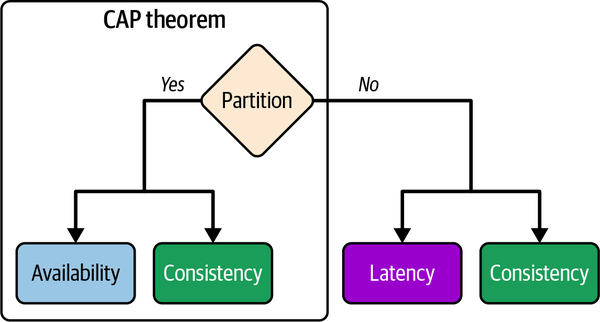

**Figure: PACELC theorem decision flowchart.** This diagram adds latency/consistency tradeoffs when there is no partition.

**How to read it:** If partition occurs, choose availability or consistency; else choose latency or consistency.

**Why it matters:** Most production time is non-partitioned, so latency/consistency tradeoffs are always present.

**How to apply it:** Ask both "what happens during partition?" and "what latency do we accept during normal operation?"

**Limitations:** It is a conceptual model, not a service behavior specification.

### Storage and Database Selection

- **Explanation:** The book separates storage abstraction from database model: file/block/object storage, relational stores, and nonrelational stores including key-value, document, columnar, and graph databases.
- **Problem solved:** It gives architects selection criteria based on data shape, access pattern, consistency, schema evolution, scaling, and query needs.
- **How it works:** Relational databases organize normalized tables and support ACID transactions. Nonrelational stores relax schema or consistency constraints to support scale, availability, or specialized queries. Object storage is a durable blob substrate, not a transactional database.
- **Why it matters:** Database mistakes become high-friction architecture debt.
- **When to use:** Use relational stores for transactional joins and constraints; key-value for direct lookups; document for flexible aggregate records; columnar/wide-column for high-scale partitioned access; graph for relationship traversal; search indexes for text/query retrieval.
- **When not to use:** Do not choose a nonrelational store just to avoid schema design; do not use relational joins for every relationship-heavy traversal; do not use S3 as a low-latency transactional store.
- **Tradeoffs:** Relational databases simplify correctness but can be harder to scale horizontally. Nonrelational stores scale selected access patterns but push design burden to keys, partitions, and application logic.
- **Common mistakes:** No access-pattern inventory, poor partition key selection, unnecessary denormalization, secondary index overuse, ignoring replication lag, treating search indexes as source of truth.
- **Production example:** A hotel reservation system may combine Aurora for booking transactions, OpenSearch for property search, DynamoDB for high-scale state/counters, and S3 for media.
- **Questions to ask:** What are the top reads/writes? What consistency is required per operation? What is the partition key? What query cannot be supported efficiently?
- **Source reference:** Chapters 2-3 and 10.

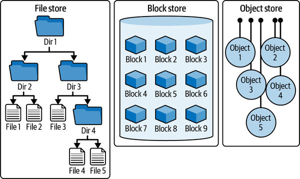

**Figure: Storage abstraction in a file store, block store, and object store.** This visual separates storage interfaces.

**How to read it:** File storage exposes paths/files, block storage exposes volumes/blocks, and object storage exposes objects with metadata.

**Why it matters:** The interface determines how applications read, write, share, and recover data.

**How to apply it:** Match storage to workload semantics before choosing EFS, EBS, or S3.

**Limitations:** The figure does not capture all managed storage features, performance classes, or lifecycle policies.

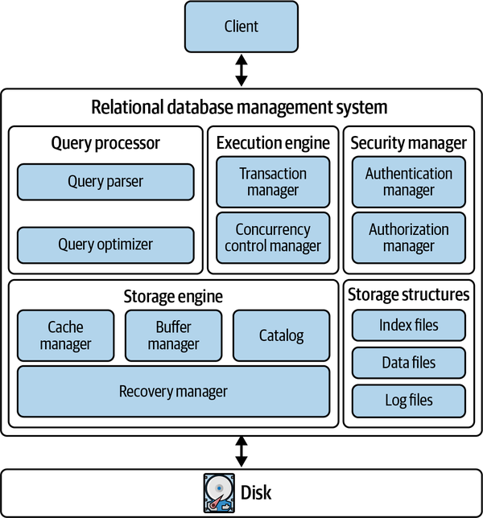

**Figure: RDBMS architecture block diagram.** The visual shows database management as more than stored tables.

**How to read it:** Query parsing, optimization, execution, storage, logging, and transaction management cooperate to produce ACID behavior.

**Why it matters:** Performance tuning involves query plans, indexes, storage, locks, and transaction behavior.

**How to apply it:** Use this model when diagnosing slow queries or deciding whether relational complexity is justified.

**Limitations:** Specific engines differ significantly.

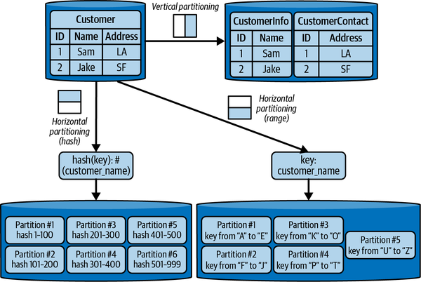

**Figure: Partitioning approaches in a database.** The diagram shows ways to split data.

**How to read it:** Partitioning divides data within a logical database; the partitioning key controls distribution.

**Why it matters:** Bad partitioning creates hot partitions and poor query performance.

**How to apply it:** Choose hash partitioning for distribution, range partitioning for ordered queries, and validate query patterns.

**Limitations:** Cross-partition transactions and rebalancing are not fully shown.

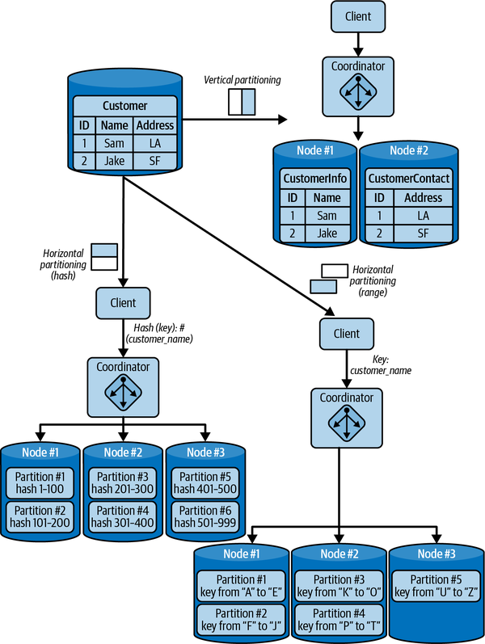

**Figure: Sharding approaches in a database.** This visual shows horizontal data distribution across shards.

**How to read it:** Shards are independent partitions often placed on different nodes.

**Why it matters:** Sharding increases scale but complicates routing, transactions, and operations.

**How to apply it:** Shard only when workload scale and access patterns justify operational complexity.

**Limitations:** The figure does not show resharding, global secondary indexes, or multi-shard query costs.

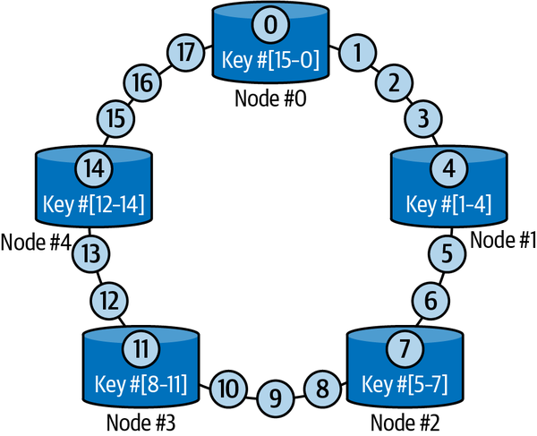

**Figure: Implementation of consistent hashing.** The visual shows key distribution over a hash ring.

**How to read it:** Keys map onto ring positions; adding/removing nodes affects only nearby key ranges.

**Why it matters:** Consistent hashing reduces reshuffling when scaling distributed stores.

**How to apply it:** Use the model when reasoning about partition movement, hot keys, and node membership.

**Limitations:** Real systems add virtual nodes, replication, failure detection, and repair.

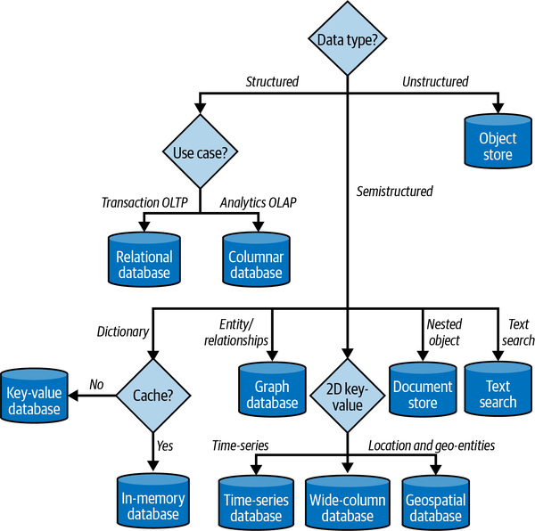

**Figure: Decision flowchart for database selection.** This is a high-value design artifact from the source.

**How to read it:** Start from access pattern, data model, consistency, scale, and query requirements rather than service preference.

**Why it matters:** Database selection is one of the least reversible architecture decisions.

**How to apply it:** Convert the flowchart into an architecture review checklist before committing to RDS, DynamoDB, DocumentDB, Neptune, OpenSearch, or S3/Athena.

**Limitations:** Current AWS database features, limits, and pricing must be verified.

### Caching and Content Distribution

- **Explanation:** Caching stores reusable data closer to consumers or compute to reduce latency, backend load, or bandwidth. The source covers eviction, invalidation, read/write caching strategies, deployment models, CDNs, Redis, and Memcached.
- **Problem solved:** It reduces repeated computation or storage reads on hot paths.
- **How it works:** Cache-aside has applications read/write the cache explicitly. Read-through/write-through push cache interactions into the cache layer. Refresh-ahead warms likely-needed items. Write-back improves write latency but risks data loss if not durable.
- **Why it matters:** Cache correctness is a first-class design issue.
- **When to use:** Use caching for hot reads, expensive calculations, global content delivery, and rate-limited backend protection.
- **When not to use:** Avoid caching data where staleness violates correctness unless you have an invalidation strategy.
- **Tradeoffs:** Lower latency and cost versus stale data, cache stampedes, invalidation complexity, memory pressure, and operational dependency.
- **Common mistakes:** No TTL, no invalidation plan, cache as source of truth, no stampede protection, caching personalized data without isolation.
- **Production example:** A URL shortener can cache short-code lookups; a video platform uses CloudFront; a leaderboard caches top-N results.
- **Questions to ask:** What staleness is acceptable? What invalidates the value? What happens when cache is down? How is hot-key load controlled?
- **Source reference:** Chapters 4, 10, 14, 17, 20.

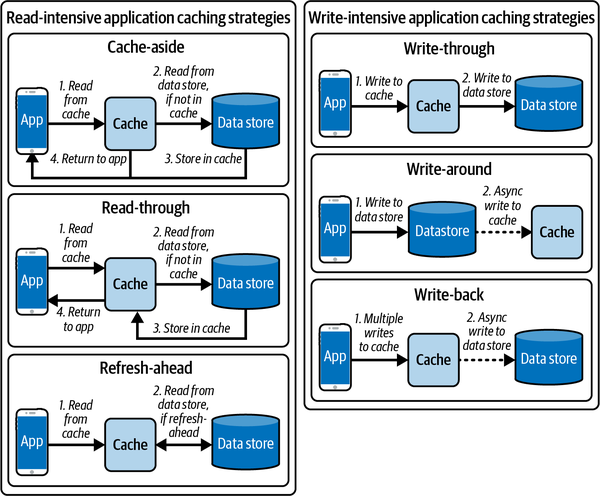

**Figure: Caching strategies.** The visual compares cache-aside, read-through, refresh-ahead, write-through, write-around, and write-back.

**How to read it:** Follow read and write paths between application, cache, and backing store.

**Why it matters:** Each strategy changes where correctness and latency risk lives.

**How to apply it:** Use cache-aside for common application-controlled reads; write-through when cache and backing store should update together; write-back only when durability risk is acceptable and mitigated.

**Limitations:** The figure does not show stampede protection or distributed invalidation.

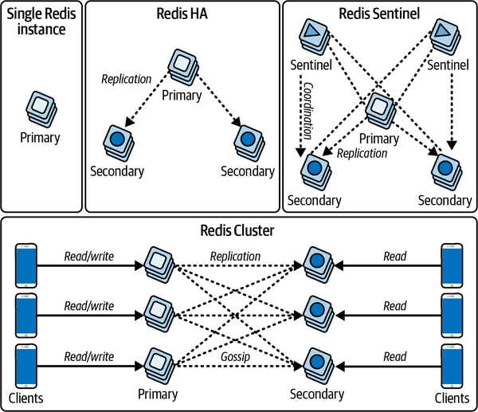

**Figure: Redis deployment setups.** The diagram shows Redis availability and scaling patterns.

**How to read it:** Identify single-node, replicated, and clustered designs.

**Why it matters:** Redis can be a cache, data structure server, or near-real-time ranking store, but topology determines resilience.

**How to apply it:** Use replication and clustering for production hot paths, and design failover behavior before relying on Redis availability.

**Limitations:** Managed Redis features and cluster behavior vary by service and version.

### Load Balancing and Network Entry

- **Explanation:** Load balancing distributes traffic across backends, improves availability, and enforces routing policy. The source distinguishes DNS, ECMP, L4, L7, stateful/stateless LBs, reverse proxies, forward proxies, and API gateways.
- **Problem solved:** It prevents single backend overload and provides a stable front door for services.
- **How it works:** LBs select healthy targets using static or dynamic algorithms; L7 LBs inspect application protocol; DNS and global traffic managers steer users across locations; API gateways add request management and integration.
- **Why it matters:** Load balancing is both performance infrastructure and failure handling.
- **When to use:** Use L4 for connection-level high-throughput traffic, L7 for HTTP routing, API Gateway for API management, CloudFront for edge content delivery, and Route 53/Global Accelerator patterns for global traffic steering.
- **When not to use:** Do not use sticky sessions to hide non-scalable application state unless there is a migration plan.
- **Tradeoffs:** Stateful LBs can preserve sessions but reduce elasticity. Stateless LBs improve scalability but require external session state.
- **Common mistakes:** No health checks, sticky session dependence, cross-zone cost surprises, using DNS failover without TTL expectations, overloading API Gateway with long-running workflows.
- **Production example:** A hotel reservation API can use CloudFront/WAF/API Gateway/ALB depending on edge, API, and service-level needs.
- **Questions to ask:** What layer is being balanced? What is the health signal? Is traffic global or regional? Is session state externalized?
- **Source reference:** Chapters 5 and 9.

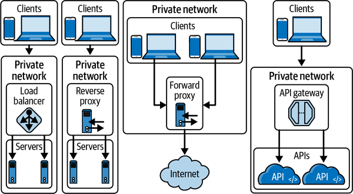

**Figure: Load balancer, reverse proxy, forward proxy, and API gateway.** This visual separates network roles.

**How to read it:** The client-side and server-side placement of a proxy determines whether it hides clients, servers, or APIs.

**Why it matters:** These components are often confused but solve different problems.

**How to apply it:** Choose an API gateway for API management, a reverse proxy/LB for backend routing, and a forward proxy for controlled outbound access.

**Limitations:** A real product may combine several roles.

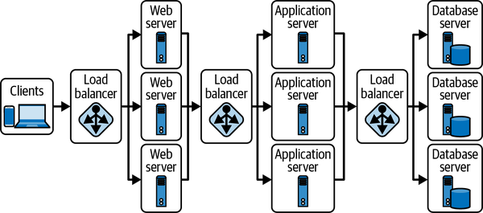

**Figure: Load balancer placements in a three-tier architecture.** The visual shows LBs between tiers.

**How to read it:** Traffic can be balanced at the edge, application tier, and service tier.

**Why it matters:** Internal load balancing is as important as external load balancing for resilient systems.

**How to apply it:** Place LBs at each tier boundary where scaling and failure isolation are needed.

**Limitations:** The diagram does not show service mesh, DNS, or autoscaling policies.

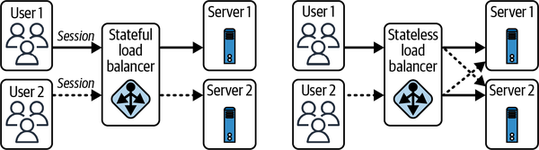

**Figure: Stateful load balancer versus stateless load balancer.** The visual compares session-aware and stateless routing.

**How to read it:** Stateful balancing tracks client/backend affinity; stateless balancing routes without stored session state.

**Why it matters:** Stateful routing can simplify legacy applications but hurts elasticity.

**How to apply it:** Prefer stateless backends and external session state for scalable cloud systems. [Inference]

**Limitations:** Some protocols require connection stickiness.

### Communication Protocols and Realtime Systems

- **Explanation:** The source covers OSI/TCP/IP, TCP/UDP, HTTP, SMTP, XMPP, MQTT, polling, WebSockets, SSE, RPC, REST, GraphQL, and WebRTC.
- **Problem solved:** Protocol choice determines latency, connection state, network compatibility, resource use, and client/server responsibilities.
- **How it works:** HTTP request/response works well for APIs and polling. WebSockets keep bidirectional connections. SSE pushes server-to-client streams. MQTT supports lightweight pub/sub messaging. WebRTC enables peer-to-peer media with signaling and NAT traversal.
- **Why it matters:** Protocol mismatch leads to cost, scaling, and reliability issues.
- **When to use:** Use REST/HTTP for resource APIs, GraphQL where clients need flexible data graphs, WebSockets for bidirectional chat, SSE for one-way updates, MQTT for IoT-style pub/sub, WebRTC for realtime media.
- **When not to use:** Avoid WebSockets when polling or SSE satisfies requirements; avoid GraphQL when query flexibility creates unbounded backend cost without controls. [Inference]
- **Tradeoffs:** Persistent connections reduce latency but increase connection management burden.
- **Common mistakes:** No backpressure, no reconnect strategy, no connection draining, no message ordering/idempotency plan.
- **Production example:** Chat uses WebSockets and connection pools; stock ticks use streaming/pub-sub; video calls use WebRTC.
- **Questions to ask:** Who initiates data? Is communication one-way or bidirectional? What is expected connection duration? What happens under reconnect?
- **Source reference:** Chapters 6, 19, 21.

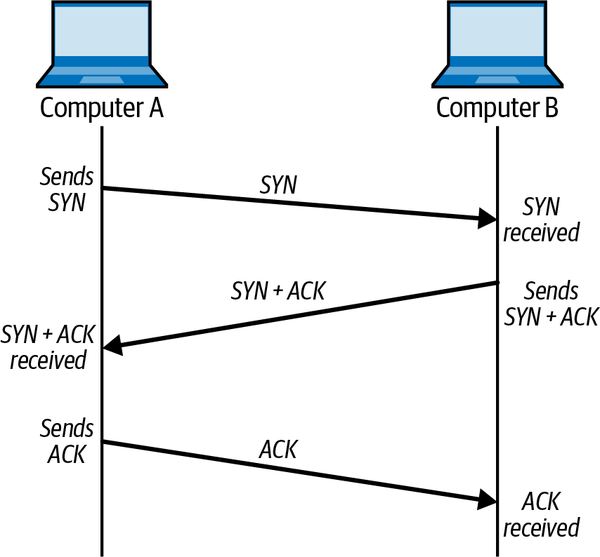

**Figure: TCP three-way handshake process.** The diagram shows connection establishment.

**How to read it:** TCP creates a reliable connection before application data flows.

**Why it matters:** Connection setup and connection count matter for latency and resource use.

**How to apply it:** For high-connection systems, design pooling, keepalive, load balancer timeouts, and connection draining.

**Limitations:** The figure does not show TLS, packet loss, congestion control, or connection teardown.

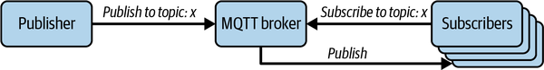

**Figure: MQTT architecture.** The visual shows publisher/broker/subscriber communication.

**How to read it:** Clients publish messages to topics; subscribers receive messages through the broker.

**Why it matters:** Topic-based pub/sub decouples producers and consumers.

**How to apply it:** Use for lightweight many-client messaging where topic routing and broker semantics match requirements.

**Limitations:** Broker availability, QoS, retention, and ordering semantics require separate design.

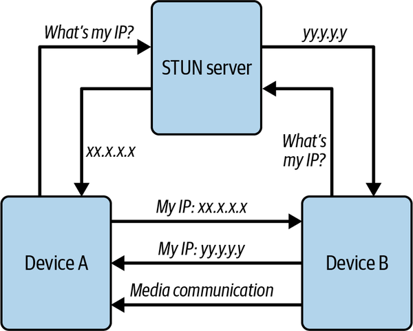

**Figure: WebRTC communication with a STUN server.** This visual shows peer discovery through NAT traversal.

**How to read it:** STUN helps peers discover public-facing connectivity information.

**Why it matters:** Realtime media systems need more than application servers; they need signaling and network traversal support.

**How to apply it:** Plan STUN/TURN, signaling, fallback, and media routing for video/chat applications.

**Limitations:** TURN relaying, security, and mobile network behavior are not shown.

### Containers, Deployment, and Architectural Patterns

- **Explanation:** The source covers virtualization versus containers, Docker images, lifecycle, Kubernetes, Gitflow, CI/CD, CDC, pub/sub, queues, orchestration/choreography, Lambda/Kappa/data lake, monolith, N-tier, microservices, HDFS, and Kafka.
- **Problem solved:** These patterns organize deployment, integration, data movement, and evolution.
- **How it works:** Containers package runtime artifacts. Kubernetes orchestrates containers. CI/CD moves changes into environments. Message brokers and event systems decouple producers/consumers. Architecture patterns split systems by layers, services, data pipelines, or event flows.
- **Why it matters:** Enterprise systems need both runtime infrastructure and change management.
- **When to use:** Use containers for repeatable deployments, microservices when independent ownership/scale is required, pub/sub and queues for decoupling, CDC for database-driven event propagation, Lambda/Kappa for analytics pipelines.
- **When not to use:** Avoid microservices, Kafka, or Kubernetes when team maturity and operational need do not justify them. [Inference]
- **Tradeoffs:** Decoupling improves autonomy but increases observability, schema, and failure-handling needs.
- **Common mistakes:** Shared databases between microservices, no event schema governance, CI/CD without rollback, Kafka as a generic queue, ignoring data lake governance.
- **Production example:** A social network combines service decomposition, feed fanout, CDC/migration, search indexing, and multi-region failover.
- **Questions to ask:** What changes independently? What data ownership boundary exists? What event contract governs integration? How does deployment roll back?
- **Source reference:** Chapters 7-8 and 14-21.

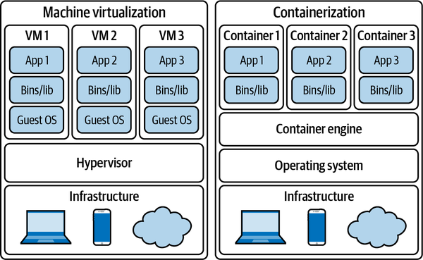

**Figure: Machine virtualization versus containerization.** The visual compares VM and container isolation layers.

**How to read it:** VMs package guest OS; containers share a host kernel and package application dependencies.

**Why it matters:** Runtime isolation, startup time, density, and patching differ.

**How to apply it:** Choose containers for portable application packaging; choose VMs when OS-level isolation/control is required.

**Limitations:** Security depends on runtime hardening and supply chain controls.

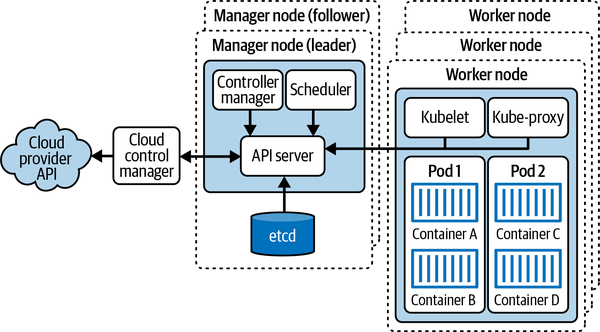

**Figure: Kubernetes architecture.** The diagram shows orchestration components and worker execution.

**How to read it:** Control plane makes scheduling/reconciliation decisions; worker nodes run Pods.

**Why it matters:** Kubernetes is a distributed control system, not just a container runner.

**How to apply it:** Use the model to plan EKS worker capacity, controllers, service discovery, and rollout behavior.

**Limitations:** Managed Kubernetes hides some control-plane operations.

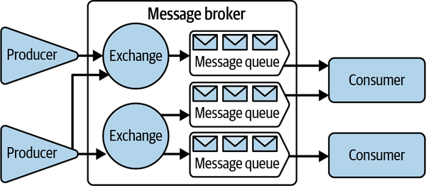

**Figure: Message broker and queues.** This visual shows producers, broker, queues, and consumers.

**How to read it:** Producers hand work to queues; consumers process independently.

**Why it matters:** Queues provide buffering and failure isolation.

**How to apply it:** Use SQS for task buffering and SNS/EventBridge/Kinesis/MSK when fanout or streams are required.

**Limitations:** The diagram does not show dead-letter queues, ordering, idempotency, or backpressure.

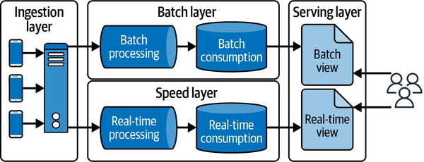

**Figure: Lambda architecture.** The visual combines batch and speed layers.

**How to read it:** Batch layer computes accurate views; speed layer handles fresh data; serving layer exposes results.

**Why it matters:** It explains why some analytics systems duplicate logic across real-time and batch paths.

**How to apply it:** Use only when both low-latency and complete historical computation are needed.

**Limitations:** Maintaining two computation paths is complex; Kappa architecture may be simpler for stream-centric systems.

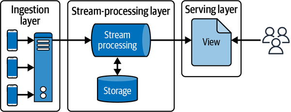

**Figure: Kappa architecture.** The visual simplifies processing around streams.

**How to read it:** All data flows through a stream processing layer rather than separate batch and speed layers.

**Why it matters:** It reduces duplicated processing logic where replayable streams can serve history and real time.

**How to apply it:** Consider Kappa when event streams are durable and replay can rebuild views.

**Limitations:** Historical reprocessing depends on stream retention and replay cost.

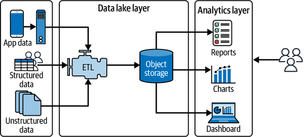

**Figure: Data lake architecture.** The diagram shows ingestion, storage, processing, and consumption layers.

**How to read it:** Raw data lands in durable storage, then is cataloged, processed, and served to analytics consumers.

**Why it matters:** A data lake needs governance and processing, not just object storage.

**How to apply it:** Use S3, Glue, Athena, EMR, Redshift, and governance controls according to workload.

**Limitations:** Data quality, lineage, and access control need explicit design.

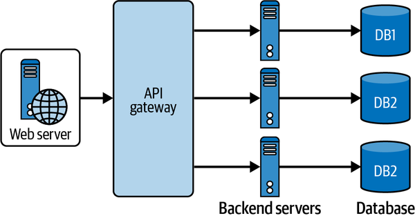

**Figure: Microservice architecture.** This visual shows decomposed services communicating over APIs/events.

**How to read it:** Each service should own a business capability and data boundary.

**Why it matters:** Microservices improve independent change only when boundaries are real.

**How to apply it:** Split by domain ownership, deployment independence, and scaling needs.

**Limitations:** The diagram hides distributed tracing, schema evolution, retries, and operational ownership.

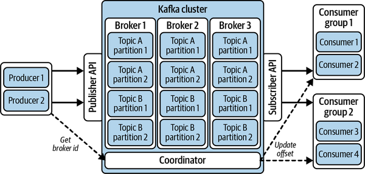

**Figure: Kafka architecture.** The visual shows brokers, topics, producers, and consumers.

**How to read it:** Producers append records to topics; consumers read partitions independently.

**Why it matters:** Kafka/MSK is useful for durable event streams, replay, and high-throughput ingestion.

**How to apply it:** Design partitions, keys, consumer groups, retention, schemas, and replay strategy.

**Limitations:** Kafka is not a simple queue and needs operational discipline.

## 4. AWS Service Mapping Notes

### AWS Networking

AWS networking services implement reachability, isolation, and traffic steering. The book covers Regions, AZs, Local Zones, edge locations, VPCs, CIDR/subnets, routing, security groups, NACLs, peering, Transit Gateway, endpoints, VPN, Direct Connect, Route 53, ELB, API Gateway, and CloudFront.

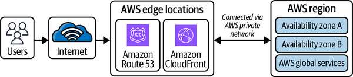

**Figure: Connectivity to an AWS region via an edge location.** The visual shows users reaching AWS through edge infrastructure.

**How to read it:** Edge locations sit closer to users than regional workloads and can accelerate or cache traffic.

**Why it matters:** Global user experience often depends on edge routing and content distribution.

**How to apply it:** Use CloudFront, Route 53, Global Accelerator-style patterns, and regional placement according to latency and content needs. [Inference]

**Limitations:** Specific edge service behavior must be verified against AWS docs.

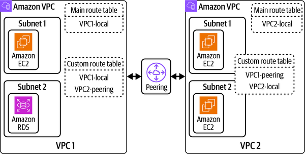

**Figure: VPC peering.** The diagram shows direct VPC-to-VPC connectivity.

**How to read it:** Peering connects two VPCs directly without transitive routing.

**Why it matters:** Peering is simple at small scale but becomes hard across many VPCs.

**How to apply it:** Use peering for limited, explicit connectivity; consider Transit Gateway for hub-and-spoke scale.

**Limitations:** The figure does not show route table or CIDR conflict details.

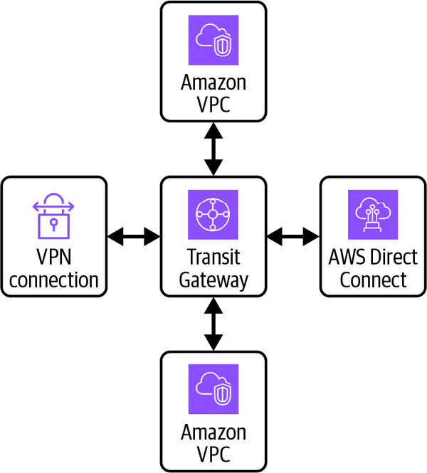

**Figure: AWS Transit Gateway.** This visual shows centralized VPC/network connectivity.

**How to read it:** TGW acts as a hub for routing between VPCs and networks.

**Why it matters:** It reduces mesh peering complexity but becomes shared network infrastructure.

**How to apply it:** Use TGW for multi-account/multi-VPC connectivity with route segmentation and governance.

**Limitations:** Cost, route domains, and inspection designs are not fully represented.

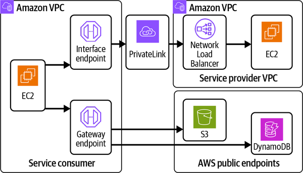

**Figure: Connectivity via endpoint services.** The diagram shows private service access.

**How to read it:** Consumers reach services through private endpoints instead of broad network paths.

**Why it matters:** Endpoint-based connectivity reduces exposure and network coupling.

**How to apply it:** Use VPC endpoints/PrivateLink-style patterns for private AWS/service access.

**Limitations:** DNS, endpoint policies, and service ownership still require design.

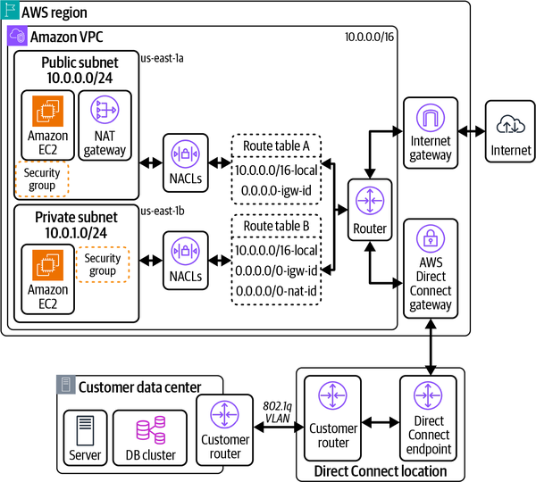

**Figure: Amazon VPC connectivity with an on-premises data center via Direct Connect.** This visual shows private hybrid connectivity.

**How to read it:** On-premises networks connect to AWS through dedicated links and routing.

**Why it matters:** Hybrid systems need bandwidth, latency, redundancy, and routing design.

**How to apply it:** Use for predictable private connectivity where VPN is insufficient.

**Limitations:** Physical redundancy and failover testing are not shown.

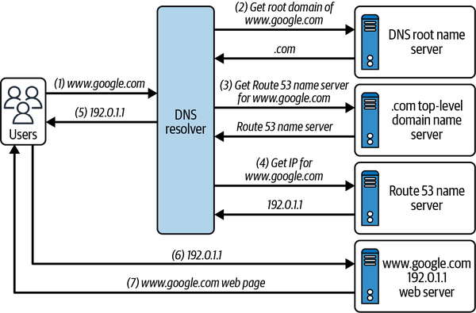

**Figure: DNS resolution via Amazon Route 53.** This diagram shows DNS as traffic steering infrastructure.

**How to read it:** Clients resolve names to endpoints through hosted zones and records.

**Why it matters:** DNS controls failover, regional routing, and service discovery.

**How to apply it:** Design TTLs, health checks, failover records, private hosted zones, and ownership.

**Limitations:** DNS caching can delay failover.

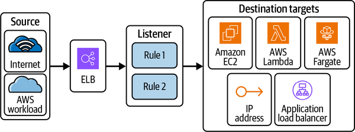

**Figure: AWS ELB configuration.** The visual shows load balancing to targets.

**How to read it:** Listeners receive traffic, rules route it, and targets serve it.

**Why it matters:** ELB health checks and routing determine application availability.

**How to apply it:** Choose ALB/NLB by protocol and routing needs; configure health checks and target groups carefully.

**Limitations:** Current ELB features and limits should be checked.

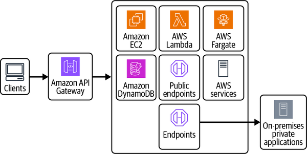

**Figure: Amazon API Gateway connectivity with AWS services.** This visual shows API Gateway as an integration front door.

**How to read it:** API Gateway can route requests to compute and AWS service integrations.

**Why it matters:** It centralizes API management, auth, throttling, and integration choices.

**How to apply it:** Use for public API boundaries, especially with Lambda, Step Functions, or service integrations.

**Limitations:** Not every workload fits API Gateway latency, timeout, payload, or pricing constraints.

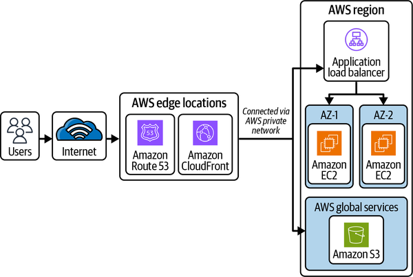

**Figure: Content distribution via Amazon CloudFront.** This visual shows edge caching between users and origins.

**How to read it:** Requests hit edge locations first; cache misses go to origin.

**Why it matters:** Edge caching reduces origin load and improves global latency.

**How to apply it:** Define cache keys, TTLs, invalidation, origin protection, and error caching.

**Limitations:** Dynamic or personalized content requires careful cache policy.

### AWS Storage, Compute, Messaging, and Analytics

Chapters 10-13 map system design needs to AWS services: EBS, EFS, S3, RDS, DynamoDB, DocumentDB, Neptune, ElastiCache, DAX, EC2, Lambda, ECS, EKS, MSK, Kinesis, SQS, SNS, Step Functions, MWAA, CloudWatch, IAM, Cognito, AppSync, EMR, Glue, Athena, QuickSight, Redshift, and SageMaker.

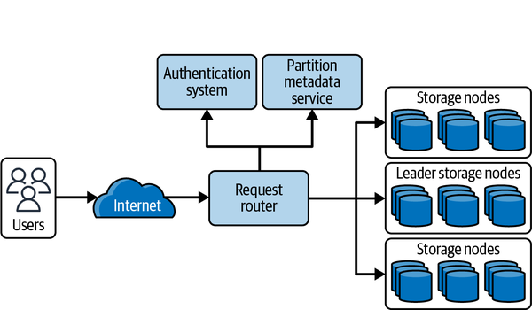

**Figure: DynamoDB internal architecture.** This visual shows DynamoDB as a partitioned distributed store.

**How to read it:** Data distribution and request routing depend on keys and partitions.

**Why it matters:** DynamoDB design starts with access patterns and partition keys.

**How to apply it:** Model hot keys, item sizes, read/write units, secondary indexes, and consistency per access path.

**Limitations:** The figure is conceptual and not a full implementation description.

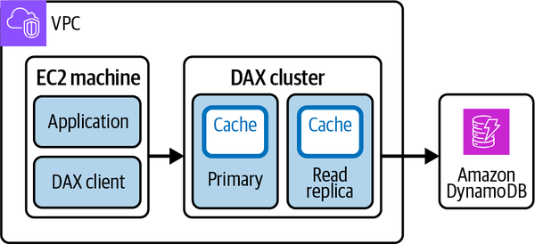

**Figure: DAX cluster setup.** The visual shows a cache tier for DynamoDB reads.

**How to read it:** Applications read through DAX to reduce DynamoDB read latency for cacheable access.

**Why it matters:** DAX can improve hot read paths but introduces cache behavior.

**How to apply it:** Use only when DynamoDB read latency/cost is a bottleneck and staleness semantics are acceptable.

**Limitations:** It does not remove the need for good key design.

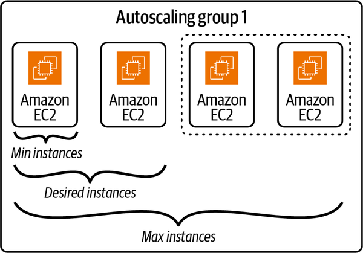

**Figure: Autoscaling.** This diagram shows capacity changing with demand.

**How to read it:** Metrics drive scaling actions that add or remove compute capacity.

**Why it matters:** Autoscaling is a control loop; poor metrics or slow warmup can fail under bursts.

**How to apply it:** Choose scaling metrics that represent bottlenecks and test scale-out/scale-in behavior.

**Limitations:** Autoscaling does not fix database bottlenecks or bad dependency limits.

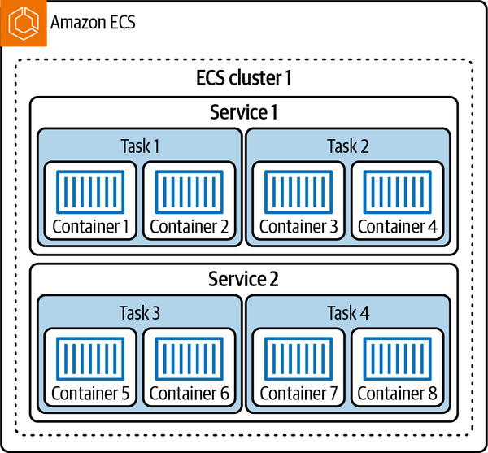

**Figure: ECS task, service, and cluster representation.** The visual shows ECS workload hierarchy.

**How to read it:** A cluster contains services; services maintain tasks from task definitions.

**Why it matters:** ECS maps container orchestration into AWS-native concepts.

**How to apply it:** Use task roles, service autoscaling, load balancer integration, and deployment strategies for production workloads.

**Limitations:** Fargate versus EC2 capacity decisions need separate analysis.

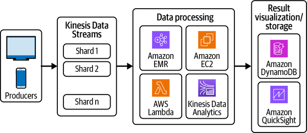

**Figure: Amazon Kinesis Data Streams.** The visual shows producers, stream shards, and consumers.

**How to read it:** Producers write records; consumers read by shard/partition key.

**Why it matters:** Shard/partition design controls throughput and ordering.

**How to apply it:** Use for high-throughput stream ingestion where AWS-native stream semantics fit.

**Limitations:** It does not show all enhanced fan-out, retention, or scaling details.

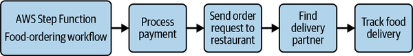

**Figure: Food-ordering workflow.** The visual illustrates workflow orchestration.

**How to read it:** A workflow stores state and coordinates tasks, branches, retries, and completion.

**Why it matters:** Orchestration is useful where business process state should be explicit.

**How to apply it:** Use Step Functions for multi-step workflows like booking, payment, media processing, and order state machines.

**Limitations:** Long-running, high-volume, or low-latency workflows require cost and quota review.

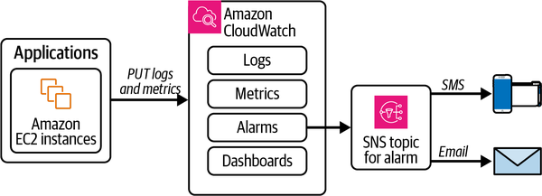

**Figure: Application integration with Amazon CloudWatch.** The visual shows logs, metrics, and alarms feeding operations.

**How to read it:** Applications emit telemetry; CloudWatch stores and evaluates signals.

**Why it matters:** Observability is a system design component, not a launch afterthought.

**How to apply it:** Define logs, metrics, alarms, dashboards, and runbooks per service.

**Limitations:** CloudWatch alone may not cover distributed tracing, SLOs, or third-party observability needs.

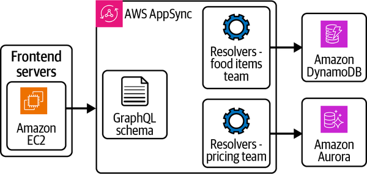

**Figure: AppSync integration with multiple data sources.** This visual shows GraphQL API integration.

**How to read it:** AppSync can resolve GraphQL fields from multiple backends.

**Why it matters:** GraphQL can simplify client access to heterogeneous data but shifts complexity to resolver design.

**How to apply it:** Use where clients need flexible graph-shaped reads and data sources can be controlled.

**Limitations:** Authorization, N+1 queries, caching, and resolver cost require careful design.

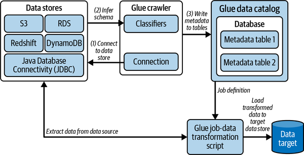

**Figure: AWS Glue architecture overview.** The visual shows cataloging and ETL flow.

**How to read it:** Glue crawlers/catalog/jobs connect data sources to transformations and analytics.

**Why it matters:** Data pipelines need metadata, transformation, and orchestration.

**How to apply it:** Use Glue for serverless ETL and catalog management, with partitioning and schema governance.

**Limitations:** Job tuning and data quality still need ownership.

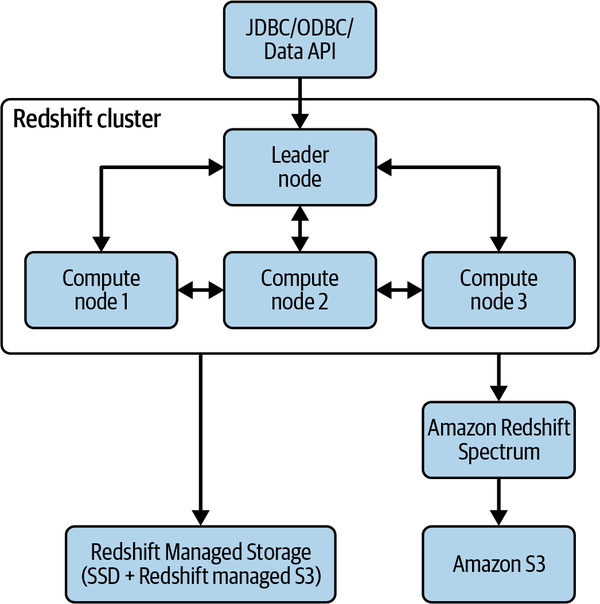

**Figure: Amazon Redshift architecture.** This diagram shows leader/compute node style warehouse processing.

**How to read it:** Query planning and execution are distributed across warehouse nodes.

**Why it matters:** Data layout and workload management affect warehouse performance.

**How to apply it:** Design sort/distribution, concurrency, and data loading around query patterns.

**Limitations:** Redshift Serverless/current features should be verified.

## 5. Chapter-by-Chapter Knowledge Extraction

### Chapter 1: System Design Trade-offs and Guidelines

The chapter teaches the foundation: communication, consistency, availability, reliability, scalability, maintainability, fault tolerance, distributed computing fallacies, and tradeoffs. The main engineering lesson is to make tradeoffs explicit and measurable.

Design decisions: sync versus async, strong versus eventual consistency, active-active versus active-passive failover, single-leader versus multileader replication, vertical versus horizontal scaling.

Risks: hidden serial dependencies, vague availability targets, mistaking scalability for performance, and using CAP/PACELC without operation-level analysis.

### Chapter 2: Storage Types and Relational Stores

The chapter explains storage abstractions and relational database fundamentals: SQL, ACID, ER modeling, normalization, keys, RDBMS architecture, indexes, SQL tuning, denormalization, federation, partitioning, sharding, and replication.

Design decisions: relational versus other models, normalization versus denormalization, partitioning/sharding strategy, synchronous versus asynchronous replication.

Risks: over-normalization under scale, wrong indexes, cross-shard joins, replication lag, and treating RDBMS as infinitely scalable.

### Chapter 3: Nonrelational Stores

The chapter covers schema flexibility, BASE, key-value, document, columnar/wide-column, and graph databases, including Dynamo, MongoDB, Cassandra, and Neo4j examples.

Design decisions: choose store by access pattern and query shape; use consistent hashing and leaderless replication where distribution and availability matter.

Risks: poor keys, hot partitions, eventual consistency surprises, tombstone/compaction issues, and graph misuse for non-relationship-heavy data.

### Chapter 4: Caching Policies and Strategies

The chapter covers eviction, invalidation, read/write strategies, deployment models, CDNs, Memcached, and Redis.

Design decisions: cache-aside versus read-through; write-through versus write-back; in-process versus remote; Redis versus Memcached; CDN push versus pull.

Risks: stale data, cache stampede, memory eviction, cache dependency outages, and inconsistent edge content.

### Chapter 5: Load Balancing Approaches and Techniques

The chapter explains LB placement, algorithms, session persistence, L4/L7, DNS load balancing, ECMP, hardware/software LBs, Nginx, and proxy/API gateway concepts.

Design decisions: global versus local load balancing, stateful versus stateless routing, L4 versus L7, API gateway versus load balancer.

Risks: bad health checks, sticky-session lock-in, proxy bottlenecks, and misconfigured routing.

### Chapter 6: Communication Networks and Protocols

The chapter teaches protocol selection: TCP/IP, HTTP, SMTP, XMPP, MQTT, polling, WebSockets, SSE, RPC, REST, GraphQL, and WebRTC.

Design decisions: request/response versus push, REST versus GraphQL, WebSocket versus SSE, peer-to-peer media versus relayed media.

Risks: long-lived connection pressure, no backpressure, overly flexible GraphQL queries, and NAT traversal failures.

### Chapter 7: Containerization, Orchestration, and Deployments

The chapter explains VMs, containers, Docker artifacts, Kubernetes, Gitflow, CI/CD, and deployment strategies.

Design decisions: VM versus container, ECS/EKS-style orchestration, branch/release flow, rollout strategy.

Risks: image sprawl, weak supply chain, no rollback, environment drift, and Kubernetes complexity without platform ownership.

### Chapter 8: Architectural Designs and Patterns

The chapter covers CDC, pub/sub, brokers, queues, choreography/orchestration, Lambda/Kappa/data lake, monolith, N-tier, microservices, HDFS, and Kafka.

Design decisions: choreography versus orchestration, monolith versus microservices, Lambda versus Kappa, queue versus stream.

Risks: distributed transactions hidden in events, no schema governance, duplicated batch/speed logic, and microservice boundary mistakes.

### Chapters 9-13: AWS Service Foundations

These chapters map architecture primitives to AWS networking, storage/database, compute, messaging, orchestration, monitoring, access, analytics, and ML services.

The main lesson is service responsibility mapping: VPC/Route 53/ELB/API Gateway/CloudFront handle network entry and routing; EBS/EFS/S3/RDS/DynamoDB/DocumentDB/Neptune/ElastiCache handle storage/data; EC2/Lambda/ECS/EKS handle execution; MSK/Kinesis/SQS/SNS/Step Functions/MWAA handle integration and workflow; CloudWatch/IAM/Cognito/AppSync handle observability/access/API composition; EMR/Glue/Athena/QuickSight/Redshift/SageMaker handle analytics and ML.

Risks: using services by popularity rather than requirement, ignoring quotas/pricing, missing IAM boundaries, and not designing observability.

### Chapter 14: Designing a URL Shortener Service

The chapter applies requirements, scale estimation, short code generation, APIs, database choice, custom domains, and AWS Day 0/Day N evolution.

Core decisions: hashing versus unique ID generation, key generation service, read-heavy cache, database selection, redirect latency, observability, compute and storage scaling.

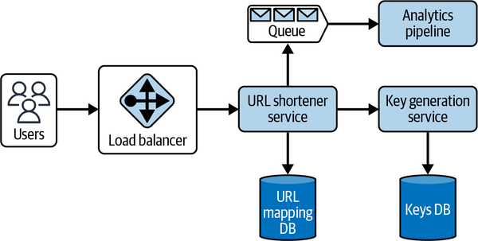

**Figure: URL shortener system architecture.** This visual captures the core services in URL creation and redirection.

**How to read it:** Separate write path (create short URL) from read path (redirect short code).

**Why it matters:** The read path usually dominates scale and latency.

**How to apply it:** Optimize redirect lookup with cache/CDN where appropriate and keep write path collision-safe.

**Limitations:** Abuse prevention, analytics, and custom-domain ownership need additional design.

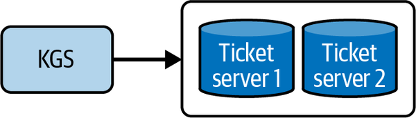

**Figure: Unique ID generation via ticket servers.** This visual shows centralized ID allocation.

**How to read it:** Ticket servers allocate unique ranges/IDs to avoid collisions.

**Why it matters:** Short code uniqueness is a core correctness requirement.

**How to apply it:** Use range allocation or distributed ID generation when single-node counters are bottlenecks.

**Limitations:** Ticket server availability and monotonicity assumptions must be designed.

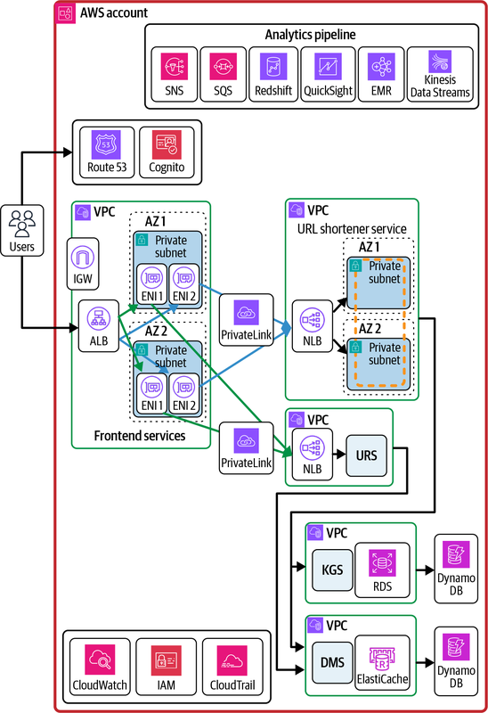

**Figure: URL shortener system.** This later-stage visual shows a scaled AWS architecture.

**How to read it:** Identify edge entry, compute, storage, cache, observability, and data flow.

**Why it matters:** It demonstrates Day 0 to Day N evolution.

**How to apply it:** Use as a pattern for read-heavy key lookup systems.

**Limitations:** Current AWS service details should be verified.

### Chapter 15: Designing a Web Crawler and Search Engine

The chapter designs crawler and search systems around URL frontier, recrawling, duplicate detection, indexing, compression, relevance, and AWS deployment.

Core decisions: crawl scheduling, politeness, duplicate detection, inverted index creation, decoupled indexing/search, queue/stream design, data storage, and serving latency.

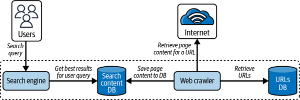

**Figure: Ten-thousand-foot view of the web crawler and search engine architecture.** This visual frames crawler and search as linked but separable systems.

**How to read it:** Crawl, fetch, parse, index, and serve are distinct stages.

**Why it matters:** Each stage scales and fails differently.

**How to apply it:** Decouple crawl ingestion from indexing and query serving with queues/streams.

**Limitations:** Web politeness, robots.txt, and abuse handling require deeper operational design.

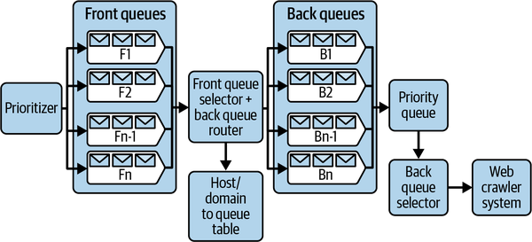

**Figure: URL frontier architecture.** This visual shows crawl scheduling and frontier management.

**How to read it:** The frontier decides what to crawl next and when.

**Why it matters:** Frontier design controls throughput, fairness, recrawl freshness, and politeness.

**How to apply it:** Partition by host/domain, enforce rate limits, deduplicate URLs, and prioritize freshness.

**Limitations:** Actual crawler ethics and legal compliance are outside the diagram.

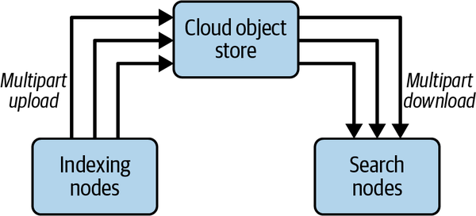

**Figure: Decoupled indexing and search systems.** This visual separates write-heavy indexing from read-heavy search.

**How to read it:** Index building feeds search-serving infrastructure asynchronously.

**Why it matters:** Query latency should not depend directly on crawl/index write load.

**How to apply it:** Build asynchronous pipelines with independent scaling for crawl, index, and query serving.

**Limitations:** Index freshness and consistency must be defined.

### Chapter 16: Designing a Social Network and Newsfeed System

The chapter designs post creation, user timelines, connections, search, migration, DynamoDB storage, comments scaling, auth scaling, traffic replication, database migration, multi-region deployments, and failure traffic switching.

Core decisions: fanout-on-write versus fanout-on-read, feed cache, graph/user connections, post/comment storage, migration strategy, multiregion resilience.

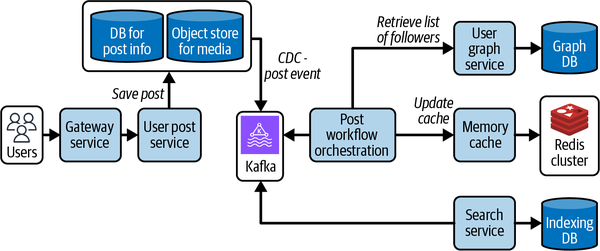

**Figure: New post creation architecture.** This visual shows the write path for social content.

**How to read it:** New content flows through write services, persistence, workflow, and downstream timeline/search systems.

**Why it matters:** Posting is not just a database write; it triggers feed, notification, search, and cache updates.

**How to apply it:** Use async workflows and idempotency for fanout and downstream processing.

**Limitations:** Privacy and moderation rules are not fully shown.

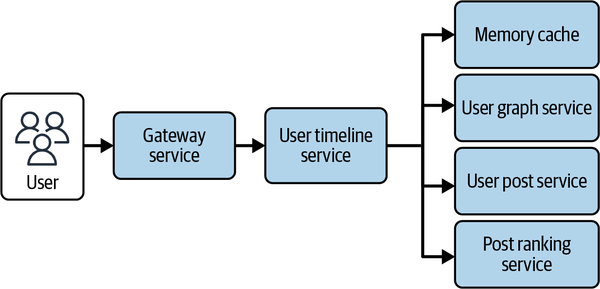

**Figure: User timeline architecture.** This visual shows feed construction.

**How to read it:** Timeline data can be precomputed, cached, or assembled on read.

**Why it matters:** Feed design is a core scalability decision for social systems.

**How to apply it:** Choose fanout-on-write for normal users and hybrid strategies for high-follower accounts.

**Limitations:** Ranking and personalization are additional systems.

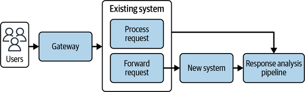

**Figure: Traffic replication on a new system.** This visual shows shadowing traffic during migration.

**How to read it:** Production traffic is mirrored to a new system for validation before cutover.

**Why it matters:** Large migrations need evidence before switching user-facing paths.

**How to apply it:** Compare outputs, latency, errors, and data side effects before cutover.

**Limitations:** Shadow traffic must avoid duplicate writes or external side effects.

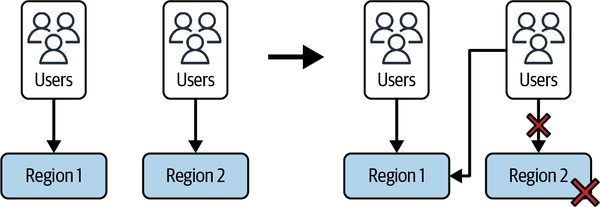

**Figure: Traffic switch upon region failure.** This visual shows failover across regions.

**How to read it:** Traffic moves from failed region to healthy region through routing control.

**Why it matters:** Multi-region architecture is only useful if traffic, data, and dependencies fail over coherently.

**How to apply it:** Define RTO/RPO, replication, DNS/routing, dependency failover, and game-day tests.

**Limitations:** Data conflict handling is not fully represented.

### Chapter 17: Designing an Online Game Leaderboard

The chapter designs score submission, ranking, leaderboard retrieval, database/cache/messaging, AWS Day 0, TCO, and Redis scaling.

Core decisions: sorted data structures, partitioning by game/time, cache top-N, eventual consistency tolerance, hot leaderboard mitigation.

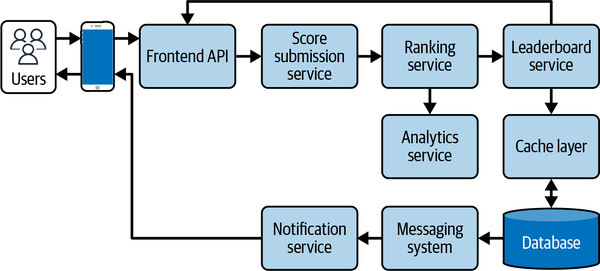

**Figure: Online game leaderboard system architecture.** This visual shows score submission, ranking, cache, database, and API layers.

**How to read it:** Writes and ranking updates are separate from leaderboard read serving.

**Why it matters:** Leaderboard reads can be much hotter than writes.

**How to apply it:** Use Redis/sorted sets or purpose-built ranking stores for top-N, with durable storage behind them.

**Limitations:** Anti-cheat, fairness, and real-time global consistency are not fully shown.

### Chapter 18: Designing a Hotel Reservation System

The chapter designs property onboarding, search, booking, payment, pricing, reviews, AWS deployment, Aurora scaling, Aurora Limitless Database, and Day N architecture.

Core decisions: search index versus source database, CDC to search, GraphQL federation, booking concurrency, state machines, payment workflow, dynamic pricing, reviews, multicomponent AWS scaling.

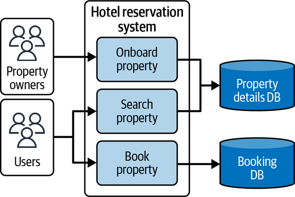

**Figure: High-level view of the property reservation system.** This visual separates onboarding, search, booking, payment, pricing, and review responsibilities.

**How to read it:** Each capability has different consistency and scaling needs.

**Why it matters:** Reservation systems fail when search, booking, and payment are designed as one undifferentiated service.

**How to apply it:** Separate read-optimized search from strongly controlled booking workflows.

**Limitations:** Fraud, compliance, and partner integrations need deeper design.

**Figure: Data persistence in Elasticsearch from the database via CDC.** This visual shows database changes feeding search.

**How to read it:** The database remains source of truth while CDC updates the search index.

**Why it matters:** Search indexes should usually be derived, not authoritative.

**How to apply it:** Use CDC pipelines with replay, lag monitoring, schema handling, and backfill plans.

**Limitations:** CDC lag and out-of-order events can affect search freshness.

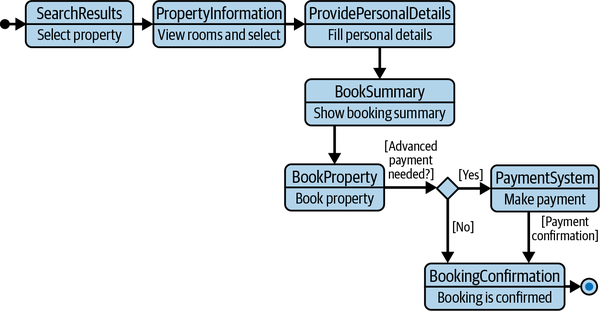

**Figure: Property booking state machine.** This visual shows booking lifecycle states.

**How to read it:** Booking transitions should be explicit and guarded.

**Why it matters:** Reservation correctness depends on state transition control under concurrency.

**How to apply it:** Model booking as a state machine with idempotent transitions and concurrency control.

**Limitations:** The diagram does not show distributed transaction compensation in detail.

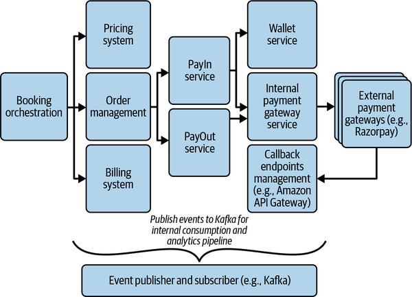

**Figure: Booking payment system architecture.** This visual shows payment flow as part of booking.

**How to read it:** Payment is a workflow with external dependency and post-processing.

**Why it matters:** Payments need idempotency, retries, reconciliation, and audit.

**How to apply it:** Use workflow/state machines, idempotency keys, and outbox-style eventing for payment status. [Inference]

**Limitations:** PCI/compliance detail is outside the figure.

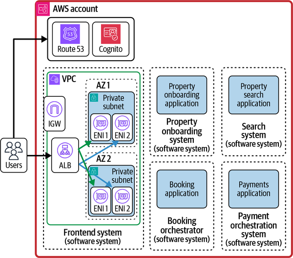

**Figure: Property reservation system Day N architecture.** This visual shows scaled AWS deployment.

**How to read it:** Search, booking, onboarding, reviews, pricing, storage, and integration are separated.

**Why it matters:** The architecture reflects different consistency and scaling needs per domain.

**How to apply it:** Use as a review pattern for reservation/order systems.

**Limitations:** Current AWS feature behavior and cost must be verified.

### Chapter 19: Designing a Chat Application

The chapter designs messaging architecture, protocol choice, direct messaging, message storage, multimedia, WhatsApp/Erlang reference architecture, connection pool management, island architecture, congestion handling, WebSocket management, and multi-region deployment.

Core decisions: WebSocket connections, user connection routing, durable message storage, multimedia offload, regional/island partitioning, congestion and backpressure.

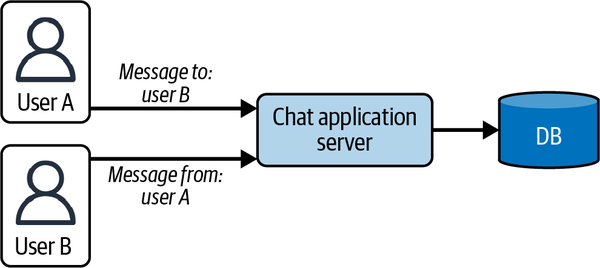

**Figure: High-level overview of chat application.** This visual separates clients, messaging, storage, and media responsibilities.

**How to read it:** Real-time messaging and media storage are different paths.

**Why it matters:** Chat systems are connection-management systems as much as message-storage systems.

**How to apply it:** Design connection registries, routing, delivery guarantees, offline storage, and media upload separately.

**Limitations:** End-to-end encryption and abuse controls are not shown.

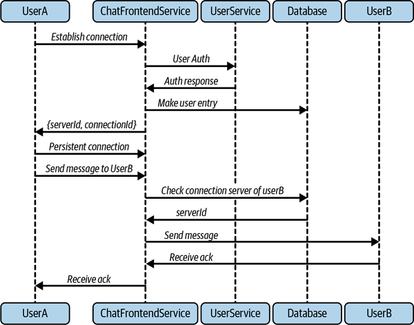

**Figure: Direct messaging between two users.** This visual shows direct message delivery path.

**How to read it:** User A's connection must route a message to User B's active connection or offline storage.

**Why it matters:** Delivery semantics depend on connection presence and durable queue/storage.

**How to apply it:** Track connection/user mapping and design retry/offline behavior.

**Limitations:** Group messaging and ordering are separate complexities.

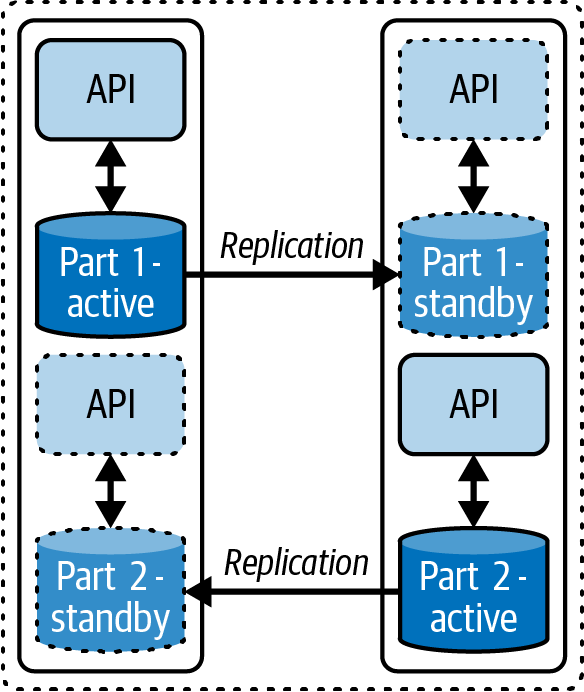

**Figure: Island architecture.** The visual shows partitioned service islands.

**How to read it:** Users/connections are partitioned into islands to contain scale and failure.

**Why it matters:** Global chat systems need partitioning to avoid one giant shared bottleneck.

**How to apply it:** Partition by geography, user ID, or routing group with cross-island messaging rules.

**Limitations:** Rebalancing and cross-island fanout are hard.

### Chapter 20: Designing a Video-Processing Pipeline

The chapter designs source inspection, encoding, quality validation, content indexing, distribution, AWS Day 0/Day N, live streaming, CloudFront/Origin Shield, and scale.

Core decisions: job orchestration, transcoding profiles, validation, metadata indexing, object storage, CDN distribution, origin shielding, live versus batch processing.

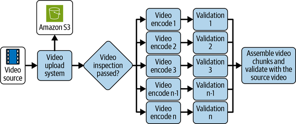

**Figure: Video encoding.** This visual shows transcoding source video into different formats/bitrates.

**How to read it:** One source file produces multiple renditions for devices and bandwidths.

**Why it matters:** Encoding is compute-heavy and directly affects playback quality and cost.

**How to apply it:** Use managed transcoding or scalable worker fleets with queues and validation steps.

**Limitations:** Codec/licensing and player compatibility require separate checks.

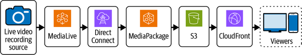

**Figure: Live streaming video-processing pipeline architecture.** This visual shows ingestion, processing, packaging, and delivery.

**How to read it:** Live video moves through time-sensitive stages before CDN delivery.

**Why it matters:** Live pipelines optimize for low latency and resilience under continuous load.

**How to apply it:** Design buffering, failover, monitoring, and segment delivery carefully.

**Limitations:** It does not show all DRM, ad insertion, or multi-CDN concerns.

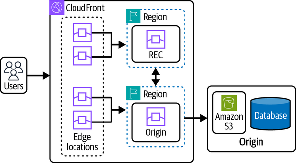

**Figure: Amazon CloudFront with Origin Shield.** This visual shows an extra caching layer before origin.

**How to read it:** Edge locations consolidate origin misses through Origin Shield.

**Why it matters:** It reduces origin load for large-scale content distribution.

**How to apply it:** Use Origin Shield when many edge locations would otherwise create origin request amplification.

**Limitations:** It adds another cache behavior and cost consideration.

### Chapter 21: Designing an Online Stock-Trading Platform

The chapter designs market data delivery, historical ticks, order management, ultra-low-latency systems, network connectivity, language choice, P&L dashboard, AWS Day 0/Day N, market order execution, and resilience.

Core decisions: low-latency market data, order correctness, event sequencing, exchange connectivity, historical storage, real-time P&L, regional resilience.

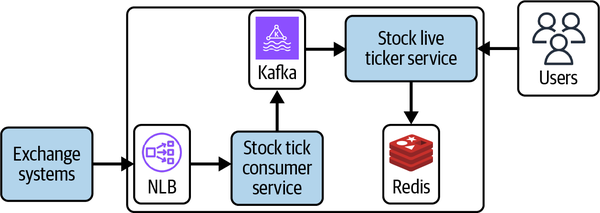

**Figure: Live stock ticks architecture.** This visual shows real-time market data flow.

**How to read it:** Market data enters ingestion and is distributed to downstream consumers.

**Why it matters:** Tick systems are latency- and throughput-sensitive.

**How to apply it:** Use streaming, fanout, backpressure, and low-latency network paths.

**Limitations:** Exchange-specific protocols and compliance are not shown.

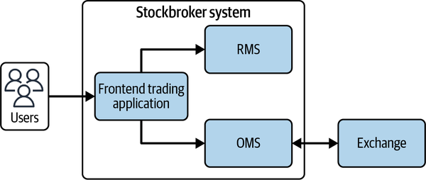

**Figure: Order execution.** This visual shows the order path.

**How to read it:** Orders flow from user/broker systems toward exchange execution and status handling.

**Why it matters:** Order systems prioritize correctness, sequencing, durability, and auditability.

**How to apply it:** Design idempotency, validation, risk checks, persistence, and reconciliation.

**Limitations:** Regulatory and exchange integration details are outside the diagram.

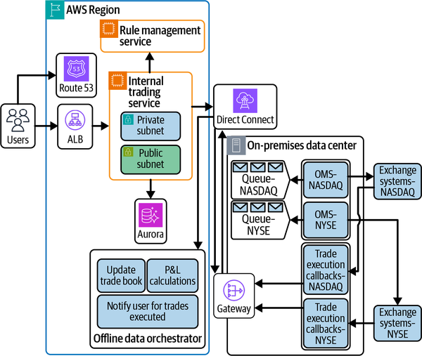

**Figure: Market order execution architecture.** This later-stage visual shows scaled execution components.

**How to read it:** Separate order intake, validation, routing, execution, persistence, and reporting.

**Why it matters:** Trading architecture must isolate latency-sensitive execution from analytical/reporting paths.

**How to apply it:** Keep critical order path minimal, observable, and strongly audited.

**Limitations:** Ultra-low-latency trading may require specialized infrastructure beyond general cloud primitives. [Inference]

## 6. Architecture Decision Guide

| Decision | Choose Option A When | Choose Option B When | Key Tradeoffs | Failure Risks | Questions To Ask |
|---|---|---|---|---|---|
| Synchronous vs asynchronous | User needs immediate result or simple request/response. | Work can be buffered, retried, fanned out, or processed later. | Simplicity/latency vs decoupling/eventual consistency. | Cascading failures, lost messages, duplicate processing. | Does the caller need the result now? |
| Strong vs eventual consistency | Incorrect stale reads create business harm. | Temporary divergence is acceptable. | Correctness vs latency/availability. | Double booking, stale feeds, wrong balances. | Which operation needs which guarantee? |
| Relational vs nonrelational | Joins, constraints, transactions, SQL flexibility matter. | Access pattern, scale, or schema flexibility dominates. | Query flexibility vs horizontal scalability. | Hot partitions, cross-shard operations. | What are top access paths? |
| Cache vs no cache | Hot repeated reads or expensive computations dominate. | Data changes often and staleness is unacceptable. | Latency/cost vs invalidation complexity. | Stale data, cache stampede. | What invalidates cached data? |
| L4 vs L7 load balancing | Protocol-level routing and high throughput matter. | HTTP routing, headers, paths, auth, or API policies matter. | Performance vs application awareness. | Bad routing, missing health checks. | What layer must make decisions? |
| Queue vs stream | Work queue and task distribution are primary. | Ordered/replayable event log is primary. | Simple task buffering vs replay/ordering. | Backlog, consumer lag, duplicates. | Do consumers need replay? |
| Orchestration vs choreography | Workflow state and visibility should be centralized. | Independent services react to events autonomously. | Control/observability vs loose coupling. | Hidden distributed workflows. | Who owns process state? |
| Monolith vs microservices | Team/domain is small or boundaries are unclear. | Independent ownership, scaling, and release are required. | Simplicity vs distributed complexity. | Distributed monolith. | What service owns data? |
| App Runner/Lambda/ECS/EKS/EC2 | Need managed simplicity or event execution. | Need container/Kubernetes/VM control. | Operational burden vs control. | Cold starts, cluster complexity, patching. | What runtime and ownership model fits? |
| DynamoDB vs RDS/Aurora | Key-value access at scale with known patterns. | Relational transactions and SQL matter. | Scale/ops vs query flexibility. | Bad keys, relational mismatch. | Can every query be modeled by keys/indexes? |
| OpenSearch/search index vs database | Text/geospatial/search ranking is primary. | Transactional source of truth is primary. | Query richness vs eventual index lag. | Stale search results. | What is source of truth? |
| CloudFront/CDN vs direct origin | Global static/media/hot content delivery needed. | Content is highly dynamic/private and not cacheable. | Latency/origin offload vs cache complexity. | Stale/personalized data leak. | What is the cache key and TTL? |
| Active-active vs active-passive | Low RTO/global serving justifies complexity. | Simpler DR and lower cost matter. | Availability vs consistency/cost. | Split brain, failed failover. | What are RTO/RPO and conflict rules? |

## 7. System Design Playbooks

### Playbook: Design an AWS System From Requirements

- **Use case:** Any new enterprise system.
- **Requirements to clarify first:** users, traffic, reads/writes, latency, availability, consistency, data sensitivity, compliance, cost, operational ownership, region needs.
- **Baseline architecture:** edge/API entry, compute, storage, cache, async integration, observability, identity, deployment pipeline.
- **Scaling path:** start simple, measure bottlenecks, then split read/write paths, add cache, add queues/streams, partition data, add regional resilience.
- **Data model considerations:** source of truth, access patterns, consistency per operation, indexing, retention, backup, migration.
- **Reliability strategy:** health checks, retries with idempotency, failover, backups, graceful degradation, runbooks.
- **Security strategy:** IAM least privilege, authentication, authorization, network isolation, encryption, audit.
- **Observability strategy:** logs, metrics, traces, business KPIs, alarms, dashboards, synthetic checks.
- **Cost considerations:** data transfer, storage class, compute utilization, queue/stream retention, logs, CDN, database capacity.
- **Common failure modes:** hot partitions, dependency failure, stale cache, queue backlog, bad deployment, region/AZ impairment.

### Playbook: Evolve Day 0 to Day N

- **Use case:** Product moves from launch architecture to large-scale enterprise architecture.
- **Requirements to clarify first:** actual traffic, bottlenecks, incidents, cost drivers, growth path, migration tolerance.
- **Baseline architecture:** one region, managed services, simple compute and database, basic observability.
- **Scaling path:** add cache, async processing, read replicas/indexes, partitioning, data pipelines, multi-AZ hardening, multi-region failover.
- **Data model considerations:** migrate from simple tables to access-pattern-specific stores without losing source-of-truth clarity.
- **Operational runbook notes:** shadow traffic, dual writes only with careful reconciliation, backfill plans, cutover/rollback, metrics comparison.
- **Common failure modes:** over-engineering before product-market fit, irreversible data migrations, inconsistent dual-write state, missed observability.

### Playbook: Design a High-Read Key Lookup System

- **Use case:** URL shortener, feature flag lookup, metadata lookup, token redirect.
- **Requirements:** very low read latency, high availability, collision-free writes, abuse controls, analytics.
- **Baseline:** API/service layer, database source of truth, cache for hot keys, CDN/edge if safe, async analytics pipeline.
- **Scaling path:** partition keys, use DynamoDB or similar key-value store, add DAX/Redis/CloudFront where staleness is acceptable, multi-region replication if required.
- **Failure modes:** key collision, stale redirect, hot key, cache stampede, abuse/spam, database throttle.

### Playbook: Design a Workflow-Critical System

- **Use case:** booking, payment, order execution, video processing.
- **Requirements:** explicit state, idempotency, external dependencies, retries, audit, compensation.
- **Baseline:** state machine/workflow orchestration, durable store, idempotency keys, event publishing, monitoring.
- **Scaling path:** partition by entity, separate synchronous user path from async processing, add outbox/CDC, add replay/reconciliation.
- **Failure modes:** duplicate payment/order, stuck state, external timeout, partial commit, missing compensation.

## 8. Applying This Knowledge To A Current System

| Review Area | What To Inspect | Why It Matters | What Good Looks Like | Warning Signs | Improvement Options |
|---|---|---|---|---|---|
| Requirements | Functional/NFRs, scale, consistency, latency | Services need constraints | Explicit tradeoffs per path | "Highly available" with no number | Write design assumptions and SLOs |
| Data model | Access patterns, keys, indexes, source of truth | Data choices drive scale | Query paths match store model | One database for everything | Build access-pattern matrix |
| Consistency | Per-operation guarantees | Prevents correctness bugs | Strong where required, eventual where accepted | Global eventual consistency by accident | Classify read/write paths |
| Cache | TTL, invalidation, keys, fallback | Cache changes correctness | Staleness documented and tested | Cache as source of truth | Add invalidation and stampede protection |
| Async flows | Queues/streams/workflows, DLQs, idempotency | Decoupled systems fail differently | Replay and retries are safe | Duplicate side effects | Add idempotency keys and DLQs |
| Network entry | DNS, CDN, API Gateway, LB, routing | Entry path controls availability | Health checks and routing policy tested | Unknown TTL/failover | Test failover and edge behavior |
| AWS ownership | Service responsibility map | Prevents icon diagrams | Every service has a job and owner | Unclear why a service exists | Add architecture decision records |
| Observability | Logs, metrics, traces, business KPIs | Needed for operations | Alarms map to runbooks | Dashboards only | Add SLOs and incident runbooks |
| Cost | Unit cost, data transfer, hot services | Scale changes cost shape | Cost per transaction understood | Surprise bills | Add budgets and cost attribution |
| Evolution | Day 0 vs Day N roadmap | Avoids brittle rewrites | Migration path and cutover plan | Big-bang rewrite | Use shadow traffic and staged migration |

## 9. Applying This Knowledge To A Future System

1. Write functional and nonfunctional requirements.
2. Estimate traffic, storage, bandwidth, latency, and availability needs.
3. Draw user-facing APIs and critical workflows.
4. Identify source-of-truth data and read models.
5. Choose communication shape per path: synchronous, queue, stream, or workflow.
6. Choose database/store per access pattern.
7. Decide cache locations and staleness rules.
8. Define failure domains and recovery goals.
9. Map AWS services to responsibilities.
10. Add observability, security, IAM, deployment, and cost controls before launch.
11. Define Day 0 architecture and explicit Day N evolution triggers.
12. Review the design using tradeoff tables, not only architecture diagrams.

## 10. Technology Mapping

| Need | AWS Option | When To Use | Watch Outs |
|---|---|---|---|
| Virtual private networking | VPC, subnets, routes, SGs, NACLs | Isolate and route workloads | CIDR overlap, route complexity |
| VPC-to-VPC connectivity | Peering, Transit Gateway | Simple pair or hub-and-spoke | TGW cost, peering sprawl |
| Private service access | VPC endpoints/endpoint services | Avoid public paths | DNS/policy design |
| Hybrid connectivity | VPN, Direct Connect | On-premises integration | Redundancy and routing |
| DNS and routing | Route 53 | Name resolution and failover | TTL/caching |
| HTTP/API entry | API Gateway, ALB | API management or app routing | timeouts, limits, cost |
| CDN | CloudFront | Global static/media/hot content | cache policy |
| Object storage | S3 | Durable blobs, data lake, media | lifecycle/security |
| Relational DB | RDS/Aurora | SQL transactions | scaling/replication |
| Key-value DB | DynamoDB | high-scale keyed access | key design/hot partitions |
| Graph DB | Neptune | relationship traversal | modeling depth |
| Cache | ElastiCache/Redis, DAX | hot reads, rankings, DynamoDB cache | staleness/failover |
| Compute | EC2, Lambda, ECS, EKS | VM/serverless/container workloads | runtime limits/ops |
| Streams | Kinesis, MSK | event ingestion/replay | partition/retention |
| Queues/fanout | SQS, SNS | task buffering/pub-sub | DLQs/idempotency |
| Workflows | Step Functions, MWAA | explicit process state | cost/limits |
| Observability | CloudWatch | logs/metrics/alarms | signal quality |
| Identity/API auth | IAM, Cognito, AppSync | access and API composition | policy/resolver design |
| Analytics | EMR, Glue, Athena, Redshift, QuickSight | big data, ETL, SQL, BI | data layout/governance |
| ML | SageMaker, AWS ML services | model lifecycle or managed AI | data/model governance |

## 11. Failure Modes And Troubleshooting Knowledge

| Symptom | Likely Cause | How To Investigate | Fix | Prevention |
|---|---|---|---|---|
| High latency in critical path | Too many synchronous calls, cold cache, DB bottleneck | Trace request path, dependency latency, cache hit rate | remove serial calls, add cache, optimize DB | latency budget per hop |
| Stale or wrong reads | Eventual consistency, cache staleness, replication lag | compare source of truth, cache TTL, replica lag | tighten consistency or invalidate | consistency classification |
| Queue backlog | consumer failure, insufficient capacity, poison messages | queue depth/age, consumer logs, DLQ | scale consumers, isolate poison | DLQ and replay runbook |
| Hot database partition | skewed key, viral object, leaderboard/top item | key-level metrics, throttles | repartition, cache, write sharding | key distribution review |
| Search results stale | CDC/index lag | pipeline lag, failed events, backfill status | replay/backfill, fix consumer | CDC monitoring and replay |
| Cache stampede | many misses for same key | cache miss burst, DB surge | lock/single-flight, refresh-ahead | jittered TTL and protection |
| Region failover fails | data not replicated, DNS TTL, dependency regionality | failover test, replication metrics | fix replication/routing/deps | game days |
| Payment/order duplicates | non-idempotent retries | transaction logs, idempotency keys | dedupe and reconcile | idempotency everywhere |
| CDN serves wrong content | bad cache key/TTL/invalidation | edge logs, cache headers | fix cache policy/invalidate | cache review for personalized content |
| Cost spike | data transfer, logs, scans, idle compute, hot streams | cost explorer/tags/service metrics | rightsizing/lifecycle/query tuning | unit economics and budgets |

## 12. Production Readiness Checklist

- **Requirements:** Critical paths have explicit latency, availability, consistency, throughput, and cost targets.
- **Data:** Source of truth, indexes, caches, replicas, and derived stores are documented.
- **Consistency:** Each workflow states strong/eventual consistency and conflict behavior.
- **Caching:** TTLs, invalidation, stampede protection, and fallback behavior exist.
- **Async:** Queues/streams have DLQs, retry policy, idempotency, ordering expectations, and replay plan.
- **Networking:** DNS, CDN, API/LB routing, private connectivity, and failover are tested.
- **AWS IAM/security:** Every service has least-privilege IAM, encryption, audit, and ownership.
- **Observability:** Logs, metrics, traces, SLOs, alarms, and runbooks cover user journeys and dependencies.
- **Resilience:** Backups, restore, multi-AZ, multi-region where justified, and game days are practiced.
- **Cost:** Unit cost and cost drivers are known; budgets and tags are enforced.
- **Evolution:** Day 0 architecture has clear migration triggers to Day N.

## 13. Knowledge Gaps And Further Study

- **Current AWS feature behavior:** The book is 2025. Verify current limits, service names, pricing, and regional availability before implementation. [Inference]
- **Formal SRE practice:** The source discusses reliability concepts but does not deeply cover SLO/error-budget management. Study SRE workbook patterns. [Inference]
- **Security architecture depth:** IAM/Cognito are covered at service level, but threat modeling, zero trust, data classification, and compliance evidence need deeper study. [Inference]
- **Data governance:** Data lakes and analytics are covered, but lineage, catalog stewardship, quality contracts, and privacy governance require additional design. [Inference]
- **Cost engineering:** TCO appears in use cases; deeper FinOps practices are needed for enterprise cloud governance. [Inference]
- **Operational migration patterns:** Shadow traffic and migration are discussed; study dual-write hazards, outbox pattern, CDC migration, and reconciliation more deeply. [Inference]

## 14. Practice Exercises

1. **Tradeoff exercise:** Pick a hotel booking operation and state consistency, latency, availability, and failure behavior. A strong answer distinguishes search from booking.
2. **Database selection exercise:** Select stores for URL shortener redirects, chat messages, social graph, hotel search, leaderboard top-N, and stock ticks. A strong answer uses access patterns.
3. **Cache design exercise:** Add cache to a read-heavy service. A strong answer defines TTL, invalidation, fallback, and stampede protection.
4. **Queue/stream exercise:** Choose SQS, SNS, Kinesis, or MSK for crawler URL ingestion. A strong answer explains replay, ordering, retention, and consumer scaling.
5. **Day 0 to Day N exercise:** Start with a simple URL shortener and evolve it to multi-region scale. A strong answer names the triggers for each change.
6. **Migration exercise:** Shadow traffic from an old social feed to a new system. A strong answer avoids duplicate side effects and defines comparison metrics.
7. **Workflow exercise:** Model hotel booking and payment as a state machine. A strong answer includes idempotency and compensation.
8. **Failure exercise:** CloudFront cache key mistake leaks personalized content. A strong answer explains detection, invalidation, prevention, and review.
9. **Cost exercise:** Identify likely cost drivers in a video streaming architecture. A strong answer covers encoding, storage, CDN, origin load, logs, and transfer.
10. **Review exercise:** Review a stock trading architecture. A strong answer isolates market data, order execution, reporting, audit, and resilience paths.

## 15. Quick Reference

### Decision Rules

- Start with requirements and access patterns.
- Keep source of truth separate from caches, search indexes, and read models.
- Use synchronous calls only where immediate results are needed.
- Use queues for work buffering and streams for replayable event logs.
- Cache only with explicit staleness and invalidation rules.
- Prefer stateless compute and externalized state for horizontal scale.
- Use workflow orchestration when business process state matters.
- Treat Day 0 and Day N as planned stages, not one permanent architecture.
- Map each AWS service to a clear responsibility.

### Common Anti-Patterns

- AWS icon diagrams without data/control flow.
- Database choice before access-pattern analysis.
- Cache without invalidation or fallback.
- Event-driven architecture without idempotency.
- Microservices sharing one database.
- Search index as source of truth.
- Sticky sessions as a scaling strategy.
- Multi-region deployment without data conflict and failover tests.
- Observability added after production traffic.

## 16. Visual Inventory And Coverage

| Visual Category | Extracted | Embedded/Explained | Reference-Only Or Skipped | Notes |
|---|---:|---:|---:|---|
| EPUB image assets | 162 | 72 | 90 | Covers, decorative assets, detailed variants, screenshots, and narrow local diagrams were treated as reference-only. |
| Figure-captioned visuals | 160 | 72 | 88 | Embedded set covers the core mental models, AWS service mapping, and one or more major diagrams per applied use case. |
| Manual review needed | 0 | 0 | 0 | Extracted figure quality was sufficient for included diagrams. |

High-value visuals embedded in this main file include distributed communication, consistency, availability, failover, CAP/PACELC, storage abstraction, RDBMS architecture, partitioning, sharding, consistent hashing, database selection, caching, Redis deployment, load balancing, protocols, Kubernetes, queues, Lambda/Kappa/data lake, microservices, Kafka, AWS networking, VPC connectivity, Route 53, ELB, API Gateway, CloudFront, DynamoDB, DAX, autoscaling, ECS, Kinesis, Step Functions, CloudWatch, AppSync, Glue, Redshift, and representative Day 0/Day N architecture diagrams for the major use cases.

## Processing Notes

- Processed `System Design On AWS Building And Scaling Enterprise Solutions.epub`.
- Generated `knowledge/system-design-on-aws-building-and-scaling-enterprise-solutions-knowledge.md`.
- Extracted image assets to `knowledge/assets/system-design-on-aws-building-and-scaling-enterprise-solutions-knowledge/`.
- Read EPUB metadata, table of contents, chapter headings, figure captions, and chapter text.
- Did not overwrite an existing matching knowledge file; none existed.
- AWS implementation details should be verified against current AWS documentation before production use.
