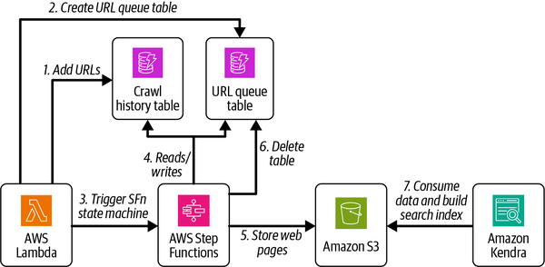

# System Design On AWS Building And Scaling Enterprise Solutions Knowledge

**Document Name:** System Design on AWS

**Author:** Jayanth Kumar, O'Reilly Media, 2025

**Domain:** System design, distributed systems, AWS architecture, cloud platform engineering, scalability, reliability, data architecture, messaging, networking, and production operations.

**How to Use:** Use this file as a system design and AWS architecture study guide. Start with the mental models, then study the deep concepts, then use the decision guides and playbooks when reviewing or designing real systems.

## 1. Learning Roadmap

Study the book as three connected layers rather than as a list of AWS services.

1. **Distributed-system fundamentals:** Begin with communication, consistency, availability, reliability, scalability, maintainability, fault tolerance, storage models, caching, load balancing, networking, containers, and architectural patterns. These concepts decide whether an AWS service is a good fit.
2. **AWS service mapping:** Then map those fundamentals to AWS networking, storage, compute, messaging, orchestration, monitoring, access management, analytics, and machine learning services. Do not memorize services first; understand the engineering problem each service solves.
3. **System design use cases:** Finally, study the use-case chapters as repeatable design drills: URL shortener, crawler/search, social network/newsfeed, leaderboard, hotel reservation, chat, video processing, and stock trading. These chapters show the same core choices under different scale, latency, consistency, reliability, and cost constraints.

Foundational topics:

- Synchronous versus asynchronous communication.
- Strong, monotonic, causal, weak, and eventual consistency.
- Availability math and the difference between sequential and parallel dependencies.
- Partitioning, sharding, replication, indexing, denormalization, and query federation.
- Cache eviction policies and read/write caching strategies.
- Load-balancer placement, L4 versus L7 routing, stateful versus stateless balancing.
- Network protocols and API styles: HTTP, WebSockets, SSE, RPC, REST, GraphQL, MQTT, WebRTC.
- Deployment and operations: containers, orchestration, CI/CD, monitoring, incident management.

Advanced topics:

- CAP and PACELC tradeoffs for distributed data systems.
- Database selection across relational, key-value, document, columnar, graph, time-series, and search engines.
- Event-driven architecture, CQRS, saga, orchestration, choreography, retry/backoff, circuit breaker, and rate limiting.
- VPC design, hybrid connectivity, private connectivity, CDN placement, API Gateway, and edge routing.
- Multi-region designs, traffic replication, migration, and regional failover.
- Low-latency systems such as chat, live stock tick delivery, and order execution.

Fast path:

- Read `Core Mental Models`, `Architecture Decision Guide`, and `Quick Reference`.
- For AWS implementation, read `Technology Mapping`.
- For interviews or design reviews, study `System Design Playbooks` and the chapter extraction for Chapters 14-21.
- For production work, use `Applying This Knowledge To Existing Systems`, `Operating, Troubleshooting, And Debugging`, and `Production Readiness And Delivery Checklist`.

After studying, a reader should be able to:

- Explain why a design uses synchronous calls, queues, streams, caches, replicas, indexes, shards, or CDNs.
- Choose AWS services based on workload behavior rather than brand familiarity.
- Design a Day 0 architecture, identify its scaling pressure, and evolve it toward Day N.
- Review an existing system for reliability, scalability, security, observability, cost, and migration risk.
- Argue tradeoffs clearly in an architecture review.

## 2. Core Mental Models

| Mental Model | Explanation | Helps Solve | Example | Common Misuse |
|---|---|---|---|---|
| Requirements drive architecture | Functional requirements define behavior; nonfunctional requirements define constraints such as latency, availability, durability, consistency, cost, and scale. | Prevents service-first design. | A URL shortener can start with a simple web tier and database, but the NFRs decide if it needs caching, a key-generation service, multi-AZ failover, and analytics. | Picking DynamoDB, Kafka, or Kubernetes before clarifying access patterns and failure tolerance. |
| Every distributed system pays for coordination | Strong consistency, synchronous replication, consensus, locks, and ordered execution reduce ambiguity but add latency and failure coupling. | Explains why high-consistency systems are harder to scale globally. | A stock trading order system needs stronger consistency than a newsfeed like counter. | Treating eventual consistency as always better because it scales, or strong consistency as always safer without accounting for latency. |
| Availability depends on dependency shape | Sequential dependencies multiply failure probability; parallel alternatives can improve availability. | Helps redesign critical paths. | A request path that must call auth, inventory, payment, and notification synchronously has worse availability than one that commits the order and sends notifications asynchronously. | Adding redundant components but leaving a single shared database, queue, IAM dependency, or NAT gateway on the critical path. |
| Scale is not one dimension | A workload can be read-heavy, write-heavy, connection-heavy, storage-heavy, latency-sensitive, bursty, geographically distributed, or consistency-sensitive. | Drives data model and service selection. | Leaderboards need sorted ranking and fast top-N reads; video pipelines need large-object storage and asynchronous processing; chat needs persistent connections and fanout. | Saying "the system must scale" without naming the bottleneck. |
| Day 0 and Day N architectures should be different | A simple architecture is often right at launch; scaling comes from knowing which pressure will break it first. | Avoids premature complexity while preserving an evolution path. | The book repeatedly starts with a Day 0 design and then adds caching, queues, sharding, CDN, multi-region, or specialized stores. | Building a complex multi-region event-driven architecture before product requirements are proven. |
| Data model follows access pattern | Storage selection is not just about data shape. It depends on reads, writes, query predicates, ordering, transactions, retention, and consistency. | Prevents database mismatch. | Hotel reservations need strong handling of booking conflicts, while property search needs geospatial and text search. | Using one database for all use cases because it is familiar. |
| Caches are performance tools with correctness risk | Caches reduce latency and database load but introduce invalidation, staleness, hot keys, eviction, and failover concerns. | Helps design read/write paths safely. | Cache-aside works for read-heavy product detail pages; write-through or write-back changes durability and latency behavior. | Adding Redis without defining TTLs, invalidation rules, source of truth, and failure behavior. |
| Asynchrony absorbs spikes but shifts complexity | Queues and streams decouple producers and consumers, smooth bursts, and improve resilience, but create ordering, replay, idempotency, poison message, and observability needs. | Helps evaluate event-driven architecture. | Web crawler URL frontier, video encoding pipeline, and stock tick fanout all rely on asynchronous processing. | Assuming a queue makes a system reliable without retry, dead-letter, deduplication, and monitoring design. |
| AWS services are managed implementations of system design patterns | Services such as ELB, S3, DynamoDB, RDS, ECS, EKS, Kinesis, Step Functions, CloudWatch, API Gateway, CloudFront, and Transit Gateway map to known architecture problems. | Helps engineers reason beyond service names. | CloudFront implements edge caching and distribution; Step Functions implements managed workflow orchestration; Kinesis implements ordered stream processing. | Treating managed services as magic boxes with no limits, failure modes, cost model, or operational responsibility. |
| Migration is a system design problem | Moving from Day 0 to Day N requires traffic replication, compatibility, observability, rollback, data migration, and phased rollout. | Reduces high-risk rewrites. | The social network chapter discusses traffic replication and migration toward a Day N architecture. | Replacing the old system in one cutover without proving behavior under mirrored production traffic. |

## 3. Deep Concept Notes

### Communication: Synchronous And Asynchronous

- **Explanation:** Synchronous communication blocks the caller until the callee returns. Asynchronous communication lets the caller continue while work is processed later through callbacks, messages, streams, or workflow state transitions.
- **Problem solved:** Systems need to compose work across services without making every dependency part of the user-visible latency path.
- **How it works:** In synchronous communication, the sender and receiver are coupled in time. In asynchronous communication, the sender records intent, publishes a message, or starts a workflow, and a consumer processes it independently.
- **Why it matters:** Synchronous calls are simpler for request/response interactions but amplify latency and availability problems. Asynchronous flows improve resilience and burst handling but require idempotency, retries, ordering rules, and user-visible status models.
- **When to use:** Use synchronous communication for interactive reads, immediate validation, authentication, and operations where the user cannot proceed without the result. Use asynchronous communication for long-running jobs, fanout, batch work, workflows, notifications, analytics, and pipelines.
- **When not to use:** Do not make slow or unreliable downstream calls synchronous unless the business action cannot complete without them. Do not make everything asynchronous if users need immediate consistency or clear errors.
- **Tradeoffs:** Synchronous systems are easier to reason about but more fragile under dependency failures. Asynchronous systems improve decoupling but complicate debugging and correctness.
- **Common mistakes:** Hiding a long workflow behind an HTTP request timeout; publishing events without idempotency; using asynchronous processing but failing to expose job status; mixing synchronous writes with asynchronous side effects without a reconciliation path.
- **Production example:** A video upload API should synchronously authenticate the user and store upload metadata, then asynchronously transcode, validate, index, and distribute video variants.
- **Questions to ask:** What is the user waiting for? Can the operation be retried safely? What is the source of truth for status? What happens if the consumer is down? How are duplicate messages handled?

**Figure: Synchronous versus asynchronous communication.** This diagram shows that a synchronous caller waits for the receiver, while an asynchronous sender can continue after handing off work.

**How to read it:** Follow the request arrows and notice where control returns to the caller. The synchronous path keeps the caller blocked; the asynchronous path creates a temporal gap between request submission and completion.

**Why it matters:** This is one of the most important design levers in the book. It determines latency, coupling, failure propagation, retry design, and user experience.

**How to apply it:** Put only truly interactive work in the synchronous path. For workflows, persist the request first, enqueue or start a workflow, and expose status, retry, and compensation behavior.

**Limitations:** The diagram shows sequencing, not operational obligations. A production asynchronous design still needs durable messaging, deduplication, backpressure, dead-letter handling, and trace correlation.

### Consistency Spectrum

- **Explanation:** Consistency describes what reads are allowed to observe after writes. The book covers strong consistency, monotonic reads, monotonic writes, causal consistency, weak consistency, and eventual consistency.
- **Problem solved:** Distributed systems must decide whether reads can return stale data and whether replicas must coordinate before acknowledging writes.
- **How it works:** Strong consistency coordinates replicas before serving reads or acknowledging writes. Eventual consistency allows replicas to diverge temporarily and converge later. Causal consistency preserves ordering for related operations.
- **Why it matters:** Consistency choices affect correctness, latency, availability, user trust, and operational complexity.
- **When to use:** Use strong consistency for money movement, inventory decrement, booking confirmation, order execution, identity/security state, and any operation where stale reads cause harm. Use eventual consistency for feeds, counters, analytics, recommendations, and indexes where temporary lag is acceptable.
- **When not to use:** Avoid strict consistency for large global fanout or user-visible derived views when the business only needs convergence.
- **Tradeoffs:** Strong consistency increases coordination and failure coupling. Eventual consistency improves availability and write throughput but requires conflict handling, reconciliation, and UX tolerance.
- **Common mistakes:** Saying "eventual consistency" without defining acceptable lag; using caches or search indexes as if they are strongly consistent; failing to isolate strongly consistent core state from eventually consistent projections.
- **Production example:** A hotel booking system can maintain reservation state in a strongly consistent store while updating search indexes and review aggregates asynchronously.
- **Questions to ask:** What stale data can users tolerate? Can conflicting writes occur? What is the reconciliation rule? Which read path is authoritative?

**Figure: Strong consistency and eventual consistency.** The diagram contrasts a read that waits for replicated state with a read that may temporarily return an older value.

**How to read it:** Focus on when the read occurs relative to replication. In the strong path, the read does not return stale state. In the eventual path, a replica can answer before convergence.

**Why it matters:** This is the core reason different data stores and architectures exist. The "right" answer depends on the business invariant, not on database fashion.

**How to apply it:** Separate command state from projection state. Keep high-integrity writes in a store and workflow that supports required consistency, then feed caches, search, streams, and analytics asynchronously.

**Limitations:** Real systems may expose multiple consistency modes, read-your-write guarantees, quorum settings, or transaction scopes that are not captured by the simple diagram.

### Availability, Reliability, And Fault Tolerance

- **Explanation:** Availability measures whether a system can respond when needed. Reliability measures whether it performs correctly over time. Fault tolerance is the ability to continue operating despite component failures.
- **Problem solved:** Modern systems run on unreliable networks, hardware, software dependencies, and human operations.
- **How it works:** Availability is improved through redundancy, failover, load balancing, self-healing, parallel alternatives, and operational monitoring. Reliability is improved through durable writes, tested recovery, clear ownership, and reduced failure modes.
- **Why it matters:** Availability targets such as three, four, or five nines imply very different downtime budgets and operational investment.
- **When to use:** Use high-availability design for revenue-critical, safety-critical, customer-critical, and low-latency systems. Use simpler designs for internal or low-criticality workloads where cost and simplicity matter more.
- **When not to use:** Do not chase maximum availability if dependencies, staffing, runbooks, and recovery practices cannot support it.
- **Tradeoffs:** More redundancy often increases cost, complexity, and risk of split-brain or inconsistent state. Active-active improves utilization but complicates data consistency and routing. Active-passive is simpler but may increase recovery time and idle cost.
- **Common mistakes:** Counting only compute availability and ignoring databases, queues, DNS, IAM, NAT, third-party APIs, and deployment pipelines; assuming multi-AZ means the application is fault tolerant; failing to test failover.
- **Production example:** A stock trading platform needs durable order state, redundant connectivity, and tested failover because message loss or duplicate execution is unacceptable.
- **Questions to ask:** What is the downtime budget? What dependencies are sequential? Which failures are acceptable? What is the recovery point objective? What is the recovery time objective?

**Figure: Active-active versus active-passive failover.** The visual compares two high-availability patterns: all nodes serving traffic versus one active node with standby capacity.

**How to read it:** Active-active routes traffic to multiple live systems; active-passive keeps a backup ready to take over.

**Why it matters:** The failover pattern changes cost, utilization, complexity, write routing, data replication, and incident response.

**How to apply it:** Use active-active when you need better utilization and can handle routing and data consistency. Use active-passive when simpler operations and controlled failover matter more than full resource utilization.

**Limitations:** The diagram does not capture DNS propagation, health check behavior, connection draining, split-brain prevention, or database failover mechanics.

### CAP And PACELC

- **Explanation:** CAP frames the tradeoff among consistency, availability, and partition tolerance during network partitions. PACELC extends this by asking: if there is a partition, choose availability or consistency; else, choose latency or consistency.
- **Problem solved:** Distributed storage and service architectures must behave predictably when network partitions, replication delays, and coordination costs occur.
- **How it works:** During a partition, a distributed system cannot both guarantee all requests succeed and all nodes remain strongly consistent. Outside partitions, stricter consistency still costs latency because replicas must coordinate.
- **Why it matters:** PACELC is often more operationally useful than a simplistic CAP discussion because most systems spend more time in the "else" case than in a partition.
- **When to use:** Use these models when selecting databases, replication modes, cross-region strategies, cache behavior, and user-visible consistency.
- **When not to use:** Do not use CAP as a slogan to avoid precise requirements. Many systems offer scoped transactions, quorum reads/writes, leader-based writes, or tunable consistency.
- **Tradeoffs:** Choosing availability under partition can create divergent state; choosing consistency can reject or delay requests. Choosing lower latency in normal operation can expose stale reads; choosing consistency can increase tail latency.
- **Common mistakes:** Declaring a product "CP" or "AP" without naming the operation and failure mode; ignoring the latency-versus-consistency tradeoff when there is no partition.
- **Production example:** A leaderboard can accept eventual rank convergence; an order execution workflow cannot accept ambiguous duplicate orders.
- **Questions to ask:** What is the invariant? Which requests may fail under partition? What staleness is allowed during normal operation? What reconciliation process exists?

**Figure: PACELC decision flow.** The visual teaches that consistency decisions apply both during partitions and during normal operation.

**How to read it:** Start with whether a partition exists. Under partition, evaluate availability versus consistency. Else, evaluate latency versus consistency.

**Why it matters:** It prevents a common design-review mistake: discussing only rare partitions while ignoring everyday latency costs of coordination.

**How to apply it:** For each critical operation, write down the partition behavior and the normal-operation latency/consistency choice. Put this in the ADR for storage and replication decisions.

**Limitations:** PACELC is a conceptual model. Actual products have narrower guarantees, configuration-dependent behavior, and operational limits that must be validated.

### Storage Types And Relational Data

- **Explanation:** The book distinguishes file, block, and object storage, then builds into relational database concepts: SQL, ACID, ER modeling, normalization, keys, indexes, query tuning, denormalization, partitioning, sharding, and replication.
- **Problem solved:** Systems need durable data storage with access patterns ranging from file sharing to transactional records to large immutable objects.
- **How it works:** File storage presents hierarchical files; block storage presents low-level blocks to attached compute; object storage stores objects with metadata and keys. Relational databases organize records into tables with schemas, constraints, indexes, and transactions.
- **Why it matters:** Storage shape determines latency, durability, query capability, consistency, scalability, and operational responsibility.
- **When to use:** Use relational databases for transactional records, well-defined schemas, constraints, joins, and ACID requirements. Use object storage for large blobs, media, logs, backups, static assets, and data lakes. Use file storage when shared POSIX-like access is required. Use block storage for low-latency volumes attached to compute.
- **When not to use:** Avoid relational stores for unbounded flexible documents or massive key-value workloads without careful partitioning. Avoid object storage when you need low-latency mutable row updates.
- **Tradeoffs:** Normalization improves integrity but can increase join cost. Denormalization improves reads but complicates writes. Sharding improves scale but complicates transactions and rebalancing.
- **Common mistakes:** Adding indexes without measuring write overhead; denormalizing without update consistency rules; sharding before understanding access patterns; storing large media in relational columns instead of object storage.
- **Production example:** A hotel reservation system can store booking state in an ACID database and property images in object storage, while search projections live in a search engine.
- **Questions to ask:** What are the core entities? Which invariants require transactions? What are the hottest queries? Can data be partitioned by tenant, user, property, or time?

**Figure: File, block, and object storage.** This diagram separates three storage abstractions that are often confused in cloud design.

**How to read it:** File storage exposes paths and folders, block storage exposes volumes/blocks, and object storage exposes objects addressed by keys.

**Why it matters:** Choosing the wrong abstraction creates unnecessary latency, cost, operational work, or application complexity.

**How to apply it:** Map workload behavior before selecting a service. A media pipeline should treat raw and encoded videos as objects; a database needs block-like persistent volumes or a managed database; shared workloads may need file semantics.

**Limitations:** Managed cloud services add durability, replication, and feature behavior beyond this abstraction-level picture.

### NoSQL Data Models And Database Selection

- **Explanation:** Nonrelational stores trade relational constraints for schema flexibility, horizontal scale, availability, and workload-specific data models. The book covers key-value, document, columnar, and graph stores.
- **Problem solved:** Many large systems need high-volume reads/writes, flexible documents, graph traversal, or time-series/columnar access patterns that do not fit a single relational schema.
- **How it works:** Key-value stores retrieve values by key. Document stores index flexible JSON-like documents. Columnar stores organize data by columns or wide rows for scalable writes and analytical or sparse access. Graph stores model relationships as nodes and edges.
- **Why it matters:** Data model mismatch is one of the fastest ways to create expensive, slow, or unmaintainable systems.
- **When to use:** Use key-value for session state, cache-like records, lookup tables, and high-scale simple access. Use document databases for flexible nested records. Use columnar/wide-column stores for high-write distributed workloads. Use graph databases for relationship traversal.
- **When not to use:** Avoid NoSQL when you need multi-entity ACID transactions, ad hoc joins, or strict relational constraints unless the chosen service explicitly supports the needed guarantees.
- **Tradeoffs:** Flexibility shifts integrity into application code. Horizontal scale often comes with query restrictions, denormalization, eventual consistency, and partition-key pressure.
- **Common mistakes:** Choosing NoSQL to avoid schema design; using a poor partition key; expecting arbitrary joins; using a search index as the source of truth; ignoring consistency settings.
- **Production example:** A social network may use DynamoDB for high-volume timeline or connection data, OpenSearch for search, and a relational store for account or transactional data.
- **Questions to ask:** What is the partition key? What queries must be served without scans? What write conflicts can happen? What consistency does the user flow require?

**Figure: Database selection flow.** The visual turns workload requirements into database-family choices.

**How to read it:** Start from the dominant data shape and access pattern, then evaluate consistency, scalability, query, and relationship needs.

**Why it matters:** It captures the source's main storage lesson: database choice should follow access pattern and correctness needs.

**How to apply it:** Use it as a design review prompt, not a mechanical answer. For each candidate store, validate partitioning, query support, transactions, backup/restore, security, cost, and operational skills.

**Limitations:** The flowchart is a simplification. Modern managed databases overlap categories, and current AWS feature sets must be verified.

### Caching Policies And Strategies

- **Explanation:** Caching stores frequently used or expensive-to-compute data closer to consumers. The book covers eviction policies, cache-aside, read-through, refresh-ahead, write-through, write-around, write-back, in-process, interprocess, remote caches, CDNs, Memcached, and Redis.
- **Problem solved:** Databases and services can become latency or throughput bottlenecks. Caches reduce repeated work and absorb read traffic.
- **How it works:** A cache checks whether data is present. On hit, it returns quickly. On miss, it retrieves from the source of truth, may populate the cache, and returns the result. Write strategies decide whether the cache and source of truth are updated synchronously or asynchronously.
- **Why it matters:** Caches can make systems fast but can also serve stale, missing, or inconsistent data.
- **When to use:** Use caching for read-heavy, expensive, repeated, or geographically distributed content. Use CDNs for static and cacheable edge content. Use distributed caches for shared application data.
- **When not to use:** Avoid caching highly volatile, security-sensitive, personalized, or strongly consistent data unless invalidation and isolation are explicit.
- **Tradeoffs:** Cache-aside is simple but has cache-miss latency. Read-through centralizes loading but couples cache to data access. Write-through improves read consistency at write latency cost. Write-back improves write latency but risks data loss if not durable.
- **Common mistakes:** Missing TTLs; no invalidation plan; caching negative/authorization-sensitive responses incorrectly; hot keys; cache stampede; using cache as the only state store accidentally.
- **Production example:** A URL shortener can cache short-code lookups at the edge and application cache, while keeping the mapping in a durable database.
- **Questions to ask:** What is the source of truth? What staleness is acceptable? How are writes invalidated? What happens when the cache is cold or down? How is cache effectiveness measured?

**Figure: Caching strategies.** The diagram groups read and write cache patterns and their placement in the request path.

**How to read it:** Compare whether the application or cache owns data loading and whether writes reach the database immediately.

**Why it matters:** Cache strategy is a correctness decision, not just a performance optimization.

**How to apply it:** Pick the simplest strategy that satisfies the freshness requirement. Document cache keys, TTLs, invalidation triggers, write semantics, warmup behavior, and fallback behavior.

**Limitations:** The diagram does not cover cache stampede protection, distributed locking, key cardinality, memory pressure, or multi-region cache behavior.

### Load Balancing And Traffic Distribution

- **Explanation:** Load balancing distributes requests across resources. The book covers global and local load balancing, static and dynamic algorithms, stateful and stateless load balancers, DNS load balancers, ECMP routers, L4/L7 load balancers, API gateways, and proxies.
- **Problem solved:** Systems need to spread traffic, avoid overloaded instances, route around failures, and expose stable endpoints.
- **How it works:** A load balancer receives traffic, applies health checks and routing rules, and forwards traffic to targets. L4 load balancers route by transport-level information; L7 load balancers route by application-level data such as HTTP headers and paths.
- **Why it matters:** Traffic distribution controls availability, scaling, fault isolation, latency, deployment safety, and security boundaries.
- **When to use:** Use load balancers for stateless web/application tiers, multi-AZ services, blue/green deployment, path-based routing, TLS termination, and health-based failover.
- **When not to use:** Avoid stateful load balancing unless session affinity is necessary and failure behavior is understood.
- **Tradeoffs:** L4 is fast and protocol-oriented. L7 is richer but adds processing overhead. Stateful balancing simplifies session handling but reduces failure resilience.
- **Common mistakes:** Missing health checks; using sticky sessions to hide stateful application design; no connection draining; no per-target observability; placing all traffic through a single regional bottleneck.
- **Production example:** A three-tier architecture may use an external application load balancer for web traffic and internal load balancers between application and service tiers.
- **Questions to ask:** Is the backend stateless? What health check proves correctness? How are long-lived connections drained? Where is TLS terminated? How are deployments rolled back?

### Networking And API Protocols

- **Explanation:** The book connects OSI/TCP-IP foundations with application protocols and API styles: TCP, UDP, HTTP, SMTP, XMPP, MQTT, polling, WebSockets, Server-Sent Events, RPC, REST, GraphQL, and WebRTC.
- **Problem solved:** Systems need different communication patterns for request/response, streaming, real-time messaging, pub/sub, peer media, and query aggregation.
- **How it works:** TCP provides ordered reliable streams; UDP avoids connection overhead and suits latency-sensitive or custom reliability protocols. HTTP supports standard web request/response. WebSockets keep bidirectional persistent connections. SSE pushes server-to-client events. GraphQL lets clients request shaped data. WebRTC enables peer media/data communication with NAT traversal help.
- **Why it matters:** Protocol choice affects latency, infrastructure compatibility, connection management, observability, retries, security, and scaling model.
- **When to use:** Use HTTP/REST for common resource APIs, GraphQL for client-driven aggregation, WebSockets for bidirectional low-latency interaction, SSE for one-way server updates, MQTT for lightweight pub/sub, and WebRTC for real-time media.
- **When not to use:** Avoid persistent connections for simple request/response APIs. Avoid GraphQL if it hides expensive query behavior without complexity controls.
- **Tradeoffs:** Richer protocols shift complexity to connection management, authorization, rate limiting, and observability.
- **Common mistakes:** Polling too frequently; putting durable workflow semantics into a socket connection; failing to authenticate connection upgrades; ignoring backpressure.
- **Production example:** Chat systems use persistent connections for message delivery, while stock tick systems use streaming delivery and lightweight server-side connection tables.
- **Questions to ask:** Is communication one-way or two-way? Is ordering required? What is the fanout pattern? How many concurrent connections are expected? How are slow clients handled?

### Containers, Orchestration, And Deployment

- **Explanation:** Containerization packages application code and dependencies into portable images. Orchestration schedules, scales, heals, and networks containers. The book discusses Docker, images, registries, containers, Docker engine/runtime, Kubernetes architecture, deployment strategies, Gitflow, CI, CD, monitoring, and incident management.
- **Problem solved:** Teams need repeatable deployment units and a platform to run many services reliably.
- **How it works:** Developers build images from Dockerfiles, push them to registries, and run containers on hosts or clusters. Orchestrators maintain desired state, restart failed containers, scale replicas, and expose services.
- **Why it matters:** Container and deployment design determines operability, rollback, isolation, resource control, and team delivery speed.
- **When to use:** Use containers for microservices, worker fleets, portable workloads, and consistent deployment. Use orchestration when workloads need service discovery, scaling, rollout, and self-healing.
- **When not to use:** Avoid Kubernetes for small workloads when simpler managed compute or serverless services meet requirements.
- **Tradeoffs:** Orchestration improves platform control but adds operational complexity. Serverless or managed services reduce operations but constrain runtime control.
- **Common mistakes:** Mutable containers; unpinned dependencies; no health probes; no resource limits; no rollback strategy; using Gitflow mechanically without deployment automation.
- **Production example:** A crawler can run fetcher, parser, frontier, and indexing workers as independently scaled container services.
- **Questions to ask:** What is the deployment unit? How are secrets injected? What health checks matter? How are rollbacks performed? What metrics drive autoscaling?

### Event-Driven Architecture And Distributed Patterns

- **Explanation:** Event-driven architecture uses events, queues, streams, brokers, and consumers to decouple services. The book covers message brokers, queues, choreography, orchestration, Lambda/Kappa/data lake architectures, monoliths, N-tier, microservices, event sourcing, CQRS, saga, circuit breaker, retry with backoff, rate limiter, DDD, and API routing patterns.
- **Problem solved:** Complex systems need to coordinate work across services without synchronous coupling everywhere.
- **How it works:** Producers emit events or commands to a broker or stream. Consumers process independently. Orchestrated workflows centralize state transitions; choreographed workflows let services react to events. CQRS separates write models from read models. Sagas coordinate distributed transactions through steps and compensations.
- **Why it matters:** These patterns shape failure handling, data ownership, consistency, team boundaries, and observability.
- **When to use:** Use event-driven designs for workflows, pipelines, cross-service integration, fanout, audit logs, and read-model projections. Use orchestration for visible business processes that need state and compensation. Use choreography for simple event reactions with low central coordination.
- **When not to use:** Avoid microservices and event sourcing when a modular monolith or relational transaction is enough.
- **Tradeoffs:** Event-driven systems increase decoupling but make debugging, ordering, idempotency, and schema evolution harder.
- **Common mistakes:** Treating events as database tables; no event versioning; unclear service ownership; distributed transactions without compensation; infinite retries; no dead-letter handling.
- **Production example:** A hotel booking flow can use a saga to reserve inventory, preauthorize payment, confirm booking, and compensate on failure.
- **Questions to ask:** Who owns the state? Is the event a fact or a command? What is the retry policy? What compensating actions exist? Can events be replayed?

**Figure: Kafka architecture.** This diagram shows Kafka as a distributed messaging backbone with producers, brokers, topics/partitions, and consumers.

**How to read it:** Follow events from producers into partitioned topics and then to independent consumers.

**Why it matters:** Kafka-like streams are central to the source's crawler, search, stock tick, chat, analytics, and pipeline examples because they decouple ingestion from downstream processing.

**How to apply it:** Partition by a key that preserves required ordering and balances load. Define retention, replay, consumer lag alerts, schema compatibility, and poison-message handling.

**Limitations:** Kafka does not automatically solve business idempotency, event schema design, exactly-once semantics across external systems, or consumer correctness.

### AWS Networking

- **Explanation:** AWS networking services implement isolation, routing, connectivity, DNS, traffic distribution, edge delivery, and private/hybrid integration. The book covers Regions, Availability Zones, Local Zones, Edge Locations, VPC, IP addressing, subnets, route tables, security groups, NACLs, internet gateway, NAT gateway, VPC peering, Transit Gateway, PrivateLink, VPN, Direct Connect, Route 53, ELB, API Gateway, and CloudFront.
- **Problem solved:** Cloud systems need controlled connectivity between public users, private workloads, AWS services, multiple VPCs, and on-premises networks.
- **How it works:** A VPC defines a logically isolated network. Subnets divide address ranges across AZs. Route tables decide where traffic goes. Security groups and NACLs filter traffic. Gateways and endpoints connect the VPC to the internet, other VPCs, AWS services, or on-premises environments.
- **Why it matters:** Network design affects security, blast radius, latency, availability, cost, and operational debuggability.
- **When to use:** Use multiple AZ subnets for high availability, private subnets for internal workloads, VPC endpoints or PrivateLink for private service access, Transit Gateway for hub-and-spoke multi-VPC connectivity, and Direct Connect for predictable hybrid bandwidth.
- **When not to use:** Avoid flat networks with broad security group rules. Avoid VPC peering meshes when connectivity relationships become many-to-many and hard to operate.
- **Tradeoffs:** More network segmentation improves isolation but complicates routing and operations. Private connectivity improves security but adds endpoint, DNS, and policy complexity.
- **Common mistakes:** Overlapping CIDRs; no subnet capacity planning; public subnets for private workloads; single NAT gateway bottlenecks; confusing security groups and NACLs; missing route table propagation.
- **Production example:** A hotel reservation platform may expose CloudFront/API Gateway public edges, keep compute in private subnets, use VPC endpoints for AWS services, and connect internal systems through Transit Gateway.
- **Questions to ask:** What must be public? What must be private? What CIDR plan allows growth? Which dependencies cross VPC/account/region boundaries? How is traffic inspected and logged?

**Figure: AWS networking components.** This diagram summarizes core building blocks for VPC-based network design.

**How to read it:** Identify the boundary of the VPC, then trace how subnets, route tables, gateways, and security controls shape traffic flow.

**Why it matters:** Many application failures look like application bugs but are actually routing, DNS, subnet, security group, endpoint, or gateway misconfigurations.

**How to apply it:** Draw the network before implementation. Mark public and private paths, ingress and egress, AZ placement, endpoint use, and security boundaries.

**Limitations:** The diagram is conceptual. Actual production networks need account strategy, IAM policy, DNS behavior, logging, inspection, quotas, and cost validation.

### AWS Storage And Data Services

- **Explanation:** AWS storage and data services map storage patterns to managed offerings: EBS, EFS, S3, RDS, DynamoDB, DocumentDB, Neptune, ElastiCache, DAX, OpenSearch, Timestream, Keyspaces, Redshift, Glue, Athena, EMR, QuickSight, SageMaker, and ML services.
- **Problem solved:** Systems need durable, scalable, secure, and cost-aware storage options for transactional data, key-value access, documents, graphs, search, time series, analytics, and machine learning.
- **How it works:** Managed services expose specialized APIs and operational models. Some are strongly relational, some are partitioned key-value/document stores, some are indexes or analytical engines, and some are caches.
- **Why it matters:** Managed services reduce undifferentiated operations but require correct workload fit, capacity design, IAM, encryption, backup/restore, monitoring, and cost controls.
- **When to use:** Use RDS/Aurora for relational transactional workloads. Use DynamoDB for high-scale key-value and document-like access with known keys. Use S3 for objects and data lake storage. Use OpenSearch for search. Use Timestream for time-series. Use ElastiCache/DAX for low-latency caching. Use Redshift/Athena/Glue/EMR for analytics pipelines depending on scale and operations.
- **When not to use:** Avoid using a cache as a primary store without durability design. Avoid using OpenSearch as the source of truth for transactional state. Avoid DynamoDB when access patterns require unbounded ad hoc queries.
- **Tradeoffs:** Managed services shift operations to AWS but do not remove data modeling, cost, security, and failure-mode responsibility.
- **Common mistakes:** Weak partition key design; missing lifecycle policies; no backup/restore tests; treating eventual indexes as authoritative; failing to model hot partitions or read/write capacity.
- **Production example:** A stock platform can use Redis for live stock price cache, Timestream for historical ticks, and an ACID database for orders.
- **Questions to ask:** Is the data authoritative or derived? What are read and write keys? What retention is needed? How is the data encrypted? How will restore be tested?

**Figure: DynamoDB internal architecture.** The visual represents DynamoDB as a partitioned, managed NoSQL system.

**How to read it:** Look for request routing into partitions and replication behavior rather than assuming a single database node.

**Why it matters:** DynamoDB design quality depends heavily on partition keys, access patterns, capacity, indexes, and item size.

**How to apply it:** Model tables from queries. Use partition keys that spread load, add sort keys for ordered access, and design global/local secondary indexes only for required access patterns.

**Limitations:** The diagram does not replace current DynamoDB documentation for limits, consistency modes, transactions, streams, global tables, or capacity behavior.

### AWS Compute, Messaging, Workflow, Monitoring, And Identity

- **Explanation:** AWS compute services include EC2, AMIs, instance types, Auto Scaling, ECS, and EKS. Messaging and integration services include Kinesis, Step Functions, Managed Workflows for Apache Airflow, CloudWatch, IAM, Cognito, and AppSync.
- **Problem solved:** Systems need compute placement, scaling, deployment, stream ingestion, workflow orchestration, monitoring, authorization, authentication, and API integration.
- **How it works:** EC2 provides VM-level control. Auto Scaling adjusts capacity. ECS and EKS run containers. Kinesis ingests ordered streams. Step Functions manages workflow state. CloudWatch collects logs, metrics, alarms, and events. IAM controls access. Cognito supports user authentication. AppSync provides managed GraphQL integration.
- **Why it matters:** These services define runtime operability: how work starts, scales, fails, emits telemetry, and is authorized.
- **When to use:** Use EC2 when you need OS/runtime control. Use ECS for managed container orchestration with AWS-native operations. Use EKS when Kubernetes ecosystem compatibility is required. Use Step Functions for explicit workflows. Use Kinesis for streaming ingestion. Use CloudWatch for operational visibility. Use IAM least privilege everywhere.
- **When not to use:** Avoid EKS if the team does not need Kubernetes capabilities. Avoid Step Functions for simple one-step processing. Avoid broad IAM policies to make development easier.
- **Tradeoffs:** Higher abstraction reduces management but may constrain runtime control. Lower abstraction gives flexibility but increases operations.
- **Common mistakes:** Scaling compute without scaling dependencies; no cooldown or target tracking validation; logs without correlation IDs; alarms that do not represent user impact; IAM wildcard permissions.
- **Production example:** A video pipeline can use S3 upload events, Step Functions orchestration, containerized transcoding workers, CloudWatch alarms, and CloudFront distribution.
- **Questions to ask:** What unit scales? What metric triggers scale-out? What workflow state must be durable? What permissions are minimal? What telemetry proves health?

**Figure: Autoscaling.** The diagram shows capacity adjustment based on demand and scaling policy.

**How to read it:** Watch the feedback loop: metric changes lead to scaling actions that add or remove capacity.

**Why it matters:** Autoscaling is not just adding instances. It is a control system that can oscillate, underreact, overreact, or expose dependency bottlenecks.

**How to apply it:** Choose metrics tied to saturation or demand, define cooldowns, test scale-out and scale-in, and verify downstream systems can handle new capacity.

**Limitations:** Autoscaling does not fix bad algorithms, hot partitions, database connection storms, slow startup, or regional capacity constraints.

**Figure: AppSync with multiple data sources.** The visual shows GraphQL as an integration layer over different backends.

**How to read it:** Client queries arrive at AppSync and are resolved against multiple data sources.

**Why it matters:** API aggregation can simplify client development but can also hide backend cost, authorization boundaries, and consistency differences.

**How to apply it:** Use AppSync or GraphQL when clients need shaped data from multiple sources. Add resolver-level authorization, complexity controls, caching, tracing, and clear ownership for each data source.

**Limitations:** GraphQL does not remove the need for service boundaries, data ownership, query cost protection, or backend consistency design.

## 4. Implementation Patterns And Engineering Practices

### Requirements-First Design Workflow

- **Problem it solves:** Prevents architecture from being chosen before the workload is understood.
- **Implementation shape:** Capture functional requirements, nonfunctional requirements, constraints, scale assumptions, primary entities, critical paths, and user journeys. Convert these into data access patterns and service boundaries.
- **Scenario:** For a URL shortener, clarify custom domains, expiration, analytics, read/write ratio, redirection latency, availability target, abuse handling, and expected number of links before choosing hash or counter-based key generation.
- **Tradeoffs and failure modes:** Overly detailed requirements can slow early delivery, but vague requirements produce wrong storage and scaling decisions.
- **Validation:** Review whether every service, database, cache, queue, and network boundary traces back to a requirement.
- **Adaptation:** Use a short design doc for small systems and a full ADR set for high-risk systems.

### Day 0 To Day N Evolution

- **Problem it solves:** Launch architectures need simplicity, while mature systems need scale, resilience, and operational depth.
- **Implementation shape:** Build an MVP architecture with clear extension points. Instrument it. Identify first bottlenecks. Evolve incrementally with caches, queues, read replicas, sharding, CDN, asynchronous workflows, and multi-region deployment.
- **Scenario:** A leaderboard starts with API, application service, database, cache, and queue. At higher scale it separates score submission, ranking, retrieval, Redis scaling, and storage partitioning.
- **Tradeoffs and failure modes:** Premature Day N complexity slows product learning; lack of evolution path creates risky rewrites.
- **Validation:** Load-test the Day 0 design against expected early scale and define trigger metrics for the next architecture stage.
- **Adaptation:** Add "revisit when" clauses to design decisions.

### Data Store Per Access Pattern

- **Problem it solves:** One database rarely serves transactions, search, analytics, cache, time-series, graph, and object storage equally well.
- **Implementation shape:** Classify each data set as authoritative or derived. Use ACID stores for core transactions, search indexes for retrieval, caches for acceleration, streams for propagation, object storage for blobs, time-series stores for timestamped metrics/events, and analytics stores for aggregates.
- **Scenario:** The hotel reservation design separates property onboarding, property search, booking, payment, dynamic pricing, and reviews because each has different read/write and consistency behavior.
- **Tradeoffs and failure modes:** Multiple stores introduce synchronization, schema evolution, backfill, monitoring, and data drift.
- **Validation:** Define source of truth, projection lag, reconciliation jobs, backup/restore, and consistency tests.
- **Adaptation:** Start with fewer stores and split only when an access pattern or NFR proves the need.

### Idempotent Workflow And Message Processing

- **Problem it solves:** Retries, duplicate messages, timeouts, and partial failures are normal in distributed systems.
- **Implementation shape:** Assign stable request IDs or business keys. Persist state transitions. Make consumers detect duplicates. Use outbox/inbox patterns, dead-letter queues, retry with backoff, and compensation.
- **Scenario:** The stock trading chapter notes an internal order reference that maps to the exchange order and supports idempotency so duplicate execution is avoided.
- **Tradeoffs and failure modes:** Idempotency adds storage and state-machine design; skipping it creates duplicate payments, bookings, or orders.
- **Validation:** Inject duplicate messages and timeouts in tests. Verify that repeated requests produce one business effect.
- **Adaptation:** Use idempotency keys for public APIs, event IDs for consumers, and workflow execution IDs for orchestrated steps.

### Projection And Search Index Synchronization

- **Problem it solves:** Search, feed, analytics, and read-optimized views should not block authoritative writes.
- **Implementation shape:** Write to the source of truth, publish change events or CDC records, update derived stores asynchronously, expose freshness metadata when needed.
- **Scenario:** The hotel reservation chapter uses database-to-Elasticsearch change propagation for property search; the crawler/search chapter decouples indexing from query serving.
- **Tradeoffs and failure modes:** Projections can lag, miss updates, or drift. Search results may show stale availability unless checked against booking state before confirmation.
- **Validation:** Monitor event lag, index freshness, failed updates, and reconciliation differences between source and projection.
- **Adaptation:** For critical flows, read projection for discovery and revalidate against authoritative state before committing.

### Cache-Aside With Explicit Freshness

- **Problem it solves:** Reduces database load while keeping application control over cache fill and invalidation.
- **Implementation shape:** On read, check cache. On miss, load from database and populate. On write, update the database and invalidate or update cache based on freshness needs.
- **Scenario:** Short URL redirection can use cache-aside for mapping lookups; profile/newsfeed reads can cache timelines or counts with bounded staleness.
- **Tradeoffs and failure modes:** Cache stampede, stale reads, hot keys, and cold-start latency.
- **Validation:** Track hit ratio, miss latency, eviction rate, hot keys, stale-read incidents, and cache availability impact.
- **Adaptation:** Add request coalescing, TTL jitter, negative caching, prewarming, and fallback behavior as scale grows.

### API Boundary And Integration Pattern Selection

- **Problem it solves:** Different clients and service interactions need different API shapes.
- **Implementation shape:** Use REST/resource APIs for stable request/response resources, GraphQL for client-shaped aggregation, gRPC/RPC for internal low-latency service calls, WebSockets/SSE for streaming updates, and messaging for asynchronous business events.
- **Scenario:** Chat and stock ticker systems maintain persistent connections; hotel search may expose GraphQL federation; URL creation can use a simple REST API.
- **Tradeoffs and failure modes:** GraphQL can create expensive nested queries; WebSockets create connection-state scaling problems; RPC can tightly couple services.
- **Validation:** Run API contract tests, authorization tests, load tests, and connection-failure tests.
- **Adaptation:** Keep public APIs stable and hide internal service evolution behind versioning or compatibility layers.

### Migration Through Traffic Replication

- **Problem it solves:** Large rewrites are risky if the new system is not tested with real traffic behavior.
- **Implementation shape:** Mirror production reads or requests into the new system without affecting user-visible responses. Compare outputs, latency, errors, and resource usage. Gradually shift traffic with rollback.
- **Scenario:** The social network chapter discusses traffic replication and migration from Day 0 to Day N.
- **Tradeoffs and failure modes:** Mirrored traffic can produce side effects if not isolated; output comparison is hard for nondeterministic systems.
- **Validation:** Ensure the shadow path cannot write externally, compare metrics by route/user cohort, and define rollback triggers.
- **Adaptation:** Use read-only shadowing first, then limited write paths with idempotent safety and feature flags.

## 5. Code, Configuration, And Workflow Notes

The source is architecture-heavy rather than code-heavy. The most reusable practical material is expressed as workflows, state machines, and AWS service composition patterns rather than long code listings.

### URL Shortener Workflow

**Problem solved:** Convert long URLs into short keys and redirect users quickly at high read volume.

**Workflow:**

1. Validate and normalize the long URL.
2. Generate a short key using hashing, counter-based ID, or a key-generation service.
3. Persist `{short_key, long_url, owner, metadata, expiration, custom_domain}` in a durable store.
4. Cache hot mappings.
5. On redirect, resolve the key from cache or database, validate status/expiration, emit analytics asynchronously, and return redirect.

**Common mistakes:** Key collisions, no abuse controls, cache entries outliving expired links, analytics writes in the redirect latency path, no custom-domain routing model.

**Validation:** Collision tests, redirect latency tests, cache hit-ratio monitoring, expiration behavior tests, duplicate/custom-domain tests, and abuse-rate alarms.

### Web Crawler And Search Workflow

**Problem solved:** Discover pages, fetch content, index documents, and serve search queries.

**Workflow:**

1. Seed URLs enter a URL frontier.
2. Crawler workers fetch pages while respecting politeness, duplicate detection, robots constraints, and recrawl TTL.
3. Parser extracts content and links.
4. Deduplication prevents repeated work.
5. Indexing service builds or updates inverted indexes.
6. Query service searches indexes and ranks results.

**Common mistakes:** Unbounded crawling, duplicate URL explosion, ignoring recrawl freshness, coupling crawler and query serving, no backpressure for fetch failures.

**Validation:** Frontier depth, duplicate rate, fetch success rate, parser error rate, index freshness, query latency, relevance checks, and shard replication health.

### Social Feed Write/Read Workflow

**Problem solved:** Let users create posts, manage connections, search content, and read timelines.

**Workflow:**

1. Post service validates and persists a new post.
2. Workflow orchestration updates metadata and emits events.
3. Timeline service creates or updates read views.
4. Search service indexes content.
5. Counts, comments, and feeds use caches and asynchronous fanout where needed.
6. Migration to Day N uses traffic replication and controlled cutover.

**Common mistakes:** Fanout-on-write for extremely high-follower accounts without special handling, strongly consistent counters for every like/comment, search index treated as authoritative, no migration rollback.

**Validation:** Timeline freshness, write latency, fanout backlog, counter drift, search lag, cache hit ratio, and region failover tests.

### Booking And Payment State Machine

**Problem solved:** Prevent double booking and handle payment uncertainty.

**Workflow:**

1. Search uses a read-optimized store to find candidate inventory.
2. Booking workflow checks authoritative availability.
3. Hold or reserve inventory with concurrency control.
4. Preauthorize or process payment.
5. Confirm booking and persist final state.
6. Release inventory or compensate on timeout/failure.

**Common mistakes:** Confirming from search data, no hold expiration, payment success without booking confirmation, retrying payment without idempotency, no reconciliation.

**Validation:** Concurrent booking tests, payment timeout simulation, idempotency tests, hold-expiration tests, reconciliation jobs, and audit trails.

### Live Messaging And Stock Tick Workflow

**Problem solved:** Deliver ordered, low-latency updates to many connected users.

**Workflow:**

1. Ingest message or tick from clients/exchange.
2. Publish to a stream or broker by conversation/stock key.
3. Maintain connection maps on frontend or delivery servers.
4. Store authoritative or historical data separately.
5. Fan out updates to interested connections.
6. Reconnect clients to a new server after connection server failure.

**Common mistakes:** Storing connection state only globally, no slow-client backpressure, no ordering key, no replay for missed messages, no duplicate handling.

**Validation:** Connection churn tests, fanout latency, dropped-message metrics, consumer lag, reconnect behavior, ordering tests, and hot-key handling.

### Video Processing Pipeline

**Problem solved:** Convert uploaded source video into validated, indexed, encoded, and distributed variants.

**Workflow:**

1. Store source video in object storage.
2. Inspect source metadata.
3. Start asynchronous workflow.
4. Encode/transcode into target formats and quality levels.
5. Validate output quality.
6. Index metadata and publish availability.
7. Distribute through CDN/origin architecture.

**Common mistakes:** Synchronous encoding request path, no retry/resume strategy, no quality validation, no lifecycle policy for intermediate objects, no CDN cache strategy.

**Validation:** Encoding success rate, queue age, per-stage duration, output playback tests, CDN cache hit ratio, origin load, and cost per processed minute.

## 6. Testing, Validation, And Verification

| What To Validate | Why It Matters | Method | Good Signal | Warning Sign |
|---|---|---|---|---|
| Requirements traceability | Prevents architecture drift. | Link each component to an FR/NFR or scaling assumption. | Every service and data store has a clear reason. | "Just in case" services or unexplained complexity. |
| Consistency invariants | Protects money, inventory, booking, identity, and orders. | Concurrent write tests, transaction tests, stale-read tests, reconciliation. | Invariants hold under retries and concurrent requests. | Duplicate bookings, duplicate orders, negative inventory, stale authorization. |
| Availability design | Confirms dependency shape and failover. | Failure injection, AZ simulation, dependency outage drills. | System degrades or fails over within target RTO. | Sequential dependency outage takes down whole flow. |
| Cache correctness | Avoids stale or unauthorized responses. | TTL tests, invalidation tests, cache-down tests, stampede tests. | Cache improves latency without correctness incidents. | Stale critical state or cache outage causes full outage. |
| Partitioning and sharding | Prevents hot partitions and unbalanced load. | Synthetic load by key, distribution analysis, capacity alarms. | Balanced usage across partitions/shards. | One tenant, stock, URL, or celebrity account dominates capacity. |
| Stream and queue processing | Protects asynchronous workflows. | Duplicate, out-of-order, poison-message, and replay tests. | Idempotent consumers, bounded lag, recoverable failures. | Growing consumer lag, stuck messages, infinite retries. |
| API contracts | Prevents client/server breakage. | Contract tests, schema compatibility, version tests. | Backward-compatible changes. | Client errors after deployment. |
| Network reachability | Reduces hidden cloud misconfiguration. | Route, DNS, security group, NACL, endpoint, and TLS validation. | Expected paths work; blocked paths fail. | Public exposure, asymmetric routing, endpoint DNS failure. |
| Autoscaling | Ensures capacity follows demand safely. | Load tests, step and target tracking validation, cold-start tests. | Stable scale-out and scale-in without oscillation. | Thrashing, slow startup, connection storms. |
| Observability | Makes production behavior diagnosable. | Trace propagation, dashboards, logs, metrics, alerts. | Alerts map to user impact and runbooks. | High cardinality noise, missing correlation IDs, alert fatigue. |
| Security and IAM | Protects data and blast radius. | Least-privilege review, secret scanning, encryption checks, auth tests. | Narrow permissions and auditable access. | Wildcards, long-lived secrets, unencrypted data, missing tenant isolation. |
| Disaster recovery | Validates restore, not just backup. | Restore drills, failover tests, data integrity checks. | RPO/RTO met in practice. | Backups exist but restores fail or are untested. |
| Cost behavior | Prevents scale surprises. | Load-based cost modeling, lifecycle rules, reserved/on-demand review. | Costs scale predictably with usage. | Unbounded logs, scans, egress, NAT, or CDN misses. |

Design validation should happen at multiple levels:

- **Before build:** ADRs, capacity estimates, threat model, data model review, failure-mode review.
- **During build:** Unit, integration, contract, and infrastructure tests.
- **Before launch:** Load, resilience, security, migration, rollback, and observability validation.
- **After launch:** SLO dashboards, incident review, cost review, data drift checks, and architecture decision revisits.

## 7. Chapter-by-Chapter Knowledge Extraction

### Chapter 1. System Design Trade-offs and Guidelines

Main lesson: system design is tradeoff management under requirements. The chapter introduces communication, consistency, availability, reliability, scalability, maintainability, fault tolerance, latency, throughput, CAP, PACELC, modularity, simplicity, metrics, and use-case-driven decisions.

Key details:

- Synchronous calls are simple but block progress and propagate latency.
- Asynchronous calls improve flexibility but require later completion handling.
- Availability percentages translate to concrete downtime budgets; more nines require exponentially more investment.
- Sequential dependencies reduce availability; parallel redundancy can improve it.
- Failover and replication are complementary availability patterns.
- Reliability depends on MTBF and MTTR, not only uptime.
- Scalability means handling load increases; performance means how quickly a system handles a given load.
- Maintainability is a design quality, not an afterthought.
- CAP and PACELC are decision tools, not slogans.

Design decisions taught:

- Choose sync or async based on user-visible immediacy and failure tolerance.
- Choose active-active or active-passive based on cost, utilization, complexity, and recovery needs.
- Choose consistency guarantees based on business invariants.

Production risks:

- Misstated availability targets.
- Hidden sequential dependencies.
- Strong consistency in paths that need low latency.
- Eventual consistency in paths that need correctness.

Self-check questions:

- Which dependencies are sequential in your critical path?
- What stale reads are acceptable?
- What is your real downtime budget?
- Which operations require strict ordering?

### Chapter 2. Storage Types and Relational Stores

Main lesson: storage abstraction and relational design determine correctness and scalability. The chapter covers file, block, object storage, SQL, ACID, ER modeling, normalization, keys, RDBMS internals, indexes, tuning, denormalization, federation, partitioning, sharding, replication, MySQL, and PostgreSQL.

Important details:

- File, block, and object storage solve different problems.
- ACID matters when business correctness requires atomicity, consistency, isolation, and durability.
- Normalization reduces duplication; denormalization improves read performance at write complexity cost.
- Indexes accelerate reads but slow writes and consume storage.
- Partitioning and sharding split data for scale but complicate queries and transactions.
- Synchronous replication improves consistency but adds latency; asynchronous replication improves write latency but risks lag.

Practical use:

- Use relational stores for bookings, orders, accounts, and transactional workflows.
- Use indexes for known queries, not every possible query.
- Use sharding only after the partition key and cross-shard access are understood.

Self-check questions:

- What invariants require a transaction?
- Which tables are write hot?
- Which indexes are justified by measured query patterns?

### Chapter 3. Nonrelational Stores

Main lesson: nonrelational stores should be selected by data model, access pattern, consistency need, and scaling pressure. The chapter covers schema flexibility, BASE, key-value stores, leaderless replication, consistent hashing, document stores, consistency levels, columnar stores, compaction, tombstones, Cassandra, graph databases, and database selection.

Important details:

- BASE favors availability and eventual consistency over strict ACID semantics.
- Key-value stores are simple and fast when access is key-based.
- Consistent hashing distributes keys and reduces remapping during node changes.
- Document stores support flexible schemas but still require intentional index and query design.
- Columnar/wide-column stores handle high-scale writes but require data modeling around queries.
- Graph databases suit traversal-heavy relationship problems.

Production risks:

- Hot partitions.
- Unbounded scans.
- Tombstone accumulation.
- Eventual consistency surprises.
- Application-level integrity bugs.

Self-check questions:

- What key distributes load?
- Which queries are supported without scans?
- How are conflicting writes resolved?

### Chapter 4. Caching Policies and Strategies

Main lesson: caching is a performance and availability technique with correctness tradeoffs. The chapter covers eviction policies, cache-aside, read-through, refresh-ahead, write-through, write-around, write-back, cache placement, CDNs, Memcached, Redis, availability, durability, and memory management.

Important details:

- Eviction policies manage memory pressure but can remove important data under changing access patterns.
- Cache-aside is common and application-controlled.
- Write-back improves write latency but risks data loss if the cache fails before persistence.
- CDNs reduce latency and origin load but introduce content consistency questions.
- Redis deployment design must account for availability, persistence, memory, and replication.

Production risks:

- Cache stampede.
- Stale critical state.
- Hot keys.
- Eviction of required data.
- CDN cache poisoning or incorrect private caching.

Self-check questions:

- What data can be stale?
- What invalidates cache entries?
- What happens when the cache is empty or unavailable?

### Chapter 5. Load Balancing Approaches and Techniques

Main lesson: load balancing is traffic control for scale and resilience. The chapter covers global/local balancing, static/dynamic algorithms, stateful/stateless load balancers, DNS, ECMP, L4/L7, hardware/software load balancers, proxies, and API gateways.

Important details:

- Global load balancing routes across regions or sites.
- Local load balancing routes within an environment.
- Static algorithms are simple; dynamic algorithms react to health/load.
- L4 routing is transport-level; L7 routing understands application data.
- API gateways add routing, auth, throttling, and integration features.

Production risks:

- Bad health checks.
- Sticky sessions hiding stateful applications.
- No connection draining.
- Load balancer as bottleneck.

Self-check questions:

- What health signal proves a target is usable?
- What state is tied to a connection?
- How does deployment drain traffic?

### Chapter 6. Communication Networks and Protocols

Main lesson: protocol selection shapes latency, reliability, and operational behavior. The chapter covers network models, TCP, UDP, HTTP, SMTP, XMPP, MQTT, polling, WebSockets, SSE, RPC, REST, GraphQL, and WebRTC.

Important details:

- TCP provides reliable ordered streams, while UDP supports lower overhead with application-level reliability choices.
- Polling is simple but can waste resources.
- WebSockets support bidirectional persistent communication.
- SSE supports server-to-client streaming.
- GraphQL supports client-shaped queries but needs cost controls.
- WebRTC supports real-time peer communication with STUN-style NAT traversal.

Production risks:

- Too many idle persistent connections.
- No slow-client handling.
- Query explosion in GraphQL.
- Incorrect retry semantics for non-idempotent operations.

Self-check questions:

- Is communication one-way or bidirectional?
- Does the client need all updates or latest state only?
- What is the failure and reconnect behavior?

### Chapter 7. Containerization, Orchestration, and Deployments

Main lesson: packaging and deployment are part of system design. The chapter covers Docker, images, registries, containers, Docker engine/runtime, Kubernetes architecture, Kubernetes concepts, deployment strategies, Gitflow, CI, CD, monitoring, and incident management.

Important details:

- Containers package application dependencies but share host kernel resources.
- Orchestrators maintain desired state, scale workloads, and recover failed containers.
- Deployment strategies should support safe rollout and rollback.
- Monitoring and incident management close the loop between design and operations.

Production risks:

- Mutable images.
- Missing resource requests/limits.
- No readiness/liveness checks.
- Rollouts without rollback.
- CI/CD pipelines without policy checks.

Self-check questions:

- What makes a container ready?
- How does the system roll back?
- Which metrics trigger incident response?

### Chapter 8. Architectural Designs and Patterns

Main lesson: architecture patterns manage coupling, data flow, and failure. The chapter covers message brokers, queues, orchestration, choreography, Lambda/Kappa/data lake architectures, monoliths, N-tier, microservices, event sourcing, CQRS, saga, circuit breaker, retry with backoff, rate limiter, DDD, API routing, HDFS, Kafka, and AWS mappings.

Important details:

- Orchestration centralizes workflow control; choreography distributes it through events.
- Lambda architecture separates batch and speed layers; Kappa simplifies around streams.
- Microservices improve independent scaling and ownership but increase distributed-system complexity.
- CQRS separates write and read concerns.
- Saga handles multi-step distributed workflows with compensation.
- Circuit breakers, backoff, and rate limiters protect systems from cascading failure.

Production risks:

- Microservice sprawl.
- Unbounded retries.
- No event schema evolution.
- Distributed transactions without compensation.
- Rate limits without client guidance.

Self-check questions:

- Is the workflow better centrally orchestrated?
- Which service owns each business capability?
- What happens when one step fails after previous steps succeeded?

**Figure: Microservice architecture.** The diagram shows independently deployable services communicating through APIs or messaging.

**How to read it:** Look for service boundaries, independent data ownership, and network communication.

**Why it matters:** Microservices are useful when team ownership, independent scaling, and bounded contexts matter enough to justify operational complexity.

**How to apply it:** Decompose around domain capabilities, not technical layers. Keep data ownership clear and use events or APIs for integration.

**Limitations:** The visual does not show deployment pipelines, observability, security, data consistency, or incident ownership, all of which determine whether microservices work in practice.

### Chapter 9. AWS Network Services

Main lesson: AWS networking is the foundation for secure and reliable cloud architecture. The chapter covers Regions, AZs, Local Zones, Edge Locations, VPCs, IP addressing, subnets, route tables, security groups, NACLs, internet/NAT gateways, VPC peering, Transit Gateway, PrivateLink, VPN, Direct Connect, Route 53, ELB, API Gateway, and CloudFront.

Important details:

- Regions and AZs define failure domains.
- VPCs isolate workloads and define IP space.
- Route tables and gateways decide reachability.
- Security groups are stateful; NACLs are stateless subnet-level controls.
- VPC peering is direct but can become mesh-like.
- Transit Gateway centralizes many-to-many VPC and hybrid connectivity.
- PrivateLink exposes services privately.
- CloudFront moves cache and content distribution to edge locations.

Production risks:

- Overlapping CIDRs.
- Public exposure of private services.
- Single NAT or gateway bottlenecks.
- Route table mistakes.
- DNS resolution surprises.

Self-check questions:

- Which subnets are public and why?
- What traffic leaves the VPC?
- Are dependencies private, public, or hybrid?

**Figure: Content distribution through CloudFront.** The diagram shows edge-based content delivery between users and origins.

**How to read it:** User requests are served from edge caches when possible; cache misses go to the origin.

**Why it matters:** Edge caching improves latency and reduces origin load, but cache keys, TTLs, invalidation, and private content rules become architecture decisions.

**How to apply it:** Use CloudFront for static assets, media delivery, API acceleration, and global read-heavy workloads. Define origin protection, cache behavior, TLS, logging, and invalidation processes.

**Limitations:** CDN success depends on cacheability. Dynamic, personalized, strongly consistent responses need careful headers and origin validation.

### Chapter 10. AWS Storage Services

Main lesson: AWS offers specialized storage services that map to storage abstractions and data models. The chapter covers EBS, EFS, S3 and storage classes, lifecycle configuration, S3 security, RDS, DynamoDB, DocumentDB, Neptune, ElastiCache, DAX, OpenSearch, Timestream, and Keyspaces.

Important details:

- S3 classes and lifecycle policies are central to cost control.
- RDS fits relational transactional workloads.
- DynamoDB fits high-scale key-value/document-like access patterns.
- ElastiCache and DAX reduce read latency for specific workloads.
- OpenSearch supports search, not authoritative transactional state.
- Timestream supports time-series access patterns.

Production risks:

- S3 lifecycle misconfiguration.
- DynamoDB hot partitions.
- Cache durability confusion.
- Search index drift.
- Missing encryption or IAM controls.

Self-check questions:

- What data is authoritative?
- What data is derived?
- How is backup and restore tested?

### Chapter 11. AWS Compute Services

Main lesson: compute choice balances control, operations, scaling, and deployment model. The chapter covers AMIs, instance types, Auto Scaling, ECS, and EKS.

Important details:

- AMIs package VM images.
- Instance types map workloads to CPU, memory, network, and storage needs.
- Auto Scaling adjusts capacity based on demand.
- ECS offers AWS-native container orchestration.
- EKS offers managed Kubernetes control plane integration.

Production risks:

- Wrong instance families.
- Scaling on weak metrics.
- Container clusters without capacity planning.
- Kubernetes chosen without operational need.

Self-check questions:

- What resource saturates first?
- What metric drives scaling?
- What level of control does the workload need?

### Chapter 12. AWS Messaging, Orchestration, Monitoring, and Access Management Services

Main lesson: production systems need durable integration, visible workflows, monitoring, and secure access. The chapter covers Kinesis, Step Functions, MWAA/Airflow, CloudWatch logs/metrics/alarms/events, Cognito, and AppSync.

Important details:

- Kinesis supports streaming ingestion and processing.
- Step Functions models explicit workflows.
- Airflow handles scheduled and dependency-based data workflows.
- CloudWatch provides logs, metrics, alarms, and event integration.
- Cognito supports user identity flows.
- AppSync integrates GraphQL with multiple data sources.

Production risks:

- Streams without partition-key design.
- Workflows without compensation.
- Metrics without actionable alarms.
- Identity flows without secure token handling.

Self-check questions:

- What workflow state must survive failures?
- What metric indicates user impact?
- What principal has access to what resource?

### Chapter 13. Big Data, Analytics, and Machine Learning Services

Main lesson: analytics and ML systems need storage layout, ingestion, transformation, query, visualization, and model operations. The chapter covers EMR, EMRFS, cluster considerations, Glue, Athena, QuickSight, Redshift, SageMaker, ML application services, and ML infrastructure.

Important details:

- EMR runs big data frameworks.
- Glue supports catalog and ETL workflows.
- Athena queries data in S3.
- Redshift supports data warehousing.
- QuickSight supports visualization.
- SageMaker supports ML build/train/deploy workflows.

Production risks:

- Poor S3 partition layout.
- Unbounded scan cost.
- No data quality checks.
- Analytics jobs without lineage.
- ML models without monitoring and retraining strategy.

Self-check questions:

- What is the partitioning scheme?
- How is data quality validated?
- Who owns the model or dashboard after launch?

### Chapter 14. Designing a URL Shortener Service

Main lesson: a small product surface can require careful key generation, storage, caching, availability, custom domain support, observability, and evolution.

Key design points:

- Functional requirements include short URL creation and redirection.
- NFRs emphasize low-latency reads, high availability, scalability, and durability.
- Short-code generation can use hashing, counters, or a key-generation service.
- Database choice depends on lookup by key, write volume, and metadata needs.
- Day 0 architecture can start simple; Day N adds availability, scaling, caching, and operational maturity.

Production risks:

- Key collision.
- Abuse and spam.
- Hot links.
- Redirect latency.
- Expired links served from cache.

Self-check questions:

- How are keys generated and guaranteed unique?
- Where is analytics processed?
- How are custom domains mapped?

**Figure: URL shortener system architecture.** The diagram shows the core services needed to create and resolve short URLs.

**How to read it:** Separate the write path for creating a short URL from the read path for redirection.

**Why it matters:** The read path usually dominates and must be optimized for low latency and high availability, while the write path must protect uniqueness and metadata correctness.

**How to apply it:** Keep key generation deterministic or centrally coordinated, store mappings durably, cache hot reads, and process analytics asynchronously.

**Limitations:** Production designs also need abuse detection, custom-domain TLS, privacy controls, and regional failover.

### Chapter 15. Designing a Web Crawler and Search Engine

Main lesson: crawling and search require two related but separable systems: discovery/fetching and query serving.

Key design points:

- Requirements include crawling pages, recrawling based on TTL, indexing content, and serving search.
- URL frontier controls crawl scheduling.
- Duplicate detection prevents wasted work.
- Indexing and search should be decoupled.
- Search performance depends on inverted indexes, compression, shard design, replication, and ranking.

Production risks:

- Infinite crawl loops.
- Duplicate content explosion.
- Slow or hostile external sites.
- Index lag.
- Poor relevance.
- Search shard imbalance.

Self-check questions:

- How is URL uniqueness determined?
- What is the recrawl policy?
- How is query latency protected during indexing?

**Figure: Web crawler and search engine architecture.** The visual combines crawler ingestion, processing, indexing, and search-serving components.

**How to read it:** Trace URLs into the frontier and crawler workers, then trace parsed content into indexing and query-serving paths.

**Why it matters:** It illustrates separation of write-heavy discovery/indexing from read-heavy search serving.

**How to apply it:** Scale crawler workers, parser workers, indexers, and query services independently. Add queue/backpressure controls between stages.

**Limitations:** The visual does not solve ranking quality, legal/robots compliance, spam detection, or full index-rebuild strategy.

### Chapter 16. Designing a Social Network and Newsfeed System

Main lesson: social systems combine user-generated content, graph connections, feeds, search, counters, comments, migration, and multi-region concerns.

Key design points:

- New post creation, timeline reads, search, connection management, and comments have different scaling behaviors.
- DynamoDB-style storage can support high-volume feed and post access if modeled correctly.
- Counts and comments require careful high-volume scaling.
- Moving from Day 0 to Day N requires traffic replication, migration, database movement, and regional failover planning.

Production risks:

- Celebrity user fanout.
- Counter contention.
- Search lag.
- Migration side effects.
- Regional failover with inconsistent state.

Self-check questions:

- Is feed generation fanout-on-write, fanout-on-read, or hybrid?
- What state is global versus regional?
- How is traffic mirrored safely?

**Figure: Social network Day N architecture.** The visual represents a more mature, scaled social architecture.

**How to read it:** Identify separate services for posts, timelines, search, comments, cache, storage, and regional concerns.

**Why it matters:** It shows how a simple social application evolves as each feature develops a different bottleneck.

**How to apply it:** Split services when scaling pressure, data ownership, or release independence justify it. Keep migration and traffic replication as first-class engineering work.

**Limitations:** The diagram cannot define all data models, privacy rules, moderation, abuse controls, or feed-ranking algorithms.

### Chapter 17. Designing an Online Game Leaderboard

Main lesson: leaderboards are ranking systems with latency, partitioning, sorting, caching, retrieval, and cost concerns.

Key design points:

- Requirements include score submission, ranking, and leaderboard retrieval.
- Concepts include data modeling, latency, eventual consistency, partitioning/sharding, sorting algorithms, and caching.
- Day 0 can use simpler compute, database, cache, and messaging.
- Day N scales Redis, storage, retrieval, and cost controls.
- TCO includes initial, operational, maintenance, support/scaling, and retirement costs.

Production risks:

- Hot leaderboards.
- Global ranking recomputation cost.
- Stale ranks.
- Cheating or invalid score submissions.
- Cache memory growth.

Self-check questions:

- Are rankings global, regional, seasonal, or friend-based?
- How fresh must ranks be?
- How are invalid scores rejected?

**Figure: Scaled online game leaderboard architecture.** The visual shows a leaderboard architecture after scaling beyond the initial design.

**How to read it:** Look for separation between score ingestion, ranking computation, cache, persistent storage, and query serving.

**Why it matters:** Leaderboards need fast top-N reads and controlled update cost; a naive database query can become the bottleneck.

**How to apply it:** Use sorted data structures or precomputed rankings where appropriate, partition leaderboards by game/season/region, and define acceptable rank freshness.

**Limitations:** The diagram does not include anti-cheat validation, seasonal reset rules, privacy, or exact service limits.

### Chapter 18. Designing a Hotel Reservation System

Main lesson: reservation platforms combine search, onboarding, booking, payment, pricing, and reviews, each with different consistency and scaling needs.

Key design points:

- Property onboarding can be modeled as a state machine.
- Search benefits from geospatial/text indexing and GraphQL federation.
- Booking requires concurrency control and authoritative availability.
- Payment processing needs pre-RPC/RPC/post-RPC handling and idempotency.
- Dynamic pricing and reviews are separate systems.
- Day N architecture scales search, booking, payment, Aurora, and related components.

Production risks:

- Double booking.
- Search results inconsistent with authoritative availability.
- Payment success with booking failure.
- Pricing drift.
- Review fraud.

Self-check questions:

- What state transition confirms a booking?
- How are holds expired?
- How is payment reconciled?

**Figure: Hotel reservation Day N architecture.** The diagram ties together onboarding, search, booking, payment, pricing, reviews, and AWS service choices.

**How to read it:** Separate discovery/search from authoritative booking and payment flows.

**Why it matters:** It demonstrates the storage-per-access-pattern mental model: search is optimized differently from booking confirmation.

**How to apply it:** Use search indexes for discovery, revalidate availability in the booking system, manage payment through an idempotent workflow, and reconcile derived stores.

**Limitations:** The diagram does not replace legal, compliance, PCI, fraud, cancellation, refund, or partner-integration design.

### Chapter 19. Designing a Chat Application

Main lesson: chat systems are connection-heavy, ordering-sensitive, and fanout-oriented.

Key design points:

- Requirements include direct messaging, multimedia, and persistent delivery.
- Protocol selection matters; WebSockets are a natural fit for bidirectional messaging.
- Message storage, connection pool management, multimedia storage, and delivery fanout are separate concerns.
- WhatsApp architecture and island architecture illustrate scaling and isolation.
- Day N adds congestion handling, WebSocket management, and multi-region messaging.

Production risks:

- Connection server failures.
- Message loss or duplication.
- Out-of-order delivery.
- Slow clients.
- Multimedia upload/download pressure.
- Regional partitioning.

Self-check questions:

- What ordering is guaranteed?
- What happens when a user reconnects?
- How is unread state stored?

**Figure: Chat application Day N architecture.** The visual shows mature chat components for connection management, messaging, storage, and scaling.

**How to read it:** Separate connection handling from durable message storage and downstream delivery.

**Why it matters:** Persistent connections make compute stateful even when the business data is stored elsewhere.

**How to apply it:** Track connection IDs locally, use routing or presence services for delivery, store messages durably, and design reconnect/replay behavior.

**Limitations:** The diagram does not fully cover end-to-end encryption, abuse controls, moderation, retention policy, or mobile offline behavior.

### Chapter 20. Designing a Video-Processing Pipeline for a Streaming Service

Main lesson: video processing is an asynchronous pipeline where object storage, encoding, validation, indexing, and CDN distribution dominate the design.

Key design points:

- Requirements include upload, encoding, quality validation, content indexing, and distribution.
- Video encoding converts source files into formats/resolutions/bitrates.
- Content distribution benefits from CDN and origin-shield patterns.
- Day N architecture separates ingestion, workflow, processing, storage, and delivery.

Production risks:

- Encoding backlog.
- Failed or low-quality transcodes.
- Large object lifecycle cost.
- CDN miss storms.
- Origin overload.

Self-check questions:

- What variants must be generated?
- How is quality validated?
- How are failed pipeline stages retried?

**Figure: Video-processing Day N architecture.** The diagram shows scaled ingestion, processing, storage, and delivery for streaming content.

**How to read it:** Trace uploaded source files through encoding and validation into distribution.

**Why it matters:** The user-facing playback experience depends on asynchronous backend pipeline health and CDN behavior.

**How to apply it:** Make each pipeline stage durable and observable. Store intermediate artifacts with lifecycle rules, validate output, and protect origins with CDN configuration.

**Limitations:** The diagram does not define DRM, subtitle processing, recommendation systems, content moderation, or legal rights management.

### Chapter 21. Designing an Online Stock-Trading Platform

Main lesson: trading platforms combine live market data, historical time-series, order management, ultra-low-latency execution, strong consistency, and resilience.

Key design points:

- Functional requirements include stock search, real-time price updates, buy/sell orders, candlestick charts, and P&L dashboards.
- NFRs include high availability, scalability, durability, strong consistency, and low-latency order execution.
- The source example estimates 50 million active users, 10 million trading users, 2 average trades per user, 20 million trades per day, and 150 million stock updates per second for active viewers.
- Live stock ticks can be ingested by a consumer service, published to Kafka, cached in Redis/global key-value storage, and delivered through persistent connection servers.
- Historical stock ticks fit time-series storage.
- OMS requires ACID behavior, idempotency, internal and external order references, and exchange connectivity.

Production risks:

- Message loss.
- Duplicate order execution.
- Stale market data.
- Connection saturation.
- Exchange connectivity failure.
- Weak consistency in order state.

Self-check questions:

- What operations need strong consistency?
- What data can be eventually consistent?
- How are orders made idempotent?

**Figure: Market order execution architecture.** The visual shows the order execution side of the trading platform.

**How to read it:** Follow user intent into order management, risk/prevalidation, broker/exchange integration, and state persistence.

**Why it matters:** This is the highest-integrity use case in the book. Unlike feeds or analytics, duplicate or lost operations can cause direct financial harm.

**How to apply it:** Use durable ACID state for orders, idempotency keys, external reference mapping, prevalidation, audit logs, reconciliation, and tested exchange-failure handling.

**Limitations:** A real trading system also needs market regulation, compliance, fraud/risk controls, exchange-specific certification, secure network connectivity, and current protocol validation.

## 8. Architecture Decision Guide

| Decision | Choose Option A When | Choose Option B When | Key Tradeoffs | Failure Risks | Questions To Ask |
|---|---|---|---|---|---|
| Synchronous communication vs asynchronous communication | Use synchronous when the user or caller needs an immediate answer. | Use asynchronous when work is long-running, fanout-heavy, or can complete later. | Simplicity and immediate errors vs decoupling and resilience. | Synchronous cascades; asynchronous duplicate or lost work. | What is the user waiting for? Can work be retried safely? |
| Strong consistency vs eventual consistency | Use strong consistency for orders, booking, money, identity, inventory, and security. | Use eventual consistency for feeds, search indexes, analytics, counters, and derived views. | Correctness vs latency/availability. | Stale critical reads; over-coordinated low-value reads. | What invariant must never break? |
| Relational vs NoSQL | Use relational for ACID, joins, constraints, and known schemas. | Use NoSQL for high-scale keyed access, flexible documents, wide rows, graph traversal, or workload-specific patterns. | Query flexibility and integrity vs horizontal scale and access-pattern optimization. | Hot partitions; transaction gaps; slow joins. | What are the exact access patterns? |
| Cache vs no cache | Use cache for repeated expensive reads or edge delivery. | Avoid cache when data is highly volatile, sensitive, or strongly consistent without invalidation. | Lower latency/load vs staleness and invalidation complexity. | Stale data, hot keys, stampedes. | What is the source of truth? |
| Queue/stream vs direct call | Use queue/stream for burst smoothing, fanout, replay, and decoupling. | Use direct call for simple request/response with immediate result needs. | Resilience and scalability vs eventual processing and observability complexity. | Consumer lag, duplicates, poison messages. | What ordering and delivery guarantees are required? |
| Orchestration vs choreography | Use orchestration for visible business workflows with state, branching, and compensation. | Use choreography for simple decoupled event reactions. | Central control vs distributed autonomy. | Workflow bottleneck; event spaghetti. | Who owns workflow state? |
| Monolith/modular monolith vs microservices | Use monolith when team/product complexity is low and transactions are local. | Use microservices when independent scaling, release, and ownership justify distributed complexity. | Simplicity vs independent evolution. | Distributed failure, inconsistent data, team coupling. | What boundary maps to a domain capability? |
| Single region vs multi-region | Use single region when RTO/RPO, latency, and compliance allow. | Use multi-region for global latency, high availability, disaster recovery, or regulatory needs. | Simplicity/cost vs resilience/latency. | Split-brain, replication lag, failover failure. | What failure must the system survive? |
| ECS vs EKS | Use ECS for AWS-native container operations with simpler control plane needs. | Use EKS when Kubernetes ecosystem, portability, or platform standardization matters. | Operational simplicity vs Kubernetes flexibility. | Cluster complexity, skill gaps, cost. | Does the team need Kubernetes APIs? |
| RDS/Aurora vs DynamoDB | Use RDS/Aurora for relational transactions and SQL. | Use DynamoDB for high-scale key-value/document access with known patterns. | Query richness vs partitioned scale. | Hot partitions, transaction mismatch, query limitations. | Can every query be modeled by key/index? |
| OpenSearch vs relational query | Use OpenSearch for text search, ranking, filtering, and search UX. | Use relational query for authoritative transactional reads and joins. | Search relevance vs source-of-truth correctness. | Index drift, stale availability. | Is the answer authoritative or discoverable? |
| WebSockets vs polling/SSE | Use WebSockets for bidirectional low-latency communication. | Use polling/SSE for simpler one-way or periodic updates. | Interactivity vs connection management. | Connection storms, slow clients. | Does the client send real-time messages back? |
| CloudFront/CDN vs direct origin | Use CDN for cacheable global content or API acceleration. | Use direct origin for non-cacheable, highly personalized, or strongly consistent interactions. | Lower latency/origin load vs cache correctness. | Stale/private content exposure. | What are cache keys and TTLs? |

ADR-style pattern:

| Decision Context | Options Considered | Decision Rule | Consequences | Revisit When |
|---|---|---|---|---|
| Storage for core transaction | RDS/Aurora, DynamoDB, event store | Choose the simplest store that preserves required invariants and handles projected scale. | Defines consistency, transactions, backup, and query model. | Query volume, write load, or data model invalidates assumptions. |
| Communication between services | HTTP/RPC, queue, stream, workflow | Choose based on immediacy, ordering, retry, and state needs. | Defines latency, coupling, observability, and failure handling. | Tail latency, retry storms, or workflow complexity grows. |
| Scaling path | Vertical scale, horizontal scale, sharding, cache, async pipeline | Scale the bottleneck proved by metrics and load tests. | Avoids premature complexity but preserves runway. | SLOs or capacity tests show approaching limits. |
| Regional architecture | Single-region multi-AZ, active-passive, active-active | Match downtime budget, data consistency, and operational maturity. | Determines failover, data replication, and cost. | New availability, compliance, or latency requirements appear. |

## 9. System Design Playbooks

### Playbook: Read-Heavy Lookup Service

- **Use case:** URL shortener redirect, profile lookup, product detail, feature flag lookup.
- **Requirements to clarify first:** Read/write ratio, key cardinality, latency target, availability target, staleness tolerance, expiration, abuse/security rules.
- **Baseline architecture:** API/load balancer, application service, durable key-value or relational store, cache, observability.
- **Scaling path:** Add cache-aside, CDN if cacheable, read replicas or partitioning, hot-key handling, multi-AZ, then multi-region if needed.
- **Data model:** Key maps to value plus metadata; avoid unbounded secondary queries in the hot path.
- **API considerations:** Idempotent create/update where possible; fast redirect/read path.
- **Reliability:** Multi-AZ storage, health checks, cache fallback, retry only for safe operations.
- **Security:** Input validation, rate limiting, authorization for management APIs, abuse detection.
- **Observability:** Hit ratio, miss latency, p95/p99 latency, error rate, hot keys, database load.
- **Cost:** Cache memory, CDN egress, database read capacity.
- **Failure modes:** Cache down, DB hot partition, stale expired data, redirect loop.
- **Evolution:** Start simple; add cache and partitioning only when measured read pressure requires.

### Playbook: Search And Discovery System

- **Use case:** Web search, property search, content search, product search.
- **Requirements:** Freshness, ranking, filters, geospatial needs, crawl/onboarding source, query latency, index size.
- **Baseline architecture:** Source of truth, ingestion/CDC, indexing pipeline, search index, query service.
- **Scaling path:** Queue/stream ingestion, shard indexes, replicate search clusters, add cache for common queries, separate indexing from serving.
- **Data model:** Authoritative records separate from search documents.
- **API:** Query shape, pagination, filters, ranking metadata.
- **Reliability:** Rebuildable indexes, backfill jobs, lag monitoring, fallback to stale index if acceptable.
- **Security:** Field-level filtering, tenant isolation, private data exclusion.
- **Observability:** Index lag, query latency, zero-result rate, shard health, relevance metrics.
- **Cost:** Storage duplication, indexing compute, search cluster size.
- **Failure modes:** Index drift, stale availability, expensive queries, shard imbalance.
- **Evolution:** Add relevance tuning and ML/ranking later; keep source data authoritative.

### Playbook: Event-Driven Workflow

- **Use case:** Booking, payment, video processing, order execution, onboarding.
- **Requirements:** Step order, compensation, timeout behavior, idempotency, auditability, retry policy.
- **Baseline architecture:** API, workflow/orchestrator or broker, durable state store, workers, dead-letter handling, monitoring.
- **Scaling path:** Split workers by stage, add queues/streams per domain, add backpressure, isolate slow steps.
- **Data model:** Workflow state, business entity state, event IDs, idempotency keys.
- **API:** Submit request, return workflow ID/status, expose state transitions.
- **Reliability:** Durable state, retries with backoff, compensation, replay.
- **Security:** Least-privilege workers, secret management, audit logs.
- **Observability:** Per-step duration, failure rate, retries, DLQ size, stuck workflow count.
- **Cost:** Idle workflows, retries, worker overprovisioning.
- **Failure modes:** Duplicate side effects, stuck state, compensation failure, poison messages.
- **Evolution:** Start with explicit workflow for high-risk flows; use events for decoupled side effects.

### Playbook: Real-Time Fanout System

- **Use case:** Chat, stock ticks, notifications, live comments.
- **Requirements:** Number of concurrent connections, delivery latency, ordering, replay, offline behavior, fanout cardinality.
- **Baseline architecture:** Connection servers, message ingestion, broker/stream, delivery service, durable message/tick store, presence/connection map.
- **Scaling path:** Partition by conversation/stock/user, add regional connection pools, cache hot state, isolate slow clients.
- **Data model:** Message IDs, sequence numbers, connection IDs, subscription mapping.
- **API:** WebSocket/SSE/push, reconnect protocol, ack/replay.
- **Reliability:** Durable messages where needed, reconnect and replay, consumer lag handling.
- **Security:** Authenticated connections, authorization per channel/conversation, rate limits.
- **Observability:** Active connections, fanout latency, dropped messages, reconnect rate, consumer lag.
- **Cost:** Long-lived connections, egress, broker throughput.
- **Failure modes:** Connection server loss, slow-client backpressure, out-of-order delivery, regional outage.
- **Evolution:** Start with regional pool; add shard/island architecture when connection count or isolation needs grow.

### Playbook: Media Processing And Delivery

- **Use case:** Video streaming pipeline, image processing, document conversion.
- **Requirements:** Input size, output variants, quality validation, processing SLA, retention, global playback latency.
- **Baseline architecture:** Object storage upload, queue/workflow, processing workers, metadata store, CDN distribution.
- **Scaling path:** Stage-based queues, autoscaled workers, origin shield/CDN optimization, lifecycle policies, multi-region storage if needed.
- **Data model:** Source object, derived variants, job state, metadata index.
- **API:** Upload initiation, job status, playback URL.
- **Reliability:** Retry per stage, idempotent outputs, validation before publish.
- **Security:** Signed URLs, content authorization, encryption, moderation/compliance.
- **Observability:** Job duration, failure rate, queue age, output validation failures, CDN hit ratio.
- **Cost:** Encoding compute, object storage, intermediate artifacts, CDN egress.
- **Failure modes:** Backlog, corrupted output, origin overload, cache misses.
- **Evolution:** Add adaptive bitrate, DRM, recommendations, and regional caches as product matures.

## 10. Operating, Troubleshooting, And Debugging

| Symptom | Likely Cause | How To Investigate | Fix | Prevention |
|---|---|---|---|---|
| High p99 latency on API | Slow downstream, synchronous dependency chain, cold cache, overloaded DB. | Trace request path, inspect dependency latency, cache hit ratio, DB metrics. | Remove noncritical sync calls, add cache, tune queries, scale bottleneck. | SLO dashboards, trace propagation, load tests. |
| Duplicate bookings/orders/payments | Missing idempotency or unsafe retries. | Search by idempotency key, event ID, order reference, payment reference. | Add idempotency keys and dedupe tables; reconcile affected records. | Retry design review and duplicate-injection tests. |
| Stale search results | Asynchronous index lag or failed CDC. | Compare source record timestamp to index timestamp; inspect pipeline lag/errors. | Reprocess failed events, backfill index, expose freshness if needed. | Lag alerts and reconciliation jobs. |
| Cache stampede | Many requests miss the same key simultaneously. | Inspect miss bursts and DB load by key. | Add request coalescing, TTL jitter, prewarming, negative caching. | Hot-key monitoring and load tests with cold cache. |
| Hot partition in DynamoDB or sharded store | Poor partition key or skewed traffic. | Inspect per-partition/key metrics, throttling, latency. | Redesign key, add write sharding, cache hot reads, isolate celebrity/hot accounts. | Access-pattern review before launch. |
| Consumer lag grows | Downstream consumer too slow, poison messages, partition imbalance. | Check lag by partition, consumer errors, processing time, DLQ. | Scale consumers, fix poison message, rebalance partitions, optimize handler. | Lag alarms, DLQ runbooks, idempotent handlers. |
| WebSocket disconnect spike | Connection server failure, load balancer timeout, deploy drain issue, regional network issue. | Inspect connection count, close codes, deployment timing, LB metrics. | Roll back deploy, adjust keepalive/timeouts, drain correctly, rebalance. | Connection chaos tests and rollout canaries. |
| CDN origin overload | Low cache hit ratio, bad cache headers, invalidation storm. | Inspect CDN cache metrics, origin request rate, cache-key config. | Fix TTL/cache keys, enable origin shield, throttle invalidations. | CDN behavior review and synthetic tests. |
| Multi-AZ failover fails | Stateful dependency or routing/health check misconfiguration. | Run failover drill, inspect health checks, DNS, DB failover, app readiness. | Fix health checks, remove single-AZ dependency, test connection recovery. | Regular disaster recovery exercises. |
| Cost spike | Scans, egress, NAT, logs, high-cardinality metrics, unbounded retries. | Review cost explorer by service/tag, query logs, egress, retry rates. | Add lifecycle, reduce scans, cap retries, tune logs/metrics, cache. | Cost budgets, tagging, design-time cost model. |
| Authorization bypass | Broad IAM, missing tenant filter, resolver/API bug. | Audit IAM policy, app authz logs, query paths, integration tests. | Narrow permissions, add centralized authorization checks, rotate secrets. | Least-privilege reviews and security tests. |

Operational practices:

- Put user-impact SLOs above infrastructure-only metrics.
- Add runbooks for queues, caches, databases, load balancers, CDNs, and workflows.
- Test failover before relying on it.
- Keep correlation IDs across sync calls, async messages, and workflow steps.
- Monitor derived-data lag separately from API health.
- Treat cost anomalies as production incidents when they threaten sustainability.

## 11. Applying This Knowledge To Existing Systems

Use this assessment framework when reviewing a real system.

### Requirement And Architecture Review

- **Inspect:** Design docs, current architecture diagram, primary user flows, FRs/NFRs, constraints, and known incidents.
- **Why it matters:** Systems often fail because current architecture no longer matches real requirements.
- **Good looks like:** Every major component maps to a requirement, scale pressure, or operational need.
- **Warning signs:** Services exist for fashion reasons; no current scale assumptions; no owner knows why a database was chosen.
- **Improvement options:** Rebuild requirements, document ADRs, mark decisions to revisit, simplify unused components.

### Codebase And Implementation Review

- **Inspect:** Module boundaries, data access layer, retry logic, idempotency, error handling, API contracts, and background workers.
- **Why it matters:** Good architecture fails when implementation violates ownership or retry semantics.
- **Good looks like:** Clear boundaries, safe retries, explicit timeouts, idempotent handlers, tested contracts.
- **Warning signs:** Hidden cross-service writes, unbounded retries, business logic spread across consumers, no transaction boundaries.
- **Improvement options:** Introduce idempotency keys, centralize workflow state, split derived projections, add contract tests.

### Data Architecture Review

- **Inspect:** Source-of-truth stores, caches, search indexes, streams, schemas, partition keys, retention, backup/restore.
- **Why it matters:** Data choices define consistency, scale, and recovery.
- **Good looks like:** Authoritative and derived data are separated; access patterns are explicit; restore is tested.
- **Warning signs:** Search index used as source of truth; no partition-key reasoning; manual data repair common.
- **Improvement options:** Define ownership, add CDC/reconciliation, rework hot keys, add lifecycle policies.

### Reliability And Scalability Review

- **Inspect:** Critical path, sequential dependencies, redundancy, failover, autoscaling, backpressure, queue behavior.
- **Why it matters:** Availability claims require dependency and failure analysis.
- **Good looks like:** Known bottlenecks, tested failover, bounded queues, scaling policies tied to real saturation.
- **Warning signs:** Single-AZ state, no DR test, queue lag ignored, scale-out breaks DB connections.
- **Improvement options:** Add load tests, chaos drills, connection pooling, dependency timeouts, fallback modes.

### Security Review

- **Inspect:** IAM policies, network exposure, encryption, secrets, authentication, authorization, tenant isolation, audit logging.
- **Why it matters:** Cloud architecture can accidentally expose broad blast radius.
- **Good looks like:** Least privilege, private workloads, encrypted data, traceable admin access.
- **Warning signs:** Wildcard IAM, public databases, long-lived secrets, missing authorization in GraphQL resolvers.
- **Improvement options:** Narrow IAM, use private endpoints, rotate secrets, add policy checks and security tests.

### Observability Review

- **Inspect:** Logs, metrics, traces, dashboards, alerts, SLOs, runbooks, event lag, cache metrics, cost dashboards.
- **Why it matters:** Distributed systems cannot be operated by logs alone.
- **Good looks like:** User-impact alerts, trace correlation, per-stage workflow metrics, actionable runbooks.
- **Warning signs:** Alert noise, no p99 visibility, no async lag metrics, incidents debugged by guesswork.
- **Improvement options:** Add golden signals, workflow dashboards, lag alarms, correlation IDs, synthetic checks.

### Cost Review

- **Inspect:** Egress, storage classes, lifecycle, scans, cache sizing, queue retention, logging volume, idle compute.
- **Why it matters:** Scaling architecture must also scale economically.
- **Good looks like:** Costs mapped to business usage, lifecycle policies, budgets, and tags.
- **Warning signs:** Full-table scans, never-expiring objects/logs, high NAT or CDN miss cost.
- **Improvement options:** Partition data, lifecycle old objects, tune CDN, right-size compute, add budgets.

## 12. Applying This Knowledge To New Systems

Use this design flow for a new system.

1. **Clarify requirements:** Define user actions, APIs, data entities, consistency needs, latency targets, availability targets, scale assumptions, compliance needs, and budget.
2. **Estimate capacity:** Estimate users, QPS, read/write ratio, object size, retention, bandwidth, connection count, and peak-to-average ratio.
3. **Choose initial architecture:** Start with the smallest design that meets Day 0 needs while preserving clear scaling paths.
4. **Choose data stores:** Map authoritative state, derived state, cache, search, analytics, object storage, and time-series needs separately.
5. **Choose communication patterns:** Decide which paths are synchronous, asynchronous, streamed, or workflow-managed.
6. **Design APIs:** Define public API contracts, internal service contracts, idempotency, pagination, versioning, and auth.
7. **Design reliability:** Identify critical paths, failure domains, retries, timeouts, circuit breakers, backpressure, failover, RPO, and RTO.
8. **Design security baseline:** Use least privilege, private network paths, encryption, secrets management, tenant isolation, audit logs, and rate limits.
9. **Design observability:** Define SLOs, dashboards, alerts, tracing, logs, business metrics, async lag metrics, and runbooks.
10. **Design rollout:** Use CI/CD, canaries, blue/green or rolling deploys, migration scripts, rollback, feature flags, and data backfills.
11. **Design cost controls:** Model cost per request, user, GB, stream shard, compute hour, CDN egress, and log volume.
12. **Define evolution triggers:** Document when to add cache, queue, partitioning, read replica, search service, CDN, multi-region, or service decomposition.

Nonfunctional checklist:

- Latency: p50, p95, p99, timeout budgets.
- Availability: target nines, dependency path, failover.
- Durability: write acknowledgment, backup, restore, replay.
- Consistency: invariant-specific guarantee.
- Scalability: dimension of growth and bottleneck.
- Security: authn, authz, encryption, audit.
- Operability: SLOs, runbooks, incident ownership.
- Cost: steady-state and peak estimates.

## 13. Technology Mapping

| Concept Or Need | Technology Option | When To Use | Watch Outs | Alternatives |
|---|---|---|---|---|
| Object storage | Amazon S3 | Large objects, media, data lake, backups, static assets. | Lifecycle, public access, encryption, request/egress cost. | EFS for file semantics, EBS for block. |
| Block storage | Amazon EBS | Persistent block volumes for EC2 workloads. | AZ scope, snapshots, performance class. | Instance store, managed database storage. |
| Shared file storage | Amazon EFS | Shared POSIX-like access across compute. | Throughput modes, permissions, latency. | S3 for objects, FSx where appropriate. |
| Relational transactions | Amazon RDS/Aurora | ACID, SQL, joins, operationally managed relational DB. | Scaling writes, connection limits, failover behavior. | DynamoDB for keyed scale, self-managed DB. |
| Key-value/document scale | Amazon DynamoDB | High-scale keyed access with known access patterns. | Partition keys, indexes, item size, cost mode, consistency. | Cassandra/Keyspaces, RDS, DocumentDB. |
| Document database | Amazon DocumentDB | Document-style workload with MongoDB-compatible API needs. | Compatibility and query behavior verification. | DynamoDB, MongoDB, RDS JSON. |
| Graph database | Amazon Neptune | Relationship traversal and graph queries. | Query patterns, graph size, operational fit. | Relational recursive queries, graph libraries. |
| Cache | Amazon ElastiCache for Redis/Memcached | Low-latency shared cache, session-like data, sorted structures. | Eviction, persistence, replication, hot keys. | DAX for DynamoDB, in-process cache. |
| DynamoDB cache | DAX | Read-heavy DynamoDB access needing microsecond-level cache behavior. | Consistency, cluster operations, cache invalidation. | ElastiCache, application cache. |
| Search | Amazon OpenSearch | Text search, filtering, analytics over indexed documents. | Index lag, shard sizing, not source of truth. | RDS search for small cases, external search. |
| Time-series | Amazon Timestream | Timestamped metrics/ticks/events with retention tiers. | Query design, retention, ingestion limits. | OpenSearch, S3/Athena, specialized TSDB. |
| Containers | Amazon ECS | AWS-native container orchestration. | Task sizing, service discovery, deployment strategy. | EKS, App Runner, Lambda, EC2. |
| Kubernetes | Amazon EKS | Kubernetes ecosystem/platform standardization. | Cluster operations, upgrades, IAM/networking complexity. | ECS, managed serverless/container services. |
| VMs | Amazon EC2 | OS/runtime control, legacy workloads, custom networking. | AMI patching, autoscaling, host security. | ECS/EKS/Lambda/App Runner. |
| Load balancing | ELB family | Distribute traffic to compute targets. | Health checks, L4/L7 choice, TLS, stickiness. | API Gateway, CloudFront, custom proxy. |
| API front door | Amazon API Gateway | Managed API routing, auth, throttling, AWS integration. | Latency, cost, limits, payloads. | ALB, AppSync, custom gateway. |
| CDN | Amazon CloudFront | Global cache/distribution and origin protection. | Cache keys, TTLs, invalidation, private content. | Direct origin, regional caching. |
| DNS | Amazon Route 53 | DNS, routing policies, health checks. | TTL, failover behavior, split-horizon DNS. | External DNS provider. |
| Private network | VPC, subnets, route tables | Isolate and route workloads. | CIDR planning, routes, endpoint policies. | Managed serverless defaults, hybrid networks. |
| VPC interconnect | Transit Gateway | Many VPCs/on-prem hub-and-spoke connectivity. | Routing complexity, cost, attachments. | VPC peering, PrivateLink. |
| Private service access | PrivateLink/VPC endpoints | Private access to services without public internet. | DNS, endpoint policy, service support. | NAT/internet, peering. |
| Streaming | Kinesis Data Streams | Ordered stream ingestion and processing. | Partition key/shard design, consumer lag. | Kafka/MSK, SQS/SNS, EventBridge. |
| Workflow | Step Functions | Durable stateful workflows and orchestration. | State transitions cost, limits, compensation design. | Temporal, Airflow, custom workflow, queues. |
| Scheduled data workflows | MWAA/Airflow | DAG-based data pipelines. | Scheduler operations, task retries, dependency complexity. | Step Functions, Glue workflows. |
| Monitoring | CloudWatch | Logs, metrics, alarms, events. | Cost, cardinality, alarm quality. | OpenTelemetry stack, third-party observability. |
| Identity/access | IAM, Cognito | Resource access and user authentication. | Least privilege, token/session handling. | External IdP, custom auth. |
| GraphQL integration | AppSync | Managed GraphQL API over multiple data sources. | Resolver auth, query complexity, backend cost. | API Gateway/REST, custom GraphQL. |
| Analytics ETL/catalog | Glue | ETL and data catalog. | Job cost, schema evolution, quality checks. | EMR, Spark, dbt, custom ETL. |
| Query S3 data | Athena | Serverless SQL over data lake. | Partitioning, scan cost, file format. | Redshift, EMR, Spark. |
| Data warehouse | Redshift | Analytical warehouse and BI workloads. | Distribution/sort keys, concurrency, cost. | Athena, Snowflake, BigQuery. |
| ML lifecycle | SageMaker | Managed ML build/train/deploy. | Model monitoring, data drift, cost. | Custom ML platform, managed ML APIs. |

## 14. Production Readiness And Delivery Checklist

- **Requirements:** FRs, NFRs, constraints, capacity estimates, and assumptions are documented and reviewed.
- **Architecture:** Critical path, dependency graph, data ownership, service boundaries, and failure domains are drawn.
- **Data:** Source of truth, derived stores, schema evolution, partition keys, retention, backup, restore, and reconciliation are defined.
- **Consistency:** Each critical operation has an explicit consistency guarantee and stale-read policy.
- **Idempotency:** APIs, consumers, workflows, payments, bookings, and orders use idempotency keys where retries can occur.
- **Caching:** Cache keys, TTLs, invalidation, stampede control, hot-key handling, and cache-down behavior are tested.
- **Messaging:** Retry, backoff, ordering, deduplication, dead-letter, replay, and lag monitoring exist.
- **Compute:** Sizing, autoscaling metrics, health checks, startup time, resource limits, and deployment strategy are validated.
- **Networking:** VPC, subnet, route, DNS, security group, NACL, endpoint, ingress, and egress paths are tested.
- **Security:** IAM least privilege, encryption, secrets management, authentication, authorization, audit logs, and rate limits are in place.
- **Observability:** Logs, metrics, traces, dashboards, SLOs, alerts, and runbooks are ready.
- **Testing:** Unit, integration, contract, load, resilience, security, failover, migration, and rollback tests are complete.
- **Reliability:** RTO/RPO, backup/restore, failover, circuit breakers, timeouts, and fallback modes are validated.
- **Performance:** p95/p99 latency, throughput, queue lag, cache hit ratio, DB saturation, and CDN hit ratio meet targets.
- **Cost:** Budgets, tags, lifecycle policies, scan limits, egress controls, log retention, and scaling cost models are defined.
- **Delivery:** CI/CD, canary or blue/green rollout, feature flags, rollback, schema migration, and data backfill plans are tested.
- **Operations:** On-call ownership, incident severity, escalation, runbooks, dashboards, and post-incident review process are established.
- **Compliance:** Data retention, privacy, PCI/financial/regulatory constraints, and audit evidence are reviewed where applicable.

## 15. Knowledge Gaps And Further Study

- **Current AWS service behavior:** The book maps system design concepts to AWS services, but AWS services evolve. Verify current documentation for limits, pricing, regional support, IAM condition keys, consistency options, and feature behavior before implementation.
- **Security depth:** The source covers IAM/Cognito and service security considerations, but a production security program also needs threat modeling, secure SDLC, secret rotation, vulnerability management, incident response, and compliance-specific controls. **Inference** Study AWS Well-Architected Security Pillar, IAM Access Analyzer, AWS Organizations/SCPs, KMS, CloudTrail, GuardDuty, and security reference architectures.
- **Cost modeling depth:** The book highlights TCO and service cost considerations, but real cost design requires workload-specific modeling. **Inference** Study AWS pricing calculators, CUR/Cost Explorer, unit economics, FinOps tagging, egress modeling, and reserved/savings plans.
- **Formal SRE practice:** The source includes monitoring and incident management, but SLO/error-budget practice needs more depth. **Inference** Study SRE books, OpenTelemetry, incident command, error budgets, and resilience testing.
- **Data governance:** The analytics chapters introduce data platforms, but governance needs lineage, access policy, quality contracts, retention, and privacy workflows. **Inference** Study data contracts, Lake Formation, Glue Data Catalog governance, and data quality frameworks.
- **Regulated trading systems:** Chapter 21 is a technical architecture study, not a compliance guide. Real broker systems need exchange certification, legal controls, auditability, market rules, fraud/risk systems, and secure low-latency connectivity.
- **Kubernetes operations:** The book introduces Kubernetes architecture, but production EKS requires deeper knowledge of cluster upgrades, networking, IAM roles for service accounts, admission policy, autoscaling, and observability. See the local Kubernetes knowledge files for deeper operational study.
- **Formal capacity math:** The use-case chapters include scale estimates, but readers should practice deriving QPS, storage, bandwidth, partition counts, cache sizing, and cost under different assumptions.

## 16. Practice Exercises

### Concept-Check Questions

1. Explain the difference between performance and scalability.
   - **Strong answer:** Defines latency/throughput for current load, scaling behavior under increased load, bottlenecks, and validation through load tests.
2. Explain PACELC using a booking system and a newsfeed.
   - **Strong answer:** Booking favors consistency under partition and normal operation; newsfeed can favor availability/latency with eventual convergence.
3. Compare cache-aside, read-through, write-through, and write-back.
   - **Strong answer:** Covers read/write path ownership, freshness, failure modes, durability, and validation.
4. Explain why a search index is usually not the source of truth.
   - **Strong answer:** Covers asynchronous indexing, stale data, rebuildability, authoritative store, and revalidation.

### Architecture Design Exercises

1. Design a URL shortener for 100 million links and 10 billion redirects per month.
   - **Strong answer:** Requirements, key generation, durable store, cache/CDN, analytics async path, custom domains, abuse controls, observability, scaling triggers.
2. Design a property search and booking system.
   - **Strong answer:** Separates search and booking, uses authoritative availability, concurrency control, payment idempotency, search projection, and reconciliation.
3. Design a chat application for 20 million daily active users.
   - **Strong answer:** Protocol choice, connection servers, message storage, broker/stream, delivery fanout, reconnect/replay, multimedia, region strategy.
4. Design a video processing pipeline.
   - **Strong answer:** Object storage, workflow orchestration, encoding workers, validation, metadata/indexing, CDN, retries, lifecycle, cost.

### Debugging Scenarios

1. Search results show available hotel rooms that fail at booking.
   - **Strong answer:** Identifies index lag or stale cache, recommends authoritative revalidation, lag monitoring, CDC repair, UX freshness messaging.
2. A leaderboard's top 100 query is slow after launch.
   - **Strong answer:** Checks ranking data structure, cache, partitioning, query plan, hot keys, precomputation, and freshness tradeoff.
3. A stock trading order is executed twice.
   - **Strong answer:** Checks idempotency key, retry behavior, internal/external order references, OMS state machine, audit/reconciliation.
4. CDN hit ratio drops suddenly.
   - **Strong answer:** Checks cache headers, cache-key changes, invalidations, deploys, origin errors, object versioning, and origin shield.

### Existing-System Assessment Tasks

1. Draw the critical path of a production API and identify sequential dependencies.
   - **Strong answer:** Lists dependencies, availability impact, timeouts, fallback, and async candidates.
2. Review a database schema and identify whether access patterns fit the chosen store.
   - **Strong answer:** Maps queries to keys/indexes, identifies hot partitions/scans, and recommends changes.
3. Review an async pipeline for idempotency and replay safety.
   - **Strong answer:** Identifies event IDs, dedupe storage, retry policy, DLQ, poison messages, and reconciliation.

### Tradeoff Prompts

1. When would you accept eventual consistency in a user-facing system?
   - **Strong answer:** Names acceptable stale views, bounds lag, explains UX, reconciliation, and validation.
2. When is a modular monolith better than microservices?
   - **Strong answer:** Covers team size, transaction scope, deployment complexity, domain maturity, and operational burden.
3. When should you use Transit Gateway instead of VPC peering?
   - **Strong answer:** Covers many-to-many connectivity, hub-and-spoke routing, operational complexity, cost, and scale.

## 17. Quick Reference

### Key Terms

- **Synchronous communication:** Caller waits for response before continuing.
- **Asynchronous communication:** Caller hands off work and continues.
- **Strong consistency:** Reads reflect the latest write according to the defined scope.
- **Eventual consistency:** Replicas converge after a delay.
- **Availability:** Ability to respond successfully when required.
- **Reliability:** Ability to perform correctly over time.
- **Fault tolerance:** Ability to continue despite component failure.
- **CAP:** Tradeoff among consistency, availability, and partition tolerance under partition.
- **PACELC:** If partition, choose availability or consistency; else choose latency or consistency.
- **Partitioning:** Splitting data within a system by range/hash/other criteria.
- **Sharding:** Distributing partitions across nodes or databases.
- **Replication:** Maintaining copies of data for availability, scale, or locality.
- **Cache-aside:** Application loads cache on miss.
- **Write-through:** Write cache and backing store in the write path.
- **Write-back:** Write cache first, persist later.
- **CDN:** Edge cache/distribution network.
- **CQRS:** Separate command/write and query/read models.
- **Saga:** Distributed workflow with compensating actions.
- **Circuit breaker:** Stops calls to failing dependency temporarily.
- **Backpressure:** Mechanism to slow producers when consumers cannot keep up.
- **Idempotency:** Repeated operation has one business effect.

### Decision Rules Of Thumb

- Put only necessary work in synchronous request paths.
- Use strong consistency for business invariants, not for every derived view.
- Use data stores based on access patterns and correctness needs.
- Treat caches as derived data unless explicitly designed otherwise.
- Use queues/streams for burst smoothing, fanout, replay, and decoupling.
- Prefer orchestration for visible multi-step business workflows.
- Decompose services by domain ownership and scaling pressure, not by technical layer.
- Start with Day 0 simplicity and document Day N triggers.
- Validate failover with drills, not diagrams.
- Verify current AWS service behavior before final design.

### Implementation Rules Of Thumb

- Add timeouts to every remote call.
- Make retryable operations idempotent.
- Use correlation IDs across sync and async boundaries.
- Monitor queue lag and projection freshness.
- Design partition keys before writing code.
- Keep source-of-truth and derived stores explicit.
- Test cache-down and cold-cache behavior.
- Use least-privilege IAM and private network paths.
- Model cost per unit of business usage.
- Add rollback before risky rollout.

### Common Anti-Patterns

- Service-first architecture without requirements.
- Microservices without ownership, observability, or data boundaries.
- Cache used as an accidental database.
- Search index used as authoritative state.
- Strong consistency applied everywhere without latency analysis.
- Eventual consistency applied to money, inventory, or orders.
- Unbounded retries.
- Queue without DLQ or lag alarms.
- CDN caching private or user-specific content incorrectly.
- Multi-region design without failover tests.
- Autoscaling compute while the database is the bottleneck.
- Broad IAM policies to "make it work."

### Critical Questions Before Implementation

- What is the source of truth?
- What can be stale, and for how long?
- What operation must be idempotent?
- What is the critical path?
- Which dependencies are sequential?
- What metric proves user impact?
- What fails when a region, AZ, cache, queue, or database is unavailable?
- What is the rollback plan?
- What is the cost at 10x load?
- Which design decision should be revisited first as the system grows?
