# The DevOps Handbook - Engineering Knowledge

- **Detected title:** *The DevOps Handbook, Second Edition*
- **Authors:** Gene Kim, Jez Humble, Patrick Debois, John Willis, and Nicole Forsgren
- **Primary domains:** DevOps transformation, Lean value streams, flow, feedback, continual learning, deployment pipelines, automated testing, continuous integration, low-risk releases, telemetry, review practices, organizational design, architecture coupling, security integration, compliance, and change management.
- **How to use this file:** Treat this as a field guide for operating software delivery systems. Use the mental models to diagnose current delivery problems, the playbooks to change team behavior, and the visual sections to teach shared vocabulary during engineering reviews.
- **Version note:** The book's practices are durable, but tool names, SaaS products, compliance requirements, and cloud-native implementation details change. Verify current platform guidance before adopting a specific tool or regulated control.
- **Related local knowledge files:** `system-design-on-aws-building-and-scaling-enterprise-solutions-knowledge.md` for cloud architecture decisions; `aws-for-solutions-architects-the-definitive-guide-to-aws-solutions-architecture-knowledge.md` for AWS service mechanics; `certified-kubernetes-administrator-cka-study-guide-knowledge.md` for Kubernetes operational implementation.

## 1. Learning Roadmap

Study the book as an operating model, not as a tool catalog.

First, learn the **Three Ways**. The First Way improves flow from business idea to customer value. The Second Way shortens and strengthens feedback from production back to engineering. The Third Way builds continual learning so the organization improves its system of work instead of only executing today's backlog.

Second, study **where to start**. The book repeatedly warns that DevOps is not a blanket reorganization or an isolated automation program. Start with a value stream where better delivery matters, make work visible, include operations and security early, and choose boundaries that can demonstrate results.

Third, study **technical practices**. Deployment pipelines, automated tests, continuous integration, automated environment creation, version control, low-risk release patterns, feature flags, telemetry, code review, and security tests are the technical mechanisms that make the Three Ways repeatable.

Fourth, study **management practices**. The book's strongest theme is that local productivity is not enough. The system improves when teams manage WIP, reduce handoffs, create fast feedback, reserve capacity for improvement, and convert local discoveries into global learning.

After studying, the reader should be able to:

- Explain DevOps as an end-to-end socio-technical operating system.
- Map a technology value stream from requirement to production.
- Identify wait time, WIP, batch-size, handoff, and rework problems.
- Design a deployment pipeline that turns quality, security, and operability into daily work.
- Choose low-risk release patterns such as blue-green, canary, and feature toggles.
- Build telemetry for applications, environments, pipelines, and business behavior.
- Use review, incident, and experiment loops to improve the system.
- Integrate security and compliance into normal engineering work instead of late-stage gates.

## 2. Core Mental Models

| Mental Model | Explanation | Helps Solve | Example | Common Misuse |
|---|---|---|---|---|
| DevOps is a value-stream problem | The unit of analysis is the path from business hypothesis to production outcome, not one team's task queue. | Slow delivery, poor ownership, hidden waiting. | Map work from requirement to production and expose queues. | Treating DevOps as only CI/CD tooling. |
| Flow improves when work is visible and limited | Invisible work and excess WIP create long lead times, context switching, and poor predictability. | Overloaded teams, slow reviews, blocked releases. | Use a Kanban board spanning requirements, dev, test, staging, and production. | Optimizing one column while work piles up downstream. |
| Fast feedback prevents expensive defects | Feedback should arrive where the work is performed, as quickly as possible, while the context is still fresh. | Late QA failures, production surprises, unclear ownership. | Automated tests, deployment telemetry, peer review, and production alerts routed to builders. | Adding alerts without actionable ownership. |
| Continual learning requires reserved capacity | Improvement work is not leftover time; it must be deliberately funded. | Chronic firefighting and technical debt. | Reserve capacity for toil reduction, test automation, and platform reliability. | Calling all improvement work optional when delivery pressure rises. |
| Architecture and organization mirror each other | Team boundaries influence system boundaries. Coupled organizations tend to produce coupled systems. | Coordination overload, monolith release pain, unclear ownership. | Long-lived cross-functional teams own services or product areas. | Reorganizing teams without changing architecture and dependencies. |
| Deployment is a product capability | Releasing safely is a business capability built from automation, tests, environments, approvals, rollback, and observability. | Risky releases and release freeze culture. | A pipeline performs build, test, security, deploy, verification, and rollback. | Measuring deployment success only by whether a script ran. |
| Operability is designed in | Production operation is part of feature design, not a handoff after coding. | Fragile services, poor diagnostics, slow incident response. | Add telemetry, SLOs, logs, dashboards, and deployment health checks before launch. | Asking operations to own opaque software. |
| Security is daily engineering work | Security improves when threat modeling, dependency updates, tests, and policy checks happen continuously. | Late security reviews and brittle compliance gates. | Automated static analysis, dependency checks, environment hardening, and secure patterns in pipelines. | Outsourcing all risk decisions to a separate gatekeeping team. |
| Local discoveries must become global improvements | Incidents, experiments, and near misses should improve shared standards, tools, and training. | Repeated incidents across teams. | Convert a post-incident finding into a library change, pipeline control, or runbook template. | Treating retrospectives as meeting notes only. |

**Figure: The Three Ways.** The core model separates DevOps into flow, feedback, and continual learning.

**How to read it:** Flow moves from left to right, from business need to customer value. Feedback moves from right to left, from production reality back to design and implementation. Continual learning surrounds the system, improving how future work is done.

**Why it matters:** This prevents DevOps from shrinking into "deployment automation." A team can have a fast pipeline and still fail if production signals do not reach developers or if learning never changes the system.

**How to apply it:** In a delivery review, ask three questions: Where is work stuck? Where is feedback late or ignored? What did we learn last month that changed our standards, pipeline, architecture, or training?

**Limitations:** The diagram is a high-level model. It does not specify team topology, platform architecture, or regulatory controls by itself.

## 3. Deep Concept Notes

### 3.1 Technology Value Streams

- **Explanation:** A technology value stream is the chain of activities that turns an idea, requirement, defect, security fix, or operational improvement into working software in production.
- **Problem solved:** It exposes that most delivery delay is usually waiting, rework, approval delay, environment contention, and coordination rather than typing code.
- **How it works:** Teams map the current path, measure process time and wait time, identify queues and constraints, reduce WIP, shrink batch size, automate repeated steps, and improve quality at the source.
- **Why it matters:** Local optimization hides global failure. A development team can be "busy" while customers wait weeks for release, operations burns down incidents, and security discovers risk at the end.
- **When to use:** Use it before platform investment, CI/CD redesign, incident improvement programs, outsourcing decisions, and large reorganizations.
- **When not to use:** Do not use value-stream mapping as a one-time workshop artifact. It must become a management system for changing work.
- **Tradeoffs:** Mapping slows teams briefly, but it reduces hidden work and prevents spending months automating the wrong bottleneck.
- **Common mistakes:** Mapping only engineering tasks; excluding operations, security, release management, compliance, support, or customer validation; measuring only "active" process time and ignoring wait time.
- **Production example:** A "one-day code change" can still take three months if it waits for environment allocation, QA capacity, CAB approval, release windows, and operations handoff.
- **Questions to ask:** What is the full lead time from idea to customer? Where does work wait? Which approval exists because the process lacks evidence? Which queue grows fastest?
- **Source reference:** Chapters 1, 2, and 6.

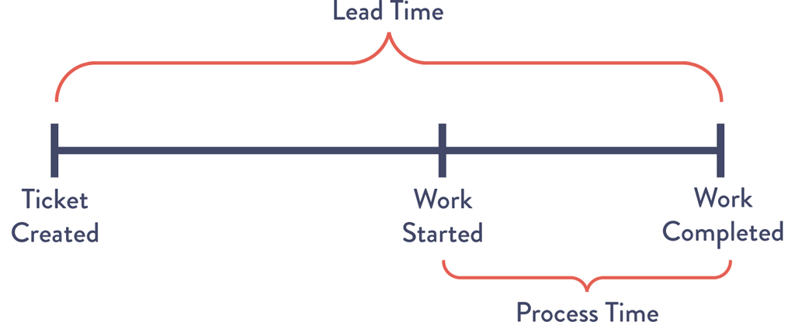

**Figure: Lead Time vs. Process Time of a Deployment Operation.** This visual separates active work from elapsed delivery time.

**How to read it:** Process time is the time spent doing the work. Lead time includes waiting, queuing, handoffs, approvals, batching, and rework.

**Why it matters:** Improving developer typing speed will not fix a system where the majority of elapsed time is waiting in queues.

**How to apply it:** During delivery retrospectives, record both values. If lead time is much larger than process time, focus on WIP limits, smaller batches, self-service environments, automated controls, and earlier reviews.

**Limitations:** The visual does not show variability. In production systems, tail latency and unpredictable queues are often more damaging than averages.

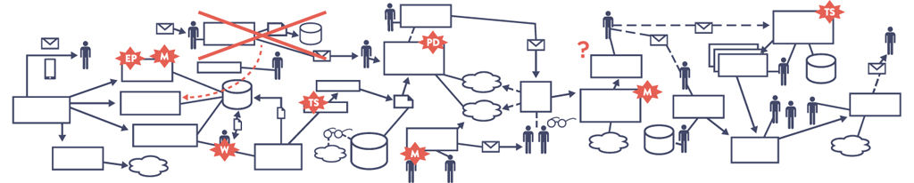

**Figure: Technology Value Stream with Deployment Lead Time of Three Months.** This visual shows a delivery system dominated by wait states.

**How to read it:** Each stage may have short process time, but accumulated queue time creates a long end-to-end cycle.

**Why it matters:** It demonstrates why optimizing isolated departments rarely changes the customer experience.

**How to apply it:** Put this beside your own value stream map and ask which waits are policy, which are caused by scarce specialists, which come from missing automation, and which are caused by batch release habits.

**Limitations:** It is a simplified model. Real systems often have loops, rework, production support interruptions, and parallel paths.

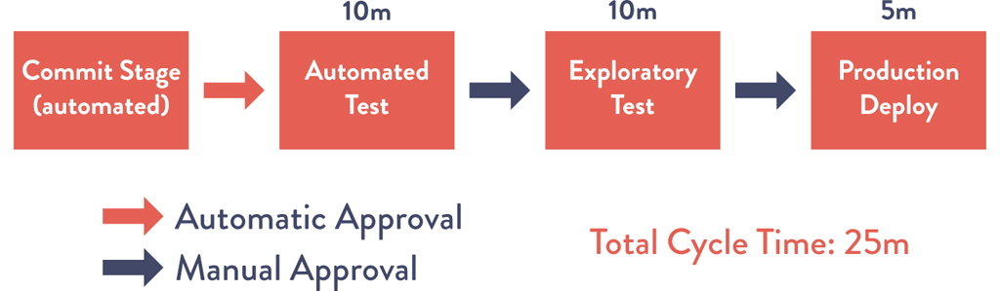

**Figure: Technology Value Stream with Lead Time of Minutes.** This is the target state: small changes, automated verification, and rapid deployment.

**How to read it:** The stages still exist, but waiting and handoff delay are removed or compressed.

**Why it matters:** High-performing delivery does not skip quality; it moves quality checks earlier and automates evidence generation.

**How to apply it:** Use the diagram as a north star for reducing batch size, automating tests, making environments self-service, and pushing compliance evidence into the pipeline.

**Limitations:** Minutes-level lead time is not required for every system or every change. Regulated, safety-critical, or data-migration-heavy systems still need risk-sensitive controls.

### 3.2 Flow: Visibility, WIP, Batch Size, Constraints, and Waste

- **Explanation:** Flow practices make work visible, limit work in process, reduce batch size, manage constraints, and remove waste from the delivery system.
- **Problem solved:** Teams stop accepting overload, unplanned work, and cross-team waiting as normal.
- **How it works:** Visual management exposes queues. WIP limits reduce context switching. Small batches reduce merge conflict, test blast radius, and release risk. Constraint management keeps improvement focused on the system bottleneck.
- **Why it matters:** Flow is the foundation. Feedback and learning have little effect if work is too large, hidden, or stuck.
- **When to use:** Use these practices whenever delivery is slow, release dates are unreliable, teams are overloaded, or production support constantly interrupts feature work.
- **When not to use:** Do not impose WIP limits without creating escalation paths and leadership support; otherwise blocked work turns into hidden work.
- **Tradeoffs:** Smaller batches may initially feel less efficient because overhead becomes visible. The payoff is lower risk, faster feedback, and easier diagnosis.
- **Common mistakes:** Creating a board that only represents one team; ignoring operational work; rewarding utilization instead of flow; moving work faster into a downstream bottleneck.
- **Production example:** A team running many parallel features often creates delayed integration and late test failures. Reducing WIP makes integration happen earlier and makes blocked dependencies visible.
- **Questions to ask:** What work is invisible? Which column keeps growing? How many days old is the oldest item? What work enters without capacity being freed?
- **Source reference:** Chapter 2.

**Figure: Kanban Board Spanning Requirements, Dev, Test, Staging, and Production.** The board visualizes work across the whole path.

**How to read it:** The important boundary is not a team's local task list. The important boundary is the end-to-end stream that includes design, implementation, testing, staging, release, and operation.

**Why it matters:** A board that ends at "dev done" can hide the real bottleneck. A value-stream board makes queues and handoffs visible.

**How to apply it:** Include operations, security, and release steps on the same board. Add classes of service for incidents, defects, compliance work, and improvement tasks.

**Limitations:** A board does not improve flow by itself. WIP policies, ownership, and leadership behavior must change.

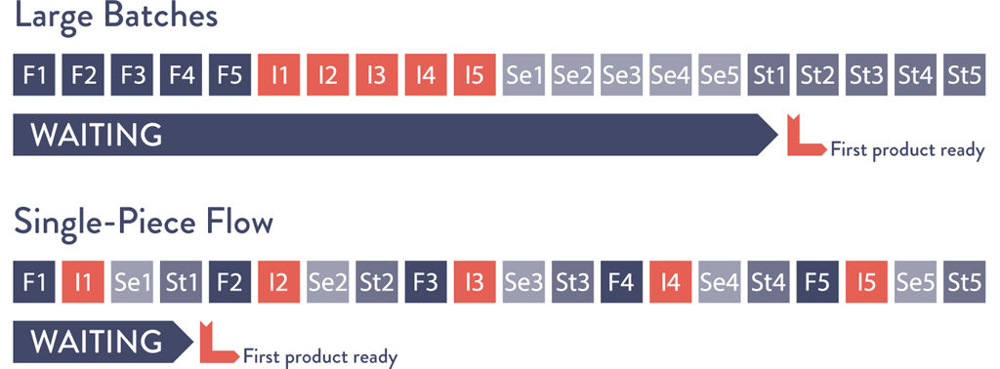

**Figure: Envelope Game.** The exercise illustrates how batch size and handoff policy affect total delivery time.

**How to read it:** Large batches look efficient locally but delay feedback and final delivery. Smaller batches improve flow and reveal problems earlier.

**Why it matters:** Release trains, giant pull requests, and late integration often repeat the same mistake: they maximize local utilization while slowing the system.

**How to apply it:** Shrink pull requests, deployment units, test batches, and release scopes. If smaller batches increase manual overhead, automate the overhead instead of returning to large batches.

**Limitations:** Real software has dependency, data, and customer coordination constraints. Small batches still require architecture and product slicing skill.

### 3.3 Feedback: Build Quality at the Source

- **Explanation:** Feedback practices ensure defects, operational failures, security issues, and user outcomes are detected quickly by the people who can fix the system.
- **Problem solved:** Late discovery, blame-driven incident response, and "throw over the wall" handoffs.
- **How it works:** Teams create automated tests, production telemetry, peer review, deployment health checks, alerting, and incident loops that bring evidence back to engineering.
- **Why it matters:** The cost of correction grows when feedback arrives after context is lost or after a release has expanded the blast radius.
- **When to use:** Use feedback loops in coding, builds, deploys, production operation, experiments, and security review.
- **When not to use:** Avoid alert streams and dashboards that no one owns. Feedback must cause action.
- **Tradeoffs:** More feedback can increase noise. Useful feedback needs routing, thresholds, ownership, and suppression of low-value signals.
- **Common mistakes:** Treating QA or operations as feedback destinations instead of partners; measuring only uptime while ignoring failed customer journeys; creating alerts that lack runbooks or service ownership.
- **Production example:** A deployment emits a spike in PHP warnings. If the deploying team sees it immediately and can roll back or fix forward, the incident is contained.
- **Questions to ask:** Who receives the signal? How fast? Is it actionable? Does it identify the change, owner, and affected users? What is the recovery path?
- **Source reference:** Chapters 3, 10, 14, 15, and 16.

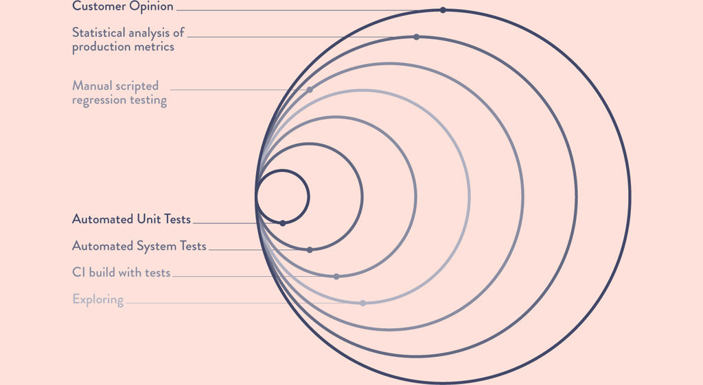

**Figure: Feedback Cycle Times.** The visual compares feedback loops of different speeds and scopes.

**How to read it:** Unit tests, build checks, integration tests, deployment verification, user behavior, and incident outcomes each operate at different timescales.

**Why it matters:** A healthy system has layered feedback. Fast local tests catch simple defects; production telemetry catches reality that test environments cannot fully simulate.

**How to apply it:** Design the pipeline so cheap, fast checks run first, deeper checks run later, and production health checks gate or inform rollout decisions.

**Limitations:** Faster is not always better if the signal is weak. Low-quality feedback creates false confidence or alert fatigue.

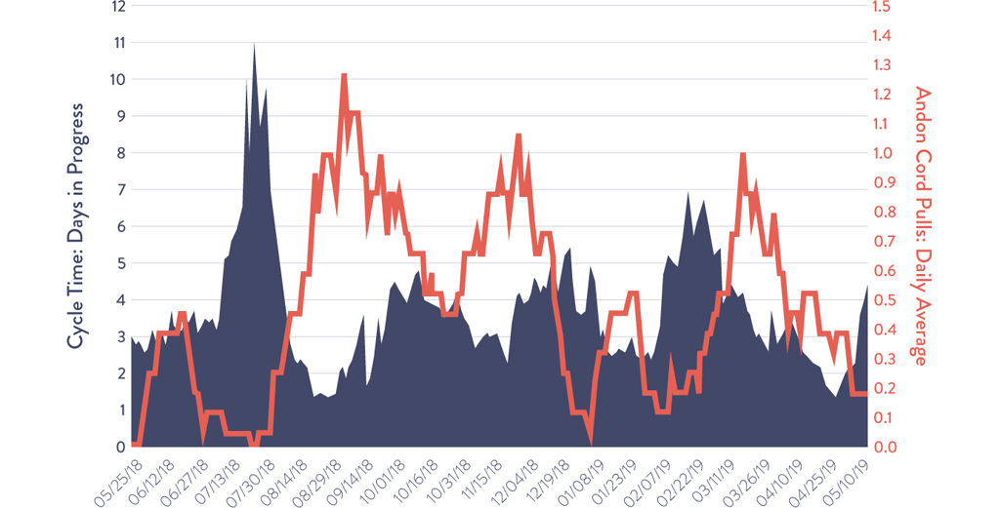

**Figure: Cycle Time vs. Andon Pulls at Excella.** The case visual connects stopping the line with improved flow.

**How to read it:** Interrupting the process to fix defects can improve overall speed because recurring defects stop consuming downstream capacity.

**Why it matters:** Organizations often treat incident and defect correction as delay. The book frames correction as system improvement.

**How to apply it:** Give teams authority to pause releases, stop unsafe work, and swarm recurring failure modes. Track whether repeated defects decline.

**Limitations:** Stopping work only helps when the organization fixes causes. If every interruption becomes a meeting without improvement, flow worsens.

### 3.4 Continual Learning and a Just Culture

- **Explanation:** Continual learning is the habit of improving how work is done by studying incidents, experiments, near misses, and daily friction without blame.
- **Problem solved:** Repeated failures, fear of reporting problems, and improvement work always losing to feature pressure.
- **How it works:** Teams reserve capacity, conduct blameless post-incident reviews, run experiments, share local discoveries, and encode learning in tooling, tests, docs, architecture, and training.
- **Why it matters:** Complex systems fail in unexpected ways. A culture that hides weak signals becomes fragile.
- **When to use:** Use it after incidents, near misses, security findings, failed deployments, slow reviews, customer-impacting defects, and successful experiments.
- **When not to use:** Do not use "blameless" to avoid accountability for system design. Accountability shifts from blaming individuals to improving conditions, controls, and learning.
- **Tradeoffs:** Learning consumes delivery capacity. The book argues this is necessary investment, not waste.
- **Common mistakes:** Writing postmortems that do not change pipelines or standards; turning retrospectives into status meetings; punishing the person closest to the failure.
- **Production example:** A service outage caused by a missing timeout should produce a shared library default, pipeline lint rule, or template update, not only a reminder.
- **Questions to ask:** What made the mistake possible? How did detection work? What weak signal was ignored? How will another team benefit from this learning?
- **Source reference:** Chapters 4 and 19-21.

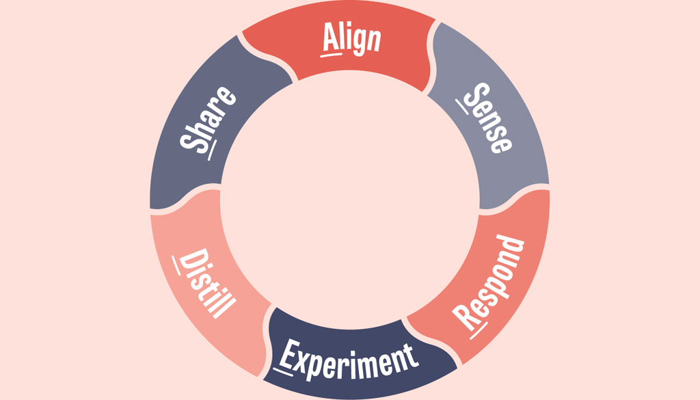

**Figure: ASREDS Learning Loop.** The visual captures a structured learning cycle.

**How to read it:** Improvement starts from experience, turns observations into insight, then changes future work through experiments, standards, or shared practice.

**Why it matters:** Learning must close the loop. A retrospective that does not change behavior, tooling, or policy is incomplete.

**How to apply it:** For every incident or improvement experiment, identify the artifact that changes: test, alert, runbook, dashboard, deployment check, architecture pattern, or onboarding material.

**Limitations:** The loop does not guarantee psychological safety or leadership support. Those must be deliberately maintained.

### 3.5 Organization, Architecture, and Conway's Law

- **Explanation:** The book uses Conway's Law to argue that communication structures shape system architecture. Team design and software design cannot be separated.
- **Problem solved:** Excess coordination, unclear ownership, slow approvals, and fragile monolith release paths.
- **How it works:** Organizations move from functional silos toward long-lived, market-oriented, cross-functional teams with ownership over services or value streams. Architecture is changed to reduce coupling and let teams deliver independently.
- **Why it matters:** A pipeline cannot fix architecture that requires many teams to coordinate every release.
- **When to use:** Use this lens during domain decomposition, platform team design, incident ownership review, and modernization planning.
- **When not to use:** Avoid using Conway's Law as an excuse for constant reorganization. Architecture, team skill, product boundaries, and operational maturity must be improved together.
- **Tradeoffs:** Cross-functional teams reduce handoffs but require broader skills, clear standards, and platform support.
- **Common mistakes:** Renaming teams without changing dependencies; creating service teams without giving them production ownership; splitting systems before establishing contracts and tests.
- **Production example:** A deployment that requires database, middleware, frontend, security, and operations approvals from separate silos has high coordination cost. A cross-functional team with clear interfaces can reduce that burden.
- **Questions to ask:** Which teams must coordinate for one change? Which dependency prevents independent deployment? Who owns production health? What platform capability would reduce team-to-team waiting?
- **Source reference:** Chapters 7, 8, and 13.

**Figure: Functional vs. Market Orientation.** The visual contrasts teams organized by specialty with teams organized around value delivery.

**How to read it:** Functional orientation optimizes specialist utilization. Market orientation optimizes delivery of a product, service, or customer outcome.

**Why it matters:** DevOps usually requires reducing handoffs across specialties, not merely asking the same silos to coordinate faster.

**How to apply it:** For critical value streams, form teams that include development, testing, operations knowledge, security involvement, and product context.

**Limitations:** Specialist depth still matters. Platform, security, database, and reliability specialists often remain necessary, but their work should enable product teams rather than become permanent queues.

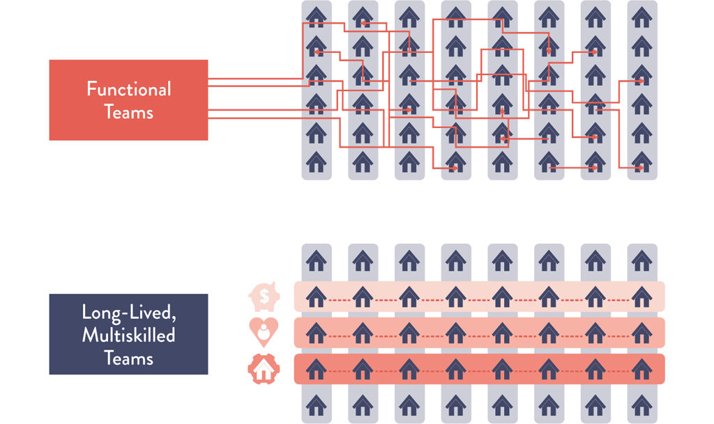

**Figure: Functional Teams in Silos vs. Long-Lived Multi-Skilled Teams.** The visual shows the shift from siloed execution to durable teams with broader responsibility.

**How to read it:** The target is not that everyone can do everything. The target is that the team has the skills and authority to deliver and operate its service.

**Why it matters:** Long-lived teams accumulate domain, operational, and architectural knowledge. Temporary project teams often dissolve before learning compounds.

**How to apply it:** Assign services to durable teams, define production ownership, and invest in team-level skills rather than rotating people through short projects.

**Limitations:** Multi-skilled teams can be overloaded if platform capabilities, shared standards, and management support are weak.

### 3.6 Deployment Pipeline Foundations

- **Explanation:** A deployment pipeline is the automated path that turns a version-controlled change into a tested, deployable, observable production release.
- **Problem solved:** Manual builds, snowflake environments, release-day heroics, late test failures, and uncertain deployability.
- **How it works:** Everything needed to build, test, configure, provision, and deploy is version controlled. Each change produces a build artifact. Automated tests and checks progressively increase confidence. Environments are reproducible. Deployment and rollback are routine.
- **Why it matters:** The pipeline becomes the evidence-generating system for quality, security, compliance, and operational readiness.
- **When to use:** Use for all production-bound software, infrastructure, configuration, and policy changes.
- **When not to use:** Do not build an elaborate pipeline before understanding architecture and test strategy. Pipeline design should reflect release risk.
- **Tradeoffs:** Pipelines require maintenance. Flaky tests, slow stages, and unclear ownership can turn the pipeline into another queue.
- **Common mistakes:** Deploying from unversioned build outputs; testing a different artifact than the one released; relying on manually configured environments; treating pipeline failures as a QA problem rather than a system problem.
- **Production example:** A service team commits a change, the pipeline builds an immutable artifact, runs unit and integration tests, deploys to a production-like environment, runs smoke tests and security checks, then rolls out via canary while monitoring health.
- **Questions to ask:** Is the artifact immutable? Are environments reproducible? Which checks block release? Who owns flaky tests? How is rollback tested?
- **Source reference:** Chapters 9-11.

**Figure: Deployment Pipeline.** The visual shows the staged progression from commit to production deployment.

**How to read it:** Early stages should be fast and cheap. Later stages should be deeper and closer to production.

**Why it matters:** The pipeline is how teams reduce release risk without relying on manual inspection at the end.

**How to apply it:** Separate build, test, deploy, verification, and promotion responsibilities. Make each stage produce durable evidence: logs, test results, artifact checksums, approval metadata, and deployment records.

**Limitations:** A pipeline cannot compensate for untestable architecture or unclear ownership. It also needs active maintenance to avoid becoming slow and flaky.

**Figure: Ideal and Non-Ideal Automated Testing Pyramids.** The image contrasts a healthy base of fast tests with an inverted pyramid dominated by slow end-to-end tests.

**How to read it:** Unit and component tests should catch most defects cheaply. Integration and end-to-end tests validate important cross-boundary behavior but should not carry the whole quality burden.

**Why it matters:** A pipeline dominated by slow, brittle tests produces delayed feedback and encourages developers to avoid running tests.

**How to apply it:** Move assertions down the pyramid where possible, contract-test service boundaries, and reserve end-to-end tests for critical journeys.

**Limitations:** The pyramid is a heuristic. Some systems need additional layers such as property tests, performance tests, chaos tests, synthetic monitoring, or hardware-in-the-loop validation.

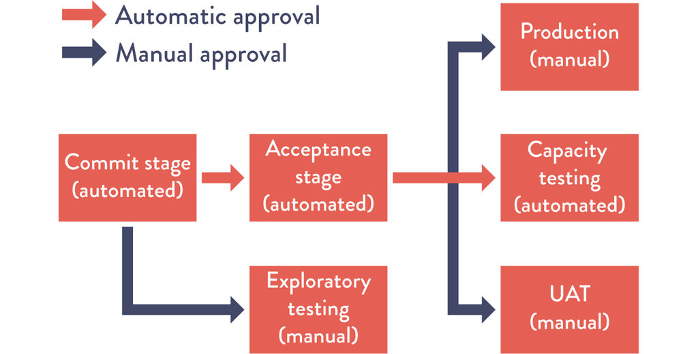

**Figure: Automated and Manual Tests in Parallel.** The visual shows how exploratory and manual testing can coexist with automation.

**How to read it:** Manual testing should not be a late queue that waits for all development to finish. Automation handles repeatable verification; humans focus on exploration, usability, risk, and edge cases.

**Why it matters:** The goal is not to eliminate testers. The goal is to move repeatable checks into the pipeline and use human judgment where it has leverage.

**How to apply it:** Let testers help define automated checks, exploratory charters, observability requirements, and risk-based release criteria.

**Limitations:** Manual testing remains constrained by availability and context. Critical release gates should not depend on undocumented manual memory.

### 3.7 Low-Risk Releases

- **Explanation:** Low-risk release practices reduce change size, isolate blast radius, separate deployment from release, and make rollback or fix-forward fast.
- **Problem solved:** Release weekends, all-or-nothing deployments, production freezes, and fear of change.
- **How it works:** Teams use small changes, automated deployments, blue-green environments, canaries, feature flags, backward-compatible database changes, decoupled services, and production telemetry.
- **Why it matters:** The safest release is usually not a large change with a large review. It is a small, observable, reversible change.
- **When to use:** Use for customer-facing services, high-traffic systems, critical internal platforms, and any system where downtime or regression cost is high.
- **When not to use:** Do not introduce canaries or feature flags without ownership for cleanup, monitoring, and configuration safety.
- **Tradeoffs:** Release sophistication adds complexity in routing, data compatibility, flag lifecycle, metrics, and rollback logic.
- **Common mistakes:** Treating blue-green as a substitute for database migration planning; leaving feature flags permanently; canarying without metrics that reflect customer harm; rolling back code while data has already migrated forward incompatibly.
- **Production example:** Deploy code dark behind a flag, canary to a small cohort, watch technical and business metrics, then expand traffic while preserving rollback.
- **Questions to ask:** Can we deploy without exposing behavior? Can we expose to a small group? Can we detect harm quickly? Can we roll back data and config safely?
- **Source reference:** Chapters 12 and 13.

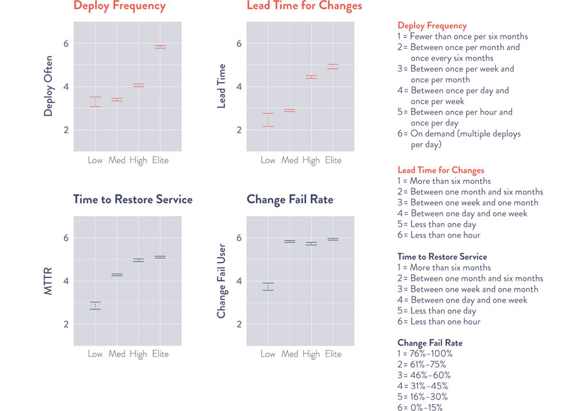

**Figure: Elite and High Performers Have Faster Deployment Lead Times and MTTR.** The visual ties speed and recovery together.

**How to read it:** High delivery performance is not a tradeoff against reliability. The strongest organizations deploy faster and recover faster.

**Why it matters:** Slow, large, manual releases often increase risk because each release contains more change and less current context.

**How to apply it:** Track deployment frequency, lead time, change failure rate, and MTTR together. Do not optimize only for speed or only for stability.

**Limitations:** Metrics can be gamed. Use them to improve systems, not to punish teams.

**Figure: Blue-Green Deployment Patterns.** The visual shows production traffic switching between two environment versions.

**How to read it:** One environment serves traffic while the other is prepared and verified. Traffic can then shift to the new version.

**Why it matters:** Blue-green reduces deployment downtime and provides a clearer rollback path when application and data compatibility are handled.

**How to apply it:** Use it when infrastructure can duplicate the serving environment and routing can switch predictably. Test database and state transitions separately.

**Limitations:** It can be expensive and incomplete for stateful systems. Data migrations, shared caches, and external dependencies can still make rollback hard.

**Figure: Canary Release Pattern.** The visual shows gradual exposure of a new version to limited traffic.

**How to read it:** A small percentage of users or requests exercises the new version before full rollout.

**Why it matters:** Canarying reduces blast radius and turns production rollout into an evidence-gathering process.

**How to apply it:** Define canary cohorts, health metrics, business metrics, automatic abort conditions, and ownership for watching the rollout.

**Limitations:** Canary safety depends on signal quality. Low traffic, delayed metrics, hidden user segments, and non-deterministic routing can hide defects.

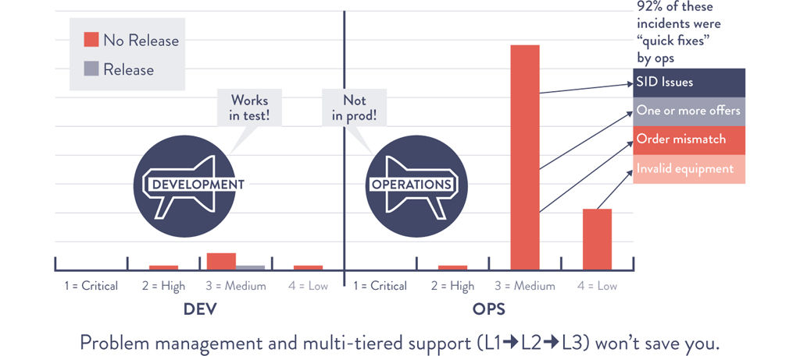

**Figure: How Structure Influences Behavior and Quality.** The visual connects organizational structure with release outcomes.

**How to read it:** Structure shapes incentives, communication, and quality. Teams optimized for local goals can create global fragility.

**Why it matters:** Release engineering problems often have organizational roots, not just tool problems.

**How to apply it:** Align service ownership, release authority, and operational responsibility. Give teams both the ability and accountability to improve their delivery system.

**Limitations:** Structure is only one factor. Skills, architecture, leadership behavior, and platform quality also matter.

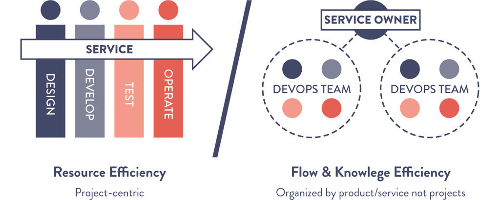

**Figure: Siloed to Cross-Functional Teams.** The image illustrates moving operational and quality skills into the delivery path.

**How to read it:** Instead of work passing between separate departments, a cross-functional team contains enough skill to deliver and operate.

**Why it matters:** Reducing handoffs improves speed and accountability.

**How to apply it:** Use cross-functional teams for critical value streams and platform teams for shared capabilities that remove repetitive burden.

**Limitations:** Cross-functional teams still need communities of practice to maintain specialist depth and consistency.

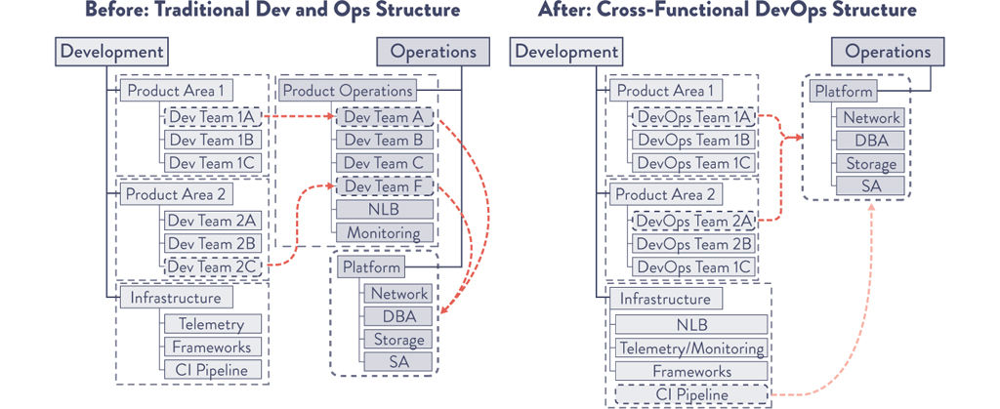

**Figure: Conventional vs. Cross-Functional Structure.** The visual reinforces the structural shift needed for low-risk releases.

**How to read it:** The conventional structure routes work through departmental queues. Cross-functional structure routes work through product ownership and service responsibility.

**Why it matters:** Delivery risk is often created by delayed integration of specialized knowledge.

**How to apply it:** Embed operations and security design early, use platform self-service, and keep release responsibility close to the team that changed the system.

**Limitations:** Large enterprises still need governance. The aim is lightweight, evidence-based governance, not absence of control.

### 3.8 Architecture for Independent Delivery

- **Explanation:** Architecture should make it possible for teams to test, deploy, operate, and recover their components with limited coordination.
- **Problem solved:** Coupled releases, shared database bottlenecks, giant regression cycles, and cross-team approval storms.
- **How it works:** Teams reduce coupling through modular boundaries, stable APIs, backward-compatible changes, contract tests, versioned dependencies, service ownership, and data migration patterns.
- **Why it matters:** Deployment speed is constrained by architecture. A heavily coupled system forces large-batch releases even if tooling is modern.
- **When to use:** Use during monolith modernization, service extraction, platform design, data ownership changes, and release risk reduction.
- **When not to use:** Do not split systems only to follow fashion. Distributed systems add network, data consistency, observability, and operational complexity.
- **Tradeoffs:** Independent deployability often requires duplication, extra contracts, careful migration, and stronger observability.
- **Common mistakes:** Creating microservices with shared databases and shared release trains; ignoring data ownership; extracting services before tests and telemetry exist.
- **Production example:** A learning platform moves extension capabilities into building blocks so teams can release functionality without modifying and retesting the whole core product.
- **Questions to ask:** Which components force coordinated deployment? Which database tables are shared across teams? Can consumers tolerate both old and new API shapes during rollout?
- **Source reference:** Chapter 13.

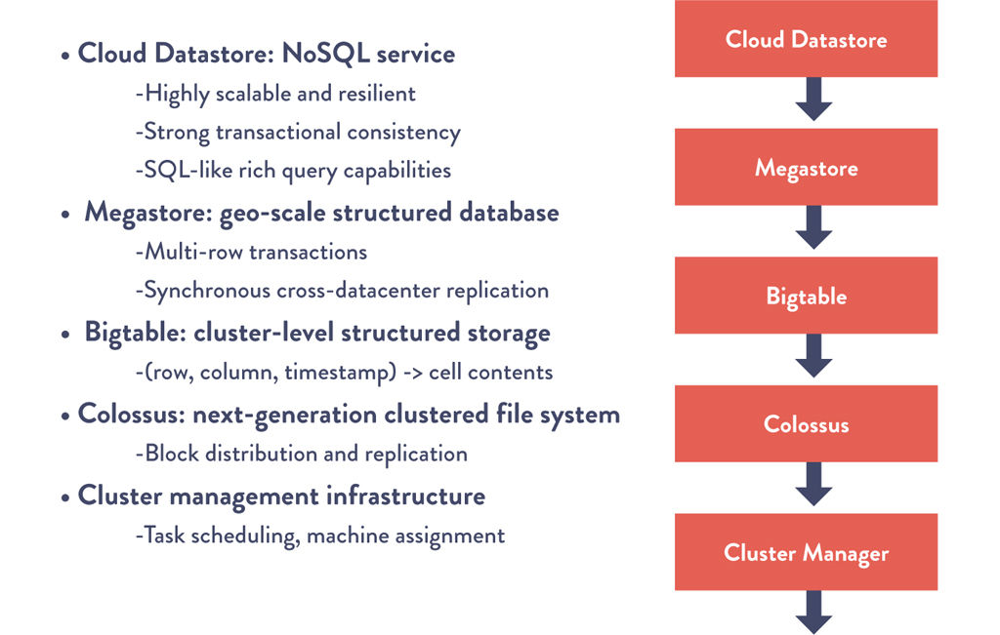

**Figure: Google Cloud Datastore.** The image appears in the architecture discussion as an example of platform capability and system structure.

**How to read it:** The visual is less about one product and more about how architecture choices create boundaries for teams and services.

**Why it matters:** Platform abstractions can reduce operational load and enable teams to move faster when the abstraction fits the workload.

**How to apply it:** Prefer shared platform capabilities for common needs such as persistence, deployment, secrets, observability, and messaging, while keeping product ownership clear.

**Limitations:** Managed or platform services do not remove responsibility for data modeling, ownership, failure modes, or migration.

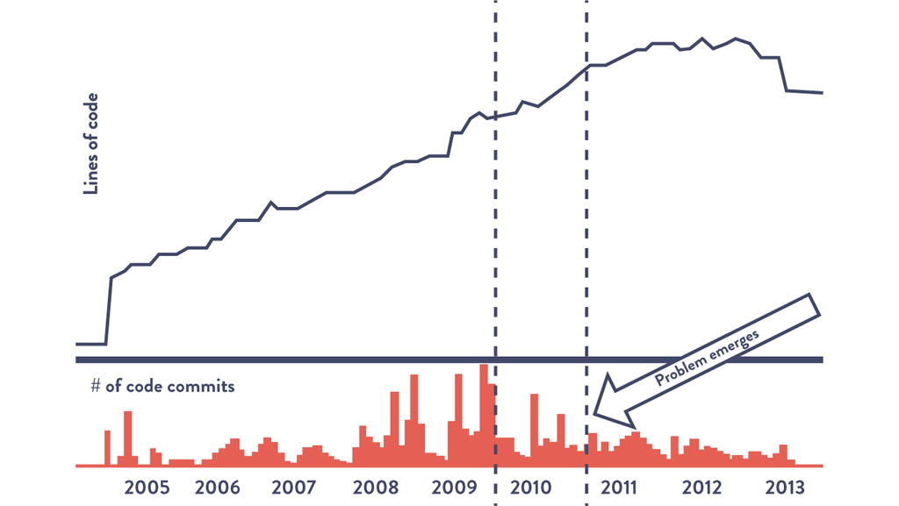

**Figure: Blackboard Learn Code Repository before Building Blocks.** The visual shows a more tightly coupled code structure.

**How to read it:** Shared code and shared release paths make change coordination expensive.

**Why it matters:** A large codebase can become a delivery bottleneck when independent features cannot be built, tested, and released independently.

**How to apply it:** Identify modules with high change rates and high coordination cost. Introduce extension points, contracts, tests, and ownership boundaries.

**Limitations:** Repository shape is not the same as runtime architecture. A monorepo can support independent delivery if boundaries and tooling are strong.

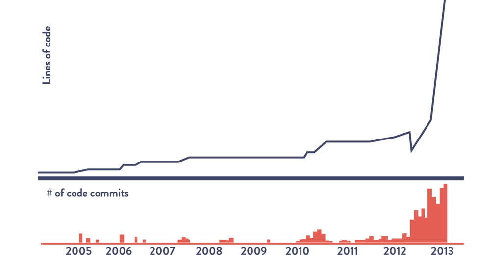

**Figure: Blackboard Learn Code Repository after Building Blocks.** The visual shows a more modular structure after architectural changes.

**How to read it:** The goal is to isolate change and reduce the need to touch the core for every feature.

**Why it matters:** Independent delivery is often won through modular architecture before it is won through deployment tooling.

**How to apply it:** Use extension mechanisms, stable interfaces, and automated compatibility tests to decouple feature work from core platform release cycles.

**Limitations:** Modularity requires governance. Poorly designed plugin or extension systems can create security, performance, and support problems.

### 3.9 Telemetry, Detection, and Operational Feedback

- **Explanation:** Telemetry is the instrumented evidence about application behavior, environment health, deployment effects, pipeline performance, and business outcomes.
- **Problem solved:** Slow incident diagnosis, unknown customer impact, and release decisions based on hope.
- **How it works:** Teams emit metrics, logs, traces, events, and business counters. They analyze normal behavior, detect anomalies, correlate deployments with outcomes, and route actionable alerts to owners.
- **Why it matters:** Without telemetry, production is a black box. With weak telemetry, teams respond to symptoms but cannot improve causes.
- **When to use:** Use telemetry for every service, deployment pipeline, data pipeline, infrastructure platform, and critical business process.
- **When not to use:** Do not collect unlimited data without retention, cost, ownership, and signal design.
- **Tradeoffs:** More signals improve diagnosis but increase cost and noise. Automated anomaly detection can help, but thresholds must match data shape.
- **Common mistakes:** Monitoring infrastructure only; ignoring user-facing and business metrics; using static thresholds on non-Gaussian data; not tagging events by version, deployment, feature flag, or tenant.
- **Production example:** A deployment is correlated with forum excitement, error rates, warnings, latency, and transaction volume to decide whether to continue rollout.
- **Questions to ask:** What does healthy look like? Which metric reveals user harm? Which signal detects bad deploys quickly? Who is paged and what action should they take?
- **Source reference:** Chapters 14-16.

**Figure: Incident Resolution Time by Performer Level.** The visual links operational capability with recovery speed.

**How to read it:** Strong delivery organizations generally detect, diagnose, and recover faster because telemetry and ownership are built into daily work.

**Why it matters:** MTTR is an organizational and technical outcome. It depends on deployment records, service ownership, observability, runbooks, and practice.

**How to apply it:** Review incidents for detection time, diagnosis time, mitigation time, and learning loop completion.

**Limitations:** Resolution time distributions can hide severe outliers. Track tails and customer impact, not only averages.

**Figure: Monitoring Framework.** The image provides a broad model for operational signals.

**How to read it:** Monitoring should cover multiple layers, not just CPU and disk. Application, infrastructure, user, and business signals all matter.

**Why it matters:** Infrastructure can be healthy while customers cannot complete checkout, login, search, or payment.

**How to apply it:** Build dashboards around customer journeys and service objectives, then drill down to infrastructure and dependency signals.

**Limitations:** The framework is conceptual. Each service still needs workload-specific indicators.

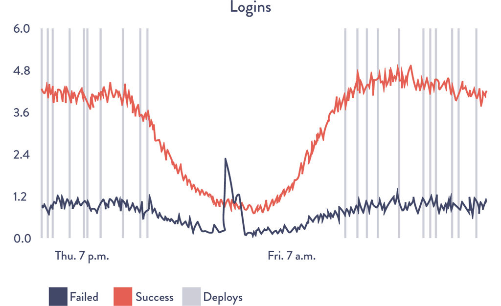

**Figure: One Line of Code to Generate Telemetry using StatsD and Graphite at Etsy.** The visual highlights low-friction instrumentation.

**How to read it:** Telemetry should be easy enough that engineers add it during feature development, not as a separate operations project.

**Why it matters:** The lower the cost of instrumentation, the more likely teams are to observe meaningful application behavior.

**How to apply it:** Provide service libraries, templates, and standards that make metrics, traces, logs, and deployment markers the default.

**Limitations:** Easy emission is only the first step. Teams still need naming conventions, cardinality controls, retention, dashboards, and alert policy.

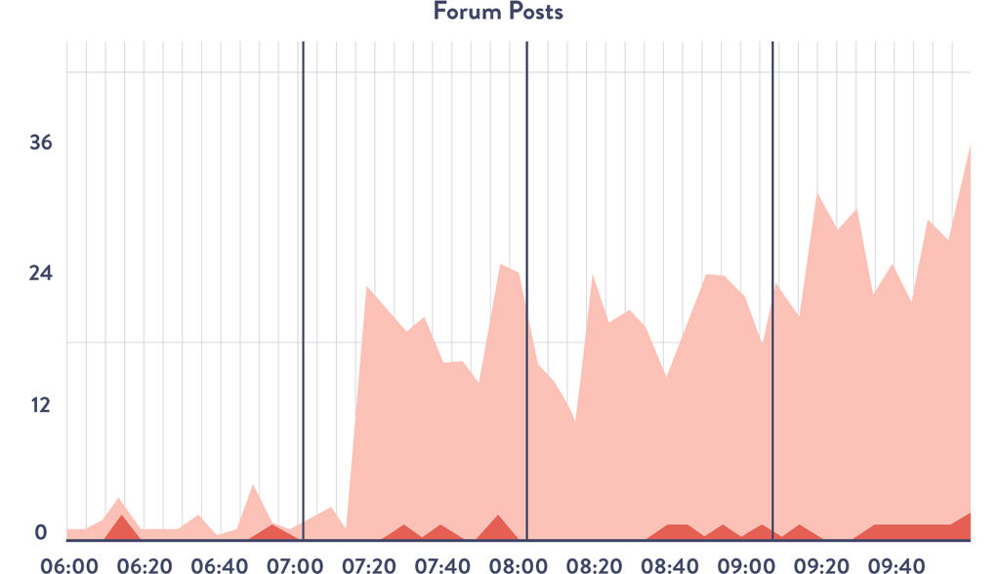

**Figure: User Excitement of New Features in Forum Posts after Deployments.** The visual connects deployments with customer reaction.

**How to read it:** Delivery feedback is not only errors and latency. User behavior and sentiment can validate whether a feature creates value.

**Why it matters:** DevOps links engineering changes to business outcomes, not just technical success.

**How to apply it:** Correlate deploy events with adoption, conversion, support tickets, forum sentiment, revenue, or task completion.

**Limitations:** Sentiment and business metrics can lag or be confounded by marketing, seasonality, or unrelated incidents.

**Figure: Downloads per Minute Over-Alerting with 3-Sigma Rule.** The chart shows how naive thresholds can create alert noise.

**How to read it:** A static statistical rule can alert too often when the data distribution or seasonality does not fit the assumption.

**Why it matters:** Alert fatigue causes teams to ignore signals and slows real incident response.

**How to apply it:** Model seasonality and workload shape. Use anomaly detection, forecast bands, service-level alerts, or business-impact alerts when simple thresholds fail.

**Limitations:** Advanced detection can also be opaque. Pair automation with human-readable diagnostics.

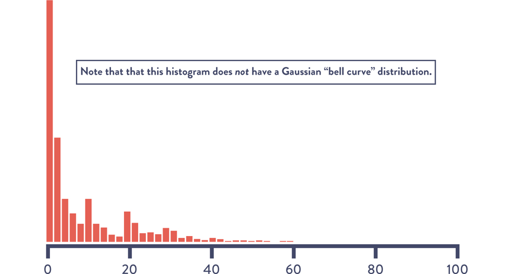

**Figure: Downloads Histogram Showing Non-Gaussian Data.** The visual explains why a Gaussian assumption can be wrong.

**How to read it:** Many operational metrics are skewed, seasonal, bursty, or multi-modal.

**Why it matters:** Incorrect statistical assumptions produce bad alerts and false confidence.

**How to apply it:** Inspect distributions before setting thresholds. Segment by region, customer type, endpoint, or time window when needed.

**Limitations:** Distribution analysis must be repeated as systems and user behavior change.

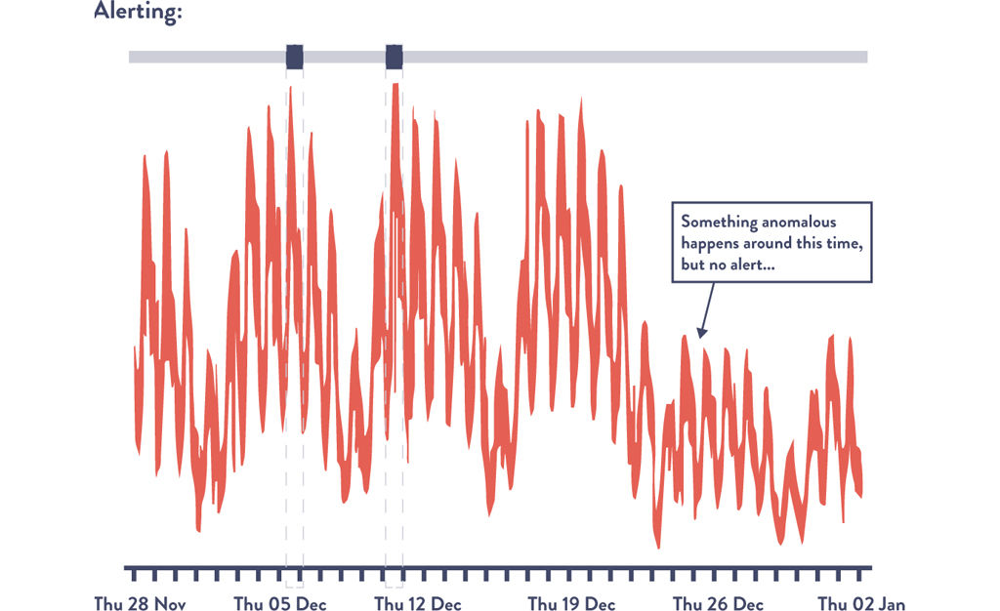

**Figure: Transaction Volume Under-Alerting with 3-Sigma Rule.** The visual shows the opposite failure: missing a real anomaly.

**How to read it:** Broad thresholds can absorb abnormal behavior and fail to alert.

**Why it matters:** Both too many alerts and too few alerts are system failures.

**How to apply it:** Tune alerting by service objective and customer harm. Use multi-window burn-rate alerts or anomaly models where appropriate.

**Limitations:** No detector is perfect. Pair automated detection with deployment markers and human escalation paths.

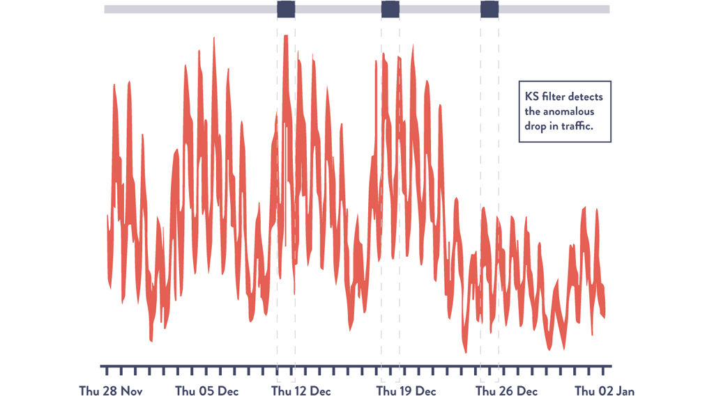

**Figure: Transaction Volume with Kolmogorov-Smirnov Test.** The image shows a more distribution-aware detection approach.

**How to read it:** Instead of only checking distance from a mean, the detector compares distribution changes.

**Why it matters:** Production metrics often need methods that detect shape changes, not just threshold breaches.

**How to apply it:** Use distribution-aware checks for high-volume metrics where shape changes indicate customer or system impact.

**Limitations:** Statistical sophistication does not replace operational ownership, runbooks, or validation against real incidents.

### 3.10 Safer Deployment Feedback and Review

- **Explanation:** Deployment and code review practices should create fast, high-quality feedback without becoming long approval queues.
- **Problem solved:** Slow reviews, risky changes, invisible deployment harm, and manual coordination.
- **How it works:** Teams use small changes, peer review, automated checks, deployment telemetry, service handback, staged rollout, and production signals to govern change.
- **Why it matters:** Reviews are most effective when change size is small and context is fresh.
- **When to use:** Use for every production-bound code, infrastructure, configuration, dependency, and policy change.
- **When not to use:** Do not replace engineering judgment with rubber-stamp approvals or purely automated policy checks.
- **Tradeoffs:** Review improves quality but can become a queue. Automation and smaller changes reduce review cost.
- **Common mistakes:** Reviewing giant pull requests; separating review from tests; ignoring production results; approving based on seniority instead of evidence.
- **Production example:** A pull request includes suggested edits, tests, linked deployment plan, and production monitoring expectations. After deploy, warnings and errors are reviewed immediately.
- **Questions to ask:** How large is the change? What evidence supports it? What will we monitor after deployment? How will we hand back or escalate ownership?
- **Source reference:** Chapters 16 and 18.

**Figure: Etsy Deployment PHP Warnings Quickly Fixed.** The visual shows deployment telemetry detecting a problem quickly.

**How to read it:** The signal changes around deployment time, enabling fast association with the release.

**Why it matters:** Deployment markers plus application-level warnings shorten diagnosis and recovery.

**How to apply it:** Emit deployment events into observability systems and show version, service, owner, and rollout stage on dashboards.

**Limitations:** Correlation is not proof. Use logs, traces, metrics, and change history together.

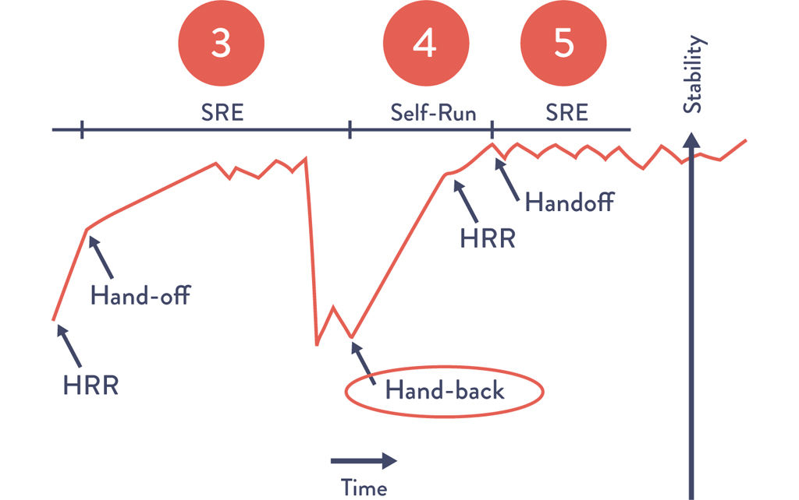

**Figure: Service Handback at Google.** The visual shows operational readiness and ownership transition.

**How to read it:** A service can move between high-risk and low-risk operational states based on evidence, readiness, and behavior.

**Why it matters:** Operational maturity should be observable. Ownership and support models should change when a service is not meeting standards.

**How to apply it:** Define readiness criteria for services: SLOs, alerts, runbooks, dashboards, on-call training, dependencies, rollback, and incident history.

**Limitations:** Handback processes must avoid becoming punitive. The goal is to improve service fitness.

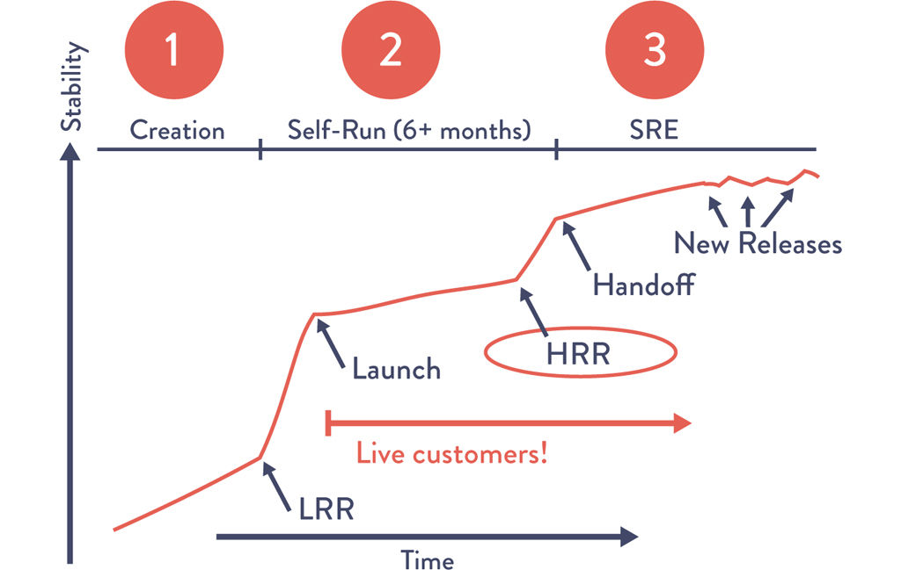

**Figure: LRR and HRR at Google.** The visual distinguishes lower-risk and higher-risk service states.

**How to read it:** Services can be managed differently based on reliability and operational readiness.

**Why it matters:** Uniform process is often inefficient. Risk-based governance focuses attention where harm is likely.

**How to apply it:** Use service maturity tiers to decide release controls, review depth, on-call expectations, and platform support.

**Limitations:** Tiers must be transparent and evidence-based, otherwise they become politics.

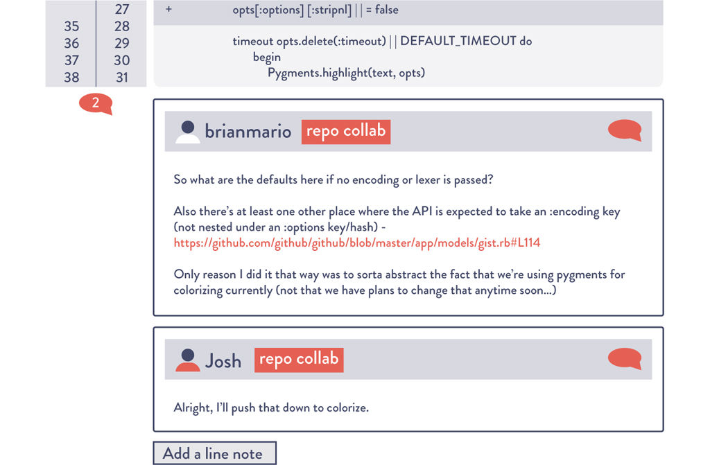

**Figure: GitHub Pull Request Comments and Suggestions.** The visual shows review as a collaborative editing process.

**How to read it:** Good review is specific, close to the code, and easy to act on.

**Why it matters:** Peer review transfers knowledge, catches defects, and improves design when it stays timely.

**How to apply it:** Keep changes small, require tests or evidence, use review checklists for risky areas, and automate style or policy checks.

**Limitations:** Review cannot replace tests, production telemetry, or ownership.

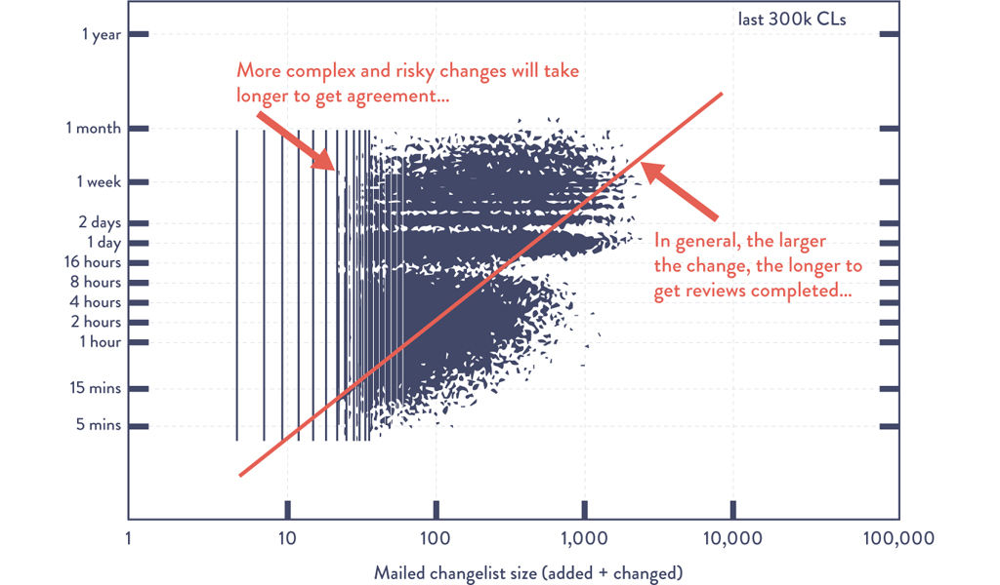

**Figure: Size of Change vs. Lead Time for Reviews at Google.** The visual connects review delay with change size.

**How to read it:** Larger changes generally take longer to review and carry higher risk.

**Why it matters:** Pull request size is a flow control variable.

**How to apply it:** Set norms for small changes, split mechanical changes from behavioral changes, and use feature flags or branch-by-abstraction for larger work.

**Limitations:** Some migrations are inherently large. For those, manage risk through staged plans, compatibility layers, and explicit rollback criteria.

### 3.11 Security and Compliance as Continuous Work

- **Explanation:** Security and compliance should be built into daily development, pipelines, and production operations.
- **Problem solved:** Late security gates, adversarial review, slow remediation, audit panic, and unpatched dependencies.
- **How it works:** Security experts define patterns, tests, threat models, guardrails, training, and reusable controls. Product teams run static analysis, dependency checks, policy checks, secret scans, and environment hardening as normal pipeline stages.
- **Why it matters:** Late security review creates queues and finds problems when changes are expensive. Continuous security finds issues earlier and creates reusable controls.
- **When to use:** Use for all code, infrastructure, dependencies, build systems, secrets, access control, logging, and compliance evidence.
- **When not to use:** Do not use automation to hide risk ownership. Security still needs expertise, escalation, and adversarial thinking.
- **Tradeoffs:** Automated checks can create noise and false positives. Security teams must tune controls and help developers fix causes.
- **Common mistakes:** Treating security as a department; scanning only at release time; failing to update dependencies; storing credentials in pipelines; ignoring the pipeline as a high-value attack target.
- **Production example:** A Jenkins pipeline runs security checks, dependency scans, and policy tests on every change. Findings create immediate work for the owning team.
- **Questions to ask:** Which risks are prevented by design? Which are detected by pipeline? Which require manual review? How fast are vulnerabilities remediated? Who owns the build system's security?
- **Source reference:** Chapters 22 and 23.

**Figure: Jenkins Running Automated Security Testing.** The visual shows security checks embedded in the delivery pipeline.

**How to read it:** Security is part of normal change flow, not a separate late-stage activity.

**Why it matters:** Embedding checks where developers already work shortens feedback and normalizes remediation.

**How to apply it:** Add static analysis, dependency scanning, container scanning, IaC policy checks, secret scanning, and deploy-time controls to pipelines.

**Limitations:** Tools must be tuned. A noisy security stage quickly becomes ignored or bypassed.

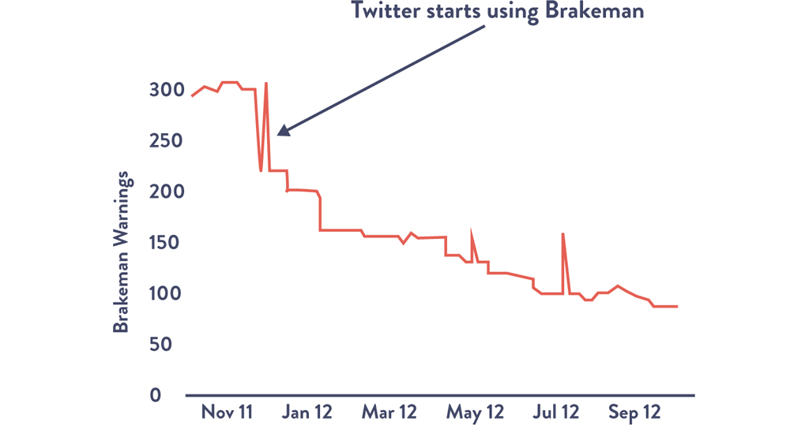

**Figure: Brakeman Security Vulnerabilities Detected.** The visual shows application security findings surfaced by tooling.

**How to read it:** Static analysis identifies potential vulnerabilities close to code changes.

**Why it matters:** Finding security defects before release reduces remediation cost and exposure.

**How to apply it:** Route findings to the owning team, classify severity, suppress false positives deliberately, and convert repeated issues into safer templates or libraries.

**Limitations:** Static analysis does not find every vulnerability and may report false positives.

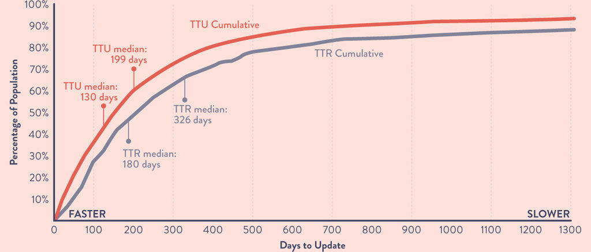

**Figure: Time to Remediate vs. Time to Update Dependencies.** The visual links dependency hygiene with remediation speed.

**How to read it:** Systems that can update dependencies quickly can remediate vulnerabilities quickly.

**Why it matters:** Dependency update capability is a security capability.

**How to apply it:** Keep dependencies current, automate update PRs, run compatibility tests, and avoid accumulating upgrade debt.

**Limitations:** Some upgrades require product, data, or platform migration. Those need planned capacity.

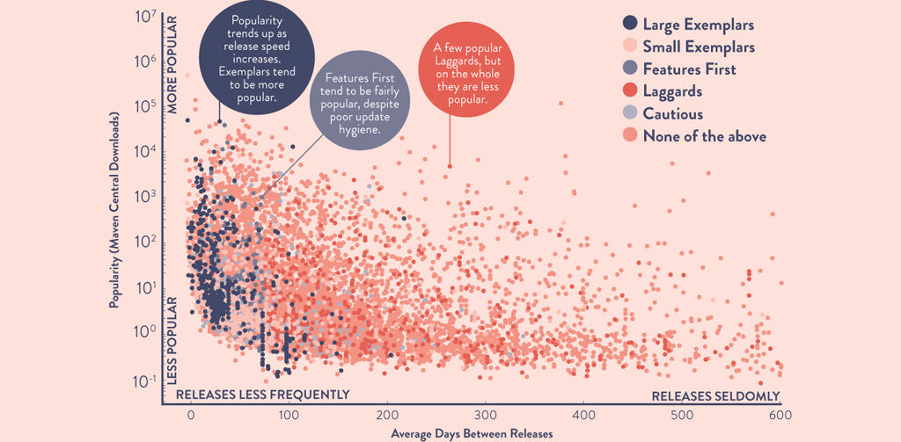

**Figure: Five Behavioral Clusters for Open-Source Projects.** The visual groups project behaviors related to security and maintainability.

**How to read it:** Different projects have different update and security response patterns.

**Why it matters:** Dependency risk depends on ecosystem behavior, not only package popularity.

**How to apply it:** Evaluate dependencies by maintenance activity, security response, release cadence, community health, and replacement cost.

**Limitations:** Cluster labels are a simplification. Critical dependency decisions still need context-specific risk review.

**Figure: Developers See SQL Injection Attempts in Graphite at Etsy.** The visual shows security telemetry exposed to developers.

**How to read it:** Security events can be operational signals that product teams observe and act on.

**Why it matters:** When developers see attack patterns, security becomes part of service ownership.

**How to apply it:** Expose authentication failures, suspicious inputs, WAF events, dependency alerts, and policy violations to service dashboards.

**Limitations:** Raw security telemetry needs careful access control, privacy review, and signal tuning.

### 3.12 Chronic Conflict, Queues, and the Andon Cord

- **Explanation:** The appendices reinforce why IT organizations experience chronic conflict: demand exceeds capacity, urgent work crowds out important work, and queues grow sharply as utilization rises.
- **Problem solved:** Leadership sees firefighting as a people problem instead of a system design problem.
- **How it works:** Work management must control demand, protect capacity, expose queues, and allow teams to stop the line when quality or safety is at risk.
- **Why it matters:** A delivery system near full utilization becomes slow and fragile. The closer a constrained resource is to 100% utilization, the more wait time explodes.
- **When to use:** Use this model when teams are overloaded, incident work interrupts plans, review queues are long, or leaders ask why adding "just one more priority" is harmful.
- **When not to use:** Do not use utilization arguments to avoid accountability. The answer is active portfolio management and capacity allocation.
- **Tradeoffs:** Lower utilization can look inefficient in local accounting, but it improves responsiveness and resilience.
- **Common mistakes:** Planning every engineer at 100%; treating unplanned work as exception; failing to reserve improvement capacity; punishing teams for stopping unsafe work.
- **Production example:** A production support team scheduled at full capacity cannot respond quickly to incidents, patching, or urgent security work. Queue delay becomes the real cost.
- **Questions to ask:** What is the constraint? What is its utilization? How much unplanned work arrives? What work should be delayed or stopped?
- **Source reference:** Appendices.

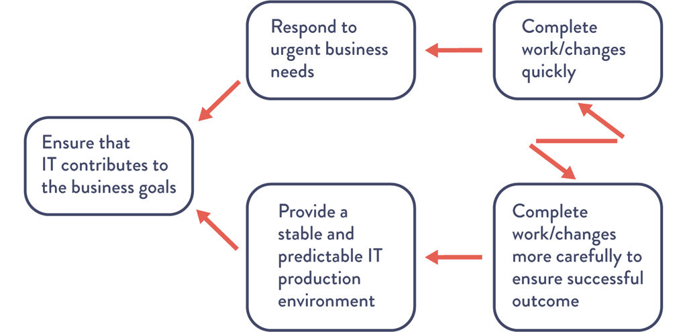

**Figure: Core Chronic Conflict Facing Every IT Organization.** The visual summarizes the tension between delivering change and preserving stability.

**How to read it:** Organizations need both speed and reliability, but unmanaged demand makes those goals appear opposed.

**Why it matters:** DevOps practices aim to dissolve the conflict by making change safer and feedback faster.

**How to apply it:** Replace change freezes and heroics with small changes, automation, observability, and capacity reserved for improvement.

**Limitations:** The conflict can reappear if business demand exceeds system capacity or if architecture remains tightly coupled.

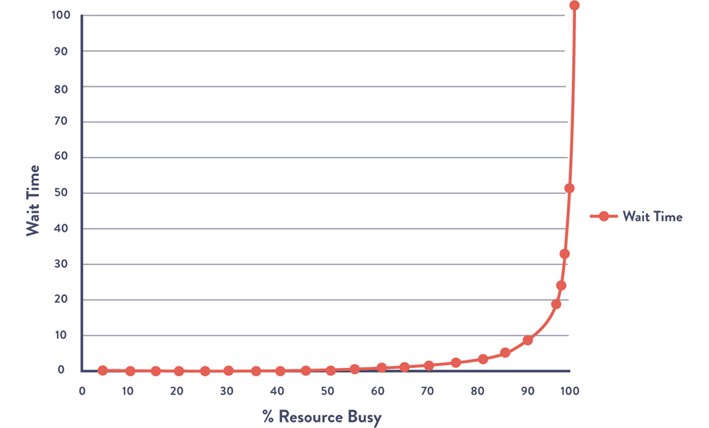

**Figure: Queue Size and Wait Times as a Function of Percent Utilization.** The visual shows why high utilization creates long waits.

**How to read it:** As utilization approaches full capacity, queue wait time grows nonlinearly.

**Why it matters:** Keeping everyone busy is not the same as delivering quickly. Slack capacity is required for flow and resilience.

**How to apply it:** Set WIP limits, reserve capacity for interrupts, and stop adding work to the bottleneck until its queue is under control.

**Limitations:** The curve is a general systems principle. Actual wait time depends on arrival variability, work size variability, priority policy, and dependency structure.

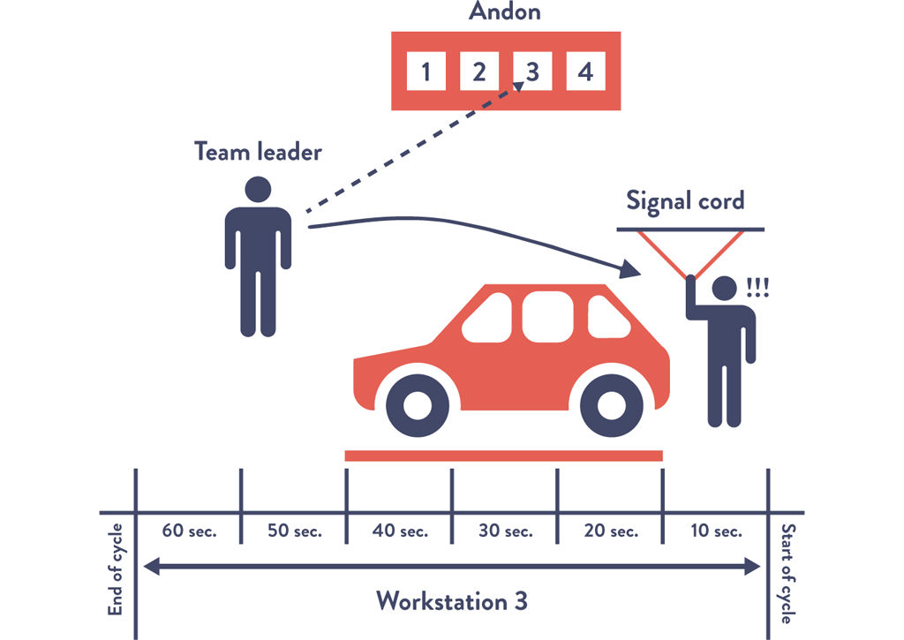

**Figure: Toyota Andon Cord.** The image illustrates stopping work to expose and fix quality problems.

**How to read it:** Pulling the cord is not failure. It is a designed mechanism for making problems visible while they are still fixable.

**Why it matters:** Software teams need equivalent mechanisms: failing builds, deployment aborts, incident swarms, and explicit stop-the-line authority.

**How to apply it:** Define when teams can pause releases, stop intake, swarm incidents, or block unsafe change. Make leadership support visible.

**Limitations:** Stop-the-line mechanisms require follow-through. Without root-cause improvement, they become recurring disruption.

## 4. Chapter-by-Chapter Knowledge Extraction

| Section | Core Knowledge | Engineering Takeaway |
|---|---|---|
| Introduction | DevOps emerged as a response to the gap between business demand, software delivery, and IT operations. | Treat delivery and operation as one system. |
| Ch. 1: Agile, Continuous Delivery, and the Three Ways | Lean value streams, deployment lead time, and the Three Ways frame DevOps. | Optimize end-to-end value, feedback, and learning. |
| Ch. 2: First Way - Flow | Make work visible, limit WIP, reduce batch size, remove constraints, and eliminate waste. | Start by seeing and controlling the work. |
| Ch. 3: Second Way - Feedback | Create fast feedback loops from later stages back to earlier stages. | Quality and operability must be checked close to the work. |
| Ch. 4: Third Way - Learning | Create a culture of experimentation, safety, and repetition-based mastery. | Reserve capacity to improve the system of work. |
| Ch. 5: Selecting a Value Stream | Choose a starting point that matters and can produce visible learning. | Start with a bounded transformation, not a company-wide slogan. |
| Ch. 6: Understanding the Value Stream | Map work, make it visible, expand across the organization, and include nonfunctional work. | Use value-stream maps and boards as management tools. |
| Ch. 7: Organization and Architecture | Conway's Law connects team structure to software structure. | Use team topology and architecture to reduce coordination cost. |
| Ch. 8: Integrating Operations into Development | Bring operations knowledge into daily development work. | Operability belongs in feature design, code review, and planning. |
| Ch. 9: Deployment Pipeline Foundations | Version control, build automation, environment automation, and self-service create repeatability. | Make deployability a continuous property. |
| Ch. 10: Automated Testing | Fast and reliable tests create confidence and reduce late rework. | Build a layered test strategy, not a slow end-to-end bottleneck. |
| Ch. 11: Continuous Integration | Frequent integration reduces merge conflict, hidden defects, and delayed feedback. | Integrate small changes into trunk with automated checks. |
| Ch. 12: Low-Risk Releases | Automated deployments, blue-green, canary, and feature flags reduce blast radius. | Separate deploy from release and make rollback routine. |
| Ch. 13: Architect for Low-Risk Releases | Architecture must support independent change and operational ownership. | Reduce coupling before expecting pipeline speed. |
| Ch. 14: Create Telemetry | Instrument applications, infrastructure, pipelines, and user behavior. | Production evidence is part of the product. |
| Ch. 15: Analyze Telemetry | Use appropriate statistical and visual methods to detect anomalies. | Alert design must match data shape and customer harm. |
| Ch. 16: Feedback for Safe Deployment | Deployment signals, handback, and risk models support safer operation. | Rollout decisions should be evidence-based. |
| Ch. 17: Hypothesis-Driven Development | A/B testing and experiments link delivery with customer outcomes. | Treat features as hypotheses until production data validates them. |
| Ch. 18: Review and Coordination | Small changes and effective peer review improve quality without long queues. | Review should be fast, specific, and evidence-backed. |
| Ch. 19: Inject Learning into Daily Work | Build improvement and learning into normal work routines. | Learning is operational capacity, not spare time. |
| Ch. 20: Convert Local Discoveries into Global Improvements | Spread fixes, patterns, and lessons beyond the discovering team. | Incidents should improve shared systems. |
| Ch. 21: Reserve Time for Organizational Learning | Deliberately allocate time for improvement, practice, and innovation. | Without protected time, the urgent always wins. |
| Ch. 22: Information Security Every Day | Security is integrated into design, coding, testing, and operation. | Make security feedback fast and developer-visible. |
| Ch. 23: Protecting the Deployment Pipeline | Pipelines are critical production infrastructure and must be secured. | Protect build systems, credentials, artifacts, and deployment authority. |
| Conclusion and Appendices | The chronic conflict of IT can be addressed by flow, feedback, learning, and queue management. | Use DevOps to change the system, not just team behavior. |

## 5. Architecture and Operating Decision Guide

| Decision | Use This When | Prefer | Avoid | Evidence Needed |
|---|---|---|---|---|
| Start with a value stream | Delivery is slow or transformation scope is unclear. | A visible, important, bounded product/service stream. | Company-wide automation mandate with no bottleneck analysis. | Current-state map, lead time, WIP, queues, defect/rework rates. |
| Team structure | Many groups coordinate for one release. | Long-lived cross-functional teams plus enabling platform/security teams. | Pure functional silos for fast-moving product streams. | Dependency map, handoff counts, incident ownership map. |
| Pipeline investment | Builds, tests, or deploys are manual or unreliable. | Version-controlled pipeline with immutable artifacts and automated checks. | One-off scripts and manual release notebooks. | Build reproducibility, test history, deployment records. |
| Test strategy | Releases fail late or tests are slow/flaky. | Broad fast tests, contract tests, focused end-to-end tests, production monitoring. | Inverted pyramid dominated by brittle UI tests. | Failure taxonomy, runtime, flake rate, defect escape analysis. |
| Release strategy | Production change is risky. | Small changes, feature flags, canary, blue-green, rollback/fix-forward. | Big-bang releases and long freezes. | Blast radius, rollback criteria, health metrics, data migration plan. |
| Observability | Incidents are hard to diagnose or deploy impact is unclear. | App, infra, pipeline, dependency, and business telemetry. | CPU-only dashboards and unowned alerts. | SLOs, customer journey metrics, deployment markers, alert ownership. |
| Security integration | Security review delays releases or vulnerabilities persist. | Pipeline checks, secure templates, threat modeling, dependency hygiene. | Late manual gates as the primary control. | Scan results, remediation time, dependency age, audit evidence. |
| Governance | Compliance requires control evidence. | Automated evidence from version control, pipeline, approvals, tests, and deployment records. | Spreadsheet approvals detached from real change history. | Traceability from requirement to commit to artifact to deploy. |

## 6. System Design and DevOps Playbooks

### Playbook 1: Map and Improve a Value Stream

1. Pick one product/service stream with clear customer or business importance.
2. Define start and end points, such as "idea accepted" to "running in production."
3. Map every step, queue, handoff, approval, test, environment, and deployment action.
4. Record process time, wait time, percent complete and accurate, rework, and WIP.
5. Identify the constraint. Improve only what helps the constraint until it moves.
6. Reduce batch size and WIP before buying new tools.
7. Move quality, security, and operations feedback earlier.
8. Re-map after changes and measure whether lead time, recovery, and defect escape improved.

### Playbook 2: Build a Deployment Pipeline

1. Put application code, infrastructure, configuration, tests, and pipeline definitions in version control.
2. Build immutable artifacts once and promote those artifacts.
3. Run fast unit and static checks first.
4. Run integration, contract, security, and compliance checks against reproducible environments.
5. Deploy to production-like environments automatically.
6. Use canary or blue-green where blast radius matters.
7. Emit deployment markers into telemetry.
8. Store test results, approvals, artifact versions, and deploy records for audit and learning.

### Playbook 3: Reduce Release Risk

1. Split changes into small independently reviewable units.
2. Separate code deployment from feature exposure using flags or configuration.
3. Make database changes backward-compatible across deploy windows.
4. Use canary or limited cohort rollout for risky changes.
5. Define automatic abort criteria before rollout starts.
6. Watch technical and business metrics during rollout.
7. Keep rollback and fix-forward paths tested.
8. Remove obsolete flags and compatibility paths after adoption.

### Playbook 4: Turn Incidents into System Improvements

1. Preserve the timeline and evidence.
2. Run a blameless review focused on conditions, signals, decisions, and system behavior.
3. Identify how the incident was detected, diagnosed, mitigated, and learned from.
4. Convert findings into durable changes: tests, alerts, runbooks, libraries, templates, or architecture work.
5. Share patterns with other teams.
6. Track completion of learning actions.
7. Revisit whether similar incidents recur.

### Playbook 5: Integrate Security into Daily Work

1. Identify common threat patterns and recurring vulnerabilities.
2. Provide secure defaults through frameworks, templates, libraries, and infrastructure modules.
3. Add static analysis, dependency scanning, secret scanning, IaC policy checks, and container checks to pipelines.
4. Route findings to service owners with severity and remediation guidance.
5. Track remediation time and dependency update time.
6. Protect the build system, artifact repository, secrets, and deployment credentials.
7. Generate audit evidence from actual delivery records.

## 7. Applying This to a Current System

Use this diagnostic sequence for an existing engineering organization:

1. **Delivery lead time:** Measure elapsed time from accepted work to production. Separate active process time from waiting.
2. **WIP and queues:** Count work in every state, including unplanned work, incidents, security requests, dependency updates, and platform tasks.
3. **Release risk:** Review last 10 deployments. Note batch size, manual steps, rollback difficulty, change failures, and customer impact.
4. **Architecture coupling:** Identify components that force coordinated releases or shared approvals.
5. **Feedback quality:** Inspect tests, dashboards, alerts, incident reviews, support tickets, and business metrics.
6. **Operational ownership:** Confirm who owns production health, deployment, on-call, runbooks, and customer-impacting incidents.
7. **Security flow:** Measure where security findings enter, how long they wait, and whether repeated findings become shared controls.
8. **Learning loop:** Check whether incidents and retrospectives produce changes to tooling, tests, architecture, or standards.

Common first improvements:

- Build one shared value-stream board.
- Limit WIP at the bottleneck.
- Automate the most repeated release step.
- Move one late manual check into the pipeline.
- Add deployment markers to telemetry.
- Reduce pull request size.
- Create a service readiness checklist.
- Reserve explicit capacity for reliability, security, and improvement work.

## 8. Applying This to a Future System

For a new product or platform, design DevOps capabilities from the start:

- Choose architecture boundaries that match team ownership.
- Define deployability as a requirement.
- Keep the first pipeline simple but version-controlled and reproducible.
- Use infrastructure as code and environment templates.
- Create a layered test strategy before the system grows.
- Add telemetry to feature work, not after launch.
- Define SLOs, alerts, dashboards, and runbooks for critical paths.
- Use small releases and feature flags from the beginning.
- Include security controls in templates and pipelines.
- Store delivery evidence automatically for compliance and audits.

The future-state goal is not maximum automation on day one. The goal is a system that can learn without large rewrites.

## 9. Technology Mapping

| DevOps Capability | Typical Tooling Category | What Matters More Than Tool Choice |
|---|---|---|
| Version control | Git platforms, monorepo tools, code review systems | All production-bound changes are traceable and reviewable. |
| CI | Build runners, hosted CI, self-hosted runners | Fast feedback, reproducible builds, owned failures. |
| CD | Deployment orchestrators, GitOps controllers, release platforms | Immutable artifacts, predictable promotion, rollback/fix-forward. |
| Infrastructure as code | Terraform, CloudFormation, Pulumi, Ansible, Kubernetes manifests | Reproducibility, reviewability, drift detection, policy checks. |
| Test automation | Unit, integration, contract, UI, performance, chaos tools | Signal quality, speed, flake control, risk coverage. |
| Feature flags | Flag platforms or internal config systems | Safe defaults, auditability, cleanup, blast-radius control. |
| Observability | Metrics, logs, traces, events, SLO tooling | Actionable signals tied to user impact and ownership. |
| Security testing | SAST, DAST, SCA, secret scanning, IaC scanning | Early feedback, low noise, remediation ownership. |
| Artifact management | Container registries, binary repos, package registries | Provenance, immutability, signing, access control. |
| Compliance evidence | Pipeline records, approvals, ticket links, audit exports | Evidence generated by real work, not recreated manually. |

## 10. Failure Modes and Troubleshooting

| Symptom | Likely Cause | What to Inspect | Corrective Action |
|---|---|---|---|
| "Dev is done" but releases are slow | Downstream queues and handoffs. | Value-stream map, wait time, QA/staging/release queues. | Create an end-to-end board, reduce WIP, automate repeated gates. |
| Pipeline is slow and ignored | Too many late or brittle checks. | Test runtime, flake rate, stage ownership. | Move checks earlier, delete low-value tests, fix flakes as priority work. |
| Deployments fail often | Large batches, manual steps, poor environment parity. | Last deployment failures, scripts, environment drift. | Smaller changes, IaC, immutable artifacts, deployment rehearsal. |
| Rollback is unsafe | Data and code compatibility missing. | Migration plan, schema ownership, flag behavior. | Use expand/contract migrations and backward-compatible releases. |
| Alerts are noisy | Thresholds do not match data shape or ownership. | Alert history, false positives, metric distributions. | Tune by SLO/customer impact, add routing, suppress non-actionable alerts. |
| Incidents repeat | Learning actions are not durable. | Postmortem actions, shared libraries, templates, tests. | Convert findings into global improvements and track completion. |
| Security slows releases | Controls are late and manual. | Security review wait time, vulnerability age, scan timing. | Shift checks into pipeline and provide secure defaults. |
| Teams cannot deploy independently | Architecture and ownership are coupled. | Dependency map, shared databases, coordinated release list. | Modularize boundaries, add contracts, align team ownership. |
| Everyone is busy but nothing finishes | High utilization and excess WIP. | Queue sizes, age of work, interrupt rate. | Reduce WIP, reserve capacity, manage demand at portfolio level. |

## 11. Production Readiness Checklist

Use this checklist before declaring a service or platform ready for routine production operation.

- **Ownership:** A durable team owns the service, deployment, on-call, runbooks, and incident follow-up.
- **Version control:** Code, config, infrastructure, tests, and pipeline definitions are versioned.
- **Build:** Artifacts are reproducible, immutable, and traceable to source.
- **Tests:** The pipeline has fast checks, integration/contract coverage, and focused end-to-end tests for critical journeys.
- **Security:** Secrets are protected, dependencies are scanned, static and IaC checks run, and findings route to owners.
- **Deployment:** Deployments are automated, logged, repeatable, and tied to telemetry markers.
- **Rollback/fix-forward:** The team knows when and how to rollback or fix forward, including data migration cases.
- **Observability:** Metrics, logs, traces, deployment markers, dashboards, and alerts cover customer impact and dependencies.
- **SLOs:** Service-level objectives or equivalent health criteria are defined for critical paths.
- **Runbooks:** Common failure modes have diagnosis and mitigation steps.
- **Capacity:** The team has capacity reserved for reliability, security, toil reduction, and learning.
- **Compliance:** Required approvals and evidence are generated from real delivery records.
- **Learning:** Incidents and near misses produce tracked improvements to shared systems.

## 12. Visual Inventory and Coverage

The EPUB contained 70 extracted image files. This knowledge file embeds the highest-value conceptual, operating-model, pipeline, release, telemetry, architecture, review, security, and appendix figures inline with explanation.

| Image | Figure/Table Meaning | Embedded? | Why |
|---|---|---:|---|
| `00029.jpeg` | Deployments per day vs. number of developers | Reference only | Useful historical benchmark, less central than the Three Ways and value-stream visuals. |
| `00031.jpeg` | Lead time vs. process time | Yes | Core to diagnosing delivery systems. |
| `00032.jpeg` | Three-month deployment value stream | Yes | Shows queue-dominated delivery. |
| `00033.jpeg` | Minutes-level deployment value stream | Yes | Shows target flow state. |
| `00034.jpeg` | The Three Ways | Yes | Primary mental model. |
| `00036.jpeg` | American Airlines transformation journey | Reference only | Case-specific timeline; explained in text via starting-value-stream guidance. |
| `00037.jpeg` | Kanban board across value stream | Yes | Core work-visibility model. |
| `00038.jpeg` | Envelope game | Yes | Core batch-size teaching visual. |
| `00039.jpeg` | Feedback cycle times | Yes | Core feedback model. |
| `00040.jpeg` | Cycle time vs. Andon pulls | Yes | Important learning/quality-at-source case visual. |
| `00042.jpeg` | Technology adoption curve | Reference only | Useful for change strategy, less central to operating mechanics. |
| `00043.jpeg` | American Airlines delivery transformation | Reference only | Case-specific. |
| `00044.jpeg` | Example value-stream map | Reference only | Covered by value-stream playbook; can be embedded later for workshop materials. |
| `00045.jpeg` | Invest 20% capacity in user-invisible value | Reference only | Covered in learning/capacity guidance. |
| `00046.jpeg` | Functional vs. market orientation | Yes | Core organization design visual. |
| `00047.jpeg` | Functional silos vs. long-lived teams | Yes | Core team topology visual. |
| `00049.jpeg` | Deployment pipeline | Yes | Core technical practice visual. |
| `00050.jpeg` | Automated testing pyramids | Yes | Core test strategy visual. |
| `00051.jpeg` | Automated and manual tests in parallel | Yes | Important testing workflow visual. |
| `00052.jpeg` | Facebook developers deploying per week | Reference only | Benchmark/case visual. |
| `00053.jpeg` | Daily deployments at CSG | Reference only | Benchmark/case visual. |
| `00054.jpeg` | Elite/high performers lead time and MTTR | Yes | Core speed/reliability relationship. |
| `00055.jpeg` | Deployinator console | Reference only | Tool-specific example. |
| `00056.jpeg` | Blue-green deployment | Yes | Core release pattern. |
| `00057.jpeg` | Canary release | Yes | Core release pattern. |
| `00058.jpeg` | Structure influences behavior and quality | Yes | Connects organization to release outcomes. |
| `00059.jpeg` | Siloed to cross-functional teams | Yes | Core organization/release visual. |
| `00060.jpeg` | Conventional vs. cross-functional structure | Yes | Core organization/release visual. |
| `00061.jpeg` | Google Cloud Datastore | Yes | Architecture/platform example. |
| `00062.jpeg` | Blackboard before building blocks | Yes | Architecture coupling example. |
| `00063.jpeg` | Blackboard after building blocks | Yes | Architecture decoupling example. |
| `00065.jpeg` | Incident resolution by performer level | Yes | Core operational feedback visual. |
| `00066.jpeg` | Monitoring framework | Yes | Core telemetry model. |
| `00067.jpeg` | StatsD/Graphite telemetry | Yes | Instrumentation practice example. |
| `00068.jpeg` | User excitement after deployments | Yes | Links technical and business feedback. |
| `00069.jpeg` | Gaussian distribution | Reference only | Supporting statistical background. |
| `00070.jpeg` | Over-alerting with 3-sigma | Yes | Alert quality failure mode. |
| `00071.jpeg` | Non-Gaussian downloads histogram | Yes | Alert-design caution. |
| `00072.jpeg` | Netflix viewing demand | Reference only | Case-specific telemetry example. |
| `00073.jpeg` | Netflix Scryer forecasting | Reference only | Tool/case-specific anomaly example. |
| `00074.jpeg` | Autodesk share price moving average | Reference only | Supporting statistical example. |
| `00075.jpeg` | Under-alerting with 3-sigma | Yes | Alert quality failure mode. |
| `00076.jpeg` | Kolmogorov-Smirnov anomaly alert | Yes | Distribution-aware detection example. |
| `00077.jpeg` | Etsy PHP warnings after deployment | Yes | Deployment feedback visual. |
| `00078.jpeg` | Service handback at Google | Yes | Operational readiness/governance visual. |
| `00079.jpeg` | LRR and HRR at Google | Yes | Risk-based operational control visual. |
| `00080.jpeg` | GitHub pull request comments | Yes | Review practice visual. |
| `00081.jpeg` | Change size vs. review lead time | Yes | Review flow visual. |
| `00083.jpeg` | ASREDS learning loop | Yes | Core learning model. |
| `00085.jpeg` | Jenkins automated security testing | Yes | Pipeline security model. |
| `00086.jpeg` | Brakeman vulnerabilities | Yes | Static security testing example. |
| `00087.jpeg` | Remediation vs. dependency updates | Yes | Dependency hygiene/security visual. |
| `00088.jpeg` | Open-source behavioral clusters | Yes | Dependency risk visual. |
| `00089.jpeg` | SQL injection attempts in Graphite | Yes | Security telemetry visual. |
| `00090.jpeg` | Average development window by day/user | Reference only | Narrow appendix/example visual. |
| `00091.jpeg` | Core chronic conflict | Yes | Core appendix mental model. |
| `00092.jpeg` | Queue size/wait time vs. utilization | Yes | Core queueing model. |
| `00093.jpeg` | Toyota Andon Cord | Yes | Core quality-at-source model. |

Assets not listed above are cover, part-divider, publisher, decorative, or repeated sidebar/case-study images. They remain available under `knowledge/assets/the-devops-handbook-knowledge/` for later visual atlas or teaching-deck use.

## 13. Knowledge Gaps and Further Study

- **DORA metrics and current benchmarks:** The book references delivery-performance research, but current benchmark values should be checked against recent DORA reports before setting targets.
- **Modern platform engineering:** The book predates some current internal developer platform conventions. Pair it with platform engineering and product-thinking material when designing self-service platforms.
- **Kubernetes and GitOps details:** The book teaches principles, not Kubernetes-specific operations. Use the local CKA knowledge file for cluster implementation details.
- **Cloud-native security:** Expand pipeline security with current supply-chain controls such as artifact signing, SBOMs, provenance, SLSA-style maturity, and policy-as-code.
- **SRE practices:** Pair telemetry and service handback material with SLO, error-budget, and incident-command practices.

## 14. Practice Exercises

1. Pick one service and draw its value stream from work acceptance to production. Mark process time, wait time, WIP, and rework.
2. Review the last five production incidents. Identify whether each produced a durable system improvement.
3. Analyze the last ten pull requests. Record change size, review time, test failures, and deployment outcome.
4. Build a deployment-readiness matrix for one service using ownership, tests, telemetry, rollback, and runbook criteria.
5. Choose one manual release step and replace it with a pipeline check that produces evidence.
6. Audit feature flags and remove stale flags or undefined owners.
7. Inspect alert history for one month. Classify alerts as actionable, noisy, missing, or misrouted.
8. Measure dependency update age for critical services and design a remediation flow.
9. Run a blameless review for a near miss, then convert one finding into a shared template, library, or pipeline rule.
10. Create a service dashboard that shows deployment markers beside errors, latency, saturation, and one business metric.

## 15. Quick Reference

| Problem | Ask | First Lever |
|---|---|---|
| Delivery is slow | Where is the wait time? | Value-stream map and WIP limits. |
| Releases are risky | How big is each change and blast radius? | Small batches, flags, canary, rollback. |
| Tests are painful | Which tests are slow, flaky, or late? | Test pyramid repair and ownership. |
| Incidents repeat | What durable change came from the last incident? | Learning loop and global improvement. |
| Teams coordinate constantly | Which architecture boundary forces it? | Team/service ownership and decoupling. |
| Alerts are ignored | Which alerts are actionable? | SLO/customer-impact alerting. |
| Security is a blocker | Which control can move earlier? | Pipeline checks and secure defaults. |
| Compliance is manual | Which evidence already exists in delivery tools? | Automated traceability from change to deploy. |
| Everyone is overloaded | Where is utilization near 100%? | Demand control, WIP limits, reserved capacity. |

## 16. Processing Notes

- EPUB metadata, table of contents, figure list, chapter samples, and image references were inspected locally.
- 70 image files were extracted to `knowledge/assets/the-devops-handbook-knowledge/`.
- The main file embeds 44 high-value image references inline with explanation, application guidance, and limitations.
- No separate visual atlas was created because the current skill policy is to place important visuals directly in the main knowledge artifact.
- Text is paraphrased and synthesized to preserve engineering value without reproducing long copyrighted passages.
