# The DevOps Handbook, Second Edition - Engineering Knowledge

## Source Context

- **Detected title:** *The DevOps Handbook, Second Edition*
- **Authors:** Gene Kim, Jez Humble, Patrick Debois, John Willis, Nicole Forsgren
- **Source date:** 2021-11-29
- **Extraction note:** The EPUB uses many split HTML files. Chapter names were recovered from the table of contents and the spine text. Figure references are grounded in nearby captions and headings.
- **Version note:** This is the 2021 second edition. The principles are durable, but specific tools, vendors, and State of DevOps figures should be verified against current DORA and vendor documentation before using them as current benchmarks. `[Inference]`

## How To Use This Knowledge File

Use this file as an operating manual for improving software delivery systems. The book is not mainly about buying tools. It is about changing the system of work so software can move from idea to production quickly, safely, securely, and repeatedly.

Read it in this order:

1. Learn the core conflict: technology organizations are asked to change fast and keep systems stable at the same time.
2. Learn the Three Ways: flow, feedback, and continual learning.
3. Map your value stream and find the constraint.
4. Build technical practices that make small, reversible changes routine.
5. Build feedback, telemetry, review, learning, security, and compliance into daily work.

## Core Thesis

The book argues that high-performing technology organizations do not choose between speed and stability. They design the organization, architecture, delivery pipeline, telemetry, and culture so small changes can flow quickly, defects are found early, and learning compounds. The recurring pattern is to replace late, manual, approval-heavy risk control with earlier, automated, observable, and team-owned risk control.

The chronic failure mode is a downward spiral: large batches create risky releases; risky releases create outages and fear; fear creates more approvals and handoffs; handoffs increase queues and delay; delay increases batch size; and the cycle repeats. DevOps interrupts that loop by making work visible, reducing batch size, shortening feedback loops, and making improvement part of normal work.

## High-Value Mental Models

| Mental Model | What It Means | Why It Matters | Common Misuse | Source Area |
|---|---|---|---|---|
| The Three Ways | Improve flow from left to right, feedback from right to left, and learning everywhere. | Prevents local optimization by tying practices to system behavior. | Treating DevOps as a team name or toolchain. | Part I, Ch. 1-4 |
| Technology value stream | Software work has lead time, process time, queues, rework, and constraints like any production system. | Makes invisible waiting and handoffs measurable. | Measuring only coding time while ignoring approval, test, deploy, and rework queues. | Ch. 1, Ch. 6 |
| Small batch economics | Smaller changes reduce risk, make review easier, and shorten learning cycles. | Enables both faster throughput and safer releases. | Splitting tickets while still batching integration and deployment. | Ch. 2, Ch. 9-13 |
| Feedback before failure | Telemetry, tests, reviews, and operability checks should detect problems while they are cheap. | Moves discovery from production incidents to daily work. | Adding dashboards nobody watches or tests nobody trusts. | Ch. 3, Ch. 10, Ch. 14-18 |
| Architecture shapes behavior | Conway's Law means organization and architecture reinforce each other. | Teams cannot independently deliver if the architecture forces constant coordination. | Reorganizing people without changing coupling, ownership, or platform constraints. | Ch. 7, Ch. 13 |
| Learning is a production capability | Blameless postmortems, improvement time, internal conferences, and experiments are delivery infrastructure. | Prevents repeated incidents and repeated local discoveries. | Treating retrospectives as ceremonies without global changes. | Ch. 19-21 |
| Security and compliance as daily work | Controls should be automated, versioned, tested, and visible in the same pipeline as application changes. | Reduces audit friction without separating security from delivery. | Moving security scans earlier but leaving findings unactioned. | Ch. 22-23 |

## The Three Ways

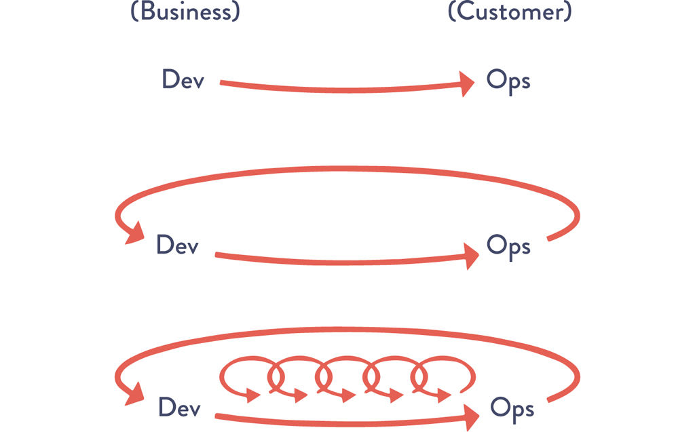

**Figure: The Three Ways, source Ch. 1.** The visual frames DevOps as three reinforcing loops: fast left-to-right flow, fast right-to-left feedback, and continual learning.

**How to read it:** Start with the value stream that turns business need into running service. Then ask how quickly work flows, how quickly the system reports problems backward, and how deliberately the organization improves the system itself.

**Why it matters:** This prevents tool-centric DevOps. A deployment pipeline, kanban board, monitoring platform, or security scanner only matters if it improves one of these loops.

**Application:** For every delivery initiative, state which loop it improves. If a CI migration does not reduce integration delay, feedback delay, or learning cost, it is probably a tooling project rather than a DevOps improvement.

**Limitations:** The model is directional and conceptual; it does not tell you which constraint to fix first. Use value-stream mapping and production data for that.

### First Way: Flow

Flow means work moves from idea to production in small, visible, controlled steps. The book repeatedly attacks hidden queues, large batches, manual handoffs, and late integration because they lengthen feedback cycles and amplify risk.

Key practices:

- Make work visible across Product, Development, QA, Operations, Security, and Compliance.
- Limit work in process.
- Reduce batch size.
- Remove or elevate constraints.
- Build deployable artifacts once and promote them through environments.
- Automate repeatable work, especially build, test, environment creation, and deployment.

### Second Way: Feedback

Feedback means the people creating changes quickly learn whether the change is correct, operable, secure, and valuable. The feedback loop should include tests, production telemetry, customer behavior, peer review, operational readiness, and security findings.

Key practices:

- Shift defect detection earlier with automated tests and CI.
- Instrument systems so production behavior is observable.
- Overlay deployments and changes onto telemetry.
- Let product teams feel operational consequences.
- Use peer review and readiness review to improve work before it hurts users.

### Third Way: Continual Learning

Continual learning means the system is improved deliberately. Incidents, near misses, local experiments, conferences, and shared standards become inputs to a larger learning loop.

Key practices:

- Run blameless postmortems.
- Create time for improvement work.
- Convert local discoveries into shared practices.
- Run experiments and chaos exercises where appropriate.
- Let teams challenge assumptions with measurements.

## Work Visibility And Constraint Management

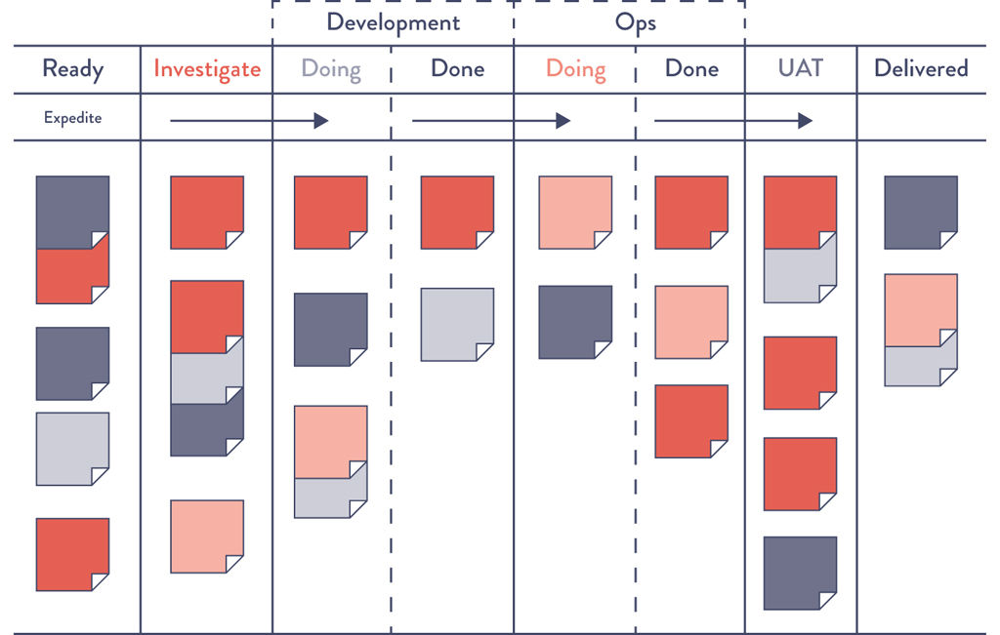

**Figure: Example kanban board, source Ch. 2.** The board spans requirements, development, test, staging, and production.

**How to read it:** The important signal is not the columns themselves. The important signal is where work waits, where queues grow, and where work bounces backward.

**Why it matters:** Technology work is easy to move invisibly. Tickets can be reassigned, blocked, or delayed without the physical visibility of manufacturing inventory. Shared boards make queues and constraints discussable.

**Application:** Include operational work, security work, defects, and unplanned work on the same board as feature work. Otherwise teams will optimize the visible work while the real constraint remains hidden.

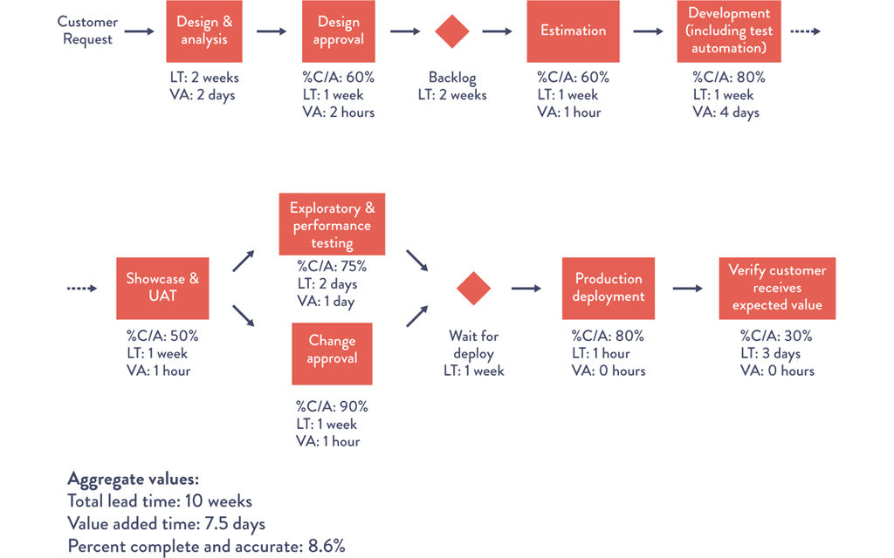

**Figure: Value stream map, source Ch. 6.** The map separates process time from waiting time and exposes where work is stuck.

**How to read it:** Compare the total elapsed lead time with the small amount of actual process time. The difference is mostly waiting, handoff, rework, approval delay, and queueing.

**Why it matters:** A team may spend only hours actively coding while the customer waits weeks for the change. Optimizing developer typing speed does little when the constraint is test environment availability, change approval, or release coordination.

**Application:** For one important service, measure: idea-to-start delay, code complete-to-integrated delay, test delay, approval delay, deploy delay, change failure rate, MTTR, and percent complete and accurate. Start improvement at the largest economically meaningful delay.

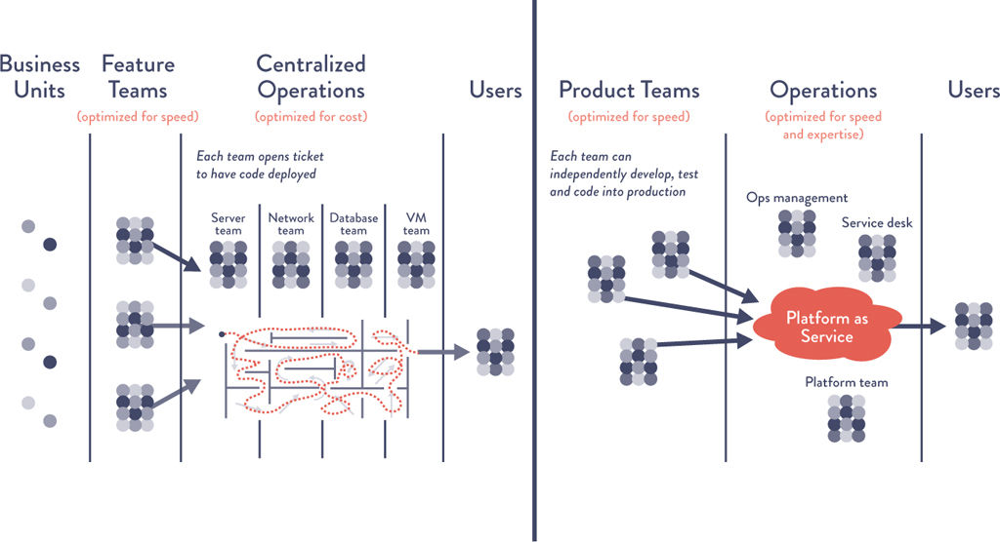

**Figure: Functional versus market orientation, source Ch. 7.** The visual contrasts centralized functional handoffs with market-oriented product teams that can deliver more independently.

**How to read it:** Functional orientation groups specialists by discipline. Market orientation groups the capabilities needed to deliver and operate a product or value stream.

**Why it matters:** Conway's Law makes team boundaries and architecture boundaries reinforce each other. If every change crosses many specialist queues, independent delivery is impossible.

**Application:** Create long-lived teams around products or value streams. Give them enough development, testing, operational, security, and product capability to own outcomes. Build platform teams only when they reduce repeated cognitive load for product teams. `[Inference]`

## Technical Practices For Flow

### Deployment Pipeline

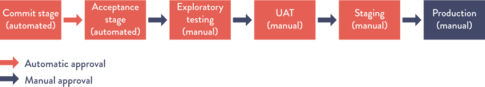

**Figure: Deployment pipeline, source Ch. 10.** The pipeline progressively validates a change before it reaches production.

**How to read it:** Each stage should either increase confidence or stop the change. The pipeline is not just automation; it is a codified theory of quality.

**Why it matters:** Late integration and manual release coordination create large batches. A pipeline lets teams integrate frequently while keeping risk visible.

**Application:** Require every change to produce one versioned artifact, pass fast automated checks, move through production-like environments, and emit enough telemetry to confirm production health after deploy.

### Testing Strategy

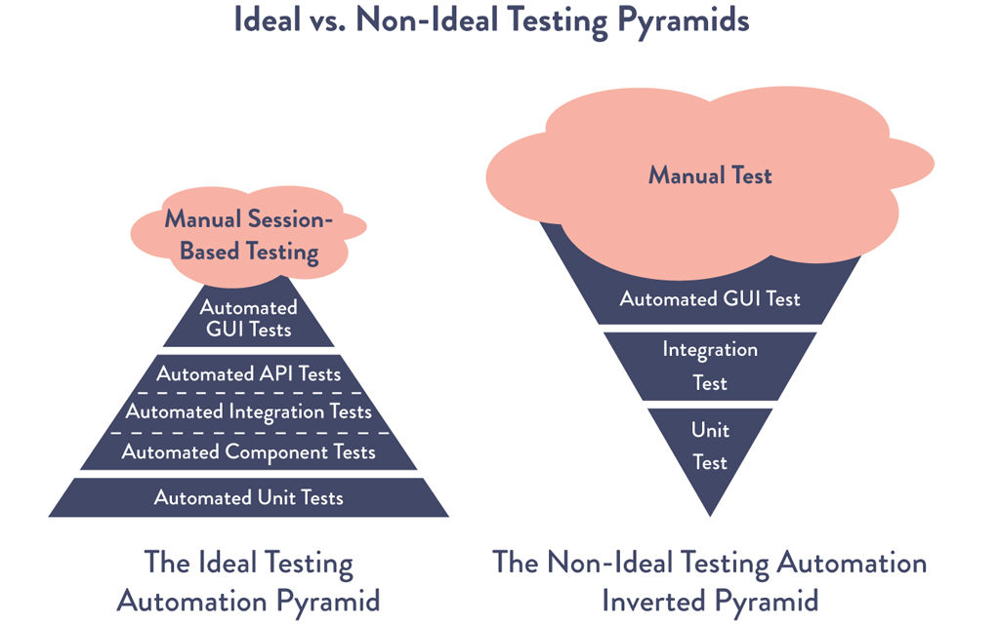

**Figure: Ideal and non-ideal automated testing pyramids, source Ch. 10.** The ideal pyramid has many fast lower-level tests and fewer expensive end-to-end tests.

**How to read it:** The shape is an economic model. Unit and component tests should catch many defects quickly. End-to-end tests are valuable but expensive and brittle when overused.

**Why it matters:** A slow, flaky test suite becomes a queue. Teams start bypassing it, batching changes, or losing trust in feedback.

**Application:** Track test duration, flake rate, defect escape rate, and the kind of defect each test layer catches. Refactor architecture when tests are hard to write; test pain often reveals coupling.

### Low-Risk Release Patterns

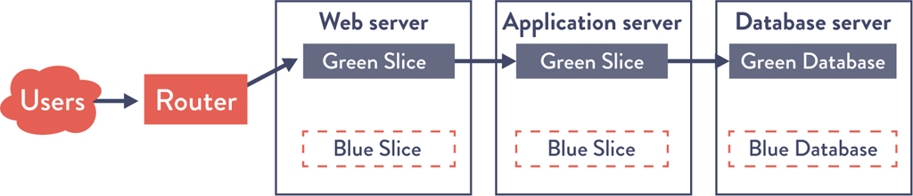

**Figure: Blue-green deployment pattern, source Ch. 12.** One environment serves production while the other receives the new version.

**How to read it:** Release risk is reduced by making cutover a routing decision rather than a large in-place mutation.

**Why it matters:** Rollback becomes simpler when the previous environment still exists. This is most useful when data migrations and external side effects are controlled.

**Application:** Use blue-green for stateless or carefully migrated services. Pair it with health checks, smoke tests, database compatibility rules, and automated rollback criteria.

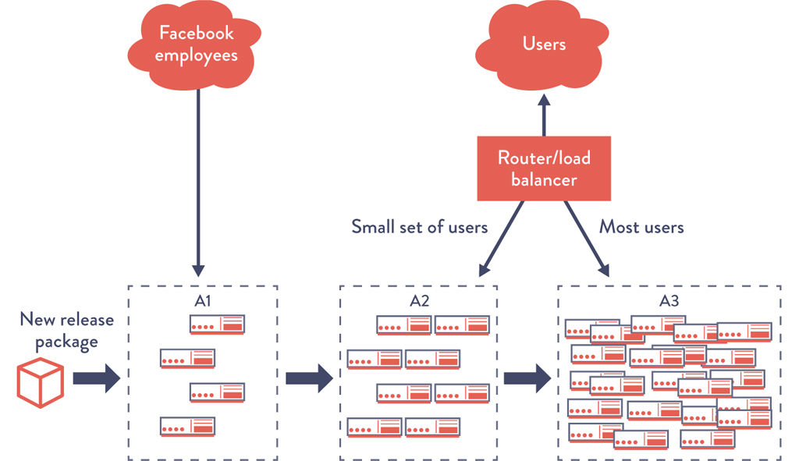

**Figure: Canary release pattern, source Ch. 12.** A new version receives traffic from limited cohorts before broader exposure.

**How to read it:** The release is an experiment. Each expansion step should have success criteria and stop criteria.

**Why it matters:** Canary releases limit blast radius and create production feedback before a full rollout.

**Application:** Segment traffic by internal users, small percentages, regions, tenants, or risk class. Do not call it a canary unless telemetry can detect degradation and automation can halt or revert the rollout. `[Inference]`

### Architecture For Low-Risk Change

The book connects architecture to deployment safety. The safest release process will not compensate for a tightly coupled system where every small change requires global coordination.

Good signs:

- Services can be built, tested, deployed, and rolled back independently.
- Teams understand operational dependencies.
- Database changes are backward compatible across versions.
- Feature flags decouple deploy from release.
- Platform capabilities make safe defaults easy.

Warning signs:

- Many teams must coordinate every release.
- Integration happens late.
- Test environments are scarce or unrealistic.
- Database schema changes are manual and risky.
- Compliance gates require document handoffs instead of evidence from the pipeline.

## Technical Practices For Feedback

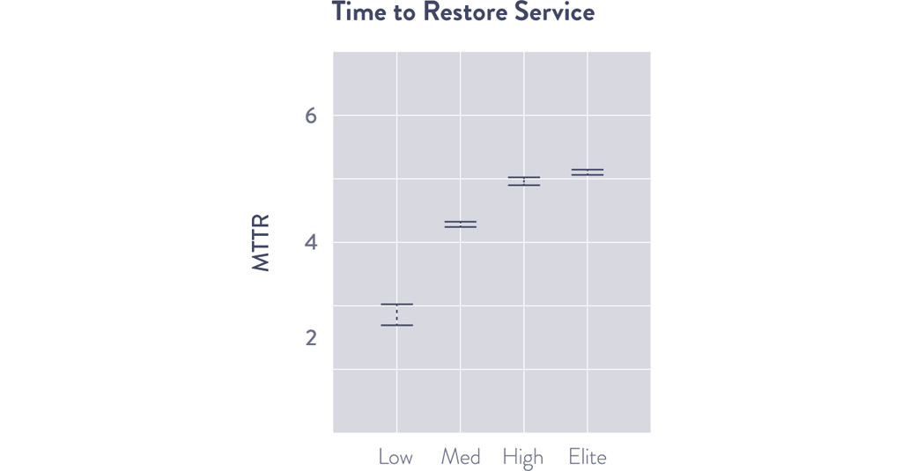

**Figure: Incident resolution time for elite, high, medium, and low performers, source Ch. 14.** The book uses this research figure to connect delivery practices with operational recovery.

**How to read it:** The message is not only that elite performers recover faster. It is that delivery, architecture, telemetry, and operational learning interact.

**Why it matters:** MTTR is a system property. It depends on detectability, diagnosability, deployability, ownership, and the ability to make safe changes under pressure.

**Application:** For each service, test whether the team can detect a failure, identify the owner, roll back or roll forward, and communicate status without heroics.

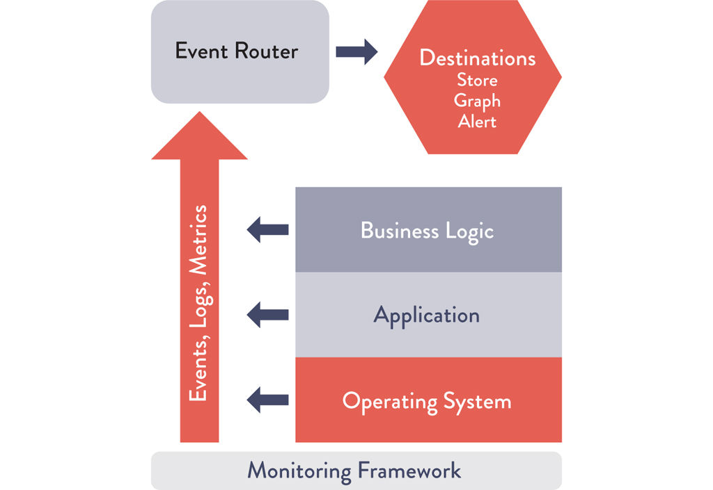

**Figure: Monitoring framework, source Ch. 14.** The monitoring model ties logs, metrics, events, and alerting into operational feedback.

**How to read it:** Telemetry should move from raw events to useful operational and business signals. Logs alone are not enough; dashboards alone are not enough.

**Why it matters:** Production feedback is the only way to know whether users are actually receiving value and whether systems are healthy.

**Application:** Instrument four layers: business outcomes, application behavior, infrastructure health, and deployment/change events. Alert only when action is needed.

### Telemetry And Anomaly Detection

The book warns against naive statistics in production monitoring. Many operational metrics are not normally distributed, so simple "three standard deviations" rules can over-alert or under-alert.

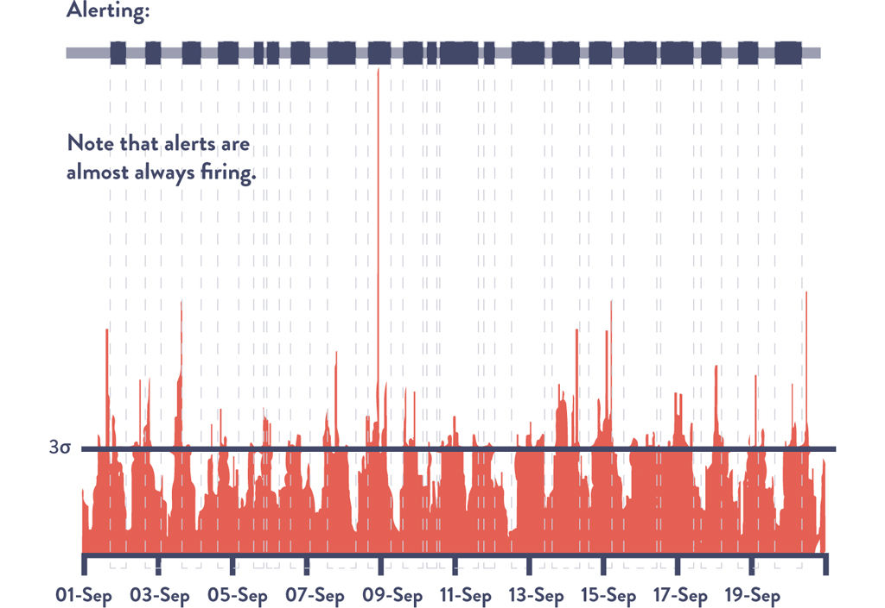

**Figure: Over-alerting when using a standard-deviation rule, source Ch. 15.** The example shows why a normal-distribution assumption can produce noisy alerts.

**How to read it:** If normal traffic has daily or weekly shape, a static statistical threshold may mark ordinary behavior as abnormal.

**Why it matters:** Alert fatigue destroys feedback. Engineers stop trusting signals and real incidents are missed.

**Application:** Use seasonality-aware thresholds, service-level indicators, burn-rate alerts, anomaly detection, or domain-specific rules where appropriate. Label this as an inference because the book gives examples rather than prescribing a single modern monitoring stack. `[Inference]`

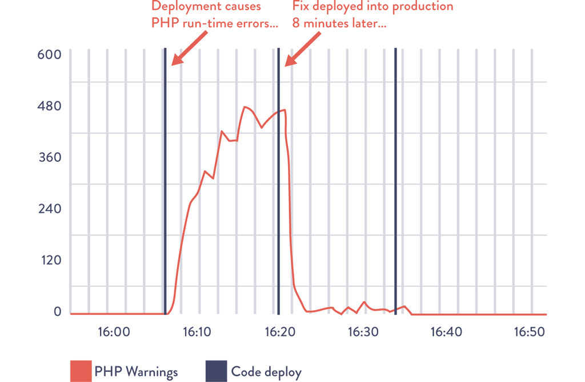

**Figure: Deployment causing PHP runtime warnings and quick fix, source Ch. 16.** Deployment markers are overlaid with production warnings.

**How to read it:** The graph makes a change-event correlation obvious. The team can connect a production symptom to the triggering deployment.

**Why it matters:** Fast restoration depends on knowing what changed. Without change markers, incident response begins with guesswork.

**Application:** Emit deploy events, config changes, feature flag changes, dependency upgrades, and infrastructure changes into the same observability surface as runtime metrics.

## Learning, Review, And Improvement

The book treats learning as a practical mechanism, not a cultural slogan. Learning enters the system through review, experiments, postmortems, internal conferences, communities of practice, and dedicated improvement capacity.

### Change Review

Peer review should be fast, close to the work, and focused on quality. Heavy external approval boards often slow delivery without materially improving safety. The better control is to make small changes, expose evidence through the pipeline, require review by people who understand the code, and keep production telemetry connected to deploys.

### Postmortems

Blameless postmortems are useful when they produce system changes. A weak postmortem says "human error" and creates reminders. A useful postmortem identifies how the system made the error likely or hard to detect, then improves tests, alerts, runbooks, automation, documentation, architecture, or ownership.

### Improvement Capacity

The book repeatedly argues for reserving capacity for work that improves future flow: technical debt reduction, test automation, platform work, telemetry, security automation, and knowledge sharing. This is not a luxury. Without it, urgent work crowds out preventive work and the downward spiral continues.

## Security, Change Management, And Compliance

The security chapters extend the same logic: security work should be visible, automated, early, self-service, and owned by everyone.

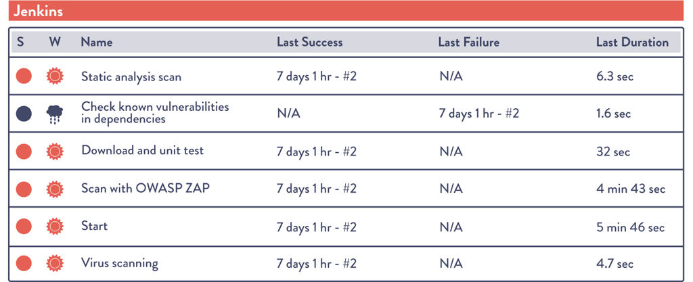

**Figure: Jenkins running automated security testing, source Ch. 22.** Security checks are part of the delivery workflow.

**How to read it:** Security findings are treated like fast feedback to engineers rather than late exceptions raised by a separate group.

**Why it matters:** Late security gates create large queues and incentives to bypass controls. Early automated controls make secure behavior easier.

**Application:** Add dependency scanning, static checks, secrets detection, policy checks, and infrastructure-as-code validation to the pipeline. Track remediation age and false positives so teams trust the signal. `[Inference]`

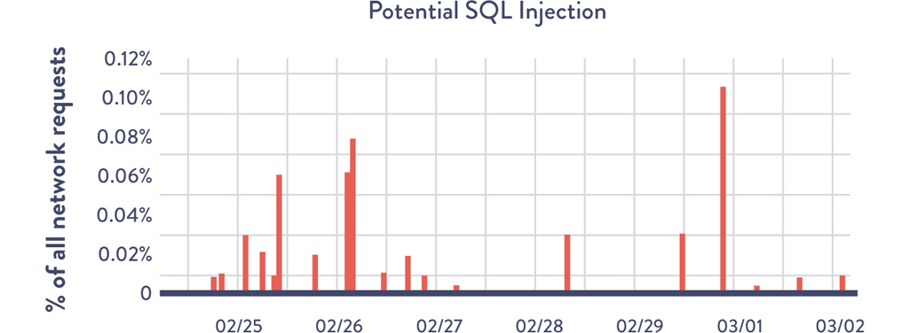

**Figure: Developers see SQL injection attempts in Graphite at Etsy, source Ch. 22.** Security-relevant activity is visible in production telemetry.

**How to read it:** Security is not only preproduction scanning. Runtime attacks and abuse patterns must be observable to product and operations teams.

**Why it matters:** Engineers make better tradeoffs when they can see how systems are attacked and how controls behave in production.

**Application:** Expose security events as operational signals: authentication failures, suspicious request patterns, WAF decisions, dependency risk, policy denials, and privilege changes.

## Decision Guides

### Where To Start

| Situation | Best Starting Point | Why | Avoid |
|---|---|---|---|
| One product has painful releases | Map that product value stream. | Concrete pain creates urgency and measurable improvement. | Starting with company-wide process mandates. |
| Many teams wait on the same platform or operations queue | Create a platform capability or self-service path. | Removes repeated constraints across teams. | Creating a platform team that becomes another ticket queue. |
| Incidents recur after every deploy | Improve deployment telemetry, automated tests, and rollback. | Restores trust in change. | Adding more manual approval without better evidence. |
| Security blocks releases late | Move security tests and policy checks into the pipeline. | Gives teams feedback while changes are still small. | Treating security as a final signoff. |
| Teams are overloaded by unplanned work | Make all work visible and reserve improvement capacity. | Exposes demand and protects system improvement. | Pretending feature velocity is real while support work is hidden. |

### Release Strategy Selection

| Strategy | Use When | Tradeoffs | Failure Modes |
|---|---|---|---|
| Simple rolling deploy | Changes are low risk, stateless, and backward compatible. | Operationally simple. | Slow rollback or partial fleet incompatibility. |
| Blue-green | You need quick cutover and rollback between environments. | Requires duplicate capacity and data compatibility planning. | Database migrations make rollback unsafe. |
| Canary | You need production validation with limited blast radius. | Requires traffic shaping and reliable telemetry. | Canary passes because the cohort is not representative. |
| Feature flags/dark launch | Deployment and business release need to be decoupled. | Adds flag lifecycle and configuration risk. | Old flags accumulate and create hidden branches. |

### Organization And Architecture

| Design Choice | Prefer It When | Be Careful When |
|---|---|---|
| Product/value-stream teams | Work needs end-to-end ownership and fast feedback. | Shared platforms are immature and every team duplicates infrastructure work. |
| Centralized platform team | Many product teams need the same safe defaults. | Platform work is measured by tickets closed instead of product-team outcomes. |
| Microservices | Teams need independent deployability and domain boundaries are clear. | The organization lacks observability, automation, and operational ownership. |
| Modular monolith | Domain is still evolving or team size is small. | Deployment coupling blocks independent flow. |

## Production Playbooks

### Playbook: Fix A Painful Release Process

1. Pick one important service with known release pain.
2. Map the value stream from idea to production.
3. Measure lead time, process time, wait time, rework, deploy frequency, change failure rate, and MTTR.
4. Make all work visible, including unplanned work.
5. Reduce batch size by integrating daily and deploying smaller changes.
6. Build or repair the deployment pipeline.
7. Add deployment markers and service health telemetry.
8. Introduce low-risk release patterns where the risk justifies the complexity.
9. Run post-release reviews focused on system improvement, not blame.
10. Re-measure and move to the next constraint.

### Playbook: Build A Useful Deployment Pipeline

1. Version everything needed to rebuild the service: code, configuration, infrastructure definitions, tests, and deployment scripts.
2. Create one immutable artifact per change.
3. Run fast checks first.
4. Run slower integration and security checks later.
5. Deploy to production-like environments automatically.
6. Keep environment creation reproducible.
7. Require deploy telemetry and rollback criteria.
8. Record evidence so audit and change management can use the pipeline output.

### Playbook: Turn Incidents Into Learning

1. Restore service first.
2. Preserve timelines, telemetry, deploy events, chat logs, and alerts.
3. Run a blameless review.
4. Ask what made the failure possible, hard to detect, hard to diagnose, and hard to repair.
5. Create concrete system changes.
6. Share the learning across teams.
7. Track whether the corrective action actually changed future behavior.

## Troubleshooting Guide

| Symptom | Likely System Cause | What To Inspect | Repair |
|---|---|---|---|
| Releases require weekends or freezes | Batch size and coordination cost are too high. | Release calendar, dependency graph, approval queue, rollback history. | Smaller deploys, CI, automated tests, release decoupling. |
| Tests are slow and ignored | Feedback loop is too expensive or unreliable. | Test duration, flake rate, failure ownership, test layer mix. | Test pyramid repair, component boundaries, quarantine policy for flaky tests. |
| Operations is overloaded | Product work creates unplanned operational demand. | Incident sources, toil, support queues, deployment events. | Product-team ownership, self-service operations, platform automation. |
| Change approval delays dominate lead time | Risk evidence is manual and late. | Change board cycle time, required artifacts, repeated approval questions. | Pipeline evidence, standard changes, automated policy checks. |
| Alerts are noisy | Telemetry does not map to user impact or action. | Alert volume, ignored alerts, false positives, missing runbooks. | SLO-based alerts, burn rates, seasonality-aware thresholds, owner mapping. |
| Security findings pile up | Security feedback is late, unactionable, or not owned. | Finding age, scanner signal quality, dependency update time. | Shift left, tune rules, make remediation part of team work. |

## Production Readiness Checklist

| Area | Good Looks Like | Warning Sign |
|---|---|---|
| Flow | Work is visible, WIP is limited, batch size is small. | Large release trains and hidden queues. |
| Pipeline | Changes produce repeatable artifacts and automated evidence. | Manual environment setup and release scripts. |
| Tests | Fast lower-level tests catch most defects early. | Overreliance on slow end-to-end tests. |
| Releases | Deploys are routine, observable, reversible, and low stress. | Releases require special events or heroics. |
| Telemetry | Service health, business metrics, and change events are visible. | Dashboards exist but do not guide action. |
| Ownership | Teams own build, run, and improvement of their services. | Developers hand off code and never see production feedback. |
| Learning | Postmortems create system changes and shared knowledge. | Repeat incidents are explained as human error. |
| Security | Security checks and evidence live in daily work. | Security is a late gate with manual documents. |

## Visual Inventory And Coverage

Extracted visuals: 84. Embedded and explained in this file: 14. Skipped or reference-only: 70.

| Visual | Asset | Decision | Reason |
|---|---|---|---|
| The Three Ways | `assets/the-devops-handbook-knowledge/00034.jpeg` | Include | Core model for the whole book. |
| Kanban board | `assets/the-devops-handbook-knowledge/00037.jpeg` | Include | Makes invisible work and WIP visible. |
| Value stream map | `assets/the-devops-handbook-knowledge/00044.jpeg` | Include | Central diagnostic tool for flow. |
| Functional vs market orientation | `assets/the-devops-handbook-knowledge/00046.jpeg` | Include | Connects Conway's Law to team design. |
| Deployment pipeline | `assets/the-devops-handbook-knowledge/00049.jpeg` | Include | Central flow practice. |
| Testing pyramids | `assets/the-devops-handbook-knowledge/00050.jpeg` | Include | Explains feedback economics. |
| Blue-green deployment | `assets/the-devops-handbook-knowledge/00056.jpeg` | Include | Key low-risk release pattern. |
| Canary release | `assets/the-devops-handbook-knowledge/00057.jpeg` | Include | Key blast-radius control pattern. |
| Incident resolution by performer group | `assets/the-devops-handbook-knowledge/00065.jpeg` | Include | Connects DevOps practice to operability. |
| Monitoring framework | `assets/the-devops-handbook-knowledge/00066.jpeg` | Include | Anchors telemetry guidance. |
| Over-alerting example | `assets/the-devops-handbook-knowledge/00070.jpeg` | Include | Shows monitoring failure mode. |
| Deployment correlated with warnings | `assets/the-devops-handbook-knowledge/00077.jpeg` | Include | Shows feedback during release. |
| Security testing in Jenkins | `assets/the-devops-handbook-knowledge/00085.jpeg` | Include | Shows security as pipeline feedback. |
| SQL injection in telemetry | `assets/the-devops-handbook-knowledge/00089.jpeg` | Include | Shows security observability. |
| Covers, case-study portraits, repeated small callout icons, appendix-only variants, and vendor-specific screenshots | multiple | Skip/reference-only | Useful in source context but not necessary to teach the reusable engineering model here. |

## Gaps To Research Next

- Current DORA metrics and capability research.
- Modern SLO and burn-rate alerting practices.
- Current supply-chain security practices: SBOMs, SLSA, artifact signing, provenance, and dependency update automation. `[Inference]`
- Platform engineering practices that preserve product-team ownership while reducing cognitive load. `[Inference]`
- Modern change-management patterns for regulated environments using automated evidence. `[Inference]`
