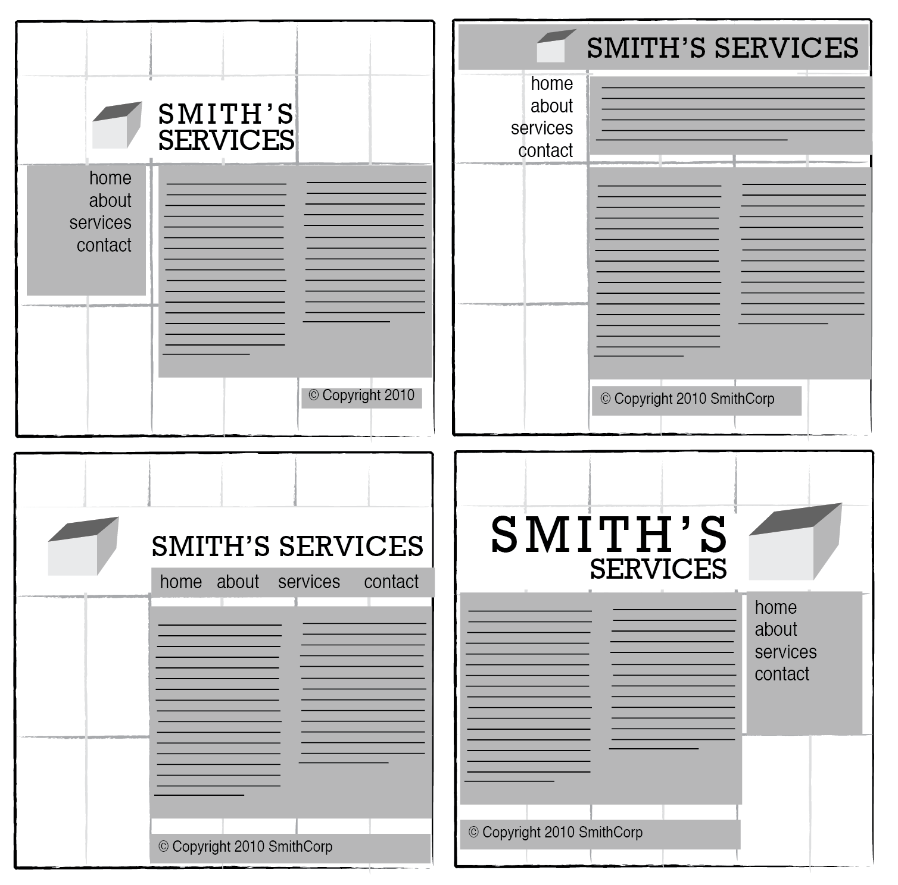
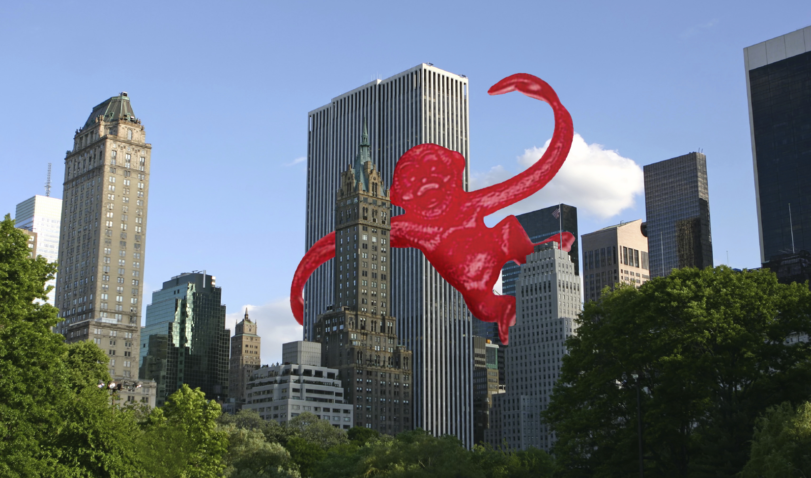
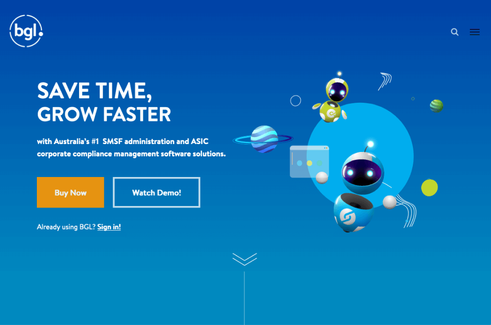
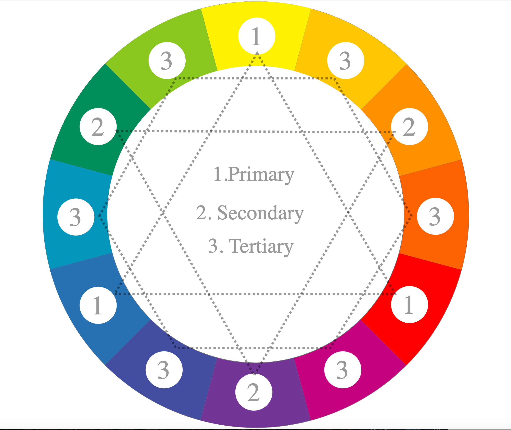
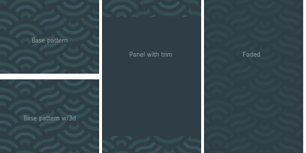
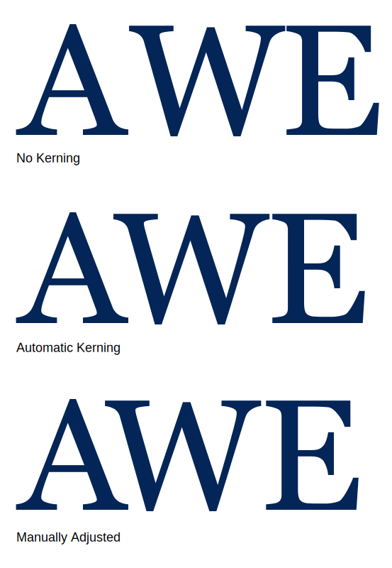
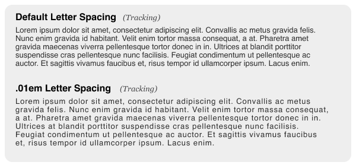
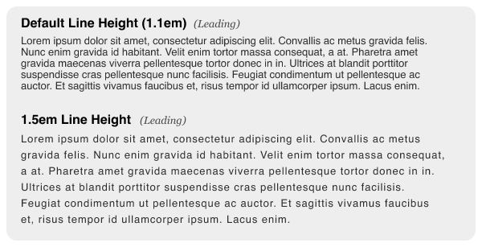
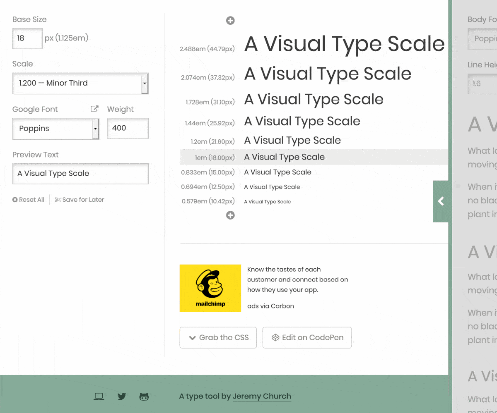
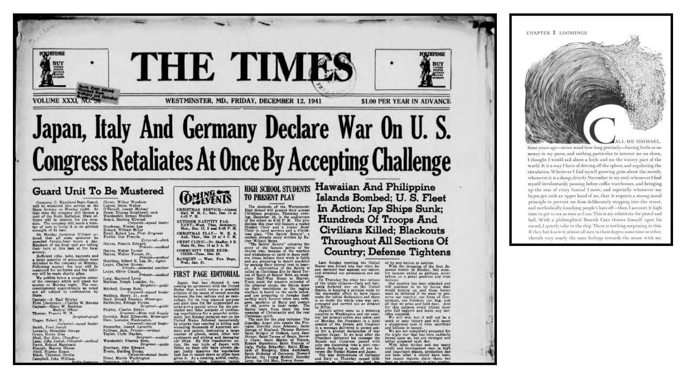

# The Principles of Beautiful Web Design Knowledge
 
Detected title: The Principles of Beautiful Web Design, 4th Edition  
Author: Jason Beaird;
Primary domains: visual web design, layout, composition, color, texture, typography, imagery, responsive design

Use this file as the source-grounded knowledge base behind the `web-design` skill. It is not a chapter summary. It converts the source into mental models, decision rules, review heuristics, and implementation guidance for real web interfaces.

## 1. Learning Roadmap

Study the material as a layered system:

1. Start with discovery and information architecture. A visual direction cannot be evaluated until the content, audience, business goal, and navigation structure are understood.
2. Build the spatial system next. Layout, whitespace, grids, balance, unity, emphasis, and proportion create the frame that every later decision must fit.
3. Add color as communication, not decoration. Color should support mood, hierarchy, affordance, brand, contrast, and legibility.
4. Use texture and shape to add character carefully. Texture can create depth, rhythm, and identity, but it can also add noise.
5. Treat typography as infrastructure. Type choices, size scales, spacing, rhythm, and fallback behavior determine whether the interface remains readable and coherent.
6. Choose imagery as evidence and emphasis. Images should answer user questions, create memory hooks, and support the message rather than merely filling space.

After studying this material, an engineer should be able to critique a UI for visual hierarchy, choose a layout pattern intentionally, build a restrained palette, define a type system, select imagery with licensing awareness, and iterate from mobile to larger screens without stuffing every desktop element into mobile.

## 2. Core Mental Models

| Mental Model | Explanation | Helps Solve | Example | Common Misuse | Source Reference |
|---|---|---|---|---|---|
| Design is relationship management | Good design comes from the relationships among elements, not from isolated styling choices. | Avoids superficial redesigns. | Changing a background color does not fix weak navigation, type, spacing, or image choices. | Treating design as a cosmetic layer after functionality is done. | Preface |
| Discovery before pixels | The designer must understand the client, audience, content, goals, competitors, and constraints before composing the interface. | Prevents attractive but inappropriate designs. | Interviewing a client about goals, target audience, competitors, existing brand, dislikes, and redesign concerns. | Asking for design opinions too early before understanding the problem. | Chapter 1, Discovery |
| Layout is content choreography | Spatial arrangement guides attention, reveals relationships, and controls effort. | Makes pages scannable and navigable. | Grouping related information with proximity and using whitespace to separate tasks. | Filling available space because it exists. | Chapter 1 |
| Emphasis needs a reason | Focal points should align with the page's communication goal. | Avoids visual competition. | Using placement, isolation, contrast, and continuance to lead the eye from a hero image into content. | Making many elements visually loud at once. | Chapter 1; Chapter 5 |
| Color carries associations and structure | Color affects mood, semantics, grouping, and contrast. | Builds a palette that feels intentional. | Choosing analogous colors for harmony or complementary accents for contrast. | Choosing colors only because they are liked by the maker. | Chapter 2 |
| Typography is a system | Fonts, scale, line height, spacing, and fallback behavior must work together across devices. | Produces durable readability. | Defining body, heading, and UI text sizes with backups and vertical spacing rules. | Selecting a display font before checking body readability and fallback behavior. | Chapter 4 |
| Imagery must earn its space | A strong image is relevant, interesting, or appealing, and ideally satisfies at least two of those. | Prevents generic visual filler. | Product photography that answers size, packaging, material, and usage questions at a glance. | Using stock images that look polished but reveal nothing useful. | Chapter 5 |

## 3. Deep Concept Notes

### Discovery, Exploration, Implementation

- **Explanation:** The source frames design as a three-part process: learn the problem, organize possibilities, then create the visual comp.
- **Problem solved:** Prevents premature visual choices disconnected from audience and content.
- **How it works:** Discovery gathers client and audience facts. Exploration organizes content and navigation, often with sketches or movable notes. Implementation turns the structure into a layout, ideally beginning away from code so composition can be solved before browser constraints dominate.
- **Why it matters:** UI work fails when it is attractive but not aligned with the user's task or the product's communication goal.
- **When to use:** Any new website, redesign, marketing page, app surface, or feature page with ambiguous content hierarchy.
- **When not to use:** Do not extend discovery indefinitely when the task is a small visual adjustment with known constraints.
- **Tradeoffs:** Upfront discovery costs time but reduces churn and subjective revision cycles.
- **Common mistakes:** Starting in CSS before knowing the content; asking the client to pick visual treatments before clarifying goals.
- **Production example:** Before redesigning an onboarding flow, inventory user goals, required information, drop-off points, device mix, and brand expectations, then sketch competing flows before polishing.
- **Questions to ask:** Who is the primary user? What is the page's main action? What information must be first visible? What should be de-emphasized?
- **Source reference:** Chapter 1, The Design Process, Discovery, Exploration, Implementation.

### Page Anatomy And Spatial Hierarchy

**Figure: Page anatomy.** The visual separates containing block, logo, navigation, content, and footer as structural zones.

**How to read it:** Look for whether the page has a clear container, a recognizable identity point, navigational affordances, a content body, and supporting footer information.

**Why it matters:** These zones are common because they map to user questions: Where am I? What can I do? What is the content? Where are secondary links?

**How to apply it:** When reviewing a page, mark these zones and test whether each is visually distinct without becoming disconnected. Preserve enough consistency across pages that users recognize they are still inside the same site.

**Limitations:** The anatomy is a baseline, not a mandate. Product tools, games, editorial sites, dashboards, and immersive pages may rearrange or suppress zones intentionally.

### Grid, Whitespace, And Proportion

**Figure: Grid examples.** The visual shows how repeated columns and gutters create placement logic.

**How to read it:** The grid is not decoration; it is a decision surface for alignment, rhythm, and content grouping.

**Why it matters:** Grids reduce arbitrary placement, make responsive behavior easier, and give separate components a shared visual order.

**How to apply it:** Define a small set of layout tracks and spacing tokens. Use them to align headers, content blocks, media, forms, and repeated items. Break the grid only when the break creates meaningful emphasis.

**Figure: Proportion in composition.** The visual demonstrates that relative size affects attention and visual comfort.

**How to apply it:** Use proportional decisions for hero/content balance, sidebar/main balance, image/text balance, and heading/body contrast. Mathematical ratios can guide composition, but user task clarity should win over formula worship.

### Balance, Unity, And Emphasis

**Figure: Asymmetrical balance.** The visual illustrates that balance does not require mirrored halves.

**How to read it:** Evaluate visual weight. Size, color, contrast, density, and position can balance each other across the page.

**How to apply it:** Pair a large quiet region with a smaller high-contrast region, or balance dense text with open space and a strong image. Asymmetry can feel accidental unless alignment and hierarchy are deliberate.

**Figure: Continuance.** The visual shows how line, direction, and implied motion can lead attention.

**Why it matters:** Users scan. Directional cues reduce effort and can connect separate areas into a coherent journey.

**How to apply it:** Use image direction, angled elements, repeated alignment, or layout flow to lead from headline to proof to action.

**Figure: Contrast.** The visual demonstrates separation through difference.

**How to apply it:** Reserve high contrast for primary actions, active states, important warnings, and section breaks. Use lower contrast for supporting content. Too much contrast everywhere destroys hierarchy.

### Color Systems

**Figure: Color wheel.** The visual anchors hue relationships used for palette construction.

**How to read it:** Neighboring hues tend to harmonize; opposing hues create strong contrast; triadic and split-complementary arrangements broaden a palette while retaining structure.

**How to apply it:** Choose a base color from brand or mood, then derive support colors through a known relationship. Use neutrals and spacing to prevent the palette from overpowering content. Verify contrast and audience expectations.

**Figure: Split-complementary scheme.** The visual shows a base hue paired with two hues adjacent to its complement.

**Why it matters:** It can create vivid interfaces without the vibration or harshness that direct complementary pairs can produce.

**How to apply it:** Use the base as the dominant brand color, one split complement for action or emphasis, and the other sparingly for secondary accents.

### Texture, Shape, And Motif

**Figure: Pattern.** The visual demonstrates repeated marks as texture.

**How to apply it:** Use texture at low intensity behind content, in illustrations, or as a recurring motif. Keep text legibility and visual noise under control.

**Figure: Pattern application.** The visual shows how a motif can become a repeatable identity element.

**How to apply it:** Define where motif usage is allowed: section dividers, empty states, subtle backgrounds, illustration framing, or campaign surfaces. Avoid placing motifs near dense UI controls when they compete with work.

### Typography System

**Figure: Kerning.** The visual shows spacing adjustment between specific letter pairs. Inspect large display type manually; avoid blanket negative letter spacing as a substitute for selecting an appropriate typeface.

**Figure: Tracking.** The visual shows uniform letter spacing across text. Use tracking intentionally for labels or display treatments, but keep regular body text at normal letter spacing.

**Figure: Line height.** The visual shows the vertical distance between text lines. Body text usually needs more generous line height than large headings; test across breakpoints, fonts, and content lengths.

**Figure: Type scale.** The visual demonstrates a hierarchy of related type sizes. Define body, small, label, heading, display, and numeric styles with line height, weight, and allowed use.

### Imagery Selection And Presentation

**Figure: Camera image used for direction and emphasis.** The source uses this idea to show that image angle can guide the eye.

**How to apply it:** Check whether portraits, products, vehicles, devices, and illustrations face into the composition and support the next focal point. Direction is only one factor; relevance, appeal, and content value still matter.

**Figure: Cropping.** The visual demonstrates how cropping changes emphasis. Crop to support the message and composition while preserving necessary product or content context.

**Figure: Image format comparison.** The visual supports format and resolution decisions. Browser support and image formats have evolved since the source edition; verify current production choices before implementation.

## 4. Chapter-by-Chapter Knowledge Extraction

### Chapter 1: Layout and Composition

- **Main lesson:** Layout begins with problem discovery and content organization; composition principles turn that understanding into a usable page.
- **Key concepts:** Discovery, exploration, implementation, good design, page anatomy, whitespace, grid theory, rule of thirds, balance, unity, proximity, repetition, emphasis, placement, continuance, isolation, contrast, proportion, responsive design.
- **Details readers may miss:** The source discourages technology-first implementation. It recommends sketching and grouping information before committing to HTML, CMS, or framework constraints.
- **Design decisions taught:** Choose layout patterns based on navigation complexity, content density, and user path. Use grids and whitespace to make the layout feel intentional.
- **Risks:** Burying important information too deeply, overwhelming visitors with options, copying trends without fit, and forcing desktop content into mobile.

### Chapter 2: Color

- **Main lesson:** Color communicates mood and structure and should be chosen through a repeatable palette method.
- **Key concepts:** Color associations, temperature, value, saturation, primary/subtractive models, monochromatic, analogous, complementary, split-complementary, triadic, tetradic palettes, hex notation, contrast tools.
- **Details readers may miss:** Palette harmony does not guarantee usability. Value contrast and accessibility checks are separate responsibilities.
- **Design decisions taught:** Decide whether the interface needs calm harmony, high contrast, brand intensity, or restrained support for content.
- **Risks:** Over-relying on color psychology, using direct complements at full intensity, and building palettes without neutral support.

### Chapter 3: Texture

- **Main lesson:** Texture is built from points, lines, shapes, volume, depth, and pattern; it should support identity and attention without interfering with content.
- **Key concepts:** Point, line, shape, CSS-drawn forms, rotation, direction, perspective, proportion, shadow, flat design, pattern, retro treatments, halftones, SVG motifs.
- **Details readers may miss:** The source treats texture broadly. It is not only background noise; it includes structural lines, shapes, and visual movement.
- **Design decisions taught:** Choose whether the interface needs material richness, playful motif, editorial character, or a flat utilitarian surface.
- **Risks:** Decorative noise, dated filters, excessive skeuomorphism, and texture that harms legibility.

### Chapter 4: Typography

- **Main lesson:** Typography on the web is a system spanning font sourcing, fallback behavior, letter anatomy, spacing, type categories, scale, and responsive concerns.
- **Key concepts:** Web-safe fonts, font stacks, self-hosted fonts, font services, letterform anatomy, kerning, tracking, line height, alignment, serif/sans/script/monospace/novelty categories, type scale, baseline rhythm.
- **Details readers may miss:** Hosted fonts can fail; fallback stacks are still a production concern.
- **Design decisions taught:** Select fonts for purpose and robustness, define a type system, and use scale and vertical rhythm as practical tools rather than rigid rules.
- **Risks:** Too many fonts, poor fallbacks, tiny mobile text, decorative novelty fonts in body content, and line lengths or line heights that make reading tiring.

### Chapter 5: Imagery

- **Main lesson:** Imagery should be relevant, interesting, or appealing, and image sourcing and presentation are part of design quality.
- **Key concepts:** Relevance, interest, appeal, legitimate image sources, DIY imagery, stock photography, professional help, misuse of search images, hotlinking, clip art, cropping, adjustments, filters, formats, resolution.
- **Details readers may miss:** Image direction and crop are compositional decisions, not post-processing details.
- **Design decisions taught:** Choose images that answer questions, create a memorable hook, or reinforce emotional tone. Respect licensing.
- **Risks:** Generic stock imagery, illegal image sourcing, hotlinking, unclear product photos, format misuse, and over-filtered visuals.

## 5. Design Decision Guide

| Decision | Choose Option A When | Choose Option B When | Key Tradeoffs | Failure Risks | Questions To Ask |
|---|---|---|---|---|---|
| Symmetrical layout vs asymmetrical layout | Use symmetry when stability, formality, and predictable scanning matter. | Use asymmetry when the page needs energy, editorial rhythm, or a strong focal composition. | Symmetry is calm but can be static; asymmetry is dynamic but harder to control. | Accidental imbalance or dull sameness. | What should the user notice first? Does the visual weight feel stable? |
| Dense layout vs spacious layout | Use density for dashboards, data tools, and repeated workflows. | Use spacious layouts for learning, marketing, editorial, or high-emphasis flows. | Density improves throughput; space improves clarity and focus. | Clutter or wasted first viewport. | Is the user scanning many items or making one important decision? |
| Monochromatic/analogous vs complementary/split palette | Use harmony when content or product work should stay calm. | Use contrast when actions, offers, or brand energy need emphasis. | Harmony reduces noise; contrast creates focal power. | One-note palette or visual vibration. | What role does each color play? Are action colors distinct? |
| Flat surface vs textured surface | Use flat design for utilitarian tools and high-density interfaces. | Use texture for brand character, editorial warmth, or playful identity. | Flat surfaces are clean; texture adds personality. | Sterility or noise. | Does texture help users understand or remember the experience? |
| System font vs hosted/custom font | Use system fonts when performance, reliability, and native feel matter. | Use hosted/custom fonts when brand voice or editorial character depends on type. | System fonts are robust; custom fonts add identity but need loading and fallbacks. | Flash, failure, slow rendering, licensing issues. | What happens if the custom font fails? |
| Stock imagery vs custom imagery | Use stock when budget, time, or generic subject matter allows it. | Use custom imagery when product specificity, authenticity, or brand ownership matters. | Stock is fast; custom is more relevant. | Generic images or excessive cost. | Does the image answer a real user question? Is the license valid? |

## 6. Applying This Knowledge

### Improve A Weak Existing Page

1. Clarify the page's goal, audience, primary action, content inventory, and current pain points.
2. Mark page anatomy: identity, navigation, main content, supporting content, footer, and calls to action.
3. Identify focal order. If everything competes, reduce contrast, size, color, or density on secondary elements.
4. Normalize spacing and alignment using a grid or spacing token set.
5. Audit color roles: brand, background, text, border, muted text, primary action, secondary action, warning/error/success.
6. Replace arbitrary type sizes with a small type scale and test line length and line height.
7. Evaluate images for relevance, interest, and appeal. Remove decorative filler.
8. Check responsive behavior from mobile first; remove or defer desktop-only content that harms mobile clarity.
9. Validate contrast, text fit, loading behavior, and image quality.

### Create A New Visual Direction

1. Run discovery: product goals, audience, competitors, tone, content types, constraints.
2. Collect references grouped by layout, color, type, texture, and imagery.
3. Sketch several layout options before code.
4. Select a layout pattern and grid that match content and navigation complexity.
5. Pick a base palette and define roles before adding more hues.
6. Select typography for body readability first, then headings and display moments.
7. Choose texture or motif only if it supports the brand character.
8. Source or create imagery that answers user questions and supports composition.
9. Build the comp/prototype and review against the original discovery notes.

## 7. Current-System Review Checklist

| Area | Inspect | What Good Looks Like | Warning Signs | Improvement Options |
|---|---|---|---|---|
| Layout | Page zones, hierarchy, alignment, spacing, grid behavior | Users can predict where identity, navigation, content, and actions live. | Random spacing, floating elements, crowded first viewport. | Define layout tracks and spacing tokens. |
| Navigation | Labels, grouping, depth, active states | Users understand where they are and what they can do next. | Too many top-level choices, hidden key content. | Re-group IA and simplify labels. |
| Emphasis | Primary focal point and action order | One or two elements clearly lead. | Many saturated colors, large headings, or buttons competing. | Reduce secondary emphasis. |
| Color | Palette roles, contrast, semantic colors | Colors have jobs and meet contrast needs. | Decorative colors with no system. | Create role-based tokens. |
| Texture | Backgrounds, borders, shadows, motifs | Texture supports brand without harming readability. | Noise behind text, dated filters. | Lower opacity, remove, or constrain texture. |
| Typography | Font loading, fallback, scale, line height, measure | Text is readable and hierarchy is consistent. | Too many fonts, arbitrary sizes, cramped lines. | Define type tokens and fallbacks. |
| Imagery | Relevance, interest, appeal, crop, source rights | Images clarify, attract, or support memory. | Generic stock, illegal sourcing, awkward crops. | Replace with specific product or contextual imagery. |
| Responsive | Mobile information order and fit | Mobile has a deliberate hierarchy, not a squeezed desktop. | Overflow, hidden key actions, cramped cards. | Re-prioritize content mobile first. |

## 8. Future-System Design Questions

- What user decision or task must this screen support?
- What content must be visible before interaction?
- Which visual element should receive first attention?
- What layout pattern matches the content structure?
- What spacing system and grid will keep later additions coherent?
- What emotional tone should the palette carry, and what accessibility constraints apply?
- What body font is readable, robust, and aligned with the product voice?
- What imagery would answer user questions rather than merely decorate?
- What should disappear, collapse, or change order on mobile?
- Which visual choices are durable, and which are trend-dependent?

## 9. Technology Mapping

| Concept Or Need | Technology Option | When To Use | Watch Outs | Alternatives | Source Reference |
|---|---|---|---|---|---|
| Responsive layout | CSS media queries | Use to change layout by viewport or device conditions. | Avoid merely squeezing desktop layout into mobile. | Container queries, responsive CSS framework utilities. | Chapter 1 |
| Scalable line art | SVG | Use for logos, icons, motifs, and crisp scalable shapes. | SVG can be complex, inaccessible, or heavy if unmanaged. | CSS shapes, icon fonts, raster images. | Chapter 1; Chapter 3 |
| Grid system | CSS Grid, Flexbox, or framework grids | Use to create alignment and responsive tracks. | Frameworks can impose generic layouts. | Hand-authored layout tokens. | Chapter 1 |
| Color palette | Hex colors and design tokens | Use to define durable roles. | Hex values alone do not express purpose. | HSL/OKLCH tokens, CSS custom properties. | Chapter 2 |
| Web typography | `font-family`, `@font-face`, hosted font services | Use custom or hosted fonts when brand/type voice matters. | Licensing, loading failure, fallbacks. | System font stack. | Chapter 4 |
| Image optimization | Raster/vector formats, compression, responsive image delivery | Use appropriate formats for photos, graphics, transparency, and scaling. | Format advice changes over time; verify current browser support. | CDN image services, modern formats. | Chapter 5 |

## 10. Failure Modes And Troubleshooting

| Symptom | Likely Cause | Diagnostic Questions | Repair |
|---|---|---|---|
| Page feels cluttered | Weak hierarchy, too little whitespace, too many emphasized elements | What is the first focal point? Which elements can become quieter? | Increase grouping, reduce contrast on secondary items, add spacing. |
| Page feels generic | No visual relationship to content, brand, or audience | Which choices came from discovery? | Introduce a fitting type, palette, motif, or imagery direction. |
| Mobile layout feels cramped | Desktop content order copied into narrow viewport | What can be removed, deferred, or reordered? | Redesign mobile hierarchy first. |
| Palette feels chaotic | Hues chosen independently | What is the base hue and relationship model? | Rebuild palette with roles and a color relationship. |
| Text is tiring to read | Poor line height, line length, font choice, or contrast | What is the measure? Does line height match size? | Adjust type scale, measure, weight, and contrast. |
| Images look polished but irrelevant | Stock imagery chosen for appeal only | Does the image answer a user question? | Replace with product-specific or content-specific imagery. |

## Visual Inventory And Coverage

| Source Section | Caption Or Nearby Heading | Asset Path | Visual Type | Engineering Value | Target Section | Decision | Reason |
|---|---|---|---|---|---|---|---|
| Chapter 1, Web Page Anatomy | Page anatomy | `layout-anatomy.png` | Annotated page diagram | High | Page Anatomy | Include and explain | Teaches common page regions and review vocabulary. |
| Chapter 1, Grid Theory | Grid examples | `layout-gridexamples.png` | Layout diagram | High | Grid, Whitespace, Proportion | Include and explain | Teaches alignment and column logic. |
| Chapter 1, Balance | Asymmetrical balance | `layout-balance-asymmetrical.png` | Layout example | High | Balance | Include and explain | Teaches non-mirrored visual weight. |
| Chapter 1, Continuance | Continuance | `continuance.png` | Principle diagram | High | Emphasis | Include and explain | Teaches eye path. |
| Chapter 1, Contrast | Contrast | `contrast.png` | Principle diagram | High | Emphasis | Include and explain | Teaches hierarchy through difference. |
| Chapter 1, Proportion | Proportion | `layout-proportion.png` | Layout example | High | Proportion | Include and explain | Teaches scale relationships. |
| Chapter 1, Project | Sitemap | `sitemap.png` | IA diagram | Reference | Chapter 1 | Extracted but not embedded | Useful project artifact, but less central than principle diagrams. |
| Chapter 2, Color Theory | Color wheel | `colorwheel.png` | Color model | High | Color Systems | Include and explain | Teaches hue relationships. |
| Chapter 2, Split-complementary | Split complementary | `color-splitcomp.png` | Color scheme | High | Color Systems | Include and explain | Teaches practical contrast without direct complement harshness. |
| Chapter 2, Saturation | Saturation | `saturation.svg` | Color property diagram | Reference | Color Systems | Extracted but not embedded | Useful, but covered textually to keep main file focused. |
| Chapter 3, Pattern | Pattern | `pattern.png` | Texture diagram | High | Texture | Include and explain | Teaches repeated motif as texture. |
| Chapter 3, SVG Patterns | Pattern application | `pattern-application.svg` | Motif diagram | High | Texture | Include and explain | Teaches reusable motif application. |
| Chapter 4, Kerning | Kerning | `kerning.svg` | Typography diagram | High | Typography | Include and explain | Teaches optical spacing in display type. |
| Chapter 4, Tracking | Tracking | `tracking.svg` | Typography diagram | High | Typography | Include and explain | Teaches global letter spacing. |
| Chapter 4, Line height | Line height | `line-height.svg` | Typography diagram | High | Typography | Include and explain | Teaches vertical reading comfort. |
| Chapter 4, Type scale | Type scale | `typescale-2.gif` | Type system example | High | Typography | Include and explain | Teaches related type sizes. |
| Chapter 5, Imagery | Camera eye | `imagery-camera.png` | Image composition example | High | Imagery | Include and explain | Teaches direction and focal path. |
| Chapter 5, Cropping | Banana crop | `imagery-crop-banana1.png` | Cropping example | High | Imagery | Include and explain | Teaches crop as composition. |
| Chapter 5, Formats | Format comparison | `format.jpg` | Image format example | High | Imagery | Include and explain | Teaches format decisions. |
| Chapter 5, Formats | Format comparison 2 | `format-2.jpg` | Image format example | Reference | Imagery | Extracted but not embedded | Companion visual; main concept covered by first format image. |

Coverage report:

- EPUB visual assets discovered: 256.
- Assets extracted for review/use: 20.
- Embedded and explained in this knowledge file: 15.
- Extracted but summarized or held as reference-only: 5.
- Skipped: 236.
- Main skip reasons: decorative examples, website screenshots used as inspiration rather than reusable principle diagrams, covers/logos, repeated project screenshots, low-value UI captures, and visual examples whose source lesson is captured better by another embedded visual.
- Manual review needed: none for this generated knowledge file. For production use of embedded assets beyond local learning, verify copyright/licensing.
