# Web Design Playground - Engineering Knowledge

- **Detected title:** *Web Design Playground, Second Edition*
- **Author:** Paul McFedries
- **Publisher and year:** Manning Publications, 2024
- **Source file:** `Web Design Playground.pdf`
- **Document type:** PDF, 442 physical pages, full text extracted with Python `pypdf`.
- **Primary domains:** HTML, CSS, web page structure, text formatting, images, media, CSS units, floats and positioning, the CSS box model, Flexbox, Grid, responsive design, color, typography, advanced selectors, validation, and publishing static pages.
- **How to use this file:** Use it as a practical frontend foundation guide. The source teaches by building pages in a browser-based playground; this knowledge file converts the lessons into reusable mental models, implementation playbooks, review criteria, and troubleshooting checks.
- **Relationship to existing web design knowledge:** The local *Principles of Beautiful Web Design* file is strongest on visual design theory. This file complements it with HTML/CSS mechanics and project implementation workflow.

## 1. Learning Roadmap

The book is organized as a progression from markup basics to complete responsive projects. The durable learning path is not "memorize tags and properties"; it is **turn content into semantic structure, then progressively add presentation, layout, responsiveness, polish, validation, and deployment discipline**.

1. **Start with document mechanics.** HTML creates meaning and structure; CSS selects that structure and changes presentation. Learn elements, attributes, nesting, headings, paragraphs, lists, links, and the relationship between source order and rendered page.
2. **Build the first complete page early.** The source quickly moves from definitions to a working page. This is important because web design decisions are interdependent: typography, color, images, links, and spacing only make sense inside a real page.
3. **Learn CSS as a cascade and box system.** Selectors target elements; declarations set values; the cascade resolves conflicts; boxes define content, padding, border, margin, width, and height.
4. **Use old layout tools intentionally.** Floats and positioning are still useful for text wrap, badges, sticky affordances, and controlled offsets, but they are poor defaults for full-page layout.
5. **Use Flexbox and Grid for modern layout.** Flexbox is best for one-dimensional distribution. Grid is best when rows and columns matter together.
6. **Make responsive behavior a first-class requirement.** Media queries, fluid dimensions, responsive images, and responsive typography turn one design into a range of usable layouts.
7. **Polish with color, type, selectors, and validation.** Advanced work is not decorative only; it is where consistency, maintainability, readability, and production readiness appear.
8. **Move from playground to web carefully.** Local pages need folder organization, validation, hosting, and upload workflow before they become reliable public artifacts.

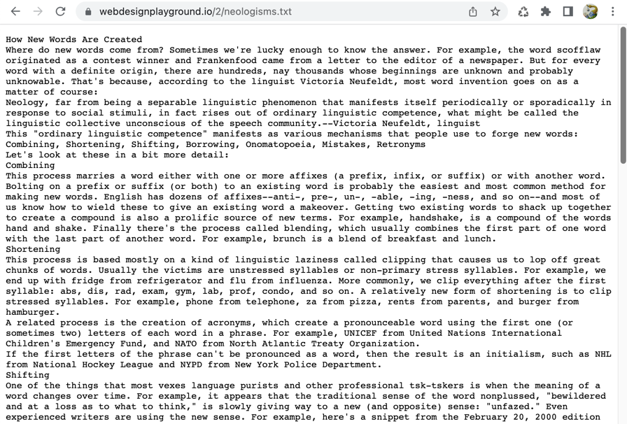

**Figure: Playground interface.** The book is built around immediate experimentation: HTML, CSS, preview, lesson text, menu, and save/download actions live in one workflow.

**How to apply it:** Treat the playground as a feedback loop: edit one small thing, observe the rendered result, then name the concept that changed. This prevents passive reading and makes CSS behavior concrete.

**Limitations:** The interface is a learning environment, not a production toolchain. Real projects still need source control, asset organization, browser testing, accessibility checks, and deployment workflow.

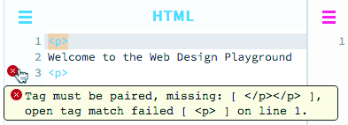

**Figure: Playground error feedback.** The learning loop includes visible syntax feedback. This matters because HTML and CSS are forgiving enough to hide mistakes until layout or accessibility breaks.

**How to apply it:** Use validation and editor feedback immediately after structural edits. Fix unmatched tags, missing closing tags, and malformed attributes before layering on CSS.

**Limitations:** A limited playground checker cannot catch every semantic, accessibility, performance, or cross-browser issue.

## 2. High-Value Mental Models

| Mental Model | Explanation | Helps Solve | Example | Common Misuse |
|---|---|---|---|---|
| HTML is meaning before appearance | HTML should describe what content is: heading, paragraph, link, list, section, navigation, figure, or form-related content. | Accessibility, maintainability, searchability, CSS targeting. | Use `nav` for navigation and headings in order, then style them. | Choosing tags only because of default browser styling. |
| CSS is a rule system over a document tree | Selectors match elements, declarations assign property values, and the cascade decides conflicts. | Debugging why a style applies or does not apply. | A class selector overrides a broad element rule when specificity and order win. | Adding `!important` instead of understanding specificity and order. |
| Every element is a box | Rendering depends on content, padding, border, margin, width, height, and box sizing. | Spacing, overflow, alignment, border, card, and layout bugs. | A card's readable width is content width plus padding, not only the declared width. | Treating margin as internal spacing or ignoring margin collapse. |
| Layout tools have domains | Normal flow, floats, positioning, Flexbox, and Grid solve different layout problems. | Choosing the right CSS mechanism. | Use Flexbox for a nav row and Grid for a page shell. | Building full-page layout with floats because they are familiar. |
| Responsive design is content priority under constraint | Small screens force choices about order, width, image sizing, navigation, and reading rhythm. | Mobile overflow and cramped interfaces. | Stack a sidebar below main content and resize images fluidly. | Shrinking everything while preserving desktop structure. |
| Visual polish should be systematized | Type, color, images, gradients, and selectors need reusable rules, not one-off tweaks. | Consistency across pages. | Define a small color palette and type scale before styling details. | Manually choosing new colors and sizes per element. |
| Validation is feedback, not bureaucracy | HTML/CSS validation catches structural and standards errors early. | Broken rendering, invalid nesting, missing required attributes. | Run W3C validators before publishing. | Assuming a page is correct because it looks okay in one browser. |
| Projects teach integration | The book's projects force structure, content, images, layout, color, and typography to work together. | Moving from snippets to real pages. | Personal home page, landing page, gallery, and portfolio. | Practicing isolated properties without assembling complete interfaces. |

## 3. HTML And CSS Foundations

### HTML as Content Structure

- **Core idea:** HTML is a tree of elements that gives content structure and meaning.
- **Problem solved:** Browsers, assistive technologies, search tools, and CSS need a stable structure to understand and present content.
- **Mechanism:** Elements have opening tags, content, and closing tags; attributes add metadata or behavior; nesting creates parent-child relationships.
- **Production application:** Write semantic markup before detailed styling. Use headings for hierarchy, lists for grouped items, links for navigation, and figure/figcaption for media with captions.
- **Common mistakes:** Skipping heading levels for visual size, using generic containers where semantic elements fit, nesting block and inline content incorrectly, and treating `div` as the default answer.
- **Review questions:** Can someone understand the document outline with CSS disabled? Are links descriptive? Does the source order match the reading order?

### CSS as Presentation Rules

- **Core idea:** CSS separates presentation from markup by applying rules to selected elements.
- **Problem solved:** It lets one content structure have controlled typography, spacing, color, layout, and responsive behavior.
- **Mechanism:** A rule contains a selector and declarations. Selectors match elements; declarations set property-value pairs; conflicts are resolved by cascade, specificity, inheritance, and source order.
- **Production application:** Prefer small, reusable selectors and predictable naming. Keep broad global rules low-risk, then use classes for component behavior. `[Inference]`
- **Common mistakes:** Overly broad selectors, accidental inheritance, relying on default browser styles, and using inline styles that are hard to reuse.

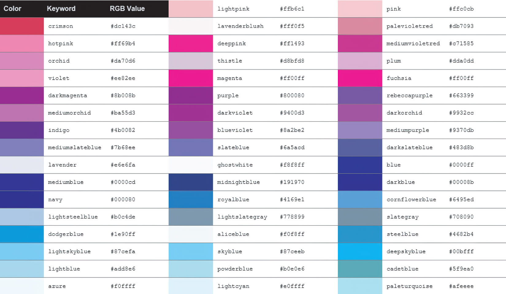

**Figure: CSS color keyword reference.** Color names are convenient for learning, but production design work needs repeatable palettes, contrast checks, and documented token choices.

**How to apply it:** Use keyword colors while learning, then graduate to documented palette values, CSS custom properties, and contrast checks for production interfaces.

**Limitations:** Keyword names are not a design system; they do not encode brand meaning, accessibility contrast, or light/dark-mode behavior.

## 4. Building Complete Pages

The book's project chapters matter because web design is an integration activity. A page is not good because it has valid HTML, attractive colors, or a responsive grid in isolation. It is good when content, hierarchy, layout, media, and behavior work together for the user's task.

### Personal Home Page Workflow

1. Decide the purpose: identity, brief intro, contact or social links, and a small amount of supporting content.
2. Sketch the layout before coding so the page has clear regions.
3. Choose typefaces and colors that support the personal tone rather than distract from content.
4. Build semantic sections first, then style progressively.
5. Check the finished page for hierarchy, spacing, link clarity, and readable line lengths.

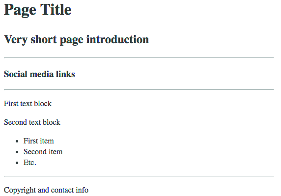

**Figure: Personal homepage project result.** The first project combines text hierarchy, links, social navigation, basic color, and page structure into a complete personal page.

**How to apply it:** Use this project as the first full-page review exercise: identify page title, intro, social links, body content, footer, hierarchy, spacing, and where CSS controls each visual decision.

**Limitations:** The design is intentionally simple. It does not cover complex navigation, forms, accessibility states, CMS integration, or multi-page information architecture.

### Landing Page Workflow

A landing page has one dominant job: communicate an offer and guide the visitor to act. The book's landing project makes this practical through hero imagery, an offer block, testimonials, pricing options, and repeated calls to action.

| Landing Page Part | Design Role | Implementation Concern | Review Question |
|---|---|---|---|
| Hero | Establish the product and emotional frame quickly. | Background image, overlay contrast, heading hierarchy. | Can the visitor understand the offer in a few seconds? |
| Offer details | Explain what is being sold or requested. | Sections, headings, body copy, spacing. | Is the copy scannable? |
| Testimonials | Add credibility. | Cards or grouped quotes. | Do testimonials support the claim or just fill space? |
| Pricing/versions | Help comparison. | Tables/cards, contrast, button states. | Is the recommended action visually clear? |
| CTA | Convert intent into action. | Links/buttons, repetition, states. | Is the primary action obvious without being noisy? |

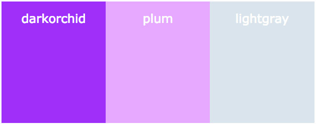

**Figure: Landing page palette.** Project color decisions are made before detailed CSS. The palette sets the emotional direction and gives the implementation a small set of reusable choices.

**How to apply it:** Pick a palette before writing detailed CSS. Convert color choices into named variables or documented swatches so every section participates in the same visual system. `[Inference]`

**Limitations:** A palette is only the starting point. It still needs accessibility contrast checks and testing against imagery and real text lengths.

**Figure: Landing page hero layout.** The landing page project layers content over a strong background and uses repeated calls to action to guide the visitor through the offer.

**How to apply it:** Layer hero text, image, and call-to-action so the offer remains legible at every viewport. Test against the actual image crop, not only an empty layout box.

**Limitations:** Hero imagery can dominate content. If text needs heavy overlays to be readable, reconsider image choice, crop, or layout.

## 5. Images, Media, And Visual Assets

### Image Preparation

- **Core idea:** Web images are content and performance assets at the same time.
- **Problem solved:** Unoptimized images slow pages, overflow layouts, and make designs feel unpolished.
- **Mechanism:** Choose the right format, crop for the intended slot, set intrinsic and responsive dimensions, compress, and remove unused files.
- **When to use:** Every time an image is added as content, decoration, hero media, gallery item, background, custom bullet, or link.
- **Common mistakes:** Uploading camera-original files, using background images for meaningful content, omitting alt text for informative images, and relying on CSS to fix a bad crop.

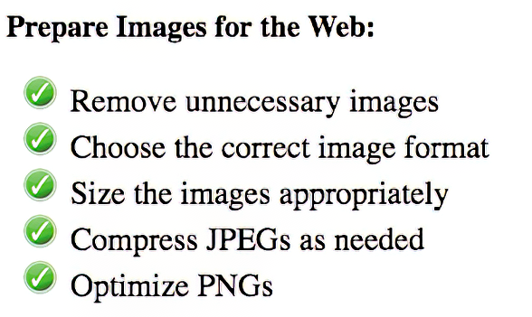

**Figure: Image preparation checklist.** Image work is not just inserting files. The source emphasizes choosing formats, sizing, compressing, and removing unnecessary images before shipping a page.

**How to apply it:** Before adding images, ask: Is this image necessary? Which format fits it? What rendered size is needed? Can it be compressed? Does it need alt text?

**Limitations:** The checklist is introductory. Production sites also need responsive image sources, lazy loading, CDN/cache strategy, and accessibility review. `[Inference]`

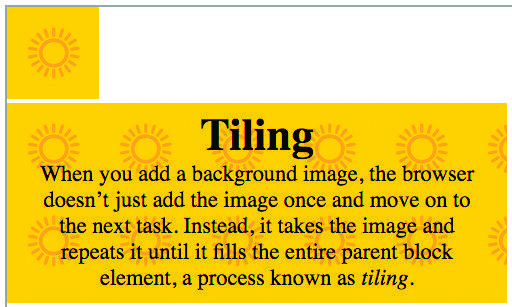

**Figure: Background tiling behavior.** Background images repeat by default. Understanding tiling, repeat control, position, and size prevents accidental visual noise.

**How to apply it:** When a background appears unexpectedly repeated, inspect `background-repeat`, `background-position`, `background-size`, and the element dimensions before changing the image itself.

**Limitations:** Background images are usually decorative. If the image carries meaning, prefer an `img` or `figure` so it participates in document semantics.

**Figure: Hero image example.** A hero image creates immediate visual context, but it must support the page message and remain legible with foreground text.

**How to apply it:** Treat hero media as part of the message. Choose an image that supports the page promise and verify text contrast over the exact crop used on desktop and mobile.

**Limitations:** A beautiful hero does not fix unclear content. It can also hurt performance when oversized or poorly compressed.

## 6. CSS Box, Flow, Float, And Positioning

### Normal Flow and the Box Model

Normal flow is the browser's default layout algorithm. Block elements stack vertically; inline content flows within lines. The box model then decides how much space each element occupies.

| Box Concept | What It Controls | Typical Bug | Fix Direction |
|---|---|---|---|
| Content | Actual text or media area. | Text line too long or image too wide. | Set max width or responsive sizing. |
| Padding | Internal breathing room. | Text touches card edge. | Add padding to the element. |
| Border | Visual edge around padding/content. | Border changes total width unexpectedly. | Use `box-sizing: border-box`. `[Inference]` |
| Margin | External spacing between boxes. | Unexplained gaps or collapsed margins. | Inspect adjacent vertical margins. |

### Floats and Pull Quotes

Floats remain useful for editorial effects, but they are not the right default for modern page layout.

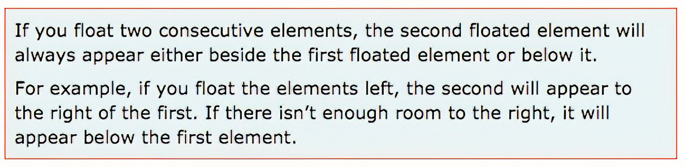

**Figure: Float placement example.** Floats remove an element from the normal text stream enough to let content wrap around it; this is useful for editorial effects but weak as a page layout system.

**How to apply it:** Use floats when you specifically want inline content to wrap around a box, such as an image, drop cap, or pull quote. Clear them when following content must start below.

**Limitations:** Floats can cause container collapse and awkward wrapping. For structural layout, prefer Flexbox or Grid.

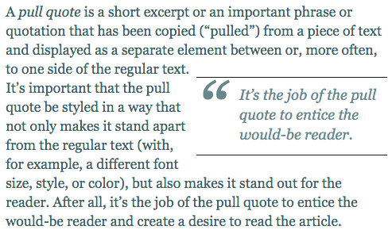

**Figure: Pull quote example.** A pull quote is a content-emphasis pattern. The CSS mechanics are float, width, spacing, border or typographic contrast, and clear reading order.

**How to apply it:** Use pull quotes to reinforce important text, not to introduce new information. Keep source order readable even if the visual quote floats.

**Limitations:** A pull quote is duplicated/emphasized content. Overuse weakens scanning and can confuse assistive technology if implemented carelessly. `[Inference]`

### Positioning

CSS positioning moves elements relative to normal position, containing blocks, viewport, or scroll position depending on the positioning mode.

| Positioning Mode | Mental Model | Use For | Avoid For |
|---|---|---|---|
| Relative | Keep original space, visually offset the element. | Small adjustments, anchoring absolute children. | Major layout structure. |
| Absolute | Remove from normal flow and place against containing block. | Badges, overlays, controlled decorative placement. | Content that must push other content. |
| Fixed | Place against viewport. | Persistent controls or banners. | Large content on small screens. |
| Sticky | Behave normally until scroll threshold, then stick. | Section headers, local navigation. | Unsupported assumptions without testing. |

## 7. Layout: Semantic Regions, Flexbox, And Grid

### Semantic Layout Regions

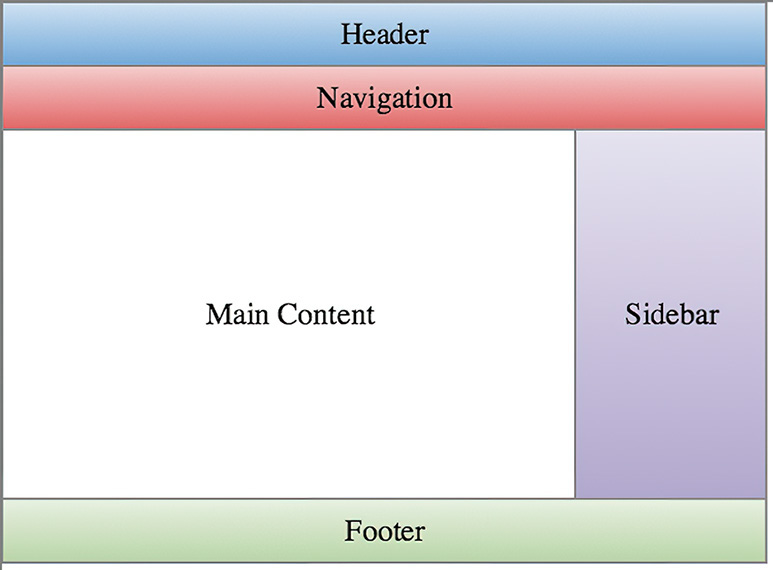

**Figure: Holy grail layout.** The classic header, nav, main, sidebar, and footer layout is a useful test case for understanding why modern layout tools replaced float-based hacks.

**How to apply it:** Use this as a layout literacy exercise: identify the regions, then decide whether source order, Flexbox, or Grid best expresses the intended relationships.

**Limitations:** The pattern is not mandatory for every page. Many modern pages need simpler sections, dashboards, split panes, or content-specific layouts.

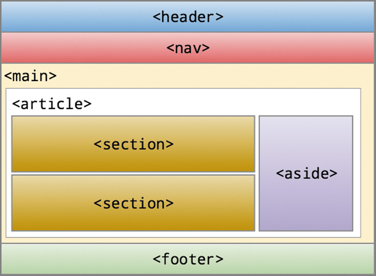

**Figure: Semantic page regions.** Semantic HTML names page regions by purpose. It improves authoring clarity and helps accessibility and maintainability when the visual layout changes.

**How to apply it:** Map visual regions to semantic elements where possible: `header`, `nav`, `main`, `article`, `section`, `aside`, and `footer`. Then let CSS control arrangement.

**Limitations:** Semantic elements do not automatically create good accessibility. Headings, labels, link text, focus behavior, and reading order still matter. `[Inference]`

### Flexbox: One-Dimensional Layout

Flexbox is the tool for distributing items along one primary axis. It answers questions like: Should items run left-to-right or top-to-bottom? Should they wrap? How should leftover space be distributed? How should items align across the other axis?

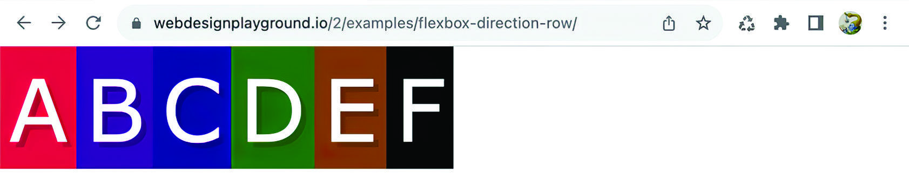

**Figure: Flex direction order.** Flexbox turns a row or column of items into a controllable distribution problem: direction, ordering, spacing, wrapping, and alignment.

**How to apply it:** Start every Flexbox decision by naming the main axis. `flex-direction` changes the axis; ordering and alignment should be reasoned from that axis, not from the screen alone.

**Limitations:** Visual reordering can diverge from source order. Use it carefully because keyboard and screen-reader order may still follow the document. `[Inference]`

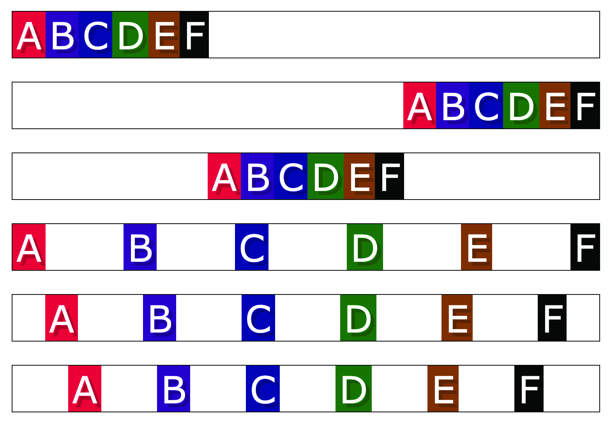

**Figure: Flex wrapping and alignment.** When there is not enough space, flex items can wrap. Alignment rules then decide how rows and leftover space are distributed.

**How to apply it:** Use wrapping when items may exceed available width. Then set alignment deliberately so each row or column has predictable spacing.

**Limitations:** Wrapping does not replace responsive design. At certain widths, content may still need different sizing, stacking, or navigation patterns.

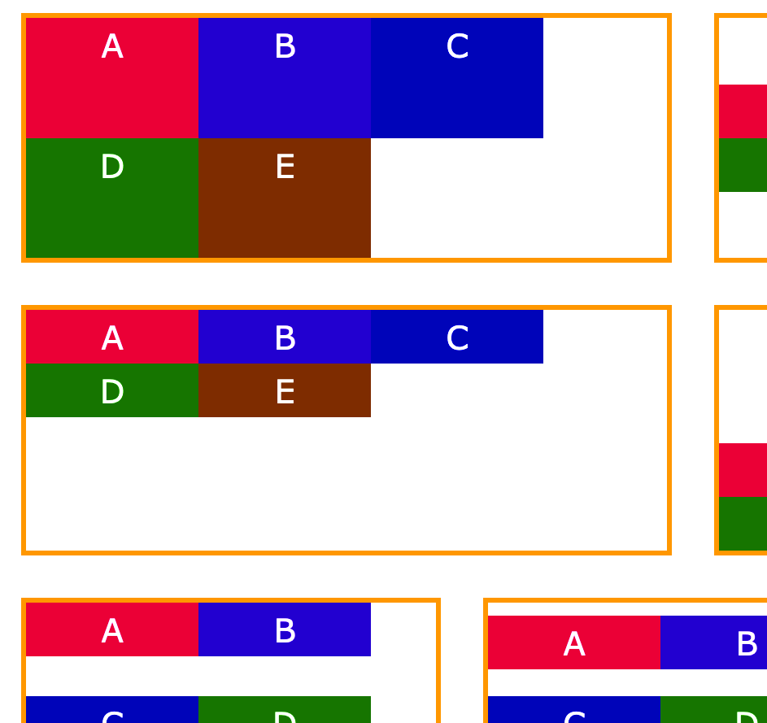

**Figure: Flexbox layout options.** Flexbox is ideal for one-dimensional layout decisions: distribute nav items, align cards, center content, or adapt a row of controls.

**How to apply it:** Use Flexbox for nav bars, button groups, card rows, centered content, equal-height rows, and small component layout.

**Limitations:** For layouts where row and column placement both matter, Grid is usually clearer.

### Grid: Two-Dimensional Layout

Grid is a layout system for rows and columns together. It is the better tool when the page has named regions or when item placement must align both horizontally and vertically.

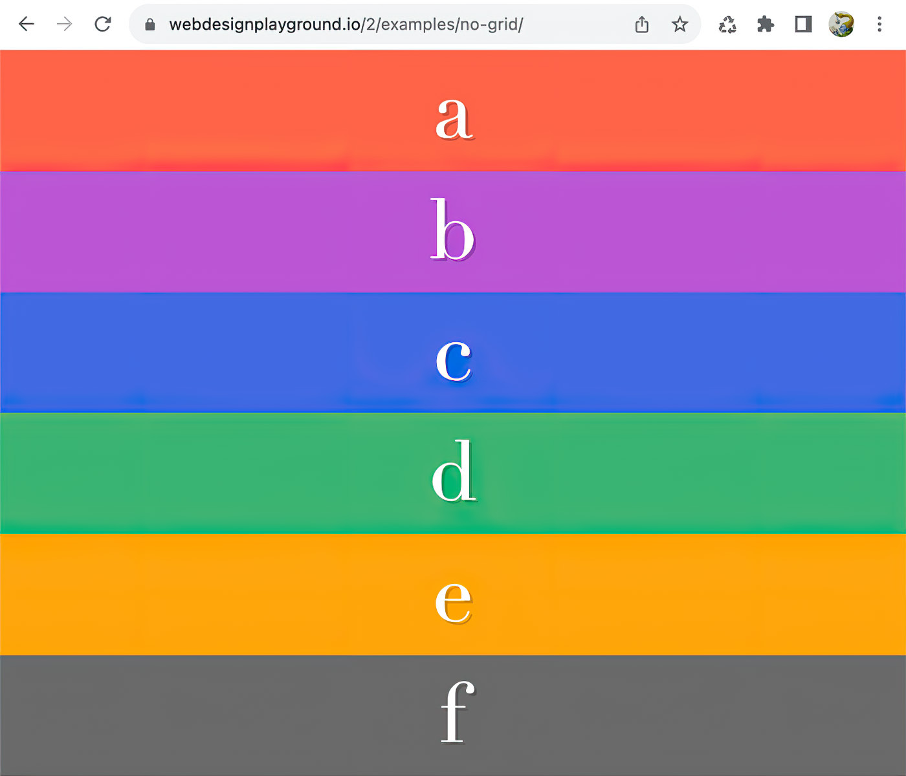

**Figure: Grid row layout.** Grid lays out two dimensions at once. The same items can be arranged into deliberate rows and columns instead of relying on flow alone.

**How to apply it:** Use Grid when the layout has an intentional matrix. Define tracks first, then place items into that structure.

**Limitations:** Grid can become over-specified. If content naturally flows as a simple row or column, Flexbox or normal flow may be simpler.

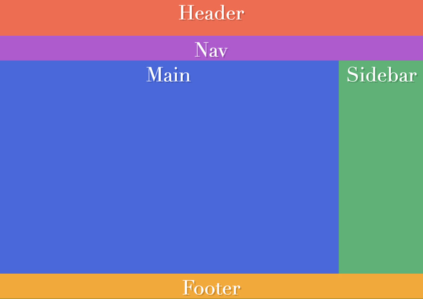

**Figure: Grid page layout.** CSS Grid maps naturally to full-page regions, including headers, sidebars, main content, and footers.

**How to apply it:** A page shell maps well to Grid because header, nav, main, sidebar, and footer are two-dimensional regions.

**Limitations:** A good grid still needs responsive rules. Desktop grid areas may need to stack or reorder on narrow screens.

## 8. Responsive Design

Responsive design is the book's bridge from static layouts to real device constraints. The key shift is from fixed measurements to flexible relationships.

### Responsive Layout Mechanics

- **Use flexible dimensions:** Prefer percentages, max-width, `rem`, `em`, viewport units, and content-based constraints where they preserve readability.
- **Set the viewport correctly:** Mobile browsers need the viewport meta tag so CSS pixels map predictably to device width.
- **Use media queries for meaningful breakpoints:** Breakpoints should respond to layout stress, not only popular device widths. `[Inference]`
- **Make images fluid:** Prevent horizontal scrolling by constraining media to the container.
- **Tune typography:** Font sizes, line length, and spacing need to remain readable as width changes.

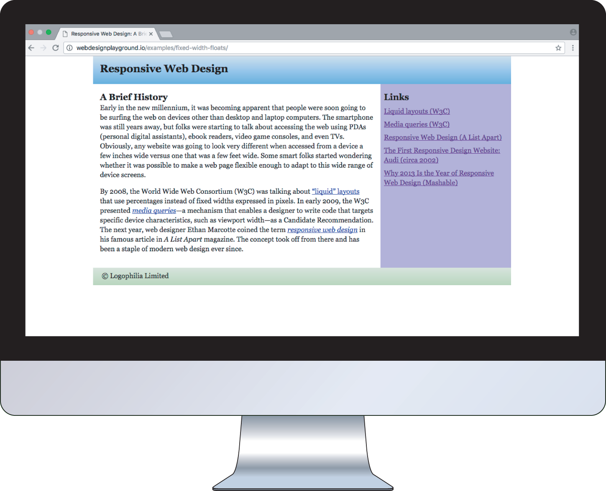

**Figure: Responsive desktop layout.** Responsive design begins with a layout that can change. Fixed desktop assumptions must be challenged before testing on small screens.

**How to apply it:** Start from the full layout, then actively test where it breaks as width shrinks. A responsive breakpoint should fix a real failure, not satisfy an arbitrary device list.

**Limitations:** A desktop screenshot can hide future mobile problems. Always test the same content at narrow, medium, and wide widths.

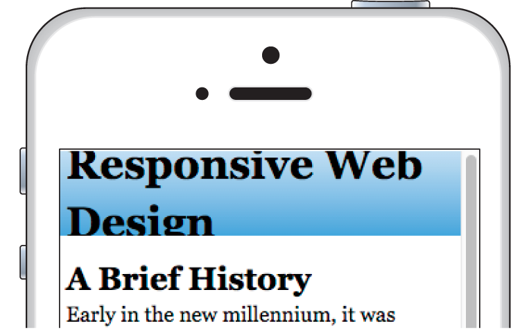

**Figure: Responsive phone layout.** The narrow viewport forces content priority decisions: what stacks, what shrinks, what moves, and what must remain readable.

**How to apply it:** On small screens, preserve reading order and task flow. Sidebars often become lower sections, nav becomes compact, and images must fit the content column.

**Limitations:** Small-screen success is not just avoiding overflow; it includes readable type, reachable controls, and clear hierarchy.

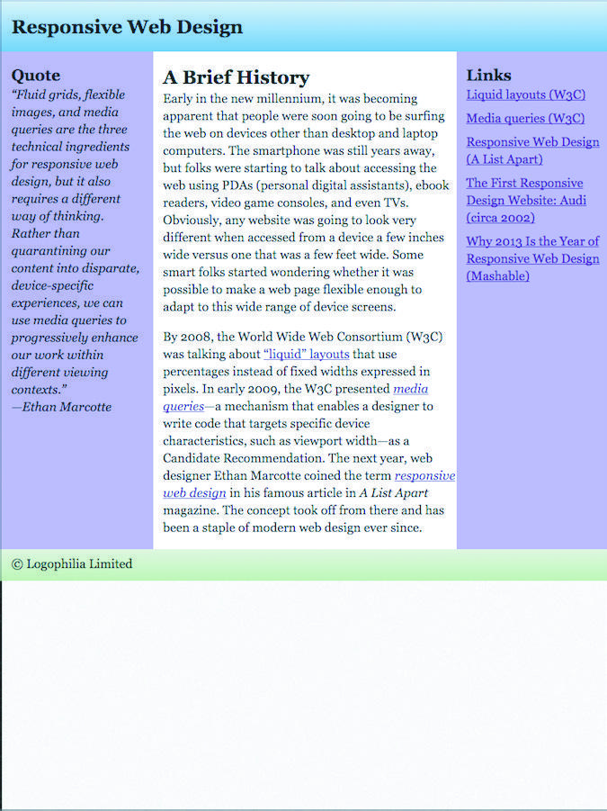

**Figure: Responsive reflow layout.** The same content can reflow into a different structure. This is the practical target of media queries, flexible sizing, and responsive typography.

**How to apply it:** Use reflow as a design tool: decide which regions should stack, which stay adjacent, and which visual details can disappear.

**Limitations:** Reflow can create awkward content order if the original HTML was written only for desktop visual placement.

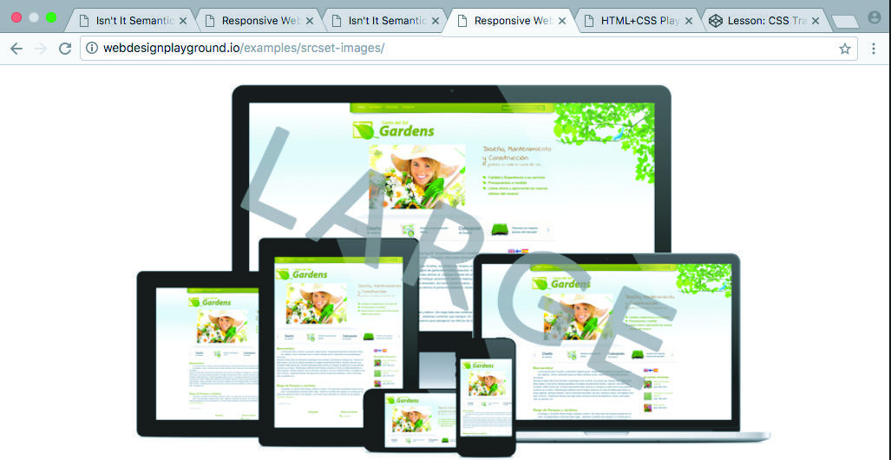

**Figure: Responsive image scaling.** Images need responsive constraints so they do not overflow, distort, or force horizontal scrolling.

**How to apply it:** Set images to scale within their containers and keep aspect ratio. Combine CSS constraints with appropriately sized source files.

**Limitations:** CSS scaling a giant image down does not solve network cost. Production pages may need `srcset`, `sizes`, lazy loading, and image CDNs. `[Inference]`

## 9. Color And Typography

### Color as a System

Color in the source progresses from names and RGB values to color pickers, color wheels, harmonies, and gradients. The practical lesson is to treat color as a system of decisions.

| Color Decision | Good Question | Implementation Note |
|---|---|---|
| Base palette | What mood and brand signal should the page create? | Document hex/RGB/HSL values. |
| Contrast | Can the text be read in context? | Test foreground/background pairs. `[Inference]` |
| State colors | How do hover, active, focus, success, and error states differ? | Use consistent tokens. `[Inference]` |
| Gradients | Does the transition support depth or distract? | Control direction and stop placement. |
| Dark mode | Does each semantic role have an equivalent? | Do not invert randomly; remap tokens. `[Inference]` |

**Figure: Additive color model.** CSS screen color is additive. RGB channel reasoning helps explain why digital color mixing differs from paint mixing.

**How to apply it:** Think in screen channels when writing CSS colors: red, green, blue, and alpha combine as emitted light.

**Limitations:** The RGB model explains CSS syntax but not full perception, accessibility, or brand harmony.

**Figure: Color wheel variants.** The color wheel supports complementary, analogous, triadic, and other harmony choices. It is a decision aid, not a substitute for contrast and context.

**How to apply it:** Use the wheel to generate candidate harmonies, then test those candidates against content, contrast, and page mood.

**Limitations:** Harmony is not accessibility. Colors can harmonize and still fail contrast or semantic clarity.

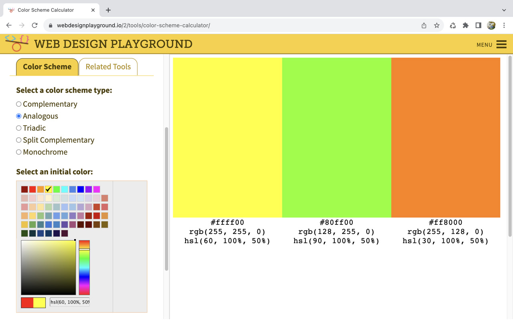

**Figure: Color picker tool.** The source uses tools to move from theory to implementation: choose a color, capture its code, and apply it consistently.

**How to apply it:** Capture implementation-ready values from a tool, then name them by role: background, text, accent, border, warning, success. `[Inference]`

**Limitations:** Tool-selected colors can drift into too many one-off values unless consolidated into a palette.

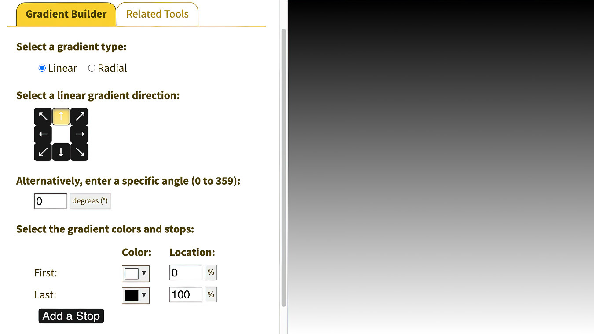

**Figure: Gradient builder.** Gradients are controlled transitions, not decoration by default. Direction, stops, opacity, and contrast determine whether the effect supports the content.

**How to apply it:** Use gradients when a transition adds hierarchy, depth, or atmosphere without reducing readability. Keep stop choices deliberate.

**Limitations:** Gradients are easy to overuse. Text over gradients must be tested at all responsive crops.

### Typography as Reading Design

Typography is not just choosing a pretty font. It controls how quickly a reader understands structure and how comfortably they continue reading.

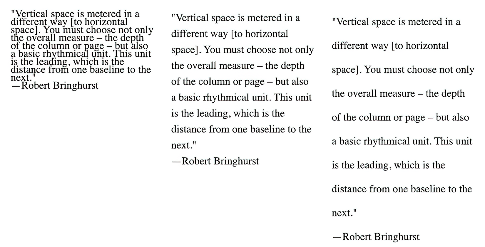

**Figure: Typography rhythm example.** Typography controls reading rhythm through font family, scale, line length, line height, spacing, and contrast.

**How to apply it:** Review type as a system: headings, body text, line height, measure, spacing, emphasis, and lists must work together.

**Limitations:** A single screenshot cannot prove typography works. Test real content lengths, long words, links, and mobile widths.

## 10. Advanced Selectors And Maintainable CSS

Advanced selectors let CSS express document relationships: descendants, children, siblings, first/last/nth children, pseudo-classes, and combined selectors. They are useful when the HTML structure itself carries meaning.

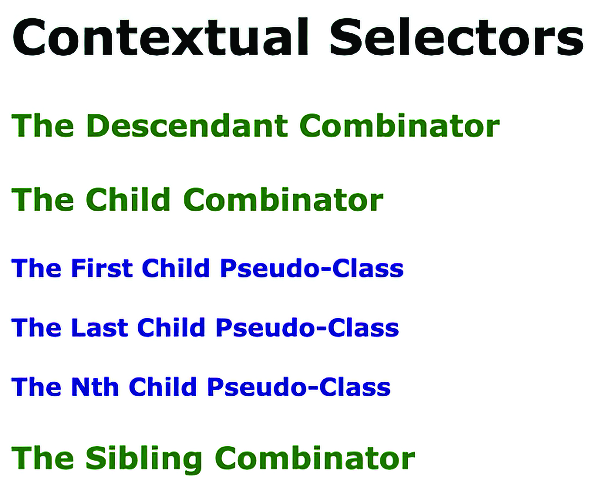

**Figure: Contextual selectors map.** Advanced selectors express relationships in the document tree. They are powerful, but they increase coupling between CSS and HTML structure.

**How to apply it:** Use relationship selectors to style content based on context, such as list items inside a nav or paragraphs after a heading.

**Limitations:** Deep contextual selectors couple CSS to DOM shape. If markup changes often, use simpler classes or component boundaries. `[Inference]`

### Selector Decision Guide

| Need | Prefer | Why | Watch For |
|---|---|---|---|
| Global base style | Element selector | Establishes defaults. | Broad unintended effects. |
| Reusable component | Class selector | Stable and explicit. | Class sprawl without naming conventions. |
| One unique page anchor | ID attribute for anchor, class for styling | IDs are useful targets but high specificity for CSS. | Hard-to-override styles. |
| Context-specific child | Child/descendant selector | Encodes structural relationship. | Fragility if HTML changes. |
| Interaction state | Pseudo-class | Styles links, focus, hover, active states. | Missing keyboard focus states. `[Inference]` |

## 11. Portfolio And Gallery Integration

### Photo Gallery Project

The gallery project combines branding, color restraint, media-heavy content, navigation, captions, and a page shell. The key lesson is that image-centered pages should let images lead while the surrounding UI remains quiet and predictable.

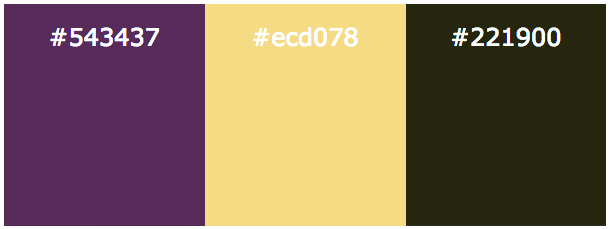

**Figure: Photo gallery palette.** The gallery project uses a restrained palette that lets photography carry the visual weight.

**How to apply it:** Use restrained colors around photography. The UI should frame the images rather than compete with them.

**Limitations:** A palette that works for one photo set may fail with another; test against real image content.

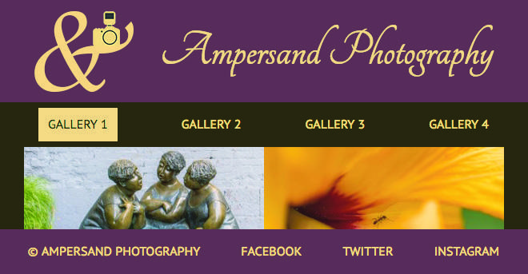

**Figure: Photo gallery navigation result.** The gallery combines branding, navigation, image groups, hover/active states, and a footer into a cohesive visual system.

**How to apply it:** Use navigation states to help visitors understand where they are in a gallery. Active states, hover states, and labels should remain readable over the chosen palette.

**Limitations:** Visual navigation is not enough; link text, focus state, and source order still need accessibility review. `[Inference]`

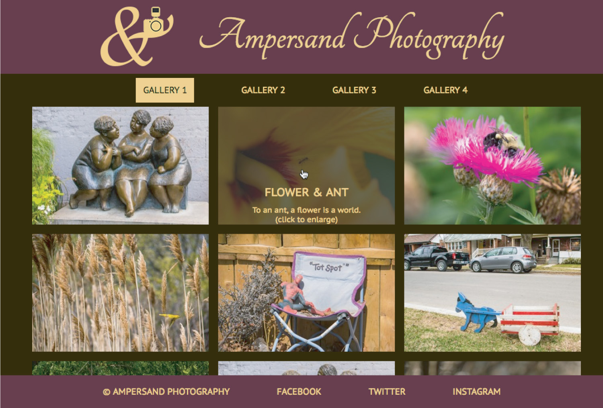

**Figure: Complete photo gallery page.** The full gallery result shows how layout, images, navigation, captioning, and palette work together as one interface.

**How to apply it:** Evaluate the whole page, not just the grid: brand mark, nav, image rhythm, captions, footer, and spacing all contribute to trust.

**Limitations:** The screenshot does not cover loading performance, responsive image source selection, or keyboard navigation.

### Portfolio Project

The portfolio project moves from a simple page to a professional-looking site. The important design lesson is coherence: page sections, palette, navigation, media, and contact affordances all support the same identity.

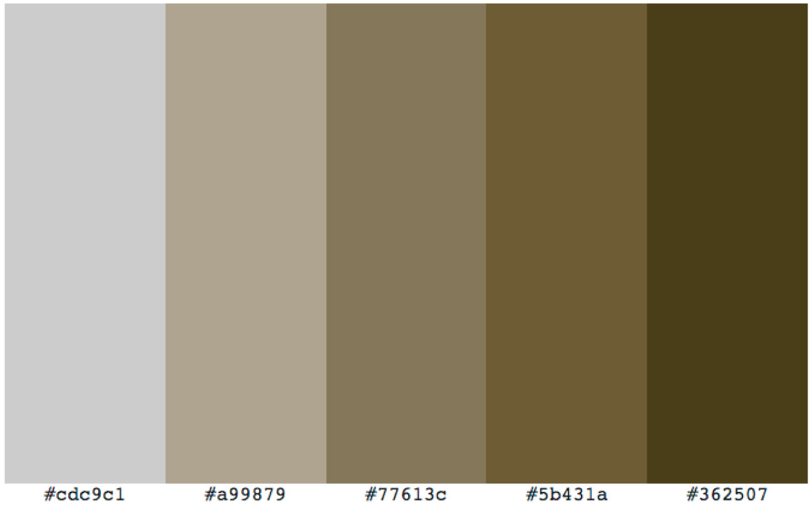

**Figure: Portfolio color scheme.** The portfolio project begins with a muted palette that matches the restoration theme and avoids competing with portfolio images.

**How to apply it:** Choose a palette that matches subject matter. A restoration portfolio benefits from subdued, archival-feeling colors rather than high-saturation UI colors.

**Limitations:** Subject-fit is contextual. A different portfolio domain might need a very different palette.

**Figure: Portfolio mobile result.** The portfolio result demonstrates that finished design must survive small-screen reading, navigation, and content hierarchy.

**How to apply it:** Review final pages at mobile widths, not only component snippets. The portfolio still needs readable text, reachable navigation, and meaningful image presentation.

**Limitations:** A mobile screenshot does not cover touch target size, focus order, or performance; those require separate checks. `[Inference]`

## 12. Validation, Publishing, And Production Readiness

The appendix moves from playground work to real web publishing. The engineering lesson is that a page is not finished when it renders locally; it needs organized files, validation, hosting, upload, and post-upload verification.

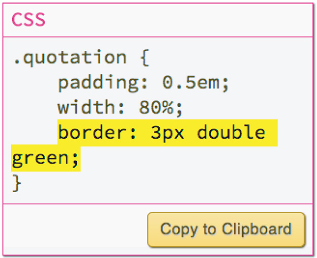

**Figure: CSS validation feedback.** Validation turns hidden syntax and standards mistakes into fixable feedback before deployment.

**How to apply it:** Run CSS validation when a rule does not behave as expected and before publishing. Syntax errors can cause later declarations to be ignored.

**Limitations:** Validation checks syntax and standards, not design quality, accessibility, or maintainability.

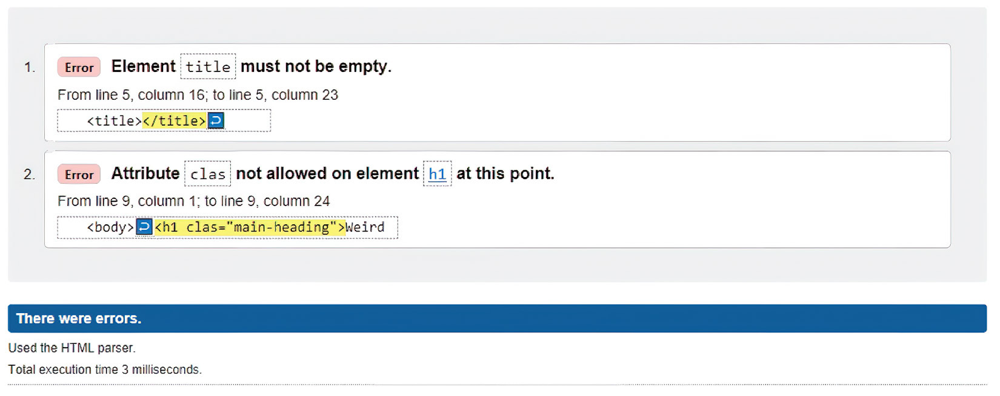

**Figure: HTML validation success.** A clean validator result is not proof of good design, but it removes a class of structural errors that can harm rendering and accessibility.

**How to apply it:** Use a clean validation pass as a release gate for static pages. It reduces malformed markup surprises in browsers and tools.

**Limitations:** Valid HTML can still be inaccessible, slow, confusing, or visually weak. Treat validation as one gate among several.

### Static Page Release Checklist

| Area | Check | Why It Matters |
|---|---|---|
| File organization | HTML, CSS, images, and media are in predictable folders. | Broken relative paths are common when moving from playground to host. |
| HTML validity | W3C validator reports no structural errors. | Invalid nesting and missing attributes can break rendering or accessibility. |
| CSS validity | CSS validator reports no syntax errors. | Invalid CSS can silently drop rules. |
| Responsive layout | Test narrow, medium, and wide viewports. | Desktop-only pages fail real users. |
| Images | Correct format, dimensions, compression, alt text, and responsive behavior. | Images drive both visual quality and performance. |
| Links | Internal, external, social, image, and nav links work after upload. | Relative paths often change when deployed. |
| Accessibility basics | Heading order, link text, keyboard focus, color contrast. | Valid markup alone is not accessible. `[Inference]` |
| Hosting verification | Open the public URL and test assets from the deployed location. | Local success does not guarantee hosted success. |

## 13. Troubleshooting Playbook

| Symptom | Likely Cause | Investigation | Repair |
|---|---|---|---|
| Style does not apply | Selector mismatch, specificity loss, wrong file path, cache. | Inspect selector, devtools matched rules, stylesheet loading. | Fix selector, load order, or class; avoid random `!important`. |
| Text has unexpected font | Inheritance or missing font fallback. | Inspect computed `font-family`. | Define font stack at body or component level. |
| Page has horizontal scroll on mobile | Fixed width, oversized image, grid/flex item overflow. | Narrow viewport and inspect widest element. | Use max-width, fluid tracks, wrapping, or media query. |
| Margins look too large | Vertical margin collapse. | Inspect adjacent block margins. | Use padding, border, flex/grid gap, or margin reset. |
| Float overlaps following content | Missing clear or container collapse. | Inspect float and parent height. | Clear after float or use modern layout. |
| Hero text unreadable | Weak contrast against image crop. | Test all responsive crops. | Change image, add overlay, move text, or adjust palette. |
| Grid layout breaks at narrow widths | Desktop tracks are fixed or too many columns. | Inspect grid template at viewport widths. | Change tracks or stack areas with media query. |
| Validator reports errors | Malformed HTML/CSS syntax. | Read first error first; later errors can cascade. | Fix root syntax issue and rerun. |

## 14. Visual Inventory

| Classification | Count | Handling |
|---|---:|---|
| High-value embedded visuals | 35 | Extracted, saved under `knowledge/assets/web-design-playground-knowledge/`, and embedded beside the concepts they support. |
| Reference-only candidate visuals | 195 | Reviewed as candidate images but not embedded because they duplicate similar before/after states, show small intermediate project steps, or are too specific for the reusable knowledge flow. |
| Decorative/duplicate/extraction-noise visuals | 439 occurrences | Includes repeated small page markers, cover/barcode assets, UI chrome fragments, repeated image instances, and low-value crops. |

The raw PDF image pass found 669 image occurrences and 256 unique hashes. The curated set favors visuals that teach durable concepts: playground feedback, project integration, image preparation, flow/float, layout systems, responsiveness, color, typography, selectors, validation, and publishing readiness.

## 15. Coverage Ledger

| Book Section | Coverage Method | Result |
|---|---|---|
| Front matter and table of contents | Parsed text pages | Used for metadata, structure, and chapter map. |
| Chapters 1-20 | Full text extraction by page | Covered in learning roadmap, concept notes, decision guides, and playbooks. |
| Appendix | Full text extraction by page | Covered in validation, hosting, and publishing readiness sections. |
| Visuals | `pypdf` image extraction, dedupe by hash, thumbnail review | 669 occurrences found; 35 high-value visuals embedded. |
| Code listings | Parsed as text where extractable | Converted into concepts and review criteria rather than reproduced wholesale. |

## 16. Final Validation

- **Source coverage method used:** Full text extraction by page with `pypdf`; all 442 physical PDF pages were parsed, with chapter coverage from front matter through index and appendix. Image extraction was local and deduped by hash.
- **Extracted visual count:** 35 curated high-value visuals saved locally for this knowledge file; raw PDF pass found 669 image occurrences and 256 unique image hashes.
- **Embedded/explained visual count:** 35.
- **Reference-only visual count:** 195 candidate visuals reviewed but not embedded.
- **Decorative/duplicate/extraction-noise count:** 439 image occurrences.
- **Missing local asset link count:** 0 expected after validation.
- **Manual-review-needed count:** 0 for extraction; current browser support, accessibility requirements, and deployment tooling should still be verified before production use. `[Inference]`
